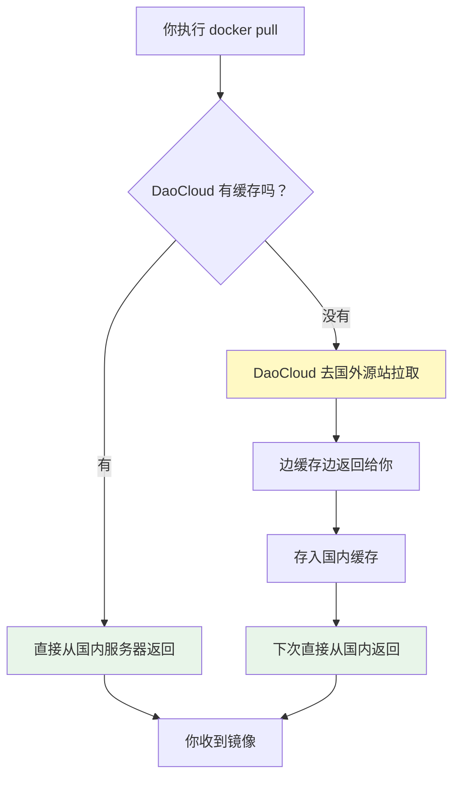

## 前言

Docker 软件本身在中国大陆可以正常安装和使用，但**Docker Hub（`docker.io`）作为官方镜像仓库，访问受到限制**。直接执行 `docker pull` 拉取镜像时，往往会遇到连接超时或下载失败的问题。解决这个问题的核心思路是**使用国内镜像加速服务**，但在实际操作中，开发者常会遇到一系列困惑：为什么有些镜像不需要改命令，有些却必须加一串前缀？拉下来的镜像名字为什么变长了？镜像加速背后的原理又是什么？

本文按照“命名原理 → 加速配置 → 特殊场景 → 底层机制”的逻辑链条，系统梳理在中国大陆使用 Docker 镜像的完整知识体系。

---

## Docker 镜像命名的隐藏规则

要理解镜像加速，必须先理解 Docker 镜像是如何命名的。

### 你看到的 vs. 实际发生的

当你执行：

```bash
docker pull redis:8.6.4-trixie
```

Docker 在内部会自动补全成：

```bash
docker pull docker.io/library/redis:8.6.4-trixie
```

也就是说，平时我们使用的短命令省略了两个部分：

| 你输入的 | Docker 内部补全的 |
|---------|----------------|
| `redis:8.6.4-trixie` | `docker.io/library/redis:8.6.4-trixie` |
| `bitnami/redis:latest` | `docker.io/bitnami/redis:latest` |
| `nginx` | `docker.io/library/nginx:latest` |

### 省略规则的本质

- **Registry（镜像仓库地址）**：不指定时，默认是 `docker.io`（即 Docker Hub）
- **Namespace（命名空间）**：不指定时，默认是 `library`（即 Docker 官方维护的镜像）
- **Tag（标签）**：不指定时，默认是 `latest`

**这个省略规则只对 `docker.io` 生效**。对于其他 Registry，比如 Google 的 `gcr.io`、GitHub 的 `ghcr.io`、Elastic 的 `docker.elastic.co`，Docker 不会做任何自动补全，必须写完整地址：

```bash
# 错误，Docker 不会自动识别 gcr.io
docker pull google-containers/pause

# 正确，必须写完整
docker pull gcr.io/google-containers/pause:3.9
```

理解这一点至关重要，因为**镜像加速的配置是否生效，完全取决于镜像来自哪个 Registry**。

---

## 国内镜像加速方案：registry-mirrors

### 配置方法

Docker 提供了 `registry-mirrors` 机制，专门用于给 Docker Hub（`docker.io`）配置镜像加速地址。在 Windows 上，编辑 `~/.docker/daemon.json`：

```json
{
  "registry-mirrors": [
    "https://docker.m.daocloud.io",
    "https://mirror.ccs.tencentyun.com"
  ]
}
```

修改后需要重启 Docker Desktop 使配置生效。

### 验证配置

重启后，通过 `docker info` 查看：

```
Registry Mirrors:
  https://docker.m.daocloud.io/
  https://mirror.ccs.tencentyun.com/
```

如果能看到配置的地址，说明加速已启用。

### 为什么配置了就不用改命令？

因为 `registry-mirrors` 是 Docker 内置的机制，它的工作逻辑是：

1. 你执行 `docker pull redis:8.6.4-trixie`
2. Docker 内部解析为 `docker.io/library/redis:8.6.4-trixie`
3. Docker 发现 `docker.io` 配置了镜像加速
4. 自动转向 `https://docker.m.daocloud.io/library/redis:8.6.4-trixie`
5. 镜像拉取完成后，本地保存的名称仍然是 `redis:8.6.4-trixie`

**整个过程对使用者完全透明**，命令不用改，镜像名也不会变长。

### 常用国内镜像源

| 提供商 | 加速地址 | 备注 |
|--------|---------|------|
| DaoCloud | `https://docker.m.daocloud.io` | 公开服务，限流 |
| 腾讯云 | `https://mirror.ccs.tencentyun.com` | 腾讯云用户优先 |
| 阿里云 | `https://<你的ID>.mirror.aliyuncs.com` | 需登录阿里云获取专属地址 |

> 注意：阿里云专属加速器有时效性，地址可能失效或需要重新登录获取。

---

## 非 Docker Hub 镜像怎么办？

### 核心限制

`registry-mirrors`**只对 `docker.io` 生效**。对于其他 Registry，比如：

- `docker.elastic.co`（Elastic 官方）
- `gcr.io`（Google Container Registry）
- `ghcr.io`（GitHub Container Registry）
- `quay.io`（RedHat Quay）
- `registry.k8s.io`（Kubernetes 官方）

Docker 不会自动走 `registry-mirrors` 加速，必须**手动改写镜像地址**。

### DaoCloud 的两种改写方式

#### 方式一：加前缀（推荐）

在完整镜像地址前加 `m.daocloud.io/`：

```bash
# 原命令（慢或失败）
docker pull docker.elastic.co/elasticsearch/elasticsearch:9.4.2

# 加速后
docker pull m.daocloud.io/docker.elastic.co/elasticsearch/elasticsearch:9.4.2
```

#### 方式二：前缀替换

DaoCloud 为常用 Registry 提供了短域名映射：

| 源站 | 替换为 |
|------|--------|
| `docker.elastic.co` | `elastic.m.daocloud.io` |
| `gcr.io` | `gcr.m.daocloud.io` |
| `ghcr.io` | `ghcr.m.daocloud.io` |
| `registry.k8s.io` | `k8s.m.daocloud.io` |
| `mcr.microsoft.com` | `mcr.m.daocloud.io` |
| `quay.io` | `quay.m.daocloud.io` |

示例：

```bash
docker pull elastic.m.daocloud.io/elasticsearch/elasticsearch:9.4.2
```

### 拉下来后镜像名会变长吗？

**会**。如果你用加前缀的方式拉取（而非用配置镜像站的方式）：

```bash
docker pull m.daocloud.io/docker.elastic.co/elasticsearch/elasticsearch:9.4.2
```

本地保存的镜像名就是：

```
m.daocloud.io/docker.elastic.co/elasticsearch/elasticsearch:9.4.2
```

这个名字很长，用起来不方便。如果真这样了，可以用 `docker tag` 重命名：

```bash
docker tag m.daocloud.io/docker.elastic.co/elasticsearch/elasticsearch:9.4.2 \
  elasticsearch:9.4.2
```

然后删除长名字的标签即可（不会删除实际数据，因为 IMAGE ID 相同）：

```bash
docker rmi m.daocloud.io/docker.elastic.co/elasticsearch/elasticsearch:9.4.2
```

---

## DaoCloud 加速的底层原理

DaoCloud 的公开镜像加速服务（`public-image-mirror`）本质上是一个**透传缓存（Pull-through Cache）**，也叫**懒加载缓存**。

### 工作流程



#### 第一次拉取（冷启动）

DaoCloud 也没有这个镜像，它需要从国外源站同步。此时速度和你直接拉差不多，甚至可能稍慢（因为多了中间层）。

#### 第二次拉取（缓存命中）

任何人再拉同一个镜像，DaoCloud 直接从国内服务器返回，**不需要再去国外**。这就是加速的本质。

### 技术细节

| 机制 | 说明 |
|------|------|
| **懒加载** | 不会预先把所有镜像同步到国内，而是“谁用谁拉” |
| **内容一致性** | 缓存的镜像 sha256 哈希和源站完全一致，不会被篡改 |
| **Manifest 缓存** | 镜像索引在内存中缓存 1 小时，tag 更新后有延迟 |
| **Blob 缓存** | 实际的镜像层数据缓存 1 分钟 |
| **磁盘保留期** | 缓存内容保留 30 天，30 天内无人访问则删除 |

### 为什么建议不用 `latest` tag？

因为 Manifest 缓存了 1 小时，如果上游 `latest` 标签更新了，DaoCloud 在缓存过期前仍会返回旧的索引，导致你拉到的不是最新版本。因此**生产环境务必使用明确的版本号**。

### 限流与使用建议

DaoCloud 是免费公共服务，有白名单和限流机制。建议：

- **凌晨 1-7 点（北京时间）拉取大镜像**，其他时段非常拥挤
- 使用明确的版本号 tag
- 镜像不在白名单中时可以提 Issue 申请添加

### DaoCloud 为什么免费做这件事？

DaoCloud（道客网络）是一家中国的云原生技术公司，主要卖企业级 Kubernetes 平台。免费做镜像加速的动机是**半公益半商业**：

- **品牌曝光**：精准触达开发者群体，比打广告更高效
- **技术背书**：能稳定运营大规模镜像分发，本身就是技术实力的证明
- **生态建设**：云原生生态越繁荣，潜在客户越多，免费服务是在培养未来的付费用户

这和 JetBrains 对学生免费、GitHub 提供免费仓库的商业逻辑是一致的。

---

## 实用技巧汇总

### 快速判断镜像来自哪个 Registry

| 你的命令 | 实际 Registry | 是否需要手动加速 |
|---------|-------------|----------------|
| `docker pull redis` | `docker.io` | ❌ 自动走 registry-mirrors |
| `docker pull bitnami/redis` | `docker.io` | ❌ 自动走 registry-mirrors |
| `docker pull gcr.io/xxx` | `gcr.io` | ✅ 手动加前缀 |
| `docker pull docker.elastic.co/xxx` | `docker.elastic.co` | ✅ 手动加前缀 |

### 镜像名太长怎么办？

```bash
# 拉取长名字镜像
docker pull m.daocloud.io/gcr.io/google-containers/pause:3.9

# 重命名为短名字
docker tag m.daocloud.io/gcr.io/google-containers/pause:3.9 pause:3.9

# 删除长名字标签
docker rmi m.daocloud.io/gcr.io/google-containers/pause:3.9
```

### 检查当前生效的镜像源

```bash
docker info | grep -A 5 "Registry Mirrors"
```

---

## 镜像推送（push）与代理的冲突

以上讨论的全都是**拉取（pull）**镜像的场景。如果你需要**推送（push）镜像到 Docker Hub**，情况完全不同。

### push 不走镜像加速，但代理会覆盖镜像加速

| 操作 | 是否走 `registry-mirrors` | 说明 |
|-----|------------------------|------|
| `docker pull` | ✅ 会走 | `registry-mirrors` 专为拉取设计 |
| `docker push` | ❌ 不会走 | 直接连接目标 Registry，不经过镜像加速 |

国内的镜像加速服务（DaoCloud、阿里云等）本质上是**只读缓存**，不支持写入。当你执行 `docker push` 时，Docker 会直接连接 `docker.io` 的推送接口，和国内镜像源毫无关系。

但这里有一个极易踩坑的点：**`daemon.json` 中的 `proxies` 配置是全局开关**。一旦开启，Docker daemon 的所有出站 HTTP/HTTPS 流量（包括 `docker pull`）都会强制走代理，**完全绕过 `registry-mirrors`**。

也就是说，如果你同时配置了：

```json
{
  "registry-mirrors": [
    "https://docker.m.daocloud.io"
  ],
  "proxies": {
    "http-proxy": "http://host.docker.internal:10809",
    "https-proxy": "http://host.docker.internal:10809"
  }
}
```

那么 `docker pull` 时，Docker 不会去问 daoCloud 要镜像，而是先把请求扔给 `host.docker.internal:10809` 的代理软件。如果代理本身很慢、节点绕路、或者根本没开，你的 pull 速度会比直连还慢，国内镜像加速器形同虚设。

### 冲突根因：`host.docker.internal:10809` 是什么？

- **`host.docker.internal`**：Docker 保留的特殊域名，指向你的 Windows 宿主机
- **`10809`**：V2RayN 的默认 HTTP 代理端口（Clash 通常是 7890）

这个配置通常是为了让 Docker daemon 能翻墙访问 Docker Hub 的 push 接口，或者拉取 GCR/GHCR 等国外镜像。但它对 `docker pull` 的副作用是致命的——它把原本应该走国内 CDN 的请求，硬生生拐到了代理软件。

### 按需切换：pull 用镜像加速，push 用代理

既然代理和镜像加速器互斥，最佳实践就是**按需切换**，不要同时开着。

**平时（日常 pull）**：

`daemon.json` 只保留 `registry-mirrors`，删除 `proxies`：

```json
{
  "registry-mirrors": [
    "https://docker.m.daocloud.io",
    "https://mirror.ccs.tencentyun.com"
  ]
}
```

这样 pull Docker Hub 镜像时直连国内 CDN，速度快。

**需要 push 到 Docker Hub 时**：

打开 Docker Desktop → **Settings → Resources → Proxies** → 勾选 **Manual proxy configuration**，填入：
- Web Server: `http://host.docker.internal:10809`
- Secure Web Server: `http://host.docker.internal:10809`

点击 **Apply & Restart**，push 完成后**关掉代理**，恢复 pull 速度。

如果你习惯改配置文件，也可以临时在 `daemon.json` 中加回 `proxies`，push 完再删掉，但 GUI 方式更省事。

### 其他 push 方案

除了临时开代理，还有两种规避网络限制的 push 方案：

**推送到国内 Registry**

使用阿里云容器镜像服务（ACR）、腾讯云容器镜像服务（TCR）等国内平台：

```bash
docker login registry.cn-hangzhou.aliyuncs.com
docker tag myimage registry.cn-hangzhou.aliyuncs.com/命名空间/myimage:tag
docker push registry.cn-hangzhou.aliyuncs.com/命名空间/myimage:tag
```

这些平台通常提供与 Docker Hub 的同步功能。

**在境外环境 push**

在境外服务器、GitHub Actions、CI/CD 流水线中构建并推送，完全不受网络限制。

---

## 总结

在中国大陆使用 Docker，核心要理解四个层次：

1. **命名层**：`docker pull redis` 本质是 `docker pull docker.io/library/redis`，只有 `docker.io` 享受自动省略和 `registry-mirrors` 加速
2. **配置层**：在 `daemon.json` 中配置 `registry-mirrors` 后，Docker Hub 镜像无需改命令、不会变名；非 Docker Hub 镜像必须手动加前缀
3. **代理冲突层**：`daemon.json` 中的 `proxies` 是全局开关，一旦开启会覆盖 `registry-mirrors`，导致 pull 变慢。日常 pull 只配镜像加速器，需要 push 到 Docker Hub 时再临时开代理
4. **原理层**：DaoCloud 等加速服务是“透传缓存”，第一次慢、后续快，缓存有 30 天保留期和限流策略

掌握这套逻辑后，无论是拉取官方镜像、第三方镜像，还是推送自己的镜像，都能快速判断该用哪种方式。
