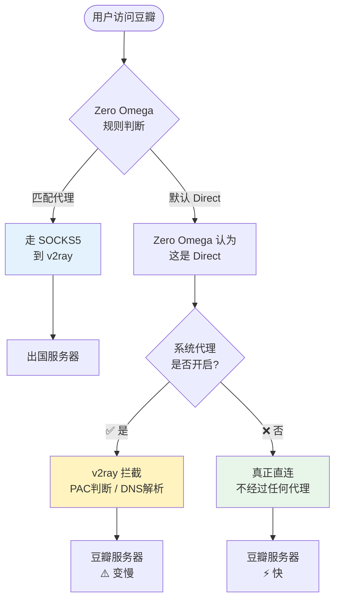
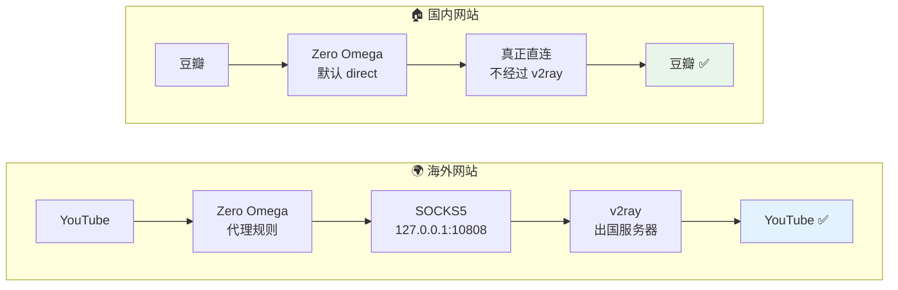

1. Table of Contents, ordered
{:toc}

## 两个矛盾的发现

一次配置代理时，我遇到了两个看似矛盾的现象：

1. **v2ray 开了 PAC 模式，SwitchyOmega 也设了国内网站 Direct，但访问豆瓣依然很慢。**
2. **v2ray 开了"自动配置系统代理"，按理说所有流量都被接管了，但 Git 克隆 GitHub 仓库依然很慢，必须显式给 Git 配置 `http.proxy` 才变快。**

如果"系统代理"真的接管了系统上所有软件，这两个现象都不该出现。问题出在对"系统代理"这个名字的理解上。

## 核心误区：系统代理 ≠ 全局代理

Windows 的"系统代理"设置，本质上是操作系统贴出的一张**告示**，告诉应用程序："建议你们走这个代理"。但它**不是命令**，程序完全可以不理。

### 哪些程序会自动走系统代理？

| 程序类型 | 是否自动走系统代理 | 原因 |
|---------|------------------|------|
| Chrome / Edge | ✅ 会 | 浏览器自动读取系统代理 |
| 部分 UWP / 微软系应用 | ✅ 可能会 | 使用 WinHTTP / WinINET 网络栈 |
| **Git** | ❌ **默认不会** | 使用 libcurl，默认直连 |
| **Docker** | ❌ **默认不会** | 有自己的网络栈和配置 |
| Python / pip / npm | ❌ 默认不会 | 需要单独配置环境变量或配置文件 |
| PowerShell / CMD curl | ❌ 默认不会 | 取决于具体实现 |

这就是 Git 仍然很慢的原因：**它根本不 care Windows 的系统代理设置**，除非你用 `git config --global http.proxy` 亲口告诉它。

## 代理的三层结构

要理解为什么 SwitchyOmega 设了 Direct 国内网站还是慢，需要看清代理决策的三个层级：



当 v2ray 开启"自动配置系统代理"时，它实际上是在**第二层**接管了系统代理设置。此时：

- SwitchyOmega 选择"Direct"，意思是**把请求交给系统代理的 Direct 通道**
- 但系统代理的通道本身就是 v2ray 在管
- v2ray 拿到请求后，还要做 PAC 判断、DNS 解析、路由分析
- 国内网站本来可以直达，现在却被 v2ray "过一手"，DNS 可能被劫持到远端解析，或路由逻辑拖慢了握手

**SwitchyOmega 的 Direct 不等于绕过 v2ray**，它只是把请求扔进了 v2ray 掌管的系统代理管道里。

## 正确的配置方案

既然分层结构搞清楚了，解决方案就很简单：**让各层各司其职，不要重复决策**。

### v2ray：只做本地代理服务器

把 v2ray 的系统代理关掉，让它安静地做一个本地 SOCKS5 服务：

- **v2rayN**：底部状态栏切换为 **"不改变系统代理"**
- **Clash Verge**：关闭"系统代理"（System Proxy）开关
- **原生 v2ray-core**：本身就没有系统代理功能，无需改动

此时 v2ray 仍然在监听本地端口（默认 `127.0.0.1:10808`），随时待命，但不主动干涉任何程序的网络请求。

### Zero Omega：全权负责浏览器分流

在 Zero Omega 中创建一个代理情景模式：

| 设置 | 值 |
|------|-----|
| 协议 | SOCKS5 |
| 服务器 | 127.0.0.1 |
| 端口 | 10808 |

然后在 AutoSwitch 中按需配置：

```text
*.youtube.com proxy
*.google.com proxy
*.github.com proxy
*.openai.com proxy
# ... 其他需要代理的域名

* direct
```

**注意语法**：Zero Omega 的规则格式是 `域名 情景模式名`，不需要 `+` 前缀。`+proxy` 是 Surge/Clash 的语法，在 Zero Omega 里不识别。

### 分流后的流量路径



## 命令行工具怎么办？

浏览器由 Zero Omega 接管了，但 Git、Docker、npm 这些工具仍然需要手动告知：

```bash
# Git
git config --global http.proxy socks5h://127.0.0.1:10808
git config --global https.proxy socks5h://127.0.0.1:10808

# 当前 Shell 会话（影响 curl、wget、python requests 等）
export HTTP_PROXY=socks5h://127.0.0.1:10808
export HTTPS_PROXY=socks5h://127.0.0.1:10808

# Docker Desktop
# 在 Settings → Resources → Proxies 中填入 http://127.0.0.1:10809（需开启 v2ray 的 HTTP 代理端口）
```

这些工具**各自为政**，没有统一的"系统代理"能让它们全部自动遵从。

## 总结

1. **Windows 系统代理只是一张"告示"**，不是强制命令。浏览器会看，Git 等工具不看。
2. **v2ray 的系统代理和浏览器插件不要同时管分流**，否则两层规则会打架，国内网站反而被拖累。
3. **最佳实践**：v2ray 只做本地 SOCKS5 服务器，浏览器分流完全交给 Zero Omega，命令行工具各自单独配置。
4. 代理配置烦人，正是因为**每个程序都有自己的网络栈和配置方式**，没有一键全局的银弹。
