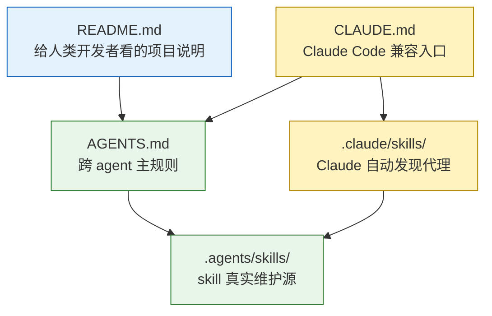

1. Table of Contents, ordered
{:toc}

# 问题：同一套规则不该维护三遍

这次整理的核心问题很简单：项目里同时存在 `README.md`、`AGENTS.md`、`CLAUDE.md`，还有 `.agents/skills/` 与 `.claude/`。如果每个文件都塞一份完整规则，短期看起来方便，长期一定会漂移：某个 agent 读到旧规则，另一个 agent 读到新规则，最后出问题时很难判断谁才是“真相来源”。

因此这次选择把文档分成三层：

| 文件 | 读者 | 职责 |
|------|------|------|
| `README.md` | 人类开发者 | 项目介绍、本地开发、部署方式、内容集合 |
| `AGENTS.md` | 所有 coding agent | 发文流程、front matter、构建检查、提交约定、skills 入口 |
| `CLAUDE.md` | Claude Code | 兼容入口，只指向 `AGENTS.md` 并保留 Claude 专属配置 |

这么做的原因可以用一句话概括：`README.md` 保持给人看，`AGENTS.md` 成为给 agent 看的单一主规则，`CLAUDE.md` 只承担 Claude Code 的兼容层。

# 为什么 AGENTS.md 适合作为主入口

这个选择不是拍脑袋。OpenAI 的 [Codex AGENTS.md 文档](https://developers.openai.com/codex/guides/agents-md) 明确说明，Codex 会在工作前读取 `AGENTS.md`，并且会按全局、项目、子目录的顺序构建 instruction chain。也就是说，把跨 agent 的项目规则放在 `AGENTS.md`，对 Codex 来说是原生路径。

开放格式本身也支持这个分工。[AGENTS.md 项目主页](https://agents.md/) 把它描述为“给 agent 的 README”：README 继续服务人类贡献者，AGENTS.md 则放构建步骤、测试命令、代码风格、项目约定等 agent 需要但会污染 README 的细节。

因此本项目把这些内容上移到 `AGENTS.md`：

- 文章发布流程：落盘后预览、等用户确认、再询问是否 commit/push。
- front matter 规则：`date` 必须用真实时间，`categories` 和 `tags` 小写，不手写 `layout:` 与 `last_modified_at`。
- 内容规则：中文弯引号、文件命名、Mermaid 图使用场景。
- 构建卡点：`bundle exec jekyll build` 与 `htmlproofer`。
- agent 提交签名：哪个 agent 参与 commit，就使用哪个 agent 自己的 `Co-Authored-By` trailer。

# Claude 为什么还需要 CLAUDE.md

Claude Code 有自己的项目入口习惯，所以 `CLAUDE.md` 仍然保留。但它不再复制完整规则，只做三件事：

1. 告诉 Claude Code 先读 `AGENTS.md`。
2. 说明项目工作流的真实 skill 在 `.agents/skills/`。
3. 记录 `.claude/` 下面的 Claude 专属配置，例如 hook、front matter 检查脚本、Claude 自己的 commit trailer 示例。

这样可以避免 `CLAUDE.md` 和 `AGENTS.md` 同时维护同一条规则。以后如果要改“文章发布流程”，只改 `AGENTS.md`；如果要改 Claude 的 hook 或权限，再改 `.claude/`。

# Skill 的真实来源与 Claude 代理

项目里有两个可复用 skill：

- `archive-chat`：把当前对话整理成结构化博客文章。
- `summarize-article`：把外部文章 URL 总结成博客 post。

Codex 的 [Agent Skills 文档](https://developers.openai.com/codex/skills) 说明，skill 是包含 `SKILL.md` 的目录，可以带脚本、引用资料和资产；Codex 会先看到名称、描述和路径，真正需要时再读取完整 `SKILL.md`。这适合把真实工作流集中维护在 `.agents/skills/`。

但 Claude Code 的自动发现路径不同。[Claude Code skills 文档](https://code.claude.com/docs/en/skills) 写明，项目 skills 会从 `.claude/skills/` 中发现；Anthropic 的 [Agent Skills 概览](https://platform.claude.com/docs/en/agents-and-tools/agent-skills/overview) 也解释了 skills 的渐进式加载：先有 metadata，触发时再读取 `SKILL.md`，必要时再读取附加文件。

所以最后采用了一个兼容方案：

```text
.agents/skills/
  archive-chat/SKILL.md          # 真实维护源
  summarize-article/SKILL.md     # 真实维护源

.claude/skills/
  archive-chat/SKILL.md          # Claude 自动发现用代理
  summarize-article/SKILL.md     # Claude 自动发现用代理
```

`.claude/skills/` 里的文件只保留 `name`、`description` 和一段跳转说明，要求 Claude 读取 `.agents/skills/<skill>/SKILL.md`。没有使用 symlink，是因为这个仓库需要在 Windows 下工作，代理文件比符号链接更稳。

# 新增的链接规则

这次还把一条写作规则补进了 `archive-chat` skill：引用外部资料时，不要裸贴 URL，要使用 Markdown 内联链接，把链接嵌入到有意义的文字中。

例如应该写：

```markdown
OpenAI 的 [Codex AGENTS.md 文档](https://developers.openai.com/codex/guides/agents-md) 说明了 Codex 如何发现项目规则。
```

而不是把链接单独扔一行。这样读者能先看到资料的语义，再选择是否点击；文章也更像正式文档，而不是聊天记录的链接堆。

# 最终结构

整理后的关系如下：



这个结构的维护原则是：

- 人类怎么理解和运行项目，写进 `README.md`。
- agent 怎么工作、发文、检查、提交，写进 `AGENTS.md`。
- Claude Code 专属入口和本地配置，写进 `CLAUDE.md` 与 `.claude/`。
- skill 的完整逻辑只维护在 `.agents/skills/`。
- `.claude/skills/` 只做薄代理，让 Claude 能自动发现同一批 skill。

# 核心

真正重要的不是多建几个文件，而是确定“谁是主规则”。这个仓库把 `AGENTS.md` 定为跨 agent 的主规范，把 `.agents/skills/` 定为 skill 的真实来源，再用 `CLAUDE.md` 和 `.claude/skills/` 兼容 Claude Code。这样既顺应了 Codex 和 AGENTS.md 的开放约定，也兼容 Claude Code 的自动发现机制。

# 结果

这次变更已经把 `AGENTS.md`、`CLAUDE.md`、`README.md` 和 `.claude/skills/` 代理文件整理并推送。后续新增 agent 规则时，默认先问一句：这是给人看的、给所有 agent 看的，还是某个工具私有的？答案决定文件位置，维护成本也就被控制住了。
