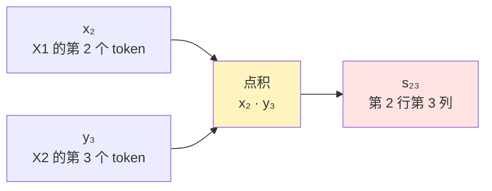
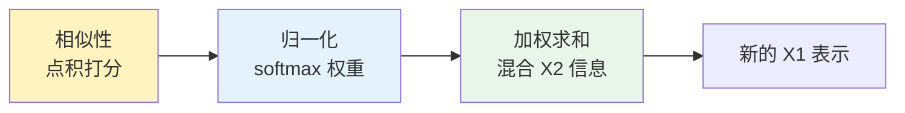
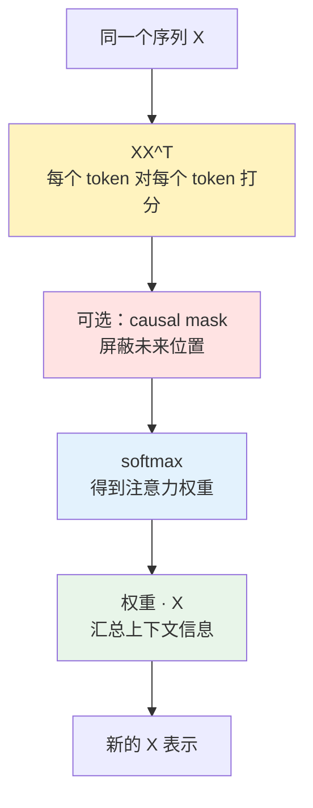
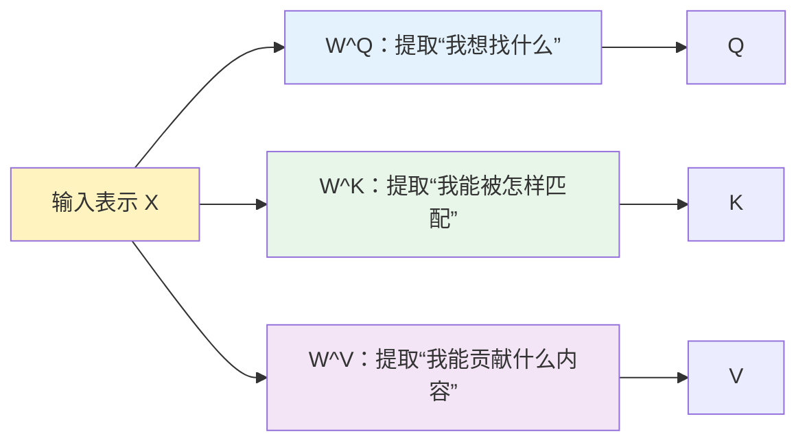
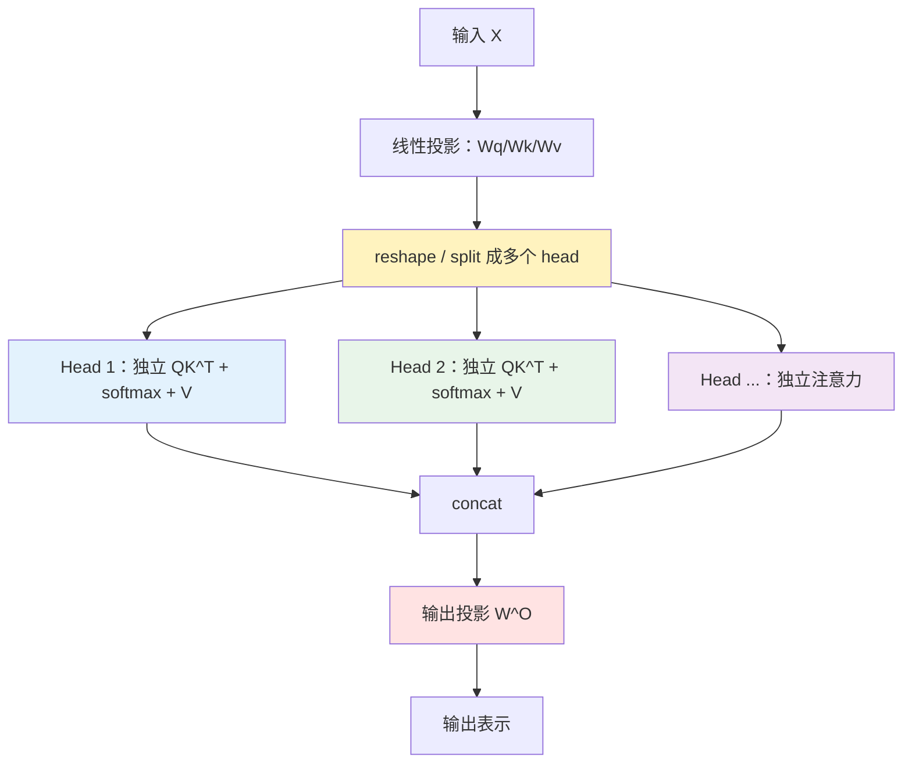
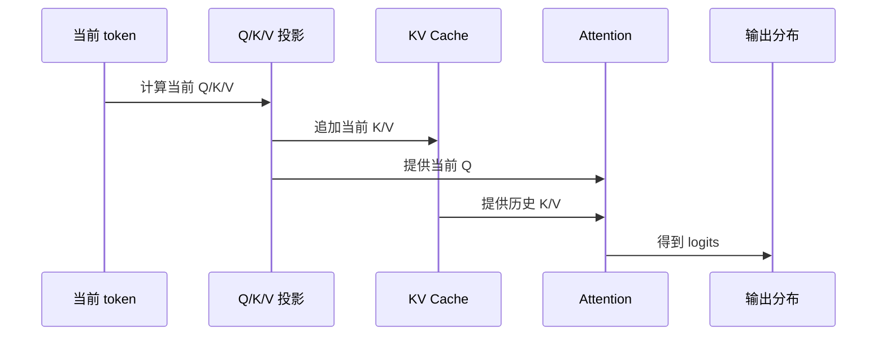
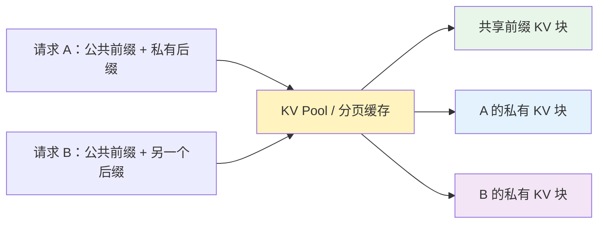
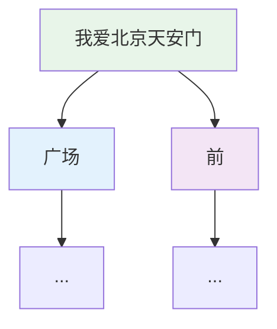

围绕 Transformer 里的 Q/K/V，最容易混淆的点通常有三个：

- Q、K、V 到底是词向量，还是矩阵？
- Attention 加权求和之后得到的表示，是不是这个 token 自己的 V？
- 推理阶段的 KV Cache 缓存的到底是什么，为什么不会让输出固定死？

这篇文章把这些问题按一条主线串起来：先从相似性理解 Attention，再看 Self-Attention 为什么需要 Q/K/V，接着理解 Multi-Head Attention 为什么不是简单拆维度，最后理解 KV Cache 和 KV Pool 为什么能加速推理。

| 阶段 | 要解决的问题 | 关键结论 |
| --- | --- | --- |
| Attention 基础 | 注意力到底在算什么？ | 先算相似度，再归一化成权重，最后对信息做加权求和 |
| Self-Attention | 为什么一个序列要“自己看自己”？ | 每个 token 通过看同一句里的其它 token 更新自己的上下文表示 |
| Q/K/V 投影 | 为什么同一个 token 要变成 Q、K、V 三份表示？ | 同一个 $$X$$ 在查询、被匹配、贡献内容时需要展示不同侧面 |
| Attention 输出 | 加权求和得到的是不是自己的 V？ | 不是，是所有 V 按注意力权重混合后的上下文表示 |
| 参数共享 | 所有 token 共用一套 W 会不会乱？ | 不会。W 是共享规则，输入 $$X$$ 不同，输出 Q/K/V 也不同 |
| Multi-Head | 多头是不是只是一个大矩阵切开？ | 线性投影可等价成大矩阵，关键在 split 后独立 attention |
| KV Cache | 推理时到底缓存什么？ | 缓存历史 K/V 中间结果，不缓存 W 矩阵，也不缓存最终答案 |
| 采样分叉 | 生成路径变了 cache 还能复用吗？ | 公共前缀可复用，分叉后的 KV 必须各自维护 |

1. Table of Contents, ordered
{:toc}

# 先从相似性理解 Attention

在进入 Q/K/V 之前，先不要急着写矩阵乘法。Attention 的核心不是公式，而是一个很朴素的问题：

> 对当前位置来说，哪些位置和我更相关？我应该从它们那里拿多少信息？

所以 Attention 的第一步不是“加权求和”，而是先回答“谁和谁相似”。而在向量空间里，最常用的一种相似性度量就是点积。

## 为什么点积可以表示相似性

两个向量的点积可以写成：

$$
x \cdot y = \|x\|\|y\|\cos\theta
$$

其中 $$\theta$$ 是两个向量的夹角。

这条公式的直觉很重要：

| 情况 | $$\cos\theta$$ | 点积大小 | 直觉 |
| --- | --- | --- | --- |
| 两个向量方向接近 | 接近 $$1$$ | 点积大 | 两者语义/特征更相似 |
| 两个向量接近垂直 | 接近 $$0$$ | 点积接近 0 | 两者关系弱 |
| 两个向量方向相反 | 接近 $$-1$$ | 点积为负 | 两者特征相反或不匹配 |

举个更具象的例子。假设我们在做电影推荐，用户和电影都可以表示成 embedding。

用户 embedding 的每个维度表示一种偏好，电影 embedding 的每个维度表示一种属性：

| 维度 | 用户向量含义 | 电影向量含义 |
| --- | --- | --- |
| 第 1 维 | 喜不喜欢科幻 | 是不是科幻片 |
| 第 2 维 | 喜不喜欢动画画风 | 是否偏动画 / 视觉风格化 |
| 第 3 维 | 喜不喜欢轻松喜剧 | 喜剧元素强不强 |
| 第 4 维 | 喜不喜欢严肃剧情 | 剧情严肃程度 |

假设某个用户向量是：

$$
u = [0.9,\ 0.8,\ 0.2,\ 0.1]
$$

这表示他很喜欢科幻和动画风格，不太偏好喜剧和严肃剧情。

再看两部电影：

$$
m_1 = [0.8,\ 0.7,\ 0.1,\ 0.1]
$$

$$
m_2 = [0.1,\ 0.1,\ 0.2,\ 0.9]
$$

第一部电影更像“科幻 + 动画风格”，第二部电影更像“严肃剧情”。它们和用户的点积分数分别是：

$$
u \cdot m_1
=
0.9 \times 0.8
+
0.8 \times 0.7
+
0.2 \times 0.1
+
0.1 \times 0.1
=
1.31
$$

$$
u \cdot m_2
=
0.9 \times 0.1
+
0.8 \times 0.1
+
0.2 \times 0.2
+
0.1 \times 0.9
=
0.30
$$

所以，用户和第一部电影的点积更大，表示它们在这些可解释维度上更匹配。点积本质上是在做一件事：把“用户在某个维度有多喜欢”和“电影在这个维度有多强”逐维相乘，再把所有维度的匹配程度加起来。

这就是为什么点积可以用来表示相似性：

| 情况 | 点积贡献 |
| --- | --- |
| 用户喜欢科幻，电影也是科幻 | 这一维贡献大 |
| 用户喜欢动画风格，电影也有动画风格 | 这一维贡献大 |
| 用户不喜欢严肃剧情，但电影很严肃 | 这一维贡献小 |
| 多个偏好维度都匹配 | 总点积更大 |

这就是点积注意力的第一层含义：

> 用点积给 token 之间的相关性打一个原始分数。

## 从两个向量推广到两个序列

现在把一个向量推广到一组 token。

假设有两个序列：

- $$X_1 \in \mathbb{R}^{n \times d}$$：有 $$n$$ 个 token，每个 token 是 $$d$$ 维。
- $$X_2 \in \mathbb{R}^{m \times d}$$：有 $$m$$ 个 token，每个 token 也是 $$d$$ 维。

如果让 $$X_1$$ 里的每个 token 都和 $$X_2$$ 里的每个 token 计算相似度，就会得到一个分数矩阵：

$$
S = X_1X_2^T
$$

其中：

$$
S \in \mathbb{R}^{n \times m}
$$

矩阵 $$S$$ 的每个格子都是一个点积：

$$
s_{ij} = x_i \cdot y_j
$$

它表示：$$X_1$$ 里第 $$i$$ 个 token 和 $$X_2$$ 里第 $$j$$ 个 token 的原始相关性分数。

把矩阵乘法画成格子会更直观。假设：

- $$X_1$$ 有 3 个 token：$$x_1, x_2, x_3$$。
- $$X_2$$ 有 4 个 token：$$y_1, y_2, y_3, y_4$$。

那么 $$X_1X_2^T$$ 会得到一个 $$3 \times 4$$ 的分数矩阵：

| $$S = X_1X_2^T$$ | $$y_1$$ | $$y_2$$ | $$y_3$$ | $$y_4$$ |
| --- | --- | --- | --- | --- |
| $$x_1$$ | $$s_{11}$$ | $$s_{12}$$ | $$s_{13}$$ | $$s_{14}$$ |
| $$x_2$$ | $$s_{21}$$ | $$s_{22}$$ | <mark>\(s_{23}=x_2 \cdot y_3\)</mark> | $$s_{24}$$ |
| $$x_3$$ | $$s_{31}$$ | $$s_{32}$$ | $$s_{33}$$ | $$s_{34}$$ |

高亮的格子 $$s_{23}$$ 就表示：$$X_1$$ 的第 2 个 token 对 $$X_2$$ 的第 3 个 token 的原始注意力分数。



到这里为止，我们只有原始分数。分数可以很大、很小、为负，而且不同 token 的分数范围也不一定好比较。它还不能直接表示“拿多少信息”。

## 从原始分数到注意力权重

为了把原始分数变成“比例”，需要对每一行做归一化。Transformer 里通常用 softmax：

$$
A = \mathrm{softmax}(S)
$$

其中每一行都满足：

$$
\sum_j A_{ij} = 1
$$

这一步非常关键。做完 softmax 后，$$A_{ij}$$ 就不再只是“相似性分数”，而是“注意力权重”。

| $$A = \mathrm{softmax}(S)$$ | $$y_1$$ | $$y_2$$ | $$y_3$$ | $$y_4$$ | 行和 |
| --- | --- | --- | --- | --- | --- |
| $$x_1$$ | $$a_{11}$$ | $$a_{12}$$ | $$a_{13}$$ | $$a_{14}$$ | $$1$$ |
| $$x_2$$ | $$a_{21}$$ | $$a_{22}$$ | <mark>\(a_{23}\)</mark> | $$a_{24}$$ | $$1$$ |
| $$x_3$$ | $$a_{31}$$ | $$a_{32}$$ | $$a_{33}$$ | $$a_{34}$$ | $$1$$ |

其中 $$a_{23}$$ 是 $$s_{23}$$ 归一化后的结果。它表示：

> 在更新 $$x_2$$ 这个位置时，应该从 $$y_3$$ 那里拿多少比例的信息。

这一步就是“注意力”的核心。注意力不是说“只看某一个 token”，而是说“按比例看所有 token”。相关性越高的 token，权重越大；相关性越低的 token，权重越小。

## 权重乘以 X2：得到关注后的新表示

有了权重矩阵 $$A$$ 之后，就可以对 $$X_2$$ 做加权求和：

$$
O = AX_2
$$

展开到某个位置 $$i$$，就是：

$$
o_i = \sum_j A_{ij} y_j
$$

继续看第 2 行，输出 $$o_2$$ 是这样来的：

$$
o_2 = a_{21}y_1 + a_{22}y_2 + \color{#d32f2f}{a_{23}y_3} + a_{24}y_4
$$

这就是为什么 $$O$$ 可以理解成“$$X_1$$ 关注了 $$X_2$$ 之后的新表示”：

- $$x_2$$ 本来只是 $$X_1$$ 里的第 2 个 token 表示。
- 它先和 $$X_2$$ 里的所有 token 算相似度。
- 相似度经过 softmax 变成权重。
- 再按这些权重从 $$X_2$$ 里混合信息，得到新的 $$o_2$$。

如果 $$a_{23}$$ 很大，说明 $$x_2$$ 在更新自己时主要吸收了 $$y_3$$ 的信息；如果 $$a_{21}$$、$$a_{22}$$、$$a_{24}$$ 较小，它们贡献就更少。

这就是 Attention 的基本结构：

| 阶段 | 数学形式 | 直觉 |
| --- | --- | --- |
| 相似性打分 | $$S = X_1X_2^T$$ | 谁和谁相关 |
| 归一化 | $$A = \mathrm{softmax}(S)$$ | 每个信息源占多少比例 |
| 加权求和 | $$O = AX_2$$ | 按比例从 $$X_2$$ 汇总信息 |



## Attention 的公式

有了前面的铺垫，Attention 的公式就很自然了。它其实就是把三件事写到一起：

| 步骤 | 数学表达 | 含义 |
| --- | --- | --- |
| 打分 | $$S = \mathrm{score}(X_1, X_2)$$ | 算 $$X_1$$ 和 $$X_2$$ 的相关性 |
| 归一化 | $$A = \mathrm{softmax}(S)$$ | 把原始分数变成权重 |
| 汇总 | $$O = AX_2$$ | 用权重从 $$X_2$$ 里加权取信息 |

所以，最抽象的 Attention 可以写成：

$$
\mathrm{Attention}(X_1, X_2)
=
\mathrm{softmax}(\mathrm{score}(X_1, X_2))X_2
$$

如果 score 用点积，那么就是点积注意力：

$$
\mathrm{Attention}(X_1, X_2)
=
\mathrm{softmax}(X_1X_2^T)X_2
$$

这和上面的用户-电影例子是同一件事：

- 用户向量和电影向量先算相似性分数。
- 分数归一化成“我应该多关注哪部电影”的比例。
- 再按比例把电影信息混合成新的用户表示。

放回 token 场景里也是一样：

- $$X_1$$ 是发起关注的一方。
- $$X_2$$ 是被关注的信息源。
- $$\mathrm{softmax}(X_1X_2^T)$$ 是 $$X_1$$ 对 $$X_2$$ 的注意力分布。
- 最终输出 $$O$$ 是“吸收了 $$X_2$$ 信息之后的新 $$X_1$$”。

到这里，Attention 公式已经完整了。接下来 Transformer 只是把这个公式里的角色拆得更细：谁负责发起查询，谁负责被匹配，谁负责提供内容。这就引出了 Q、K、V。

## Self-Attention：让序列自己看自己

刚才的公式是一般 Attention：

$$
\mathrm{Attention}(X_1, X_2)
=
\mathrm{softmax}(X_1X_2^T)X_2
$$

它表示：$$X_1$$ 这组 token 去关注 $$X_2$$ 这组 token。

Self-Attention 是它的一个特殊情况：$$X_1$$ 和 $$X_2$$ 是同一个序列。

$$
\mathrm{SelfAttention}(X)
=
\mathrm{Attention}(X, X)
=
\mathrm{softmax}(XX^T)X
$$

也就是说，Self-Attention 做的是：

> 同一个句子里，每个 token 都去看这个句子里的其它 token，再把相关信息汇总回来更新自己。

比如句子：

```text
那只可爱的猫，它在沙发上睡觉
```

当模型处理“它”这个 token 时，它应该能从前面的“猫”那里拿到指代信息；处理“睡觉”时，它可能要关注“猫”这个动作主体；处理“可爱的”时，它又更像是在修饰“猫”。

这就是 Self-Attention 的价值：它让每个位置的表示不再只等于这个 token 自己，而是变成“吸收了整句上下文之后的新表示”。

如果把 Self-Attention 的分数矩阵画出来，它就是一个 token 对 token 的方阵：

| $$XX^T$$ | token 1 | token 2 | token 3 | token 4 |
| --- | --- | --- | --- | --- |
| token 1 | 自己看自己 | 看 token 2 | 看 token 3 | 看 token 4 |
| token 2 | 看 token 1 | 自己看自己 | 看 token 3 | 看 token 4 |
| token 3 | 看 token 1 | 看 token 2 | 自己看自己 | 看 token 4 |
| token 4 | 看 token 1 | 看 token 2 | 看 token 3 | 自己看自己 |

在 decoder-only 语言模型里，还会加 causal mask，让当前位置只能看自己和过去的 token，不能偷看未来 token。这个 mask 不改变 Attention 的核心逻辑，只是限制“哪些位置允许被看见”。



## 从 Self-Attention 到 Q/K/V

最朴素的 Self-Attention 可以写成：

$$
\mathrm{SelfAttention}(X)
=
\mathrm{softmax}(XX^T)X
$$

这个公式好理解，但它把同一个 $$X$$ 同时塞进了三个角色：

| 位置 | 在公式里的作用 | 角色 |
| --- | --- | --- |
| 第一个 $$X$$ | 发起匹配 | “我想找什么” |
| 第二个 $$X^T$$ | 被拿来匹配 | “我能被怎样匹配” |
| 最后的 $$X$$ | 被加权求和 | “我真正贡献什么内容” |

这就有一个问题：同一个原始表示 $$X$$ 被迫同时承担三种工作。

但在语言里，这三种工作并不一样。以“它”和“猫”为例：

- “它”作为查询者，需要表达“我要找一个前面的指代对象”。
- “猫”作为被匹配者，需要表达“我是一个可被指代的动物名词”。
- “猫”真正传给“它”的内容，可能是“猫”这个实体及其属性。

所以 Transformer 不再直接用同一个 $$X$$ 做三件事，而是先把 $$X$$ 投影成三份：

$$
Q = XW^Q
$$

$$
K = XW^K
$$

$$
V = XW^V
$$

于是 Self-Attention 从：

$$
\mathrm{softmax}(XX^T)X
$$

变成：

$$
\mathrm{softmax}(QK^T)V
$$

这一步非常关键：

| 组件 | 作用 |
| --- | --- |
| $$QK^T$$ | 决定“谁和谁相关、看多少” |
| $$V$$ | 决定“相关之后真正拿什么内容” |

也就是说，Q/K/V 不是额外加出来的复杂概念，而是 Self-Attention 为了把“查询、匹配、取内容”这三件事拆开而引入的角色分工。

## 缩放点积注意力：一个稳定性补充

上面的逻辑已经是 Attention 的主体。拆出 Q/K/V 之后，Transformer 还会在点积分数上除以 $$\sqrt{d_k}$$，避免分数过大。

于是 Transformer 里的缩放点积注意力可以写成：

$$
\mathrm{Attention}(Q,K,V)
=
\mathrm{softmax}
\left(
\frac{QK^T}{\sqrt{d_k}}
\right)V
$$

为什么要除以 $$\sqrt{d_k}$$？

因为向量维度 $$d_k$$ 越大，点积结果的数值范围通常越大。如果直接把很大的分数丢给 softmax，softmax 会变得非常尖锐：最大值接近 1，其它位置接近 0。这样梯度会更不稳定，模型也更容易过早只盯住少数位置。

缩放项的作用就是把分数拉回更合适的范围：

$$
S = \frac{QK^T}{\sqrt{d_k}}
$$

然后仍然是同样的两步：

$$
A = \mathrm{softmax}(S)
$$

$$
O = AV
$$

所以，缩放点积注意力不是另一套完全不同的东西。它只是在“点积打分 -> softmax 归一化 -> 加权求和”这条主线上，多加了一个控制分数尺度的步骤。

到这里，公式链条已经完整：Attention 先解决“按相关性取信息”，Self-Attention 让序列自己更新自己，Q/K/V 则把查询、匹配、取内容拆成三个角色。下面再展开这三个角色各自到底在做什么。

# Q、K、V 三个投影空间

前面已经从 Self-Attention 推出了 Q/K/V。现在换一个更直观的角度，看看这三个向量各自承担什么语义角色。它们可以继续用信息检索来理解：

| 角色 | 直觉问题 | 在注意力里的职责 |
| --- | --- | --- |
| Q（Query） | 我想找什么信息？ | 当前 token 发出的查询 |
| K（Key） | 我能被怎样匹配？ | 每个 token 暴露出来的索引标签 |
| V（Value） | 我被选中后贡献什么？ | 真正流向输出的内容 |

更准确地说，Q、K、V 不是手工指定的三份信息，也不是凭空出现的向量，而是输入隐藏状态 $$X$$ 经过三组可学习权重矩阵投影得到的结果：

$$
Q = XW^Q
$$

$$
K = XW^K
$$

$$
V = XW^V
$$

其中 $$X$$ 可以理解为当前层输入的 token 表示，$$W^Q$$、$$W^K$$、$$W^V$$ 是模型训练出来的参数。

这三组投影矩阵的意义在于：原始表示 $$X$$ 是通用表示，而注意力机制需要同一个 token 在不同环节扮演不同角色。前面已经看到，朴素 Self-Attention 把同一个 $$X$$ 同时用作查询、匹配和内容；Q/K/V 则把这三个角色拆开。

如果不做这三次投影，直接拿原始向量 $$X$$ 互相点积，模型会丢掉一个很重要的能力：用不同视角理解同一个 token。

比如句子里有“吃”和“苹果”。在语言关系里，“吃”更像是在主动寻找一个可食用的宾语；“苹果”更像是在被动展示自己是一个可食用实体。这个关系不是对称的：

$$
\mathrm{Score}(x_{\text{吃}}, x_{\text{苹果}})
$$

和

$$
\mathrm{Score}(x_{\text{苹果}}, x_{\text{吃}})
$$

在语义上不应该被理解成同一种动作。前者更像“动词在找宾语”，后者不一定是“名词在找动词”。

这就是 $$W^Q$$ 和 $$W^K$$ 的价值：它们把同一个原始表示投影成“主动查询的一面”和“被动匹配的一面”。

| 矩阵 | 投影出的空间 | 负责提取的特征 |
| --- | --- | --- |
| $$W^Q$$ | Query 空间 | “我现在想找什么” |
| $$W^K$$ | Key 空间 | “我可以被什么问题匹配上” |
| $$W^V$$ | Value 空间 | “如果我被选中，我实际贡献什么信息” |

如果用一个类比，原始向量 $$X$$ 像一份完整简历。Q 是“我想找什么样的人”，K 是“别人搜索我时能看到的标签”，V 是“真正合作时我能提供的能力”。同一份简历，面对“找人”“被找”“贡献内容”三个场景，需要展示不同侧面。



> Q/K/V 的核心不是“多做了三次矩阵乘法”，而是让同一个 token 在“查询”“被查询”“贡献内容”三个场景里展示不同侧面。

更细一点看，三个空间的分工并不一样。

## Query：信息过滤器

Query 空间像过滤器。它从 $$X$$ 里挑出当前 token 要发出的“问题”。

比如处理代词“它”时，模型可能需要提取的是“寻找前文指代对象”的特征，而不是字形或发音信息。

## Key：信息索引页

Key 空间像索引页。它从 $$X$$ 里挑出当前 token 可以被匹配的标签。比如“苹果”可能被投影出“实体名词”“可食用”“可能是指代对象”等特征。

## Value：信息精选集

Value 空间像精选集。它不负责决定“谁看谁”，而负责决定“如果我被看见，我把什么内容传过去”。原始表示里可能混着词义、位置、语法、上下文残留等多种信息，$$W^V$$ 的作用就是把将要流动的内容再加工一次。

所以可以先记住一句话：

> $$W^Q$$ 和 $$W^K$$ 决定信息流动的方向和强度，$$W^V$$ 决定真正流动的内容。

# Attention 输出不是自己的 V

一个常见误解是：注意力加权求和之后得到的表示，就是当前 token 的 V 向量。

> 不是。Attention 输出是全句所有 V 的加权混合，不是当前 token 自己的 $$v_i$$。

标准缩放点积注意力是：

$$
\mathrm{Attention}(Q,K,V)
=
\mathrm{softmax}
\left(
\frac{QK^T}{\sqrt{d_k}}
\right)V
$$

对某个位置 $$i$$ 来说，它会用自己的 $$q_i$$ 去和所有位置的 $$k_j$$ 做匹配：

$$
\alpha_{ij}
=
\mathrm{softmax}
\left(
\frac{q_i k_j^T}{\sqrt{d_k}}
\right)
$$

然后再用这些权重对所有位置的 $$v_j$$ 加权求和：

$$
o_i = \sum_j \alpha_{ij} v_j
$$

因此，输出 $$o_i$$ 不是当前位置自己的 $$v_i$$，而是所有 token 的 V 按权重混合之后得到的上下文表示。

| 符号 | 含义 | 是否已经融合上下文 |
| --- | --- | --- |
| $$v_i$$ | 当前 token 自己准备贡献的信息 | 否 |
| $$o_i$$ | 当前 token 从整个上下文里汇总出的新表示 | 是 |

这就是 Transformer 能处理多义词的关键。比如“苹果”在不同句子里会关注不同上下文，从而得到不同的上下文表示。

更形象地说，当前 token 的 Q 会去问全句所有 K：“谁和我现在要解决的问题有关？”得到权重之后，再从对应的 V 里拿内容。最终输出不是某个单独 token 的内容，而是一份按相关性混合后的上下文报告。

# 原始词向量有没有被更新

在一层 Transformer 里，Attention 输出通常不会直接替换原始输入，而是通过残差连接叠加回去：

$$
H = \mathrm{LayerNorm}(X + \mathrm{Attention}(X))
$$

随后还会经过前馈网络：

$$
Y = \mathrm{LayerNorm}(H + \mathrm{FFN}(H))
$$

所以更准确的说法是：当前位置的表示被逐层演化，而不是原始词向量被简单覆盖。

可以把它分成两类：

| 类型 | 位置 | 特点 |
| --- | --- | --- |
| 静态 embedding | 词表 / 底层输入 | 同一个词的基础向量相对固定 |
| 动态隐藏状态 | Transformer 层间流动 | 会随着句子、层数、上下文不断变化 |

同一个词在词表里的 embedding 是固定的，但它在不同句子、不同层里的隐藏状态会不同。

# Wq、Wk、Wv 是共享的

同一层内，所有 token 共用同一套 $$W^Q$$、$$W^K$$、$$W^V$$。如果一句话里有 100 个 token，它们都会经过同样的投影矩阵：

$$
q_i = x_i W^Q
$$

$$
k_i = x_i W^K
$$

$$
v_i = x_i W^V
$$

这并不会“学乱”，因为矩阵是共享规则，输入才决定输出。

可以把 $$W^Q$$ 想象成一台加工机器。机器是同一台，但放进去的原料不同，产物也不同：

$$
q_{\text{苹果}} = x_{\text{苹果}} W^Q
$$

$$
q_{\text{猫}} = x_{\text{猫}} W^Q
$$

同一套规则作用在不同输入上，会产生不同 Q。Q/K/V 向量是每个 token 独有的，生成这些向量的 W 矩阵才是共享的。

可以把 $$W^Q$$ 看成一种通用加工方式：它不是记住“苹果应该怎么提问”，而是学习“什么样的输入特征应该被投影成什么样的查询特征”。

共享参数有两个重要意义：

| 意义 | 如果不共享会怎样 | 共享后的效果 |
| --- | --- | --- |
| 支持变长序列 | 第 1000 个位置可能需要第 1000 套矩阵 | 任意位置都用同一套规则处理 |
| 学到通用语言规律 | 每个位置各自为政，很难泛化 | “动词找宾语”“代词找指代对象”等规律可复用 |

位置差异由输入里的位置信息承担。也就是说，token embedding 加上 positional encoding 之后，进入矩阵的 $$x_i$$ 已经包含了“是什么词”和“在什么位置”。

因此，共享矩阵解决的不是“每个词都一样处理”的问题，而是“用同一套抽象规则处理不同输入”的问题。

| 输入呈现的特征 | 共享矩阵可能学到的投影规则 |
| --- | --- |
| 代词特征 | 投影到寻找指代对象的方向 |
| 名词特征 | 投影成容易被指代关系匹配的 K |
| 谓词特征 | 投影成寻找主语、宾语或补足信息的 Q |
| 修饰词特征 | 投影到修饰关系、情感倾向或属性补充空间 |

共享参数让模型学的是语言规律，而不是死记每个 token 在每个位置上的专属矩阵。

# Multi-Head：大矩阵和多套小矩阵是同一件事

假设模型维度是 $$d_{\mathrm{model}} = 512$$，head 数量是 8，那么每个 head 的维度是：

$$
d_k = \frac{512}{8} = 64
$$

从逻辑视角看，8 个 head 可以理解为 8 套小矩阵：

$$
W^Q_1, W^Q_2, \ldots, W^Q_8
$$

每个矩阵的形状是：

$$
512 \times 64
$$

每个 head 都看完整的 512 维输入，但只产出 64 维的 Q/K/V。

| 视角 | 怎么理解 | 重点 |
| --- | --- | --- |
| 逻辑视角 | 8 个 head，各自有一组 $$512 \times 64$$ 的投影 | 便于理解“多头各司其职” |
| 工程视角 | 把 8 个小矩阵横向拼成一个 $$512 \times 512$$ 的大矩阵 | 便于 GPU 一次性高效计算 |

从工程实现看，通常会把这些小矩阵横向拼成一个大矩阵：

$$
W^Q =
\left[
W^Q_1;
W^Q_2;
\cdots;
W^Q_8
\right]
$$

它的整体形状就是：

$$
512 \times 512
$$

于是可以先做一次大矩阵乘法：

$$
Q = XW^Q
$$

再把结果 reshape 成多个 head：

$$
[\mathrm{batch}, \mathrm{seq}, 512]
\rightarrow
[\mathrm{batch}, 8, \mathrm{seq}, 64]
$$

所以，“8 套矩阵”和“一个大矩阵再 split”并不矛盾。前者是逻辑视角，后者是工程视角。

关键点是：不是先把输入 $$X$$ 的 512 维切成 8 份。每个 head 都能看到完整输入，只是各自投影出 64 维结果。

这一点非常容易误解。把错误理解和正确理解并排放在一起会清楚很多：

| 说法 | 是否正确 | 问题 / 含义 |
| --- | --- | --- |
| 把输入 $$X$$ 的 512 维先切成 8 段，每段给一个 head | 错误 | 这样每个 head 只能看到局部输入 |
| 每个 head 都看完整 $$X$$，但各自投影出 64 维结果 | 正确 | 每个 head 都能从完整信息里提取自己关心的特征 |
| 8 个 64 维结果最后 concat 回 512 维 | 正确 | 在总宽度不变的前提下获得多个观察角度 |

为什么每个 head 只输出 64 维？主要是控制计算量和输出维度。如果 8 个 head 每个都输出 512 维，拼接后就是 4096 维，后续层的参数量和计算量都会膨胀。让每个 head 输出 64 维，最后拼接仍然是 512 维，相当于在总宽度不变的前提下增加了多个观察角度。

可以用“观察员”类比：

| 机制 | 类比 | 输出 |
| --- | --- | --- |
| 单头注意力 | 1 个观察员看完整图片 | 写一份 512 字报告 |
| 8 头注意力 | 8 个观察员都看完整图片，但分工不同 | 每人写 64 字，合起来仍是 512 字 |

有人看颜色，有人看构图，有人看局部细节，有人看远距离关系。每个人报告更短，但分工更清晰，最后合起来的信息结构更丰富。

# Multi-Head 的核心在独立交互

如果只看线性变换这一步，一个 $$512 \times 512$$ 的大矩阵确实可以被看成一次普通投影。

但 Multi-Head 的关键不在第一次矩阵乘法，而在 split 之后的独立注意力计算。

> Multi-Head 之所以叫“多头”，真正的奥秘不在矩阵相乘的瞬间，而在相乘之后的非线性交互过程。

每个 head 都会单独执行：

$$
\mathrm{head}_h
=
\mathrm{softmax}
\left(
\frac{Q_hK_h^T}{\sqrt{d_k}}
\right)V_h
$$

最后再拼接所有 head：

$$
\mathrm{MultiHead}(Q,K,V)
=
\mathrm{Concat}(\mathrm{head}_1,\ldots,\mathrm{head}_8)W^O
$$

也就是说，不同 head 有独立的 Q/K/V 子空间，也有独立的 softmax。



独立 softmax 很重要。它让不同 head 可以同时关注不同关系：

| Head | 可能关注的关系 | 直觉 |
| --- | --- | --- |
| Head 1 | 主谓关系 | 谁在做动作 |
| Head 2 | 指代关系 | “它”“这个”指向谁 |
| Head 3 | 修饰关系 | 哪些形容词、副词在补充属性 |
| Head 4... | 局部或长距离依赖 | 邻近搭配、跨句关联等 |

如果所有特征都挤在一个大 softmax 里竞争，模型更容易只关注最显著的关系。多头机制把注意力分成多个子空间，让不同关系可以并行建模。

这个差异可以拆成三层。

## ① Softmax 隔离：一次大竞争变成多次小竞争

Softmax 是归一化操作，所有候选位置要竞争总和为 1 的注意力权重。

如果只有一个头，模型在某一层里更容易被迫在多个关系之间取舍：到底关注主语、宾语、修饰词，还是前文指代对象？

多头相当于把一次大竞争拆成多次小竞争：

| 单头 | 多头 |
| --- | --- |
| 所有关系在同一个 softmax 里竞争 | 每个 head 有自己的 softmax |
| 容易只保留最显著关系 | 可以同时保留多种关系 |
| 更像“只能选一个代表” | 更像“每个小组选一个代表” |

Head 1 可以在自己的空间里选出主语，Head 2 可以在自己的空间里选出指代对象，Head 3 可以在自己的空间里关注修饰关系。

用一个简单类比：单头像全班只能选一个代表，最后最显眼的人胜出；多头像全班分成 8 个小组，每个小组选一个代表。这样选出来的不是“唯一最强信号”，而是一组不同维度上的代表。

## ② 子空间隔离：Head 之间不串线

虽然工程上可能是一个大矩阵，但 split 之后，Head 1 的 Q 只和 Head 1 的 K 做点积，Head 2 的 Q 只和 Head 2 的 K 做点积：

$$
Q_1K_1^T,\quad Q_2K_2^T,\quad \ldots,\quad Q_hK_h^T
$$

它不会变成：

$$
Q_1K_2^T
$$

这种隔离强制不同 head 在不同子空间里学习关系。否则所有特征都混在同一个空间里，模型容易把关系纠缠在一起；分头之后，模型更容易把“指代”“语法依赖”“局部搭配”“长距离语义”等关系拆开表示。

## ③ 避免特征平均化：先专精，再综合

Attention 最后会对 V 做加权求和。如果只有一个头，多个相关词的 V 很容易被揉成一个模糊平均值。多头则先让不同 head 各自提取一种相对清晰的关系，再通过输出矩阵 $$W^O$$ 汇总：

$$
\mathrm{Output}
=
\mathrm{Concat}(\mathrm{head}_1,\ldots,\mathrm{head}_h)W^O
$$

这是一种“先专精，后综合”的结构。它不是简单把维度切开，而是在多个相对独立的注意力空间里各算一遍“谁该看谁、看多少、拿什么”，再把结果融合。

所以，如果只说：

$$
1 \times 512 \quad \mathrm{input}
\times
512 \times 512 \quad \mathrm{matrix}
=
1 \times 512 \quad \mathrm{output}
$$

这个描述只覆盖了线性投影那一瞬间。真正的 Multi-Head 还必须包含后面的阶段：

| 阶段 | 操作 | 为什么重要 |
| --- | --- | --- |
| 1 | reshape / split 成多个 head | 把大投影结果拆成多个子空间 |
| 2 | 每个 head 独立计算 $$QK^T$$ | 各自判断“谁和谁相关” |
| 3 | 每个 head 独立 softmax | 各自竞争注意力权重 |
| 4 | 每个 head 独立对 V 加权求和 | 各自得到一种关系下的上下文表示 |
| 5 | concat 后再用 $$W^O$$ 融合 | 把多个专家结果综合起来 |

如果没有第 2 到第 4 步的独立交互，那就只是普通的大矩阵投影，不再具备 Multi-Head 的表达能力。

用代码看，这个结构通常长这样：

```python
# 定义一个 PyTorch 模块，用来实现 Multi-Head Attention
class MultiHeadAttention(nn.Module):
    # 初始化模块；d_model 是总隐藏维度，num_heads 是 head 数量
    def __init__(self, d_model, num_heads):
        # 调用 nn.Module 的初始化逻辑，让这个类具备 PyTorch 模块能力
        super().__init__()
        # 要求总维度能被 head 数整除，否则每个 head 无法平均分到相同维度
        assert d_model % num_heads == 0
        # 保存总隐藏维度，例如 512
        self.d_model = d_model
        # 保存 head 数量，例如 8
        self.num_heads = num_heads
        # 计算每个 head 的维度，例如 512 / 8 = 64
        self.d_k = d_model // num_heads
        # 定义 Q 投影层：把输入从 d_model 映射到 d_model，内部等价于一个大 W^Q
        self.W_q = nn.Linear(d_model, d_model)
        # 定义 K 投影层：把输入从 d_model 映射到 d_model，内部等价于一个大 W^K
        self.W_k = nn.Linear(d_model, d_model)
        # 定义 V 投影层：把输入从 d_model 映射到 d_model，内部等价于一个大 W^V
        self.W_v = nn.Linear(d_model, d_model)
        # 定义输出投影层：把 concat 后的多头结果再融合回 d_model 维
        self.W_o = nn.Linear(d_model, d_model)
    # 把一个形状为 [batch, seq, d_model] 的张量拆成多个 head
    def split_heads(self, x):
        # 取出 batch 大小和序列长度；最后一维应当是 d_model
        batch_size, seq_length, _ = x.size()
        # 改形状为 [batch, seq, heads, head_dim]
        x = x.view(batch_size, seq_length, self.num_heads, self.d_k)
        # 交换 seq 和 heads 维度，得到 [batch, heads, seq, head_dim]，方便每个 head 独立 attention
        return x.transpose(1, 2)
    # 把多个 head 的结果合并回一个 d_model 维张量
    def combine_heads(self, x):
        # 读取当前形状：[batch, heads, seq, head_dim]
        batch_size, num_heads, seq_length, d_k = x.size()
        # 把形状变回 [batch, seq, heads, head_dim]，contiguous 确保内存连续便于 view
        x = x.transpose(1, 2).contiguous()
        # 把 heads 和 head_dim 拼回 d_model，得到 [batch, seq, d_model]
        return x.view(batch_size, seq_length, self.d_model)
    # 对已经拆好 head 的 Q/K/V 执行缩放点积注意力
    def scaled_dot_product_attention(self, Q, K, V, mask=None):
        # 计算 QK^T / sqrt(d_k)，形状为 [batch, heads, seq_q, seq_k]
        scores = torch.matmul(Q, K.transpose(-2, -1)) / math.sqrt(self.d_k)
        # 如果提供了 mask，例如 causal mask 或 padding mask，就进入屏蔽逻辑
        if mask is not None:
            # 把不允许关注的位置设成极小值，使 softmax 后权重接近 0
            scores = scores.masked_fill(mask == 0, -1e9)
        # 对最后一维 seq_k 做 softmax，把原始分数变成注意力权重
        probs = torch.softmax(scores, dim=-1)
        # 用注意力权重加权求和 V，得到每个 head 的上下文输出
        return torch.matmul(probs, V)
    # 前向传播；这里的 Q/K/V 参数通常都来自同一个 X，也可以来自不同序列
    def forward(self, Q, K, V, mask=None):
        # 先用 W_q 得到大 Q，再拆成 [batch, heads, seq_q, head_dim]
        Q = self.split_heads(self.W_q(Q))
        # 先用 W_k 得到大 K，再拆成 [batch, heads, seq_k, head_dim]
        K = self.split_heads(self.W_k(K))
        # 先用 W_v 得到大 V，再拆成 [batch, heads, seq_v, head_dim]
        V = self.split_heads(self.W_v(V))
        # 在每个 head 内独立计算 attention，得到 [batch, heads, seq, head_dim]
        attn_output = self.scaled_dot_product_attention(Q, K, V, mask)
        # 合并所有 head，再通过 W_o 做最终融合，输出 [batch, seq, d_model]
        return self.W_o(self.combine_heads(attn_output))
```

这里 `nn.Linear(d_model, d_model)` 看起来是一整个大矩阵，但 `split_heads` 之后，attention 是在 `num_heads` 维度上并行且相互隔离地完成的。这才是 Multi-Head 的关键。

# KV Cache 缓存的不是权重矩阵

推理阶段经常说“缓存 KV”，这里缓存的不是 $$W^K$$ 和 $$W^V$$ 权重矩阵。

权重矩阵本来就是模型参数，加载模型后固定存在。KV Cache 缓存的是每一层、每个历史 token 已经计算出来的 K/V 向量。

这点很容易说混：

| 对象 | 类比 | 是否属于 KV Cache |
| --- | --- | --- |
| $$W^Q, W^K, W^V$$ | 工厂里的机器 | 否，它们是模型参数 |
| 历史 token 的 K/V 向量 | 机器加工出的半成品 | 是，KV Cache 缓存的就是它们 |
| 最终生成的 token | 已经交付的成品 | 否，它由 logits 和解码策略决定 |

权重矩阵当然也会常驻显存，但那是模型参数加载，不是 KV Cache。

对自回归生成模型来说，每次只生成一个新 token。假设已经有前缀：

```text
I love
```

下一步要预测新 token 时，模型需要当前 token 的 Q 去看历史 token 的 K/V。如果没有缓存，每生成一步，都要重新计算历史 token 的 K/V。

但历史 token 的隐藏状态已经固定，对应的 K/V 也固定：

$$
k_i = x_i W^K
$$

$$
v_i = x_i W^V
$$

只要 $$x_i$$ 和权重不变，$$k_i$$、$$v_i$$ 就不会变。因此它们可以缓存下来。

如果不用缓存，生成第 100 个 token 时，模型会反复为前 99 个 token 计算它们已经算过的 K/V。这些重复计算没有提供新信息，只是在浪费时间。KV Cache 的收益就在这里：历史 K/V 直接从显存中的缓存读出来，当前步只需要处理新 token。

每轮推理可以简化成：



## 为什么不缓存 Q

因为 Q 是“当前查询”。过去 token 的 Q 已经用过了，后续新 token 不会再用过去的 Q 查询。后续真正会被反复访问的是历史 K/V：

| 向量 | 是否缓存 | 原因 |
| --- | --- | --- |
| 过去 token 的 Q | 通常不缓存 | 它是一次性查询，用完就没有后续价值 |
| 过去 token 的 K | 缓存 | 未来每个新 Q 都要和它匹配 |
| 过去 token 的 V | 缓存 | 未来每个新 Q 都可能从它这里取内容 |

换句话说，过去 token 的 Q 是一次性问题；过去 token 的 K/V 是会被未来反复翻阅的信息库。这也是它叫 KV Cache，而不是 QKV Cache 的原因。

# KV Cache 的形状

KV Cache 本质上是一组张量缓冲区，常见形状可以写成：

```text
[num_layers, 2, batch_size, max_seq_len, num_heads, head_dim]
```

其中：

| 维度 | 含义 |
| --- | --- |
| `num_layers` | 每一层 Transformer 都有自己的 K/V |
| `2` | 分别表示 K 和 V |
| `batch_size` | 当前批次里的请求数 |
| `max_seq_len` | 缓存的最大序列长度 |
| `num_heads` | 多头注意力的 head 数 |
| `head_dim` | 每个 head 的维度 |

KV Cache 用显存换时间。它不会消除当前 token 和历史 token 的注意力计算，但能避免反复重算历史 token 的 K/V。

更精确地说，生成第 $$t$$ 个 token 时，当前 token 仍然要和 $$t$$ 个历史位置做注意力：

$$
O(t)
$$

但不用每一步都把长度为 $$t$$ 的前缀完整重跑一遍。实际推理速度因此会显著提升。

这里有一个常见说法需要稍微精确一点：KV Cache 并不是把整个自回归生成从总复杂度 $$O(n^2)$$ 变成 $$O(n)$$。因为第 $$t$$ 步仍然要让当前 Q 看 $$t$$ 个历史 K/V，整段生成累积起来仍然和上下文长度有关。它真正省掉的是“每一步都重新计算整个前缀的 K/V 和中间层表示”这部分重复前向计算。实际系统里，这个差异非常大，所以长文本生成会明显变快。

# KV Pool 和 PagedAttention

普通 KV Cache 通常绑定在单个请求上。KV Pool 则把 K/V 缓存进一步系统化管理，使它可以被分页、复用或共享。

这类优化的背景是：长上下文推理时，KV Cache 会占用大量显存，而且不同请求长度不一，如果按固定大块连续内存分配，会造成浪费和碎片。

PagedAttention 的思路类似操作系统分页：

| 设计 | 作用 |
| --- | --- |
| 把 KV Cache 切成固定大小的块 | 减少连续大块显存分配压力 |
| 逻辑上保持连续序列 | 模型仍按正常上下文理解 |
| 物理显存中分散存放 | 降低碎片和浪费 |
| 相同前缀共享 KV 块 | 多请求复用公共上下文 |



所以，KV Pool 的本质不是改变注意力公式，而是把“历史 K/V 这些中间结果”从模型计算过程里抽出来，变成可管理的推理系统资源。

# 命中 KV Cache 会不会让输出固定

> KV Cache 缓存的是素材，不是答案。

缓存里的 K/V 固定，表示历史信息库固定。但每一轮新 token 都会产生新的 Q：

$$
q_t = x_t W^Q
$$

然后用这个新的 Q 去查询缓存中的历史 K：

$$
\alpha_{tj}
=
\mathrm{softmax}
\left(
\frac{q_t k_j^T}{\sqrt{d_k}}
\right)
$$

再对历史 V 加权求和：

$$
o_t = \sum_j \alpha_{tj}v_j
$$

因此，KV Cache 不会直接把输出固定成某个后缀。它只是避免重复计算历史 K/V。

可以把 KV Cache 想成一个固定档案库。历史 K/V 是档案本身；当前 token 的 Q 是新来的查询问题。档案没变，不代表每次查询问题都一样；查询问题变了，attention 权重和最终汇总结果也会变。

如果两次输入 token 完全相同、位置完全相同、模型权重完全相同，那么模型算出来的 logits 通常是固定的：

$$
\mathrm{logits}_t = f_\theta(x_1,\ldots,x_t)
$$

但最终采样出来的 token 是否固定，取决于解码策略。

如果使用 greedy decoding：

$$
y_t = \arg\max_i \mathrm{logits}_{t,i}
$$

那么结果是固定的。

如果使用采样：

$$
y_t \sim \mathrm{softmax}\left(\frac{\mathrm{logits}_t}{T}\right)
$$

其中 $$T$$ 是 temperature。只要存在随机采样、top-p、top-k 或不同随机种子，即使 logits 一样，最终 token 也可能不同。

# 采样分叉后，KV Cache 还能复用吗

假设前缀是：

```text
我爱北京天安门
```

这段前缀对应的 KV Cache 是固定的：

```text
KV("我爱北京天安门")
```

接下来模型计算下一个 token 的 logits。如果使用不同采样策略，或者同一采样策略下随机种子不同，下一个 token 可能不同：

```text
路径 A：我爱北京天安门 广场
路径 B：我爱北京天安门 前
```

这时 cache 的复用规则是：

| 片段 | 是否可复用 | 原因 |
| --- | --- | --- |
| `KV("我爱北京天安门")` | 可以共享 | 这是两条路径的公共前缀 |
| `KV("广场")` 以及它之后的 token | 只属于路径 A | 从“广场”开始上下文已经不同 |
| `KV("前")` 以及它之后的 token | 只属于路径 B | 从“前”开始上下文已经不同 |

原因很直接：路径 A 下一步看到的上下文是“我爱北京天安门 广场”，路径 B 下一步看到的上下文是“我爱北京天安门 前”。从分叉 token 开始，隐藏状态、Q/K/V、attention 权重、logits 都已经进入不同路径。

可以把生成过程看成一棵前缀树：



公共前缀的 KV 可以共享，分叉后的 KV 必须各自追加。Beam search、prefix cache、PagedAttention 这类推理系统优化，处理的正是这种“共享公共前缀，分支独立增长”的问题。

# 影响输出是否固定的因素

可以把生成过程拆成两步：

| 阶段 | 做什么 | 是否确定 |
| --- | --- | --- |
| 模型计算 logits | 对词表里每个候选 token 打分 | 在理想条件下确定 |
| 解码器选择 token | 从 logits / 概率分布里选一个 token | 取决于采样策略 |

第一步在理想条件下是确定的。第二步可以是确定的，也可以是随机的：

| 类别 | 影响因素 |
| --- | --- |
| logits 计算 | 模型权重、输入 token、位置编码、上下文、浮点精度、推理后端、隐藏 system prompt |
| token 选择 | greedy decoding、temperature、top-p、top-k、repetition penalty、random seed |

所以，KV Cache 和“输出是否固定”不是一回事。KV Cache 决定的是是否复用历史中间结果；解码策略决定的是是否从固定概率分布里随机抽样。

# 总结

Q/K/V 这套机制可以压缩成一句话：

> $$W^Q$$ 和 $$W^K$$ 决定信息流动的方向和强度，$$W^V$$ 决定被选中的信息具体贡献什么内容。

更完整地看：

- Attention 的底层逻辑是“相似性打分 -> softmax 归一化 -> 加权求和”。
- Self-Attention 是让同一个序列里的 token 彼此关注，从而得到上下文相关表示。
- Q/K/V 是输入表示 $$X$$ 在不同语义空间里的投影。
- Attention 输出不是当前 token 自己的 V，而是所有 V 的加权混合。
- 原始词向量不会被简单替换，而是通过残差连接和多层堆叠逐步演化。
- 同一层内 $$W^Q$$、$$W^K$$、$$W^V$$ 被所有 token 共享，这是泛化能力的来源。
- Multi-Head 的关键不是大矩阵乘法，而是拆分后每个 head 独立做 attention 和 softmax。
- KV Cache 缓存的是历史 token 的 K/V 中间结果，不是权重矩阵，也不是最终答案。
- KV Pool 和 PagedAttention 是把 KV Cache 当成系统资源进行分页、共享和复用。
- 相同输入通常产生相同 logits，但最终 token 是否固定取决于解码策略和随机性。

从 QKV 到 KV Cache，其实是一条连续的线：训练时，注意力机制学习“谁该看谁、看多少、拿什么信息”；推理时，系统把已经稳定的历史 K/V 保存下来，让每个新 token 只专注于当前这一次查询。
