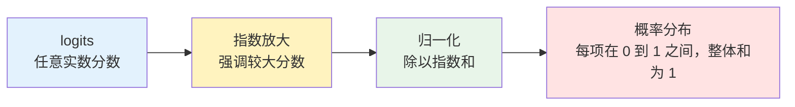
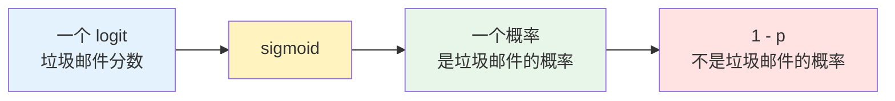

Softmax 是深度学习里最常见的归一化函数之一。它做的事情可以先用一句话概括：

> 把一组任意实数分数，转换成一组总和为 1 的概率分布。

这组输入分数通常叫 logits。logits 可以为正、为负、很大、很小，本身还不是概率。Softmax 通过指数运算和归一化，把它们变成可以比较、可以解释、也可以继续参与训练的概率。

这篇文章按下面的顺序展开：

| 阶段 | 要解决的问题 | 关键图示 |
| --- | --- | --- |
| 直觉与公式 | Softmax 到底把什么变成什么？ | logits 到概率分布的流程 |
| 数值例子 | 一个向量如何一步步算出概率？ | 表格计算 |
| 指数放大 | 为什么大值会被强调？ | 指数函数曲线 |
| 名字来源 | 为什么它叫 Softmax？ | 和 argmax 对比 |
| Sigmoid 对比 | Sigmoid 和 Softmax 到底差在哪？ | Sigmoid 曲线 |
| 温度参数 | 为什么温度能让分布变平或变尖？ | 不同温度下的概率柱状图 |
| 注意力机制 | Softmax 在 Transformer 里做什么？ | 权重分布解释 |

1. Table of Contents, ordered
{:toc}

# 为什么需要 Softmax

假设一个三分类模型输出了三个分数：

$$
z = [2.0,\ 1.0,\ 0.1]
$$

这三个数只能说明模型更偏向第一个类别，但它们还不是概率：

- 它们不在 $$0$$ 到 $$1$$ 之间。
- 它们的和不是 $$1$$。
- 分数之间的差异还没有被转换成“相对可能性”。

Softmax 解决的就是这个问题：保留“分数越大越重要”的排序，同时把所有类别放进同一个概率分布里竞争。

# 公式

对于一个包含 $$K$$ 个元素的向量：

$$
\mathbf{z} = [z_1,\ z_2,\ \dots,\ z_K]
$$

Softmax 的第 $$i$$ 个输出定义为：

$$
\mathrm{softmax}(\mathbf{z})_i
=
\frac{e^{z_i}}{\sum_{j=1}^{K} e^{z_j}}
$$

其中：

- $$z_i$$ 是第 $$i$$ 个类别的原始分数。
- $$e^{z_i}$$ 把分数转换成正数，并放大较大分数之间的差异。
- $$\sum_{j=1}^{K} e^{z_j}$$ 是所有指数分数的总和。
- 除以总和之后，每个输出都变成整体中的占比。

因此 Softmax 的输出满足：

$$
0 < \mathrm{softmax}(\mathbf{z})_i < 1
$$

并且：

$$
\sum_{i=1}^{K} \mathrm{softmax}(\mathbf{z})_i = 1
$$

这就是它能被解释成概率分布的原因。

# 一个完整例子

继续看这个向量：

$$
z = [2.0,\ 1.0,\ 0.1]
$$

第一步，计算每个元素的指数：

$$
e^{2.0} \approx 7.389
$$

$$
e^{1.0} \approx 2.718
$$

$$
e^{0.1} \approx 1.105
$$

第二步，计算指数和：

$$
7.389 + 2.718 + 1.105 \approx 11.212
$$

第三步，分别除以指数和：

| 类别 | logit | 指数值 | Softmax 概率 |
| --- | ---: | ---: | ---: |
| 类别 1 | $$2.0$$ | $$7.389$$ | $$7.389 / 11.212 \approx 0.659$$ |
| 类别 2 | $$1.0$$ | $$2.718$$ | $$2.718 / 11.212 \approx 0.242$$ |
| 类别 3 | $$0.1$$ | $$1.105$$ | $$1.105 / 11.212 \approx 0.099$$ |

最终输出是：

$$
\mathrm{softmax}(z) \approx [0.659,\ 0.242,\ 0.099]
$$

也就是说，模型认为三个类别的相对概率大约是：

- 类别 1：$$65.9\%$$
- 类别 2：$$24.2\%$$
- 类别 3：$$9.9\%$$

注意这里的概率是相对这三个候选类别而言的。Softmax 不会凭空保证模型一定正确，它只是把模型给出的分数转换成一个归一化分布。

# 指数放大的作用

Softmax 里最关键的一步是指数运算。指数函数会把较大的输入放大得更明显。

例如：

| 输入 | 指数 |
| ---: | ---: |
| $$0.1$$ | $$1.105$$ |
| $$1.0$$ | $$2.718$$ |
| $$2.0$$ | $$7.389$$ |

输入从 $$1.0$$ 到 $$2.0$$ 只差 $$1$$，但指数值从 $$2.718$$ 变成 $$7.389$$。这会让较大分数在归一化后占据更大的比例。

所以 Softmax 同时做了两件事：

- 用指数函数强化较大 logit 的优势。
- 用归一化把所有候选项压到同一个概率分布里。

只看表格还不够直观。下面用指数函数曲线看这件事。

## 指数函数曲线

Softmax 里用到的是指数函数 $$e^x$$。它的特点是：输入越大，增长越快。

<figure class="my-4">
  <svg viewBox="0 0 640 360" role="img" aria-label="Exponential function curve" style="max-width: 100%; height: auto; border-radius: 8px; background: #0f172a;">
    <rect x="0" y="0" width="640" height="360" fill="#0f172a"/>
    <line x1="70" y1="300" x2="570" y2="300" stroke="#94a3b8" stroke-width="1.5"/>
    <line x1="320" y1="40" x2="320" y2="300" stroke="#94a3b8" stroke-width="1.5"/>
    <line x1="70" y1="267" x2="570" y2="267" stroke="#334155" stroke-width="1"/>
    <text x="580" y="305" fill="#cbd5e1" font-size="14">x</text>
    <text x="325" y="35" fill="#cbd5e1" font-size="14">y</text>
    <text x="302" y="322" fill="#cbd5e1" font-size="13">0</text>
    <text x="40" y="304" fill="#cbd5e1" font-size="13">0</text>
    <text x="38" y="271" fill="#cbd5e1" font-size="13">1</text>
    <polyline fill="none" stroke="#fb7185" stroke-width="4" stroke-linecap="round" stroke-linejoin="round"
      points="70,296 112,294 153,291 195,286 237,278 278,265 320,235 362,192 403,125 445,38"/>
    <circle cx="320" cy="267" r="4" fill="#facc15"/>
    <text x="336" y="262" fill="#facc15" font-size="14">e⁰=1</text>
    <text x="160" y="72" fill="#e2e8f0" font-size="20" font-weight="700">指数函数：高分会被快速放大</text>
  </svg>
  <figcaption class="text-center text-muted mt-2">指数函数不会把输出限制在 1 以内，它会快速放大正数输入。</figcaption>
</figure>

这解释了 Softmax 为什么会强调较大的 logit。比如 $$2.0$$ 只比 $$1.0$$ 大 $$1$$，但：

$$
e^{2.0} \approx 7.389,\quad e^{1.0} \approx 2.718
$$

指数之后，较大分数的优势被明显放大。

# 为什么叫 Softmax

有了“指数会放大高分”的直觉后，再看 Softmax 这个名字就更自然了。理解 Softmax，最好把它和 argmax 放在一起看。

argmax 是“硬”的最大值选择：只保留最大分数对应的位置，其它位置全部丢掉。对于：

$$
[2.0,\ 1.0,\ 0.1]
$$

argmax 对应的 one-hot 结果可以理解为：

$$
[1,\ 0,\ 0]
$$

它只告诉我们“第一个最大”，不再保留第二个和第三个选项的相对差距。

Softmax 则是“软”的最大值选择：

$$
[0.659,\ 0.242,\ 0.099]
$$

最大值仍然得到最高概率，但其它选项不会被直接清零。它们仍然保留了相对可能性。

| 方法 | 输出 | 特点 |
| --- | --- | --- |
| argmax | one-hot 选择 | 只保留最大项，信息最硬 |
| softmax | 概率分布 | 强调最大项，同时保留其它项的相对可能性 |

这也是“softmax”这个名字的含义：它像 max 一样偏向最大值，但方式更柔和。

# 和 Sigmoid 的区别

Sigmoid 和 Softmax 很容易混在一起，因为它们都会输出 $$0$$ 到 $$1$$ 之间的数。但这只是表面相似。真正的区别在于：

> Sigmoid 把“一个分数”变成“一个判断的概率”；Softmax 把“一组分数”变成“一组互斥选项的概率分布”。

先看 Sigmoid。

## Sigmoid 在做什么

Sigmoid 处理的是单个实数：

$$
\sigma(x) = \frac{1}{1 + e^{-x}}
$$

这个公式的作用是：不管输入 $$x$$ 是多大、多小、正数还是负数，都把它压到 $$0$$ 和 $$1$$ 之间。

| 输入 $$x$$ | Sigmoid 输出 | 直觉 |
| ---: | ---: | --- |
| 很大的正数 | 接近 $$1$$ | 这个判断很可能成立 |
| $$0$$ | $$0.5$$ | 正反两边差不多 |
| 很大的负数 | 接近 $$0$$ | 这个判断很可能不成立 |

例如：

$$
\sigma(2.0) = \frac{1}{1 + e^{-2.0}} \approx 0.881
$$

$$
\sigma(0) = \frac{1}{1 + e^{0}} = 0.5
$$

$$
\sigma(-2.0) = \frac{1}{1 + e^{2.0}} \approx 0.119
$$

画出来就是一条 S 形曲线。输入很小的时候输出接近 $$0$$，输入很大的时候输出接近 $$1$$，输入为 $$0$$ 时输出正好是 $$0.5$$。

<figure class="my-4">
  <svg viewBox="0 0 640 360" role="img" aria-label="Sigmoid function curve" style="max-width: 100%; height: auto; border-radius: 8px; background: #0f172a;">
    <rect x="0" y="0" width="640" height="360" fill="#0f172a"/>
    <line x1="70" y1="300" x2="570" y2="300" stroke="#94a3b8" stroke-width="1.5"/>
    <line x1="320" y1="40" x2="320" y2="300" stroke="#94a3b8" stroke-width="1.5"/>
    <line x1="70" y1="170" x2="570" y2="170" stroke="#334155" stroke-width="1"/>
    <line x1="70" y1="40" x2="570" y2="40" stroke="#334155" stroke-width="1"/>
    <text x="580" y="305" fill="#cbd5e1" font-size="14">x</text>
    <text x="325" y="35" fill="#cbd5e1" font-size="14">y</text>
    <text x="302" y="322" fill="#cbd5e1" font-size="13">0</text>
    <text x="42" y="305" fill="#cbd5e1" font-size="13">0</text>
    <text x="35" y="174" fill="#cbd5e1" font-size="13">0.5</text>
    <text x="42" y="44" fill="#cbd5e1" font-size="13">1</text>
    <polyline fill="none" stroke="#38bdf8" stroke-width="4" stroke-linecap="round" stroke-linejoin="round"
      points="70,299 112,298 153,296 195,291 237,277 278,240 320,170 362,100 403,63 445,49 487,44 528,42 570,41"/>
    <circle cx="320" cy="170" r="5" fill="#facc15"/>
    <text x="336" y="164" fill="#facc15" font-size="14">σ(0)=0.5</text>
    <text x="180" y="72" fill="#e2e8f0" font-size="20" font-weight="700">Sigmoid：把单个分数压到 0 到 1</text>
  </svg>
  <figcaption class="text-center text-muted mt-2">Sigmoid 的输出有上下界：再大的正数也只会接近 1，再小的负数也只会接近 0。</figcaption>
</figure>

这张图对应前面的直觉：

- $$x$$ 越大，$$\sigma(x)$$ 越接近 $$1$$。
- $$x$$ 越小，$$\sigma(x)$$ 越接近 $$0$$。
- $$x = 0$$ 时，正反两边势均力敌，所以输出 $$0.5$$。

所以 Sigmoid 的直觉不是“在多个类别里分配概率”，而是回答一个是非问题：

> 这个东西是不是某一类？这个标签是否成立？这个事件是否发生？

## Sigmoid 适合二分类

比如做垃圾邮件识别，模型最后只输出一个 logit：

$$
x = 2.0
$$

经过 Sigmoid：

$$
\sigma(2.0) \approx 0.881
$$

可以解释为：模型认为这封邮件是垃圾邮件的概率约为 $$88.1\%$$。

这里其实只有一个判断：

- 是垃圾邮件
- 不是垃圾邮件

如果 “是垃圾邮件” 的概率是 $$0.881$$，那 “不是垃圾邮件” 的概率可以理解为：

$$
1 - 0.881 = 0.119
$$

这就是二分类里 Sigmoid 很自然的地方：一个输出就够了，因为正类和负类互为补集。

## Sigmoid 也适合多标签分类

再看一个更容易和 Softmax 搞混的场景：图片标签识别。

一张图片可以同时包含多个标签：

- 有人
- 有车
- 在夜晚
- 在海边

这些标签不是互斥的。一张图完全可以既“有人”，又“有车”，还“在夜晚”。

这种情况下，模型可以给每个标签各输出一个 logit，然后分别做 Sigmoid：

| 标签 | logit | Sigmoid 概率 | 含义 |
| --- | ---: | ---: | --- |
| 人 | $$2.0$$ | $$0.881$$ | 很可能有人 |
| 车 | $$1.2$$ | $$0.768$$ | 也可能有车 |
| 夜晚 | $$0.7$$ | $$0.668$$ | 可能是夜晚 |
| 海边 | $$-1.5$$ | $$0.182$$ | 不太像海边 |

这些概率不需要加起来等于 $$1$$。因为它们不是在争夺同一个名额，而是在分别回答四个独立问题：

- 这张图有没有人？
- 这张图有没有车？
- 这张图是不是夜晚？
- 这张图是不是海边？

这就是 Sigmoid 和 Softmax 的关键分界线。

## Softmax 是互斥竞争

Softmax 处理的是一整个向量。它让多个候选项共享同一个总概率 $$1$$，因此更适合互斥类别的多分类问题。

比如手写数字识别，输入图片只能是 $$0$$ 到 $$9$$ 中的一个数字。模型可以输出 10 个 logits：

$$
[z_0,\ z_1,\ z_2,\ \dots,\ z_9]
$$

经过 Softmax 后，得到 10 个概率：

$$
[p_0,\ p_1,\ p_2,\ \dots,\ p_9]
$$

并且：

$$
\sum_{i=0}^{9} p_i = 1
$$

这里的 10 个类别在竞争同一个总概率。某个数字的概率变高，通常意味着其它数字的概率要被压低。

## 关键区别

| 对比项 | Sigmoid | Softmax |
| --- | --- | --- |
| 核心问题 | 这个判断是否成立？ | 这些互斥选项里哪个更可能？ |
| 输入方式 | 单个 logit，或多个 logit 分别独立处理 | 一组 logits 整体处理 |
| 输出含义 | 每个输出是一个独立概率 | 整体输出是一个概率分布 |
| 概率和 | 多个输出不要求和为 1 | 所有输出和为 1 |
| 类别关系 | 可以不互斥 | 通常互斥 |
| 典型场景 | 二分类、多标签分类 | 单标签多分类、注意力权重 |

一个简单判断标准是：

> 如果多个标签可以同时成立，通常用 Sigmoid；如果多个类别彼此竞争、只能选一个，通常用 Softmax。

也可以换成更口语化的判断：

- Sigmoid 像是在做多道判断题，每一道都回答“是”或“不是”。
- Softmax 像是在做单选题，所有选项一起竞争一个答案。

# 温度参数

Softmax 还经常和温度参数一起使用：

$$
\mathrm{softmax}(\mathbf{z})_i
=
\frac{e^{z_i / \tau}}{\sum_{j=1}^{K} e^{z_j / \tau}}
$$

其中 $$\tau$$ 是 temperature。

| 温度 | 效果 | 直觉 |
| --- | --- | --- |
| $$\tau = 1$$ | 标准 Softmax | 不额外调整分布 |
| $$\tau > 1$$ | 分布更平滑 | 分数差距被压小，模型更不确定 |
| $$\tau < 1$$ | 分布更尖锐 | 分数差距被放大，模型更自信 |

温度越高，输出越接近平均分布；温度越低，输出越接近 argmax。

Softmax 的输入是向量，所以它不像 Sigmoid 那样对应一条单变量曲线。看温度参数时，更直观的画法是：固定一组 logits，看不同温度下输出概率怎么变化。

仍然使用这组 logits：

$$
[2.0,\ 1.0,\ 0.1]
$$

<figure class="my-4">
  <svg viewBox="0 0 720 420" role="img" aria-label="Softmax distributions under different temperatures" style="max-width: 100%; height: auto; border-radius: 8px; background: #0f172a;">
    <rect x="0" y="0" width="720" height="420" fill="#0f172a"/>
    <text x="170" y="42" fill="#e2e8f0" font-size="20" font-weight="700">Softmax：温度改变概率分布的尖锐程度</text>
    <line x1="70" y1="340" x2="670" y2="340" stroke="#94a3b8" stroke-width="1.5"/>
    <line x1="70" y1="80" x2="70" y2="340" stroke="#94a3b8" stroke-width="1.5"/>
    <text x="38" y="344" fill="#cbd5e1" font-size="13">0</text>
    <text x="30" y="214" fill="#cbd5e1" font-size="13">0.5</text>
    <text x="38" y="84" fill="#cbd5e1" font-size="13">1</text>
    <line x1="70" y1="210" x2="670" y2="210" stroke="#334155" stroke-width="1"/>
    <line x1="70" y1="80" x2="670" y2="80" stroke="#334155" stroke-width="1"/>

    <text x="130" y="374" fill="#cbd5e1" font-size="14">τ = 0.5</text>
    <rect x="110" y="115" width="38" height="225" fill="#38bdf8"/>
    <rect x="155" y="310" width="38" height="30" fill="#38bdf8" opacity="0.72"/>
    <rect x="200" y="335" width="38" height="5" fill="#38bdf8" opacity="0.48"/>
    <text x="105" y="103" fill="#38bdf8" font-size="13">0.864</text>

    <text x="330" y="374" fill="#cbd5e1" font-size="14">τ = 1</text>
    <rect x="310" y="169" width="38" height="171" fill="#facc15"/>
    <rect x="355" y="277" width="38" height="63" fill="#facc15" opacity="0.72"/>
    <rect x="400" y="314" width="38" height="26" fill="#facc15" opacity="0.48"/>
    <text x="307" y="157" fill="#facc15" font-size="13">0.659</text>

    <text x="530" y="374" fill="#cbd5e1" font-size="14">τ = 2</text>
    <rect x="510" y="209" width="38" height="131" fill="#34d399"/>
    <rect x="555" y="261" width="38" height="79" fill="#34d399" opacity="0.72"/>
    <rect x="600" y="290" width="38" height="50" fill="#34d399" opacity="0.48"/>
    <text x="508" y="197" fill="#34d399" font-size="13">0.502</text>

    <text x="112" y="356" fill="#cbd5e1" font-size="12">类1</text>
    <text x="157" y="356" fill="#cbd5e1" font-size="12">类2</text>
    <text x="202" y="356" fill="#cbd5e1" font-size="12">类3</text>
    <text x="312" y="356" fill="#cbd5e1" font-size="12">类1</text>
    <text x="357" y="356" fill="#cbd5e1" font-size="12">类2</text>
    <text x="402" y="356" fill="#cbd5e1" font-size="12">类3</text>
    <text x="512" y="356" fill="#cbd5e1" font-size="12">类1</text>
    <text x="557" y="356" fill="#cbd5e1" font-size="12">类2</text>
    <text x="602" y="356" fill="#cbd5e1" font-size="12">类3</text>
  </svg>
  <figcaption class="text-center text-muted mt-2">同一组 logits 下，低温更接近 argmax，高温会给次优选项更多概率。</figcaption>
</figure>

图里三组柱子对应同一组 logits 的三种 Softmax：

| 温度 | 输出概率 | 直觉 |
| --- | --- | --- |
| $$\tau = 0.5$$ | $$[0.864,\ 0.117,\ 0.019]$$ | 最大项非常突出 |
| $$\tau = 1$$ | $$[0.659,\ 0.242,\ 0.099]$$ | 标准 Softmax |
| $$\tau = 2$$ | $$[0.502,\ 0.304,\ 0.194]$$ | 分布更平滑，次优项权重更高 |

这就是为什么温度参数常出现在知识蒸馏和生成模型采样里。知识蒸馏里，提高温度可以让学生模型看到教师模型对非最高类别的细腻判断；生成模型里，调整温度可以控制输出更保守还是更多样。

# 在注意力机制里的作用

Softmax 不只用于分类输出层，也用于 Transformer 的注意力机制。

在注意力里，模型会先计算 Query 和 Key 的相似度，得到一组原始注意力分数：

$$
S = QK^T
$$

这些分数同样不是概率。它们只是“这个 token 和那个 token 有多相关”的原始打分。经过 Softmax 后：

$$
A = \mathrm{softmax}(S)
$$

每一行就变成一个注意力分布，表示当前位置应该从其它位置分别拿多少信息。

再用这个权重矩阵去加权 Value：

$$
O = AV
$$

所以在注意力机制里，Softmax 的角色不是“预测类别”，而是“把相关性分数变成权重分布”。

| 场景 | Softmax 输入 | Softmax 输出 |
| --- | --- | --- |
| 多分类输出层 | 每个类别的 logits | 每个类别的概率 |
| 注意力机制 | token 之间的相似度分数 | 每个 token 对其它 token 的注意力权重 |

# 小结

Softmax 的核心可以压缩成三点：

- 它把任意实数向量转换成概率分布，输出每项在 $$0$$ 到 $$1$$ 之间，整体和为 $$1$$。
- 它是 argmax 的“软”版本，强调最大值，但保留其它选项的相对可能性。
- 它不仅用于多分类输出层，也用于 Transformer 里的注意力权重归一化。

如果只记住一个公式，就是：

$$
\mathrm{softmax}(\mathbf{z})_i
=
\frac{e^{z_i}}{\sum_{j=1}^{K} e^{z_j}}
$$

如果只记住一个直觉，就是：

> Softmax 先用指数突出高分，再用归一化让所有候选项在同一个概率池里竞争。
