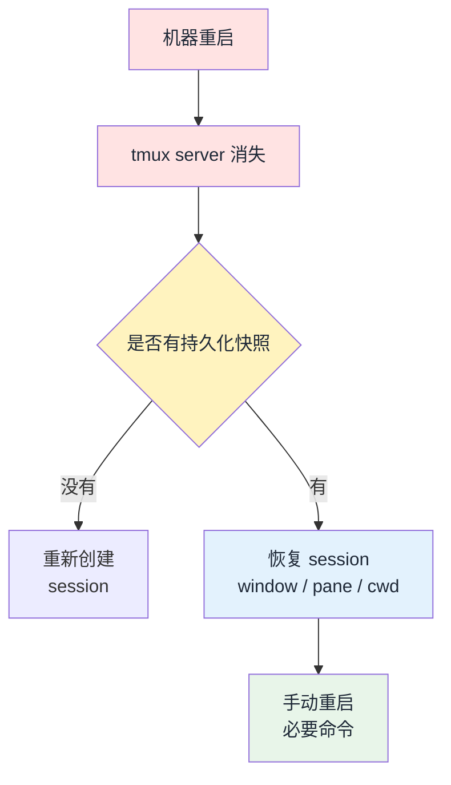

1. Table of Contents, ordered
{:toc}

## 问题：重启后还能 attach 吗

Tmux 的 session 存在于 tmux server 进程里。机器重启后，tmux server、session、window、pane 以及其中运行的进程都会消失，所以原来的 session 不能再通过 `tmux attach` 找回来。

`tmux attach` 只能连接仍然存在的 session。如果重启后执行：

```bash
tmux ls
```

看到 `no server running`，就说明原来的 tmux server 已经没了。这时能做的不是 attach，而是重新创建工作区，或者依赖提前配置好的持久化插件恢复工作区结构。

## 可恢复的不是进程，而是工作区结构

这次选择的方案是 [tmux-resurrect](https://github.com/tmux-plugins/tmux-resurrect) 加 [tmux-continuum](https://github.com/tmux-plugins/tmux-continuum)。

它们能恢复的核心对象是：

- session 名称
- window 名称和顺序
- pane 布局
- 每个 pane 的当前目录
- 一部分可安全重启的命令

它们不能恢复真正的进程内存状态，例如 SSH 连接、REPL 里的临时变量、正在跑到一半的任务、没有写入文件的输出。更准确地说，这套方案恢复的是“工作台”，不是“虚拟机快照”。



## 已安装的插件与配置

本机已经安装了 Tmux Plugin Manager：

```bash
~/.tmux/plugins/tpm
```

并通过它安装了：

- `tmux-resurrect`
- `tmux-continuum`

当前 `~/.tmux.conf` 末尾追加了如下配置：

```tmux
set -g @plugin 'tmux-plugins/tpm'
set -g @plugin 'tmux-plugins/tmux-resurrect'
set -g @plugin 'tmux-plugins/tmux-continuum'

set -g @continuum-save-interval '15'
set -g @continuum-restore 'on'

set -g @resurrect-processes 'vim nvim less man tail'

run '~/.tmux/plugins/tpm/tpm'
```

这里的关键点有三个：

- `@continuum-save-interval '15'`：每 15 分钟自动保存一次 tmux 工作区。
- `@continuum-restore 'on'`：tmux server 启动时自动恢复最近一次保存的工作区。
- `@resurrect-processes`：只保守恢复 `vim`、`nvim`、`less`、`man`、`tail` 这类程序，避免把复杂服务误当成可随意恢复的进程。

快照实际保存目录是：

```bash
~/.local/share/tmux/resurrect/
```

其中 `last` 会指向最近一次保存的快照文件。

## 重启后怎么恢复

重启后，通常直接启动 tmux 即可：

```bash
tmux
```

因为已经启用了 `@continuum-restore 'on'`，第一次启动 tmux server 时会尝试自动恢复最近一次保存的工作区。

如果没有自动恢复，进入 tmux 后手动执行恢复快捷键：

```text
Ctrl-b  Ctrl-r
```

手动保存当前状态则是：

```text
Ctrl-b  Ctrl-s
```

如果恢复后想确认有哪些 session：

```bash
tmux ls
```

再按需 attach：

```bash
tmux attach -t <session-name>
```

## 和 systemd 的边界

Tmux 持久化适合恢复开发环境的布局，例如一个项目里固定有 editor、server、git、notes 几个窗口。它让人重启后快速回到熟悉的工作区。

但长期运行服务不应该依赖 tmux 恢复。比如博客预览、后台 worker、数据库、监控脚本等，更适合交给 `systemd` 或专门的进程管理器。Tmux 负责“工作区”，`systemd` 负责“服务”。

最终的实践原则是：把 tmux 当成工作台快照，把重要任务写成可重入脚本，日志落盘，真正的后台服务交给服务管理器。这样即使机器重启，也能以最小成本恢复工作现场。

## 完整 `~/.tmux.conf` 配置

以下是本机当前使用的完整 tmux 配置，每行都加了注释说明用途。

```bash
# 设置 prefix 键为 Ctrl-b（tmux 默认值，保持不变）
set -g prefix C-b

# prefix + r：重载配置文件，并在状态栏弹出提示
bind r source-file ~/.tmux.conf \; display "Configuration Reloaded!"

# prefix + h/j/k/l：仿 vim 方向键在 pane 之间移动（同时保留原有的方向键支持）
bind-key h select-pane -L
bind-key j select-pane -D
bind-key k select-pane -U
bind-key l select-pane -R

# prefix + Ctrl-l：快速切换到上一个 window
bind-key C-l select-window -l

# 根据当前运行的命令自动更新 window 名称
set-window-option -g automatic-rename on
# 同步更新终端标题栏（让 terminal emulator 的标题也跟着变）
set-option -g set-titles on

# copy-mode 下使用 vi 风格按键（j/k 翻行、/ 搜索等）
setw -g mode-keys vi
# 启用鼠标支持：可点击切换 pane/window，滚轮可翻页
set -g mouse on

# prefix + v：左右分割当前 pane（vertical split）
bind-key v split-window -h
# prefix + s：上下分割当前 pane（horizontal split）
bind-key s split-window -v

# prefix + "：上下分割，继承当前 pane 的工作目录
bind '"' split-window -c "#{pane_current_path}"
# prefix + %：左右分割，继承当前 pane 的工作目录
bind % split-window -h -c "#{pane_current_path}"
# prefix + c：新建 window，继承当前 pane 的工作目录
bind c new-window -c "#{pane_current_path}"

# 状态栏背景色
set -g status-bg black
# 状态栏文字颜色
set -g status-fg yellow
# 以下三行已注释，若需要高亮当前 window 标签可按需启用
#set -g window-status-current-bg white
#set -g window-status-current-fg black
#set -g window-status-current-attr bold
# 状态栏刷新间隔（秒）
set -g status-interval 60
# 状态栏左侧最大显示宽度
set -g status-left-length 60
# 状态栏左侧：红色显示 session 名，后跟当前用户名
set -g status-left '#[fg=red](#S) #(whoami)'
# 状态栏右侧：黄色显示系统 1/5/15 分钟负载均值，绿色显示当前时间
set -g status-right '#[fg=yellow]#(cut -d " " -f 1-3 /proc/loadavg)#[default] #[fg=green]%H:%M#[default]'

# 加载 TPM（Tmux Plugin Manager）本身
set -g @plugin 'tmux-plugins/tpm'
# 加载 tmux-resurrect：提供手动保存（prefix + Ctrl-s）和恢复（prefix + Ctrl-r）
set -g @plugin 'tmux-plugins/tmux-resurrect'
# 加载 tmux-continuum：在 resurrect 基础上增加自动定时保存
set -g @plugin 'tmux-plugins/tmux-continuum'

# 每 15 分钟自动保存一次工作区快照到 ~/.local/share/tmux/resurrect/
set -g @continuum-save-interval '15'
# tmux server 启动时自动恢复最近一次保存的工作区
set -g @continuum-restore 'on'

# 恢复时只重启这几个安全的轻量命令；复杂服务应显式重启，不靠 resurrect 代劳
set -g @resurrect-processes 'vim nvim less man tail'

# 必须放在最后一行：引导 TPM 初始化并加载所有已声明的插件
run '~/.tmux/plugins/tpm/tpm'
```
