上一篇文章已经从 Attention、Q/K/V 一路讲到了 KV Cache：[从 Attention 到 KV Cache：理解 Transformer 的注意力机制与推理加速]()。

那篇文章里有一个很基础的入口：如果有两个序列 $$X_1 \in \mathbb{R}^{n \times d}$$ 和 $$X_2 \in \mathbb{R}^{m \times d}$$，那么 $$X_1X_2^T$$ 会得到一个 $$n \times m$$ 的相关性矩阵；再经过 softmax 得到权重，最后乘以 $$X_2$$，就得到“$$X_1$$ 关注了 $$X_2$$ 之后的新表示”。

这篇文章不再重复展开这个例子，而是接着往下看一个更贴近推理过程的问题：

> LLM 在生成文本时，为什么要分成 prefill 和 decode？既然最终只需要预测下一个 token，prefill 为什么还要算整段 prompt 的注意力？decode 又为什么不重新算完整的 $$n \times n$$ 注意力矩阵？

我们用一个两层 Transformer 的简化例子，把 prefill 和 decode 的计算过程完整走一遍。

1. Table of Contents, ordered
{:toc}

# 从一次生成过程开始

先不要急着看结论。理解 prefill 和 decode，最好从一次 LLM 推理的时间线开始。

假设用户输入的 prompt 是两个 token：

```text
你 好
```

模型要做的第一件事，是读完这两个 token，然后预测第 3 个 token。假设它预测出了：

```text
世
```

接下来，模型再把“世”接到上下文后面，用“你 好 世”继续预测第 4 个 token。这个过程不断重复：

```text
你 好 -> 世 -> 界 -> ...
```

这里天然分成两类工作：

| 工作 | 发生在什么时候 | 直觉 |
| --- | --- | --- |
| 读 prompt | 用户输入已经完整给定时 | 把已有上下文读进去 |
| 继续生成 | 第一个新 token 出来之后 | 一个 token 一个 token 往后写 |

这两类工作分别叫 **prefill** 和 **decode**。

这里的术语是 **prefill**，意思更接近“预先填充”：先把已有 prompt 对应的逐层 KV Cache 填好。

## 什么是 Prefill

Prefill 是模型处理已有 prompt 的阶段。

给定 prompt：

```text
你 好
```

prefill 要做的不是“生成这两个 token”，因为它们已经存在了。prefill 要做的是：

1. 让模型读完这两个 token。
2. 在每一层为这两个 token 算出 K/V，并写入 KV Cache。
3. 只拿最后一个位置的输出，预测第一个新 token，也就是“好”后面的 token。

所以 prefill 的重点不是“输出 prompt 里的每个 token”，而是：

> 把已有 prompt 转成后续生成能复用的逐层 KV Cache，并用 prompt 的最后一个位置预测第一个新 token。

如果 prompt 长度是 $$n$$，实际系统通常会把这 $$n$$ 个 token 一次性送进模型。在每一层里，它会并行计算：

$$
Q_{1:n}, K_{1:n}, V_{1:n}
$$

然后做 causal self-attention：

$$
\mathrm{softmax}\left(\frac{Q_{1:n}K_{1:n}^T + M}{\sqrt{d_k}}\right)V_{1:n}
$$

其中 $$M$$ 是 causal mask。它会把未来位置屏蔽掉，确保第 $$i$$ 个 token 只能看 $$1 \sim i$$ 这些位置。

这一点很重要：虽然 prefill 一次性处理整段 prompt，但它不是让前面的 token 偷看后面的 token。causal mask 会保证“你”看不到“好”，而“好”可以看“你”和“好”。

## Causal Mask 到底怎么实现

上一篇文章已经讲过 attention 的基本公式。这里不重新展开 Q/K/V，只补一个本篇会反复用到的细节：公式里的 $$+M$$ 到底怎么实现。

先说本质：

> Causal mask 就是让前面的 token 对后面 token 的注意力变成 0。注意力为 0，就等于当前 token 完全拿不到未来 token 的信息；拿不到信息，就等价于未来 token 在当前这次计算里不存在。

所以 causal mask 不是把未来 token 从矩阵里物理删除，而是在 softmax 前改分数，让未来位置在 softmax 后分不到任何权重。最后，当前位置的注意力只能分配给自己和前面的历史 token。

朴素地说，causal mask 就是在 attention 分数矩阵上动手脚：

- 允许看的位置，加 $$0$$，不改变原分数。
- 不允许看的未来位置，加一个非常大的负数，工程里常写成 $$-\infty$$ 或接近 $$-\infty$$ 的数。

为什么这样就能屏蔽未来？因为 softmax 会把很大的负数变成接近 0 的概率。

先看两个 token 的 prompt：

```text
你 好
```

未加 mask 前，attention 分数矩阵是：

| 原始分数 | key: 你 | key: 好 |
| --- | --- | --- |
| query: 你 | $$s_{11}$$ | $$s_{12}$$ |
| query: 好 | $$s_{21}$$ | $$s_{22}$$ |

但是 token “你”不应该看未来的 token “好”。所以 mask 矩阵是：

| $$M$$ | key: 你 | key: 好 |
| --- | --- | --- |
| query: 你 | $$0$$ | $$-\infty$$ |
| query: 好 | $$0$$ | $$0$$ |

把它加到原始分数上：

| 加 mask 后 | key: 你 | key: 好 |
| --- | --- | --- |
| query: 你 | $$s_{11} + 0$$ | $$s_{12} - \infty$$ |
| query: 好 | $$s_{21} + 0$$ | $$s_{22} + 0$$ |

然后对每一行做 softmax：

| softmax 后 | key: 你 | key: 好 | 含义 |
| --- | --- | --- | --- |
| query: 你 | $$1$$ | $$0$$ | “你”只能看自己 |
| query: 好 | $$\alpha_{21}$$ | $$\alpha_{22}$$ | “好”可以看“你”和“好” |

真实计算里，$$s_{12} - \infty$$ 不一定真的是数学上的负无穷，而是一个足够小的数。只要它经过 softmax 后变成 0，就达到了屏蔽效果。

如果 prompt 有 5 个 token，mask 的形状就是一个下三角矩阵：

| $$M$$ | key 1 | key 2 | key 3 | key 4 | key 5 |
| --- | --- | --- | --- | --- | --- |
| query 1 | 0 | $$-\infty$$ | $$-\infty$$ | $$-\infty$$ | $$-\infty$$ |
| query 2 | 0 | 0 | $$-\infty$$ | $$-\infty$$ | $$-\infty$$ |
| query 3 | 0 | 0 | 0 | $$-\infty$$ | $$-\infty$$ |
| query 4 | 0 | 0 | 0 | 0 | $$-\infty$$ |
| query 5 | 0 | 0 | 0 | 0 | 0 |

这张表的读法是：第 $$i$$ 行代表第 $$i$$ 个 token 发起查询；它只能看自己和左边的历史 token，不能看右边的未来 token。

因此，mask 的具体实现原理可以压缩成一句话：

> 先把未来位置的分数压到极小，再用 softmax 把它们变成 0 权重；权重为 0 的 token 不参与后面的加权求和，所以对当前 token 来说就像不存在。

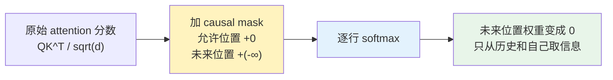

推理时，prefill 通常不需要 prompt 中每个位置的 logits。比如输入是“你 好”，那“你”这个位置的 logits 对当前生成没有价值，因为“好”已经由用户给定了。真正用于生成的是最后一个位置“好”的 logits，它负责预测第一个新 token。

但这不代表前面位置的计算都没用。前面位置的 hidden states 和 K/V 仍然要算出来，因为后续 decode 会反复读这些 KV Cache。

## 什么是 Decode

Decode 是模型开始生成新 token 之后的阶段。

prefill 预测出第 3 个 token “世”之后，下一步要预测第 4 个 token。此时 decode 的输入不是完整的“你 好 世”，而是当前新增的 token “世”。

在每一层里，模型只为当前 token 计算：

$$
q_3, k_3, v_3
$$

然后让当前 token 的 query 去看历史和当前的 keys：

$$
\mathrm{softmax}\left(
\frac{q_3 [K_1, K_2, k_3]^T}{\sqrt{d_k}}
\right)
[V_1, V_2, v_3]
$$

所以 decode 的 attention 形状不是 $$3 \times 3$$，而是 $$1 \times 3$$。

这就是 KV Cache 的价值：历史 token 的 K/V 已经存在，不需要再从头算一遍。decode 每一步只做三件事：

1. 为当前新 token 算 Q/K/V。
2. 读取历史 KV Cache，让当前 token attend 历史和自己。
3. 把当前 token 的 K/V 追加进 KV Cache，用来服务下一个 token。

## Prefill 和 Decode 的区别

现在再看两者区别就自然多了：

| 问题 | Prefill | Decode |
| --- | --- | --- |
| 输入是什么 | 用户已经给定的整段 prompt | 上一步刚生成的新 token |
| token 是否已经全部存在 | 是，prompt token 已经全部可见 | 否，未来 token 还没生成 |
| 通常怎么计算 | 整段 prompt 并行算 | 逐 token 串行算 |
| Attention 形状 | $$n \times n$$，带 causal mask | $$1 \times t$$，看历史和当前 token |
| KV Cache | 创建 prompt token 的 K/V | 读取历史 K/V，并追加当前 token 的 K/V |
| logits 怎么用 | 通常只用最后位置预测第一个新 token | 每一步都用当前位置预测下一个 token |

## 为什么 Prefill 是并行的，而 Decode 是串行的

prefill 并行，是因为 prompt 已经完整给定。

如果 prompt 是 5 个 token，那么 token 1 到 token 5 都已经摆在模型面前。模型完全可以把它们组成一个矩阵，一次性算出所有位置的 Q/K/V 和 attention。causal mask 会负责禁止“看未来”，所以并行计算不会破坏自回归规则。

decode 串行，是因为未来 token 还不存在。

生成 token 6 之前，token 6 不存在；生成 token 7 之前，token 7 也不存在。模型只能先预测 token 6，再把 token 6 放回上下文，继续预测 token 7。这不是工程实现懒，而是自回归生成本身的约束。

## Prefill 能不能串行做

可以。prefill 完全可以像 decode 一样串行做。

假设 prompt 已经有 5 个 token。理论上可以这样处理：

1. 先处理 token 1，算出它在每一层的 K/V。
2. 再处理 token 2，让它 attend token 1 和 token 2，继续追加 K/V。
3. 一直串行处理到 token 5。
4. 最后只拿 token 5 的顶层输出去预测 token 6。

这条串行路线和 decode 的理解方式非常接近：每次只处理当前 token，读取已有 KV Cache，再把当前 token 的 K/V 追加进去。

问题只是：这样太慢。

prompt token 已经全部存在，串行做等于故意放弃并行矩阵计算。实际系统更愿意一次性处理整段 prompt，用更大的矩阵乘法把 GPU 吃满。可以这样理解：

> 串行 prefill 在逻辑上成立；并行 prefill 是工程上更快的实现方式。

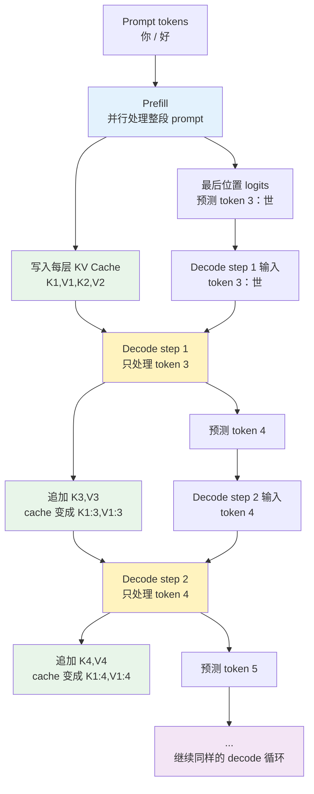

# 两层 Transformer 的完整例子

现在用一个简化模型走完整流程。

假设：

- 模型有 2 层：Layer 1 和 Layer 2。
- hidden size 是 $$d_{model}=4$$。
- 为了讲清楚流程，先看单头注意力。
- prompt 是两个 token：“你”“好”。
- prefill 后预测第 3 个 token “世”。
- 下一步 decode 用“世”作为输入，预测第 4 个 token。

为了区分层和位置，后面用这些符号：

| 符号 | 含义 |
| --- | --- |
| $$x_i$$ | 第 $$i$$ 个 token 的 embedding 或当前层输入 |
| $$h_i^{(l)}$$ | 第 $$l$$ 层输出里，第 $$i$$ 个位置的 hidden state |
| $$q_i^{(l)}, k_i^{(l)}, v_i^{(l)}$$ | 第 $$l$$ 层里，第 $$i$$ 个位置的 Q/K/V |
| $$K_{1:t}^{(l)}, V_{1:t}^{(l)}$$ | 第 $$l$$ 层 cache 里前 $$t$$ 个 token 的 K/V |

注意：KV Cache 是按层存的。Layer 1 的 K/V 和 Layer 2 的 K/V 不是同一批东西，因为它们来自不同层的输入 hidden states。

先用一张总图把整个过程摆出来：

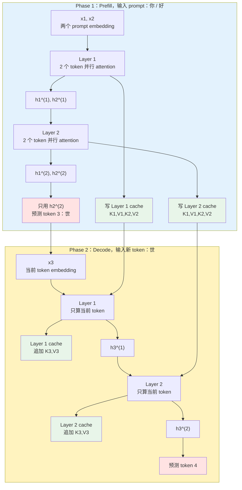

这张图里最重要的不是每个矩阵乘法，而是三条数据流：

| 数据流 | 含义 |
| --- | --- |
| 纵向流动 | Layer 1 的输出成为 Layer 2 的输入 |
| 横向缓存 | 每一层都写自己的 KV Cache |
| 生成闭环 | prefill 预测出 token 3，token 3 再作为下一轮 decode 的输入 |

# Phase 1：Prefill 处理“你 好”

prefill 的输入是两个 token 的 embedding：$$x_1$$ 表示“你”，$$x_2$$ 表示“好”。两个 token 已经同时存在，所以这一阶段会把它们作为一个长度为 2 的小矩阵并行处理。

先看 prefill 的整体时序：

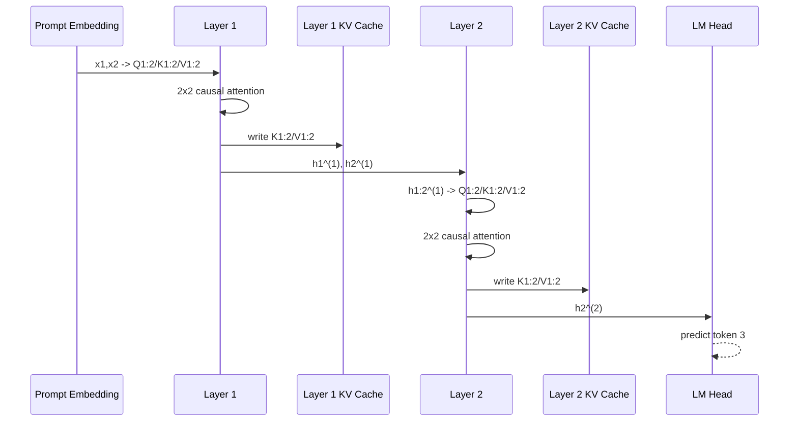

这张图强调的是：prefill 会按层往上走，每一层都会写自己的 KV Cache；最后只有顶层最后一个位置 $$h_2^{(2)}$$ 送到 LM Head，用来预测第 3 个 token。

## Layer 1：从 embedding 得到第一层表示

Layer 1 做三件事：

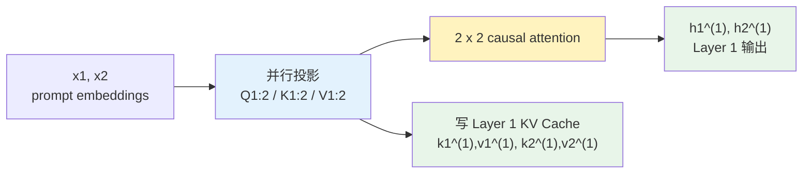

关键公式只需要看这一条：

$$
H_{1:2}^{(1)}
=
\mathrm{softmax}
\left(
\frac{Q_{1:2}^{(1)}K_{1:2}^{(1)T} + M}{\sqrt{4}}
\right)
V_{1:2}^{(1)}
$$

这里 $$Q_{1:2}^{(1)}, K_{1:2}^{(1)}, V_{1:2}^{(1)}$$ 都是由 $$x_1, x_2$$ 并行投影得到的。$$M$$ 就是前面讲过的 causal mask：允许位置加 $$0$$，未来位置加 $$-\infty$$。

如果只看 attention 可见性，它是一个 $$2 \times 2$$ 小矩阵：

| Layer 1 attention | token 1：“你” | token 2：“好” |
| --- | --- | --- |
| token 1：“你” | 可见 | 屏蔽 |
| token 2：“好” | 可见 | 可见 |

也就是说：

- “你”只能看“你”。
- “好”可以看“你”和“好”。

这一层结束后有两个结果：一份输出 $$h_1^{(1)}, h_2^{(1)}$$ 继续送往 Layer 2；一份 K/V 写入 Layer 1 的 KV Cache。

## Layer 2：用第一层输出继续计算

Layer 2 的结构和 Layer 1 一样，但输入已经变了：它吃的不是原始 embedding，而是 Layer 1 的输出 $$h_1^{(1)}, h_2^{(1)}$$。

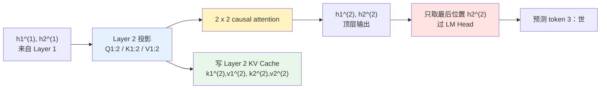

关键公式是：

$$
H_{1:2}^{(2)}
=
\mathrm{softmax}
\left(
\frac{Q_{1:2}^{(2)}K_{1:2}^{(2)T} + M}{\sqrt{4}}
\right)
V_{1:2}^{(2)}
$$

现在 prefill 完成后，cache 里有：

| 层 | 缓存内容 |
| --- | --- |
| Layer 1 | $$k_1^{(1)}, k_2^{(1)}, v_1^{(1)}, v_2^{(1)}$$ |
| Layer 2 | $$k_1^{(2)}, k_2^{(2)}, v_1^{(2)}, v_2^{(2)}$$ |

最后，用最顶层最后一个位置 $$h_2^{(2)}$$ 过 LM Head：

$$
\mathrm{logits}_3 = h_2^{(2)}W_{\mathrm{lm}}
$$

再经过采样或 argmax，得到第 3 个 token，比如“世”。

这里要注意：prefill 期间也可以对 $$h_1^{(2)}$$ 计算 logits，它对应“只看第 1 个 token 时预测第 2 个 token”。在训练里，这个位置是有用的，因为每个位置都可以参与 next-token loss；但在推理时，prompt 已经给定，所以我们通常只关心最后一个位置 $$h_2^{(2)}$$ 预测出来的第 3 个 token。

# Phase 2：Decode 输入“世”

prefill 之后，模型已经输出了第 3 个 token “世”。下一轮 decode 的目标是预测第 4 个 token。

decode 的输入是“世”的 embedding $$x_3$$。它不是把 “你 好 世” 三个 token 重新送进模型，而是只送当前新增的 token。

先看 decode 的整体时序：

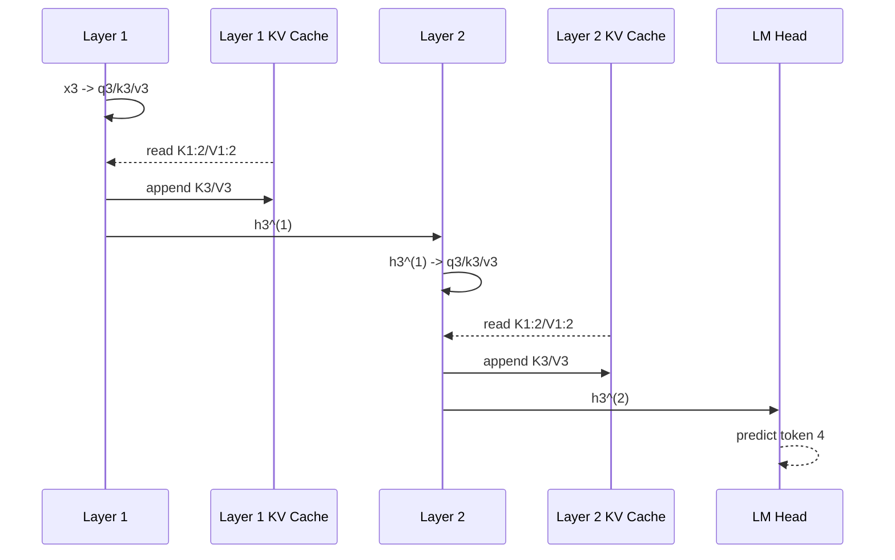

这张图和 prefill 的差异很明显：decode 每层都只处理当前 token，但会读本层历史 cache，并把当前 token 的 K/V 追加进去。

## Layer 1：只算当前 token 的 Q/K/V

Layer 1 的局部流程是：

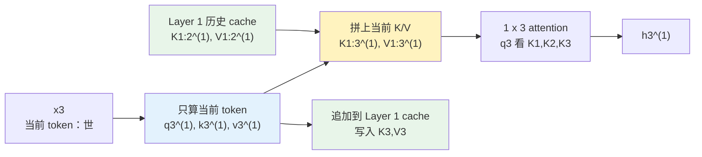

关键公式是：

$$
h_3^{(1)}
=
\mathrm{softmax}
\left(
\frac{q_3^{(1)}K_{1:3}^{(1)T}}{\sqrt{4}}
\right)
V_{1:3}^{(1)}
$$

这里的关键是：$$q_3^{(1)}, k_3^{(1)}, v_3^{(1)}$$ 是刚算的；$$K_{1:2}^{(1)}, V_{1:2}^{(1)}$$ 是从 Layer 1 cache 读出来的。

attention 可见性变成一行：

| Decode Layer 1 score | $$k_1^{(1)}$$ | $$k_2^{(1)}$$ | $$k_3^{(1)}$$ |
| --- | --- | --- | --- |
| $$q_3^{(1)}$$ | 看 token 1 | 看 token 2 | 看 token 3 |

这一层结束后，$$h_3^{(1)}$$ 送往 Layer 2，当前 token 的 $$k_3^{(1)}, v_3^{(1)}$$ 追加到 Layer 1 cache。

## Layer 2：输入是当前 token 的第一层输出

Layer 2 的流程和 Layer 1 完全同构，只是输入和 cache 都换成了 Layer 2 自己的。

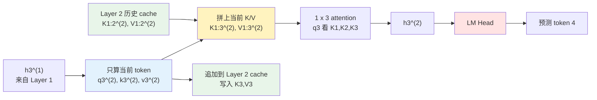

关键公式是：

$$
h_3^{(2)}
=
\mathrm{softmax}
\left(
\frac{q_3^{(2)}K_{1:3}^{(2)T}}{\sqrt{4}}
\right)
V_{1:3}^{(2)}
$$

最后用 $$h_3^{(2)}$$ 过 LM Head：

$$
\mathrm{logits}_4 = h_3^{(2)}W_{\mathrm{lm}}
$$

得到第 4 个 token 的预测。

# 为什么 Decode 不算 3 × 3

很多人第一次理解 KV Cache 时，会自然想到：

> 之前 2 个 token 已经算过 $$2 \times 2$$，现在有 3 个 token，是不是要算 $$3 \times 3$$？那前面的 4 个格子不是重复了吗？所以 KV Cache 是不是要缓存之前的 attention 权重？

答案是：不需要，也不会缓存 attention 权重。

因为 decode 时我们只需要当前 token 的输出。前两个 token 的输出已经在 prefill 里算过了，它们不会因为第 3 个 token 出现而改变。

原因是 causal mask：

- token 1 不能看 token 2、token 3。
- token 2 不能看 token 3。
- token 3 可以看 token 1、token 2、token 3。

所以当 token 3 到来时，真正新增且有用的只有最后一行：

| 如果重新算 $$3 \times 3$$ | token 1 | token 2 | token 3 |
| --- | --- | --- | --- |
| token 1 | 旧结果 | 屏蔽 | 屏蔽 |
| token 2 | 旧结果 | 旧结果 | 屏蔽 |
| token 3 | 新计算 | 新计算 | 新计算 |

前两行不会被 token 3 影响，重新计算没有意义。decode 只算最后一行，也就是 $$1 \times 3$$。

KV Cache 缓存 K/V，而不是 attention 权重，是因为下一步 token 4 到来时，需要的是：

$$
q_4 [K_1, K_2, K_3, K_4]^T
$$

这里会产生一组新的权重。它们取决于新的 $$q_4$$，所以旧的 attention 权重对 token 4 没有直接用途。

# Prefill 为什么要算整段 prompt

这个问题容易问偏。更准确的问法应该是：

> 推理时明明只用 prompt 最后一个位置的 logits 来预测第一个新 token，为什么 prefill 还要处理 prompt 里的所有位置？

答案是：**logits 可以只用最后一个位置，但 KV Cache 不能只准备最后一个位置。**

把 prefill 的产物拆开看，就清楚了：

| 产物 | 是否每个 prompt 位置都需要 | 原因 |
| --- | --- | --- |
| 顶层 logits | 不需要 | 推理时只用最后一个位置预测第一个新 token |
| 每层 hidden states | 需要 | 下一层要用它们继续计算 |
| 每层 K/V Cache | 需要 | 后续 decode 的每个新 token 都要 attend 整段 prompt |

所以，prefill 不是为了“每个 prompt 位置都预测一个 token”，而是为了“把整段 prompt 变成后续 decode 可复用的逐层 KV Cache”。

## 不能只算最后一个 logits

如果 prompt 是：

```text
token 1, token 2, token 3, token 4, token 5
```

推理时，确实只需要 token 5 的顶层输出过 LM Head，预测 token 6：

$$
\mathrm{logits}_6 = h_5^{(\mathrm{last})}W_{\mathrm{lm}}
$$

token 1 到 token 4 的顶层 logits 通常不需要。因为 token 2、3、4、5 已经是用户给定的 prompt，不需要模型重新预测它们。

但“不要前面位置的 logits”不等于“不要前面位置的计算”。前面位置的中间表示和 K/V 仍然是必要的。

## Decode 需要整段 prompt 的 K/V

prefill 结束后，如果模型预测出了 token 6，那么下一步 decode token 6 时，它要看的是：

```text
token 1, token 2, token 3, token 4, token 5, token 6
```

也就是说，token 6 的 query 要和历史所有 token 的 key 做注意力：

$$
q_6 [K_1, K_2, K_3, K_4, K_5, K_6]^T
$$

这里的 $$K_1 \sim K_5$$ 就来自 prompt。对应的 $$V_1 \sim V_5$$ 也要参与加权求和。

如果 prefill 时只算了最后一个 token 5 的 K/V，没有算 token 1 到 token 4 的 K/V，那么 decode token 6 时就会缺历史上下文。模型就没法让 token 6 attend 完整 prompt。

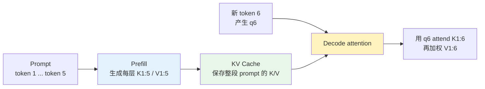

这就是 prefill 必须覆盖整段 prompt 的第一个原因：后续 decode 不是只看 prompt 最后一个 token，而是会看整段 prompt。

## 多层模型还需要逐层构建 K/V

还有一个更容易忽略的点：KV Cache 是按层存的。

Layer 2 的 K/V 不是直接从原始 token embedding 算出来的，而是从 Layer 1 的输出算出来的：

$$
K_i^{(2)} = h_i^{(1)}W_K^{(2)}
$$

$$
V_i^{(2)} = h_i^{(1)}W_V^{(2)}
$$

所以，要得到 Layer 2 里 token 1 到 token 5 的 K/V，就必须先得到 Layer 1 里 token 1 到 token 5 的 hidden states。

这就是为什么 prefill 不能只让最后一个 token 一路往上跑。每一层都要为所有 prompt 位置产出下一层需要的输入，并顺手写入本层 KV Cache。

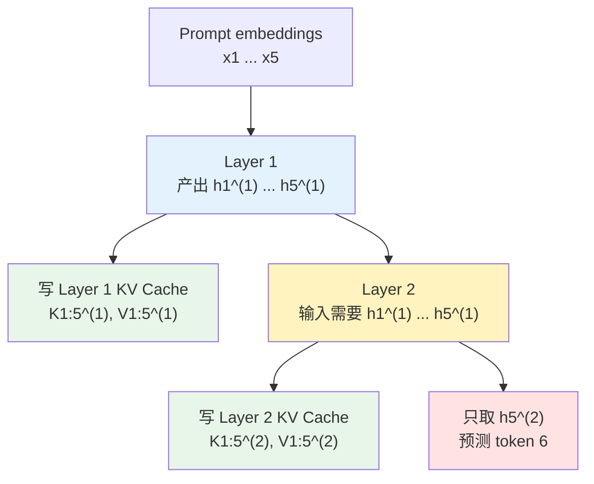

这张图里，“只取 $$h_5^{(2)}$$ 预测 token 6”和“为所有位置写 KV Cache”并不矛盾：

- logits 只需要最后一个位置；
- cache 需要所有 prompt 位置；
- deeper layer 的计算也需要所有 prompt 位置的 hidden states。

## 那能不能串行算整段 prompt

可以。逻辑上完全可以像 decode 一样，从 token 1 串行处理到 token 5：

```text
token 1 -> 写 K1,V1
token 2 -> 读 K1,V1 -> 写 K2,V2
token 3 -> 读 K1:2,V1:2 -> 写 K3,V3
...
token 5 -> 读 K1:4,V1:4 -> 写 K5,V5 -> 预测 token 6
```

这样也能得到完整的 KV Cache，也能只用 token 5 的 logits 预测 token 6。

但这很慢。prompt 里的 token 已经全部存在，没有必要真的一个一个等。把整段 prompt 并行送进去，配合 causal mask，一次性得到所有位置的 hidden states 和 K/V，结果等价，速度更快。

## GPU 更适合并行处理 prompt

prefill 天然适合 GPU，是因为它可以把 prompt 组成大矩阵一次性计算：

$$
Q_{1:n}, K_{1:n}, V_{1:n}
$$

attention 虽然是 $$n \times n$$，但这是大矩阵运算，能更好地利用 GPU 的并行计算能力。

decode 则不同。每一步只有一个新 token，它的 attention 是 $$1 \times t$$。单个请求的 decode 很容易变成小矩阵或向量级计算，GPU 算力吃不满，所以推理服务通常会把多个请求的 decode 合成 batch，提高吞吐。

所以这一节的核心结论是：

> Prefill 算整段 prompt，不是因为每个位置的 logits 都有用，而是因为后续 decode 需要整段 prompt 在每一层的 K/V；并行 prefill 只是更快地把这些必要的 K/V 一次性准备好。

# Prefill 和 Decode 的性能差异

prefill 和 decode 不只是“一个处理输入、一个生成输出”这么简单。它们对系统性能的要求几乎是两种工作负载。

先从用户体感看：

| 用户感知 | 主要受哪个阶段影响 | 含义 |
| --- | --- | --- |
| 首 token 等多久 | Prefill | 用户发出请求后，模型多久开始吐第一个字，也就是 TTFT |
| 后续吐字是否流畅 | Decode | 第一个字之后，每个 token 间隔多久，也就是 TPOT/TBT |
| 整体生成吞吐 | Decode 为主 | 长输出时，大量时间花在逐 token decode 上 |

所以，prefill 更影响“模型什么时候开始说话”；decode 更影响“模型说话是否持续流畅”。

## 计算形态不同

如果 prompt 长度是 $$n$$，prefill 每层会处理整段 prompt：

| 项 | Prefill |
| --- | --- |
| 输入 | $$n$$ 个 prompt token |
| Q/K/V | 一次性算 $$Q_{1:n}, K_{1:n}, V_{1:n}$$ |
| Attention | $$n \times n$$ causal attention |
| 输出 | 所有 prompt 位置的 hidden states，外加最后位置 logits |
| Cache | 一次性写入 prompt 的 K/V |

decode 到第 $$t$$ 个 token 时，每层只处理当前这一个 token：

| 项 | Decode |
| --- | --- |
| 输入 | 当前 1 个新 token |
| Q/K/V | 只算 $$q_t, k_t, v_t$$ |
| Attention | $$1 \times t$$，当前 query 看历史 K/V |
| 输出 | 当前 token 的 hidden state 和 logits |
| Cache | 读取历史 K/V，并追加当前 K/V |

从 attention 复杂度看，prefill 是 $$O(n^2)$$，单步 decode 是 $$O(t)$$。但工程性能不能只看这个公式，因为两者对 GPU 的利用方式完全不同。

## 瓶颈不同

| 维度 | Prefill | Decode |
| --- | --- | --- |
| 单次请求的计算规模 | 大，一次处理整段 prompt | 小，每次通常只处理 1 个 token |
| 矩阵形态 | 更像 matrix × matrix | 更像 vector × matrix / 小 batch matrix |
| 权重复用 | 权重读出来后服务多个 token | 单请求里权重读出来只服务当前 token |
| 算术强度 | 高，计算量足够大 | 低，计算太少，容易等数据 |
| 常见瓶颈 | 更偏 compute-bound | 更偏 memory-bound / bandwidth-bound |
| KV Cache 行为 | 主要是批量写入 prompt K/V | 每步读取越来越长的历史 K/V，再追加 |
| 调度偏好 | 大 batch、大矩阵、尽快完成首 token | 稳定小步迭代、持续合批、控制 token 间延迟 |

这里有一个关键点：**不是 prefill 不访存，而是 prefill 的计算量更能“抵消”访存成本。**

prefill 也要读模型权重，也要写 KV Cache，绝对访存量并不小。但它一次处理很多 prompt token，权重读出来后可以被这批 token 共同使用，GPU 有足够多的矩阵乘法可做。

decode 的问题相反：单个请求每一步只处理一个 token。模型权重仍然要读，历史 KV Cache 也要读，但计算量太小，GPU 很容易不是忙着算，而是在等显存带宽。

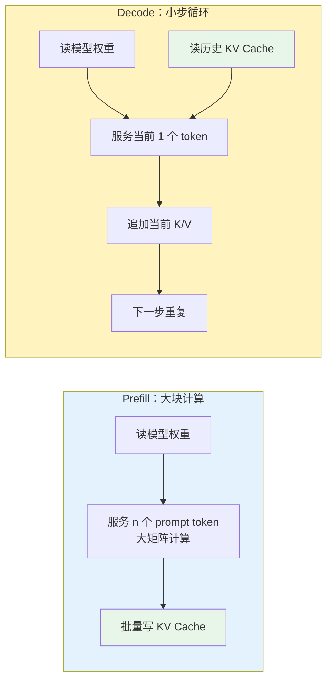

## 优化目标不同

因为瓶颈不同，优化方向也不同。

| 阶段 | 主要目标 | 常见优化 |
| --- | --- | --- |
| Prefill | 降低 TTFT，提高 prompt 处理吞吐 | prompt batching、chunked prefill、高效 attention kernel、更强算力 |
| Decode | 降低 TPOT/TBT，提高并发生成吞吐 | continuous batching、PagedAttention、KV Cache 量化、speculative decoding |

prefill 优化更关心：怎样更快读完整段 prompt，并尽快吐出第一个 token。

decode 优化更关心：怎样让大量请求持续稳定地吐 token，并且不要被 KV Cache 读写和显存带宽拖慢。

这也是为什么很多推理系统特别重视 decode。短 prompt、长输出场景里，prefill 只发生一次，而 decode 会发生几十、几百甚至几千次。单步 decode 看起来不大，但重复次数很多，最终可能决定大部分延迟和成本。

## 为什么这会引出 PD 分离

prefill 和 decode 的性能画像差异太明显：

| 对比项 | Prefill | Decode |
| --- | --- | --- |
| 主要用户指标 | TTFT | TPOT/TBT |
| 资源偏好 | 算力、大矩阵吞吐 | 显存带宽、KV Cache 管理、稳定调度 |
| 工作节奏 | 一次性大块任务 | 长时间小步循环 |
| 干扰风险 | 长 prompt prefill 可能突然吃满 GPU | decode 需要稳定节奏，怕被大任务打断 |

所以系统层面自然会出现一个想法：能不能让擅长 prefill 的资源专门做 prefill，让擅长 decode 的资源专门做 decode？这就是后面要讲的 PD 分离。

# PD 分离是什么

理解 prefill 和 decode 之后，再看 PD 分离就很自然了。

PD 分离，即 Prefill-Decode Separation，不是模型结构上的变化，而是推理系统调度上的变化：

> 让 prefill 和 decode 使用不同的 worker、GPU 或资源池，分别按它们的性能特征优化。

上一节已经看到，prefill 和 decode 的性能画像不同。PD 分离就是把这个差异落实到系统架构上：prefill worker 专门处理 prompt，decode worker 专门负责后续逐 token 生成。

如果把两者强行混在同一批任务里，可能出现：

- 一个长 prompt 的 prefill 吃满算力，正在 decode 的请求突然卡顿。
- decode 请求希望小步快跑，prefill 又希望攒大 batch 提高吞吐。
- KV Cache 长期占用显存，而 prefill 的临时 attention 计算也需要显存空间。

PD 分离的典型流程是：

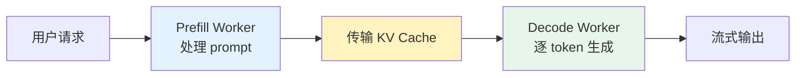

它的好处是可以分别调参：

| 资源池 | 主要目标 | 典型优化 |
| --- | --- | --- |
| Prefill worker | 降低 TTFT，提高 prompt 吞吐 | 大 batch、chunked prefill、高算力 GPU |
| Decode worker | 稳定 TPOT/TBT，提高并发生成 | continuous batching、PagedAttention、KV Cache 量化 |

当然，PD 分离也不是免费午餐。prefill worker 计算出的 KV Cache 要传给 decode worker，这会引入网络传输、调度和 cache placement 的复杂度。只有当 prefill/decode 干扰明显，或者业务请求量足够大时，物理分离才更容易划算。

# 常见误区

## 误区一：KV Cache 缓存的是 attention 权重

不是。KV Cache 缓存的是每层每个历史 token 的 K 和 V。

attention 权重是临时结果：

$$
\alpha_t =
\mathrm{softmax}
\left(
\frac{q_tK_{1:t}^T}{\sqrt{d_k}}
\right)
$$

每个新 token 的 $$q_t$$ 都不同，所以权重也不同。缓存旧权重既占空间，也帮不上下一个 token 的核心计算。

## 误区二：decode 完全不用 causal mask

单 token decode 时，当前 token 本来只拿到历史 K/V 和自己的 K/V，不会拿到未来 token，所以通常不需要像 prefill 那样显式构造完整上三角 mask。

但这不是说 decode 的因果约束消失了，而是约束已经由“只把历史和当前 token 放进可见集合”这件事自然保证了。

如果一次 decode 多个 token，或者做 speculative decoding 里的一段候选验证，仍然需要在这段新 token 内部使用 causal mask。

## 误区三：prefill 前面位置的输出都是无用副产品

推理时，最终预测第一个新 token 确实只需要最后一个位置的 logits。

但前面位置的 hidden states 不是纯粹无用。它们是更深层生成 K/V cache 的必要中间结果。没有它们，就不能得到每一层、每个 prompt token 的 K/V。

更准确的说法是：

> prefill 顶层前面位置的 logits 对当前推理输出通常没用，但中间层和顶层的 hidden states 对构建整段 prompt 的逐层 KV Cache 是必要的。

## 误区四：decode 比 prefill 快，所以 decode 不重要

单步 decode 的计算量比整段 prefill 小，但 decode 会重复很多次。长输出场景里，端到端延迟和成本往往主要由 decode 决定。

并且 decode 每步都要读模型权重和越来越长的 KV Cache，算术强度低，容易受显存带宽限制。所以很多线上推理系统优化的重点不是“让单个 token 多算一点”，而是“让一次权重读取服务更多有效 token”，例如 batching 和 speculative decoding。

# 总结

prefill 和 decode 的差异，本质上来自自回归生成：

- prompt 已经全部给定，所以 prefill 可以并行处理整段输入。
- 未来 token 尚未生成，所以 decode 必须逐 token 串行推进。

在两层 Transformer 的例子里，关键链路是：

1. Prefill 输入“你 好”，Layer 1 计算两个 token 的 Q/K/V，做 $$2 \times 2$$ causal attention，写 Layer 1 cache。
2. Layer 2 使用 Layer 1 的两个 hidden states，再计算自己的 Q/K/V，做 $$2 \times 2$$ causal attention，写 Layer 2 cache。
3. Prefill 用顶层最后位置 $$h_2^{(2)}$$ 预测第 3 个 token。
4. Decode 输入第 3 个 token，只为当前 token 算 Q/K/V。
5. 每一层 decode 都读取本层历史 cache，做 $$1 \times 3$$ attention，追加当前 token 的 K/V。
6. 顶层当前位置输出再过 LM Head，预测第 4 个 token。

所以可以把整件事压缩成一句话：

> Prefill 用并行计算为整段 prompt 建立逐层 KV Cache，并预测第一个新 token；decode 复用这些 cache，每次只计算当前 token 的新表示，然后继续追加 cache、预测下一个 token。
