前两篇文章已经把 Transformer 推理里最核心的链路走了一遍：

- [从 Attention 到 KV Cache：理解 Transformer 的注意力机制与推理加速]() 讲了 Q/K/V、Multi-Head Attention 和原生 KV Cache。
- [从 Prefill 到 Decode：用两层 Transformer 走完一次 LLM 推理]() 讲了 prefill 和 decode 为什么是两种不同的计算阶段。

这篇文章继续往下走：既然 KV Cache 已经能让 decode 不重复计算历史 token 的 K/V，为什么还需要 PagedAttention 和 Prefix Caching？

一句话先给结论：

> 原生 KV Cache 主要减少 decode 阶段的重复计算；PagedAttention 让这些 KV 能被更高效地分块、映射和管理；Prefix Caching 再基于这些可复用的 KV 块，减少 prefill 阶段的重复计算。

1. Table of Contents, ordered
{:toc}

# 先回到原生 KV Cache

在自回归生成里，每一步都会新来一个 token。这个 token 要生成下一步输出，就必须看历史上下文。

如果没有 KV Cache，模型在第 $$t$$ 步生成时，可能要反复为前面 $$1 \sim t-1$$ 个 token 重新计算 K/V。这样每一步都在重复处理历史，越生成越浪费。

KV Cache 的核心很简单：

1. prefill 阶段，把 prompt 里每个 token、每一层的 K/V 算出来并存下。
2. decode 阶段，每来一个新 token，只为当前 token 算新的 $$q_t, k_t, v_t$$。
3. 当前 token 的 $$q_t$$ 去 attend 历史 cache 里的 $$K_{1:t}$$ 和 $$V_{1:t}$$。
4. 再把当前 token 的 $$k_t, v_t$$ 追加进 cache，给下一步用。

所以 KV Cache 缓存的不是模型参数，也不是最终答案，而是每层每个历史 token 的 K/V 中间结果。

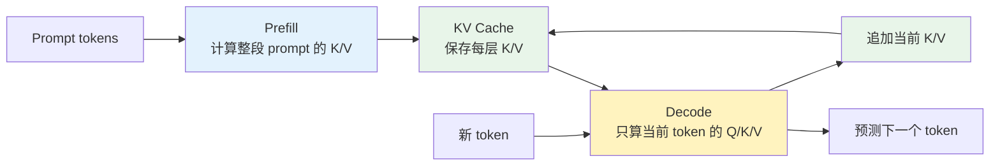

它解决的是 decode 阶段的重复计算问题：

| 没有 KV Cache | 有 KV Cache |
| --- | --- |
| 每步都可能重新算历史 token 的 K/V | 历史 K/V 只算一次 |
| decode 越往后重复越多 | 每步只新增当前 token 的 K/V |
| 计算浪费严重 | 主要成本变成读取历史 K/V |

但这还没有解决两个问题：

- KV Cache 在显存里怎么放，才不浪费空间？
- 如果两个请求有相同 prompt 前缀，能不能不要重复做 prefill？

这两个问题分别引出 PagedAttention 和 Prefix Caching。

# KV Cache 存在哪里，长什么样

LLM 推理时，KV Cache 通常放在 GPU 显存，也就是 HBM/VRAM 里。

原因不是“别的地方不能存”，而是速度。decode 每一步都要读历史 K/V，如果把 KV Cache 放在 CPU 内存、硬盘或者远端存储，搬运成本很容易超过节省下来的计算成本。对在线推理来说，KV Cache 通常必须离 GPU 计算单元足够近。

但“放在显存里”还不够具体。更重要的问题是：它到底存了什么，长成什么形状？

先用一个极小的模型做例子。假设：

- 模型有 2 层。
- 每层有 2 个 KV head。
- 每个 head 的维度是 4，也就是 `head_dim = 4`。
- 当前请求已经处理了 3 个 token：`我 / 喜欢 / AI`。

那么 KV Cache 里存的不是 token 文本，也不是 attention 分数，而是这些 token 在每一层、每个 KV head 下算出来的 K 向量和 V 向量。

## 一个 token 在一层里存什么

先只看第 1 层、第 1 个 KV head。

当 token “我”进入这一层后，会通过这一层的 $$W_K$$ 和 $$W_V$$ 投影出两个向量：

$$
k_{\text{我}}^{(1, h0)} = [0.12,\ -0.31,\ 0.44,\ 0.08]
$$

$$
v_{\text{我}}^{(1, h0)} = [0.27,\ 0.19,\ -0.05,\ 0.62]
$$

这两个向量就是 KV Cache 里真正要存的东西。

如果当前已经有 3 个 token，那么第 1 层、第 1 个 KV head 的缓存可以画成两张小表：

| Layer 1 / KV head 0 / K | dim 0 | dim 1 | dim 2 | dim 3 |
| --- | --- | --- | --- | --- |
| token 1：我 | 0.12 | -0.31 | 0.44 | 0.08 |
| token 2：喜欢 | 0.51 | 0.07 | -0.22 | 0.36 |
| token 3：AI | -0.18 | 0.40 | 0.29 | -0.11 |

| Layer 1 / KV head 0 / V | dim 0 | dim 1 | dim 2 | dim 3 |
| --- | --- | --- | --- | --- |
| token 1：我 | 0.27 | 0.19 | -0.05 | 0.62 |
| token 2：喜欢 | -0.14 | 0.33 | 0.48 | 0.09 |
| token 3：AI | 0.71 | -0.20 | 0.16 | 0.25 |

真实模型里的数值当然不是这么少，`head_dim` 常见是 64、128 或 256。这里用 4 维只是为了把表画出来。

这两张表的含义是：

- K 表负责“被当前 query 匹配”：新 token 的 $$q_t$$ 会和历史所有 K 做点积。
- V 表负责“被加权取信息”：softmax 权重算出来之后，会对历史所有 V 做加权求和。

decode 到下一个 token 时，比如来了 token 4 “很”，它会生成自己的 $$q_4$$，然后读这张 K 表：

$$
q_4 [k_{\text{我}}, k_{\text{喜欢}}, k_{\text{AI}}, k_{\text{很}}]^T
$$

得到权重后，再读 V 表：

$$
\alpha_1 v_{\text{我}} + \alpha_2 v_{\text{喜欢}} + \alpha_3 v_{\text{AI}} + \alpha_4 v_{\text{很}}
$$

所以 KV Cache 里的每一行，都对应一个历史 token；每一列，是这个 token 在某个 head 里的向量维度。

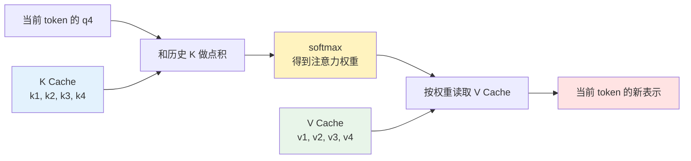

## 多个 head 怎么堆起来

上面只看了一个 KV head。实际每一层会有多个 KV head。

如果第 1 层有 2 个 KV head，那么它大概长这样：

| Layer 1 | KV head 0 | KV head 1 |
| --- | --- | --- |
| K cache | 3 个 token × 4 维 | 3 个 token × 4 维 |
| V cache | 3 个 token × 4 维 | 3 个 token × 4 维 |

也就是说，同一层里，每个 KV head 都有自己的一套 K 表和 V 表。

可以把它想成一摞表：

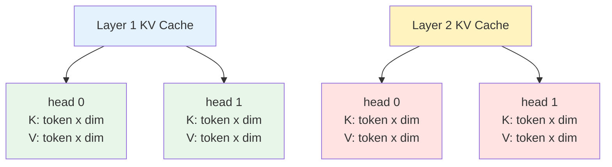

这里还有一个细节：KV head 不一定等于 Query head。

先澄清一个容易混淆的点：这里说的不一样，主要是 **head 数量不一样**，不是说同一次 attention 里 Q 和 K 的向量维度可以乱配。

因为 attention 分数要做点积：

$$
q_i \cdot k_j
$$

所以一个 Query head 在匹配某个 KV head 时，$$q_i$$ 和 $$k_j$$ 的 `head_dim` 必须相同。比如 $$q_i$$ 是 128 维，那么被它匹配的 $$k_j$$ 也必须是 128 维，否则点积没法算。

真正可以不同的是 head 的数量：

- Query 可以有很多组，比如 32 个 Query head。
- KV 可以少一些，比如只有 8 个 KV head。
- 这时通常是每 4 个 Query head 共享 1 组 K/V。

这就是 GQA，也就是 Grouped Query Attention。

## 为什么 Query head 和 KV head 可以不一样

直觉上，Query head 是“我从哪些角度发问”，KV head 是“历史上下文以哪些角度被存下来”。

普通 MHA 里，每个 Query head 都有自己对应的一套 K/V：

```text
Q head 0 -> K/V head 0
Q head 1 -> K/V head 1
Q head 2 -> K/V head 2
Q head 3 -> K/V head 3
```

GQA 会让多个 Query head 共用一套 K/V：

```text
Q head 0 ┐
Q head 1 ├──> K/V head 0
Q head 2 ┘

Q head 3 ┐
Q head 4 ├──> K/V head 1
Q head 5 ┘
```

也就是说，模型仍然可以保留很多 Query head，让当前 token 从多个角度“发问”；但历史 token 不必为每个 Query head 都存一份独立 K/V，而是让一组 Query head 共享同一份历史 K/V。

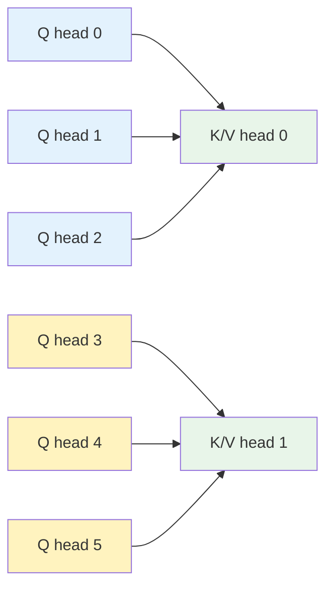

这件事对本文重要吗？对 Prefix Caching 的主逻辑不算关键，因为不管是 MHA、GQA 还是 MQA，Prefix Caching 复用的都是已经算好的前缀 K/V。

但它对 KV Cache 的大小很重要。KV Cache 只存 K 和 V，不存 Q。Query 是当前 token 临时算出来的，用完就可以丢；历史 K/V 才会随着序列长度增长一直留在显存里。

所以减少 KV head 数量，就能直接减少 KV Cache 体积。

举个简化例子。假设：

- 层数是 32。
- 序列长度是 10000。
- `head_dim = 128`。
- 数据类型是 FP16，每个数 2 字节。
- Query head 是 32 个。

如果是普通 MHA，KV head 也是 32 个。单个请求的 KV Cache 大小大约正比于：

$$
32\ \mathrm{layers} \times 10000\ \mathrm{tokens} \times 32\ \mathrm{kv\_heads} \times 128\ \mathrm{dim} \times 2\ \mathrm{K/V} \times 2\ \mathrm{bytes}
$$

如果改成 GQA，KV head 只有 8 个，其他条件不变，那么 KV Cache 直接变成原来的四分之一。

| 方案 | Query head | KV head | KV Cache 相对大小 |
| --- | --- | --- | --- |
| MHA | 32 | 32 | 1x |
| GQA | 32 | 8 | 1/4x |
| MQA | 32 | 1 | 1/32x |

这也是为什么讨论 KV Cache 形状时，最好写 `kv_head`，而不是简单写 `num_heads`。

## 多层模型怎么堆起来

KV Cache 还必须按层分开存。

原因是：第 1 层的 K/V 来自原始 embedding 或上一层输入；第 2 层的 K/V 来自第 1 层输出；第 3 层又来自第 2 层输出。每层看到的 hidden state 不一样，所以每层算出来的 K/V 也不一样。

同一个 token “AI”，在 Layer 1 和 Layer 2 里会有两份不同的 K/V：

| token：AI | 来源 | 存入哪里 |
| --- | --- | --- |
| $$k_{\text{AI}}^{(1)}, v_{\text{AI}}^{(1)}$$ | Layer 1 的输入投影 | Layer 1 KV Cache |
| $$k_{\text{AI}}^{(2)}, v_{\text{AI}}^{(2)}$$ | Layer 1 输出后的 hidden state 投影 | Layer 2 KV Cache |

所以，一个请求的完整 KV Cache 不是一张表，而是：

```text
请求 A 的 KV Cache
├── Layer 1
│   ├── K: [kv_head, seq_len, head_dim]
│   └── V: [kv_head, seq_len, head_dim]
├── Layer 2
│   ├── K: [kv_head, seq_len, head_dim]
│   └── V: [kv_head, seq_len, head_dim]
└── ...
```

如果把 batch 也加进来，逻辑形状就可以写成：

$$
[\mathrm{batch},\ \mathrm{layer},\ \mathrm{kv\_head},\ \mathrm{seq},\ \mathrm{head\_dim}]
$$

这里每个维度的含义是：

| 维度 | 含义 |
| --- | --- |
| batch | 同时服务多少个请求 |
| layer | 第几层 Transformer |
| kv_head | KV 头数量，GQA/MQA 下可能少于 Query 头数量 |
| seq | 当前请求已经缓存了多少 token |
| head_dim | 每个 attention head 的向量维度 |

如果还要把 K 和 V 也作为一个维度写进去，也可以写成：

$$
[\mathrm{batch},\ \mathrm{layer},\ 2,\ \mathrm{kv\_head},\ \mathrm{seq},\ \mathrm{head\_dim}]
$$

其中那个 `2` 就表示 K 和 V 两类缓存。

## 物理显存里不一定连续

上面的形状是逻辑视角，意思是“模型在计算时需要按这些维度取数据”。但物理显存里不一定真是一整块连续大数组。

最朴素的实现可以想象成这样：每个请求提前拿到一整段连续空间。

```text
请求 A 的连续 KV 空间：
[token 1][token 2][token 3][空][空][空][空][空]
```

这很好理解，但浪费严重。请求 A 如果只用了 3 个 token，后面的空位也被它占住了。

现代推理引擎更倾向于把 KV Cache 切成 block。逻辑上，请求 A 还是有 token 1 到 token 8；物理上，它们可以散落在不同 block 里：

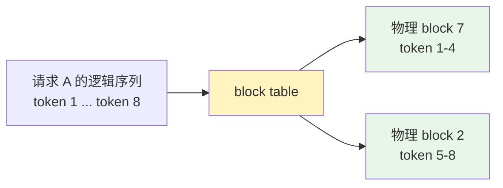

block 里存的仍然是每层、每个 KV head 的 K/V 向量，只是分配单位从“整个请求的一大段连续空间”变成了“若干个固定大小的小块”。

## KV Cache 的形状和显存估算

最后把 KV Cache 的结构和大小连起来看。换成结构图，一条请求的 KV Cache 大致长这样：

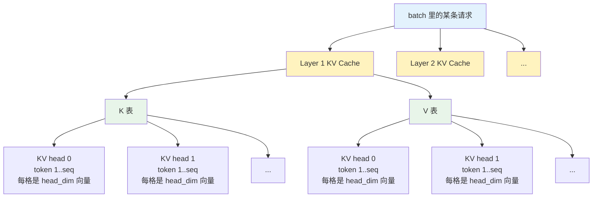

如果更偏“架构/布局”地看，同一份 KV Cache 也可以理解成一组按维度展开的块：

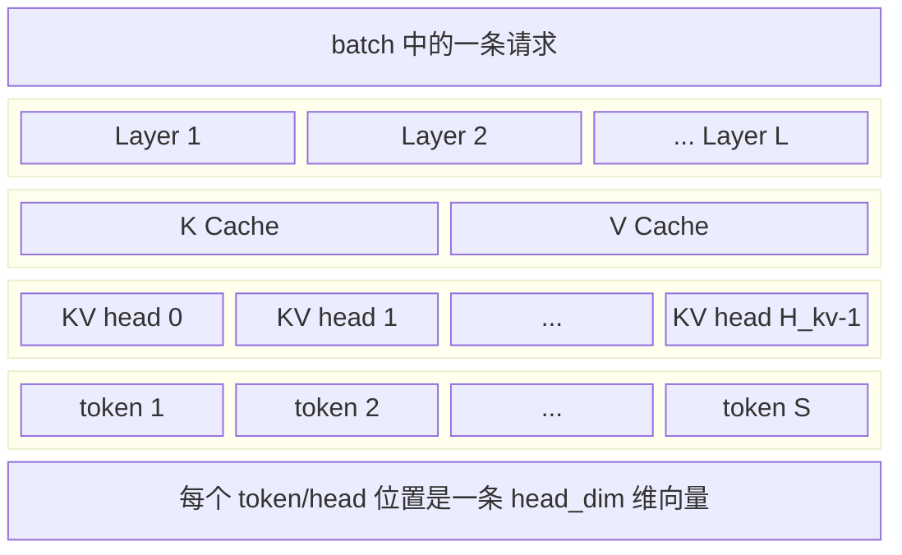

所以 KV Cache 的大小可以直接从这些维度乘出来：

$$
\text{KV Cache bytes}
= B \times L \times S \times H_{kv} \times D_h \times 2 \times N_{\text{bytes}}
$$

其中：

| 符号 | 含义 |
| --- | --- |
| $$B$$ | batch size，或者同时缓存的请求条数 |
| $$L$$ | Transformer 层数 |
| $$S$$ | 每条请求已经缓存的 token 数，也就是实际上下文长度 |
| $$H_{kv}$$ | KV head 数量 |
| $$D_h$$ | 每个 head 的维度，也就是 `head_dim` |
| $$2$$ | K 和 V 两份缓存 |
| $$N_{\text{bytes}}$$ | 每个数占多少字节，例如 `FP16/BF16` 是 2 bytes，`FP8` 是 1 byte |

举个更有观感的数。假设一类常见 8B GQA 模型有 32 层、8 个 KV head、`head_dim = 128`，单条请求上下文长度是 8192 token，KV Cache 用 `FP16/BF16` 保存：

$$
1 \times 32 \times 8192 \times 8 \times 128 \times 2 \times 2
= 1{,}073{,}741{,}824\ \text{bytes}
$$

这正好约等于 **1 GiB**。

也就是说，**一条 8K 上下文请求的 KV Cache 就可能吃掉约 1 GiB 显存**。如果并发里同时有 16 条这种请求，光 KV Cache 就接近 16 GiB；如果上下文翻到 32K，单条请求就接近 4 GiB。这个数字还没算模型权重、临时 workspace、显存碎片和推理框架自己的管理开销。

把这一节压缩成一句话：

> KV Cache 逻辑上是一摞“按层、按 KV head、按 token 排列的 K 表和 V 表”；物理上通常放在 GPU 显存里，现代系统会把它切成 block，再用映射表把逻辑序列和物理 block 连起来。

# 原生 KV Cache 没解决什么

最朴素的 KV Cache 管理方式，是为每个请求预留一段连续空间。

比如系统认为一个请求最多会用到 2048 个 token，就提前给它分配 2048 个 token 的 KV Cache 空间。问题是，这个请求也许只生成 20 个 token 就结束了。

这样会带来两类浪费：

| 问题 | 含义 |
| --- | --- |
| 内部碎片 | 已经给某个请求预留了空间，但它实际没用完 |
| 外部碎片 | 显存里剩余空间很多，但被切成零散小块，放不下新的大请求 |

更关键的是，连续分配方式默认每个请求都有自己的一份 KV Cache。哪怕两个请求的前 10000 个 token 完全相同，也会各自存一份。

所以原生 KV Cache 解决了“同一个请求 decode 时不要重复算历史 K/V”，但没有自然解决：

- 显存空间利用率；
- 不同请求之间的相同前缀复用；
- 多个采样分支共享同一段 prompt KV。

# PagedAttention 解决的是显存利用率

PagedAttention 的直觉来自操作系统里的分页内存：逻辑上连续，物理上可以不连续。

它把 KV Cache 拆成固定大小的 block。一个 block 通常存若干个 token 的 K/V，比如 16 个 token。请求看到的是一段连续上下文，但底层物理显存可以是多个不连续 block，再通过 block table 串起来。

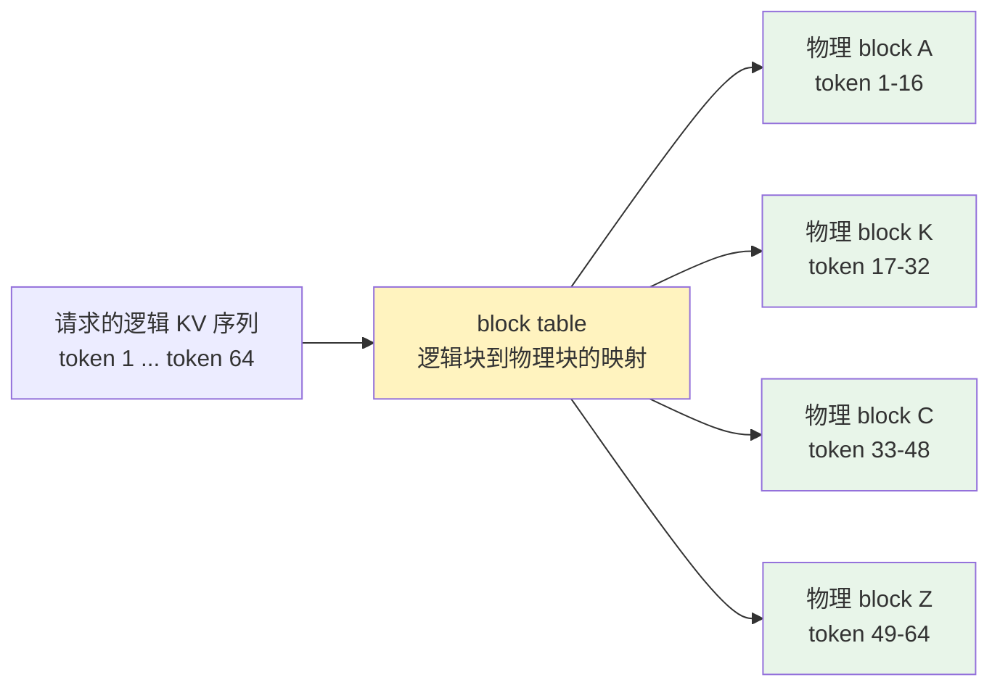

这样做的收益是：

| 能力 | 解释 |
| --- | --- |
| 按需分配 | 请求长到哪里，就分配到哪里 |
| 降低碎片 | 不要求一整段连续显存 |
| 提高 batch size | 同样显存能容纳更多并发请求 |
| 支持共享 | 多个逻辑序列可以指向同一个物理 block |

这里要分清楚：PagedAttention 本身重点解决的是 KV Cache 的内存管理和利用率问题。它让“共享 block”这件事变得可行，但“跨请求发现相同前缀并复用”还需要上层策略。

这个上层策略就是 Prefix Caching。

# Prefix Caching 解决的是跨请求前缀复用

Prefix Caching，也就是前缀缓存，关注的问题是：

> 如果两个请求的开头完全一样，前面这段 prompt 的 KV 能不能只算一次、只存一份？

比如两个请求都是：

```text
system prompt + 长文档 + 用户问题
```

如果 `system prompt + 长文档` 完全相同，只有最后的用户问题不同，那么这段公共前缀在 prefill 阶段会产生完全相同的 K/V。

没有 Prefix Caching 时，每个请求都要重新 prefill 这段长文档：

```text
请求 A：prefill(system + doc) + prefill(question A)
请求 B：prefill(system + doc) + prefill(question B)
请求 C：prefill(system + doc) + prefill(question C)
```

有了 Prefix Caching 后，可以变成：

```text
公共前缀：prefill(system + doc) 一次
请求 A：复用公共前缀 KV + 只 prefill question A
请求 B：复用公共前缀 KV + 只 prefill question B
请求 C：复用公共前缀 KV + 只 prefill question C
```

这就是 Prefix Caching 和原生 KV Cache 的关键差异：

| 技术 | 主要复用对象 | 主要减少哪个阶段的成本 |
| --- | --- | --- |
| 原生 KV Cache | 同一个请求里已经生成或已经读过的历史 token K/V | decode |
| Prefix Caching | 不同请求之间相同前缀的 prompt K/V | prefill |

所以可以把两者看成接力关系：

1. Prefix Caching 先让请求不用从 0 开始 prefill，直接复用已有前缀 KV。
2. 请求进入生成后，再用普通 KV Cache 继续逐 token decode。

# 为什么 PagedAttention 是 Prefix Caching 的基础设施

如果 KV Cache 是一整段连续大数组，想共享前缀会很别扭。因为共享的单位太大，拷贝、切分、生命周期管理都麻烦。

PagedAttention 把 KV Cache 变成 block 后，Prefix Caching 就可以以 block 为单位做复用：

1. 每个 block 对应一段 token 的 K/V。
2. 系统给 block 或 token 前缀计算 hash。
3. 新请求进来时，先查已有缓存里是否有相同前缀。
4. 命中后，新请求的 block table 直接指向已有物理 block。
5. 分叉后的新内容再分配新 block。

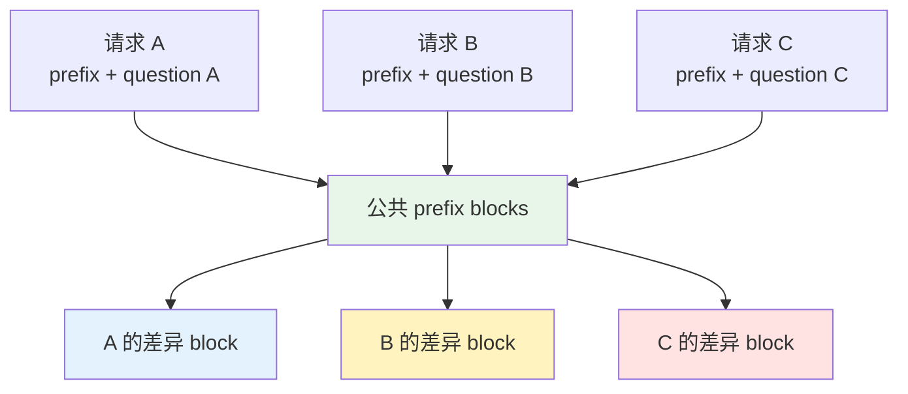

这时候，多个请求逻辑上各自有完整上下文，但物理上公共前缀只存一份。

# Radix Tree：把公共前缀组织成树

工程上，Prefix Caching 往往需要一个索引结构来管理“哪些前缀已经存在”。一种常见思路是使用 Radix Tree，也就是基数树。

基数树适合管理前缀，因为它天然把公共开头合并成同一条路径：

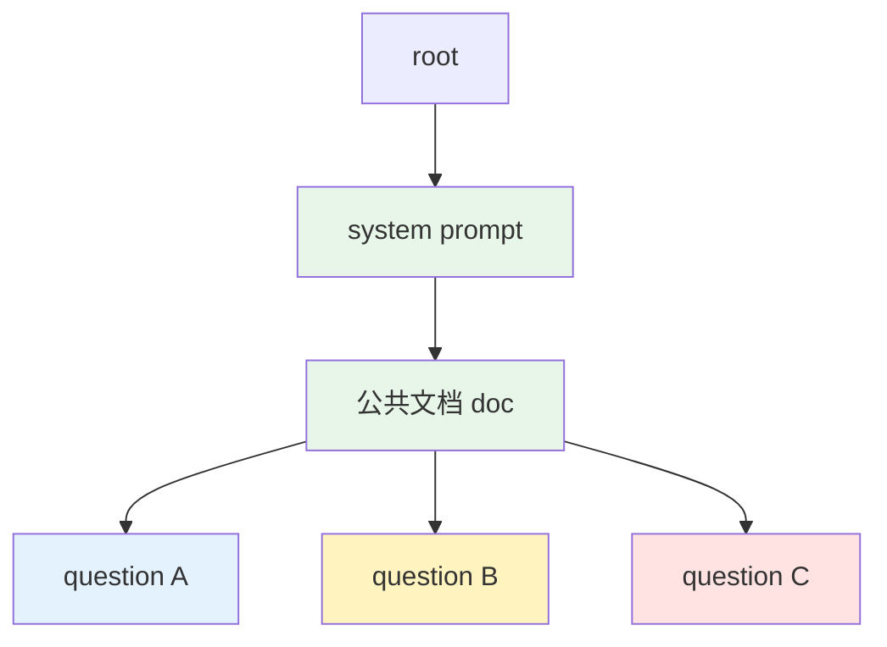

这张图里的 `system prompt + 公共文档 doc` 只需要保存一份 KV。不同问题从公共文档之后分叉。

为了让这套机制能在推理服务里稳定运行，还需要配套几个机制：

| 机制 | 作用 |
| --- | --- |
| hash / token 匹配 | 判断新请求的前缀是否和已有缓存一致 |
| 引用计数 | 有请求正在使用某段 KV 时，不能释放 |
| LRU / eviction | 显存不够时，清理长期不用的缓存块 |
| block table | 让不同请求逻辑上拥有自己的序列，物理上共享部分 block |

所以 Prefix Caching 不是“把 prompt 字符串存起来”这么简单。它复用的是 prompt 在每层产生的 K/V 中间结果，而且要和底层 KV 内存管理配合。

# 为什么它对 RAG 和搜索特别重要

普通聊天场景里，用户 prompt 可能很短，输出可能很长。这时 decode 会占据大量时间，原生 KV Cache、continuous batching、speculative decoding 这些优化会很重要。

但在 RAG、AI 搜索、相关性打分、rerank 这类场景里，经常是另一种形态：

| 场景特点 | 结果 |
| --- | --- |
| 输入很长 | 文档、候选结果、上下文可能有几千到几十万 token |
| 输出很短 | 只输出分数、标签、True/False 或几句解释 |
| 公共前缀多 | system prompt、任务说明、文档模板经常重复 |
| 首 token 延迟敏感 | 用户等的是“什么时候开始出结果” |

这时最重的部分往往不是 decode，而是 prefill。

如果 99% 的计算都花在读长文档上，那么 Prefix Caching 的价值就非常直接：已经读过的长文档不要再读一遍，直接复用它的 KV。

可以这样理解：

> 原生 KV Cache 让模型在生成时不反复读自己已经写过的历史；Prefix Caching 让模型在处理新请求时不反复读大家都见过的长前缀。

# 完全相同的 prompt，能不能复用别人生成的 token KV

还有一个容易混淆的问题：

> 如果另一个用户的 prompt 和我完全一样，那么 Prefix Caching 能不能不只复用 prompt 的 KV，也复用对方后面生成出来的 token KV？

通常答案是：生产系统里主要复用到 prompt 前缀，生成阶段一般各走各的自回归路径。

原因有三个。

## 生成路径可能分叉

只要采样不是完全确定性的，同一个 prompt 也可能生成不同 token。

比如用户 A 的第一个生成 token 是：

```text
具有
```

用户 B 的第一个生成 token 可能是：

```text
存在
```

第一个 token 一旦不同，后续上下文就不同。KV Cache 对应的是“具体 token 序列”的中间结果，序列不同，后面的 KV 就不能混用。

## 用户隔离和安全边界

KV Cache 是模型对上下文的中间表示。生成阶段的 KV 里包含某个用户已经生成的具体内容路径。

跨用户直接复用生成阶段 KV，会让缓存生命周期、权限边界和数据隔离变复杂。线上系统通常会保守处理：公共输入前缀可以按策略共享，用户自己的生成路径属于自己的请求状态。

## 完全确定时，Response Cache 更直接

如果 prompt 完全一致，采样参数也完全确定，比如 temperature 为 0，那么理论上输出也会一样。

但这时候更简单的做法通常不是复用生成阶段 KV，而是在应用层做 Response Cache：

```text
hash(prompt + sampling_config) -> final answer
```

命中后直接返回字符串，连 GPU 都不用进。它比“加载别人生成阶段 KV 再继续 decode”更直接。

# 例外：同一请求内的分支可以共享公共前缀

虽然跨用户复用生成阶段 KV 通常不作为主要路径，但同一个请求内部的分支共享是合理的。

典型例子是 parallel sampling：同一个 prompt 同时生成多个候选答案。

这些候选答案在分叉之前共享同一段 prompt KV；分叉之后，各自维护自己的生成 KV。

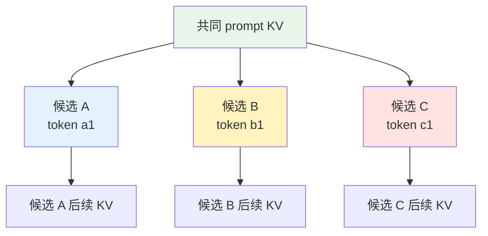

这和 Prefix Caching 的思想一致：公共部分只存一份，分叉部分各自维护。

区别在于：

- Prefix Caching 更常讨论跨请求的 prompt 前缀复用；
- parallel sampling 更像同一请求内部的多分支复用。

# 最后用一张表串起来

到这里，几个概念的边界就清楚了：

| 技术 | 解决的问题 | 复用粒度 | 主要收益 |
| --- | --- | --- | --- |
| KV Cache | decode 不重复计算历史 K/V | 同一请求的历史 token | 降低逐 token 生成成本 |
| PagedAttention | KV Cache 连续分配浪费显存 | 固定大小 block | 提高显存利用率和并发 |
| Prefix Caching | 多个请求重复 prefill 相同前缀 | prompt 前缀 block / tree path | 降低 TTFT 和 prefill 成本 |
| Radix Tree | 如何快速管理公共前缀 | 前缀路径 | 支持查找、共享、分叉和回收 |
| Response Cache | 完全相同请求直接返回结果 | 最终答案字符串 | 命中时绕过模型推理 |

如果只记一个主线，可以这样记：

1. Attention 让当前 token 从历史 token 里取信息。
2. KV Cache 把历史 token 的 K/V 存起来，让 decode 不重复算。
3. PagedAttention 把 KV Cache 切成 block，让显存管理不再依赖连续大块。
4. Prefix Caching 利用这些 block 复用公共 prompt 前缀，让 prefill 不重复算。
5. 进入生成阶段后，每个分支还是要按自己的 token 序列继续自回归。

所以最关键的区别是：

> KV Cache 加速的是“这个请求接下来怎么继续生成”；Prefix Caching 加速的是“这个请求开始时能不能站在别人已经读过的前缀上”。
