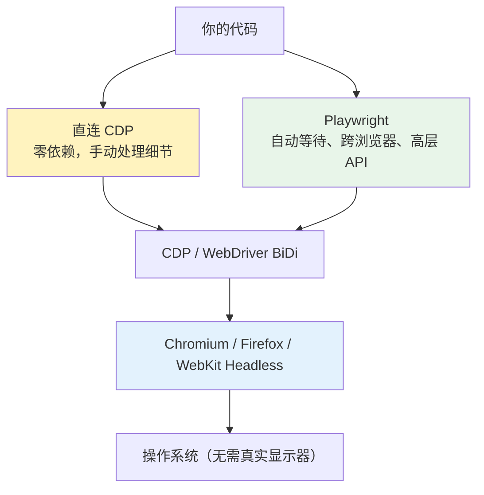
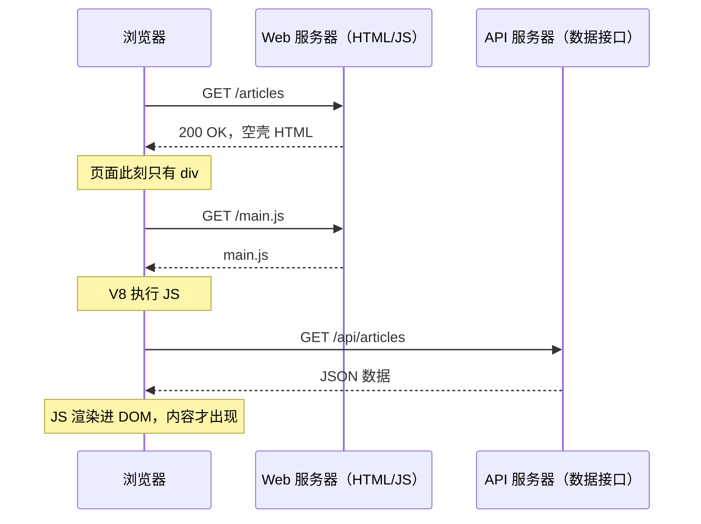
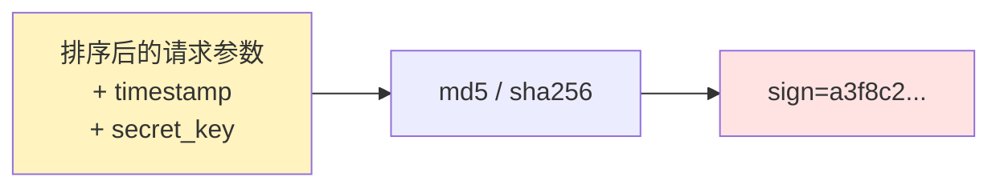
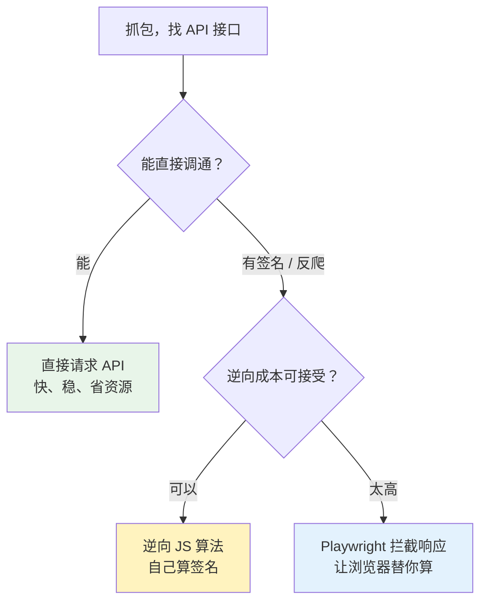
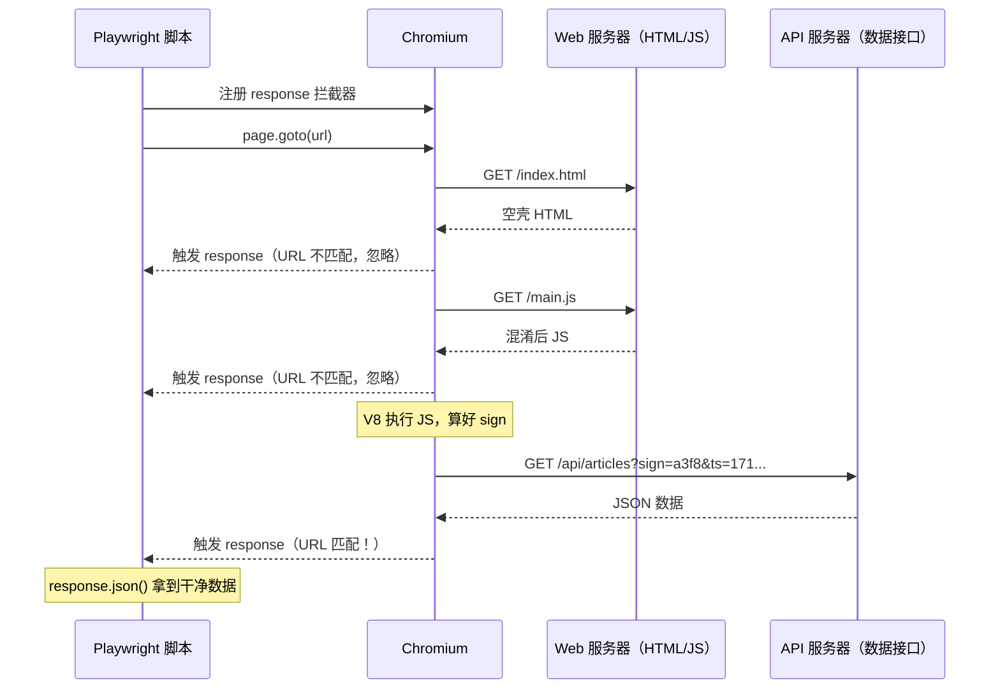
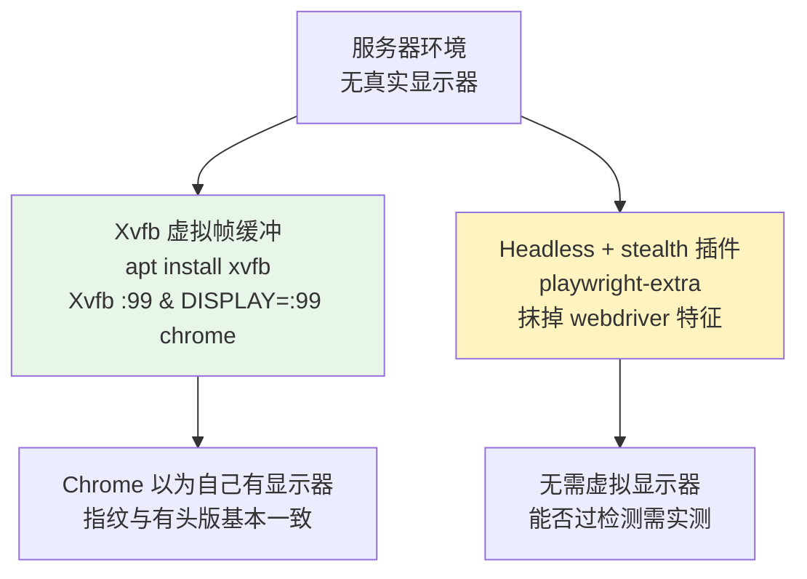

1. Table of Contents, ordered
{:toc}

## 基础：Headless 浏览器与 Playwright 的分层关系

理解两个场景之前，先把底层机制说清楚。

**Headless 浏览器**就是把 UI 壳（地址栏、标签页、窗口）去掉的真实浏览器，只留渲染引擎。它不是模拟器——JS 照常执行（WebGL、Canvas、Promise 全支持），CSS 动画照常跑，网络请求照常发，Web API 全部可用。唯一的区别是不把像素输出到屏幕。

这意味着用它发一个"点击坐标 (320, 480)"的指令，Chrome 会自己做 hit-test、走完整的事件链（mousedown → mouseup → click → 触发监听器）、响应 JS 修改 DOM——和人类用鼠标点**对浏览器内部来说是同一件事**。

Chrome Headless 暴露了 **Chrome DevTools Protocol（CDP）**，本质是一个 WebSocket。你发 JSON 命令，它执行并返回结果：

```json
{"method": "Page.captureScreenshot", "params": {"format": "png"}}
{"method": "Runtime.evaluate", "params": {"expression": "document.fonts.status"}}
```

[Playwright](https://playwright.dev/)（Microsoft 出品）把 CDP 及 Firefox/WebKit 的类似协议包装成好用的高层 API，解决了自动等待、跨浏览器、浏览器版本管理等问题。三者的层次关系：



**Chromium vs Chrome**：Chromium 是[开源](https://www.chromium.org/)的渲染引擎毛坯；Chrome 是在 Chromium 基础上加了 Widevine DRM、自动更新等闭源组件打包出来的。渲染引擎（Blink）和 JS 引擎（V8）都在 Chromium 里。自动化测试和爬虫只需要渲染和 JS 执行，Playwright 默认下载 Chromium 而非 Chrome。

Playwright 下载的还是 **chrome-headless-shell**——专门为 headless 场景编译的精简二进制，移除了所有 UI 代码。它装在 `~/.cache/ms-playwright/chromium-XXXX/`，版本号编进路径，不同项目的 Playwright 版本各用各的 Chromium，互不干扰，清了重装一行命令（`playwright install chromium`）。

---

## 场景一：前端效果验收

这是 AI agent 常见的使用场景。给 Chirpy 博客做 Mermaid 渲染修复、做全站 3D 改造，每轮迭代都需要验证视觉效果是否正确——但"看起来应该没问题"不算修好。

### 为什么不能靠人眼或多模态识别

文字被裁 1-2px，截图放大前几乎看不出来；对比度不够，也要放大才跳出来。多模态图像识别可以做宏观确认，但做不了精确断言。

正确的做法是：**截图用来宏观确认，DOM 数值用来精确断言**。

```js
// 靠图像识别："这个节点文字有没有越界？" → 模糊，1-2px 看不出
// 靠 DOM 数值：
const textWidth  = el.querySelector('.label').getBoundingClientRect().width;
const shapeWidth = el.querySelector('rect').getBoundingClientRect().width;
// textWidth > shapeWidth → 越界，精确到像素
```

对比度问题也是算出来的，不是靠眼睛判断：用 ITU-R BT.601 luma 加权（`0.299R + 0.587G + 0.114B`）算填充色亮度，浅色填充就把 label 换深色——不需要任何主观判断。

### 无头 Chromium + CDP 作为验证闭环

Playwright 装完后，它的浏览器缓存里有 headless shell 二进制。可以直接启动它、用 Node.js 内置 WebSocket 直连 CDP，零 npm 依赖：

```js
// 开 tab
const res = await fetch('http://127.0.0.1:9333/json/new?about:blank', { method: 'PUT' });
const ws  = new WebSocket((await res.json()).webSocketDebuggerUrl);

// 检查渲染状态
// Runtime.evaluate → document.querySelectorAll('.mermaid')
// Runtime.evaluate → el.getAttribute('data-processed')
// Runtime.evaluate → document.fonts.status

// 按元素坐标精确截图
// Page.captureScreenshot + clip → getBoundingClientRect
```

这套闭环的价值在于把"图好不好看"变成可观测的问题：`data-processed` 告诉你渲染有没有发生，截图告诉你渲染出来长什么样，DOM 数值告诉你几何是否正确。Mermaid 修复那篇文章里，正是用 `Network.setCacheDisabled` 禁缓存模拟"第一次进入"、循环跑 30 次来验证冷加载下的稳定性。

**一次性"看一眼没问题"给不了这种机会。闭环的偶发失败本身就是信号。**

---

## 场景二：爬虫

### 为什么现代网站的传统爬虫失效了

传统爬虫（requests + BeautifulSoup）：发 HTTP 请求 → 拿 HTML → 解析。这在服务端渲染（SSR）时代没问题——服务器把数据塞进 HTML 返回，内容就在响应里。

现代网站普遍用**客户端渲染（CSR）**，同一套 API 给网页、iOS、Android 共用，前后端团队独立开发部署。爬虫的困境只是这个架构的副产品：



传统爬虫拿到的是空壳，没有任何内容。Playwright 启动真实浏览器，让 JS 跑完、API 返回、DOM 渲染完，再读结果。

### 直接调 API 不是更好？

理论上是——更快、更稳、更省资源。用 DevTools 的 Network 面板就能抓到 API 接口，直接调绕过整个浏览器。

但现实里有几道坎，**签名参数**是最常见的。以一个典型的社交平台 API 为例：

你抓到的请求长这样：

```
GET /api/feed?user_id=12345&page=1&ts=1718345600&sign=a3f8c2d9...
```

其中 `sign` 由 JS 在发请求前实时算出来：

```js
// JS 里的签名逻辑（简化版）
const params = { user_id: 12345, page: 1, ts: Date.now() / 1000 | 0 };
const keys   = Object.keys(params).sort();              // 参数名排序
const str    = keys.map(k => `${k}=${params[k]}`).join('&');
const sign   = md5(str + '&key=AbCd1234Secret');       // 拼上 secret_key 再哈希
```



服务器收到后，用同样的算法重算一遍，比对 sign 是否一致，不一致就 403。

**为什么不能直接重放？** `ts` 是当前 Unix 时间戳，服务器会校验时效：

```python
if abs(time.time() - ts) > 60:
    return 403  # 超过 60 秒，签名过期
```

你抓到的请求五分钟后拿来重发，直接被拒。要构造新请求，就必须自己算 `sign`——而算 `sign` 需要 `secret_key`，它藏在混淆后的 JS 里。

其他障碍还有：需要登录态（Cookie/Token 得先模拟登录）、动态 Token（混入 Canvas 指纹、鼠标轨迹等运行时数据）。

实际决策路径：



### JS 混淆：为什么拿到源码还是看不懂

JS 混淆不是加密——代码仍然合法、可执行，只是让人读不下去。混淆分三层：

**第一层：重命名**。函数名、变量名全变成 `_0x2f1c`、`_0x4e5d`。和 Java 字节码反编译出 `a`、`b`、`c` 一样，逻辑看得出，只是没意义，工具可以自动重命名破掉这层。

**第二层：字符串加密**。把所有字符串抽出来放进一个加密数组，运行时解密，用索引引用。静态搜索 `"secret"` 找不到任何东西：

```js
var _s = ['\x6d\x64\x35', atob('c2VjcmV0XzIwMjQ='), ...];
// 代码里全是 _fn(_s[0x1f1], _s[0x1f2])
```

**第三层：控制流平坦化**。这是让人真正读不下去的一层。原始的顺序执行：

```js
let a = x * 2;
let b = a + 1;
return b * b;
```

平坦化后，执行顺序由运行时的字符串决定，人眼无法追踪：

```js
var _state = '3|1|0|2|4'.split('|');
var _idx = 0;
while (true) {
    switch (_state[_idx++]) {
        case '0': a = x * 2;  continue;
        case '1': b = a + 1;  continue;
        case '2': return b * b;
        case '3': _idx = 0;   continue;
    }
}
```

真实混淆器（如 [obfuscator.io](https://obfuscator.io/)）会把这个嵌套十几层，state 字符串本身也加密。与 Java 字节码不同——Java 字节码有固定语义约束，反编译工具知道规则可以还原；JS 混淆没有这个约束，`while + switch` 在语义上和顺序执行完全等价，但对工具和人眼都是灾难。

逆向成本粗估：

| 混淆层次 | 破解手段 | 成本 |
|---------|---------|------|
| 重命名 | 工具自动重命名 | 10 分钟 |
| 字符串加密 | 动态执行后还原 | 1 小时 |
| 控制流平坦化 | 手工追踪或写专用反混淆器 | 几天到几周 |
| 多层嵌套 | 可能直接放弃 | — |

### Playwright 的破解思路：站在出口等

不逆向算法，让浏览器替你算，你只拦截出口：

```js
page.on('response', async (response) => {
    if (response.url().includes('/api/articles')) {
        const data = await response.json();  // 原始 JSON，干净无噪音
        save(data);
    }
});

await page.goto('https://example.com/articles');
```



签名算法再复杂也无所谓——Chromium 帮你跑完所有 JS、混入 Canvas 指纹、算好 sign、发出合法请求，你完全不需要知道中间发生了什么。数据从 API 服务器原路返回的 JSON 直接落到你手里，不经过任何 HTML 解析，结构稳定，不会因为网页改版就失效。

混淆的目的从来不是"永远让你看不懂"，而是让逆向的代价超过放弃的代价。当拦截响应的成本远低于逆向混淆代码，选择就很明确了。

### Headless 还是有头 Chrome：反爬检测的取舍

决定用 Playwright 之后还有一个选择：用 Headless Chromium，还是直接弹出真实 Chrome 窗口？

遇到强反爬时，有时 agent 会故意改成**启动本机安装的真实 Chrome**（`headless: false`）：

```js
const browser = await chromium.launch({
    channel: 'chrome',   // 用本机 Chrome，不用 Playwright 自带的 Chromium
    headless: false,     // 有头模式，弹出真实窗口
});
```

原因是 Headless 模式有可被检测到的特征：`navigator.webdriver === true`、Canvas 指纹异常、字体列表与正常浏览器不符……反爬系统检测到这些就拒绝或跳验证码。有头的真实 Chrome 各项指纹和人类用户完全一致，省去了一切打补丁的麻烦。

**在服务器上这条路走不通**。Chrome 启动时依赖图形环境（Display Server）渲染窗口，服务器通常没有，强行启动会报错：

```
Error: Failed to launch the browser process
...no display environment variable specified
```

服务器上的两条出路：



Xvfb 的思路和 Headless 异曲同工——都是"没有真实显示器也能跑"，区别是 Xvfb 伪造一个虚拟显示器让 Chrome 以为有，Headless 是 Chrome 自己知道没有但不依赖。
