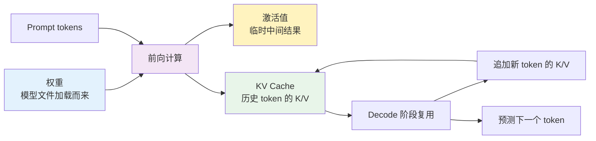
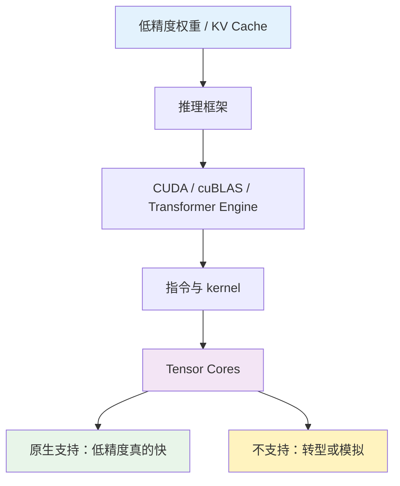
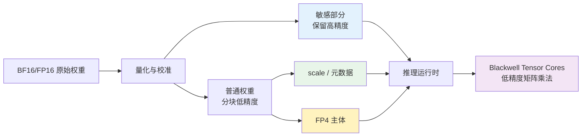

假设现在要部署一个 QwQ-32B。最直接的问题不是 `FP4`、`FP8` 或 Blackwell，而是：

> 这东西到底要多少显存？

这个问题看似只是算账，实际上会把 LLM 推理里最重要的概念全部牵出来：参数量、权重精度、激活值、KV Cache、上下文窗口、计算精度、GPU Tensor Core，以及为什么新一代 GPU 要支持更低精度格式。

如果直接从“模型精度是什么”讲起，文章很容易变成一堆概念拼接。更自然的路径是从部署问题开始：**QwQ-32B 的显存花在哪里？哪些部分固定，哪些部分随上下文增长，哪些部分能靠量化和硬件低精度优化？**

这篇文章按这个顺序往下走：

- 先用 QwQ-32B 的真实配置算出权重和 KV Cache 的显存。
- 再看长上下文为什么让并发容量变成 active tokens 问题。
- 接着解释精度到底分成存储精度和计算精度，为什么“模型是 4 bit”这句话不够精确。
- 最后再看 GPU 原生低精度支持和 Blackwell FP4 到底改变了哪一段链路。

1. Table of Contents, ordered
{:toc}

# 从 QwQ-32B 开始算显存

## 先确认 QwQ-32B 是什么规模

根据 [Qwen/QwQ-32B 官方模型卡](https://huggingface.co/Qwen/QwQ-32B)，QwQ-32B 是 Qwen 系列的 reasoning model，核心配置是：

| 配置 | 数值 |
| --- | --- |
| 参数量 | 32.5B |
| 非 embedding 参数 | 31.0B |
| 层数 | 64 |
| Attention heads | 40 个 Q heads，8 个 KV heads |
| hidden size | 5120 |
| head dim | 128 |
| 官方上下文长度 | 131,072 tokens |

这里先解释一个单位问题：`32B` 里的 `B` 是 **Billion**，表示 325 亿个参数；`GB` 是 **Gigabyte**，表示存储容量。一个是“有多少个数”，一个是“这些数占多少字节”。

所以 “32B 模型” 不等于 “32GB 显存”。显存要看这些参数用什么精度存：

$$
\text{权重显存} \approx \text{参数量} \times \text{每个参数字节数}
$$

粗略估算 QwQ-32B 的权重大小：

| 权重格式 | 每参数占用 | 32.5B 权重主体 |
| --- | --- | --- |
| `FP32` | 4 byte | 130 GB |
| `FP16/BF16` | 2 byte | 65 GB |
| `FP8/INT8` | 1 byte | 32.5 GB |
| 4 bit | 0.5 byte | 16.25 GB |

这只是**权重主体**。真实部署还会有量化 scale、元数据、KV Cache、运行时 workspace、显存碎片、多卡通信 buffer 等开销。

## 推理显存不是只有权重

一次 LLM 推理里至少有三类重要数据。

**权重**是模型文件里的静态参数。它决定模型能力，也是加载模型时最先占显存的部分。

**激活值**是输入 token 经过每一层时产生的中间结果。推理时它们通常是临时的，不像训练那样需要长期保存整条反向传播链路。因此，推理显存估算不应该简单套用“激活值 ≈ 参数显存 1.5 到 2 倍”这种训练味道很重的经验公式。

**KV Cache**是生成式推理里最关键的动态显存。模型在 prefill 阶段为 prompt 计算每一层的 K/V；decode 阶段每生成一个新 token，又把这个 token 的 K/V 追加进去。上下文越长、batch 越大、并发越高，KV Cache 越大。



因此，问“QwQ-32B 要多少显存”，至少要拆成：

1. 权重占多少？
2. KV Cache 按上下文长度占多少？
3. 推理框架和并行方式还有多少额外开销？

## 权重显存：精度越低，模型越容易装下

先只看权重。

如果 QwQ-32B 用 `BF16/FP16` 加载，权重主体大约 65GB。单张 48GB 显卡肯定放不下完整权重；两张 48GB 卡总显存 96GB，理论上能通过 tensor parallel 或分层切分放下权重，但实际还要留 KV Cache 和运行时空间。

如果使用 4 bit 量化，权重主体大约 16GB 多一些。加上量化元数据和框架开销后，实际会更高，但它已经从“必须多卡”变成“单卡也可能装下权重主体”。

这就是量化最直接的价值：**先让模型装得下。**

但这里要小心：权重能装下，不等于这个上下文长度和并发也能跑得动。QwQ-32B 的特点之一是长上下文，而长上下文主要吃的是 KV Cache。

# KV Cache 是长上下文的关键变量

## 窗口越长，显存线性增长

QwQ-32B 使用 GQA：40 个 query heads，但只有 8 个 KV heads。KV Cache 只需要存 K/V heads，所以公式应该用 `num_key_value_heads`，不能直接用所有 attention heads 或完整 hidden size 粗暴代替。

对 decoder-only Transformer，单 batch、单 token 的 KV Cache 大致是：

$$
\text{KV bytes per token}
= L \times H_{kv} \times D_{head} \times 2 \times \text{bytes}
$$

其中：

- $$L$$：层数，QwQ-32B 是 64；
- $$H_{kv}$$：KV heads，QwQ-32B 是 8；
- $$D_{head}$$：head dim，QwQ-32B 是 128；
- $$2$$：K 和 V 两份；
- $$\text{bytes}$$：每个数占多少字节，例如 `FP16/BF16` 是 2 byte。

代入 QwQ-32B，`FP16/BF16` KV Cache：

$$
64 \times 8 \times 128 \times 2 \times 2
= 262{,}144\ \text{bytes/token}
$$

也就是每个 token 约 256 KiB KV Cache。于是上下文窗口越长，KV Cache 线性增长：

| 上下文长度 | `FP16/BF16` KV Cache | `FP8` KV Cache 粗略值 | 4 bit KV Cache 粗略值 |
| --- | --- | --- | --- |
| 32K | 8 GiB | 4 GiB | 2 GiB |
| 64K | 16 GiB | 8 GiB | 4 GiB |
| 120K | 29.3 GiB | 14.6 GiB | 7.3 GiB |
| 131K | 32 GiB | 16 GiB | 8 GiB |

这张表解释了一个关键现象：**长上下文部署时，权重量化只是第一步，KV Cache 精度同样重要。**

如果权重已经 4 bit，但 KV Cache 仍然是 `FP16`，长窗口下显存还是会被 KV Cache 吃掉很多。反过来，如果推理框架支持 `FP8` KV Cache，就能明显缓解长上下文显存压力。

## KV Cache 估算的是 active tokens，不是请求个数

上面的 `32K + FP8 KV Cache ≈ 4 GiB` 指的是：**QwQ-32B、单条序列、实际上下文占用达到 32K token 时，这条序列在全模型上的 KV Cache 总量**。

这里的上下文长度是 prompt token 和已生成 token 的总和。比如 prompt 是 28K，又生成了 4K，峰值就是 32K；如果 prompt 只有 2K，又生成了 2K，那只按约 4K 算。

把公式完整写出来就是：

$$
\text{KV Cache}
= L \times H_{kv} \times D_{head} \times 2 \times \text{bytes} \times S \times B
$$

其中：

- $$L$$：层数；
- $$H_{kv}$$：KV heads 数；
- $$D_{head}$$：每个 head 的维度；
- $$2$$：同时存 Key 和 Value；
- $$\text{bytes}$$：每个数占多少字节，`FP8` 是 1 byte，`FP16/BF16` 是 2 byte；
- $$S$$：当前实际上下文 token 数；
- $$B$$：batch size，或者说同时放在这组 KV Cache 里的序列条数。

代入 QwQ-32B 的配置：

- $$L = 64$$；
- $$H_{kv} = 8$$；
- $$D_{head} = 128$$；
- `FP8` 所以 $$\text{bytes} = 1$$；
- 单条请求跑到 32K，所以 $$S = 32768$$；
- 先按单条序列算，所以 $$B = 1$$。

于是：

$$
64 \times 8 \times 128 \times 2 \times 1 \times 32768 \times 1
= 4{,}294{,}967{,}296\ \text{bytes}
$$

换成 GiB：

$$
\frac{4{,}294{,}967{,}296}{1024^3}
= 4\ \text{GiB}
$$

所以这个 `4 GiB` 不是拍脑袋估出来的，而是 QwQ-32B 在 `FP8` KV Cache、单条 32K 上下文下的直接计算结果。如果是 `FP16/BF16`，每个数从 1 byte 变成 2 byte，同样 32K 就会变成 8 GiB。

所以 KV Cache 不是请求一进来就一定占满最大窗口。更准确的容量单位是：

> 当前显存里还容纳了多少 active tokens。

对于 QwQ-32B + `FP8` KV Cache，单条序列可以粗略理解为：

| 实际上下文长度 | KV Cache |
| --- | --- |
| 4K | 0.5 GiB |
| 8K | 1 GiB |
| 16K | 2 GiB |
| 32K | 4 GiB |
| 64K | 8 GiB |
| 128K | 16 GiB |

这会直接影响并发。假设某张卡或某组卡在扣掉权重、workspace、碎片之后，还剩 16 GiB 给 `FP8` KV Cache。那它大致可以容纳：

| 请求形态 | 可容纳的 KV Cache 直觉 |
| --- | --- |
| 1 个 128K 请求 | 约 16 GiB，基本吃满 |
| 2 个 64K 请求 | 约 16 GiB |
| 4 个 32K 请求 | 约 16 GiB |
| 32 个 4K 请求 | 约 16 GiB |

这就是为什么长上下文服务不能只问“能支持几个请求”。如果所有请求都真的跑满 32K、64K、128K，上下文越长，并发就越少；如果大多数请求只有几千 token，同样显存能支撑的请求数会多很多。

请求结束后，它的 KV Cache 通常会被释放，显存留给新的请求。后面如果来了一个完全相同的 prompt，默认也要重新 prefill，因为之前那条请求的 KV Cache 已经不在了。

只有启用 **prefix caching / prompt caching** 时，系统才可能把公共前缀的 KV Cache 留下来复用。例如多个请求共享同一段 system prompt、工具说明或长文档背景，后续请求命中相同前缀时，就可以少做一部分 prefill。

但 prefix cache 本质上仍然是热缓存，不是永久记忆。它也占显存或 CPU 内存；显存紧张时会被淘汰；淘汰后再来同样前缀，还是要重新计算。因此长上下文推理的核心调度问题不是“请求数”，而是：

> 权重之外，还能给多少 active KV tokens 留出空间？

## 64K 和 120K 的差异不只是显存

从 64K 到 120K，KV Cache 大致按比例增长：

$$
\frac{120K}{64K} \approx 1.875
$$

所以 `FP16` KV Cache 从约 16 GiB 增长到约 29.3 GiB，增加约 13.7 GiB。

但速度问题更复杂。prefill 阶段需要处理整段 prompt，传统 attention 的计算量会受到上下文长度平方项影响：

$$
\left(\frac{120K}{64K}\right)^2 \approx 3.5
$$

这意味着长 prompt 的 prefill 成本可能明显上升。

decode 阶段则不完全一样。每生成一个新 token，当前 token 主要 attend 历史 KV，单步成本大致随历史长度增长，而不是每一步都重新做完整的 $$S^2$$ attention。也就是说：

- **prefill** 更容易被长输入的 attention 计算拖慢；
- **decode** 更容易被读取长 KV Cache 的带宽和显存占用拖慢；
- 如果 batch 或并发变大，KV Cache 会继续按 batch 乘上去。

所以 “120K 是 64K 的 3.5 倍慢” 只能作为 prefill 计算量直觉，不能直接当成所有推理阶段的吞吐比例。

## 估算 QwQ-32B 部署显存时该怎么算

更实用的估算方式是分块相加：

$$
\text{总显存}
\approx
\text{权重}
+ \text{KV Cache}
+ \text{运行时开销}
+ \text{并行与碎片余量}
$$

用 QwQ-32B 做几个粗略场景：

| 场景 | 权重主体 | KV Cache | 直觉 |
| --- | --- | --- | --- |
| `BF16` 权重 + 64K `BF16` KV | 65 GB | 16 GiB | 两张 48GB 卡才有讨论空间，还要看框架开销 |
| 4 bit 权重 + 64K `BF16` KV | 16GB+ | 16 GiB | 权重省下来了，KV Cache 变成主要动态项 |
| 4 bit 权重 + 120K `BF16` KV | 16GB+ | 29.3 GiB | 长上下文显存压力明显上升 |
| 4 bit 权重 + 120K `FP8` KV | 16GB+ | 14.6 GiB | KV Cache 量化能明显缓解压力 |

这也是为什么 “双 L20 48GB 能不能跑 QwQ-32B” 不能只看 `48GB × 2 = 96GB`。你还要看：

- 权重是 `BF16`、`FP8`、AWQ/GPTQ 还是 GGUF 4 bit；
- KV Cache 是 `BF16/FP16` 还是 `FP8/INT8/量化 KV`；
- 上下文是 8K、32K、64K、120K 还是接近 131K；
- batch size 和并发是多少；
- vLLM、SGLang、Transformers、llama.cpp 等框架如何分配 KV Cache；
- tensor parallel、pipeline parallel 或 offload 是否引入额外开销。

素材里提到“双卡 L20 部署 QwQ-32B 64K，吞吐约 20 token/s；四卡 L20 部署 120K，吞吐约 200 token/s”。这种经验值可以作为具体环境下的观测，但不能直接推广。因为吞吐受量化格式、batch、prompt 长度、生成长度、推理框架、CUDA kernel、并行策略和是否连续批处理影响很大。

# 精度要分成存储和计算两层

## 存储精度和计算精度不是同一个问题

到这里，显存账已经算完了：权重是固定大头，KV Cache 是长上下文和并发下的动态大头。接下来才能回到“精度”这个词本身。

现在再问“模型是什么精度”，就更容易讲清楚了。

**存储精度**指权重在文件里怎么保存。比如你下载的是 `BF16` safetensors、`FP8` 权重，还是 4 bit GGUF/GPTQ/AWQ。存储精度决定权重信息上限：如果原始数值 `0.12345678` 被保存成 `0.123`，后面转成 `FP16` 也只是 `0.12300000`，丢掉的尾部细节不会回来。

**计算精度**指推理时矩阵乘法和中间结果怎么运行。同一个低精度权重，运行时可能有几种路径：

| 路径 | 例子 | 含义 |
| --- | --- | --- |
| 向上转型 | `FP8` 权重转成 `FP16` 算 | 兼容硬件，但低精度保存丢掉的信息不会恢复 |
| 原生低精度计算 | `FP8/FP4` 直接走 Tensor Core | 需要硬件、CUDA 库和推理框架支持 |
| 反量化后计算 | `INT4/FP4` 权重按 scale 还原参与矩阵乘法 | 常见于量化推理 |
| KV Cache 单独量化 | 权重 4 bit，KV Cache 用 `FP8` | 主要优化长上下文显存 |

所以不要只问“这个模型是不是 `FP4`”。更准确的问题是：

- 权重文件是什么存储精度？
- 加载后权重是否会反量化或转型？
- 激活值用什么精度？
- KV Cache 用什么精度？
- 矩阵乘法是否真的走了硬件原生低精度 kernel？

## 三种运行路径：向上转型、原生计算、向下转型

把存储精度和计算精度分开之后，一个低精度权重在推理时大致有三种运行路径。

假设某个原始权重本来是：

```text
0.12345678
```

如果它被保存成 `FP8`，文件里可能只剩下近似值：

```text
0.123
```

接下来推理时怎么处理这个 `0.123`，就是计算路径的问题。

**向上转型（up-casting）**：低精度存储，高精度计算。

例如权重文件是 `FP8`，但当前 GPU 或算子没有好用的 `FP8` 矩阵乘法路径，于是推理框架把它转成 `FP16/BF16` 再算：

```text
FP8 存储值 0.123
-> 转成 FP16 计算值 0.123000...
```

这样可以提高兼容性，也可能让累加过程更稳定。但它不会恢复原始的 `0.12345678`，因为信息在保存成 `FP8` 时已经丢了。

**原生计算（native compute）**：低精度存储，低精度硬件直接计算。

如果 GPU 的 Tensor Cores 原生支持 `FP8`，推理框架又调用到了对应 kernel，那么这个 `FP8` 权重就可以直接走 `FP8` 矩阵乘法路径。这样通常最有价值：数据更小，搬运更少，计算单元也真的按低精度高吞吐执行。

这就是为什么“模型是 `FP8`”和“GPU 真的用 `FP8` 快速计算”不是一回事。前者只是文件或张量格式，后者要求硬件和软件栈都支持。

**向下转型（down-casting / dynamic quantization）**：高精度加载，运行时压成更低精度。

例如你有一个 `FP16` 权重模型，加载时用 bitsandbytes、AWQ、GPTQ、TensorRT 等工具把权重转成 `INT8`、`INT4` 或其他低精度格式。这样能省显存，但会产生新的量化误差。

实际部署里，更常见的不是“先存 `FP8`，再动态压成 `INT4`”，而是直接从原始 `FP16/BF16` 权重离线量化出一个 4 bit 版本。原因很简单：动态转换本身也要消耗时间和显存带宽，如果每次推理都转一遍，收益可能被吃掉。

还有一种常见混合路径：**权重 4 bit 存储，但计算时反量化到 `FP16/BF16` 附近参与矩阵乘法**。例如很多 `INT4` 量化方案并不是让 GPU 用裸 `INT4` 小数直接做完整推理，而是用低 bit 权重主体加 scale，在算子内部还原到合适的计算格式。这也是为什么量化模型经常同时涉及“存储格式”“scale 元数据”和“计算 kernel”。

这三种路径可以总结成：

| 路径 | 典型场景 | 优点 | 代价 |
| --- | --- | --- | --- |
| 向上转型 | `FP8` 权重转 `FP16/BF16` 算 | 兼容性、稳定性更好 | 丢失的信息回不来，低精度吞吐收益有限 |
| 原生计算 | `FP8/FP4` 直接走 Tensor Core | 搬运少、吞吐高 | 依赖新硬件、CUDA 库和框架 kernel |
| 向下转型 | `FP16/BF16` 权重量化成 `INT8/INT4/FP4` | 显存和带宽下降 | 需要量化算法控制精度损失 |

# GPU 硬件决定低精度能不能真的快

## 为什么 GPU 原生支持低精度很重要

前面讲的存储精度和计算精度，还只是在“数据怎么表示、框架怎么运行”这一层。再往下走，就会碰到硬件边界：GPU 到底有没有为这种低精度准备真正的计算电路。

低精度有两层收益。

第一层是**存储收益**：数字更短，显存占用和带宽压力下降。这个即使老 GPU 也能感受到一部分，因为数据确实变小了。

第二层是**计算收益**：Tensor Core 能直接用这种低精度做矩阵乘法，同样时间内完成更多乘加。这就要求 GPU 架构本身支持对应格式。

这个“支持”首先是物理问题。GPU 里的 Tensor Cores 是专门做矩阵乘加的电路。要高效支持 `FP8` 或 `FP4`，芯片设计时就要把对应格式的解析、乘法、累加、舍入、缩放等路径做进硬件里。老架构如果没有这些电路，后续软件不能凭空变出同样的原生吞吐。

软件当然可以模拟：先把 `FP8/FP4` 数据转成 `FP16/BF16`，再用旧的计算路径跑。但这只是兼容，不是原生低精度计算。它通常拿不到低精度格式的吞吐红利，还可能多一层转换开销。

所以 GPU 能不能高效跑某种精度，至少取决于三层：

| 层次 | 作用 | 没有它会怎样 |
| --- | --- | --- |
| 硬件电路 | Tensor Cores 是否有对应低精度乘加路径 | 只能转成别的格式算 |
| 指令集和编译器 | CUDA/PTX 是否能表达这种操作 | 软件无法稳定调用硬件能力 |
| 算子库和推理框架 | cuBLAS、Transformer Engine、TensorRT、vLLM 等是否有对应 kernel | 应用层看不到或用不上这条快路径 |

这也是为什么买卡或选部署环境时，不能只看显存容量。旧卡显存大，但如果没有 `FP8/FP4` 原生矩阵乘法路径，低精度模型可能只是“装得下”，不一定“算得快”。



因此，GPU 能不能高效计算某种精度，根本上取决于芯片架构、指令集和软件栈，而不是单靠推理脚本参数。`dtype=fp8` 只是一个意图；真正有没有收益，要看它最后有没有落到硬件原生 kernel 上。

## Blackwell FP4 放在这条链路的哪里

理解了上面的链路，Blackwell FP4 就不应该被理解成一个孤立卖点。它回答的是一个更具体的问题：当模型和 KV Cache 都在逼近显存、带宽和吞吐瓶颈时，硬件能不能把 4 bit 级别的低精度真正变成可执行的高吞吐计算路径？

Blackwell 支持 `FP4` 的意义，不是“把所有模型权重无脑砍成 4 bit，效果还完全不变”。更准确地说，它把低精度推理链路的**硬件执行端**往前推了一步：让 4 bit 级别的数据格式不只是压缩存储方案，而是有机会成为矩阵乘法的高吞吐执行格式。

这件事重要，是因为 LLM 推理同时被三件事卡住：

1. **显存容量**：权重和 KV Cache 太大，模型或长上下文装不下。
2. **显存带宽**：decode 时大量时间花在搬权重、读 KV Cache。
3. **矩阵乘法吞吐**：prefill 和大 batch 下需要很高的 GEMM 吞吐。

`FP4` 试图同时打这三个瓶颈：数据更小，所以更省显存；搬运更少，所以带宽压力更低；如果 Tensor Cores 原生支持，矩阵乘法吞吐也能提高。

但 `FP4` 的难点也正是在这里：4 bit 太少了。如果只是把 `FP16` 数字粗暴截成 4 bit，很多模型会明显退化。因此 Blackwell 语境里的 `FP4` 不是孤立的“4 个 bit 表示一个数”这么简单，它需要和缩放、分块、混合精度、校准以及硬件 Tensor Cores 一起看。

可用的 `FP4` 推理通常依赖几件事：

**分组缩放**：4 bit 数字不单独解释，而是按 block 配 scale。低 bit 值表达组内相对档位，scale 决定整体量级。

**混合精度**：敏感层、离群值明显的部分、输入输出附近的层，可以保留更高精度；大量相对稳定的矩阵乘法使用低精度。

**校准或量化感知训练**：PTQ 用校准数据估计分布，QAT 让模型在训练或微调阶段适应低精度误差。

**硬件原生执行**：Tensor Core 能直接吃这些低精度格式，软件库能发出对应 kernel。

这里还有一个容易误解的点：**Blackwell 硬件本身不会凭空知道哪个参数重要、哪个参数不重要。**

通常是部署前的量化工具和运行时软件来决定策略：哪些层保留高精度，哪些层用低精度，scale 怎么分组，离群值怎么处理。硬件负责执行已经编码好的低精度数据格式和矩阵乘法指令。也就是说：

| 角色 | 负责什么 |
| --- | --- |
| 量化工具 / 部署工程 | 校准数据分布，决定 scale、分组、敏感层策略 |
| 推理框架 / CUDA 库 | 选择合适 kernel，组织内存布局和计算图 |
| Blackwell Tensor Cores | 高吞吐执行 `FP4` 等低精度矩阵乘法 |

所以 Blackwell FP4 的核心价值不是“自动把模型变聪明地压缩”，而是给量化算法和推理框架提供一个足够快的硬件落点。没有这个硬件落点，4 bit 可能只是省存储；有了这个硬件落点，4 bit 才可能同时省存储、降带宽、提吞吐。



这和 QwQ-32B 部署有什么关系？

如果一个 32B 级模型的权重能稳定降到 4 bit，权重主体从 65GB 级别降到 16GB 级别；如果 KV Cache 也能降到 `FP8` 或更低，长上下文显存压力继续下降；如果 GPU 还能原生执行这些低精度矩阵乘法，吞吐和能效才有机会一起改善。

也就是说，Blackwell FP4 的价值不是单点概念，而是同时作用在：

- 权重能不能更小；
- 数据搬运能不能更少；
- 矩阵乘法能不能更快；
- 单位 token 成本能不能下降。

## FP2 和 1 bit 是更激进的方向

顺着 FP4 再往下看，就是 FP2、1 bit、BitNet 这类更激进的低 bit 路线。它们和本文主线相关，但还不是当前部署 QwQ-32B 时最应该先抓住的工程主问题。

如果 `FP4` 已经很低，`FP2` 和 1 bit 看起来更夸张。2 bit 只有四种状态，传统意义上很难精确表示浮点数。

但 AI 低 bit 路线的重点不是让每个数字都精确，而是利用**大量参数冗余、离散档位、分组 scale 和训练适配**。例如一组 2 bit 值只表达几个相对档位，再由 scale 决定整体量级。

BitNet 这类路线甚至把权重压到接近 `-1, 0, 1` 的离散集合。它们的吸引力在于，如果乘法可以退化为加减和跳过，硬件成本会继续下降。

不过，这类方向目前更适合作为趋势理解。不能把“研究上可以做到极低 bit”直接等同于“现有任意模型都能一键低 bit 且不掉能力”。

# 最后回到部署判断顺序

以后看到“某模型能不能部署在某几张卡上”，不要先看宣传里的最大上下文，也不要只看模型参数量。更稳的判断顺序是：

1. **模型参数量是多少？** 例如 QwQ-32B 是 32.5B。
2. **权重以什么精度加载？** `BF16`、`FP8`、AWQ/GPTQ、GGUF 4 bit 的显存差距很大。
3. **目标上下文多长？** 8K、32K、64K、120K、131K 对 KV Cache 是线性差异。
4. **KV Cache 用什么精度？** 长上下文下它可能决定能不能跑满窗口。
5. **batch 和并发是多少？** KV Cache 会随 batch/并发继续放大。
6. **GPU 是否原生支持相关计算精度？** 存得小不等于算得快。
7. **推理框架是否支持对应 kernel 和并行方式？** vLLM、SGLang、Transformers、llama.cpp 的内存策略差异很大。
8. **业务能接受多少精度损失？** 量化最终要回到任务评测。

这样看，QwQ-32B 部署显存不是一个固定数字，而是一组选择的结果：

$$
\text{显存}
\approx
\text{权重精度}
+ \text{上下文长度}
+ \text{KV Cache 精度}
+ \text{batch}
+ \text{框架开销}
+ \text{并行策略}
$$

精度问题也不是一个标签，而是一条从**文件存储**到**运行时计算**再到**硬件执行**的链路。QwQ-32B 只是一个很好的例子：它足够大，能让权重量化变得重要；上下文足够长，又能让 KV Cache 变得重要；而低精度硬件的发展，正是在试图同时压低这两部分成本。

参考资料：

- [Qwen/QwQ-32B 官方模型卡](https://huggingface.co/Qwen/QwQ-32B)
- [QwQ-32B config.json](https://huggingface.co/Qwen/QwQ-32B/raw/main/config.json)
- [NVIDIA Blackwell Architecture](https://www.nvidia.com/en-us/data-center/technologies/blackwell-architecture/)
- [Using FP8 and FP4 with Transformer Engine](https://docs.nvidia.com/deeplearning/transformer-engine/user-guide/examples/fp8_primer.html)
- [Introducing NVFP4 for Efficient and Accurate Low-Precision Inference](https://developer.nvidia.com/blog/introducing-nvfp4-for-efficient-and-accurate-low-precision-inference/)
