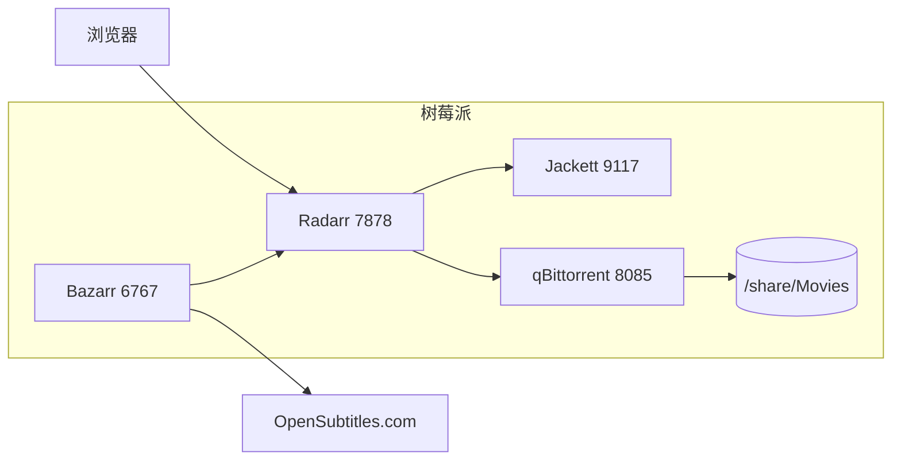

> **⚠️ 安全警告**：本文会公开本实验环境的登录地址、账号、密码和 API Key。这些凭证在发布后即视为已泄露，**请勿直接用于生产环境或长期暴露的服务**。建议读者在复现时替换为自己的强密码，并在公网访问时加 VPN/反向代理 + HTTPS。

## 1. 目标

让树莓派变成一个可以通过网页操作的“电影下载站”：

1. 打开网页搜索电影。
2. 选择想下载的版本（优先 4K）。
3. 自动通过 BT 下载到 Samba 共享目录 `/share/Movies`。
4. 自动下载中英双语字幕并合并成一条 bilingual 字幕。

## 2. 最终架构



- **Radarr**：电影管理 + 自动搜索 + 发送下载任务。
- **Jackett**：索引器聚合，把 TPB 等站转成 Torznab 接口给 Radarr。
- **qBittorrent**：BT 下载客户端。
- **Bazarr**：基于 Radarr 库自动下载字幕，后处理合并中英双语。

## 3. 环境信息

- 设备：Raspberry Pi，ARM64，8 GB RAM
- OS：Linux 6.12.87
- Docker：29.5.3，Docker Compose v5.1.4
- 已有服务：V2Ray（HTTP 代理 `127.0.0.1:10809`）、Jellyfin、Portainer、AdGuard Home
- Samba 共享：`/share`，局域网地址 `192.168.1.7`
- Docker 默认网桥网关：`172.18.0.1`，容器内通过 `172.18.0.1:10809` 走宿主机 V2Ray 代理

## 4. 部署步骤

### 4.1 创建目录

```bash
mkdir -p /share/Movies /share/Downloads
mkdir -p /home/pi/docker/qbittorrent/config
mkdir -p /home/pi/docker/radarr/config
mkdir -p /home/pi/docker/jackett/config
mkdir -p /home/pi/docker/bazarr/config/scripts
```

### 4.2 Docker Compose

在 `/home/pi/docker/compose.yml` 里追加以下服务（与已有的 jellyfin、v2ray 等共存）：

```yaml
  qbittorrent:
    image: linuxserver/qbittorrent:latest
    container_name: qbittorrent
    environment:
      - PUID=1000
      - PGID=100
      - TZ=Asia/Shanghai
      - WEBUI_PORT=8085
    volumes:
      - /home/pi/docker/qbittorrent/config:/config
      - /share/Downloads:/downloads
    ports:
      - "8085:8085"
      - "6881:6881"
      - "6881:6881/udp"
    restart: unless-stopped

  radarr:
    image: linuxserver/radarr:latest
    container_name: radarr
    environment:
      - PUID=1000
      - PGID=100
      - TZ=Asia/Shanghai
    volumes:
      - /home/pi/docker/radarr/config:/config
      - /share/Movies:/movies
      - /share/Downloads:/downloads
    ports:
      - "7878:7878"
    restart: unless-stopped

  jackett:
    image: linuxserver/jackett:latest
    container_name: jackett
    environment:
      - PUID=1000
      - PGID=100
      - TZ=Asia/Shanghai
      - HTTP_PROXY=http://172.18.0.1:10809
      - HTTPS_PROXY=http://172.18.0.1:10809
    volumes:
      - /home/pi/docker/jackett/config:/config
    ports:
      - "9117:9117"
    restart: unless-stopped

  bazarr:
    image: linuxserver/bazarr:latest
    container_name: bazarr
    environment:
      - PUID=1000
      - PGID=100
      - TZ=Asia/Shanghai
      - HTTP_PROXY=http://172.18.0.1:10809
      - HTTPS_PROXY=http://172.18.0.1:10809
    volumes:
      - /home/pi/docker/bazarr/config:/config
      - /share/Movies:/movies
      - /share/Downloads:/downloads
    ports:
      - "6767:6767"
    restart: unless-stopped
```

注意：

- qBittorrent 的 WebUI 端口改成 `8085`，因为宿主机 `8080` 已被其他服务占用。
- Jackett/Bazarr 不直接用内置代理，而是通过容器环境变量走 V2Ray，这样更稳定。
- 容器下载目录统一挂到 `/share/Downloads`，电影最终目录是 `/share/Movies`。

### 4.3 启动

```bash
cd /home/pi/docker
docker compose up -d qbittorrent radarr jackett bazarr
```

## 5. 各服务配置

### 5.1 qBittorrent

- 地址：`http://192.168.1.7:8085`
- 账号：`admin`
- 密码：`pi123456`

Radarr 里添加下载客户端时，主机填 `qbittorrent`，端口填 `8085`（因为容器内 qBittorrent 的 WebUI 监听的是 `8085`）。

### 5.2 Jackett

- 地址：`http://192.168.1.7:9117`
- API Key：`1gh53xjyx9l1djek69yas386y7wtcjoc`

配置步骤：

1. 进入 Jackett → Add indexer。
2. 添加 **The Pirate Bay**。
3. 在 Jackett 设置里的 Proxy 先留空，靠容器环境变量 `HTTP_PROXY`/`HTTPS_PROXY` 走代理。
4. 复制 Torznab feed URL，例如：
   `http://192.168.1.7:9117/api/v2.0/indexers/thepiratebay/results/torznab/`

> 踩坑：Jackett 内置代理填 `127.0.0.1:12345` 会失败，因为容器内 `127.0.0.1` 不是宿主机。改成容器环境变量代理后正常。

### 5.3 Radarr

- 地址：`http://192.168.1.7:7878`
- API Key：`be67ae6612cc4061a7a2335723893305`

配置步骤：

1. **Settings → Media Management → Root Folders**：添加 `/movies`。
2. **Settings → Download Clients → Add → qBittorrent**：
   - Host：`qbittorrent`
   - Port：`8085`
   - Username：`admin`
   - Password：`pi123456`
3. **Settings → Indexers → Add → Torznab**：
   - URL：Jackett 里 TPB 的 Torznab URL
   - API Key：Jackett 的 API Key `1gh53xjyx9l1djek69yas386y7wtcjoc`
4. **Profiles → 编辑 Ultra-HD**：把画质优先级调整为：
   1. Remux-2160p
   2. Bluray-2160p
   3. WEB-DL-2160p
   - 禁用 HDTV-2160p，避免下载到低质量 4K。

### 5.4 Bazarr

- 地址：`http://192.168.1.7:6767`
- API Key：`db657bd7209430ebc1e25832b24c9d1b`

配置步骤：

1. **Settings → Languages → Add New Profile**：
   - Name：`中英双语`
   - Language items 用 alpha2 code：`en`、`zh`（不要写“英文”“中文”，会报 `ValueError: None is not a valid language`）。
2. **Settings → Providers**：启用 OpenSubtitles.com。
   - 需要到 [OpenSubtitles.com](https://www.opensubtitles.com) 注册免费账号并填入用户名/密码。
3. **Settings → Notifications → Add → Radarr**：
   - Host：`http://radarr:7878`
   - API Key：Radarr 的 API Key
4. **Settings → Subtitles → Post-Processing**：
   - 启用 `Use Post-Processing`
   - Post-Processing Command：
     ```bash
     python3 /config/scripts/merge_bilingual_subs.py
     ```

### 5.5 双语字幕合并脚本

文件：`/home/pi/docker/bazarr/config/scripts/merge_bilingual_subs.py`

Bazarr 每次下载字幕后会调用该脚本，`BAZARR_SUBTITLE_PATH` 环境变量指向刚下载的字幕。脚本会把同一份媒体的英文和中文 SRT 按时间轴合并成 `*.zh+en.srt`。

```python
#!/usr/bin/env python3
import os
import re
import sys
from pathlib import Path


def parse_srt(content):
    """把 SRT 文本解析成 [{'start': str, 'end': str, 'text': str}, ...]。"""
    blocks = re.split(r'\n\s*\n', content.strip())
    entries = []
    for block in blocks:
        lines = block.strip().splitlines()
        if len(lines) < 3:
            continue
        idx, time_line = lines[0], lines[1]
        times = time_line.split('-->')
        if len(times) != 2:
            continue
        text = '\n'.join(lines[2:]).strip()
        entries.append({
            'start': times[0].strip(),
            'end': times[1].strip(),
            'text': text,
        })
    return entries


def write_srt(entries, path):
    """把解析后的条目写回标准 SRT 文件。"""
    with open(path, 'w', encoding='utf-8') as f:
        for i, e in enumerate(entries, 1):
            f.write(f"{i}\n")
            f.write(f"{e['start']} --> {e['end']}\n")
            f.write(f"{e['text']}\n\n")


def merge_subtitles(en_path, zh_path, output_path):
    with open(en_path, 'r', encoding='utf-8-sig', errors='ignore') as f:
        en_entries = parse_srt(f.read())
    with open(zh_path, 'r', encoding='utf-8-sig', errors='ignore') as f:
        zh_entries = parse_srt(f.read())

    en_by_start = {e['start']: e for e in en_entries}
    merged = []
    for zh in zh_entries:
        en = en_by_start.get(zh['start'])
        if en:
            text = f"{zh['text']}\n{en['text']}"
        else:
            text = zh['text']
        merged.append({
            'start': zh['start'],
            'end': zh['end'],
            'text': text,
        })
    write_srt(merged, output_path)


def main():
    subtitle_path = os.environ.get('BAZARR_SUBTITLE_PATH')
    if not subtitle_path:
        print("BAZARR_SUBTITLE_PATH not set", file=sys.stderr)
        sys.exit(1)

    p = Path(subtitle_path)
    lang = p.suffix  # .zh 或 .en
    stem = p.with_suffix('').stem
    parent = p.parent

    # 根据当前下载的是中文还是英文，找另一语言文件
    if lang == '.zh':
        other = parent / f"{stem}.en.srt"
        merged = parent / f"{stem}.zh+en.srt"
        if other.exists():
            merge_subtitles(other, p, merged)
    elif lang == '.en':
        other = parent / f"{stem}.zh.srt"
        merged = parent / f"{stem}.zh+en.srt"
        if other.exists():
            merge_subtitles(p, other, merged)


if __name__ == '__main__':
    main()
```

给脚本可执行权限：

```bash
chmod +x /home/pi/docker/bazarr/config/scripts/merge_bilingual_subs.py
```

> 踩坑：Bazarr 语言配置里如果填“中文”“英文”会报 `ValueError: None is not a valid language`，必须用 alpha2 code `zh`/`en`。

## 6. 下载测试：《速度与激情 1》4K

1. 在 Radarr 搜索 `The Fast and the Furious`（2001）。
2. 选择 **Ultra-HD** 质量配置。
3. Radarr 通过 Jackett/TPB 找到 4K UHD BluRay 版本，约 18.67 GB。
4. 发送给 qBittorrent 开始下载。
5. 由于种子数只有 1-2，速度较慢，预计需要几天。
6. 下载完成后 Radarr 自动硬链接/移动到 `/share/Movies`。

如果速度太慢，可以随时在 Radarr 里把画质改成 1080p 重新搜索。

## 7. 访问地址与凭证汇总

| 服务 | URL | 账号 | 密码 / API Key |
| --- | --- | --- | --- |
| Radarr | `http://192.168.1.7:7878` | 无 | `be67ae6612cc4061a7a2335723893305` |
| Jackett | `http://192.168.1.7:9117` | 无 | `1gh53xjyx9l1djek69yas386y7wtcjoc` |
| qBittorrent | `http://192.168.1.7:8085` | `admin` | `pi123456` |
| Bazarr | `http://192.168.1.7:6767` | 无 | `db657bd7209430ebc1e25832b24c9d1b` |

## 8. 踩坑与备注

1. **代理问题**：Jackett 内置代理在容器里对 `127.0.0.1` 解析错误，改用容器环境变量 `HTTP_PROXY=http://172.18.0.1:10809` 解决。
2. **qBittorrent 端口**：默认 `8080` 被占用，改为 `8085`，Radarr 里也要对应填 `8085`。
3. **Radarr 4K 画质**：需手动调整 `Ultra-HD` profile 优先级并禁用 `HDTV-2160p`。
4. **Bazarr 语言 code**：语言 profile 里必须用 `en`/`zh`，不能用中文名。
5. **字幕源**：OpenSubtitles.com 需要注册并填入账号密码，否则字幕下载会全部失败。
6. **安全**：以上凭证仅用于本实验，发布本文后应视为已泄露，建议尽快修改。

## 9. 后续可优化

- 给所有服务加上 HTTPS + 反向代理（Nginx/Caddy + Authelia/Authentik）。
- 用 Sonarr 扩展电视剧自动下载。
- 给 qBittorrent 设置完成后自动做种限制或分类标签。
- 把 OpenSubtitles 账号密码改为 Bazarr 环境变量注入，避免手动在 UI 填写。
- 4K 下载慢时，可尝试加入更多公共索引器或 PT 站点。
