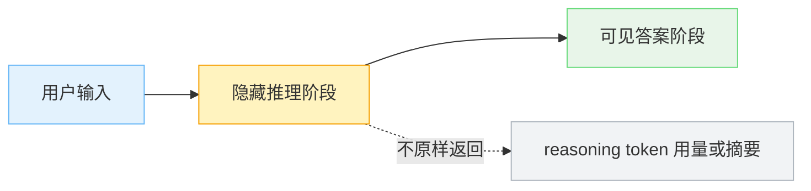

1. Table of Contents, ordered
{:toc}

很多人第一次看到 `thinking effort` 或 `reasoning effort` 时，直觉会把它理解成一个“硬件省电档”：`low` 少算一点，`high` 多算一点。再往下想，很容易猜成“低档位是不是少跑几层 Transformer”。

这个猜测很自然，因为大模型的确是在一层层神经网络里做计算。但 reasoning model 里的 effort 参数，重点通常不在**单个 token 算得浅不浅**，而在**一次请求里允许模型生成多少内部推理 token，以及模型从一开始采用什么推理策略**。

# 先把两个“算”分开

标准自回归 Transformer 生成文本时，每个 token 大体都要经过完整模型层数：

```text
第 1 个 token：过 N 层 Transformer
第 2 个 token：过 N 层 Transformer
第 3 个 token：过 N 层 Transformer
...
```

所以，`effort=low` 更像是少生成一些中间推理 token，而不是每个 token 少过几层网络：

```text
high effort:
prompt -> hidden reasoning token x 2000 -> answer token x 300

low effort:
prompt -> hidden reasoning token x 200 -> answer token x 250
```

如果模型权重相同，每个 token 的单步成本大体类似。差别来自总 token 数：高档位允许模型在最终回答前多做分解、验证、反例检查和边界条件枚举，延迟和成本自然更高。

# Hidden reasoning token 是什么

reasoning model 的一次请求，可以粗略画成这样：



这里的 hidden reasoning token 可以理解成一种内部 scratchpad，和大家熟悉的 CoT 有关系，但不是一回事。

| 名称 | 对用户是否可见 | 作用 |
|------|----------------|------|
| 可见 CoT / 解释步骤 | 可见 | 写给用户看的推理说明，通常已经被整理过 |
| hidden reasoning token | 通常不可见 | 模型内部用于推理、检查、规划的中间 token |

所以，“CoT 已经公开了”和“reasoning token 是隐藏的”并不矛盾。公开的是模型愿意写给用户看的解释；隐藏的是模型在最终答案前使用的内部草稿。OpenAI 的 [reasoning models 文档](https://developers.openai.com/api/docs/guides/reasoning) 也把 reasoning token 作为一类会消耗预算、但不直接等同于最终输出的 token 来讨论。

# 低档位不是“想到一半被砍断”

低 effort 最容易被误解成：模型本来按高档位深想，想到一半预算没了，于是被迫立刻回答。

真实系统里可能确实有硬预算上限，但更合理的设计目标不是这种粗暴截断，而是从一开始就让模型知道当前档位：

```text
reasoning_effort=low
-> 选择短路径推理
-> 少分解、少验证、少枚举
-> 更早收敛到答案

reasoning_effort=high
-> 允许长路径推理
-> 多拆问题、多检查、多比较
-> 更晚进入最终答案
```

可以把它看成“软控制 + 硬上限”的组合：软控制让模型学会不同档位的行为模式，硬上限避免内部推理无限膨胀。复杂任务在低档位下更容易漏掉验证步骤，不是因为笔写到一半被抢走，而是它一开始就只打算打很短的草稿。

# 这不是 Agent，但可以被 Agent 使用

Thinking effort 的最小形态不需要工具调用、计划循环或外部观察：

```text
prompt -> hidden reasoning tokens -> visible answer tokens
```

Agent 则通常是另一层编排：

```text
思考 -> 调工具 -> 观察结果 -> 再思考 -> 再调工具 -> 最终回答
```

两者可以叠加，但不要混为一谈。effort 参数主要是在模型推理阶段控制内部计算预算和行为倾向；Agent 是外部系统如何反复调用模型、工具和环境。

# 为什么叫 test-time compute

`test-time compute` 这个词来自机器学习论文语境，不是产品里的“测试环境”。在 ML 里：

```text
training time = 训练阶段
test time     = 模型训练好后，用它处理新样本的阶段
```

所以 `test-time compute` 基本就是工程语境里的 `inference-time compute`：模型权重不变，但在每个新请求上花更多或更少计算。OpenAI 在 [Learning to reason with LLMs](https://openai.com/index/learning-to-reason-with-llms/) 中讨论 o1 时，就把推理时计算量作为影响能力的变量；随后在 [o1 API 发布说明](https://openai.com/index/o1-and-new-tools-for-developers/) 中把 `reasoning_effort` 暴露给开发者，用来控制模型回答前“think”的程度。

后来这个思路在产品上变得更清晰：OpenAI 的 [o3-mini 发布说明](https://openai.com/index/openai-o3-mini/) 把不同 reasoning effort 变成同一模型的不同使用档位；Anthropic 在 [Claude 3.7 Sonnet](https://www.anthropic.com/news/claude-3-7-sonnet) 里用 extended thinking 和 token budget 表达类似概念；Google Gemini 也在 [thinking 文档](https://ai.google.dev/gemini-api/docs/thinking) 里提供 thinking budget。

# 最后再回到那个误解

Thinking effort 的关键不是：

```text
low = 少跑几层神经网络
high = 多跑几层神经网络
```

而更接近：

```text
low = 少生成内部推理 token，采用短推理策略
high = 多生成内部推理 token，允许更充分的检查和推导
```

外部参数并没有逐 token 遥控模型。它改变的是生成条件：当前处于哪个推理档位、内部推理预算大概多大、什么时候应该转入最终答案。模型仍然是在逐 token 生成，只是这次生成发生在一个被服务端和训练目标共同约束过的推理环境里。
