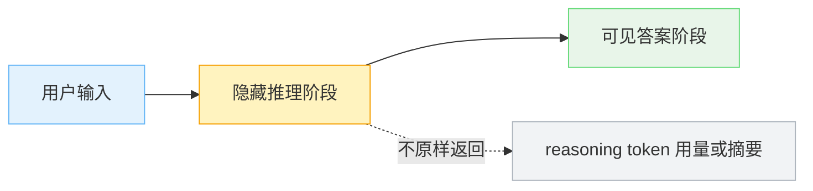

1. Table of Contents, ordered
{:toc}

很多人第一次看到 `thinking effort` 或 `reasoning effort` 时，直觉会把它理解成一个“硬件省电档”：`low` 少算一点，`high` 多算一点。再往下想，很容易猜成“低档位是不是少跑几层 Transformer”。

这个猜测很自然，因为大模型的确是在一层层神经网络里做计算。但 reasoning model 里的 effort 参数，重点通常不在**单个 token 算得浅不浅**，而在**模型愿意为一次任务投入多少生成计算，以及从一开始采用什么完成策略**。

对于只生成文本的 reasoning model，这些额外计算主要表现为更多内部推理 token；对于 Claude Code 这样的 Agent，它还可能表现为多读几个文件、多调用几次工具、多跑一轮测试，以及在交付前再复核一次。

# 先把两个“算”分开

标准自回归 Transformer 生成文本时，每个 token 大体都要经过完整模型层数：

```text
第 1 个 token：过 N 层 Transformer
第 2 个 token：过 N 层 Transformer
第 3 个 token：过 N 层 Transformer
...
```

所以，在最简单的单次文本生成里，`effort=low` 更像是少生成一些中间推理 token，而不是每个 token 少过几层网络：

```text
high effort:
prompt -> hidden reasoning token x 2000 -> answer token x 300

low effort:
prompt -> hidden reasoning token x 200 -> answer token x 250
```

如果模型权重相同，每个 token 的单步成本大体类似。差别主要来自总 token 数：高档位允许模型多做分解、验证、反例检查和边界条件枚举，延迟和成本自然更高。

# 同样叫 effort，控制范围并不完全一样

`thinking effort`、`reasoning effort` 和 `thinking budget` 经常被放在一起讨论，但它们不是跨厂商统一的标准参数。

| 产品 | effort 主要影响什么 | 是否是硬 token 配额 |
|------|---------------------|---------------------|
| OpenAI `reasoning.effort` | 模型思考的完整程度和 reasoning token 使用倾向 | 否 |
| Anthropic `output_config.effort` | 所有响应 token，包括思考、可见回答、工具调用及其参数 | 否 |
| Gemini `thinking_level` / `thinkingBudget` | 模型是否思考、思考深度或 thinking token 预算 | 通常不是；不同版本语义不同 |

OpenAI 的 [`reasoning.effort` 文档](https://developers.openai.com/api/docs/guides/reasoning)仍然把它描述为控制模型“思考多少”；Anthropic 当前的 [effort 文档](https://platform.claude.com/docs/en/build-with-claude/effort)则明确说，它即使在 extended thinking 没有启用时也能生效，并会影响可见文本和工具调用。

因此，把 effort 理解成“hidden reasoning token 档位”是一个有用的**最小模型**，却不能当成所有产品的完整定义。更通用的说法是：**effort 是模型对一次任务愿意投入多少生成工作、做到多彻底的行为信号。**

# Hidden reasoning token 是什么

reasoning model 的一次请求，可以粗略画成这样：



这里的 hidden reasoning token 可以理解成一种内部 scratchpad，和大家熟悉的 CoT 有关系，但不是一回事。

| 名称 | 对用户是否可见 | 作用 |
|------|----------------|------|
| 可见 CoT / 解释步骤 | 可见 | 写给用户看的推理说明，通常已经被整理过 |
| hidden reasoning token | 通常不可见 | 模型内部用于推理、检查、规划的中间 token |

所以，“CoT 已经公开了”和“reasoning token 是隐藏的”并不矛盾。公开的是模型愿意写给用户看的解释；隐藏的是模型在最终答案前使用的内部草稿。OpenAI 的 [reasoning models 文档](https://developers.openai.com/api/docs/guides/reasoning) 也把 reasoning token 作为一类会消耗预算、但不直接等同于最终输出的 token 来讨论。

# 低档位不是“想到一半被砍断”

低 effort 最容易被误解成：模型本来按高档位深想，想到一半预算没了，于是被迫立刻回答。

真实系统里确实还有 `max_tokens`、`max_output_tokens` 和上下文窗口等硬限制，但它们与 effort 是不同的控制量。effort 更像是从一开始就让模型知道当前档位：

```text
reasoning_effort=low
-> 选择短路径推理
-> 少分解、少验证、少枚举
-> 更早收敛到答案

reasoning_effort=high
-> 允许长路径推理
-> 多拆问题、多检查、多比较
-> 更晚进入最终答案
```

effort 本身通常是**软性行为信号**，不是一个保证用满、也不能超出的精确 token 目标。模型在训练中学会了不同档位的行为模式：简单问题即使设成高档，也可能很快结束；复杂任务在低档位下则更容易漏掉验证步骤，不是因为笔写到一半被抢走，而是它一开始就只打算打一份很短的草稿。

真正的硬上限是另外设置的。撞上 `max_tokens` 时，响应可能在中途被截断；这和模型主动判断“已经做够了”是两回事。

# 模型决定能力，effort 决定愿意花多少时间

[Claude Code 团队的这篇文章](https://x.com/ClaudeDevs/status/2074900291062034618)提供了一个很好理解的类比：**切模型像是换了一个人，切 effort 像是改变这个人愿意在任务上花多少时间。**

可以把几种组合想成：

| 组合 | 类比 | 更可能出现的结果 |
|------|------|------------------|
| 大模型 + 低 effort | 只给专家 5 分钟 | 经验和能力很强，但只做快速判断，不会逐文件细查 |
| 小模型 + 高 effort | 给优秀通才一整个下午 | 愿意充分阅读、尝试和验证，但仍受自身能力上限约束 |
| 大模型 + 高 effort | 让专家投入充足时间 | 能力上限和完成深度都高，但成本与等待也最高 |
| 小模型 + 低 effort | 让通才快速处理 | 适合边界清楚、可以机械执行的日常任务 |

这个类比最重要的地方是：**能力和投入不是同一条轴。** 更高 effort 不能把小模型的权重变成大模型，也不能凭空加入训练时没有形成的知识和模式；切换模型则不只是“多想一会儿”，而是换了一套冻结权重，以及随之而来的能力分布、行为特点和每 token 价格。

## 简单任务：两条曲线很快收敛


*图源：[ClaudeDevs](https://x.com/ClaudeDevs/status/2074900291062034618)。曲线仅用于解释概念，不是实际 benchmark 数据。*

横轴是单个任务花费的 token，大体对应成本和等待时间；纵轴是结果质量。对于改一个明确的配置值、按要求重命名变量、回答上下文里已有的信息这类简单任务，大小模型都能很快跨过“正确完成”的门槛。

两条曲线到达平台后，继续提高 effort 买到的主要是额外复核，而不是肉眼可见的质量提升。这时使用更大的模型或最高 effort，往往只会增加单 token 价格、生成量和等待时间。

## 复杂任务：小模型想得更久也未必追得上


*图源：[ClaudeDevs](https://x.com/ClaudeDevs/status/2074900291062034618)。曲线仅用于解释概念，不是实际 benchmark 数据。*

到了隐蔽 bug、陌生领域、架构取舍和长链路任务，模型之间的能力曲线会拉开。图里小模型开到 `max`，可能仍然只达到大模型 `medium` 的质量；大模型甚至可能用更少 token 达到同一个质量目标。

所以，“小模型单 token 更便宜”不等于“整个任务一定更便宜”。如果它需要反复试错、来回补上下文，最后仍无法完成，总成本可能反而更高。更高 effort 只能让模型在**自己的能力曲线**上继续前进，不能把整条曲线换成另一个模型。

当然，这两张图只是帮助思考的示意图，不代表所有任务都服从同一条曲线。真正选型仍然要看自己的任务集、质量门槛和评测结果。

# 结果不好时，到底该切哪个

先不要急着碰模型或 effort。结果不理想时，第一步应该检查任务描述、上下文、工具和验收标准是否齐全：模型没有拿到正确文件时，提高任何设置都只是更认真地猜。

如果这些条件已经满足，可以问一句：**它是“不知道”，还是“没认真做完”？**

```text
结果不好
├─ prompt、上下文、工具或验收标准不对
│  └─ 先修任务定义和运行环境
├─ 已经认真尝试，但理解不了、判断错或能力不够
│  └─ 切更强模型
└─ 能力看起来够，但少读文件、漏跑测试、没有复核
   └─ 提高 effort
```

还有一个实用信号：如果原本就使用默认 effort，却仍然稳定地做错困难任务，更值得尝试切模型；如果是为了省成本主动调到了低 effort，随后开始遗漏步骤，先把 effort 调回默认通常更合理。

# 这不是 Agent，但可以被 Agent 使用

Thinking effort 的最小形态不需要工具调用、计划循环或外部观察：

```text
prompt -> hidden reasoning tokens -> visible answer tokens
```

Agent 则通常是另一层编排：

```text
思考 -> 调工具 -> 观察结果 -> 再思考 -> 再调工具 -> 最终回答
```

两者可以叠加，但不要混为一谈。Agent 是外部系统如何让模型反复调用工具、观察环境并继续工作；effort 是模型在这个循环中愿意做到多彻底。

在纯文本请求里，effort 可能主要改变内部推理长度；在 Claude Code 这样的 Agent 里，它还会改变外部可观察的轨迹：读多少文件、调用多少次工具、是否运行测试、是否验证刚找到的答案，以及做完多少步以后向用户确认。它不是 Agent 本身，却可以影响 Agent 怎么跑。

# 为什么叫 test-time compute

`test-time compute` 这个词来自机器学习论文语境，不是产品里的“测试环境”。在 ML 里：

```text
training time = 训练阶段
test time     = 模型训练好后，用它处理新样本的阶段
```

所以 `test-time compute` 基本就是工程语境里的 `inference-time compute`：模型权重不变，但在每个新请求上花更多或更少计算。OpenAI 在 [Learning to reason with LLMs](https://openai.com/index/learning-to-reason-with-llms/) 中讨论 o1 时，就把推理时计算量作为影响能力的变量；随后在 [o1 API 发布说明](https://openai.com/index/o1-and-new-tools-for-developers/) 中把 `reasoning_effort` 暴露给开发者，用来控制模型回答前“think”的程度。

后来这个思路在产品上变得更清晰：OpenAI 的 [o3-mini 发布说明](https://openai.com/index/openai-o3-mini/) 把不同 reasoning effort 变成同一模型的不同使用档位；Anthropic 从 Claude 3.7 的 extended thinking 和 token budget，发展到现在覆盖思考、回答与工具调用的 [effort 参数](https://platform.claude.com/docs/en/build-with-claude/effort)；Google Gemini 也在 [thinking 文档](https://ai.google.dev/gemini-api/docs/thinking)里按模型版本提供 `thinking_level` 或 `thinkingBudget`。

# 最后再回到那个误解

Thinking effort 的关键不是：

```text
low = 少跑几层神经网络
high = 多跑几层神经网络
```

在最简单的 reasoning model 请求里，它更接近：

```text
low = 少生成内部推理 token，采用短推理策略
high = 多生成内部推理 token，允许更充分的检查和推导
```

放到 Agent 场景，更完整的说法则是：

```text
low = 倾向于少投入生成工作，少探索、少调用工具、少验证
high = 允许更长的推理路径、更多工具调用和更充分的复核
```

外部参数并没有逐 token 遥控模型，也没有改变模型权重。它改变的是生成条件和“做到什么程度才算完成”的行为倾向。**模型决定它大致能走哪条能力曲线，effort 决定它愿意沿这条曲线走多远。**
