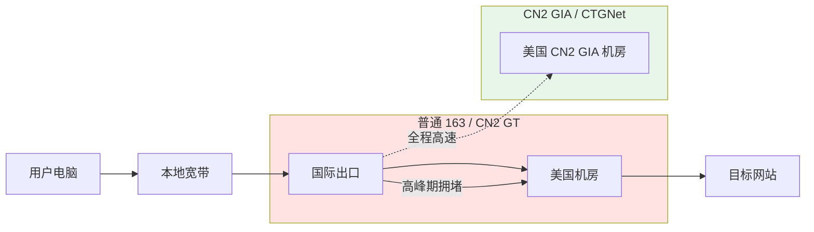

1. Table of Contents, ordered
{:toc}

## 问题：v2ray 突然很卡

某天打开浏览器，发现通过 v2ray 访问 YouTube、Google 都慢得难以忍受。本地代理端口是 `10808`，v2rayN 显示连接正常，但网页就是转圈。

第一反应通常是怀疑节点挂了，但 v2rayN 并没有报错。为了定位问题，我决定从本地网络、代理进程、节点链路三个层面做一次系统排查。

## 诊断：先排除本地网络

先用 curl 走 socks5 代理测速：

```bash
curl -x socks5h://127.0.0.1:10808 -o /dev/null \
  -w "HTTP %{http_code}, 总耗时 %{time_total}s\n" \
  https://www.google.com/
```

结果：**HTTP 000，连接超时**。但本地直连百度却非常流畅（0.07 秒），这说明问题不在本地宽带，而在代理链路。

进一步检查端口监听，确认 xray 进程在跑：

```bash
netstat -ano | grep 10808
```

输出显示 `xray.exe` 正在监听 `0.0.0.0:10808`，进程本身没问题。

## 关键发现：DNS 污染 + 节点高丢包

当我用 `--resolve` 强制 Google 的正确 IP 再测试时，代理居然能打开 Google，只是很慢。这说明 socks5h 的远程 DNS 解析返回了被污染的 IP。

同时，ping 节点 IP `65.49.202.163` 的结果触目惊心：

```text
发送: 50， 收到: 36， 丢失: 14 (28% 丢包)
平均延迟: 185ms
```

**28% 的丢包率**，足以让任何基于 TCP 的代理体验崩溃。WebSocket + TLS 对丢包尤其敏感，每丢一个包就要重传，页面打开时间会被放大数倍。

## 为什么普通线路会这么差

要理解这个问题，需要先搞清楚中国电信的几类国际出口线路。

### 中国电信骨干网分层

| 网络 | AS 号 | 特点 | 适用场景 |
|------|-------|------|---------|
| **163 / ChinaNet** | AS4134 | 最早的公众骨干网，容量大、便宜、高峰期极拥堵 | 普通访问 |
| **CN2 GT** | AS4809 接 AS4134 | 国际段走 CN2，进国内后走 163 | 中等质量 |
| **CN2 GIA** | AS4809 | 全程 CN2，质量最高、价格最贵、容量有限 | 视频会议、稳定代理 |
| **CTGNet** | AS23764 | 中国电信全球网络，实际等效于 CN2 GIA | 企业精品线路 |

搬瓦工文档里对这几条线路的描述很准确：普通 163 和 CN2 GT 在晚高峰都会拥堵，只有 **CN2 GIA / CTGNet** 能提供稳定的跨太平洋连接。

我当前的 `20G KVM - PROMO` 套餐走的就是普通线路，位于 `USCA_2` 机房，所以高峰期丢包严重。



## 解决方案：升级到 CN2 GIA ECOMMERCE

搬瓦工提供了 `SPECIAL 20G KVM PROMO V5 - CN2 GIA ECOMMERCE` 套餐，年费 $169.99。由于我当前套餐还有 159 天剩余，按未使用天数折算后补差价 **$48.83**，还能叠加一个 6.58% 的循环优惠码。

### 机房选择

CN2 GIA 套餐可选多个机房。搬瓦工官方推荐洛杉矶 `USCA_9`，原因有三：

1. **容量最大**：8×10Gbps CN2 GIA/CTGNet 链路
2. **三网优化**：电信 CN2 GIA + 移动 CMIN2 + 联通 CUP
3. **对中国路由最好**：延迟通常 130-150ms

另外还有 `USCA_6`（圣何塞）、`CABC_6`（温哥华）、`USNY_8`（纽约）等可选，但对大陆用户来说，洛杉矶 `USCA_9` 性价比最高。

## 升级与迁移过程

1. 在搬瓦工后台提交升级到 CN2 GIA ECOMMERCE
2. 进入 KiwiVM 的 **Migrate to another datacenter**
3. 选择 `USCA_9`（DC9 AMD+NVMe, CT CN2GIA, CMIN2, CUP）
4. 等待迁移完成，获取新 IPv4 地址
5. 在 Cloudflare 把域名 A 记录从旧 IP `65.49.202.163` 改为新 IP `95.169.10.75`
6. 本地执行 `ipconfig /flushdns`
7. 重启 v2rayN，让 xray 重新解析域名

迁移完成后，新 IP 是 `95.169.10.75`，先 ping 一下：

```text
发送: 50， 收到: 50， 丢失: 0 (0% 丢包)
平均延迟: 153ms
```

丢包直接归零，延迟也降了 30ms。

## 升级前后 benchmark 对比

| 指标 | 升级前（USCA_2 普通线路） | 升级后（USCA_9 CN2 GIA） |
|------|------------------------|------------------------|
| 节点 IP | 65.49.202.163 | 95.169.10.75 |
| Ping 丢包 | **28%** | **0%** |
| Ping 延迟 | 185ms | 153ms |
| 代理打开 Google | 3.78s | 0.84s |
| 代理打开 YouTube | 13.14s | 0.95s |
| 下载 10MB | 完全失败 | 3-6 Mbps |

本地直连百度的速度没有变化（始终在 0.04 秒左右），证明改善完全来自国际线路质量的提升。

## 总结

这次卡顿的根因不是 v2rayN 配置错误，也不是本地网络问题，而是**搬瓦工普通线路在晚高峰的严重丢包**。升级到 **CN2 GIA ECOMMERCE** 并迁移到 **USCA_9** 后，丢包从 28% 降到 0%，Google 和 YouTube 的打开速度分别提升了 4 倍和 13 倍。

对于个人翻墙用途，洛杉矶 CN2 GIA 20G 套餐已经足够。如果未来还想进一步优化，可以考虑把协议从 `VMess + WebSocket + TLS` 换成抗封锁能力更强的 `VLESS + Vision + REALITY`，但就当前体验而言，CN2 GIA 已经解决了核心痛点。
