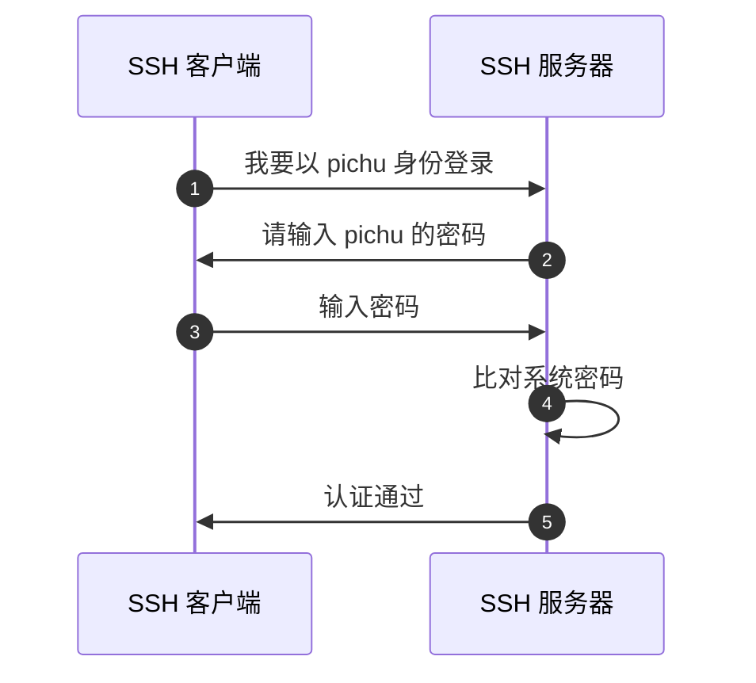
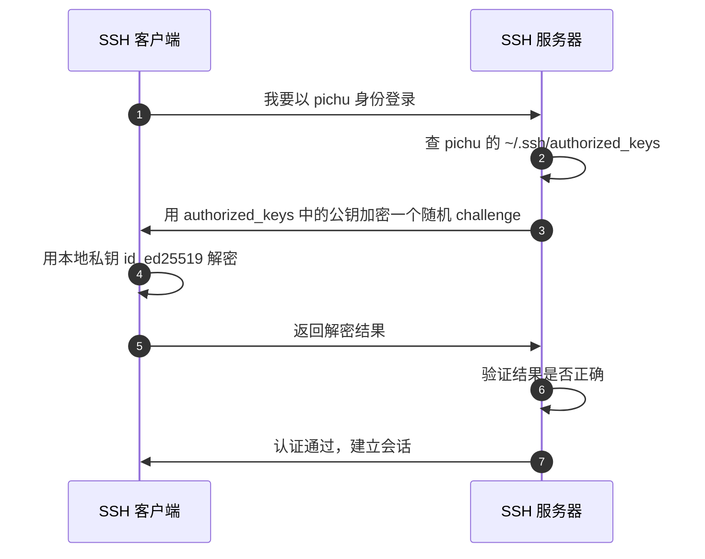

1. Table of Contents, ordered
{:toc}

## 从一个常见问题开始

这次整理源于一次真实的对话。用户在配置 SSH 免密登录时连续问了几个问题：

> “我本地明明有 `~/.ssh/id_ed25519` 私钥，为什么 `ssh pichu@puppylpg.top` 还要我输密码？”
>
> “那也就是说之前压根就没有用私钥登录呗？”
>
> “如果有私钥的话，可以根本就不配这个用户名了吗？”

这几个问题看似基础，但把 **私钥**、**公钥**、**用户名**、**密码** 这几个概念搅在了一起。搞不清它们之间的关系，就会像我早年一样无数次纳闷：为什么我的 key “不管用”。

这篇文章先把 SSH 登录的两种方式讲清楚，再回来看当时的排查过程，最后把容易踩的坑列出来。

## SSH 登录的两种方式

SSH 服务器认证用户身份，主要有两条路：**密码认证** 和 **公钥认证**。

### 方式一：用户名 + 密码认证

这是最容易理解的一种方式。你告诉服务器“我是 `pichu`”，然后输入 `pichu` 这个用户在服务器上的登录密码。服务器内部直接比对密码，正确就放行。



这种方式简单直接，但每次登录都要输入密码，而且密码可能在网络传输中被嗅探（虽然 SSH 本身加密，但弱密码仍会被暴力破解）。

### 方式二：公钥 + 私钥认证

这是更推荐的方式，也是所谓“免密登录”的真正含义。

核心思路是：你本地生成一对密钥——**私钥** 留在本地，**公钥** 放到服务器上。登录时，服务器用公钥出一个“题目”，只有持有对应私钥的客户端才能解出来，以此证明身份。



注意第 2 步：服务器必须先在 `authorized_keys` 里登记你的公钥。如果没有登记，第 3 步就无从发起，服务器只能退回到密码认证。

所以“免密”免的是 **远程用户的登录密码**，不是完全没有任何凭证。私钥本身仍然是凭证，只是它不需要你每次手动输入。

### 两种方式对比

| 对比项 | 密码认证 | 公钥认证 |
|--------|----------|----------|
| 每次登录要输入什么 | 远程用户密码 | 私钥 passphrase（如果私钥设了的话） |
| 服务器端存什么 | 用户密码哈希 | 公钥 |
| 本地需要保留什么 | 记住密码 | 私钥文件 |
| 安全性 | 依赖密码强度 | 依赖私钥文件安全 |
| 自动化脚本友好度 | 不友好 | 友好 |

## 排查现场

讲完原理，回头看当时的排查过程，每一步的目的就清楚了。

### 第一步：确认本地有没有 key

```bash
ls -la ~/.ssh/
```

输出里有 `id_ed25519` 和 `id_ed25519.pub`，说明本地确实有密钥对。

### 第二步：确认 key 本身有没有密码

```bash
ssh-keygen -y -f ~/.ssh/id_ed25519
```

如果私钥本身还设置了 passphrase，这个命令会提示输入。当时直接输出了公钥内容，没有提示 passphrase，说明私钥本身没有密码。

### 第三步：尝试无密码登录

```bash
ssh -o BatchMode=yes pichu@puppylpg.top
```

`BatchMode=yes` 会让 SSH 禁止任何交互式密码输入。如果公钥认证已经配好，这里应该直接登录成功；否则就会报错。结果是：

```text
Connection refused
```

端口 22 连不上。

### 第四步：查 known_hosts 找实际端口

```bash
grep puppylpg ~/.ssh/known_hosts
```

发现服务器实际开在 `[puppylpg.top]:23333`，不是默认的 22 端口。

### 第五步：用正确端口再测公钥登录

```bash
ssh -p 23333 -o BatchMode=yes pichu@puppylpg.top
```

这次报错变了：

```text
Permission denied (publickey,password).
```

这说明 SSH 服务端接受了连接，但**不接受当前客户端提供的公钥**，于是 fall back 到密码认证。而我们因为开了 `BatchMode=yes`，不允许输入密码，所以直接失败。

结合前面的原理就知道：本地有私钥，但服务器端的 `authorized_keys` 里没有对应公钥，所以公钥认证走不通。

### 第六步：修复私钥权限

```bash
chmod 600 ~/.ssh/id_ed25519
```

之前私钥权限是 `644`，SSH 客户端会拒绝使用权限过于开放的私钥。

### 第七步：写 config

在 `~/.ssh/config` 里加上：

```ssh
Host puppylpg.top
    HostName puppylpg.top
    User pichu
    Port 23333
    IdentityFile ~/.ssh/id_ed25519
    IdentitiesOnly yes
```

这样以后直接 `ssh puppylpg.top` 就能带上正确的用户名、端口和私钥。

### 第八步：把公钥部署到服务器

```bash
ssh-copy-id pichu@puppylpg.top
```

这一步会要求输入一次远程用户的登录密码。输入之后，本地公钥就被追加到远程服务器的 `~/.ssh/authorized_keys` 里。

之后再执行：

```bash
ssh puppylpg.top
```

不需要输入任何密码，直接登录成功。

## ssh-copy-id 到底做了什么？

有些人觉得 `ssh-copy-id` 很神秘，其实它只做一件简单的事情：

1. 读取本地 `~/.ssh/id_ed25519.pub`（默认 key，或你指定的 key）
2. 通过 SSH 登录远程服务器（这一步需要你输入一次密码）
3. 把公钥内容追加到远程 `~/.ssh/authorized_keys` 文件末尾

你可以完全手动完成：

```bash
# 本地
ssh pichu@puppylpg.top
```

登录进去后：

```bash
# 服务器上
mkdir -p ~/.ssh
chmod 700 ~/.ssh
cat >> ~/.ssh/authorized_keys
# 然后粘贴本地公钥内容
chmod 600 ~/.ssh/authorized_keys
```

`ssh-copy-id` 只是把这个流程自动化了。

## 私钥、公钥、用户名，各自到底负责什么？

很多人（包括当年的我）会下意识觉得：我都用 key 了，是不是用户名也可以省略？

答案是不能。三者职责完全不同：

| 元素 | 职责 | 能否省略 |
|------|------|----------|
| 用户名 | 告诉服务器“我要以哪个用户身份登录” | 只有当远程用户名和本地用户名一致时可以省略 |
| 私钥 | 证明“我就是被该用户授权的那个人” | 使用公钥认证时不能省略 |
| 公钥 | 服务器用来验证私钥是否匹配的凭据 | 必须预先部署在服务器上 |

如果你写：

```bash
ssh puppylpg.top
```

SSH 默认会用**本地当前用户名**去连接。假设你本地用户叫 `alice`，那它等价于：

```bash
ssh alice@puppylpg.top
```

如果服务器上没有 `alice` 这个用户，或者 `alice` 的 `authorized_keys` 里没有你的公钥，就会失败。

所以 `~/.ssh/config` 里的 `User pichu` 不是为了配合私钥才写的，而是因为你确实要以 `pichu` 身份登录。私钥只解决“认证方式”，不解决“登录成谁”。

## 常见误区 checklist

- **“有私钥就能免密登录”** ❌ 服务器还必须配了你的公钥。
- **“私钥可以替代用户名”** ❌ 用户名和私钥职责不同。
- **“ssh-copy-id 会让我以后不用私钥”** ❌ 恰恰相反，它让私钥认证真正生效。
- **“私钥有密码更安全，所以我应该给私钥设密码”** ✅ 对，但要理解这是另一层安全：私钥 passphrase 保护的是私钥文件本身，不是远程登录密码。

## 总结

那次排查的最终结论是：

1. 本地私钥 `id_ed25519` 一直存在，且没有 passphrase；
2. 服务器 SSH 端口是 `23333`，不是默认 `22`；
3. 服务器 `pichu` 用户的 `authorized_keys` 里没有登记对应公钥；
4. 因此 SSH 只能退回到密码认证；
5. 用 `ssh-copy-id` 部署公钥后，公钥认证才生效，实现了真正的免密登录。

如果你也遇到“有私钥还要输密码”的情况，优先检查这三件事：

1. `~/.ssh/config` 里用户名、端口、私钥路径是否正确；
2. 远程服务器 `~/.ssh/authorized_keys` 里是否有你的公钥；
3. 本地私钥权限是否为 `600`，远程 `~/.ssh` 权限是否为 `700`、authorized_keys 是否为 `600`。

搞清“认证谁”和“登录成谁”这两个问题，SSH 公钥认证就不再是黑魔法。
