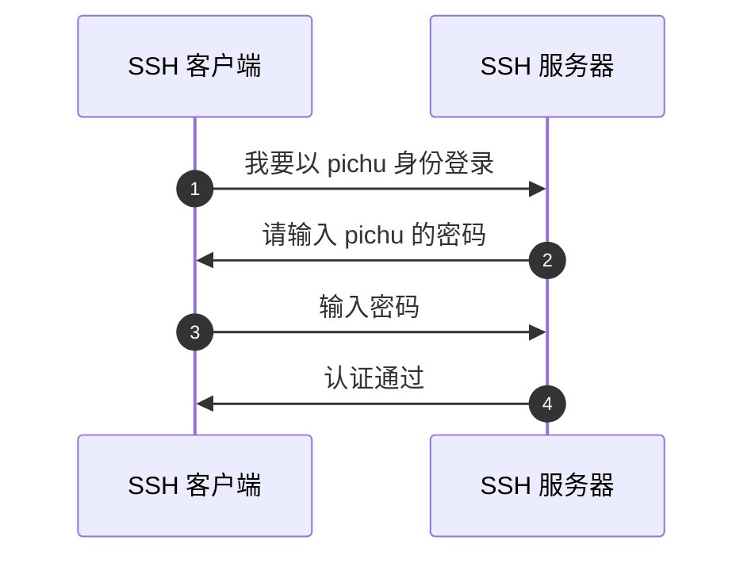
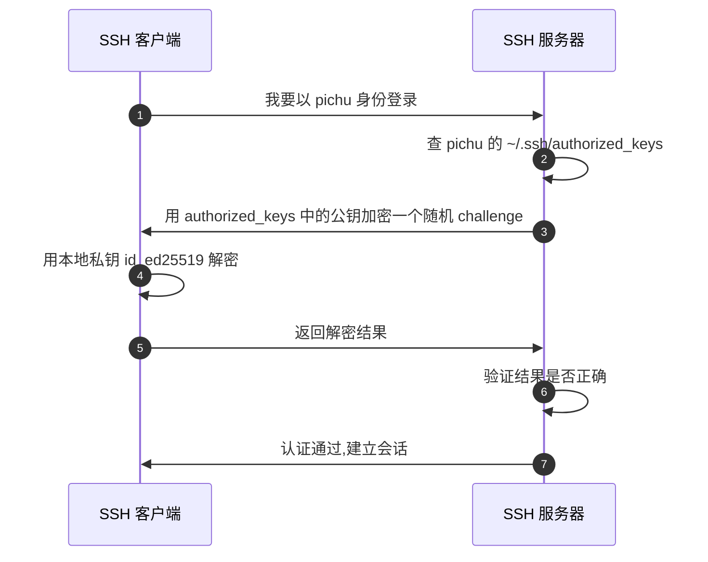

1. Table of Contents, ordered
{:toc}

## 从一个常见问题开始

这次整理源于真实的配置经历。在配置 SSH 免密登录时，连续冒出过几个问题：

> “我本地明明有 `~/.ssh/id_ed25519` 私钥，为什么 `ssh pichu@puppylpg.top` 还要我输密码？”
>
> “那也就是说之前压根就没有用私钥登录呗？”
>
> “如果有私钥的话，可以根本就不配这个用户名了吗？”

好不容易用 `ssh-copy-id` 把公钥部署上去了，新的问题又来了：

> “我已经把公钥发到服务器的 `known_hosts` 里了，为什么登录还要我输密码？”

这一句话里其实混了两个经典误会：

1. **`known_hosts` 和 `authorized_keys` 搞混了**：前者是本地记录“服务器长什么样”的防伪名单，后者才是服务器上“哪些公钥可以登录我”的花名册；
2. **两个密码搞混了**：把“服务器用户的登录密码”和“私钥自己的 passphrase”当成了一个东西。

这几个问题看似基础，但把 **私钥**、**公钥**、**用户名**、**两个不同的密码** 搅在了一起。搞不清它们之间的关系，就会像我早年一样无数次纳闷：为什么我的 key “不管用”。

这篇文章的结构是：先把 SSH 登录的两种方式讲清楚（理论），再手把手把免密登录配一遍（实践），最后回头看当时的排查过程——有了前面的知识和实践，每个排查步骤在干什么就一目了然了。

## SSH 登录的两种方式

SSH 服务器认证用户身份，主要有两条路：**密码认证** 和 **公钥认证**。

### 方式一：用户名 + 密码认证

这是最容易理解的一种方式。你告诉服务器“我是 `pichu`”，然后输入 `pichu` 这个用户在服务器上的登录密码。服务器内部直接比对密码，正确就放行。


```mermaid
sequenceDiagram
    autonumber
    participant C as SSH 客户端
    participant S as SSH 服务器

    C->>S: 我要以 pichu 身份登录
    S->>C: 请输入 pichu 的密码
    C->>S: 输入密码
    S->>C: 认证通过
```

这种方式简单直接，但每次登录都要输入密码，而且弱密码容易被暴力破解。它不需要任何提前配置——只要服务器开了密码认证、你知道密码，就能登录。

### 方式二：公钥 + 私钥认证

这是更推荐的方式，也是所谓“免密登录”的真正含义。

核心思路是：你本地生成一对密钥——**私钥** 留在本地，**公钥** 放到服务器上。登录时，服务器用公钥出一个“题目”，只有持有对应私钥的客户端才能解出来，以此证明身份。


```mermaid
sequenceDiagram
    autonumber
    participant C as SSH 客户端
    participant S as SSH 服务器

    C->>S: 我要以 pichu 身份登录
    S->>S: 查 pichu 的 ~/.ssh/authorized_keys
    S->>C: 用 authorized_keys 中的公钥加密一个随机 challenge
    C->>C: 用本地私钥 id_ed25519 解密
    C->>S: 返回解密结果
    S->>S: 验证结果是否正确
    S->>C: 认证通过,建立会话
```

注意第 2 步：服务器必须先在 `authorized_keys` 里登记你的公钥。如果没有登记，第 3 步就无从发起，服务器只能退回到密码认证。

所以“免密”免的是 **远程用户的登录密码**，不是完全没有任何凭证。私钥本身仍然是凭证，只是它不需要你每次手动输入。

### 重点：这里有**两个完全不同的密码**

这是整篇文章最想强调的一点，也是最容易栽跟头的地方：

| | 服务器用户密码 | 私钥 passphrase |
|---|---|---|
| 它是什么 | `pichu` 这个用户在**服务器上**的登录密码 | 生成密钥对时给**私钥文件**加的锁 |
| 存在哪里 | 服务器上（密码哈希） | 不存在任何地方，只在你脑子里 |
| 什么时候要输 | 方式一登录时；`ssh-copy-id` 部署公钥时 | 每次使用被加密的私钥时 |
| 提示长什么样 | `pichu@puppylpg.top's password:` | `Enter passphrase for key '/home/pi/.ssh/id_ed25519':` |
| 去掉它会怎样 | 密码认证失效 | 私钥文件失去保护，谁拿到文件谁就能用 |

关键理解：**passphrase 不是给服务器的，是给本地私钥文件的**。私钥以加密形式存在磁盘上，SSH 每次要用它，得先用 passphrase 解锁。这跟服务器没有半点关系——服务器从头到尾只看公钥。

所以“把公钥部署好了，登录还要密码”完全可能发生在公钥认证**已经成功**的情况下：服务器认可了你的 key，但你的 key 自己上了锁，用之前得先解锁。提示语里写的是 `passphrase for key` 还是 `password`，是区分两种情况的关键线索。

### 两种方式对比

| 对比项 | 密码认证 | 公钥认证 |
|--------|----------|----------|
| 每次登录要输入什么 | 远程用户密码 | 私钥 passphrase（如果私钥设了的话） |
| 服务器端存什么 | 用户密码哈希 | 公钥（`authorized_keys`） |
| 本地需要保留什么 | 记住密码 | 私钥文件 |
| 需要提前配置吗 | 不需要 | 需要：生成密钥对 + 部署公钥 |
| 安全性 | 依赖密码强度 | 依赖私钥文件安全 |
| 自动化脚本友好度 | 不友好 | 友好 |

## 实战：配置一次免密登录

理论讲完，动手配一遍。方式一（密码认证）无需任何配置，所以这里的教程全是围绕方式二的。假设目标是：从本地机器免密登录 `pichu@puppylpg.top -p 23333`。

### 第一步：生成本机密钥对

```bash
ssh-keygen -t ed25519
```

一路回车即可。期间会问你要不要设 passphrase——这就是上面说的“第二个密码”。设不设都行，区别后面讲。

生成后会得到两个文件：

- `~/.ssh/id_ed25519`：私钥，**打死不能给别人**；
- `~/.ssh/id_ed25519.pub`：公钥，可以随便发。

### 第二步：把公钥部署到服务器

```bash
ssh-copy-id -i ~/.ssh/id_ed25519.pub -p 23333 pichu@puppylpg.top
```

注意自定义端口用 `-p` 指定。这一步会要求输入一次**服务器用户密码**（第一个密码），输入后公钥就被追加到服务器上 `pichu` 用户的 `~/.ssh/authorized_keys` 里。这是整个配置中唯一一次需要服务器密码的地方——而且是最后一次。

`ssh-copy-id` 并不神秘，它只做三件事：

1. 读取本地公钥（默认 `~/.ssh/id_ed25519.pub`，或用 `-i` 指定的）；
2. 通过密码认证 SSH 登录远程服务器；
3. 把公钥内容追加到远程 `~/.ssh/authorized_keys` 末尾。

完全可以手动完成同样的效果：

```bash
# 先登录服务器(输一次密码)
ssh -p 23333 pichu@puppylpg.top

# 在服务器上执行
mkdir -p ~/.ssh && chmod 700 ~/.ssh
cat >> ~/.ssh/authorized_keys   # 然后粘贴本地公钥内容,Ctrl+D 结束
chmod 600 ~/.ssh/authorized_keys
```

`ssh-copy-id` 只是把这个流程自动化了。

### 第三步：写 ~/.ssh/config（可选但强烈推荐）

在本地 `~/.ssh/config` 里加一段：

```ssh
Host puppylpg.top
    HostName puppylpg.top
    User pichu
    Port 23333
    IdentityFile ~/.ssh/id_ed25519
    IdentitiesOnly yes
```

这样以后直接 `ssh puppylpg.top` 就行，用户名、端口、私钥路径全都自动带上，不用每次记 `-p 23333`。

### 第四步：验证

```bash
ssh -o BatchMode=yes -p 23333 pichu@puppylpg.top 'echo OK'
```

`BatchMode=yes` 禁止一切交互式输入。如果输出 `OK`，说明公钥认证已经生效；如果报 `Permission denied`，说明配置没成功，跳到后面的排查部分。

### 第五步（可选）：处理私钥 passphrase

如果第一步给私钥设了 passphrase，现在每次登录都会让你解锁私钥。有两种处理方式：

**方式 A：去掉 passphrase（简单直接）**

```bash
ssh-keygen -p -f ~/.ssh/id_ed25519
```

输入旧 passphrase，新 passphrase 直接回车留空。之后彻底免密。代价是私钥文件失去最后一层保护，谁拷贝走这个文件谁就能登录你的服务器。对于放在家里、物理安全有保障的设备（比如树莓派），这是常见做法。

**方式 B：用 ssh-agent 缓存（安全与便利兼得）**

```bash
eval "$(ssh-agent)"
ssh-add ~/.ssh/id_ed25519
```

passphrase 只输一次，agent 帮你记住，之后这个会话里免密。代价是 agent 重启（比如关机）后要重新 `ssh-add` 一次。

怎么确认自己的私钥有没有 passphrase？

```bash
ssh-keygen -y -P "" -f ~/.ssh/id_ed25519
```

用空 passphrase 尝试读取：能直接输出公钥内容，说明没设；报 `incorrect passphrase`，说明设了。

## 排查现场

有了上面的理论和完整配置流程，回头看当时“明明有私钥却还要输密码”的排查过程，每一步的目的就清楚了。

### 第一步：确认本地有没有 key

```bash
ls -la ~/.ssh/
```

输出里有 `id_ed25519` 和 `id_ed25519.pub`，说明本地确实有密钥对。

### 第二步：尝试无密码登录

```bash
ssh -o BatchMode=yes pichu@puppylpg.top
```

`BatchMode=yes` 会让 SSH 禁止任何交互式密码输入。如果公钥认证已经配好，这里应该直接登录成功；否则就会报错。结果是：

```text
Connection refused
```

端口 22 连不上。

### 第三步：查 known_hosts 找实际端口

```bash
grep puppylpg ~/.ssh/known_hosts
```

发现服务器实际开在 `[puppylpg.top]:23333`，不是默认的 22 端口。

顺带澄清开头说的那个误会：`known_hosts` 在这里的唯一作用，是**本地**记录服务器的身份指纹（防止中间人攻击），顺便能查到曾经连过的端口。它和“服务器认不认你的公钥”毫无关系——那是服务器上 `authorized_keys` 的事。

### 第四步：用正确端口再测公钥登录

```bash
ssh -p 23333 -o BatchMode=yes pichu@puppylpg.top
```

这次报错变了：

```text
Permission denied (publickey,password).
```

这说明 SSH 服务端接受了连接，但**不接受当前客户端提供的公钥**，于是 fall back 到密码认证。而我们因为开了 `BatchMode=yes`，不允许输入密码，所以直接失败。

结合前面的原理就知道：本地有私钥，但服务器端的 `authorized_keys` 里没有对应公钥，所以公钥认证走不通。——这就是为什么“本地有私钥”不等于“能免密登录”。

### 第五步：修复私钥权限

```bash
chmod 600 ~/.ssh/id_ed25519
```

之前私钥权限是 `644`，SSH 客户端会拒绝使用权限过于开放的私钥。

### 第六步：部署公钥 + 写 config

到这里就进入标准流程了，正是前面实战部分的第二、三步：

```bash
# 写 config(带端口、用户名、私钥路径)
# 然后部署公钥
ssh-copy-id -i ~/.ssh/id_ed25519.pub -p 23333 pichu@puppylpg.top
```

### 第七步：免密了，但还要输“密码”？

公钥部署成功后，再次 `ssh puppylpg.top`，确实不再问服务器密码了——但又冒出来一个提示：

```text
Enter passphrase for key '/home/pi/.ssh/id_ed25519':
```

这就是开头说的第二个误会：把这个 passphrase 当成了服务器密码，纳闷“怎么还要密码”。

用前面实战部分的方法一查：

```bash
ssh-keygen -y -P "" -f ~/.ssh/id_ed25519
```

报 `incorrect passphrase`，确认这个私钥生成时设了 passphrase。公钥认证其实已经成功了，卡在私钥自己的锁上。

最后用 `ssh-keygen -p -f ~/.ssh/id_ed25519` 去掉 passphrase（树莓派放在家里，物理安全可控），再次登录，彻底免密，收工。

## 私钥、公钥、用户名，各自到底负责什么？

很多人（包括当年的我）会下意识觉得：我都用 key 了，是不是用户名也可以省略？

答案是不能。三者职责完全不同：

| 元素 | 职责 | 能否省略 |
|------|------|----------|
| 用户名 | 告诉服务器“我要以哪个用户身份登录” | 只有当远程用户名和本地用户名一致时可以省略 |
| 私钥 | 证明“我就是被该用户授权的那个人” | 使用公钥认证时不能省略 |
| 公钥 | 服务器用来验证私钥是否匹配的凭据 | 必须预先部署在服务器上 |

如果你写：

```bash
ssh puppylpg.top
```

SSH 默认会用**本地当前用户名**去连接。假设你本地用户叫 `alice`，那它等价于：

```bash
ssh alice@puppylpg.top
```

如果服务器上没有 `alice` 这个用户，或者 `alice` 的 `authorized_keys` 里没有你的公钥，就会失败。

所以 `~/.ssh/config` 里的 `User pichu` 不是为了配合私钥才写的，而是因为你确实要以 `pichu` 身份登录。私钥只解决“认证方式”，不解决“登录成谁”。

## 常见误区 checklist

- **“有私钥就能免密登录”** ❌ 服务器还必须配了你的公钥。
- **“私钥可以替代用户名”** ❌ 用户名和私钥职责不同。
- **“ssh-copy-id 会让我以后不用私钥”** ❌ 恰恰相反，它让私钥认证真正生效。
- **“我把公钥发到 known_hosts 里了”** ❌ 公钥的去处是服务器的 `authorized_keys`；`known_hosts` 是本地防假服务器用的，方向都反了。
- **“免密登录还要输密码，是不是没配成功？”** ❌ 不一定。先看提示：问的是 `password` 还是 `passphrase for key`。后者说明公钥认证已成功，只是私钥自己有锁。
- **“服务器密码和私钥密码是一个密码”** ❌ 两个完全独立的密码，一个归服务器管，一个归本地私钥文件管。
- **“私钥有密码更安全，所以我应该给私钥设密码”** ✅ 对，但要理解这是另一层安全：私钥 passphrase 保护的是私钥文件本身，不是远程登录密码。想省事就去掉它或用 ssh-agent。

## 总结

那次排查加后续的完整结论是：

1. 本地私钥 `id_ed25519` 一直存在；
2. 服务器 SSH 端口是 `23333`，不是默认 `22`；
3. 服务器 `pichu` 用户的 `authorized_keys` 里没有登记对应公钥，因此 SSH 只能退回到密码认证；
4. 用 `ssh-copy-id` 部署公钥后，公钥认证生效，不再问服务器密码；
5. 但私钥本身设了 passphrase，每次用 key 前都要解锁——这是另一个密码，和服务器无关；
6. 去掉 passphrase（或用 ssh-agent 缓存）后，才实现真正的全程免密。

如果你也遇到“有私钥还要输密码”的情况，按顺序检查这几件事：

1. **先看提示语**：问的是 `password`（服务器密码）还是 `passphrase for key`（私钥的锁）——这决定了问题在哪一层；
2. `~/.ssh/config` 里用户名、端口、私钥路径是否正确；
3. 远程服务器 `~/.ssh/authorized_keys` 里是否有你的公钥；
4. 本地私钥权限是否为 `600`，远程 `~/.ssh` 权限是否为 `700`、`authorized_keys` 是否为 `600`；
5. 私钥是否设了 passphrase：`ssh-keygen -y -P "" -f ~/.ssh/id_ed25519` 一试便知。

搞清“认证谁”、“登录成谁”，再分清“两个密码”，SSH 公钥认证就不再是黑魔法。
