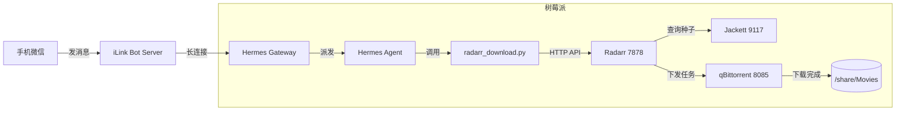

上一篇文章搭好了树莓派上的自动下载站：Radarr + Jackett + qBittorrent + Bazarr + ChineseSubFinder。它能自动搜索、下载、整理、刮削字幕，但触发动作仍然依赖打开 Radarr WebUI。

这篇文章解决一个更懒的问题：**能不能在微信里直接说“下载玩具总动员”，Radarr 就自动开始干活？**

答案是能。核心工具是 **Hermes Agent**：一个开源 AI Agent 框架，原生支持个人微信接入，能调用外部工具/API。把它和 Radarr 的 REST API 接起来，就能实现“一句话下载”。

1. Table of Contents, ordered
{:toc}

## 1. 目标效果

最终体验：

```text
你（微信）：下载 玩具总动员 4K

Hermes（微信）：已找到 Toy Story (1995)，已添加到 Radarr 并开始搜索 Ultra-HD 版本。
```

几分钟后，树莓派上的 qBittorrent 开始下载，Radarr 自动整理，Bazarr 自动下载字幕。

## 2. 总体架构



关键点：

- Hermes Agent 部署在树莓派上，作为**客户端**主动连接微信/iLink 服务器；
- 因此**不需要公网 IP**，不需要路由器开端口，人在外面也能用微信控制；
- Hermes 理解自然语言后，调用一个 Python 脚本，脚本再调用 Radarr API；
- 调用 LLM 走云端 API（Kimi / DeepSeek / Claude），不在本地跑大模型。

## 3. 为什么选 Hermes Agent

市面上能实现“消息触发 Radarr”的方案不少，但 Hermes 有几个独特优势：

| 能力 | 说明 |
|------|------|
| 原生个人微信接入 | v0.8.0+ 支持腾讯 iLink Bot API，扫码登录即可 |
| 长连接模式 | 作为客户端连出，无需公网 IP 和反向代理 |
| LLM 推理 | 支持 Kimi / DeepSeek / Claude / OpenRouter 等 |
| 工具/Skill 扩展 | 可把 Radarr API 调用封装成可复用 Skill |
| 自托管 | 数据留在树莓派，不依赖第三方云服务 |

如果只是想要一个简单的 webhook 触发器，用 n8n 或几十行 Python 也能做。但 Hermes 额外提供了自然语言理解、记忆、多轮对话能力，例如你可以说：

```text
下载那个皮克斯的玩具总动员，要 4K，不要枪版
```

它能理解“皮克斯”“4K”“不要枪版”这些语义，而不需要你记固定的命令格式。

## 4. 前置条件

- 树莓派已部署 Radarr、Jackett、qBittorrent，且 API 可用；
- 树莓派有 Docker 和 Docker Compose；
- 有一个 LLM API Key（本文以 Kimi 为例）；
- 一个个人微信号；
- 知道 Radarr 的 `qualityProfileId` 和 `rootFolderPath`。

确认 Radarr API 正常：

```bash
curl -H 'X-Api-Key: 你的API_KEY' \
  http://192.168.1.7:7878/api/v3/system/status
```

## 5. 部署 Hermes Agent

### 5.1 目录与 Compose

```bash
mkdir -p /home/pi/docker/hermes
cd /home/pi/docker/hermes
```

`docker-compose.yml`：

```yaml
services:
  hermes-agent:
    image: hermes-agent:latest  # 需确认有 ARM64 镜像，或用官方指定 tag
    container_name: hermes-agent
    environment:
      - TZ=Asia/Shanghai
      - PUID=1000
      - PGID=100
      # LLM 配置：以 Kimi 为例
      - HERMES_LLM_PROVIDER=kimi
      - HERMES_LLM_API_KEY=${KIMI_API_KEY}
      - HERMES_LLM_MODEL=moonshot-v1-8k
    volumes:
      - /home/pi/docker/hermes/config:/config
      - /home/pi/docker/hermes/skills:/skills
      - /var/run/docker.sock:/var/run/docker.sock:ro
    restart: unless-stopped
```

> 注意：Hermes Agent 镜像和具体环境变量名可能随版本变化，部署前请查看对应版本的官方文档。

### 5.2 启动

```bash
export KIMI_API_KEY=你的_KEY
docker compose up -d
docker logs -f hermes-agent
```

启动后，Hermes 应该处于待命状态。

## 6. 接入个人微信

Hermes v0.8.0+ 支持通过微信 iLink Bot API 接入个人微信号。

```bash
docker exec -it hermes-agent bash
hermes gateway setup
```

按提示选择 `WeChat / Weixin`，终端会显示二维码链接，在浏览器打开并扫码登录。

登录成功后启动 Gateway：

```bash
hermes gateway run
```

测试：在微信里给自己发“你好”，如果收到 Hermes 的回复，说明通道已打通。

### 关于公网访问的说明

- **微信聊天**：走的是长连接，Hermes 主动连出，**不需要公网 IP**；
- **Hermes Web UI**（如果有）：默认是局域网服务，出门在外访问需要内网穿透（ngrok/cpolar/ZeroNews）。

## 7. Radarr API 调用逻辑

实现“下载”功能，需要调用 Radarr 三个接口：

### 7.1 搜索电影

```bash
GET /api/v3/movie/lookup?term=玩具总动员
```

返回最匹配的 TMDB 电影列表。

### 7.2 添加电影

```bash
POST /api/v3/movie
```

请求体：

```json
{
  "title": "Toy Story",
  "tmdbId": 862,
  "year": 1995,
  "rootFolderPath": "/movies",
  "qualityProfileId": 1,
  "minimumAvailability": "released",
  "monitored": true,
  "addOptions": {
    "searchForMovie": true
  }
}
```

### 7.3 触发搜索（可选）

如果 `addOptions.searchForMovie` 没生效，可以显式触发：

```bash
POST /api/v3/command
```

```json
{
  "name": "MoviesSearch",
  "movieIds": [123]
}
```

## 8. 最小可运行脚本

在 Hermes 的 skills 目录下创建 `radarr_download.py`：

```python
#!/usr/bin/env python3
import os
import sys
import requests

RADARR_URL = os.environ.get("RADARR_URL", "http://192.168.1.7:7878")
API_KEY = os.environ["RADARR_API_KEY"]
ROOT_FOLDER = os.environ.get("RADARR_ROOT_FOLDER", "/movies")
QUALITY_PROFILE_ID = int(os.environ.get("RADARR_QUALITY_PROFILE_ID", "1"))
MIN_AVAILABILITY = os.environ.get("RADARR_MINIMUM_AVAILABILITY", "released")

headers = {
    "X-Api-Key": API_KEY,
    "Content-Type": "application/json"
}


def lookup(name):
    r = requests.get(
        f"{RADARR_URL}/api/v3/movie/lookup",
        headers=headers,
        params={"term": name}
    )
    r.raise_for_status()
    return r.json()


def add_movie(movie):
    payload = {
        "title": movie["title"],
        "tmdbId": movie["tmdbId"],
        "year": movie["year"],
        "rootFolderPath": ROOT_FOLDER,
        "qualityProfileId": QUALITY_PROFILE_ID,
        "minimumAvailability": MIN_AVAILABILITY,
        "monitored": True,
        "addOptions": {"searchForMovie": True}
    }
    r = requests.post(f"{RADARR_URL}/api/v3/movie", headers=headers, json=payload)
    r.raise_for_status()
    return r.json()


if __name__ == "__main__":
    query = " ".join(sys.argv[1:])
    results = lookup(query)
    if not results:
        print("未找到相关电影")
        sys.exit(1)

    movie = results[0]
    add_movie(movie)
    print(f"已添加 {movie['title']} ({movie['year']})，并开始搜索")
```

给脚本配置好环境变量后，本地测试：

```bash
export RADARR_API_KEY=你的_KEY
python3 radarr_download.py 玩具总动员
```

## 9. 让 Hermes 理解“下载”指令

在 Hermes 的系统提示词或 Skill 描述里加入类似内容：

```text
当用户消息以“下载”开头时：
1. 提取电影名称和可选画质要求（如 4K、Remux、1080p）；
2. 调用 radarr_download.py，传入电影名；
3. 将脚本输出整理成自然语言回复给用户。

示例：
用户：下载 玩具总动员 4K
你的回复：已找到 Toy Story (1995)，已添加到 Radarr 并开始搜索 Ultra-HD 版本。
```

Hermes 会把 `radarr_download.py` 当作一个工具调用。实际部署时，根据 Hermes 的 Skill 格式封装即可。

## 10. 踩坑点

| 现象 | 原因 | 解决 |
|------|------|------|
| 微信扫码后无响应 | 微信版本过低或网络问题 | 更新手机微信到最新版 |
| 离开家无法管理 Hermes Web UI | Web UI 是局域网服务 | 微信聊天不需要公网 IP；Web UI 需要内网穿透 |
| Radarr 返回 401 | API Key 错误 | 检查 `X-Api-Key` 和环境变量 |
| 下到 1080p 而不是 4K | Quality Profile / Cutoff 配置问题 | 确认 profile 为 Ultra-HD，Upgrade Until 为 Remux-2160p |
| 搜到错误电影 | 中文片名歧义 | 返回候选列表让用户确认，或要求提供年份 |
| 别人也能控制下载 | 没有用户白名单 | 在 Skill 中校验微信发送者 ID |
| Hermes 回复慢 | LLM API 超时 | 换更稳定的模型或增加重试 |

## 11. 后续可优化

- **多轮选择**：当片名歧义时，Hermes 返回候选列表，用户回复数字即可选择；
- **安全白名单**：只允许特定微信 ID 控制 Radarr；
- **状态查询**：支持“查看下载进度”“今天下载了什么”；
- **多平台接入**：除了微信，还可以接入企业微信、飞书、Telegram；
- **自动升级策略**：结合 Custom Formats，让 Hermes 了解你偏好的发布组。

## 12. 总结

把 Hermes Agent 接到 Radarr 上，本质上是把**自然语言入口**和**已有的自动化下载pipeline**串联起来。Hermes 负责理解微信消息，Radarr 负责执行下载。整个过程不需要公网 IP，数据也留在树莓派本地。

如果你已经跑通了之前的 Radarr + Jackett + qBittorrent 下载站，那么加上 Hermes 和微信这一步，大概只需要再花一两个小时。
