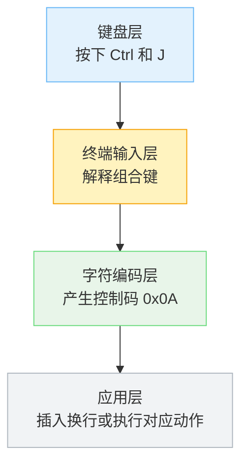
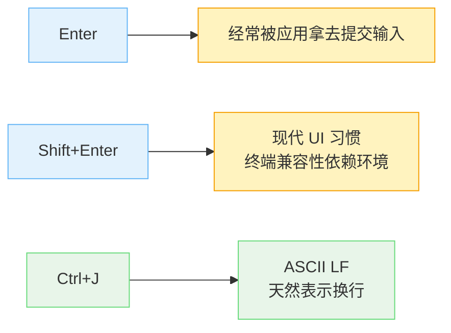

1. Table of Contents, ordered
{:toc}

在很多 CLI 工具里，`Enter` 用来发送消息，想在输入框里插入一行，就要按 `Ctrl+J`。如果长期习惯了图形界面里的 `Shift+Enter`，这个设计第一眼会非常反直觉：为什么偏偏是 `J`？它和换行有什么关系？

答案不在这些现代工具本身，而在更老的终端传统里。`Ctrl+J` 的核心含义来自 ASCII 控制字符：`J` 经过 `Ctrl` 组合后会映射到 `0x0A`，而 `0x0A` 正是 `LF`，也就是 Unix 世界里的换行符 `\n`。

这不是“J 表示 jump to next line”这种语义联想，而是一套编码规则的结果。

## 先区分三层东西

讨论 `Ctrl+J` 时，很容易把“键盘按键”“终端输入”和“字符编码”混在一起。它们确实相关，但不是同一层。



`Ctrl` 本身不是一个 ASCII 字符。ASCII 码表里没有“Ctrl 键”的表示。ASCII 定义的是字符码，包括可见字符，也包括不可见的控制字符。

终端输入层做的事情是：当你按下 `Ctrl` 加某些键时，它不再发送普通字母，而是发送对应的控制字符。

## ASCII 里有什么

ASCII 前 32 个码位，也就是 `0x00` 到 `0x1F`，是控制字符。它们不是拿来显示成字母的，而是拿来表达控制动作或传输语义的。

常见几个是：

| 控制码 | 名称 | 常见含义 |
|---|---|---|
| `0x03` | `ETX` | `Ctrl+C`，后来常被终端用作中断 |
| `0x04` | `EOT` | `Ctrl+D`，Unix shell 里常表示 EOF |
| `0x08` | `BS` | Backspace |
| `0x09` | `HT` | Tab，也就是 `\t` |
| `0x0A` | `LF` | Line Feed，也就是 `\n` |
| `0x0D` | `CR` | Carriage Return，也就是 `\r` |
| `0x1B` | `ESC` | Escape |

另一方面，ASCII 里的大写字母排得很整齐：

| 字符 | 十六进制 | 二进制 |
|---|---:|---|
| `A` | `0x41` | `0100 0001` |
| `B` | `0x42` | `0100 0010` |
| `C` | `0x43` | `0100 0011` |
| `D` | `0x44` | `0100 0100` |
| `J` | `0x4A` | `0100 1010` |
| `M` | `0x4D` | `0100 1101` |

关键点在这里：这些字母编码的低 5 位，刚好可以表示 `1` 到 `26`。

## `Ctrl+字母` 怎么变成控制字符

传统终端里，`Ctrl+字母` 的映射可以用一个简单公式理解：

```c
control_code = uppercase_letter & 0x1F;
```

这里的 `&` 是**按位与**，`0x1F` 是一个 bitmask：

```text
0x1F = 0001 1111
```

它的作用是保留低 5 位，把更高位清零。

拿 `A` 来看：

```text
'A'  = 0x41 = 0100 0001
0x1F =        0001 1111
-----------------------
&            0000 0001 = 0x01
```

所以：

```text
Ctrl+A -> 0x01
```

再看 `J`：

```text
'J'  = 0x4A = 0100 1010
0x1F =        0001 1111
-----------------------
&            0000 1010 = 0x0A
```

于是：

```text
Ctrl+J -> 0x0A -> LF -> \n
```

这就是 `Ctrl+J` 和换行之间真正的关系。

## `Ctrl+字母` 对照表

按照这个规则，`Ctrl+A` 到 `Ctrl+Z` 会落到 ASCII 的 `0x01` 到 `0x1A`。这些控制码在 ASCII 里本来各自有名字，后来终端、shell、编辑器又在这些控制码上叠加了很多约定俗成的行为。

| 快捷键 | 控制码 | ASCII 名称 | 常见终端/编辑器语义 |
|---|---:|---|---|
| `Ctrl+A` | `0x01` | `SOH` | 行首；readline/emacs 风格里移动到行首 |
| `Ctrl+B` | `0x02` | `STX` | 光标左移一个字符；backward |
| `Ctrl+C` | `0x03` | `ETX` | 中断当前进程，发送 `SIGINT` |
| `Ctrl+D` | `0x04` | `EOT` | EOF；shell 空行时退出，输入中删除后一个字符 |
| `Ctrl+E` | `0x05` | `ENQ` | 行尾；readline/emacs 风格里移动到行尾 |
| `Ctrl+F` | `0x06` | `ACK` | 光标右移一个字符；forward |
| `Ctrl+G` | `0x07` | `BEL` | 响铃/取消；有些工具用来退出当前小模式 |
| `Ctrl+H` | `0x08` | `BS` | Backspace |
| `Ctrl+I` | `0x09` | `HT` | Tab，也就是 `\t` |
| `Ctrl+J` | `0x0A` | `LF` | Line Feed，也就是 `\n` |
| `Ctrl+K` | `0x0B` | `VT` | 删除到行尾；kill line |
| `Ctrl+L` | `0x0C` | `FF` | 清屏；form feed |
| `Ctrl+M` | `0x0D` | `CR` | Carriage Return，也就是 `\r`；很多场景等价于 Enter |
| `Ctrl+N` | `0x0E` | `SO` | 下一行/下一条历史；next |
| `Ctrl+O` | `0x0F` | `SI` | 执行并取下一条历史；部分工具绑定为打开/复制等动作 |
| `Ctrl+P` | `0x10` | `DLE` | 上一行/上一条历史；previous |
| `Ctrl+Q` | `0x11` | `DC1` | 恢复终端输出；XON |
| `Ctrl+R` | `0x12` | `DC2` | 反向搜索历史；reverse search |
| `Ctrl+S` | `0x13` | `DC3` | 暂停终端输出；XOFF |
| `Ctrl+T` | `0x14` | `DC4` | 交换相邻字符；transpose chars |
| `Ctrl+U` | `0x15` | `NAK` | 删除到行首；kill before cursor |
| `Ctrl+V` | `0x16` | `SYN` | 字面量输入下一个字符；quoted insert |
| `Ctrl+W` | `0x17` | `ETB` | 删除前一个单词 |
| `Ctrl+X` | `0x18` | `CAN` | 复合快捷键前缀；emacs/readline 里常作为前缀 |
| `Ctrl+Y` | `0x19` | `EM` | 粘回刚删除的文本；yank |
| `Ctrl+Z` | `0x1A` | `SUB` | 挂起当前前台进程，发送 `SIGTSTP` |

这张表里要分清两件事：**控制码名称**来自 ASCII，**常见语义**来自终端、shell、readline、编辑器或具体应用的约定。比如 `Ctrl+C` 在 ASCII 里叫 `ETX`，但在 Unix 终端里常被驱动解释成“中断当前前台进程”；`Ctrl+J` 在 ASCII 里叫 `LF`，所以它天然适合表示换行。

还有几个常见组合不是 `Ctrl+字母`，但也沿用同一套控制字符传统：

| 快捷键 | 控制码 | ASCII 名称 | 常见含义 |
|---|---:|---|---|
| `Ctrl+[` | `0x1B` | `ESC` | Escape |
| `Ctrl+\\` | `0x1C` | `FS` | 终端里常发送 `SIGQUIT` |
| `Ctrl+]` | `0x1D` | `GS` | telnet 等老工具里常用作 escape |
| `Ctrl+^` | `0x1E` | `RS` | 较少直接使用 |
| `Ctrl+_` | `0x1F` | `US` | undo；readline 里常见 |

## `0x1F` 不是 Ctrl

这里最容易误解的一点是：`0x1F` 不是 `Ctrl` 本身。

`Ctrl` 是键盘上的修饰键；`0x1F` 是解释 `Ctrl+字母` 传统映射时常用的位掩码。实际按键事件里不会单独发出一个叫“Ctrl”的 ASCII 字节。

更准确的关系是：

```text
普通按 A：终端收到 0x41
按 Ctrl+A：终端收到 0x01
```

`0x01` 可以用 `0x41 & 0x1F` 算出来，但这只是映射规则，不是说 `Ctrl` 键等于 `0x1F`。

有趣的是，小写字母也能用同样方式解释：

```text
'a'  = 0x61 = 0110 0001
0x1F =        0001 1111
-----------------------
&            0000 0001 = 0x01
```

所以在终端控制字符层面，`Ctrl+A` 和 `Ctrl+a` 通常是同一个东西。

## 为什么不是 `Shift+Enter`

从现代应用的角度看，`Shift+Enter` 插入换行、`Enter` 发送消息，确实更符合聊天软件习惯。但终端不是从聊天软件长出来的。

老终端协议更擅长传递字符和控制码，而不是完整的“键盘事件对象”。很多组合键在不同终端、操作系统、终端模拟器里并不总能稳定区分。`Shift+Enter` 这种现代 UI 习惯，在终端里就比 `Ctrl+J` 更依赖具体环境支持。

而 `Ctrl+J` 的优势是：它本来就是 `LF`，也就是换行控制字符。



所以在 CLI 输入框里，当 `Enter` 被产品拿去做“提交”时，`Ctrl+J` 就成了一个非常自然、兼容性也更好的“插入换行”候选。

## `Ctrl+M` 又是什么

如果 `Ctrl+J` 是 `LF`，那 `Ctrl+M` 是什么？

同样按公式算：

```text
'M'  = 0x4D = 0100 1101
0x1F =        0001 1111
-----------------------
&            0000 1101 = 0x0D
```

`0x0D` 是 `CR`，也就是 Carriage Return，写作 `\r`。

历史上，`LF` 和 `CR` 来自打字机/电传机时代的两个不同动作：

| 控制字符 | 动作直觉 |
|---|---|
| `LF` | 纸往下一行走 |
| `CR` | 打字头回到行首 |

后来不同系统对“文本换行”的编码选择不同：

| 系统传统 | 换行表示 |
|---|---|
| Unix / Linux / macOS 现代文本 | `LF`，也就是 `\n` |
| 老 Mac OS | `CR`，也就是 `\r` |
| Windows 文本 | `CRLF`，也就是 `\r\n` |

这也是为什么 `Ctrl+J` 和 `Ctrl+M` 都常常和“回车/换行”挨得很近，但它们在 ASCII 控制字符里并不是同一个码。

## 回到 CLI 工具里的换行

现代 CLI 工具通常有两种需求：

1. 用户需要快速发送当前 prompt。
2. 用户也需要在 prompt 里写多行内容。

如果 `Enter` 用来发送，那“插入换行”就必须找另一个按键。图形界面常用 `Shift+Enter`；终端工具保留 `Ctrl+J` 则是因为它从字符编码层就对应 `LF`。

所以可以把这些快捷键记成：

| 快捷键 | 底层直觉 | 常见用途 |
|---|---|---|
| `Enter` | 应用定义，终端里常接近 `CR` | 提交输入、确认 |
| `Ctrl+J` | `LF` / `\n` | 插入换行 |
| `Ctrl+M` | `CR` / `\r` | 回车语义，很多场景等价于 Enter |
| `Ctrl+[` | `ESC` | Escape |

真正值得记住的不是“某个产品规定 `Ctrl+J` 是换行”，而是：

```text
Ctrl+J -> ASCII 0x0A -> LF -> \n
```

这样看，`Ctrl+J` 仍然不一定顺手，但它不是随便来的。它是 ASCII 控制字符、终端输入规则和 CLI 应用交互设计叠在一起之后留下的结果。
