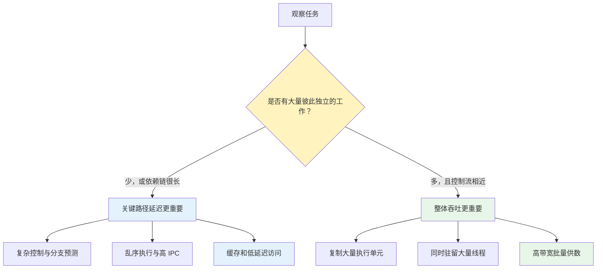

CPU 和 GPU 都执行指令，也都需要从存储系统取得数据，但它们最后长成了截然不同的样子：CPU 核心数量相对少，每个核心却非常复杂；GPU 拥有大量执行单元，单个线程的控制能力却没有 CPU 那么强。

这种差异不是谁比谁“先进”，而是两类处理器面对的任务不同。**CPU 更关心一条关键任务能多快完成，GPU 更关心单位时间能完成多少份相似任务。**前者优先降低延迟，后者优先扩大吞吐。

任务形态继续向下影响存储系统。CPU 希望一次依赖访问尽快返回，因此不断建设缓存和低延迟内存层级；GPU 会让大量线程同时工作，需要单位时间搬运海量数据，因此更强调显存带宽。

本文整理自 Redknot-乔红的[《内存和显存的区别》视频](https://www.youtube.com/watch?v=xenDvvSGfwA)，也可以在作者的[B 站同名视频](https://www.bilibili.com/video/BV1SGXsYxESV/)中观看。本文重点沿着“任务 → 架构 → 内存”的因果链展开，DDR、PAM3/PAM4 等电路细节放在后面作为补充。

本系列共两篇：

1. **CPU、GPU 与 DDR/GDDR 的架构取舍（本文）**
2. [HBM 的硅中介层、TSV 与 3D 堆叠]()

1. Table of Contents, ordered
{:toc}

# 两个不同的目标：延迟与吞吐

理解 CPU 和 GPU，首先要区分两个经常混在一起的指标。

**延迟（latency）**是完成一项工作需要多长时间。例如一次数据库事务从请求到响应耗时 5ms，描述的是延迟。

**吞吐量（throughput）**是单位时间能完成多少项工作。例如一秒处理 10 万张图片，描述的是吞吐量。

一辆高速汽车可以让一位乘客更快到达，优化的是单项延迟；一支车队同时运输，即使每辆车并不更快，也能在一小时内运走更多货物，优化的是整体吞吐。

在晶体管数量、芯片面积、功耗和散热都有限的情况下，这两个方向会争夺资源：

- 把资源用于复杂控制、预测和大执行窗口，可以让一个线程跑得更快；
- 把资源用于复制执行单元和线程状态，可以让更多任务同时推进。

CPU 和 GPU 的设计差异，就是对这笔资源预算做出了不同分配。

# 任务形态决定处理器形态

真正决定 CPU 或 GPU 是否合适的，不是任务名字，而是任务内部的**依赖关系、可并行度、控制流和数据访问模式**。

## CPU 面对的任务：依赖强、分支多、变化大

操作系统调度、数据库事务、程序编译、游戏主逻辑、脚本执行和网络协议处理，通常包含这些特征：

- 下一步需要等待上一步结果；
- 条件分支频繁，执行路径难以提前批量确定；
- 数据结构复杂，内存地址不连续；
- 单次工作规模不一定大，但响应时间很重要；
- 同一核心会快速切换不同类型的代码。

例如链表或树结构遍历。读取当前节点后，程序才能知道下一个节点的地址：

$$
\text{address}_{n+1} = f(\text{data at address}_n)
$$

后一次访问依赖前一次返回的数据，无法预先把全部地址交给几千个线程同时读取。每一步的计算和访存延迟都会落到关键路径上。

这对应“一个人耽误一分钟，45 个人就耽误 45 分钟”的第一种读法：如果这里不是 45 个人同时等待，而是**前后依赖的 45 个步骤**，后一步必须等前一步完成，那么每一步的一分钟都会落在关键路径上：

$$
45\ \text{steps} \times 1\ \text{minute per step}
= 45\ \text{minutes}
$$

这正是 CPU 害怕的情况。一次缓存未命中、一处分支预测失败或一次数据依赖造成的等待，如果出现在串行关键路径上，就会与前后的等待累加。

这类任务需要一个核心快速处理复杂控制流，并尽量缩短每一步等待。CPU 因此愿意为单个核心投入更多晶体管。

## GPU 面对的任务：数量大、彼此独立、规则相似

图像像素处理、顶点变换、矩阵乘法、粒子模拟和神经网络张量计算通常具有另一种形态：

- 同一个操作要应用到大量数据元素；
- 元素之间相互独立，或只在少数阶段同步；
- 控制流相对一致；
- 数据可以连续、批量地读取；
- 单个结果的延迟未必最重要，整体完成速度更重要。

以图片提亮为例。每个像素都可以独立读取、计算并写回，一个像素不必等待相邻像素的结果。只要准备足够多的执行线程，大量像素就能同时处理。

同一句“一个人耽误一分钟，45 个人就耽误 45 分钟”，放到并行场景里是另一种结果：45 个人同时等待同一分钟，合计损失确实是 45 **人分钟**，但墙上时钟只经过了 1 分钟，而不是 45 分钟。

GPU 利用的就是这种重叠。许多独立线程同时发起工作或等待数据，单个线程的延迟仍然存在，但这些延迟不必在总完成时间里逐项相加。

### 为什么机器学习正好适合 GPU

GPU 最初因图形渲染发展起来，而今天的热度很大程度上来自机器学习和生成式 AI。两者能够结合，不只是因为“GPU 核心多”，而是机器学习的主要计算恰好能拆成大量规则的矩阵和张量运算。

以神经网络中的线性层为例：

$$
Y = XW + b
$$

如果 $$X$$ 的形状是 $$B \times D$$，$$W$$ 的形状是 $$D \times H$$，输出 $$Y$$ 就有 $$B \times H$$ 个位置。每个输出位置都是一个长度为 $$D$$ 的点积：

$$
Y_{ij} = \sum_{k=1}^{D} X_{ik}W_{kj} + b_j
$$

这里天然存在几层并行性：

- batch 中不同样本可以同时处理；
- 输出矩阵中不同的 $$Y_{ij}$$ 可以同时计算；
- 每个点积内部的大量乘加可以分块并行，再做归约；
- 不同 attention head、卷积输出通道和空间位置也能批量展开。

[NVIDIA 的矩阵乘法性能说明](https://docs.nvidia.com/deeplearning/performance/dl-performance-matrix-multiplication/index.html)也把全连接层、卷积层和循环网络中的主要运算归结为 GEMM，并说明 GPU 会把输出矩阵切成大量 tile，交给不同 thread block 并行计算。Tensor Core 则进一步把硬件直接优化为小矩阵乘加单元。

机器学习并非“前后完全没有依赖”。后一层必须等待前一层输出，反向传播要按计算图反向推进，自回归语言模型的下一个 token 也依赖上一个 token。真正适合 GPU 的是：**每一个有顺序依赖的阶段内部，通常又包含规模巨大的矩阵计算和 batch/data parallelism。**

因此 GPU 加速的不是“整段算法一次完成”，而是把每个阶段内部的海量乘加、归约和数据搬运并行化。模型越大、batch 越充分、矩阵形状越适合分块，GPU 的并行资源越容易被填满。

这类任务继续增强一个复杂核心，收益往往不如复制更多执行资源。GPU 因此把更多芯片面积用于并行算术单元、寄存器和线程调度。

## 关键不在“什么运算”，而在依赖图

视频使用“从 1 累加到 100”说明串行依赖。这个例子适合建立直觉，但严格来说，求和可以重写成树形并行归约。

真正限制并行的是依赖图中是否存在无法拆开的长链。相同的加法既可以串行，也可以并行；相同的矩阵计算如果尺寸太小，也未必值得交给 GPU。

判断任务更适合哪类处理器，可以沿着下面的路径思考：

# CPU 如何缩短关键路径

把 CPU 的发展方向概括成“卷频率”并不完整。频率只表示一秒有多少个时钟周期，CPU 真正追求的是：**让一个通用线程用更少时间走完关键路径。**

## 强核心把资源花在哪里

现代 CPU 核心通常包含：

- **分支预测**：提前猜测接下来执行哪条路径，避免流水线等待判断结果；
- **推测执行**：在预测结果尚未确认时提前开展工作；
- **乱序执行**：某条指令等待数据时，先执行其他没有依赖的指令；
- **宽发射与多执行端口**：一个周期推进更多指令，提高 IPC；
- **大执行窗口和寄存器重命名**：从更长指令流中寻找可并行工作；
- **L1/L2/L3 缓存**：尽量不让依赖访问落到片外 DRAM。

这些结构占用大量面积和功耗，却不直接增加“核心数量”。它们的价值是减少单线程中的空泡，让复杂、不可预测的程序更快得到下一步结果。

CPU 会用 L1/L2/L3 缓存尽量避免访问片外 DRAM。这里需要抓住一点：当一次缓存未命中落到 DRAM，后续依赖指令可能整体停住，因此 CPU 对访问延迟非常敏感。

## CPU 也在增加并行度

CPU 并非只做串行任务。现代 CPU 同样增加核心、使用 SIMD 向量指令、同时运行多个线程，也会追求内存带宽。

区别在于它不能为了堆数量而完全放弃强单核和复杂控制能力。桌面、服务器和操作系统中的通用代码仍包含大量分支、依赖和不规则访问。

所以 CPU 更准确的发展方向是：

> 在保持通用性和低延迟能力的同时，逐步增加多核与向量并行。

# GPU 如何扩大并行吞吐

GPU 把更多资源用于大量执行单元，让成百上千个线程同时处于运行或等待状态。

以 CUDA 的 SIMT 模型为例，线程会组成 warp，同一个 warp 中的线程执行共同指令。控制流一致时，一条指令可以推动多份数据；如果线程走向不同分支，就要分批执行各条路径，部分执行通道暂时闲置，这就是 branch divergence。

[CUDA Programming Guide 对 warp 与 SIMT 的说明](https://docs.nvidia.com/cuda/cuda-programming-guide/01-introduction/programming-model.html)体现了 GPU 的基本取舍：任务越规则、可并行元素越多，执行资源越容易被填满。

## GPU 用并发隐藏延迟

“GPU 不在乎显存延迟”是一种过度简化。显存访问仍可能需要很长时间，GPU 的优势是有机会**隐藏延迟**。

当一个 warp 等待显存数据时，调度器可以执行另一个已经就绪的 warp。只要同时驻留的线程足够多、算法能暴露足够并行度，计算单元就不必跟着某一次访存一起等待。

这个策略需要满足两个条件：

1. 有足够多互不依赖的工作可以切换；
2. 显存系统能提供足够高的总带宽，为所有活跃线程供数。

如果任务太小、分支发散严重、寄存器占用过高，或者访问完全随机，GPU 就没有足够的其他工作覆盖等待，高理论吞吐也无法兑现。

## GPU 为什么更愿意堆规模

对高度并行任务来说，增加执行单元通常比继续强化单个线程更划算。GPU 因此倾向于：

- 增加并行执行资源；
- 提高矩阵、向量和纹理处理吞吐；
- 保留大量线程上下文；
- 用调度器在不同 warp 之间切换；
- 提高显存带宽，让执行单元不因缺数据而空闲。

GPU 频率当然重要，但在这类工作负载下，增加可并行规模和数据供给通常比单纯提高频率更直接。

# 带宽是怎么计算的

CPU 和 GPU 的任务差异最终会传导到内存接口。理解这种分化，必须先把带宽公式写清楚。

## 峰值理论带宽

如果规格表已经给出**每个数据引脚的有效数据率**，理论带宽可以写成：

$$
\text{Bandwidth (GB/s)}
=
\frac{
\text{Per-pin data rate (Gb/s)}
\times
\text{Data bus width (bit)}
}{8}
$$

除以 8 是把 bit 换成 byte。这个公式里有两个直接乘数：

- **每针脚有效数据率**：一根数据线每秒传递多少 bit；
- **数据总线位宽**：同一时刻有多少根数据线并行工作。

系统存在多个独立内存通道时，也可以先算单通道带宽，再乘以通道数量。更一般地说，带宽取决于：

$$
\text{Bandwidth (B/s)}
=
\frac{
\text{Symbol Rate}
\times
\text{Bits per Symbol}
\times
\text{Data Pins}
}{8}
$$

其中 PAM3/PAM4 影响的是每个符号承载的信息量，DDR 边沿传输和预取等机制共同影响最终公布的有效数据率。

## CPU 内存带宽示例

以 `DDR5-6400` 为例，`6400` 表示 6400 MT/s 的有效传输率。按总计 64-bit 数据宽度计算，单通道理论带宽是：

$$
6400 \times 10^6 \times 64 \div 8
=
51.2\ \text{GB/s}
$$

双通道系统理论上可以达到：

$$
51.2 \times 2 = 102.4\ \text{GB/s}
$$

DDR5 DIMM 内部会把 64-bit 数据宽度组织为两个独立 32-bit 子通道，但整条 DIMM 的聚合数据宽度仍可按 64 bit 建立这个带宽直觉。ECC、控制信号和协议开销不计入数据位宽。

## GPU 显存带宽示例

假设某个 GPU 的显存每针脚有效数据率是 20 Gb/s，总位宽是 384 bit：

$$
20 \times 384 \div 8
=
960\ \text{GB/s}
$$

可以看到，GPU 不只提高每根线的速率，还会使用数百 bit 的宽接口。大量线程同时读写数据时，这种高总带宽可以让执行单元持续工作。

## 理论带宽不等于有效带宽

[NVIDIA CUDA Best Practices Guide](https://docs.nvidia.com/cuda/cuda-c-best-practices-guide/index.html?highlight=local+memory)同样使用时钟、DDR 倍率和接口位宽计算峰值理论带宽，并区分应用真正得到的 effective bandwidth。

实际带宽还会受这些因素影响：

- 访问是否连续、对齐并能够合并；
- 控制器是否能让多个 Bank 和通道保持忙碌；
- 读写切换、刷新、协议与纠错开销；
- 缓存命中率和预取效果；
- 并发请求是否足够填满总线。

因此，960 GB/s 的规格不表示任何程序都能搬到 960 GB/s。它只是物理接口的峰值上限。

## 带宽公式如何映射到两类处理器

前文已经从任务形态得到两个目标：CPU 优先缩短关键路径，GPU 优先扩大并行吞吐。映射到内存系统，不需要再重新介绍一遍任务，只需要看两类处理器如何使用带宽公式中的乘数。

| 内存设计问题 | CPU + DDR 的典型取向 | GPU + GDDR/HBM 的典型取向 |
| --- | --- | --- |
| 首要约束 | 依赖访问延迟、容量、成本和通用性 | 大量并发请求形成的聚合带宽 |
| 避免等待 | 多级缓存、预取、乱序执行 | 大量 warp 切换、合并访问 |
| 扩展带宽 | 增加内存通道和有效数据率 | 同时提高每针脚速率与总线位宽 |
| 物理实现 | 模块化 DIMM，强调容量和可扩展性 | 宽 GDDR 接口或封装内 HBM |

CPU 并不是不需要带宽，多核扫描和科学计算同样可能受带宽限制；GPU 也不是不在乎延迟，并行度不足时延迟会直接暴露。这里表达的是相对优先级：CPU 更常用缓存避免高延迟访问，GPU 更愿意为更宽接口和更高聚合带宽投入封装资源。

这就是 DDR 与 GDDR 分化背后的根本原因。两者都以 DRAM 为基础，但它们把接口资源花在了不同方向。

# 补充：DDR、PAM4 与 PAM3 如何提高数据率

这部分解释每针脚数据率从哪里来，但它不是 CPU/GPU 分化的主线。

## DDR 在两个边沿传输

`DDR` 是 Double Data Rate，即在时钟或数据选通信号的上升沿和下降沿都传输数据。于是 1600 MHz 的 I/O 时钟可以对应 3200 MT/s 的有效传输率。

这里要区分两个单位：

- `MHz` 表示每秒多少个时钟周期；
- `MT/s` 表示每秒多少次数据传输。

商品参数经常把有效传输率口语化地称为“频率”，因此容易把真实时钟和 MT/s 混为一谈。

GDDR 的提高也不只是“把时钟复制多份”。预取、通道组织、时钟方案和高速 I/O 电路都会共同影响每针脚有效数据率。

## PAM4：一个符号携带 2 bit

传统二电平信号使用高低两个状态，一个符号表达 1 bit，也叫 PAM2/NRZ。

GDDR6X 使用 PAM4，把信号划分为四个电平，一个符号可以表达 2 bit。根据 [Micron 的 GDDR6X 技术说明](https://www.micron.com/content/dam/micron/global/public/products/technical-marketing-brief/gddr6x-pam4-2x-speed-tech-brief.pdf)，在相同符号率下，PAM4 可以把有效数据率翻倍。

代价是四个电平之间的间隔更小，接收端更难可靠区分信号，对噪声、校准、功耗和电路精度提出更高要求。

## PAM3：重新平衡信息密度与裕量

GDDR7 使用三个电平的 PAM3，通常用两个符号编码 3 bit，平均每个符号承载 1.5 bit。[Micron 的 GDDR7 产品说明](https://www.micron.com/products/memory/graphics-memory/gddr7)将 PAM3 列为这一代的重要变化。

从 PAM2 到 PAM4，再到 PAM3，不是在一条“数字越大越先进”的轴上前进，而是在数据率、信号裕量、功耗和实现难度之间重新选择平衡点。

# 两类架构正在靠近，但目标仍然不同

CPU 与 GPU 的边界不是静止的：

- CPU 增加核心数、SIMD 宽度和专用矩阵单元；
- GPU 增加缓存、改进分支与线程调度，也在强化单线程能力；
- 集成 GPU 和统一内存让两类处理器共享部分物理资源；
- 异构计算让一个程序把不同阶段分配给最合适的处理器。

但底层判断仍然有效：**依赖强、控制复杂、响应敏感的关键路径，更需要 CPU 式低延迟优化；独立工作多、控制规则、数据规模大的阶段，更适合 GPU 式吞吐优化。**

这也解释了为什么比较 CPU 与 GPU 不能只看频率和“核心数”。两者所称的核心并不是同一种资源单位，频率也没有包含每周期工作量、并行宽度和等待时间。

DDR 与 GDDR 的分化只是任务差异在内存侧的投影。继续沿着 GPU 的高带宽需求往下走，还会遇到传统 PCB 走线密度和封装面积的限制。[系列第二篇]()将解释 HBM 如何通过超宽接口、硅中介层、TSV 和 3D 堆叠继续扩大带宽与容量。
