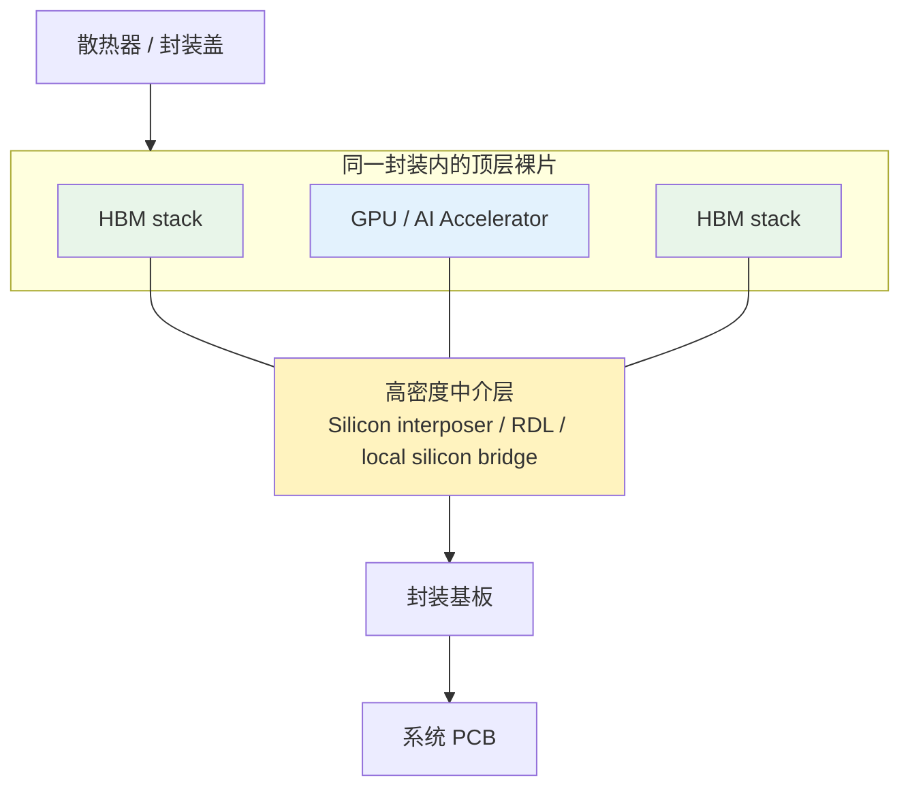
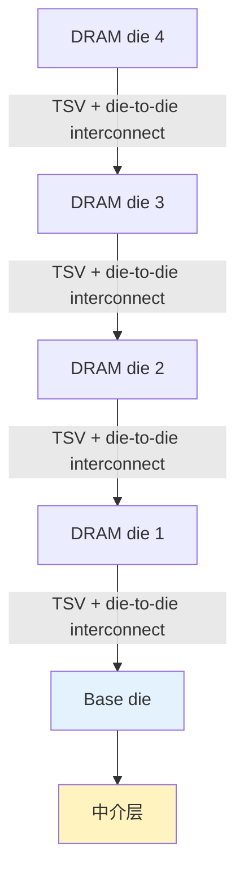

GDDR 已经通过更高每针脚数据率、更宽总线和 PAM3/PAM4 信号不断增加带宽，但 AI 加速器仍需要在更短时间内搬运更多权重、激活值和 KV Cache。继续提高单根导线的速率，会让信号完整性、功耗和电路复杂度越来越难控制；继续在普通 PCB 上增加导线，又会碰到封装尺寸与走线密度限制。

HBM（High Bandwidth Memory，高带宽内存）换了一条路线：**不再只追求每根线跑得更快，而是把处理器和内存放得更近，用极宽、极短的接口并行传输数据。**

本文整理自 Redknot-乔红的[《HBM 的原理》视频](https://www.youtube.com/watch?v=yF2BY8kQfyo)，也可以在作者的[B 站同名视频](https://www.bilibili.com/video/BV1ahjA6qEwc/)中观看。视频从封装制造角度展示了 HBM 的形成过程，本文在此基础上补充不同中介层方案、标准术语和工程边界。

本系列共两篇：

1. [CPU、GPU 与 DDR/GDDR 的架构取舍]()
2. **HBM 的硅中介层、TSV 与 3D 堆叠（本文）**

1. Table of Contents, ordered
{:toc}

# 从 GDDR 的瓶颈走向 HBM

[上一篇]()已经推导过理论带宽：

$$
\text{Bandwidth (GB/s)}
=
\frac{\text{Per-pin data rate (Gb/s)} \times \text{Bus width (bit)}}{8}
$$

提高带宽只有两个直接方向：提高每根数据线的有效数据率，或者增加同时传输的位数。

## 每针脚数据率不能无限提高

电压从高到低、从低到高都需要有限的上升和下降时间。符号周期越短，接收端可判断信号的时间窗口越小，抖动、反射、串扰和噪声就越难控制。

GDDR6X 的 PAM4 用四个电平让一个符号携带 2 bit，GDDR7 的 PAM3 在信息密度与信号裕量之间重新权衡。这些技术能提高每针脚数据率，但会增加收发电路、校准、功耗和封装布线的难度。

HBM 的核心思路是把更多资源投入另一项乘数：**总线位宽**。

## HBM 不是“单根线更快的 GDDR”

GDDR 使用相对较窄但每针脚速率很高的接口；HBM 使用非常宽、物理距离很短的接口，让大量数据线同时工作。

| 对比维度 | GDDR | HBM |
| --- | --- | --- |
| 连接方式 | 多颗独立封装围绕 GPU，经过封装基板和 PCB | HBM stack 与逻辑 die 在同一先进封装内互联 |
| 单颗/单 stack 位宽 | 相对较窄 | 极宽，多通道并行 |
| 每针脚速率 | 更激进 | 不必只靠极高 pin speed |
| 容量扩展 | 增加独立颗粒 | 垂直堆叠多个 DRAM die |
| 主要代价 | PCB 面积、信号完整性、功耗 | 中介层、堆叠、良率、散热和封装成本 |

[Micron 的 HBM3E 产品说明](https://www.micron.com/content/dam/micron/global/public/documents/products/product-flyer/hbm3e-product-brief.pdf)将这条路线概括为三项技术：宽 I/O 总线、让内存靠近处理器的先进封装，以及通过 TSV 垂直堆叠 DRAM。其 HBM3E 产品以 1024-bit 接口在单个 stack 上提供超过 1.2 TB/s 带宽。

# 为什么普通 PCB 接不下超宽总线

一条 1024-bit 数据接口并不只需要 1024 个连接。电源、地、地址、命令、时钟和测试信号同样需要触点，实际连接数量会更多。

普通封装基板和 PCB 由树脂、玻璃纤维与铜层构成，机械强度和成本适合大规模系统，但线宽、线距、过孔和表面平整度无法像晶圆工艺那样精细。让几千个短连接从 HBM 扇出到 GPU，会迅速耗尽布线资源。

解决办法是把高密度连接从普通 PCB 移到更精细的中介层，再把整个高密度结构作为一个封装安装到系统基板上。

# 硅中介层把 GPU 和 HBM 拉近

## 2.5D 封装的基本结构

以硅中介层方案为例，GPU/加速器裸片与多个 HBM stack 并排安装在一块大尺寸硅片上。中介层不负责主要计算，而是提供亚微米或微米级高密度金属互连，让逻辑 die 与 HBM 之间形成大量短链路。

这种结构常被称为 **2.5D integration**：逻辑 die 和内存没有直接垂直叠在彼此上方，但它们通过中介层在同一封装内紧密互联。

[TSMC 对 CoWoS-S 的说明](https://3dfabric.tsmc.com/english/dedicatedFoundry/technology/cowos.htm)显示，硅中介层可以同时容纳逻辑 chiplet 和多个 HBM stack，并提供高密度互连和封装内电容。

## 中介层不只有一种实现

视频集中讲硅中介层，这是理解 HBM 最直观的方案，但不是唯一方案。先进封装还可以使用：

- **Silicon interposer**：整块硅提供高密度走线和 TSV，例如 CoWoS-S。
- **RDL interposer**：使用聚合物与铜重布线层，例如 CoWoS-R。
- **Local silicon interconnect/bridge**：只在需要最高密度的位置嵌入局部硅互连，例如 CoWoS-L 一类方案。

不同方案在布线密度、尺寸扩展、成本、翘曲和良率之间取舍，但目标相同：让逻辑与 HBM 之间拥有足够短、足够宽的物理通道。

# 3D 堆叠如何增加容量

极宽接口解决了带宽，但 AI 加速器还需要更大容量。如果把每个 DRAM die 都平铺在中介层上，封装面积会快速膨胀。

HBM 把多个薄化后的 DRAM die 垂直堆叠起来，让它们共享一个底部占位面积。stack 底部通常还有负责接口、通道组织和测试修复等功能的 base die。

问题随之变成：上层 die 如何跨过所有中间层连接到底部？从侧面引出几千根细线既占空间，也难以控制长度和可靠性。HBM 使用 **TSV（Through-Silicon Via，硅通孔）**把垂直连接直接穿过硅片。

[SK hynix 对 HBM2E 的说明](https://news.skhynix.com/sk-hynix-develops-worlds-fastest-high-bandwidth-memory-hbm2e/)给出了一个典型例子：1024 个数据 I/O 与最多八层 DRAM 通过 TSV 形成一个高密度 stack。具体层数、容量和速率会随 HBM 代际和产品变化，但“宽接口 + 垂直堆叠”是稳定的架构特征。

# TSV 是怎样制造出来的

TSV 不是拿机械钻头给成品芯片打孔，而是在晶圆制造与封装流程中完成的一组微纳加工步骤。

## 深硅刻蚀形成高深宽比孔洞

典型流程先用光刻定义孔洞位置，再用深反应离子刻蚀（Deep Reactive Ion Etching，DRIE）向硅内部刻出深而窄的孔。

视频展示的 Bosch process 会在两种阶段之间反复切换：

1. 使用含氟等离子体向下刻蚀硅。
2. 沉积侧壁保护层，抑制横向刻蚀。
3. 离子轰击去除孔底保护层。
4. 重复刻蚀与钝化，逐步形成接近垂直的深孔。

## 绝缘、阻挡和铜填充

硅孔不能直接灌铜。完整结构通常包括：

- **绝缘衬层**：把铜导体与硅隔离；
- **扩散阻挡层**：阻止铜原子进入硅并破坏器件；
- **铜种子层**：为后续电镀提供连续导电表面；
- **电镀铜填充**：从孔壁和孔底生长，最终填满 TSV。

之后通过研磨和化学机械抛光减薄晶圆，让 TSV 的另一端暴露出来。DRAM die 只有减薄到几十微米级，整个 HBM stack 才能控制在可接受的高度。

# 微凸点、底部填充与散热

## 微凸点完成层间连接

传统 HBM stack 常使用微凸点（micro-bump）连接相邻 die。对准后加热加压，焊料形成电连接，TSV 由此一路连到下层。

凸点间距越小，短路、对准误差、焊点空洞和热机械应力越难控制。任何一层出现缺陷，都可能影响整个 stack 的良率，所以 HBM 不只是存储设计问题，也是测试、挑选 known-good die 和封装流程问题。

## Underfill 提供机械支撑

薄化后的 die 很脆，微凸点之间又存在空隙。底部填充材料（underfill）会填入层间空隙并固化，从而：

- 分散机械应力；
- 保护微凸点；
- 降低热循环造成的疲劳；
- 在材料设计合适时改善部分热传导路径。

## 堆叠让散热更困难

HBM stack 的热量要穿过多层硅、键合界面和封装材料才能到达散热结构。越靠近底部的 die，热路径越复杂；GPU 本身又是高功耗热源。

因此容量、堆叠高度、接口速度和温度不是可以独立拉满的参数。厂商需要同时优化低功耗 DRAM、TSV 分布、填充材料、封装盖、热界面材料和系统散热。

# 混合键合为什么是下一步方向

微凸点的尺寸和间距存在缩放极限。连接数量继续增加时，焊料凸点可能成为高度、寄生参数、散热和可靠性的瓶颈。

**Hybrid bonding（混合键合）**尝试让介质表面与铜焊盘在更细间距下直接结合，不再依赖传统焊料凸点。它可以带来：

- 更小连接间距和更高互连密度；
- 更短垂直路径和更低寄生参数；
- 更薄堆叠；
- 更好的带宽与能效潜力。

[TSMC SoIC 技术说明](https://3dfabric.tsmc.com/schinese/dedicatedFoundry/technology/SoIC.htm)展示了类似方向：通过细间距 die-to-die 连接实现更高互连密度、更小尺寸和更低功耗。AMD 3D V-Cache 已经把直接铜对铜键合用于缓存堆叠，但具体 HBM 产品何时、以何种工艺大规模采用混合键合，仍取决于标准、成本和量产成熟度。

# HBM 改变了哪一层瓶颈

HBM 没有改变 DRAM 存储单元的基本职责，也没有消除缓存层级。它改变的是 GPU 与片外显存之间的物理通道：

1. 用超宽接口增加并行数据通路。
2. 用先进封装缩短 GPU 到内存的距离。
3. 用 TSV 和 3D 堆叠在有限占地中增加容量。
4. 用更复杂的封装、测试和散热换取带宽与能效。

这两篇文章构成了一条从任务到封装的主线：

- 第一篇从任务依赖和并行性出发，解释 GPU 为什么优先追求吞吐，以及这种取向为什么需要更高的显存带宽；
- 第二篇继续追踪带宽需求，解释超宽接口、硅中介层、TSV 和 3D 堆叠如何共同形成 HBM。

从 GPU 的工作方式一路走到硅中介层和 TSV，看似跨越了计算架构与封装制造，实际都在回答同一个问题：**怎样以合理的功耗和成本，及时把足够多的数据送到大量并行计算单元。**
