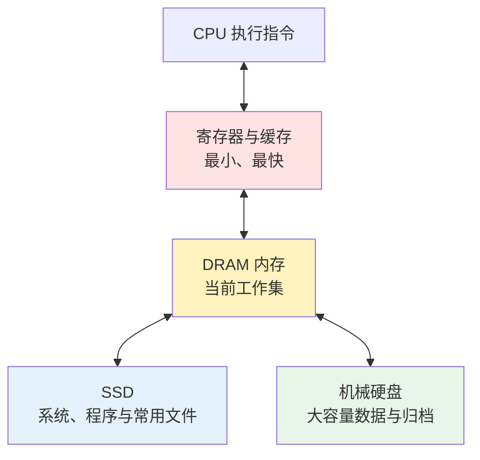
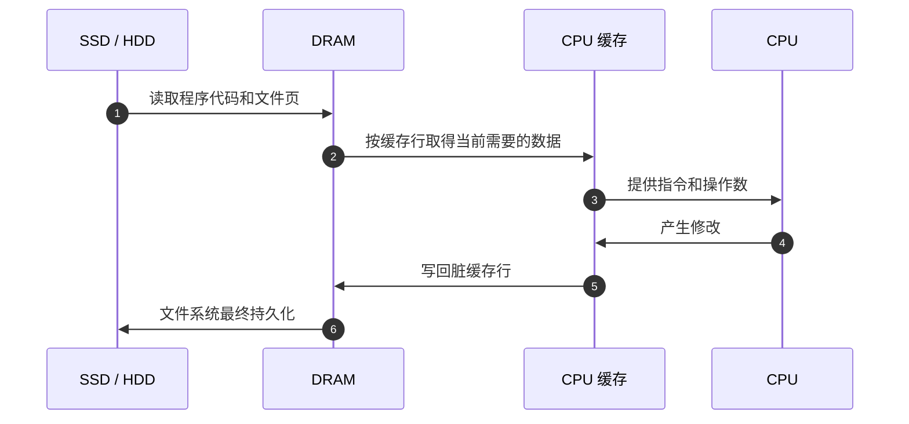
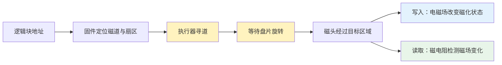
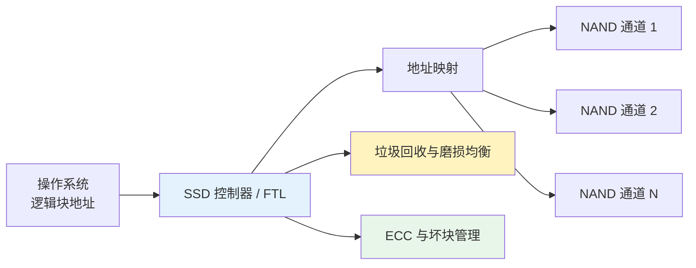

电脑里的机械硬盘、固态硬盘和内存都在保存 `0` 与 `1`，但它们保存的并不是同一种物理状态：

- **机械硬盘（HDD）**保存盘片上磁性材料的磁化状态；
- **固态硬盘（SSD）**保存 NAND 单元绝缘结构中的电荷，并通过晶体管阈值电压读取；
- **内存（DRAM）**保存微小电容中的电荷，并依靠持续刷新维持状态。

三种介质的速度、容量、成本和断电表现，都可以从这三种物理状态推导出来。磁化状态和被绝缘层困住的电荷能在断电后保持，适合长期存储；DRAM 电容读写更直接，却会快速漏电，只适合保存 CPU 当前正在处理的工作数据。

本文整理自 Redknot-乔红的三期视频：

- [《机械硬盘的原理》](https://www.youtube.com/watch?v=rKC4LQ3s0lQ)，[B 站版本](https://www.bilibili.com/video/BV1bDpEz6EPA/)；
- [《固态硬盘（SSD）的原理》](https://www.youtube.com/watch?v=rQR_0WZzjV4)，[B 站版本](https://www.bilibili.com/video/BV1jDgtzEEVe/)；
- [《内存的原理》](https://www.youtube.com/watch?v=bqImyyk1bMQ)，[B 站版本](https://www.bilibili.com/video/BV1Htr8YhELV/)。

三期视频分别深入单个器件。本文不按视频顺序复述，而是沿着“**怎样保存一个 bit → 怎样找到并读写它 → 这种路径产生什么取舍**”统一比较三者。

1. Table of Contents, ordered
{:toc}

# 为什么电脑同时需要硬盘和内存

如果 SSD 已经比机械硬盘快很多，为什么 CPU 不能直接把 SSD 当内存使用？反过来，如果内存更快，为什么不把所有文件都放进内存？

问题的核心不是“谁更先进”，而是没有一种介质能同时满足以下四个目标：

1. 访问延迟极低；
2. 容量很大；
3. 每 bit 成本很低；
4. 断电后仍能长期保存数据。

工程上只能把不同介质组成层级，让每一层承担自己擅长的任务：

从上到下，通常是**容量增大、单位容量成本降低、访问延迟升高**。断电保持能力则在 DRAM 与 SSD/HDD 之间形成明确分界。

启动一个程序时，这个分工会真实发生：可执行文件长期放在 SSD 或 HDD 中；操作系统把即将使用的代码和数据读入 DRAM；CPU 再把热点数据逐级带入缓存和寄存器。程序运行期间产生的结果，也要经过反方向写回持久化存储，才能在断电后保留下来。

# 机械硬盘：把数据写成磁化状态

## 盘片、磁道、扇区和磁头

机械硬盘内部有一张或多张高速旋转的**盘片（platter）**。盘片以铝合金或玻璃为基底，表面覆盖磁性材料。每个盘面被组织成大量同心圆**磁道（track）**，磁道继续划分为**扇区（sector）**。

执行器带动磁头在盘片半径方向移动，盘片本身不断旋转。两种运动配合后，磁头才能到达目标扇区：

1. 执行器把磁头移动到目标磁道，这叫**寻道**；
2. 等待盘片把目标扇区转到磁头下方，这叫**旋转等待**；
3. 扇区经过磁头时，数据才真正被连续读出或写入。

[Seagate 对 HDD 结构的说明](https://www.seagate.com/innovation/hard-drives-and-ssds/)也将旋转盘片、磁性涂层、磁头和执行器列为硬盘的核心结构。机械硬盘的“机械”二字不是外观描述，而是每次访问都可能包含真实的物理运动。

## 写入依靠磁场，读取依靠磁电阻

写磁头可以看作一个微型电磁铁。改变线圈中的电流方向，就能改变局部磁场并重新磁化盘片材料。

现代硬盘主要使用**垂直磁记录（PMR）**，让磁化方向垂直于盘面，从而提高记录密度。但读取时不能简单理解成“朝上是 `1`、朝下是 `0`”。编码会关注相邻区域的**磁化翻转**，读磁头检测这些翻转产生的磁场变化，再还原比特序列。

读磁头利用磁电阻效应：外部磁场变化会引起传感材料电阻变化。巨磁电阻（GMR）等高灵敏度读头使更小、更密集的磁性区域也能被可靠识别。[IBM 对自旋阀 GMR 读头的研究](https://research.ibm.com/publications/design-fabrication-and-performance-of-spin-valve-read-heads-for-magnetic-recording-applications)说明了这种技术怎样提高读回信号和面密度潜力。

因此 HDD 的读写链路可以概括为：

## 为什么随机访问慢，连续传输却还可以

一次 HDD 访问的时间可以粗略拆成：

$$
T_{access}
=
T_{seek}
+
T_{rotation}
+
T_{transfer}
$$

- $$T_{seek}$$：磁头移动到目标磁道的时间；
- $$T_{rotation}$$：目标扇区转到磁头下方的等待时间；
- $$T_{transfer}$$：数据实际经过磁头并传出的时间。

对于转速为 $$R$$ RPM 的硬盘，随机位置的平均旋转等待约为半圈：

$$
T_{rotation,avg}
=
\frac{30{,}000}{R}\ \text{ms}
$$

一块 `7200 RPM` 硬盘仅平均旋转等待就约为 `4.17 ms`，还没有计算寻道和传输。连续读取时，磁头定位一次后可以顺着磁道持续读取，机械成本被大量数据摊薄；随机读取小文件时，寻道和旋转等待会反复发生。

所以评价 HDD 不能只看 MB/s：**连续带宽可以不低，随机 IOPS 和访问延迟却受机械运动限制。**

## CMR 与 SMR：容量和随机写入的交换

读磁头可以做得很窄，但写磁头必须产生足够强的磁场，不容易同步缩小。SMR（Shingled Magnetic Recording，叠瓦式磁记录）让相邻磁道像瓦片一样部分重叠，以此提高面密度。

代价是改写一条磁道时可能破坏后续重叠磁道。设备需要先保留受影响数据，再成片重写，形成明显的写放大。CMR（Conventional Magnetic Recording）磁道彼此独立，随机改写更直接。

这不是“PMR 和 SMR 二选一”：**CMR 与 SMR 都可以建立在垂直磁记录上，区别在磁道是否叠瓦。**[Seagate 的 CMR/SMR 说明](https://www.seagate.com/au/en/products/cmr-smr-list/)也把 SMR 定位在顺序写入或可以顺序化的归档、备份等负载。

# SSD：把数据写进 NAND 的阈值电压

SSD 没有旋转盘片和移动磁头。它的核心介质是 NAND Flash，数据以电荷状态保存在晶体管单元中。

## 电荷怎样在断电后留下来

理解 NAND 可以从**浮栅晶体管（floating-gate transistor）**开始。在普通 MOS 晶体管的控制栅和沟道之间，加入一块被绝缘层包围的浮栅：

- 施加强电场时，电子可以通过 Fowler-Nordheim 隧穿等机制进入或离开存储结构；
- 撤掉电源后，绝缘层把电子困在其中，使状态长期保持；
- 浮栅中的电荷会改变晶体管的**阈值电压**，读取电路通过尝试不同参考电压判断电荷量。

[KIOXIA 的非易失存储可靠性说明](https://www.kioxia.com/content/dam/kioxia/en-jp/about/asset/reliability-handbook-e.pdf)同样将浮栅中的电荷量和阈值状态联系起来。现代 3D NAND 也广泛使用电荷俘获结构，具体材料和几何形态不同，但核心直觉仍然是：**把电荷长期困在绝缘结构中，再测量它对晶体管导通条件的影响。**

## SLC、MLC、TLC 和 QLC 存的不是“更多电子”这么简单

如果一个单元只区分两个阈值范围，就能表达 1 bit，也就是 SLC。若把阈值电压窗口继续细分，一个单元便能表达更多状态：

| 类型 | 每单元 bit 数 | 需要区分的状态数 | 主要取舍 |
|---|---:|---:|---|
| SLC | 1 | 2 | 窗口宽、读写直接、成本高 |
| MLC | 2 | 4 | 密度提高，电压判断更复杂 |
| TLC | 3 | 8 | 常见容量与成本折中 |
| QLC | 4 | 16 | 密度更高，状态窗口更窄 |

一般地，一个单元保存 $$b$$ bit，就必须可靠区分：

$$
N_{states} = 2^b
$$

bit 数增加后，每种状态可使用的阈值电压区间变窄。读取需要更多参考电压，写入要通过“写一点、校验一次”逐步逼近目标状态，误差余量和耐久性也更紧张。

所以 TLC、QLC 的价值首先是**提高密度、降低每 bit 成本**，并不是让单元本身更快。

## 页可以读写，块才能擦除

NAND 单元组成串（string），多条串形成阵列。对理解 SSD 性能最重要的不是每根控制线，而是两个不对称粒度：

- **页（page）**是读取和编程的基本粒度；
- **块（block）**包含许多页，是擦除的基本粒度。

已经编程的 NAND 页不能像 HDD 扇区那样直接原地覆盖。新数据通常先写到空闲页，旧页标记为无效；当一个块积累了足够多无效页后，控制器把仍然有效的页搬走，再擦除整个块。

[Micron 对 NAND 工作负载的说明](https://www.micron.com/content/dam/micron/global/public/products/technical-marketing-brief/client-vs-enterprise-performance-use-cases-tech-brief.pdf)明确区分了页写入和块擦除，并说明垃圾回收需要先搬走有效数据再擦除块。

## 控制器把复杂 NAND 伪装成普通磁盘

操作系统看到的是一串逻辑块地址，但数据的物理页会不断变化。SSD 控制器中的 FTL（Flash Translation Layer）负责维护逻辑地址到物理地址的映射，并协调：

- **垃圾回收（garbage collection）**：整理有效页并回收可擦除块；
- **磨损均衡（wear leveling）**：避免少数块过早耗尽编程/擦除寿命；
- **错误校正（ECC）**：修正读取中的 bit 错误；
- **坏块管理**：绕开失效单元；
- **TRIM**：接收操作系统“不再需要这些逻辑块”的提示；
- **并行调度**：同时使用多个通道、NAND die 和 plane。

SSD 比 HDD 快，首先因为它消除了寻道和旋转等待；其次因为控制器可以并行访问多组 NAND。但它并不是“电一通就直接改一个 bit”：页/块粒度、地址映射和后台整理让写入路径比读取复杂得多。

# DRAM：用会漏电的电容换取低延迟

## 一个晶体管加一个电容

DRAM 的基本单元是 **1T1C（1 Transistor + 1 Capacitor，一个晶体管加一个电容）**：其中晶体管负责控制访问，电容负责保存电荷。

- 电容接近充满或放空，表示两个逻辑状态；
- 晶体管关闭时，电容与公共位线隔离；
- 晶体管打开时，外部电路可以感应或改变电容状态。

电容和访问晶体管都非常小，因此 DRAM 可以用可接受的成本提供 GB 级容量。可它们并不能长期保存状态：电容会漏电，访问和读取也会扰动原有电荷。

[Micron 对 DRAM 历史和原理的说明](https://www.micron.com/about/blog/memory/dram/recognizing-the-contribution-of-computer-memory-during-national-dram-day)将 DRAM 的关键概括为用电容暂存逻辑电平，并通过周期刷新延长保持时间。

## 字线选中一行，位线感应一列

大量 1T1C 单元组成二维阵列：

- 同一行晶体管由**字线（wordline）**共同控制；
- 同一列单元共享**位线（bitline）**；
- 阵列和配套行列解码、感应放大电路组成 Bank；
- 多个 Bank 可以交错工作，提高并行性。

读取一行时，DRAM 先把位线预充到中间电压，再激活目标字线。电容与位线发生电荷共享，使位线电压轻微向上或向下偏移。感应放大器将微小差异放大成完整的 `0` 或 `1`，同时把完整电平重新写回电容。

这个恢复动作不可省略，因为 DRAM 读取是**破坏性读取**：电容接入位线后，原来的微弱电荷状态已经被扰动。

## ACTIVATE、READ、WRITE 和 PRECHARGE

DRAM 一次访问不是直接伸手拿走某个 bit：

1. **PRECHARGE**：关闭旧行，把位线恢复到中间电压；
2. **ACTIVATE**：打开目标行，感应并恢复整行到行缓冲；
3. **READ/WRITE**：按列选择行缓冲中的一部分数据；
4. 需要切换行时，再次 PRECHARGE。

如果下一次访问仍在当前打开的行中，就形成 row hit，可以直接读写列；如果目标位于另一行，就要关闭旧行并激活新行，延迟更高。

## 为什么断电消失，为什么仍比 SSD 快

即使不执行任何读写，DRAM 单元也会持续漏电。控制器必须周期性执行 **REFRESH**，在状态衰减到无法识别前重新感应和恢复各行。断电后刷新停止，数据便会消失。

这看起来是缺点，却也是 DRAM 的设计取向：

- 不需要把电子强行穿过绝缘层并保持多年；
- 不需要按块擦除，也没有 FTL 和垃圾回收；
- 没有磁头寻道和盘片旋转；
- 可以通过地址迅速选择 Bank、行和列。

因此 DRAM 的访问延迟通常处于纳秒量级，SSD 是微秒量级，HDD 则是毫秒量级。具体数值随设备和负载变化，但三者之间的数量级差异来自访问路径，而不是接口名称。

# 把三者放到同一张表里

| 维度 | 机械硬盘 HDD | 固态硬盘 SSD | 内存 DRAM |
|---|---|---|---|
| 保存的物理状态 | 磁性材料的磁化状态 | NAND 单元中的电荷与阈值电压 | 电容中的瞬时电荷 |
| 断电后保持 | 是 | 是 | 否 |
| 访问路径 | 寻道 + 旋转 + 磁头读写 | FTL 映射 + NAND 页读写 | Bank/行/列选择 + 感应放大 |
| 典型延迟数量级 | 毫秒 | 微秒 | 纳秒 |
| 主机看到的角色 | 块设备、文件持久化 | 块设备、文件持久化 | CPU 主存地址空间 |
| 读写粒度特征 | 扇区；连续访问占优 | 页读写、块擦除 | 激活整行、按 burst 传输 |
| 随机访问 | 受机械运动限制 | 无机械寻址，明显更强 | 最快，但仍受行命中影响 |
| 写入代价 | CMR 可原位改写；SMR 可能重写邻轨 | 异地更新、垃圾回收、写放大 | 直接改变行缓冲并恢复电容 |
| 密度与成本 | 容量大，每 TB 成本低 | 居中，随 NAND 类型变化 | 每 GB 成本最高 |
| 主要寿命约束 | 机械部件、介质与环境 | 编程/擦除磨损和数据保持 | 不用于断电保存，持续刷新 |
| 适合场景 | 大容量媒体、备份、归档 | 系统盘、程序、数据库、活跃文件 | 正在运行的程序和工作集 |

这张表中最关键的不是“谁快”，而是每种介质为了什么付出了代价：

- HDD 用机械等待换取低成本的大容量；
- SSD 用复杂控制器、擦除管理和有限写入寿命换取非易失、高密度与快速随机访问；
- DRAM 放弃断电保持，并承担刷新成本，换取更低的访问延迟。

# 怎样正确理解“硬盘速度”和“内存速度”

## 顺序带宽、随机 IOPS 和延迟不是一回事

一个设备可以有很高的顺序带宽，却不擅长随机小块访问。HDD 连续读取大文件时，磁头定位成本只发生少量几次；读取散落的小文件时，机械等待会支配总耗时。

SSD 没有机械等待，随机访问强得多，但 QD、并行通道、NAND 类型、SLC 缓存是否耗尽、垃圾回收和温度都会影响结果。DRAM 也不是每次访问完全等时，row hit、Bank 冲突和刷新仍会改变延迟。

因此性能比较至少要说明：

- 读还是写；
- 顺序还是随机；
- 数据块大小；
- 队列深度与并发度；
- 持续负载还是短时突发；
- 测的是延迟、IOPS 还是带宽。

## SATA、NVMe 和 DDR 不是存储介质本身

SATA、PCIe/NVMe、DDR 描述的是接口、协议或内存技术代际，不能替代对介质访问路径的理解。

把 HDD 接到更快接口上，机械寻道仍然存在；NVMe SSD 可以通过 PCIe 和多队列释放并行能力，但 NAND 页写、块擦除仍然存在；提高 DDR 数据率能增加带宽，却不会消除 DRAM 激活和预充电延迟。

**接口决定数据通道的上限，介质和控制器决定一次访问真正要走过哪些步骤。**

## SSD 不是“大号内存”，DRAM 也不是“小号硬盘”

SSD 和 DRAM 都由半导体构成，也都保存电荷，但这并不足以让它们互换：

- NAND 为了断电保持，把电荷困在绝缘结构中，写入需要高电场，擦除以块为单位；
- DRAM 允许电荷快速进出普通电容，用刷新维持状态，换取更直接的随机访问；
- SSD 通过控制器把 NAND 包装成块设备，DRAM 则直接参与处理器的主存地址空间。

物理机制、访问粒度和系统接口共同决定了它们的角色。

# 从一个文件的一生理解存储层级

把三种设备放回真实使用场景，分工会更直观。

一份长期不使用的照片可以放在机械硬盘里，因为容量和成本比几毫秒访问延迟更重要。操作系统、应用程序和经常打开的工程文件更适合 SSD，因为随机读取和启动延迟会直接影响交互体验。程序真正运行时，无论它来自 HDD 还是 SSD，活跃代码、堆、栈和文件页仍要进入 DRAM，CPU 才能以足够低的延迟反复访问。

这条链路并不是简单地让“慢设备把数据交给快设备”。操作系统会按页加载和回收内存，文件系统会缓冲写入，SSD 控制器会重新映射 NAND 页，HDD 固件也会调度命令与缓存数据。每一层都试图利用局部性、批量传输和并行性，掩盖下一层更高的访问成本。

最终，机械硬盘、SSD 和内存的区别可以收束为三个问题：

1. **状态存在哪里**：磁化状态、绝缘结构中的电荷，还是普通电容中的电荷？
2. **访问要绕多远**：需要机械定位、页/块管理，还是电子方式选择行列？
3. **状态要保持多久**：几年、断电后继续保持，还是只需支撑当前计算？

三者不是一条线上互相淘汰的“旧技术和新技术”，而是围绕容量、成本、持久性和访问速度形成的不同答案。理解这套取舍之后，HDD 为什么仍存在、SSD 为什么不能替代内存、DRAM 为什么必须刷新，就不再是三组孤立的知识点。
