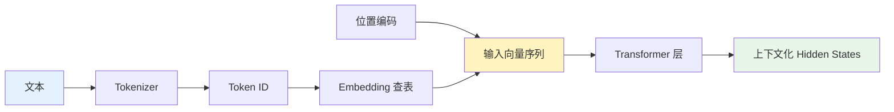
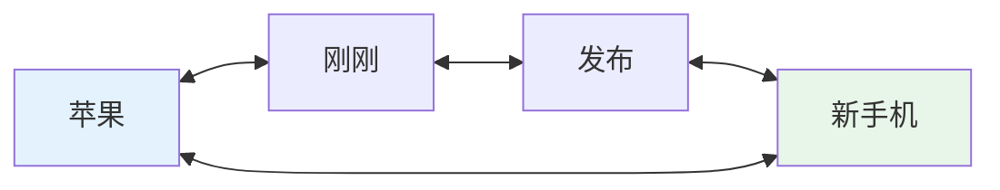
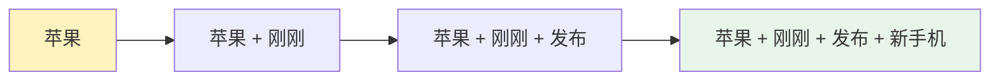
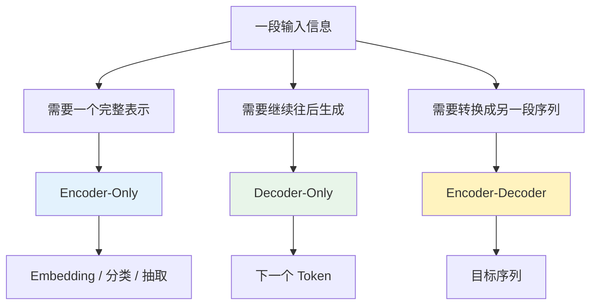
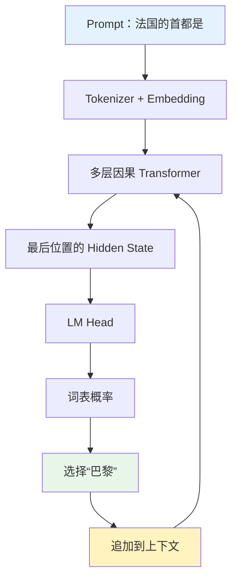
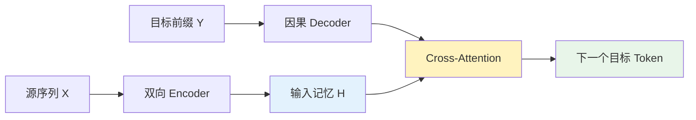
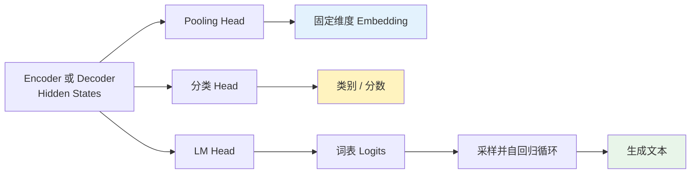
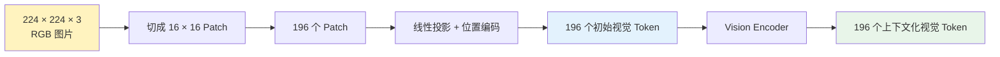
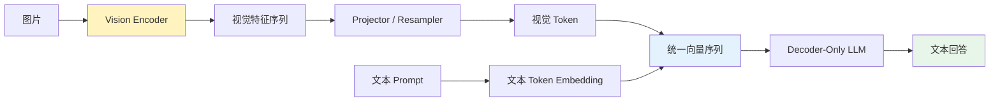
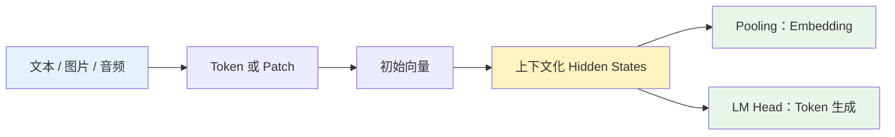

同一句话交给不同的 AI 系统，系统需要完成的工作可能完全不同。

假设输入是：

```text
The bank by the river was closed.
```

搜索系统希望把它压缩成一个语义向量，用来寻找意思相近的句子；翻译系统希望先理解 `bank` 在这里是“河岸”，再生成中文；聊天模型则把它放进已有对话，继续预测接下来应该说什么。

三种任务使用的基础组件都可能是 Transformer，信息流却不相同：

- 语义检索关心的是：怎样为完整输入建立稳定表示？
- 开放式生成关心的是：怎样根据已有内容预测后续？
- 翻译和摘要关心的是：怎样把一个完整输入转换成另一个序列？

Encoder-Only、Decoder-Only 和 Encoder-Decoder 正是从这三种信息流中发展出来的。理解它们不需要先背架构图，而应该跟着信息走一遍：文本怎样进入模型、注意力怎样组织上下文、Hidden State 怎样变成 Embedding 或下一个 Token，以及同样的过程怎样延伸到图片和音频。

1. Table of Contents, ordered
{:toc}

## 文本进入 Transformer 之后才开始形成语义

Transformer 不能直接读取文字。文本首先经过 Tokenizer，被切分成 Token 并转换为整数 ID；Embedding 层再根据 ID 查询向量，并加入位置信息：



用矩阵表示，Transformer 第一层收到的输入是：

$$
H^{(0)}
=
E[\text{token\_ids}]+P,
\qquad
H^{(0)}\in\mathbb{R}^{n\times d}
$$

其中：

- $E$ 是可学习的 Token Embedding 矩阵；
- $P$ 是位置编码；
- $n$ 是当前序列的 Token 数量；
- $d$ 是模型的隐藏维度；
- $H^{(0)}$ 的每一行对应一个 Token 的初始向量。

这一步并不是 Encoder 的专有能力。Encoder、Decoder-Only 以及 Encoder-Decoder 中的 Decoder 都有自己的输入 Embedding。**有没有独立 Encoder，与模型能不能把 Token ID 转成向量是两件事。**

### 初始 Embedding 和上下文化表示不是同一个概念

Embedding 一词在大模型讨论中经常指向不同阶段的向量。理解架构之前，至少需要区分三种情况：

| 名称 | 产生位置 | 是否包含上下文 |
|---|---|---|
| 初始 Token Embedding | Transformer 之前 | 否，同一个 Token ID 查询到同一个向量 |
| Token Hidden State | 每层 Transformer 之后 | 是，取决于这个位置能看到的上下文 |
| 句子 Embedding | 对一组 Hidden State 做 Pooling 之后 | 是，用一个固定维度向量表示整段输入 |

例如下面两句话中的“苹果”会查询到同一个初始 Token Embedding：

```text
苹果刚刚发布了新手机。
苹果吃起来很甜。
```

初始向量进入 Transformer 后，模型才结合其他 Token 判断这里的“苹果”指公司还是水果。经过多层计算得到的动态向量更准确地称为 **Hidden State** 或“上下文化表示”。

Encoder 和 Decoder-Only 都会产生这样的动态表示。它们的差异不在于一个“动态”、一个“静态”，而在于**每个位置允许看见哪些 Token**。

## 注意力的可见范围让信息走向不同路径

Transformer 通过自注意力让一个位置读取其他位置的信息。Encoder 和 Decoder-Only 最关键的结构差异，就是注意力矩阵上有没有因果遮挡。

### Encoder 允许每个位置阅读完整输入

Encoder 使用双向自注意力。对于长度为 $n$ 的输入，第 $i$ 个位置的表示可以依赖整段序列：

$$
h_i^{\text{enc}}
=
f(x_1,x_2,\ldots,x_n)
$$

在“苹果刚刚发布了新手机”中，“苹果”可以看到右侧的“发布”和“手机”；在“苹果吃起来很甜”中，它也能看到“吃起来”和“甜”。因此，“苹果”这个位置本身就能形成两种不同的上下文化表示。



双向注意力适合完整阅读一段已经给定的输入。每个 Token 都可以借助左右两侧的信息完成消歧、对齐和语义理解。

### Decoder-Only 让信息从左向右积累

Decoder-Only 使用因果注意力。第 $i$ 个位置只能读取自己和左侧前缀：

$$
h_i^{\text{dec}}
=
f(x_1,x_2,\ldots,x_i)
$$

当“苹果”位于第一个位置时，它还看不到后面的“发布”或“甜”；但是越靠后的 Token，掌握的前缀越完整：



所以 Decoder-Only 并不是没有理解输入，而是把全局信息逐步汇聚到序列后方。生成答案的位置总在 Prompt 之后，已经能够读取完整 Prompt。

两种注意力可以用一句话区分：

> Encoder 让每个输入位置理解全局；Decoder-Only 让后面的位置逐步汇总全局。

这条差异足以解释后续大多数架构选择。

## 三种信息目标自然形成三类架构

注意力决定一个位置怎样读取上下文，任务目标则决定模型最终需要保留哪一部分结构。[原始 Transformer](https://arxiv.org/abs/1706.03762)同时包含 Encoder 和 Decoder；后来的模型根据任务需要，逐渐发展出三条主要路线。



### Encoder-Only 完整阅读后保留表示

Encoder-Only 接收完整输入，通过双向注意力产生一组上下文化 Hidden State：

$$
H_{\text{enc}}
=
[h_1,h_2,\ldots,h_n]
\in\mathbb{R}^{n\times d}
$$

如果任务需要逐 Token 输出，例如命名实体识别，可以直接为每个 $h_i$ 接分类 Head；如果任务需要一个句子向量，可以对整组 Hidden State 做 Pooling：

$$
e_{\text{sentence}}
=
\operatorname{Pool}
\left(h_1,h_2,\ldots,h_n\right)
\in\mathbb{R}^{d}
$$

[BERT](https://arxiv.org/abs/1810.04805)使用的就是 Encoder-Only。它在预训练时遮挡部分 Token，让模型同时利用左右上下文恢复原文。专用 Embedding 模型通常还会加入对比学习，让意思相近的句子向量靠近、无关句子向量远离。

Encoder-Only 适合 Embedding，不是因为只有 Encoder 能产生向量——所有 Transformer 层都输出向量——而是因为**双向注意力让每个输入位置都获得完整上下文，句子 Pooling 也更自然**。

### Decoder-Only 把输入当作生成前缀

Decoder-Only 的输入就是 Prompt 和已经生成的 Token。以：

```text
法国的首都是
```

为例，模型依次执行：



最后位置的 Hidden State 通过语言模型输出层映射到整个词表：

$$
\text{logits}
=
W_{\text{vocab}}h_n
$$

其中 $h_n$ 是当前序列最后位置的 Hidden State，$W_{\text{vocab}}$ 将它从隐藏维度映射到词表大小。Softmax 再把 logits 转换为概率，模型选出下一个 Token，并将它追加到上下文中。不断重复这一过程，单次 Token 预测就扩展成了文本生成。

Decoder-Only 学习的是：

$$
P(Z)
=
\prod_{t=1}^{n}
P(z_t\mid z_1,z_2,\ldots,z_{t-1})
$$

这里的 $z_t$ 是第 $t$ 个 Token。推理时，KV Cache 保存已经计算过的上下文，形成：

```text
Prompt Prefill → 建立 KV Cache → 逐 Token Decode
```

Prefill 通常会在 GPU 上一次并行计算多个 Prompt 位置，但**并行计算不等于双向注意力**。因果掩码始终存在：Prompt 中靠前的 Token 仍然看不到靠后的 Token，只是第一个输出位置已经位于整个 Prompt 之后，所以能够访问完整输入。

“Decoder-Only”这个名字也容易造成误导。它不是把原始 Transformer Decoder 原封不动地拿出来：原始 Decoder 还有读取 Encoder 输出的 Cross-Attention；GPT 类 Decoder-Only 通常移除了 Cross-Attention，更准确地说是一个**因果自回归 Transformer**。

### Encoder-Decoder 先阅读输入，再生成目标

翻译、摘要和纠错都有明确的源序列 $X$ 与目标序列 $Y$。Encoder-Decoder 为两者建立了不同的数据通路：



Encoder 先完整处理 $X$，输出一组双向上下文化表示；Decoder 一边读取已经生成的目标前缀，一边通过 Cross-Attention 查询 Encoder 的“输入记忆”：

$$
P(Y\mid X)
=
\prod_{t=1}^{m}
P\left(
y_t
\mid
y_{<t},
\operatorname{Encoder}(X)
\right)
$$

这里的“输入记忆”通常不是把整句话压缩成一个向量，而是保留与源序列长度对应的一组 Hidden State。若源序列有 $n$ 个 Token，Encoder 通常输出 $H_{\text{enc}}\in\mathbb{R}^{n\times d}$；Decoder 可以针对不同生成位置查询其中不同部分。把 Encoder 描述成一个单向量瓶颈，更接近早期 Seq2Seq 的简化模型，不适合直接套在 Transformer 上。

这可以类比为阅读和写作的分工：阅读者先把原文通读并做好上下文笔记，写作者再拿着这些笔记逐字生成目标文本。

## 架构决定信息流，输出 Head 决定结果形式

Encoder 和 Decoder 内部输出的都是 Hidden State。模型最终对外提供 Embedding、类别还是文本，并不是由“有没有 Decoder”单独决定的，而是由后续 Head 和运行方式共同决定。



这解释了两个看似矛盾的现象：

- BERT 没有 Decoder，仍然可以接词表 Head 预测被遮挡的 Token；
- Decoder-Only 也可以去掉 LM Head，对 Hidden State 做 Pooling，得到句子 Embedding。

区别在于是否自然。Encoder 的双向表示天然适合语义检索和分类；Decoder-Only 的因果表示天然适合预测后续。架构提供的是一种任务偏好，而不是不可跨越的能力边界。

## Decoder-Only 把条件生成统一成序列续写

Encoder-Decoder 的公式明确写出了 $P(Y\mid X)$。Decoder-Only 没有独立 Encoder，却可以把输入和输出拼在同一条序列中：

```text
[指令][源序列 X][分隔符][目标前缀 Y]
```

若把完整序列写成 $Z=[X;\text{sep};Y]$，并只对目标部分计算训练损失，那么 Decoder-Only 实际学习的仍然是：

$$
P_{\text{dec}}(Y\mid X)
=
\prod_{t=1}^{m}
P\left(y_t\mid X,y_{<t}\right)
$$

因此，“转换”（Transduction）和“生成”（Generation）并不是互斥的任务类别。翻译描述的是输入与输出之间的关系，生成描述的是模型逐 Token 产生结果的方式；从这个角度看，翻译可以被实现为**以源文本为条件的生成**。

生成目标 Token 时，当前位置位于完整源序列之后，因此可以同时读取：

- 完整的源序列 $X$；
- 已经生成的目标前缀 $Y_{<t}$。

两种架构的注意力关系如下：

| 架构 | 源位置能看到什么 | 目标位置能看到什么 |
|---|---|---|
| Encoder-Decoder | 每个源 Token 都看到完整 $X$ | 完整 $X$ 和已有 $Y$ |
| Decoder-Only | 每个源 Token 只看到源前缀 | 完整 $X$ 和已有 $Y$ |

二者的目标位置都能访问完整输入。差别主要发生在输入内部：Encoder-Decoder 先把每个源 Token 都处理成双向表示；Decoder-Only 则让后方目标位置综合所有因果表示。

回到开头的句子：

```text
The bank by the river was closed.
```

Encoder 处理 `bank` 时已经能够看到后面的 `river`，可以在输入侧先判断它表示“河岸”。Decoder-Only 处理 `bank` 位置时还看不到 `river`，但生成中文的位置位于整段英文之后，可以同时关注两个词，并在生成侧完成消歧。

Decoder-Only 的翻译能力还会受益于同一套参数中学到的世界知识、专业术语、语言风格和指令遵循能力。例如金融文档与地理描述中的 `bank`，不仅依赖局部词序，也依赖领域背景。通用预训练让这些知识直接参与翻译，而不必为每个语言对单独建立一套能力。

所以 Decoder-Only 能翻译，不是因为翻译不再需要理解输入，而是因为它把输入理解和目标生成放进了同一套因果网络。共享参数带来了通用知识迁移，但不能据此断言“统一隐空间”必然优于 Encoder-Decoder；后者也可以通过 Cross-Attention 学习高质量的源目标对齐。

## 通用大模型偏爱统一，而专用模型偏爱分工

Decoder-Only 成为通用大语言模型的主干，并不说明它在每个任务上都有最理想的结构。它的关键优势是：训练数据、任务接口、交互历史和推理系统可以全部统一。

### 自然文本直接提供训练目标

网页、书籍、代码和对话天然是连续序列。Decoder-Only 可以直接从每个位置获得“预测下一个 Token”的训练信号：

```text
北京             → 是
北京是           → 中国
北京是中国的     → 首都
```

Encoder-Decoder 也能使用无标注文本，例如遮挡、去噪后再重建，但需要人为构造源序列和目标序列。Decoder-Only 的预训练目标与自然文本顺序直接一致。

### 所有任务都可以写成 Prompt 续写

```text
翻译：I love machine learning. 中文：
摘要：<长文> 摘要：
问题：中国的首都是哪里？答案：
代码：实现快速排序：
```

从模型视角看，它们都变成“根据已有上下文生成后续”。多轮对话、Few-shot 示例、工具调用和 Agent 轨迹也可以不断追加到同一条历史中：

```text
系统指令
→ 用户问题
→ 模型回答
→ 用户追问
→ 工具调用
→ 工具返回
→ 模型继续回答
```

同一套参数由此同时承担读取 Prompt、推理和生成。推理系统也可以集中优化 Prefill、KV Cache、连续批处理、Prefix Cache 和投机解码。

### 专用条件生成仍然需要效率与结构偏置

如果系统只做翻译、摘要或纠错，明确分开的 Encoder 和 Decoder 仍然有价值。它们可以分别针对输入理解、源目标对齐和输出生成进行优化。

长文摘要尤其能体现这种不对称：

```text
10,000 Token 输入
        ↓
300 Token 摘要
```

系统可以使用大型 Encoder 充分理解长输入，只运行一次；再使用较小 Decoder 承担每个输出 Token 的重复生成。Decoder-Only 即使使用 KV Cache，每个新 Token 仍然要经过整套大模型层。

Google 在 2025 年发布的 [T5Gemma](https://developers.googleblog.com/en/t5gemma/)就探索了“9B Encoder + 2B Decoder”等不对称组合，以平衡输入理解质量和逐 Token 推理成本。Meta 的 [Omnilingual MT](https://ai.meta.com/research/publications/omnilingual-mt-machine-translation-for-1600-languages/)则同时研究 Decoder-Only 与 Encoder-Decoder 的专业化翻译路线。

因此，三类架构更适合用“通用性与专业化”来理解：

| 目标场景 | 更自然的选择 | 主要原因 |
|---|---|---|
| Embedding、检索、分类 | Encoder-Only | 双向理解完整输入 |
| 通用聊天、代码、Agent | Decoder-Only | 所有历史统一成序列续写 |
| 专用翻译、摘要、纠错 | Encoder-Decoder | 输入理解与输出生成可以分工 |
| 通用模型中的翻译和摘要 | Decoder-Only | 直接复用同一个基础模型 |

Encoder-Decoder 没有消失，只是不再是通用聊天模型的默认架构。Decoder-Only 赢在统一，Encoder-Decoder 仍然可能赢在专业化、吞吐量和成本。

## 多模态把同一条信息流扩展到图片和音频

前面的讨论默认输入已经是文本 Token。多模态模型面对的新问题是：图片和音频没有天然的文本 Token ID，怎样把它们转换成 Transformer 能处理的向量序列？

这时，“Token”需要回到更一般的含义：

> Token 是 Transformer 序列中的一个信息单元或处理位置，不一定是单词，也不一定有离散整数 ID。

文本 Token 可以是子词，视觉 Token 可以来自一块图像，音频 Token 可以来自一个时间片，视频 Token 可以来自某一帧中的局部区域。

### 图像通过 Patch 变成视觉向量序列

图片文件在底层当然由二进制位存储，但视觉模型不会把 JPEG 的 `0` 和 `1` 直接当作语义 Token。文件先被解码成保持空间结构的 RGB 数值张量，再切分成小块。

以 [Vision Transformer](https://arxiv.org/abs/2010.11929)常见的输入方式为例，一张 `224 × 224 × 3` 图片按 `16 × 16` 切分：

$$
\frac{224}{16}
\times
\frac{224}{16}
=
14\times14
=
196
$$

模型由此得到 196 个 Patch。每个 Patch 包含：

$$
16\times16\times3=768
$$

个 RGB 数值。第 $i$ 个 Patch 展平后记为 $p_i\in\mathbb{R}^{768}$，再经过线性投影和位置编码：

$$
z_i
=
p_iW+b+r_i,
\qquad
z_i\in\mathbb{R}^{d_v}
$$

其中 $W$、$b$ 是可学习参数，$r_i$ 表示 Patch 的位置，$d_v$ 是视觉模型的隐藏维度。这里的 $z_i$ 就是初始的视觉 Token Embedding。



一个初始视觉 Token 通常只对应局部 Patch，并不直接等于“猫”或“汽车”。一只猫可能分布在猫耳朵、眼睛、身体和尾巴等多个 Patch 中。经过 Vision Encoder 的双向注意力后，每个位置才逐渐形成结合全图关系的上下文化表示。

### 多模态需要一组视觉 Token，而不只是一个向量

图像分类和相似度检索可以把整张图 Pooling 成一个全局 Embedding，用来回答“这是什么”或“两张图是否相似”。多模态问答还要回答：

```text
图片左上角是什么？
猫的右边有什么？
桌上有几个杯子？
第二个人穿什么颜色的衣服？
```

如果整张图片只保留一个向量，就像读完一本书后只留下一句话摘要，局部位置和细节容易形成信息瓶颈。保留一组视觉 Token，则相当于保留多份带空间位置的上下文化笔记。

Vision Encoder 和语言模型的隐藏维度通常不同，因此中间还需要 Projector 或 Resampler：

$$
V
=
\operatorname{Projector}
\left(H_{\text{vision}}\right),
\qquad
V\in\mathbb{R}^{m\times d_{\text{LLM}}}
$$

这里 $m$ 是投影后保留的视觉 Token 数量，$d_{\text{LLM}}$ 是语言模型的隐藏维度。Projector 将视觉特征映射到这个维度；Resampler 还可以减少 Token 数量，在图像细节与上下文长度之间取舍。

### 有模态 Encoder 不等于经典 Encoder-Decoder

视觉 Token 进入语言生成器有两种常见路径。

第一种使用显式 Cross-Attention：文本 Decoder 把视觉 Encoder 输出当作独立记忆查询。这在结构上接近经典 Encoder-Decoder。[Whisper](https://cdn.openai.com/papers/whisper.pdf)使用音频 Encoder 加文本 Decoder，将语音特征转换成转录或翻译文本。

第二种先把视觉特征投影到语言模型维度，再作为前缀插入 Decoder-Only：

```text
[视觉 Token 1] ... [视觉 Token m]
[用户问题 Token 1] ... [用户问题 Token n]
[回答 Token ...]
```



此时整个系统确实包含视觉 Encoder 和语言 Decoder，但语言主干内部没有独立语言 Encoder，也可能没有 Cross-Attention，所以不能仅凭“系统中有 Encoder 和 Decoder”就把它归为经典 Transformer Encoder-Decoder。

### 视觉 Token 既可能连续，也可能离散

图片理解模型中的视觉 Token 通常是浮点向量：

```text
Patch → Vision Encoder → [0.31, -0.52, 0.17, ...]
```

它没有固定词表 ID，也不能反查成某一个单词。这里的“Token”强调的是 Transformer 序列中的一个位置。

图像生成模型还可能学习有限的视觉码本，把图片特征量化为离散编号：

$$
\operatorname{id}(p)
=
\arg\min_k
\left\|f(p)-c_k\right\|
$$

其中 $f(p)$ 是 Patch 的连续视觉特征，$c_k$ 是码本中的第 $k$ 个向量；模型选择距离当前特征最近的码本项作为离散 ID。

图片由此可以表示成：

```text
[17, 17, 382, 901, 74, 216, ...]
```

离散视觉 Token 更接近文本 Token：二者都有离散 ID，再通过 Embedding 查表进入模型。量化是有损的，因此即使两个 Patch 有少量像素差异，也可能映射到同一个视觉 Token ID。

| 类型 | 表示形式 | 是否有离散 ID | 常见用途 |
|---|---|---:|---|
| 连续视觉 Token | 浮点向量序列 | 否 | 图片理解、视觉问答 |
| 离散视觉 Token | 视觉码本编号 | 是 | 图片生成、统一自回归建模 |

## 从信息流出发选择架构

Encoder-Only、Decoder-Only 和 Encoder-Decoder 不是从旧到新的迭代关系，也不是能力从弱到强的排名。它们分别为“完整表示”“序列续写”和“条件转换”提供不同的结构偏置。

面对一个具体系统，可以沿着下面的顺序判断：

1. 最终需要一个表示，还是需要生成一段序列？
2. 输入和输出是否有明确、稳定的边界？
3. 每个输入位置是否需要完整双向上下文？
4. 系统只完成一个专用任务，还是覆盖大量开放任务？
5. 输入理解和逐 Token 生成是否需要相同规模的计算？
6. 多模态特征通过 Cross-Attention 读取，还是作为 Decoder-Only 的前缀？

沿着这条信息流，前面的概念可以连成一条完整链路：



原始信息先被切分和数值化，注意力可见范围决定上下文怎样流动，Pooling 或 LM Head 再决定模型输出表示还是文本。Encoder 擅长完整阅读，Decoder-Only 擅长延续历史，Encoder-Decoder 擅长把一个输入专业地转换成另一个输出；多模态模型则在这条链路前端增加了视觉、音频等专用编码器。

架构选择最终回答的不是“哪一种更先进”，而是一个更具体的问题：**为了当前任务，信息应该在哪里被理解，又应该沿着怎样的路径流向输出。**
