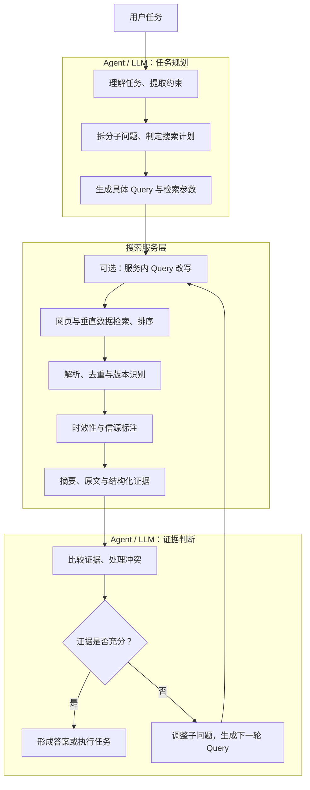

传统搜索把一组链接交给人：人会打开网页、识别广告和转载、判断发布时间，再从正文中提取答案。Agent 没有这层天然的人类判断。如果搜索接口仍然只返回标题和链接，模型就必须在有限的上下文、时间和调用预算里重复完成网页读取、信息抽取与信源判断。

量子位在 2026 年 7 月 28 日发布的[《豆包搜索，走出了豆包》](https://mp.weixin.qq.com/s/xeOpdGHFJze2BvQUXirRKw)展示了另一种产品形态：搜索结果除了网页入口，还包含来源、发布时间、权威度、围绕当前问题生成的摘要，以及可引用的原文 Markdown 片段。这些内容的价值不只在于减少一次网页读取，更在于把开放互联网加工成 Agent 可以继续推理的证据。

这也带来一个评测难题。Agent 最终答对一道题，可能是搜索引擎找到了正确网页，也可能是模型原本就记得答案；答错则可能发生在查询规划、网页召回、正文解析、证据筛选或推理中的任何一环。只看最终正确率，很难判断一个系统究竟改进了什么。

1. Table of Contents, ordered
{:toc}

## 面向 Agent 的搜索服务交付的不是链接，而是证据

面向人的搜索引擎主要解决“哪些页面可能相关”，面向 Agent 的搜索引擎还要回答“页面里的哪些内容能支持当前任务”。两者的输出对象不同：

| 面向人的搜索 | 面向 Agent 的搜索 |
|---|---|
| 排序后的网页入口 | 可直接处理的结构化证据 |
| 用户自己判断来源 | 返回来源类型、首发关系与权威信息 |
| 用户自己阅读正文 | 提取与当前问题相关的摘要和原文 |
| 用户自己判断新旧 | 返回发布时间、抓取时间和有效期线索 |
| 用户自己比较冲突 | 尽量暴露来源差异与相互矛盾的说法 |

一条适合进入 Agent 工作流的结果，至少应包含标题、规范化 URL、发布机构、来源类型、发布时间、抓取时间、查询相关摘要和可核验的原文片段。股票、汇率、航班、价格等对象还应提供结构化字段，避免模型从自然语言中反复寻找数字。

完整链路可以分成 **Agent 编排层**和**搜索服务层**。量子位文章给出的职责划分也是：模型处理需求理解、任务拆解和步骤规划，搜索把最新、可追溯的信息送入工作流。用户任务首先由 Agent 理解和拆解；搜索服务接收到的应是已经相对明确的 Query、时间范围、站点范围和信源要求：



这里有一条重要边界：**理解整个用户任务、提取业务约束、拆分子问题和决定下一步搜什么，属于 Agent 的通用推理与编排能力，而不是搜索引擎的专属能力。**这些能力也可以用于写代码、分析数据或操作软件，因此用“Agent/LLM 层”描述比笼统称为“AGI 层”更准确。

搜索服务负责把具体 Query 对应的外部世界整理成有出处的材料，Agent 再根据任务比较材料并形成判断。搜索层可以生成与 Query 相关的摘要，但不能把未经原文支持的推断伪装成检索事实；摘要、原文和 Agent 结论必须保持可区分。

“约束提取”和“Query 改写”也需要按层区分：

| 动作 | 例子 | 主要责任方 |
|---|---|---|
| 从用户任务提取约束 | 识别“最近三个月”“只看官方来源”“比较中国市场” | Agent |
| 把约束映射为搜索参数 | 设置时间区间、站点白名单、地域和权威等级 | Agent 调用搜索接口 |
| 任务级 Query 规划 | 为不同子问题生成查询，根据上一轮证据决定下一轮查询 | Agent |
| 服务内 Query Rewrite | 拼写纠正、同义词扩展、实体别名归一、把口语长问转成检索表达式 | 搜索服务 |

字节跳动公开的 [byted-web-search Skill](https://github.com/bytedance/agentkit-samples/blob/main/skills/byted-web-search/SKILL.md)正好体现了这个分工：它在给 **Agent** 的“多维度搜索”策略中要求先把复杂问题拆成 2～3 个子问题；搜索命令本身则提供 `--time-range`、`--auth-level` 和 `--query-rewrite` 等参数。其中 `--query-rewrite` 是搜索服务内部的召回优化，不等于让搜索引擎负责理解和规划整个用户任务。

## 最终得分为什么不能等同于搜索能力

端到端答案依赖一条串行链路：

```text
内部知识
→ 问题理解
→ 查询规划
→ 搜索引擎覆盖
→ 网页解析
→ 证据选择
→ 多跳推理
→ 答案生成
```

任意一环失败，最终答案都会被判错。反过来，即使完全没有搜索，模型也可能依靠训练数据答对。

[BrowseComp-ZH](https://arxiv.org/pdf/2504.19314)很好地暴露了这种混合。它包含 289 道中文多跳题，问题由一个短而唯一的答案反向设计，再加入时间、人物、地点等间接约束。普通模型、推理模型和完整 AI 搜索产品都被放在同一个最终答案排行榜中。论文里不联网的 o1、Gemini 2.5 Pro 和 DeepSeek-R1 仍能取得相当一部分分数，而接入搜索的 DeepSeek-R1 产品反而低于不联网版本。

这些结果说明搜索并不天然带来增益：低质量网页、单轮检索或薄弱的证据协调机制，可能让外部噪声覆盖模型原本更准确的知识。但它们不能告诉我们模型究竟在哪一步失败，因为评测没有分别记录：

- 是否召回了包含答案的网页；
- 是否找齐了全部约束对应的证据；
- 是否生成了有效的搜索词；
- 是否找到证据后理解错误；
- 是否因为错误或过期网页改变了正确判断。

因此，BrowseComp-ZH 的“Web Browsing Ability”应理解为广义的端到端网页调查能力，而不是狭义的网页召回能力。更准确的评测对象是“模型、搜索工具与 Agent 工作流组成的完整系统”。标题并非事实性错误，但如果据此把排行榜解释成纯搜索能力排名，就超出了实验能够支持的结论。

## 面向 Agent 的搜索服务需要哪些能力

把 Agent 的任务规划排除在外之后，搜索服务自身的核心目标仍可以归纳为四句话：**找得到、读得懂、信得过、用得上**。它不需要替 Agent 决定整个调查怎样进行，但必须可靠执行每一次具体搜索，并交付足以支持下一步推理的证据。

### 接收具体 Query，并做好服务内改写

用户提出的可能是一项带约束的任务，例如“调查最近三个月 AI Coding 产品的价格变化，并判断行业趋势”。Agent 首先要把它拆成可以执行的搜索计划，例如：

- 确定需要调查的产品集合；
- 分别查询各产品的当前定价页和历史公告；
- 将时间限制为最近三个月；
- 优先检索官方网站，再用独立报道补充行业视角；
- 根据第一轮结果继续核对套餐、额度和生效日期。

搜索服务从某一次具体调用开始工作，例如接收“Cursor pricing update”、最近三个月、官方来源优先等参数。它可以在内部做拼写纠正、别名扩展和口语转检索式 Query，也可以根据时间与信源条件调整召回和排序；但“为什么此时搜索 Cursor”“下一轮是否改查历史价格”仍由 Agent 决定。

这种分工不要求接口只能接收短关键词。搜索服务完全可以接受自然语言 Query，也可以内置模型做语义检索和 Query Rewrite；判断责任归属的关键不是组件内部有没有使用大模型，而是它处理的是**单次检索请求**，还是在规划**整个用户任务**。

### 保持覆盖、时效与版本意识

模型内部知识存在截止时间，搜索索引也可能过期。新闻、政策、产品功能、价格和许可证尤其需要区分“当前状态”“历史状态”和“计划中的状态”。

搜索系统不仅要记录网页发布时间，还要识别更新时间、抓取时间、事件发生时间和页面版本。对于反复修改的官方文档，单独一个日期往往不够；Agent 还需要知道当前片段来自哪个版本，以及旧页面是否已经被新规则替代。

### 把异构网页加工成可用内容

互联网并不是一个整齐的文本库。HTML、动态页面、PDF、图片、表格和图表混在一起，同一条消息还可能被大量转载。检索之前的数据加工决定了 Agent 最终能够看到什么：

- HTML 正文提取与模板噪声清理；
- PDF、图片 OCR 与表格结构恢复；
- 相同内容、转载和镜像页面去重；
- 标题党页面与正文主题的一致性检查；
- 人名、机构、时间、价格等实体字段抽取；
- 针对当前 Query 的片段选择与摘要生成。

直接把网页全文塞进上下文既浪费 Token，也会放大无关信息的干扰。更合适的做法是返回精炼摘要，同时保留足以核验摘要的原文片段。

### 提供信源属性与证据关系

相关性不等于可信度。官方公告、权威媒体、行业报道、社区讨论和普通转载适合承担不同角色：

- 产品参数和政策条文优先核对官方来源；
- 行业影响需要独立媒体或专业机构提供外部视角；
- 用户体验可能更适合参考社区，但不能替代正式规则；
- 多家转载同一篇稿件，只能算一个原始信源。

搜索系统应返回首发与转载关系、来源类别、证据发布时间和可追溯原文，并尽量指出不同来源是否相互独立。所谓“权威等级”只能作为一个特征，不能替 Agent 完成最终判断；采用哪类来源仍取决于任务。

### 以 Agent 友好的方式开放控制面

面向 Agent 的搜索接口不能只有一个 `search(query)`。复杂工作流需要控制：

- 时间、语言、地域和行业范围；
- 指定站点、白名单和黑名单；
- 来源类型与权威等级；
- 返回数量、正文长度和搜索深度；
- 是否返回原文、摘要或结构化数据；
- 调用轮数、延迟、Token 和费用预算。

API、MCP 和 Skill 的作用，是让上层 Agent 根据任务决定“搜多新、搜多广、优先查哪类来源”。前文提到的 byted-web-search Skill 就是一种典型封装：Skill 规定 Agent 何时搜索、怎样拆分复杂任务和何时调整参数，底层搜索 API 则执行具体检索。模型自带搜索适合轻量问答，独立搜索服务更适合需要权限、成本和策略控制的企业工作流。

### 在生产环境中抵抗风险

公开网页本身是不可信输入。一个可上线的 AI 搜索系统还需要处理：

- 网页中的提示词注入和恶意操作指令；
- 企业文档的访问控制与权限继承；
- 原文保存、摘要生成和引用的版权边界；
- 敏感信息、个人数据和搜索日志的保留策略；
- 查询、证据选择、费用和失败原因的可观测性；
- 证据不足或来源冲突时的降级与不确定性表达。

“能联网”只是门槛。能否让每条外部信息保持来源清晰、权限正确并可安全进入下一步任务，决定了系统能否长期稳定运行。

## 四套评测集分别测什么

量子位的产品文章使用 SimpleQA、FreshQA、BrowseComp-ZH 和 XBench-DeepSearch-2505 展示搜索接入后的效果。这四套题覆盖了从静态事实到复杂调查的不同层级，但没有哪一套能够独立代表 AI 搜索的全部能力。

| 评测集 | 主要问题形态 | 重点能力 | 不足以代表的能力 |
|---|---|---|---|
| SimpleQA | 静态、唯一的短事实 | 精确事实回答、少幻觉、置信度校准 | 时效、多跳检索、长文证据整合 |
| FreshQA | 会变化或含错误前提的事实 | 最新信息、时间判断、反驳错误前提 | 大搜索空间中的长链路调查 |
| BrowseComp-ZH | 中文多约束隐蔽答案 | 查询拆解、多轮搜索、跨网页推理 | 检索与模型推理的独立归因 |
| XBench-DeepSearch-2505 | 搜索空间广、推理链深的复杂题 | 规划、搜索、计算、聚合与停止判断 | 每个中间步骤的独立质量 |

四套评测的官方资料入口如下。链接目标均为完整地址，可以直接查看论文、评测代码或公开数据：

| 评测集 | 论文与说明 | 数据与代码 |
|---|---|---|
| SimpleQA | [OpenAI 介绍](https://openai.com/index/introducing-simpleqa/) · [论文 PDF](https://cdn.openai.com/papers/simpleqa.pdf) | [官方评测代码](https://github.com/openai/simple-evals/blob/main/simpleqa_eval.py) · [公开数据 CSV](https://openaipublic.blob.core.windows.net/simple-evals/simple_qa_test_set.csv) |
| FreshQA | [ACL 论文与 PDF](https://aclanthology.org/2024.findings-acl.813/) | [官方项目仓库](https://github.com/freshllms/freshqa) · [2026-04-21 公开版本](https://docs.google.com/spreadsheets/d/1_8mi-yuK30mvoDJu1KQXD6ODem7MKMcIgVAwDSzJkjM/edit?usp=sharing) |
| BrowseComp-ZH | [论文 PDF](https://arxiv.org/pdf/2504.19314) | [官方 GitHub 仓库](https://github.com/PALIN2018/BrowseComp-ZH) · [Hugging Face 数据页](https://huggingface.co/datasets/PALIN2018/BrowseComp-ZH) |
| XBench-DeepSearch-2505 | [官方榜单与说明](https://xbench.org/agi/aisearch) · [官方 Eval Card](https://xbench.org/files/Eval%20Card%20xbench-DeepSearch.pdf) | [Hugging Face 数据页](https://huggingface.co/datasets/xbench/DeepSearch) · [官方评测代码](https://github.com/xbench-ai/xbench-evals) |

将完整评测题逐字发布到另一个可被搜索引擎抓取的网页，会反过来污染搜索评测。下面的 Query 示例因此采用**忠实压缩或中文意译**：保留真实公开题目的对象、约束、答案和能力结构，但不复制大段原题。需要复现实验时，应从上表的官方数据入口读取对应版本。

### SimpleQA：稳定事实与“知不知道自己不知道”

[SimpleQA](https://openai.com/index/introducing-simpleqa/)包含 4,326 道短事实题。每道题要求一个唯一、不会随时间变化、容易评分的答案；问题覆盖科技、政治、艺术、地理、影视和游戏等领域。回答被分成 `Correct`、`Incorrect` 和 `Not attempted`，因此除了总体正确率，还可以观察模型在不确定时是否选择停止，而不是编造答案。

公开数据中的题目非常短，通常不需要拆解搜索计划。下面两题均为中文意译：

1. **Query**：“2010 年 IEEE Frank Rosenblatt Award 的获奖者是谁？”
   - 标准答案：Michio Sugeno。
   - 主要考点：找到一个精确的人名，并避免被相邻年份的获奖者干扰。

2. **Query**：“位于马萨诸塞州剑桥市的那所女子文理学院叫什么？”
   - 标准答案：Radcliffe College。
   - 主要考点：根据地点和学校类型定位唯一实体。

SimpleQA 还可以测量置信度校准：模型声称有 80% 把握的一组回答，实际正确率是否接近 80%。这对搜索产品很重要，因为错误但高置信度的回答比明确表示不知道更危险。

对于搜索引擎，SimpleQA 主要检验能否召回并抽取一个精确的名字、日期、数字或地点。但它刻意排除了会变化的答案，也不要求复杂搜索计划。[SimpleQA 论文](https://cdn.openai.com/papers/simpleqa.pdf)明确指出，短答案事实性是否能泛化到包含大量事实的长文，仍然未知。

### FreshQA：最新事实、错误前提与附加幻觉

[FreshQA](https://aclanthology.org/2024.findings-acl.813/)最初包含 600 道题，分为四类：

1. 几乎不变的事实；
2. 数年内缓慢变化的事实；
3. 一年内甚至更快变化的事实；
4. 前提本身错误、需要主动反驳的问题。

FreshQA 的 Query 会刻意覆盖不同的时间属性。以下答案对应官方 **2026-04-21 版本**，不是脱离版本的永久事实：

1. **错误前提题**：“第一个登陆月球的动物叫什么？”
   - 标准答案要点：尚无动物登陆过月球，不能顺着错误前提编造名字。

2. **快速变化题**：“截至该评测版本，最近一届 F1 世界冠军是谁？”
   - 标准答案：Lando Norris。
   - 主要考点：检索最新赛季结果，而不是复述模型训练时记住的旧冠军。

3. **动态多跳题**：“《指环王：力量之戒》最新一季当前的 Rotten Tomatoes 专业评分是多少？”
   - 标准答案：85%。
   - 主要考点：先判断“最新一季”指哪一季，再读取会继续变化的页面分数。

题目同时包括单跳和多跳形式。它采用两种评分：`Relaxed` 只要求主要答案正确，`Strict` 还要求回答中的所有附加事实都正确且没有过期。两者的差距能够暴露“主体答对了，却在解释里又编错了信息”的现象。

FreshQA 对 AI 搜索的价值在于检验索引更新、时间排序、新旧事实冲突处理和错误前提识别。原论文的消融实验还表明，检索证据的数量与排列顺序都会影响最终答案。这说明搜索结果组织不是中性的：把旧信息排在前面，或者只返回单一证据，都可能改变模型判断。

动态评测也有维护成本。答案会随着现实世界变化，评测方必须定期更新标准答案和预计复核时间，否则评测集本身会先于模型过期。[FreshQA 项目](https://github.com/freshllms/freshqa)因此持续维护不同时间的版本。

### BrowseComp-ZH：中文互联网中的多跳寻踪

BrowseComp-ZH 的题目从答案反向构造，再用时间、地点、人物关系和描述性条件隐藏直接关键词。数据集覆盖影视、艺术、地理、音乐、历史、医学、游戏、科技、体育、政策法律与学术研究等 11 个领域。

这类题几乎不会直接出现答案实体，Agent 必须逐步把描述还原成可搜索的中间对象。下面两例取自论文公开展示的 [Figure 1](https://arxiv.org/html/2504.19314v2#S1.F1)，没有从加密测试集额外披露题目：

1. **艺术题**：一种中国传统绘画形式起源于元代、盛行于晚清，相传由某位古代画家酒后兴起所创；它在 2010～2015 年间被列入某省级非遗名录，创作者还需要兼通多种画法和字体。问这种艺术形式是什么？
   - 标准答案：锦灰堆。
   - 一条可能的搜索链：元代起源与晚清盛行 → 酒后创作传说 → 省级非遗名录 → 画法特征交叉验证。

2. **影视题**：某知名电视剧的女二号演员于 1993 年进入演艺圈，女一号现任丈夫是浙江湖州人，男一号演员在六年后登上春晚。问这部电视剧是什么？
   - 标准答案：《父母爱情》。
   - 一条可能的搜索链：1993 年入行的女演员候选 → 女一号配偶籍贯 → 男一号春晚经历 → 电视剧交集。

它主要检验：

- Agent 对中文问题的理解、任务级 Query 改写和隐含指代处理；
- 百度、中文站点和本地信息生态的覆盖；
- 从多个条件生成候选对象；
- 跨网页进行实体对齐；
- 排除只满足部分约束的候选；
- 协调模型内部知识与外部证据。

这比“搜索一个冷门事实”困难得多，却仍然只用短答案评分。因而它适合比较完整中文研究型 Agent 的任务成功率，不适合单独诊断索引、查询规划或推理中的某个组件。

### XBench-DeepSearch-2505：规划一次小型调查

[XBench-DeepSearch](https://xbench.org/agi/aisearch)把目标概括为 `Planning → Search → Reasoning → Summarization`。2505 版本公开集包含 100 道中文题，题目会刻意扩大搜索空间或增加推理深度，例如从多个官方名单中按地域和时间筛选对象、调查若干人物后计算平均值，或者先识别作品与事件，再沿多条线索找到最终答案。

官方 Eval Card 公开了十道示例。下面三题按其公开题意压缩，能够直观看出它与 BrowseComp-ZH 的差异：重点不只是找出一个隐藏实体，还要枚举、筛选和计算。

1. **官方名单筛选**：截至 2025 年 5 月 16 日，在上交所科创板“注册生效”且申报历时不超过 180 天的公司中，注册地址位于中国沿海地区的有多少家？
   - 标准答案：86 家。
   - 需要完成：获取完整项目名单、解释状态和日期字段、定义沿海省区市、逐条筛选并计数。

2. **地域集合题**：黑龙江、吉林、辽宁共有多少个地市级行政单位与外国接壤？
   - 标准答案：12 个。
   - 需要完成：分别枚举三省行政区，判断国境线关系，处理同一地区的行政层级并汇总去重。

3. **跨季成员聚合题**：《乐队的夏天》各季 Top 5 乐队中，一共有多少名女性成员？
   - 标准答案：6 名。
   - 需要完成：确定节目季数和各季排名，再查询每支乐队成员及性别，最后跨乐队聚合。

这类任务重点检验：

- 是否能先制订搜索计划；
- 是否知道先搜哪个中间事实；
- 能否跨多轮工具调用积累信息；
- 能否对多个页面中的实体和数字去重；
- 能否完成计数、比较与计算；
- 是否知道证据何时已经充分并停止搜索。

题目由不同领域专家创建并经过交叉验证，开放数据还经过加密以降低搜索引擎索引造成的污染。[2505 数据集页面](https://huggingface.co/datasets/xbench/DeepSearch)显示公开版本为 100 条，并明确要求使用官方解密代码在本地读取，不要把明文重新上传到网络。官方同时保留非公开集合，用于发现针对公开题目的过拟合。

根据官方的[评测说明](https://xbench.org/files/Eval%20Card%20xbench-DeepSearch.pdf)，这类产品主要通过 UI 接受人工输入，单题搜索可能持续 5～30 分钟，最终回答再由 LLM-as-a-Judge 统一评分。公开集规模、随机性和自动评分器都会影响结果，因此小幅分差不适合被解释成稳定的能力差距。

公众号文章把它概括为“中文深度搜索和职业场景”评测。严格来说，DeepSearch 位于 xbench 的 AGI Tracking 系列；招聘和营销等职业工作流属于另一条 Profession Aligned 系列。[xbench 论文](https://arxiv.org/abs/2506.13651)讨论的是后者的真实业务任务。XBench-DeepSearch 确实由多领域专家出题，但不能直接等同于招聘、投研或营销等完整职业基准。

## 如何把“模型”和“搜索”拆开评测

固定同一个模型，再比较无搜索与不同搜索服务，是比直接比较完整产品更接近控制变量的设计。量子位文章中的实验采用统一的 Seed 模型，并将各搜索产品相对无搜索基线的增幅作为结果。这里的百分比是**相对增幅**，不是最终准确率，也不是提升了相同数值的百分点。

即使模型固定，实验测到的仍然不只是底层索引。搜索结果的摘要方式、字段结构、接入 Prompt、返回数量和调用策略都会影响模型表现。因此更准确的说法是：它在比较不同“搜索接入方案”的端到端增益。

为了定位能力来源，可以设置六类互补实验：

| 实验 | 固定项 | 变化项 | 能回答的问题 |
|---|---|---|---|
| 闭卷回答 | 模型与题目 | 不提供搜索 | 模型内部知识和基础推理有多强 |
| 同模型、不同搜索 | 模型、Prompt、预算 | 搜索服务 | 搜索接入方案带来多少净增益 |
| 同搜索结果、不同模型 | 网页与证据 | 模型 | 阅读、推理和证据协调能力有多强 |
| Oracle Retrieval | 直接提供完整正确证据 | 模型 | 找到理想证据后的回答上限 |
| 固定 Query 评搜索 | Query、过滤条件和相关性标准 | 搜索服务 | 索引、召回、排序、解析和时效有多强 |
| 固定搜索评规划 | 模型、搜索服务、预算和题目 | Agent 的查询计划 | 约束提取、子问题覆盖与迭代策略有多强 |

后两类尤其重要。搜索服务评测应接收固定 Query，记录正确证据召回率、首发来源命中率、过期结果比例、服务内 Query Rewrite 的召回增益和解析忠实度；Agent 规划评测则记录约束识别率、子问题覆盖率、无效查询比例、每轮搜索的信息增益，以及是否在合理时机停止。这样才能区分四种状态：

| 是否找到正确证据 | 是否答对 | 主要含义 |
|---|---|---|
| 是 | 是 | 检索和推理都成功 |
| 是 | 否 | 检索成功，阅读或推理失败 |
| 否 | 是 | 依靠内部知识、其他路径或猜测 |
| 否 | 否 | 检索与回答均未成功 |

## 建立一套面向产品的分层指标

四套公开评测适合作为外部参照，但产品迭代还需要内部的分层指标。每一层都应有可以定位问题的观测量：

| 层次 | 建议指标 |
|---|---|
| Agent 任务规划 | 约束识别率、子问题覆盖率、无效查询比例、停止时机 |
| 搜索服务检索 | Evidence Recall、Top-k 相关性、服务内 Query Rewrite 增益 |
| 搜索服务时效与信源 | 过期结果率、首发来源命中率、转载去重率 |
| 搜索服务内容加工 | 正文抽取准确率、表格字段准确率、摘要忠实度 |
| Agent 证据使用 | 引用覆盖率、引用与结论一致性、冲突处理正确率 |
| Agent 最终回答 | 正确率、严格事实性、拒答与置信度校准 |
| 系统效率 | 搜索轮数、P95 延迟、Token、单任务费用 |
| 安全与稳定 | 提示词注入成功率、权限泄漏率、重复运行方差 |

SimpleQA、FreshQA、BrowseComp-ZH 和 XBench-DeepSearch 分别覆盖静态事实、动态事实、中文多跳搜索与复杂调查，但它们都不能替代这些过程指标。公开基准负责回答“完整系统能否完成一类任务”，内部指标负责解释“为什么完成或为什么失败”。

## 从“能联网”走向可靠的信息工具

完整 AI 搜索产品的能力来自 Agent 与搜索服务的组合，而不是把所有步骤都算在搜索引擎名下：

```text
Agent 想得清：理解任务、提取约束、拆分问题、规划并迭代查询
搜索找得到：覆盖广、更新快、排序可靠，支持服务内 Query Rewrite
搜索读得出：解析网页、PDF、图片、表格和结构化数据
搜索交得明白：结果精炼、时间明确、来源可追溯、接口可控制
Agent 用得好：核验证据、处理冲突、决定停止并形成最终判断
```

最终答案准确率仍然重要，但它只能说明整条链路有没有跑通。一个成熟的评测体系还要能够指出：Agent 是否制定了有效的查询计划，搜索服务是否找到并准确抽取了证据，Agent 是否合理使用了证据，以及系统为此消耗了多少时间和成本。

当这些问题能够被分别测量，搜索服务才不再只是 Agent 的“联网开关”，Agent 的推理能力也不会再被误记成搜索引擎的能力。二者各自可解释、可调试、可治理，端到端结果才真正具有工程意义。
