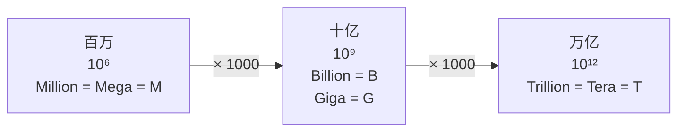

1. Table of Contents, ordered
{:toc}

看到 `8B FP8` 模型时，权重大小其实可以一眼算出：大约 8 GB。这个结果不是需要额外背诵的经验值，而是从 `Billion = Giga = 10^9` 自然得到的单位换算。

最快的理解路径，是从已经熟悉的 `M = 百万` 出发，先弄清 Million、Billion、Trillion 和 Mega、Giga、Tera 为什么会并存，再把两套名称对齐。

## 从 M 等于百万看懂两套命名

`Billion` 和 `Giga` 不是“十亿”的两个日常同义词，而是同一个数量级在两套表达方式中的名称：

- **Million、Billion 是普通数字词，放在名词前表达数量**，例如 `one million meters`、`eight billion parameters`。
- **Mega、Giga 是倍率前缀，与单位直接组成一个新单位**，例如 `one megameter`、`eight gigabytes`。

SI 前缀是一种可选的单位表达方式，并不排斥“数字 + 原单位”的写法。就像 `one thousand meters` 与 `one kilometer` 都正确，同一个长度也可以写成：

$$
1{,}000{,}000\ \text{meters}
= 1\ \text{megameter}
= 1\ \text{Mm}
$$

前一种写法表示“有一百万个 meter”，后一种写法则把一百万倍直接并入 meter，组成新的单位 megameter。数值与单位的拆分方式不同，最终表示的物理量完全相同。

> **普通数字词可以计算有多少个单位；SI 前缀可以把倍率直接并入单位。两种写法等价，并不互斥。**

同理，`eight billion bytes` 与 `eight gigabytes` 表示相同的容量。LLM 的尺寸命名沿用“数字 + 名词”的表达习惯：80 亿个参数写作 `eight billion parameters`，缩写为 `8B`。

英语通常不会用 `eight giga people` 表示 80 亿人，因为 people 不是计量单位，不能与 SI 前缀组成新单位。中文在“80 亿人”和“80 亿字节”里都使用“亿”，两套表达方式的差别因此不太明显。

而且，两套词汇并不是到了十亿才出现：百万已经有 Million 和 Mega，万亿也有 Trillion 和 Tera。只是这两组词的首字母分别都为 `M` 和 `T`，缩写重合；十亿对应的 Billion 与 Giga 分别缩写为 `B` 和 `G`，差别才显现出来。

从熟悉的 `M = 百万` 开始，每次向上乘 1000，就能得到完整的记忆主干：



这条链上最值得记住的是中间两级在**数值上**的对应：

> **十亿：Billion（`B`）与 Giga（`G`）都表示 $10^9$**
>
> **万亿：Trillion（`T`）与 Tera（`T`）都表示 $10^{12}$**

整条记忆口诀可以压缩成一句：

> **百万认 M；再乘千，参数写 B、单位写 G；再乘千，两边都写 T。**

## 英语数字名称和 SI 前缀的完整对照

沿着每级乘 1000 的规律继续展开，就能看到英语数字名称与 SI 前缀始终是两条并行的命名序列。

| 数量级 | 英语数字名称 | 常见数量缩写 | SI 前缀 | SI 符号 | 中文记忆 |
|---:|---|:---:|---|:---:|---|
| $10^0$ | one | — | 无前缀 | — | 一 |
| $10^3$ | thousand | `K` | kilo | `k` | 千 |
| $10^6$ | million | `M` | mega | `M` | **百万** |
| **$10^9$** | **billion** | **`B`** | **giga** | **`G`** | **十亿** |
| **$10^{12}$** | **trillion** | **`T`** | **tera** | **`T`** | **万亿** |
| $10^{15}$ | quadrillion | — | peta | `P` | 千万亿 |
| $10^{18}$ | quintillion | — | exa | `E` | 百亿亿 |
| $10^{21}$ | sextillion | — | zetta | `Z` | 通常直接写 $10^{21}$ |
| $10^{24}$ | septillion | — | yotta | `Y` | 通常直接写 $10^{24}$ |
| $10^{27}$ | octillion | — | ronna | `R` | 通常直接写 $10^{27}$ |
| $10^{30}$ | nonillion | — | quetta | `Q` | 通常直接写 $10^{30}$ |
| $10^{33}$ | decillion | — | 无正式 SI 前缀 | — | 通常直接写 $10^{33}$ |

这张表有三个使用细节：

1. SI 符号区分大小写，kilo 的正式符号是小写 `k`；模型参数中常见的 `K` 则表示 thousand。
2. LLM 参数量最常用 `M`、`B`、`T`。更大的英语数字名称没有统一通用的单字母缩写，遇到 `Q`、`Qa` 或 `Qi` 等写法时应结合上下文。
3. `ronna (R)` 和 `quetta (Q)` 是 2022 年新增的正式 SI 前缀，十进制 SI 前缀目前到 $10^{30}$ 为止，完整定义见 [BIPM 的 SI prefixes 表](https://www.bipm.org/en/measurement-units/si-prefixes)。

把 SI 前缀放到 Byte 前面，就得到常见的十进制存储单位：

| 符号 | 英文全称 | 字节数 |
|:---:|---|---:|
| `B` | byte | $1$ byte |
| `kB` | kilobyte | $10^3$ bytes |
| `MB` | megabyte | $10^6$ bytes |
| **`GB`** | **gigabyte** | **$10^9$ bytes** |
| **`TB`** | **terabyte** | **$10^{12}$ bytes** |
| `PB` | petabyte | $10^{15}$ bytes |
| `EB` | exabyte | $10^{18}$ bytes |
| `ZB` | zettabyte | $10^{21}$ bytes |
| `YB` | yottabyte | $10^{24}$ bytes |
| `RB` | ronnabyte | $10^{27}$ bytes |
| `QB` | quettabyte | $10^{30}$ bytes |

## Billion 参数可以直接换算成 Gigabyte

参数量的 Billion 和存储量的 Giga 都代表 $10^9$，这正是权重空间能够快速心算的原因。

在进入公式前，只需分清三个字母：模型名称 `8B` 中的 `B` 是 **Billion**；容量 `GB` 中的 `G` 是 **Giga**、`B` 是 **Byte**；精度里的 bit 写作小写 `b`，并且 `1 Byte = 8 bits`。

假设一个模型有 $N$ Billion 个参数，每个参数使用 $q$ bit 存储。先计算总 bit 数，再除以 8 换成 byte：

$$
\begin{aligned}
\text{权重大小}
&= N \times 10^9\ \text{parameters}
\times q\ \text{bits/parameter}
\div 8\ \text{bits/byte} \\
&= N \times \frac{q}{8} \times 10^9\ \text{bytes}
\end{aligned}
$$

由于 $10^9$ bytes 就是 1 GB，公式可以压缩为：

$$
\boxed{
\text{纯权重大小（GB）}
\approx
\text{参数量（B）}
\times
\frac{\text{每参数位数（bit）}}{8}
}
$$

这里的“约等于”并不是换算不准确，而是在提醒：参数量标签经常经过取整，模型文件还可能包含量化元数据和其他内容。

## 精度决定参数量需要乘几倍

常见精度只需记住每个参数占几个 byte，就能把公式化成简单的乘法。

| 精度 | 每参数理论大小 | 参数量到 GB 的心算 |
|---|---:|---:|
| FP32 | 4 bytes | `B × 4` |
| FP16 / BF16 | 2 bytes | `B × 2` |
| FP8 / INT8 | 1 byte | `B × 1` |
| INT4 | 0.5 byte | `B ÷ 2` |

一个 `8B` 模型的纯权重理论大小因此是：

- FP32：$8 \times 4 = 32$ GB；
- FP16 / BF16：$8 \times 2 = 16$ GB；
- **FP8 / INT8：$8 \times 1 = 8$ GB；**
- INT4：$8 \div 2 = 4$ GB。

这个规律也可以压缩成一句口诀：

> **32 位乘 4，16 位乘 2，8 位原数，4 位减半。**

例如，看到“8B FP8”时，可以立刻读成“80 亿个参数，每个参数 1 byte”，因此纯权重约为 8 GB。看到“70B FP16”时则直接计算 $70 \times 2 = 140$ GB。

## GB 与 GiB 使用不同的进位方式

`Billion` 与 `Giga` 的区别来自“数字名称”和“单位前缀”；`GB` 与 `GiB` 的区别则来自十进制和二进制，这是另一条历史形成的分界。

计算机用二进制保存和寻址数据，容量天然围绕 2 的幂增长。$2^{10} = 1024$ 又非常接近 $10^3 = 1000$，早期计算机行业便借用 kilo、mega、giga 来称呼 $2^{10}$、$2^{20}$、$2^{30}$。与此同时，磁盘容量、网络速率和 SI 标准仍按 1000 进位。于是 `KB`、`MB`、`GB` 一度同时指向两种不同的字节数。

为消除这种歧义，IEC 在 1998 年为二进制倍率建立了另一套前缀：在原有前缀中加入表示 binary 的 `i`，形成 kibi、mebi、gibi。今天的正式区分是：

| 十进制单位 | 每级乘 1000 | 二进制单位 | 每级乘 1024 |
|---|---:|---|---:|
| `kB` | $10^3$ bytes | `KiB` | $2^{10}$ bytes |
| `MB` | $10^6$ bytes | `MiB` | $2^{20}$ bytes |
| `GB` | $10^9$ bytes | `GiB` | $2^{30}$ bytes |
| `TB` | $10^{12}$ bytes | `TiB` | $2^{40}$ bytes |

- `1 GB` = $10^9$ bytes；
- `1 GiB` = $2^{30}$ bytes = 1,073,741,824 bytes。

因此，8 GB 换成 GiB 是：

$$
8\ \text{GB}
= 8 \times 10^9\ \text{bytes}
\approx 7.45\ \text{GiB}
$$

更大的二进制单位继续写作 `PiB`、`EiB`、`ZiB`、`YiB`，依次对应 $2^{50}$、$2^{60}$、$2^{70}$、$2^{80}$。这些前缀的制定背景和正式定义可查阅 [NIST 的 binary prefixes 说明](https://www.physics.nist.gov/cuu/Units/binary.html)。

所以计算机领域看似有两套容量单位，并不是有意重复设计，而是二进制工程习惯与十进制计量标准长期混用后，标准组织为消除歧义做出的拆分。日常估算模型大小时先用 GB 即可；比较系统显示值、磁盘容量或显存监控数据时，再确认工具实际使用的是 GB 还是 GiB。

## 纯权重只是实际显存的下限

权重心算回答的是“参数本身至少占多大”，不能单独回答“这张显卡能不能运行模型”。

实际模型文件还可能包含：

- FP8 所需的缩放因子，或整数量化所需的缩放因子、零点与其他元数据；
- 张量对齐和文件格式开销；
- tokenizer、配置文件等附属文件。

模型加载后，推理显存还要容纳：

- KV Cache；
- 中间激活值；
- 算子工作区和临时缓冲区；
- 推理框架与 GPU 运行时自身的开销。

因此，**8B FP8 约等于 8 GB 纯权重，不等于一定能装进 8 GB 显存**。上下文长度、并发数和 KV Cache 精度都会继续改变显存需求。需要进一步估算这些部分时，可以继续阅读[从 QwQ-32B 到显存预算：精度、KV Cache 与硬件支持](/posts/2026/06/14/transformer-inference-04-qwq32b-vram-precision/)。

## 一张速记卡完成心算

单位名称、数量级和权重公式最终可以收束为下面这张卡片。

```text
已知：M = 百万 = 10^6

数对象：Million / Billion / Trillion
修饰十进制单位：Mega / Giga / Tera
单位前缀带 i：改用二进制，Mi / Gi / Ti

再 ×1000：
十亿 = Billion = B（参数）= Giga = G（前缀）= 10^9

再 ×1000：
万亿 = Trillion = T（参数）= Tera = T（前缀）= 10^12

权重 GB ≈ 参数 B × bit ÷ 8

FP32 ×4
FP16 ×2
FP8  ×1
INT4 ÷2
```

看到模型名称时，把参数量乘以单个参数的 bit 数，再除以 8 即可。Billion 与 Giga 共享的 $10^9$ 会自动抵消，剩下的只是一次乘除法。
