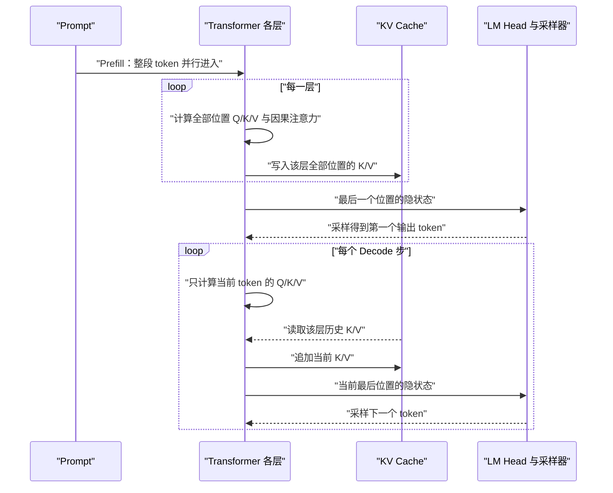

## 核心

Transformer 的核心不是“把词换成另一个词向量”，而是让每个位置按当前需要，从整段前缀中动态检索并汇总信息；大模型推理优化的核心，则是分清哪些中间结果会变化、哪些可以安全复用，并把后者保存在离计算足够近的地方。

1. Table of Contents, ordered
{:toc}

## Transformer 改变的是序列中的信息流动方式

自然语言模型首先要把离散符号变成可以计算的连续向量。早期方法用高维稀疏向量表示词，Word2Vec 等静态词向量把它压缩成低维稠密表示，但同一个词在所有句子中的初始表示仍然相同。随后，RNN、ELMo 和 Transformer 开始根据上下文生成**动态表示（同一个词在不同句子里得到不同的隐状态）**。

RNN 与 Transformer 都能让一个位置吸收上下文信息，区别在信息传递路径：

- RNN 在时间步 $t$ 计算隐状态 $h_t$ 时，必须等待 $h_{t-1}$，信息沿序列逐步传递。
- Transformer 的一层自注意力让每个位置直接读取允许范围内的其他位置，同一层的所有位置可以组织成大矩阵并行计算。

这既缩短了长距离信息的路径，也更适合 GPU 的矩阵运算。原始 [Transformer 论文](https://arxiv.org/abs/1706.03762)正是以机器翻译为任务，用纯注意力结构替代循环与卷积，并将更强的训练并行性作为主要优势之一。

### 输入既要表达“是什么”，也要表达“在哪里”

设一句话被分成 $n$ 个 token，模型宽度为 $d_{model}$。查嵌入表后得到的输入矩阵为：

$$
X \in \mathbb{R}^{n \times d_{model}}
$$

纯粹的自注意力不自带顺序概念，所以输入还必须包含位置信息。原始 Transformer 使用正弦位置编码，很多后续模型使用可学习位置嵌入、RoPE 或相对位置方案。具体实现不同，但目的相同：让模型能区分“我爱她”和“她爱我”。

位置表示与 token 表示合成后，每一行仍对应一个位置。Transformer 层通常保持序列长度与模型宽度不变，使输出可以继续送入下一层；变化的是每一行所携带的上下文信息。

## Q、K、V 把注意力变成可学习的信息检索

自注意力可以理解为一次“按当前需求检索上下文”的过程。对于某一层、某一个注意力头，输入 $X$ 经过三组可学习投影：

$$
Q=XW^Q,\qquad K=XW^K,\qquad V=XW^V
$$

三个角色分别回答不同问题：

- **Query**：当前位置正在寻找什么信息；
- **Key**：每个位置以什么特征供别人匹配；
- **Value**：一旦被选中，这个位置实际贡献什么内容。

原始表示 $X$ 是通用信息，三组矩阵把它投影到不同子空间。这样不仅能把“如何匹配”和“传递什么”分开，还能表达非对称关系：动词寻找宾语的强度，不必等于宾语寻找动词的强度。

### 从匹配分数到上下文表示

缩放点积注意力为：

$$
A=\operatorname{softmax}\left(\frac{QK^T}{\sqrt{d_k}}+M\right),\qquad Z=AV
$$

其中：

- $QK^T$ 产生形状为 $n\times n$ 的匹配分数矩阵；
- $\sqrt{d_k}$ 防止维度增大时点积幅度过大；
- $M$ 是可选掩码，因果模型用它屏蔽未来位置；
- Softmax 沿“可读取的 key 位置”归一化，让每个 query 得到一组权重；
- $Z$ 是所有 Value 的加权组合，而不是当前位置原来那个 $V$。

Softmax 在这里与词表输出层扮演相似的数学角色：把一组实数分数变成和为 1 的权重。但两者的归一化对象不同。注意力里的 Softmax 在序列位置之间分配注意力，输出层的 Softmax 则在词表候选之间形成下一个 token 的概率分布。

注意力输出也不会直接覆盖输入。完整子层还包含输出投影、残差连接、归一化和前馈网络。以简化写法表示：

$$
H=\operatorname{Norm}\left(X+\operatorname{MHA}(X)\right)
$$

因此同一位置的表示是在保留原信息的基础上逐层加入上下文。各实现采用 Pre-Norm 或 Post-Norm 时，归一化的具体位置会不同。

### 权重按位置共享，按层独立

同一层、同一个头中的 $W^Q$、$W^K$、$W^V$ 会用于序列中的所有位置。共享的是加工规则，不是计算结果：不同 token 和位置产生不同的 $X$，自然得到不同的 Q、K、V。参数共享让模型能够处理变长序列，并学习不依赖固定位置的语言规律。

层与层之间则通常不共享这组参数。若第一层输出为 $X_1$，第二层会使用自己的权重：

$$
Q_2=X_1W^Q_2,\qquad K_2=X_1W^K_2,\qquad V_2=X_1W^V_2
$$

这可以概括为**参数独立、信息依赖**：每层学习自己的检索规则，同时在上一层已经融合过的表示上继续加工。

### 多头不是把原始输入机械切碎

假设 $d_{model}=512$、头数为 8，每个头的维度通常为 64。逻辑上，可以把每个头看成拥有独立的 $512\times64$ 投影矩阵；工程上常把 8 个小矩阵拼成一个 $512\times512$ 大矩阵，一次矩阵乘法后再 reshape 成 8 个头。

每个头都能读取完整输入 $X$，只是各自产生较短的 Q、K、V。真正构成“多头”的不是第一步大矩阵乘法，而是后续每个头分别执行 QK 匹配、掩码、Softmax 和 Value 汇总。各头拥有独立的注意力分布，最后把结果拼接并乘输出矩阵 $W^O$：

$$
\operatorname{MHA}(X)=\operatorname{Concat}(Z_1,\ldots,Z_h)W^O
$$

这带来多个并行的信息检索子空间。需要特别纠正的是：多头不是“让每一段特征维度分别做 Softmax”，Softmax 仍然沿每个 query 可访问的 **token 位置**进行。

## Encoder、Decoder 与 Decoder-only 是三种信息可见性设计

原始 Transformer 是 Encoder-Decoder 架构：

- Encoder 使用双向自注意力，输入中的每个位置可以读取整段输入；
- Decoder 使用因果自注意力，只能读取当前及更早的输出位置；
- Decoder 还通过 Cross-Attention 读取 Encoder 输出的整段隐状态，而不是把输入压缩成单一“语义球”。

BERT 一类模型主要保留 Encoder，适合理解、分类和标注；GPT 一类模型主要堆叠带因果掩码的 Decoder block，去掉独立 Encoder 与 Cross-Attention，把 Prompt 和 Completion 串成同一个 token 序列，将翻译、问答、总结和代码生成统一为“给定前缀预测下一个 token”。[GPT-3 论文](https://arxiv.org/abs/2005.14165)展示了这种自回归目标在规模扩大后产生的零样本、单样本和少样本任务适应能力。

不过，“Decoder-only 成为通用 LLM 的主流”更适合解释为目标统一、扩展经验、上下文学习和工程简化共同作用的结果，而不是由某个单一数学定理推出。Encoder-Decoder 仍可用于翻译、语音、多模态转换等任务；因果注意力矩阵是下三角结构，也不等于“天然低秩”——下三角矩阵完全可能是满秩的。

另一个常见误解是把 Decoder-only 处理 Prompt 描述成双向注意力。因果掩码在 Prefill 时仍然存在：第 $i$ 个 Prompt token 只能看见位置 $1\ldots i$。只是最后一个 Prompt 位置已经能够汇总整个前缀，所以足以预测第一个输出 token。

## Transformer 的并行优势主要发生在训练和 Prefill

“Transformer 可以并行”与“LLM 必须逐 token 生成”并不矛盾，它们描述的是不同阶段。

训练时，完整的目标序列已知。模型把所有 token 一次送入，通过因果掩码防止每个位置偷看未来答案；所有位置的计算仍可组织成矩阵并行执行，每个位置的输出都用于计算 next-token loss。这种做法常被称为 Teacher Forcing。

推理时，未来 token 尚不存在。第 $t+1$ 个 token 的输入依赖第 $t$ 个 token 的实际采样结果，因此不同生成步之间仍然串行。Transformer 消除了 RNN 在**同一已知序列内部**的时间步依赖，却没有消除自回归任务在**未知输出之间**的因果依赖。

| 阶段 | 已知 token | 位置间执行方式 | 主要输出 |
| --- | --- | --- | --- |
| 训练 | 输入与目标序列都已知 | 因果掩码下并行计算所有位置 | 每个位置的 loss |
| Prefill | 整段 Prompt 已知 | 并行处理 Prompt 的所有位置 | 首个输出 token + 各层 KV Cache |
| Decode | 只有已生成前缀 | 生成步之间串行；请求和头内部仍可批量并行 | 每步一个新 token |

## Prefill 建立记忆，Decode 逐步消费并扩展记忆

在在线推理中，一次请求通常分为两个阶段：

1. **Prefill（预填充）**：并行处理 Prompt，建立每层、每个 Prompt token 的 K/V 状态，并用最后位置的最终隐状态预测第一个输出 token；
2. **Decode（解码）**：每次只处理最新 token，读取历史 K/V，生成下一个 token，再把最新 K/V 追加进缓存。

### 为什么 Prefill 要计算所有 Prompt 位置

如果推理只使用最后一个位置的词表概率，似乎可以只计算注意力矩阵的最后一行。但多层网络使这个捷径不可行：第二层最后位置要读取第一层各历史位置的 K/V，而这些 K/V 又依赖第一层为各位置算出的上下文表示。因此 Prefill 必须逐层建立所有 Prompt 位置的状态。

把 Prompt 一次组成大矩阵还有硬件收益。它能复用模型权重并提高算术强度，使 GPU 更容易被计算填满。前面位置产生的词表预测在推理时通常不需要，但它们的层间隐状态和 K/V 并不是无用副产品。

### Decode 的注意力矩阵从方阵退化成一行

Prompt 长度为 $n$ 时，Prefill 的某层注意力分数是带因果掩码的 $n\times n$ 矩阵。进入 Decode 后，若当前总长度为 $t$，该层只需要让当前 query 与 $t$ 个 key 匹配，分数形状为 $1\times t$：

$$
z_t=\operatorname{softmax}\left(\frac{q_tK_{1:t}^T}{\sqrt{d_k}}\right)V_{1:t}
$$

历史位置之间的注意力权重不再计算，也不需要缓存，因为那些位置已经完成了自己的前向传播。下一步会出现新的 $q_{t+1}$，它需要的是可被重新查询的 $K_{1:t}$ 和可被汇总的 $V_{1:t}$。

## KV Cache 缓存的是中间状态，不是模型参数或答案

KV Cache 保存每一层历史 token 经过该层投影后得到的 K 和 V。它不保存：

- 固定模型权重 $W^Q$、$W^K$、$W^V$；
- 历史 Q，因为过去的查询不会在后续生成步再次使用；
- $QK^T$ 产生的注意力权重，因为新 query 会产生新的权重；
- 最终答案或词表概率。

逻辑上，一份标准 KV Cache 可近似看成：

$$
[L,\ 2,\ B,\ H_{kv},\ T,\ d_h]
$$

其中 $L$ 是层数，2 表示 K/V，$B$ 是 batch，$H_{kv}$ 是 KV 头数，$T$ 是已处理序列长度，$d_h$ 是头维度。实际内存布局会因框架、并行策略和 kernel 而变化。

若每个元素占 $s$ 字节，缓存量级近似为：

$$
M_{KV}=2LBTH_{kv}d_hs
$$

因此上下文越长、并发越高，KV Cache 越可能成为显存容量与带宽瓶颈。Multi-Query Attention 和 Grouped-Query Attention 通过让多个 Query 头共享较少的 KV 头，直接减小 $H_{kv}$；KV 量化、滑动窗口、稀疏注意力和分层卸载则从精度、长度、读取范围或存储层级上减轻压力。

### KV Cache 改变的是每一步重算范围

没有缓存时，每生成一个 token 都要重新前向计算整个前缀；仅看标准密集注意力，长度为 $t$ 的完整前缀会产生 $t\times t$ 的工作。使用缓存后，本步只为新 token 计算投影，并让一个 query 读取 $t$ 个历史 key/value，注意力部分降为线性于当前上下文长度。

因此“从 $O(n^2)$ 变为 $O(n)$”必须注明是**单个 Decode 步的注意力工作量**。生成一整段长度不断增长的输出时，每一步仍要读取更长的 KV，累计注意力工作仍会随输出长度呈二次增长。KV Cache 用显存容量和带宽换掉了大量重复计算，并没有让长上下文注意力变成常数成本。

KV Cache 通常放在 GPU HBM 中，因为 Decode 对访问延迟和带宽敏感。它也可以分层放到 CPU 内存、远端内存或 SSD，但“存得下”不等于“取得够快”；是否值得卸载取决于命中率、传输带宽、批量大小与重算成本。

## PagedAttention、Prefix Caching 与 RadixAttention 解决不同问题

普通 KV Cache 解决的是**同一条生成路径内**的重复计算，服务系统还要面对动态长度、显存碎片和跨请求重复前缀。

### PagedAttention 管的是内存布局

传统连续分配往往按最大长度为每个请求预留空间，实际短输出会造成内部浪费，不同生命周期又会形成外部碎片。[vLLM 的 PagedAttention 论文](https://arxiv.org/abs/2309.06180)借鉴虚拟内存分页，把逻辑连续的 KV 序列映射到不连续的物理块：

- 按需分配固定大小的 KV block；
- 一个请求的物理块无需连续；
- beam search、parallel sampling 等分支可引用共享块；
- 请求结束后以块为单位回收。

PagedAttention 首先解决**如何高效存放和共享 KV 块**。它为前缀复用提供了便利基础，但“找到一个旧前缀并决定复用”仍需要额外索引与淘汰策略。

### Prefix Caching 管的是跨请求复用

Prefix Caching 保存已完成请求的前缀 KV。当新请求拥有完全相同的 token 前缀时，可以直接引用对应 K/V，跳过这部分 Prefill 计算。

“相同”不是语义相似，而是影响隐状态的条件一致：token、顺序、位置、模型权重、LoRA/Adapter、多模态输入等都必须纳入缓存身份。vLLM 的[自动前缀缓存设计](https://docs.vllm.ai/en/v0.9.1/design/automatic_prefix_caching.html)按“此前缀 + 当前块 token”计算块哈希，并用全局哈希表定位物理 KV block；SGLang 的 [RadixAttention](https://arxiv.org/abs/2312.07104)则用基数树组织共享前缀与分支。二者目标相近，但索引结构不同，不能把 RadixAttention 当成 PagedAttention 的另一个名字。

Prefix Caching 主要缩短重复前缀的 Prefill 和 TTFT，不会消除新 token 的 Decode。它尤其适合共享长 System Prompt、固定 few-shot 示例、公共文档前缀或多分支生成。

### 命中前缀不会把后续答案锁死

KV Cache 是“历史素材”，不是“下一个 token 的最终结果”。同一精确前缀在模型权重与数值环境相同的情况下，会产生相同 logits；但采样器仍可能因 temperature、top-k、top-p 和随机种子选择不同 token。一旦某一步选择不同，后续 token 序列和新增 KV 就分叉。

如果两个请求碰巧继续生成完全相同的 token 前缀，系统理论上还能共享这段 KV；但模型仍要先决定下一 token 是否相同。对于完全确定且重复的请求，应用层 Response Cache 直接返回完整答案，通常比让模型重新执行采样更划算。

## 推理系统优化是在不同瓶颈间做资源交换

Prefill 一次处理多 token，模型权重可被较高程度复用，通常表现为较高算术强度；小 batch Decode 每步只处理一个新 token，却反复读取模型权重和不断增长的 KV，往往更容易受显存带宽限制。这是常见趋势，不是对所有模型、batch、硬件和上下文长度都成立的定律。

围绕这两个阶段，优化可以放在不同层次：

| 层次 | 技术 | 主要目标 | 没有解决的事 |
| --- | --- | --- | --- |
| 模型计算 | KV Cache | 避免 Decode 重算历史 K/V | 不减少历史 KV 的读取长度 |
| 模型结构 | MQA/GQA、局部注意力 | 减少 KV 体积或读取范围 | 可能改变精度与模型能力 |
| 内存管理 | PagedAttention | 降低碎片、提高动态分配与共享效率 | 不自动判断业务前缀是否值得保留 |
| 缓存策略 | Prefix Caching、RadixAttention | 跳过重复前缀的 Prefill | 不直接加速新 token 的 Decode |
| 调度 | Continuous Batching、Chunked Prefill | 提高利用率、控制 Prefill 对 Decode 的干扰 | 参数依赖具体工作负载 |
| 集群架构 | PD 分离 | 独立调优 TTFT 与 TPOT/ITL | 引入 KV 传输、路由与容量规划成本 |
| 应用架构 | 计算下推 | 让检索、过滤、压缩靠近数据，减少搬运 | 与 Transformer 内部缓存正交 |

### PD 分离把两种工作负载交给不同实例

PD 分离（Prefill-Decode Disaggregation）让 Prefill 实例完成 Prompt 前向计算，再把 KV Cache 传给 Decode 实例继续生成。它可以：

- 分别为 TTFT 和 TPOT/ITL 选择并行度、batch 和资源数量；
- 避免突发长 Prefill 阻塞正在流式输出的 Decode；
- 根据“长输入短输出”或“短输入长输出”独立扩缩容两类实例。

[DistServe](https://arxiv.org/abs/2401.09670)的实验说明，在合适的高速互联、放置策略和 SLO 目标下，解耦可以提高满足延迟约束的 goodput；但这不是无条件的吞吐增益。当前 vLLM 的[官方说明](https://docs.vllm.ai/en/stable/features/disagg_prefill/)也明确把它定位为分别调优 TTFT、ITL 和控制尾延迟的实验性能力，并提醒其实现本身不提升吞吐。KV 传输开销、网络拓扑和负载分布决定了分离是否值得。

“计算下推”则属于更一般的分布式系统原则，例如在 RAG 中让存储侧先完成过滤、重排或上下文压缩，减少跨网络搬运。它可以与推理服务协同，但并不是 QKV、KV Cache 或 PD 分离自然推出的同一个机制。

## 评价

### 写得好的地方

最清晰的部分，是用同一套张量与信息流解释从 QKV 到推理服务的连续链路：先说明一个位置如何查询上下文，再说明多层网络为什么需要保留所有位置的中间状态，最后自然推出 KV Cache、Prefix Caching 和 PD 分离。这样能够把模型公式与 Serving 系统连接起来，避免把注意力、缓存和调度理解成互不相关的技巧。

文章还明确区分了几组容易混淆的概念：参数与中间结果、训练并行与生成串行、Prefill 与 Decode、普通 KV Cache 与跨请求前缀复用、PagedAttention 的内存布局与 Prefix Caching 的索引策略。公式、形状变化、时序图和复杂度边界互相补充，比只记忆结论更容易迁移到具体模型和推理框架。

### 可以改进的地方

为了维持从模型原理到系统优化的主线，文章只概括了 RoPE、Pre-Norm、MQA/GQA、KV 量化、稀疏注意力和计算下推，没有展开它们的公式、精度影响与实现差异。若用于实际选型，还需要结合具体模型结构、推理框架、硬件拓扑和请求分布分别测量。

部分边界还可以进一步形式化：例如分别计算带缓存与不带缓存时投影层、Attention 和 MLP 的 FLOPs，推导不同 batch 下的算术强度，并量化 KV 传输对 PD 分离收益的影响。当前的复杂度分析主要用于建立直觉，不能替代端到端性能模型。

此外，显存占比、吞吐提升、KV Cache 是否大于模型权重，以及某种 GPU 是否更适合某阶段，都强依赖模型结构、精度、上下文、batch、硬件与框架版本。任何固定倍数都应附带实验条件；更完整的工程版本还应加入可复现实验、监控指标和容量规划示例。
