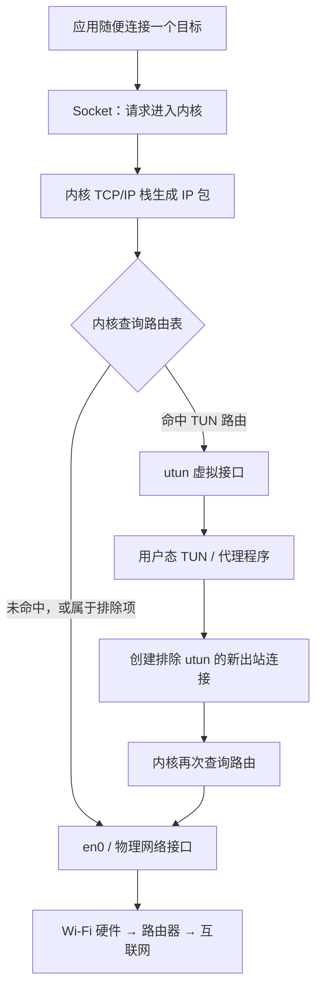

1. Table of Contents, ordered
{:toc}

在 Mac 上打开代理软件后，Chrome 已经能访问外网，某些终端命令却仍然超时。它们使用的是同一块 Wi-Fi 网卡，为什么会有两种结果？

因为“打开代理”其实包含两件不同的事：

1. **接管流量：**先让某个软件的网络连接进入代理程序。
2. **处理流量：**代理程序再根据规则决定直连，还是转发给远程代理节点。

Clash 的 `DIRECT`、`PROXY` 和分流规则解决的是第二件事。系统代理和 TUN 的根本区别，则在第一件事：**它们用不同的方法把流量交给代理程序。**

## 先看一条没有代理的网络连接

浏览器、终端和代理软件都是普通应用。它们运行在**用户态**，可以发出“连接某个地址”的请求，但不能自己操作 Wi-Fi 芯片。

真正创建 TCP 连接、查找路由和调用网卡驱动的是 macOS **内核**。内核为应用提供 Socket 接口，再把数据交给物理网卡。在这台 Mac 上，当前的 Wi-Fi 接口名为 `en0`。

一条普通直连路径可以写成：

```text
用户态：浏览器或其他应用
              ↓ Socket 系统调用
内核态：TCP/IP 协议栈 → 路由选择 → en0 驱动
              ↓
硬件：  Wi-Fi 芯片 → 路由器 → 互联网
```

如果没有其他机制介入，应用只要把目标地址交给内核，内核就会沿默认路由把数据发向 `en0`。“这条连接要不要先交给代理”，正是系统代理和 TUN 插手的地方。

## 系统代理：请应用主动走一条绕路

所谓“系统代理”，本质上是 macOS 保存的一组配置：HTTP、HTTPS 或 SOCKS 代理在哪个地址和端口上。它更像一块指路牌，而不是拦路关卡。

支持系统代理的应用会先读取这组配置。假设配置写的是 `127.0.0.1:10080`，浏览器本来想连接某个网站，现在会改为连接本机 `10080` 端口上的代理程序。

`127.0.0.1` 表示“这台电脑自己”。内核会通过回环接口 `lo0` 把数据交给本机另一个进程，数据不会进入 Wi-Fi 芯片。代理程序收到请求后，再创建一条新的出站连接：

```text
应用（用户态）
  → lo0 回环网络（内核态）
  → 代理程序（用户态）
  → en0 与网卡驱动（内核态）
  → Wi-Fi 硬件
```

这里的重点是：**是应用自己改变了连接目标。**如果某个软件不读取系统代理，它仍会把真实网站地址交给内核，内核也会照常通过 `en0` 直接发送。系统代理没有能力强迫它改道。

这就解释了为什么浏览器通常能走代理，而自带网络栈的软件、某些命令行工具或游戏可能直连。终端里的 `HTTP_PROXY`、`HTTPS_PROXY` 和 `ALL_PROXY` 也是同类思路：它们只对愿意读取这些变量的程序有效。

## TUN：让内核路由把数据包送给代理

TUN 的思路不同。它不再等待应用读取代理配置，而是在系统中创建一个虚拟网络接口，然后安装相应的路由规则。在 macOS 上，这类接口通常显示为 `utun0`、`utun1` 等。

> **关键理解：TUN 不是接管整个内核，而是注册一块虚拟网卡，并修改路由，让内核主动把匹配的 IP 包交给它。**
{: .prompt-info }

应用此时不需要知道代理存在。它仍然尝试连接真实目标，但数据进入内核后，路由结果变成了 `utun`，而不是直接去 `en0`。内核随后把 IP 数据包交给用户态的隧道程序。

**区别发生在内核查路由的时候。**

> **TUN 的接管逻辑**
>
> 你随便向哪个目标建立连接。<br>
> 只要目标命中我安装的路由，<br>
> `kernel` 就会把对应 IP 包送进我的虚拟接口。
{: .prompt-tip }



隧道程序读取数据包、识别它原本要去哪里，再执行直连或代理规则。它创建的出站连接必须被排除在 `utun` 之外，否则出站流量会被再次送回隧道，形成无限回环。

TUN 能够覆盖更多软件，不是因为它的分流规则更高级，而是因为**做决定的已经不是应用，而是内核路由**。只要流量命中这些路由，应用即使完全不支持 HTTP 或 SOCKS 代理，数据包也会进入隧道。

## 把三条路径放进同一张图

下图把“遵循系统代理”、“忽略系统代理”和“被 TUN 接管”放在相同的用户态、内核态和硬件层级中。顺着一列往下看是一条完整链路，横向比较则能看到三者在哪一层开始分叉。


三条路径的差异可以压缩成三句话：

```text
应用遵循系统代理：应用主动连接 lo0 上的本机代理
应用忽略系统代理：内核按普通路由直接送往 en0
TUN 接管：             内核路由先送往 utun，再交给代理
```

在前两条路径中，应用是否配合决定了代理能否看到流量。在第三条路径中，应用的选择被下方的内核路由取代了。

## lo0、utun 和 en0 分别是什么

macOS 会把物理网卡和虚拟接口都列在 `ifconfig` 的输出中，因此看到“接口”并不等于看到了一块真实网卡。

| 接口 | 它是什么 | 数据被送到哪里 | 是否使用物理硬件 | 在代理中的常见作用 |
|---|---|---|---|---|
| `lo0` | 内核回环接口 | 同一台 Mac 上的另一个进程 | 否 | 让应用连接本地 HTTP/SOCKS 代理 |
| `utunN` | 三层点对点虚拟接口 | 用户态 VPN 或隧道程序 | 否 | 在 IP 层把流量交给 TUN 核心 |
| `en0` | 某个实际网络设备的系统接口 | 路由器或局域网设备 | 是 | 承担直连和代理连接的最终外部传输 |

### lo0：本机内部的网络通道

`lo0` 是 loopback interface，常见地址是 IPv4 的 `127.0.0.1` 和 IPv6 的 `::1`。它由内核实现，没有网线、无线电和独立芯片。

当浏览器连接 `127.0.0.1:10080` 时，它不是直接调用代理程序里的函数，而是发起了一次真实的本机 TCP 通信。数据从浏览器进入内核，经过 `lo0` 后，再被交给监听 `10080` 端口的代理进程。这就完成了一次“用户态 → 内核态 → 用户态”的往返。

### utun：内核路由与隧道程序的交接点

`utun` 常由 macOS Network Extension、VPN 或 Packet Tunnel Provider 创建。它通常工作在 IP 层，没有真实的 MAC 地址、网线或无线电。

> **TUN 与 `utun` 的区别：**TUN 是这类三层虚拟网络接口的通用概念；`utun` 是 Apple 的具体实现。[Apple XNU 源码](https://github.com/apple-oss-distributions/xnu/blob/main/bsd/net/if_utun.c#L30-L33) 将它称为 **user tunnel（用户态隧道）**：它把内核中的网络接口和用户态程序使用的 kernel control socket 连接起来。
{: .prompt-info }

`utun` 的价值不在于“把数据发上网”，而在于给内核路由提供一个可选的虚拟出口。数据包被送到这里后，用户态的隧道程序就能读取和处理它。

系统中存在 `utun0`、`utun1` 或更多编号，只能说明某些网络扩展创建了虚拟接口。**只看到 `utun` 并不能证明某个代理正在接管流量**；还要看路由是否指向它，以及对应的 Network Extension 是否在运行。

### en0：数据真正离开 Mac 的出口

`en0` 是 macOS 给某个实际网络设备分配的接口名。在这台 Mac 上，`en0` 对应 Wi-Fi；在其他机器或硬件配置中，它不一定永远表示 Wi-Fi。

数据到达 `en0` 后，内核会进行链路层封装并调用驱动，最后由 Wi-Fi 芯片或对应硬件发送给路由器。`utun` 不会替代 `en0`：前者只是虚拟交接点，代理处理完后的数据通常仍然要借助 `en0` 离开机器。

## DIRECT 和 PROXY 发生在流量被接管之后

无论流量是通过系统代理还是 TUN 进入 Clash，Clash 都会根据域名、IP、端口等条件执行分流规则。

- `DIRECT` 表示 Clash 自己创建到目标服务器的连接。
- `PROXY` 表示 Clash 先连接远程代理节点，由节点再访问目标。

因此，“直连”有两种不同语境：一种是应用根本没有进入 Clash，自己直连；另一种是流量已经进入 Clash，然后被规则判定为 `DIRECT`。只有后者受 Clash 规则控制。

## TUN 也不是没有边界的“全流量黑洞”

“TUN 接管所有流量”是方便理解的近似说法，不是严格承诺。它能看到哪些流量，仍然取决于路由表和具体实现。以下流量常常会被排除或需要单独处理：

- 局域网、链路本地地址、组播和 mDNS；
- 代理核心自身的出站连接；
- 未被配置覆盖的 IPv6、DNS 或 UDP；
- 明确绑定某个物理接口的软件；
- 被其他 VPN 或 Network Extension 优先处理的流量。

TUN 覆盖更广，也因此更复杂。它要处理 DNS、IPv6、UDP、防回环路由和用户态连接状态，通常需要更高权限，也更容易和公司 VPN、安全软件或其他网络扩展发生冲突。

## 这台 Mac 上的 PandaFan 属于哪一种

对当前系统的检查显示，PandaFan 启动了自带的 Clash 核心，并把 macOS 系统代理指向以下本地端口：

- HTTP 和 HTTPS：`127.0.0.1:10080`
- SOCKS：`127.0.0.1:10081`
- Clash 控制接口：`127.0.0.1:10079`

它的 Clash 配置处于 `rule` 模式，`tun_mode` 为 `false`。IPv4 默认路由仍然指向 Wi-Fi 接口 `en0`。这些信息合在一起说明：**PandaFan 当前使用的是系统代理，而不是 TUN。**

因此，它的实际工作过程是：

1. 浏览器等支持系统代理的应用，通过 `lo0` 连接 PandaFan 的本地端口。
2. PandaFan 内的 Clash 根据规则选择 `DIRECT` 或 `PROXY`。
3. Clash 创建新的出站连接，最终通过 `en0` 和 Wi-Fi 硬件离开 Mac。
4. 不读取系统代理的软件，可能绕过 PandaFan 直接走 `en0`。

系统中存在多个 `utun` 接口，不代表 PandaFan 正在使用它们。此前安装的 V2BOX 网络服务仍有注册信息，但状态为 `Disconnected`；Clash Verge Rev 也留有 root helper 和部分配置文件。它们当前没有监听 PandaFan 使用的端口，不是此刻的流量接管者，但从完全卸载的角度看仍属于可清理残留。

## 怎么选系统代理和 TUN

选择的核心是覆盖范围与复杂度之间的取舍。

| 需求 | 更合适的方式 | 原因 |
|---|---|---|
| 浏览器和常规桌面应用 | 系统代理 | 轻量、行为直观，与 VPN 或局域网的冲突较少 |
| CLI、游戏、UDP 或不支持代理的软件 | TUN | 不需要应用主动读取代理配置 |
| 必须让大多数连接经过统一规则 | TUN | 接管点在内核路由层，覆盖更广 |
| 同时使用公司 VPN 或复杂局域网 | 优先系统代理 | 对路由、DNS 和 Network Extension 的改动更少 |

整套机制可以用三个接口记忆：**`lo0` 让应用找到本机代理，`utun` 让内核路由找到用户态隧道，`en0` 让最终数据真正离开 Mac。**系统代理依赖应用主动走向 `lo0`，TUN 则通过内核路由把流量导向 `utun`；这就是一个可能漏掉软件，另一个能覆盖更多软件的原因。
