1. Table of Contents, ordered
{:toc}

> 本文讨论的是最常见的两类实现：**三层路由型企业 VPN**，以及会终结 TCP/UDP 会话的连接型代理。VPN 也可能使用二层 TAP、服务端 NAT 或应用级隧道；这些变体不会改变本文关于“捕获入口、路由裁决和代理接力”的主线，但不能把下文每个包头细节无条件套到所有产品上。
{: .prompt-info }

## 一个问题，一张地图

故事从一个具体的现象开始。访问某公司的内部站点 `hr.example.com`，浏览器一直转圈，最后超时。用 `dig` 查这个域名，结果是 `10.88.128.45`——一个内网 IP，而且换 Google、Cloudflare、国内公共 DNS 查，全世界都是同一个答案。连上公司 VPN，站点秒开；而我们平时翻墙用的却是代理。

VPN 和代理用起来都是“打开一个开关，流量就被劫走了”。**既然都是劫持流量，两者的区别到底在哪？** 这就是本文要拆开的问题。

文章分两部分组织：先用五节把基础知识拉齐——怎么拆一个网络包、VPN 和代理各自怎么抓到流量、抓到之后又分别怎么处理；再用三个现实问题逐一印证这些知识：开头这个打不开的网站、代理和 VPN 同时开时包去哪、以及一次完整的真机检查。

## 基础一：先学会拆一个包：三层和四层

一个网络包是层层套娃的结构：

```text
┌────────── IP 头（三层）──────────┐┌─────────── TCP 头（四层）────────────┐┌────────┐
  源IP   = 你家宽带IP                 源端口   = 54321（你浏览器开的随机端口）   真正要
  目标IP = 网站服务器IP               目标端口 = 443（对方 nginx 监听的端口）    发的数据
  ↳ 管“哪台机器到哪台机器”            ↳ 管“机器上哪个程序到哪个程序”
```

- **三层（IP 层）** 只关心机器到机器：路由器的全部工作就是看 IP 头里的目标地址，把包往那个方向扔。
- **四层（TCP 层）** 关心程序到程序：包到了目标机器后，内核按端口号把数据交给监听对应端口的进程；序列号等机制保证传输可靠，一条条“连接”在这一层建立。

顺便记住一个后面要用的机制：一台机器只有一个 IP，却能同时跑几百个联网程序，靠的是四层的多路复用——每条 TCP 连接由 `(源IP, 源端口, 目标IP, 目标端口)` 这个**四元组**唯一标识，内核维护一张连接表，收到包按四元组找到对应的 socket，把数据交给持有它的进程。

有了这把解剖刀，就可以分别看看 VPN 和代理怎么抓流量、抓到之后又怎么处理了。

## 基础二：捕获流量的两种方式：应用自觉和路由接管

不管是 VPN 还是代理，要“劫”到流量，办法总共只有两种：**让应用自己把连接交过来**（应用层），或者**在路由层把包截走**（内核层）。注意，这是两种中性的技术手段，跟“代理还是 VPN”并不绑定——马上就会看到，代理两种都会用。

**方式一：应用自觉。** 本地代理（Clash、V2Ray 等）在 `127.0.0.1:7890` 开了个端口等着，应用**主动**把连接交给它：浏览器读系统代理设置、命令行读 `http_proxy` 环境变量。操作系统内核对此一无所知。哪个应用走代理由应用自己决定，所以总会遇到“明明开了代理，某个命令行工具就是不生效”的情况——它根本不读代理配置。

**方式二：路由接管。** 在系统里创建一块**虚拟网卡**（TUN 设备），再往路由表里塞条目：“`10.0.0.0/8` 的流量从这个虚拟网卡走。”之后内核自动把匹配的 IP 包导向隧道，应用程序完全无感知——任何软件、任何协议都被接管，不需要配合。**VPN 用的是这种方式；代理的 TUN 模式用的也是它。**

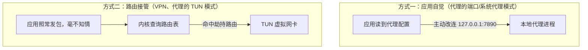

两种方式的脾气不同：路由接管全局透明，任何软件、任何协议（包括 UDP、ICMP）都被接管；应用自觉依赖应用配合，覆盖可能漏网。

还有一个新手最容易忽略的区别，值得单独强调：**两种方式不只是“从哪拿到包”不同，拿到手的包里面装着的东西也不同——一个主动，一个被动，信息天然不对等。**

- **应用自觉是主动的、有协商的。** 应用知道自己在用代理，会按代理协议的格式跟代理对话——以 HTTP 代理为例，连上端口后的第一句话就是明文的 `CONNECT google.com:443`，目标域名白纸黑字写在协议里。代理收到的是一封按格式写好的“委托书”。
- **路由接管是被动的、无协商的。** 应用根本不知道代理的存在，照旧发普通上网包——从三层头到四层头再到数据，通篇没有一个字段写域名。代理收到的是一个面单上只有 IP 地址的“普通包裹”。

所以别以为“两种方式只是获取包的渠道不同、包是一样的”——**包从一开始就不一样**。这个信息差会在后文反复冒头：代理按域名分流的前提是“看得见域名”，所以走 TUN 入口的流量要靠 fake-ip、SNI 嗅探把域名找补回来（“两个入口”一节和下篇都会展开）。

### 代理的两种模式：系统代理与 TUN

对应这两种捕获方式，代理有两种用法——这也是日常用代理时最常困惑的地方。

**系统代理：一块公告栏。** “系统代理”不是什么特殊机制，只是操作系统提供的一块公告栏：你在系统设置里填上 `127.0.0.1:7890`，这个值存在系统配置里（macOS 的网络偏好设置、Windows 的注册表）。守规矩的应用（Chrome、Safari、大部分 GUI 软件）联网前读一下公告栏：“哦，系统说有代理，那我连代理去。”不守规矩的应用根本不读，照样直连。系统本身**不做任何拦截和强制**，纯粹是“地址贴在这儿，爱用不用”——所以系统代理 = 普通代理 + 注册公告栏，代理软件本身没有任何区别。终端命令不生效的原因也在这里：它不读公告栏，最多认 `HTTP_PROXY`、`HTTPS_PROXY` 这类环境变量，而环境变量同样只对愿意读取它们的程序有效。

**TUN 模式：在路由层骗来全部流量。** TUN 模式不再等待应用自觉，而是使用和 VPN 相同的手法：创建虚拟网卡、修改路由表，让内核把 IP 包送进代理程序。应用照常发包、照常以为自己在直连目标，包在内核查路由时被导向 `utun`。

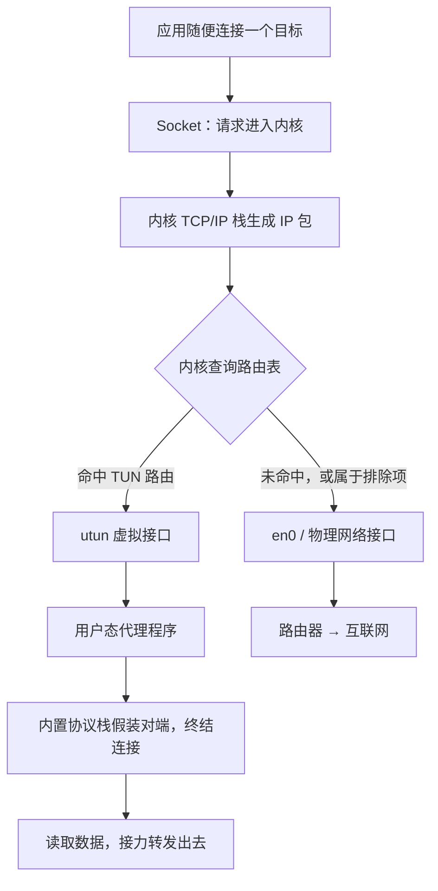

收到包后，代理程序内置一个**用户态 TCP/IP 协议栈**，假装自己就是目标服务器，跟应用完成 TCP 握手，然后从 IP 头读出真实目标、从 TCP 流读出数据——之后的处理和系统代理收到连接后一模一样（接力转发的完整过程在基础四展开）。所以 TUN 模式 = 应用级代理 + 一个“自动把所有应用骗过来”的捕鼠夹。它覆盖更广，不是因为分流规则更高级，而是因为做决定的不是应用，是内核路由。

macOS 上这三条路径涉及三类接口——`lo0`、`utun`、`en0`，它们是什么关系，接下来用三节专门讲。


| 接管方式 | 应用需要做什么 | 覆盖面 |
|---|---|---|
| 手动配置 | 每个应用单独填代理地址 | 配了才走 |
| 系统代理 | 读系统设置（自觉） | 只覆盖守规矩的应用 |
| TUN 模式 | 什么都不用做（无感知） | 几乎全部流量 |

> **系统代理和 TUN 不是互斥开关，技术上可以同时生效，但“能共存”不等于“永远没有副作用”。** 客户端界面上的“工作方式：代理模式 / 增强模式（TUN）”说的只是捕获流量的主力手段；很多客户端在 TUN 模式下仍会顺手写入系统代理。此时机器有两条入口：读公告栏的应用先连 `127.0.0.1:7890`，其他流量再由 TUN 从路由层兜底，两条路最终进入同一个代理内核和规则引擎。
>
> 两条入口的关键差别是**谁先做决定**。走系统代理时，浏览器先把“域名”交给代理，原始目标 IP 还没有进入系统路由表；如果代理把公司域名判成 `Proxy`，内核随后看到的只会是“代理核心 → 机场节点”的连接，公司 VPN 的 `10.0.0.0/8` 路由根本没有裁决机会。已经启用 TUN、又要和企业 VPN 共存时，关闭系统代理通常更可预测：应用统一按直连方式发包，再由路由表先把公司网段交给 VPN，其余流量交给代理 TUN。
>
> 判断机器实际开着哪几条入口，不能只看客户端界面：`scutil --proxy` 看系统代理公告栏，`netstat -nr` 看 TUN 路由。
{: .prompt-tip }

TUN 也不是没有边界的“全流量黑洞”：局域网地址、组播、代理核心自身的出站连接、未被配置覆盖的 IPv6/UDP，都可能被排除或需要单独处理；它还需要更高权限，更容易和公司 VPN、安全软件抢路由。另外代理软件必须把**代理服务器自己的 IP** 排除在 TUN 路由之外，否则发往服务器的包又被自己抓回来，形成死循环。

### TUN 到底是什么：内核和用户态之间的一根管子

前面反复说“创建虚拟网卡、修改路由表”，这根管子具体长什么样，值得拆开看。

TUN 的实现可以理解成内核和用户态程序之间的**一根双向管道**：

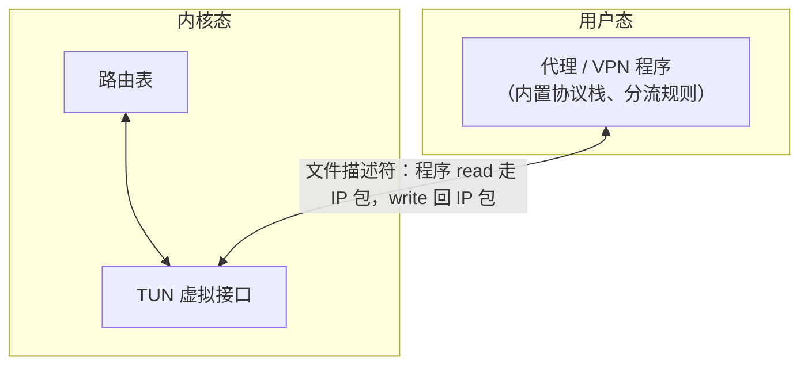

- **内核 → 用户态（程序 `read`）**：应用的包命中路由、被送进 TUN 接口后，内核不把它交给任何硬件，而是交给管道另一头的用户态程序——程序做一次 `read`，拿到的就是**完整的原始 IP 包**。
- **用户态 → 内核（程序 `write`）**：程序处理完后，可以把构造好的 IP 包 `write` 回管道，内核把它当作“从这个虚拟接口收到的包”，走正常协议栈处理。

所以 TUN 程序读写的是裸 IP 包，它必须自己在用户态实现（或借用）一套 TCP/IP 协议栈来终结连接——这就是前面“用户态协议栈假装对端”的底气来源。

### 为什么叫 utun：各平台的 TUN 叫什么名字

TUN 是“三层虚拟网络接口”的**通用概念**（搬运的是 IP 包；对应的二层概念叫 TAP，搬运的是以太网帧），但每个操作系统有自己的实现和名字。macOS 的 `utun` 意为 **user tunnel**（用户态隧道）——名字直译了“内核接口交给用户态程序”这件事；VPN、代理的 TUN 模式、iCloud 私有中继等都会创建 `utun` 接口，所以系统里躺着好几个 `utun0`、`utun1` 是常态。

| 平台 | 实现 | 接口名字 | 创建方式 |
|---|---|---|---|
| macOS / iOS | `utun`（user tunnel） | `utun0`、`utun1`… | Network Extension / kernel control socket |
| Linux | TUN/TAP 驱动 | `tun0`、`tap0` | 打开 `/dev/net/tun` 设备文件 + `ioctl` |
| Windows | Wintun（WireGuard 团队出品）或 TAP-Windows | 任意命名 | 加载对应驱动 |

> **只看到 `utun` 接口存在，并不能证明流量正被接管。** 接口只是交接点，流量走不走它，取决于路由表是否指向它、对应的网络扩展是否在运行。
{: .prompt-info }

### lo0、utun、en0：系统眼里它们都是网卡

理解了 TUN 之后，再回头看 macOS（Linux 同理）里那些接口，会发现内核视角下它们的地位完全平等：`ifconfig` 把物理网卡和虚拟接口**并列**列出，对内核来说它们都是“一张网卡”——有名字、有地址、可以配路由。区别只在两件事：**数据被送到哪里去**和**背后有没有真实硬件**。

| 接口 | 它是什么 | 数据被送到哪里 | 是否用物理硬件 | 在代理/VPN 中的角色 |
|---|---|---|---|---|
| `lo0` | 内核回环接口 | 同一台机器上的另一个进程 | 否 | 让应用连接本机代理（`127.0.0.1:7890`） |
| `utunN` | 三层虚拟接口 | 用户态的 VPN/代理程序 | 否 | 在 IP 层把流量交给隧道程序 |
| `en0` | 物理网卡的系统接口 | 路由器、局域网 | 是 | 所有流量最终真正离开机器的出口 |

**`lo0` 是本机内部的网络通道。** 浏览器连 `127.0.0.1:7890` 时，不是直接调用代理程序的函数，而是发起了一次真实的 TCP 通信：数据从浏览器进内核，经 `lo0` 转交给监听 7890 端口的代理进程，完成一次“用户态 → 内核态 → 用户态”的往返。localhost 流量永不出机器、也永不被任何 VPN 路由劫持，原因就在这里。

**`utun` 是内核路由和用户态隧道之间的交接点。** 它的价值不是“把数据发上网”，而是给路由表提供一个虚拟出口，让等在对面的程序能读到包。

**`en0` 是数据真正离开机器的出口。** 无论流量走了系统代理还是 TUN，代理/VPN 程序处理完之后的出站连接，最终还是要经 `en0`（Wi-Fi）和硬件发往路由器——虚拟接口只是中途的交接点，从不替代物理出口。

一句话记忆：**`lo0` 让应用找到本机代理，`utun` 让内核路由找到用户态隧道，`en0` 让数据真正离开机器。**

### 开了 TUN，本地端口还能直接用吗：两个入口，一条流水线

日常很容易遇到这个组合：TUN 已经全局接管，但某个命令行工具你仍想显式指定代理（比如给它注入 `http_proxy=http://127.0.0.1:10080`）。这时会不会和 TUN 打架？实测不会——TUN 开着，经端口访问 Google 照样秒回 200。

原因在于，**本地端口和 TUN 只是两个并存的捕获入口，过了入口就是同一条流水线**：

- **去端口的路不归 TUN 管。** 连接的目标是 `127.0.0.1`，路由表里有最具体的 `/32` 主机路由指向 `lo0`，TUN 那组级联路由（`1/8`~`128/1`）再长也够不着它。这正是上一节的结论：localhost 流量永不出机器、永不被任何隧道劫持。
- **端口监听不因 TUN 而关闭。** 两者是同一个代理进程的两侧：混合端口照常监听，TUN 只是额外加装的捕鼠夹，不是替代关系。
- **过了入口就合流。** 从 `lo0` 进来的 CONNECT 和从 `utun` 进来的 IP 包，进的是同一个规则引擎、同一个 DNS 模块、同一批出站连接；核心自己的出站依然靠路由例外和接口绑定避开自己的 TUN（场景二的“死循环防御”部分展开）。

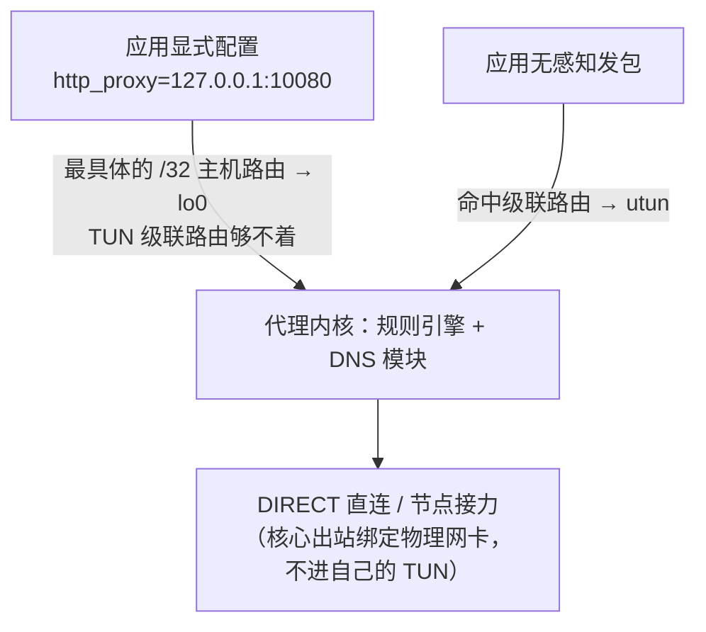

两个入口唯一的差别在**进门时携带的信息**：经端口进来的连接，CONNECT 握手直接写明目标域名，不需要反查；TUN 抓到的 IP 包只有地址，要靠 fake-ip 或 SNI 嗅探把域名找补回来。所以 TUN 常开时，给命令行工具显式配端口依然是稳妥做法：不读系统代理公告栏、不受 TUN 路由调整影响，目标信息反而更完整。

讲到这里，一个对比浮出水面：**代理的 TUN 模式和 VPN 用的是同一套捕获手法**——同样创建虚拟网卡、同样修改路由表，劫持流量的方式已经一模一样。那两者剩下的区别是什么？

> **代理有两种捕获流量的模式**：普通模式（系统代理，应用层自觉）和 TUN 模式（路由层接管）。但这两种模式都仍然叫“代理”而不叫“VPN”，因为**代理与 VPN 的核心区别不在于怎么捕获流量，而在于捕获之后怎么处理**：
>
> - **VPN**：把原始 IP 包整个封装进去，原样转发；
> - **代理**：终结连接，用多段连接接力处理。
>
> 捕获手法可以互相借鉴，处理方式才是两者的分水岭。
{: .prompt-tip }

前半段（怎么抓到流量）既然可以相同，区别就只可能出在**后半段：流量抓到手之后，怎么处理、发到哪里去**。

先看“发到哪”。两种情况下，本机发往外部的包，目标都是**一个公网 IP**：

- 代理：发向你的 VPS 的公网 IP；
- VPN：发向公司 **VPN 网关**的公网 IP。

VPN 不可能直接往 `10.88.128.45` 发包——私网地址在公网上没有路由，直接发等于扔进黑洞。所以无论 VPN 还是代理，公网上跑的外层包都长得差不多：源是你家宽带 IP，目标是一个公网入口。

```text
代理：  [IP头: 你家宽带IP → VPS公网IP]      ……
VPN：   [IP头: 你家宽带IP → VPN网关公网IP]  ……
```

那区别就只能藏在“……”里：**这个外层包里面装的是什么，以及对端收到后怎么处理**。接下来两节分别解剖 VPN 和代理的做法。

## 基础三：VPN 的处理方式：把整个三层包寄出去

先看 VPN。VPN 客户端从虚拟网卡读到你的原始包之后，做法极其“老实”：**原封不动，整个包加密，外面套一层新头，寄给网关**。

这就是所谓的**三层封装**：把你那个三层包当作一件**不可分割的整体**货物，不拆、不改、不看内容，直接装进一个新包裹寄出去。

这件货物的内部是完整的俄罗斯套娃：三层包展开是**三层头（IP 头）+ 三层数据**，三层数据再展开就是**四层头（TCP 头）+ 四层数据**，整串原封不动。网关拆壳后取出来的，还是原来那个包。

而新包裹的外壳也是一套完整包装：**外层三层头（新 IP）加外层四层头**。外层四层头里装着隧道两端进程的端口——WireGuard、OpenVPN 走的 UDP 端口就在这里，隧道两端机器的内核靠它把数据交给 VPN 进程。

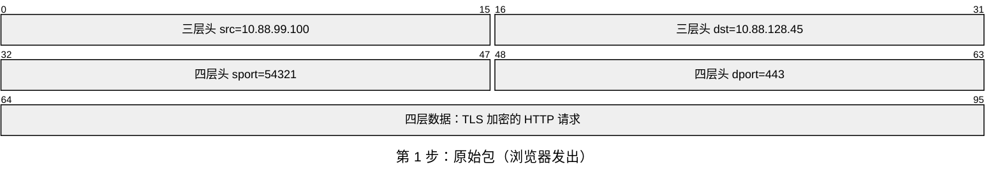

- `src=10.88.99.100`：VPN 分给你的内网 IP（你这块虚拟网卡的地址）；
- `dst=10.88.128.45`：hr 服务器的内网 IP；
- `sport=54321`：浏览器为这个连接随机开的临时端口，`dport=443`：服务器的 HTTPS 端口；
- 四层数据：TLS 加密的 HTTP 请求——里面的内容只有你和服务器能看懂。

原始包命中路由表，被导向 TUN 虚拟网卡。VPN 客户端把它整个加密，套一层外壳：

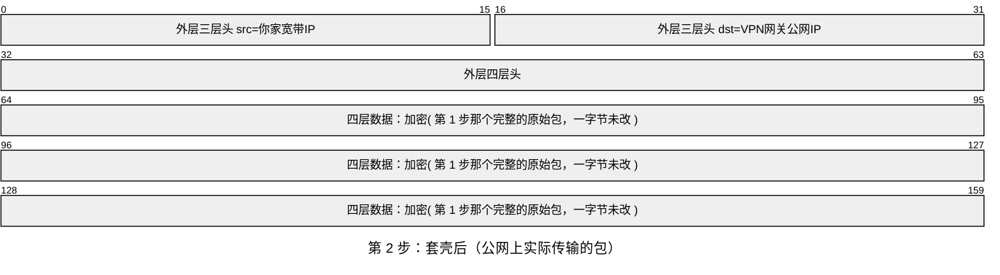

- 外层 `src=你家宽带IP`：公网上唯一能路由回你家的地址；
- 外层 `dst=VPN网关公网IP`：公司机房的隧道入口——公网路由器只需要看懂这一层；
- 外层四层头：你的 VPN 客户端和网关之间这条隧道连接的端口等信息；
- 四层数据：加密后的**完整原始包**——上一张图那个包整个躺在里面，包括它的三层头。

第 3 步：包穿过公网到达公司机房，VPN 网关解密、拆壳——**取出来的包和第 1 步一模一样**（src=`10.88.99.100`，dst=`10.88.128.45`，一个字段都没变），网关按内网路由表把它转发给 hr 服务器。

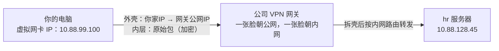

这条链路里有三个值得记住的性质：

**内网地址只存在于壳里。** 公网上的路由器从头到尾只看得见“你家 → VPN 网关”，`10.88.128.45` 藏在加密载荷中。这就是“直接往内网 IP 发包行不通、但包一层就行了”的原因。

**你被分了一个真的内网 IP。** 连上 VPN 时，网关从内网地址池给你分配地址（这里是 `10.88.99.100`），并把这个地址段通告给内网路由系统，相当于给你在内网“落了户口”。所以 hr 服务器的回包写 `dst=10.88.99.100` 时，内网路由器认识这个段，按正常路由送回网关，网关加密后沿隧道寄回你家——**回程完全靠路由解决，全程不需要 NAT**。

顺便一提，真机上客户端池分给你的常常是 `172.16.0.0/12` 段（如 `172.28.160.237`）而不是 `10.x`：`172.16.0.0`~`172.31.255.255` 和 `10.x`、`192.168.x` 并列为 RFC 1918 私网段，用它既能和公司服务的 `10.x` 网段分开便于路由和访问控制，又不会撞上家用路由器惯用的 `192.168.x`。

**你是内网的正式成员。** 目标服务器看到的源地址就是你的内网 IP；你能 ping 内网主机、跑 UDP、用任意协议，甚至能被内网其他机器反向连接。VPN 给你的是“网络成员资格”。

## 基础四：代理的处理方式：终结连接，接力数据

再看代理。代理拿到流量之后，做法和“整个包寄出去”截然不同。

代理的实际做法是**终结连接、逐段接力**：你的连接在本机代理这里就被“掐断”了，数据被取出来，交给一条全新的连接；到 VPS 再掐断一次，再换新连接。

和三层封装对照着看：**每一跳都把三层头剥掉、把四层连接终结，只把数据掏出来，塞进一套全新的三层加四层包装里寄出去**。所以"接力"的准确含义是接力动作发生在四层——终结旧连接、新建新连接来传数据；三层头和四层头（端口、序列号）每跳全部重新生成，**真正从上一跳活到下一跳的只有数据**。以访问 `google.com:443` 为例，完整旅程是三条独立的 TCP 连接：

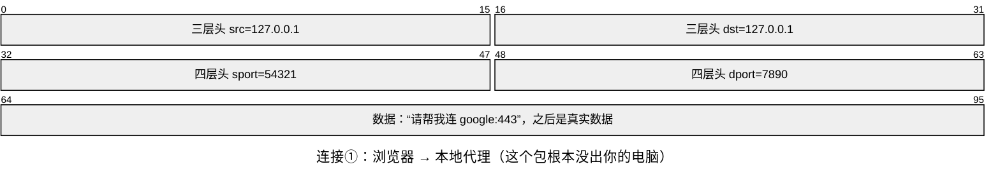

- `src` 和 `dst` 都是 `127.0.0.1`：起点和终点都在本机——这个包从没离开过你的电脑；
- `sport=54321`：浏览器的临时端口，`dport=7890`：本地代理监听的端口；
- 数据：先是一句代理协议握手“请帮我连 google:443”，之后就是你要发的真实数据。

浏览器以为自己在和 google 通信，其实连接的终点是本机代理。本地代理把连接①的数据取出来，放进一条全新的连接：

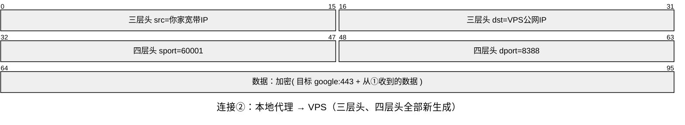

- `src=你家宽带IP`、`dst=VPS公网IP`：全新连接的全新三层头；
- `sport=60001`：本地代理为这条出向连接新开的端口，`dport=8388`：VPS 上代理服务监听的端口；
- 数据：加密的协议载荷，里面装着真实目标地址和从连接①收到的数据——目标是以"数据"身份出场的，所以公网上没人知道你要访问谁。

注意真实目标的下落：它作为**数据内容**写进代理协议（SOCKS5/VMess/VLESS），而不是写在任何三层头里。VPS 解密后拿到目标，自己再发起一条全新连接：

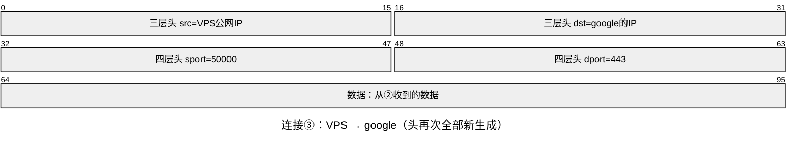

- `src=VPS公网IP`：google 看到的来源就是它——不知道、也无法知道你的存在；
- `sport=50000`：VPS 为这条连接新开的端口，`dport=443`：google 的 HTTPS 端口；
- 数据：从连接②收到的数据原样转发。

三张图对比着看，替换关系一目了然：**每一跳的三层头、四层头（包括序列号）全部重新生成，只有数据在接力**。没有任何一个包能走完两跳——每段连接只负责把“数据”从上一段的接收缓冲区取出来、写进下一段。回程完全对称：

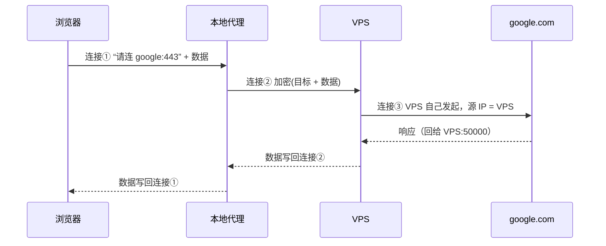

google 看到的对端是 `VPS:50000`，它不知道、也无法知道你的存在。这就是代理“换脸”的实现方式：**不是改写包头，而是换一个人替你说话**——连接③是 VPS 自己发起的，源 IP 天然是 VPS 的。

这里自然冒出一个问题：如果 VPS 自己也在用浏览器上 google，回程的包怎么区分“哪些是代理流量、哪些是它自己浏览器的”？答案就是基础一埋下的四元组。VPS 上同时存在两条通往 google 的连接：

```text
连接A（替你建的）:     VPS:50000 → google:443
连接B（它自己浏览器的）: VPS:50001 → google:443

google 回包 dst=VPS:50000 ──┐
                            ├─▶ VPS 内核查连接表
google 回包 dst=VPS:50001 ──┘
     ├─ 50000 → 代理进程的 socket → 代理读走 → 写进连接②回传给你
     └─ 50001 → 浏览器进程的 socket → 浏览器读走 → 渲染页面
```

源端口不同，就是两条完全不同的连接，回程各回各家。分拣规则在连接建立那一刻就定好了，不存在事后判断“这包该给谁”——这也正是四层存在的意义：把机器唯一的数据通路复用成成千上万条独立连接。

## 基础五：正面对照，以及为什么代理不学 VPN

两种处理方式都看完了，先把它们并排摆开做正面对照，再回答一个自然的问题：代理为什么不学 VPN 的做法。

### 正面对照：包是一条命，还是数据过三手

两种“后半段”并排摆开：

```text
VPN（三层封装）：
  原始包 ──装壳──▶ 公网运输 ──拆壳──▶ 还是原来那个包
  原始 IP 包从生到死是同一个，只是中途被装箱运输。

代理（四层接力）：
  连接① ──取数据──▶ 连接② ──取数据──▶ 连接③
  没有任何包能走完两跳，只有数据被接力棒一样传下去，
  IP 头、TCP 头每跳都重新生成。
```

这正是标题的由来：**VPN 是三层套三层——原包当不可分割的整体装进新包裹（外层三层头 + 外层四层头）寄走；代理是在四层换连接——三层头、四层头每跳全换，只把数据接力下去。**

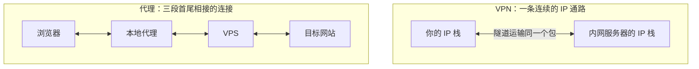

| | VPN | 代理 |
|---|---|---|
| 工作层次 | 三层（IP 包） | 四层（连接） |
| 传输内容 | 原始 IP 包完整封装 | 只搬运数据，逐段新建连接 |
| 目标看到的源 | 你的内网 IP | 代理服务器的 IP |
| 你的身份 | 内网正式成员 | 公网上的隐身人 |
| 服务端角色 | 路由器：拆壳后按路由表转发 | 接力者：拿到目标后新建连接 |

### 为什么代理不学 VPN，把包整个发出去

既然 TUN 模式的前半段和 VPN 一模一样，后半段为什么不也包一层发出去？这是两者分道扬镳的地方，先说本质约束，再说顺带的原因。

**本质约束：代理要求回程也必须经过它，否则它就不是代理。** 代理的存在意义是“让目标只看到 VPS、看不到你”——这不只是去程要求，更是回程要求。假设 VPS 学了 VPN、把原始包整包转发：包里写着 `src=你家IP, dst=google`，google 的回包会按公网路由**直接奔你家去，根本不经过 VPS**。这一来二去，你的真实 IP 暴露在链路里，“代理”这个身份就不成立了（何况你的 TCP 栈从没对 google 建立过连接，这个回包到了你家也会被直接丢弃——链路本身就是断的）。

**VPN 为什么没有这个约束？因为网关是两个网段之间唯一的通路。** 你的内网 IP 只在内网路由可达，hr 服务器的回包想找到你，路由表里唯一的路就是经过网关——网关**必然被路过**，所以它可以安心做一个只拆壳转发的路由器。而 VPS 在公网上不是任何流量的必经之地，想留在链路上，就得自己想办法：

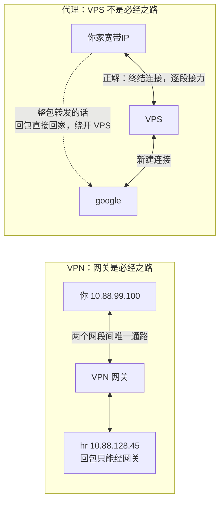

所以 VPS 要把回程拉回自己手里，只剩两条路：**改写地址（NAT）**，或者**终结连接、自己当对端**。

**第一条路就是“翻墙 VPN”。** 在 VPS 上搭 WireGuard/OpenVPN 就是“包一层 + 拆包转发”，商业翻墙 VPN（NordVPN 一类）也这么做。但公网不可能认识你隧道里的虚拟 IP，所以 VPS 必须一人分饰两角——既是 VPN 网关（拆壳装壳），又是 NAT 路由器（改写地址），把你藏在自己身后：

```text
转发前:  [IP: src=10.0.0.2(隧道虚拟IP)  dst=google][...]
              │  VPS 做 MASQUERADE：源地址改成自己
              │  并在 conntrack 表记一笔：这条连接 ↔ 10.0.0.2
              ▼
转发后:  [IP: src=VPS公网IP  dst=google][...]
回包:    [IP: dst=VPS公网IP] → 查 conntrack → 改回 dst=10.0.0.2 → 塞进隧道
```

对比企业 VPN 就能看清 NAT 的本质：**企业 VPN 给你分了真内网 IP，内网路由认识你，不需要 NAT；翻墙 VPN 的虚拟 IP 公网不认识，只能靠 NAT 补救。** NAT 能跑，但服务端需要 root 权限、开内核转发、配 iptables——而 VMess/SOCKS 服务端只是个普通用户态程序，双击就能跑，连 root 都不要。部署成本天差地别。

**主流代理工具选了第二条路，因为它顺带送来三样东西：**

- **域名可见，这是代理的命根子。** 整包转发时看到的都是不透明 IP 包，只有 IP 没有域名；而代理的核心价值是**按域名分流**：`google.com` 走美国节点、`baidu.com` 直连、广告域名丢弃。终结连接后，目标域名是协议握手时告诉它的，或者能从 TLS 握手的 SNI 里嗅探到，规则引擎才有米下锅。Clash 自己就是最好的证据：TUN 模式抓到的原始包里域名信息丢了，它专门发明 **fake-ip** 模式（给域名发假 IP，收到假 IP 的包再反查域名）把这个信息找补回来——如果按域名分流不重要，何苦绕这么大一圈。
- **流比包好藏。** 这类工具的主战场是有审查的网络。把流量伪装成一条平平无奇的 TLS 连接（Trojan、VLESS+TLS）容易混进 HTTPS 的海洋；WireGuard 那种“UDP 里裹着 IP 包”的流量指纹特征明显，容易被识别和封锁。接力模式天然以连接为单位，想伪装成什么应用层协议都行。
- **连接可复用。** 终结连接后，本机几十条连接可以复用少数几条到服务器的长连接（mux），省掉每条连接的 TCP/TLS 握手开销；整包转发做不到这一点，每个包都得独立封装。

一句话总结：**VPN 网关天生蹲在两个网段的必经之路上，代理服务器不在任何必经之路上——这一个地位差别，决定了 VPN 可以整包转运，而代理必须把自己变成对端，终结连接、接力数据。**

## 场景一：回到那个打不开的网站

基础知识齐了，回到开头那个打不开的网站，用三层/四层的视角把现场完整看一遍。先复盘那个超时的瞬间。访问 `hr.example.com` 一直转圈，用 `dig` 查一下这个域名的解析结果：

```bash
$ dig +short hr.example.com
10.88.128.45
```

`10.88.128.45` 是 RFC 1918 定义的私网地址（`10.0.0.0/8`）。私网地址在公网骨干上没有任何路由，你发出的数据包走到运营商那里就被丢弃了，所以连接只能超时。

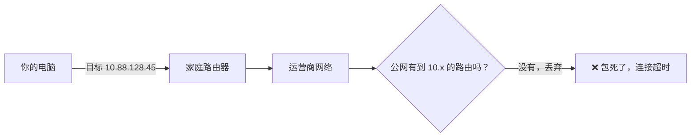

这本身不意外：内部站点需要内网或 VPN 才能访问。真正有意思的是接下来的对照实验。

### 内网 IP 为什么会写在公网 DNS 上

分别用 8.8.8.8（Google）、1.1.1.1（Cloudflare）、114.114.114.114（国内公共 DNS）再查几遍，结果完全一样；再查权威服务器，发现 NS 是该公司自建的：

```bash
$ dig +short @8.8.8.8 hr.example.com
10.88.128.45

$ dig +short NS example.com
ns1.example-dns.net.
ns3.example-dns.net.
...（ns1~ns8，全是这家公司自己的 DNS 服务器）
```

也就是说，**这条内网记录是该公司故意写在公网权威 DNS 上的，全世界都解析得到**。直觉上这很奇怪：内网的东西为什么要公之于众？

关键在于，DNS 和路由是两层互不相干的系统。**DNS 只是一本电话簿**，负责把名字翻译成号码，协议本身不区分公网 IP 和私网 IP——A 记录里填任何 IPv4 地址都合法。而“内网”是**路由层**的属性：私网地址段在公网上不被路由。所以这条记录的效果是“门牌号公开，但楼在园区里”：谁都知道地址，外网的人却走不到。

那为什么要让外网也知道门牌号？为了照顾 **VPN 分离隧道（split tunnel）** 的员工——也就是 VPN 只接管公司网段的流量、其余流量照常直连的用法。员工在家连 VPN 时，客户端按 IP 网段劫持流量（比如把 `10.0.0.0/8` 塞进隧道），DNS 请求却仍然走本机原来的 DNS——家里的路由器。如果内部域名只登记在内网 DNS 上，这本“电话簿”就查不到它，隧道明明通着也连不上。把私网 IP 发布到公网 DNS 后，任何电话簿都能给出正确号码，隧道负责把流量送到位，员工的 DNS 配置零改动。

现象到此解释完了：**门牌号公开，但楼在园区里**——全世界都查得到地址，只有 VPN 隧道能把包送到。而连上 VPN 之后包具体怎么走，正是基础三里三层封装的全过程。

## 场景二：代理和 VPN 同时开，包去哪

理解了两种捕获方式（基础二）和两种处理方式（基础三、四），两套机制叠加时的行为就能推出来了。结果取决于代理用哪种接管方式，两种情况的决定机制完全不同：**普通代理是“两层先后决策”，TUN 代理是“同一层抢包”**。

### 情况一：普通代理（系统代理）+ VPN——两层接力，后层只能处理前层留下的连接

决策分两层按顺序发生：应用层先决定“要不要用代理”，网络层再决定“前一步最终产生的连接走哪张网卡”。这两层不会在路由表里直接抢同一个包，但第二层无法推翻第一层已经做出的代理选择。用真机上的真实地址，看两条完整链路。

浏览器访问 google：浏览器把连接交给本地代理（`lo0`，永不进 VPN），代理发往日本节点的出向连接是公网 IP，不匹配 VPN 的任何路由，走 `en0` 出境——两者各干各的：

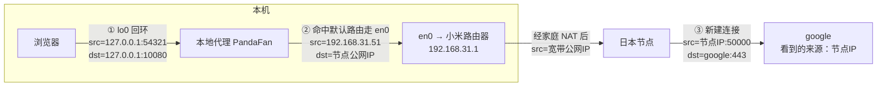

浏览器访问 `hr.example.com`：**只有代理规则先把它判定为 `DIRECT`**，代理核心才会在本机连接 `10.88.128.45`，随后命中 VPN 的 `10/8` 路由进入 `utun4`——代理出规则引擎，VPN 出内网通路，各出一半力：

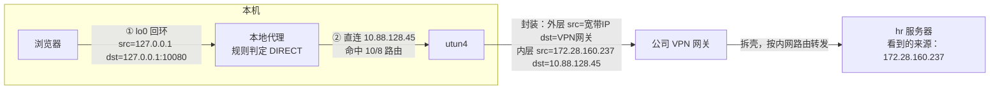

如果公司域名没有命中 `DIRECT`，链路会在第一层分叉：代理核心直接连接机场节点，由远端节点代为解析和访问。此时 macOS 路由表看到的目标是**节点公网 IP**，不是 `10.88.128.45`；公司路由没有被违反，只是它从未见到原始内网目标。这正是“路由表明明写着 `10/8 → Cisco`，Chrome 却打不开内网”的一种来源。

唯一的坑是全隧道 VPN（默认路由全接管）：代理发往节点的出向连接也会被塞进隧道，变成“代理套 VPN”——节点看到的你是公司出口 IP，路径诡异、速度感人。代理软件通常会主动给节点 IP 加一条路由例外来避免套娃。

### 情况二：TUN 代理 + VPN——同一层抢包，路由表当裁判

两者都在路由层劫持，同一个包只有一张路由表裁决，**谁的路由更具体谁赢**。三种局面：

**和谐共处。** 分离隧道 VPN 只管 `10.0.0.0/8` 等具体网段，TUN 代理用级联路由架空默认路由——谁也不抢谁的：

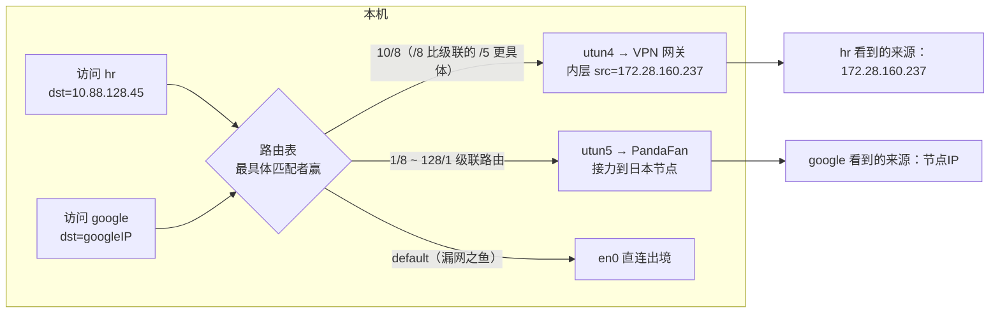

场景三的真机检查里，那张路由表就是这种共存的实例：`10/8`（/8）压过 TUN 的 `8.0.0.0/5`（/5），公司流量照样走 `utun4`。

这套组合最稳妥的全局入口配置是：**代理启用 TUN，系统代理保持关闭**。这样没有单独配置代理端口的应用都会先按普通直连方式解析域名、产生指向所得 IP 的连接，路由表能够在最早的位置裁决；不会再有一部分流量先走系统代理、另一部分流量再走 TUN 的默认双入口差异。公司路由仍必须比代理级联路由更具体，企业 VPN 也必须是分离隧道；这两个条件缺一不可。

#### 两种“稳”：端口链路更短，TUN 负责全局分工

只观察一条明确走 `Proxy` 的公网连接，显式代理端口确实更简单：应用通过 `CONNECT` / SOCKS 直接把域名交给 PandaFan，可以跳过 macOS 对目标域名的解析、Fake-IP 映射和 SNI 嗅探。下篇[《TUN 代理环境下的 DNS 链路全拆解》](/posts/2026/08/09/tun-proxy-dns-chain/)记录的 ChatGPT 故障就是一个直接对照：Codex 走显式端口始终正常，ChatGPT App 走 TUN 时却先后撞上了污染缓存和旧 Fake-IP 映射失同步。

但“单条代理连接少几个环节”和“整台机器采用哪种默认入口”是两个问题。把观察范围扩大到全系统和公司 VPN，两种模式各自在不同维度上更稳：

| 观察维度 | 显式端口 / 系统代理 | TUN |
|---|---|---|
| 明确走 `Proxy` 的单条连接 | 协议直接携带域名，目标身份更完整 | 要靠 DNS、Fake-IP 或嗅探恢复域名，前置状态更多 |
| 全系统覆盖 | 依赖应用读取代理设置，不配合的应用会漏网 | 路由层统一捕获，不要求应用理解代理 |
| 公司 VPN 的介入时机 | PandaFan 先按域名裁决；误判 `Proxy` 后，公司路由没有补救机会 | 公司专用 DNS 先返回公司 IP，具体公司路由可以优先交给 Cisco |
| 这台 Mac 的实际环境 | Cisco 曾把系统代理运行时视图重建为空，公告栏本身不可靠 | 不依赖系统代理公告栏，直接以接口和路由工作 |

因此这里选择 TUN，不是因为它内部步骤更少，而是因为目标是**覆盖所有应用，同时保留分离隧道 VPN 对公司 DNS 和公司路由的优先权**。关闭系统代理则是为了避免全局存在两套默认入口：读公告栏的应用先把域名交给 PandaFan，不读的应用才走 TUN，同一个目标可能因应用不同而采用不同的 DNS 与裁决顺序。

“系统代理关闭”也不等于本地代理端口必须闲置。像 Codex 这样能够精确配置 `HTTP_PROXY` 的少数应用，仍可有意连接 `127.0.0.1:10080`，用更短的域名链路访问明确的代理站点；其余应用继续由 TUN 兜底。这形成的是“**TUN 作为全局默认入口，显式端口作为少数应用例外**”的共存模式，而不是重新打开系统代理公告栏，让大量应用各自选择入口。

**全隧道对撞。** 两者都抢默认路由时，后启动的往往赢；而赢家自己发出的出向连接会再查一次路由表，可能落进对方的隧道。异常那条支路的本质很朴素：**相当于在日本节点之前，无意义地多串了一层公司中转**——多一层接力，多一层延迟，什么也换不来。

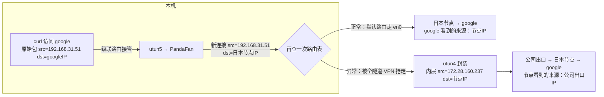

**死循环防御。** 最后一个问题：PandaFan 自己发往节点的连接也是内核产生的包，凭什么不被自己的 TUN 抓回去？答案是双方都会给自己的服务器留路由例外：

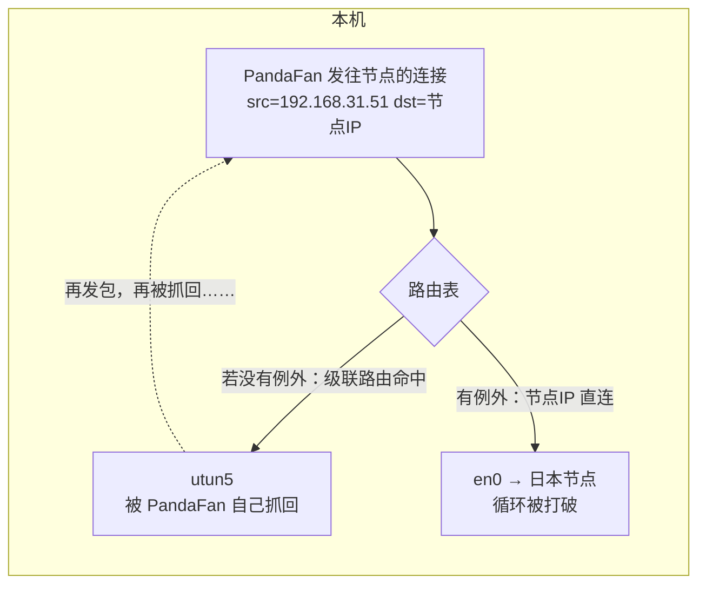

代理把节点 IP 排除出自己的 TUN，VPN 排除自己的网关地址，WireGuard 这类还会用 fwmark 标记自己的包不再进隧道。道理同样朴素：**劫持一切的前提，是不能劫持自己劫持后的流量**——否则自己劫自己，必然成环。

## 场景三：真机检查：VPN 与代理共存的完整现场

概念和推论都有了，拿一台真实开着公司 VPN（Cisco Secure Client）和代理软件（PandaFan）的 Mac 完整验一遍：从初始状态，到一次“代理设置了却不生效”的排障，再到 TUN 模式解决后的网络面貌。每一步都对回前文的结论。

### 初始状态：只有 VPN 在工作

**第一眼看接口**（`ifconfig`），关键几块的原始输出：

```bash
$ ifconfig    # 节选关键几块
lo0: flags=8049<UP,LOOPBACK,RUNNING,MULTICAST> mtu 16384
        inet 127.0.0.1 netmask 0xff000000

en0: flags=8863<UP,BROADCAST,RUNNING,SIMPLEX,MULTICAST> mtu 1500
        inet 192.168.31.51 netmask 0xffffff00 broadcast 192.168.31.255

utun0: flags=8051<UP,POINTOPOINT,RUNNING,MULTICAST> mtu 1500
        inet6 fe80::ef51:9004:32c3:31e6%utun0 prefixlen 64
utun1: ...（同样只有 inet6 fe80:: 开头的链路本地地址）
utun2: ...
utun3: ...

utun4: flags=80d1<UP,POINTOPOINT,RUNNING,NOARP,MULTICAST> mtu 1250
        inet 172.28.160.237 --> 172.28.160.237 netmask 0xffffe000
```

`lo0`、`en0`、`utun0` 到 `utun4` 在输出里并列出现——内核眼里它们都是网卡，不管背后有没有硬件。但细看：

- `en0` 是 Wi-Fi，`192.168.31.51` 是小米路由器分的局域网地址——它是唯一连着真实硬件的出口。
- `utun0`~`utun3` 只有链路本地 IPv6（`fe80::` 开头），没有 IPv4 地址，路由表也没有任何条目指向它们——macOS 系统服务（如私有中继）留下的**空闲接口**。对应基础二的提醒：**看到 `utun` 存在，不等于流量正被接管**。
- `utun4` 不一样：`inet 172.28.160.237 --> 172.28.160.237`，mtu 1250。这个 `172.28.160.237` 就是 VPN 网关分给我的**内网 IP**——基础三说的“落户口”，在这里能亲眼看到。

**第二眼看路由表**（`netstat -nr`）：

```bash
$ netstat -nr -f inet    # 节选
default            192.168.31.1        UGScg      en0     ← 默认仍走物理网卡
default            link#22             UCSIg      utun4   ← 带作用域标记的备胎
10                 172.28.160.237      UGSc       utun4   ← 内网网段进隧道
10.78.226.115/32   172.28.160.237      UGSc       utun4
43.227.197.174/32  172.28.160.237      UGSc       utun4   ← 公司用的公网服务
...共 134 条指向 utun4
```

这正是**分离隧道在路由表上的样子**：普通默认路由依然指向小米路由器 `192.168.31.1`（en0）；`10.0.0.0/8` 和一百多条公司相关网段指向 `utun4`。注意那批 `/32` 里有不少公网 IP（腾讯云、阿里云的地址段）——企业 VPN 不只推内网网段，也会把公司部署在云上的服务 IP 推进隧道，让这些流量统一走公司出口。另一条带 `I`（接口作用域）标记的 default 只对已绑定 `utun4` 的流量生效，不参与普通流量的选路，所以不会和 en0 的默认路由打架。

**第三眼做实测**，路由表说的是否算数：

```bash
$ route get 10.88.128.45
    gateway: 172.28.160.237
    interface: utun4

$ route get 142.250.80.46      # google 的 IP
    gateway: 192.168.31.1
    interface: en0

$ curl -o /dev/null -w "%{http_code}" https://hr.example.com
200        # 连 VPN 前超时，连上后通
```

**第四眼查代理**（此时 PandaFan 只开了 App、没连节点）：

```bash
$ scutil --proxy
  HTTPEnable : 0  HTTPSEnable : 0  SOCKSEnable : 0    ← 公告栏是空的

$ lsof -nP -iTCP -sTCP:LISTEN | grep -E "7890|10080"
（无输出）                                            ← 没有任何代理端口

$ netstat -nr -f inet | grep utun5
（无输出）                                            ← 没有指向代理的路由

$ curl -m 8 -o /dev/null -w "%{http_code}" https://www.google.com
000                                                 ← 直连失败，没有代理在接力
```

三处该有的痕迹一处都没有，对应场景二的判断框架：**进程在跑不等于流量被接管**，判断代理是否生效就去查三处——公告栏（`scutil --proxy`）、本地端口、路由表，至少一处要有痕迹。

### 问题定位：系统代理“设置了却不生效”

接下来在 PandaFan 里连上日本节点，界面上行下行却一直是 0 B/s，Chrome 也打不开 YouTube。按上面的框架排查：

```bash
$ lsof -nP -iTCP -sTCP:LISTEN | grep clash
clash  ...  TCP 127.0.0.1:10079/10080/10081 (LISTEN)   ← 痕迹一：核心在听

$ curl -x http://127.0.0.1:10080 -o /dev/null -w "%{http_code}" https://www.google.com
302                                                  ← 代理链路本身是好的

$ networksetup -getwebproxy Wi-Fi
Enabled: Yes  Server: 127.0.0.1  Port: 10080         ← 档案里确实“开着的”

$ scutil --proxy
  HTTPEnable : 0  HTTPSEnable : 0  SOCKSEnable : 0    ← 但应用读到的全局状态是关的

$ python3 -c "import urllib.request; print(urllib.request.getproxies())"
{}                                                   ← Chrome 同样读到空，于是直连被墙
```

问题出在 macOS 系统代理的**两份状态**上。系统代理不是“写进去就生效”，而是一条两跳的链路：

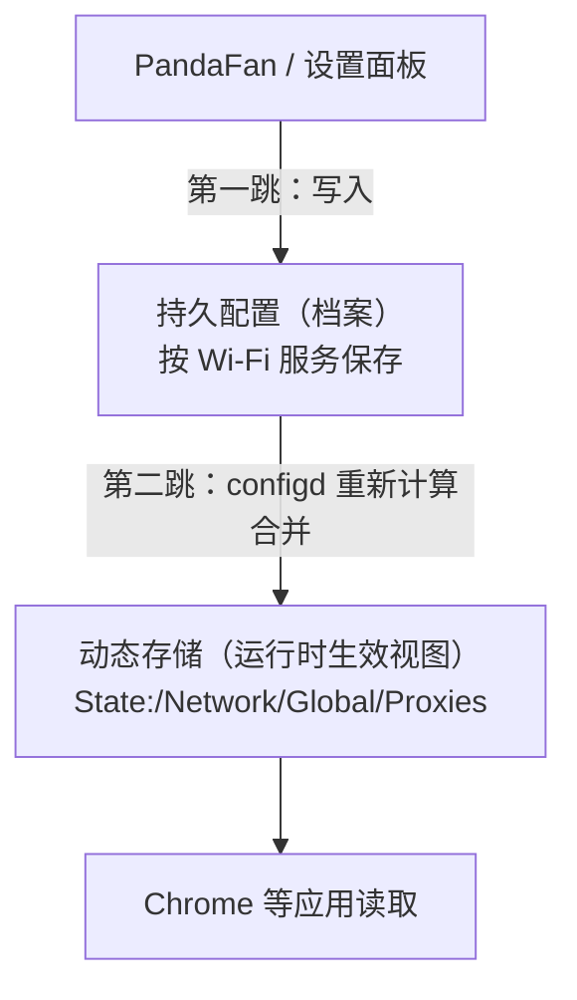

设置面板显示“已开启”只代表**第一跳**成功；应用生效依赖**第二跳**——系统把档案里的值合并进运行时全局视图。这台机器上第二跳断了：公司 VPN（Cisco Secure Client）的 Network Extension 连接时参与重建了动态存储，把全局代理视图填成了空；之后无论 PandaFan 写入、还是手动把代理关了再开，都只刷新档案，全局视图始终是那张家 VPN 留下的“空白告示”。用前文的话说：**公告栏的底稿改得再对，贴出去的那张是空白的，而应用只看贴出去的那张。**

这也解释了为什么修 VPN 不现实：它是企业管控软件，行为由公司 IT 下发，本地没有“别动系统代理”的开关。出路是绕开这条被污染的链路——于是打开 TUN 模式。

### TUN 模式：密码弹窗之后，路由表变了

打开 PandaFan 的 TUN 模式时，系统弹窗要求输入 Mac 账号密码。

> **这个密码弹窗是最强烈的信号：软件正在跨越用户态与内核态的边界。** 创建虚拟网卡、修改系统路由表是内核级操作，必须经过授权——对照前面的章节：应用层代理只是在本机监听端口，和起个网站后端一样，从来不会问你要密码。**哪天一个网络软件不问密码就说自己能“全局接管”，反而值得警惕。**
{: .prompt-warning }

授权之后再按同样顺序检查，网络面貌焕然一新。

**接口**：多了一块 `utun5`，这就是 PandaFan 的 TUN 设备：

```bash
$ ifconfig utun5
utun5: flags=8051<UP,POINTOPOINT,RUNNING,MULTICAST> mtu 1500
        inet 198.18.0.1 --> 198.18.0.1 netmask 0xfffffffc
```

`198.18.0.0/15` 是保留给网络设备基准测试的地址段，代理工具喜欢用它做 TUN 接口地址和 fake-ip 池，保证和真实地址不冲突。

**路由表**：多出一组指向 `utun5` 的条目，共 9 条：

```bash
$ netstat -nr -f inet | grep utun5
1.0.0.0/8     198.18.0.1    UGSc    utun5
2.0.0.0/7     198.18.0.1    UGSc    utun5
4.0.0.0/6     198.18.0.1    UGSc    utun5
8.0.0.0/5     198.18.0.1    UGSc    utun5
16.0.0.0/4    198.18.0.1    UGSc    utun5
32.0.0.0/3    198.18.0.1    UGSc    utun5
64.0.0.0/2    198.18.0.1    UGSc    utun5
128.0.0.0/1   198.18.0.1    UGSc    utun5
```

这 8 条 CIDR 像切西瓜一样把整个 IPv4 空间（除保留的 `0.0.0.0/8`）拼满——正是场景二说的级联路由手法：不动原来的 `default` 路由，用一批前缀更长（更具体）的路由把它架空。对照场景二“路由更具体者赢”的结论：VPN 的 `10.0.0.0/8`（/8）比 TUN 的 `8.0.0.0/5`（/5）更具体，公司流量依然进 `utun4`——**共存的预言在这张路由表里精确兑现**。

**实测**：

```bash
$ curl -o /dev/null -w "%{http_code}" https://www.google.com    # 不带任何代理参数
200

$ scutil --proxy
  HTTPEnable : 0  HTTPSEnable : 0  SOCKSEnable : 0    ← 公告栏还是空的，但已经无所谓了
```

注意第一行：`curl` 是那种从不读系统代理的“不守规矩”应用，之前直连 Google 必然超时，现在直接通了——**TUN 在路由层接管，应用自不自觉都一样**。而公告栏保持空白并不是待修复的残留状态，而是最终方案的一部分：代理只保留 TUN 作为全局默认入口，避免浏览器提前把公司域名交给代理；Cisco 再凭更具体的公司路由接走内网流量。少数显式指定本地端口的工具仍可作为例外，不改变这套默认分工。

最终的三出口并存格局：

```mermaid
flowchart TD
    A["应用发包（无论是否自觉）"] --> B{"内核路由表：最具体匹配者赢"}
    B -->|"10/8 等 134 条公司路由（最具体）"| C["utun4 → 公司 VPN 网关<br>内网 IP：172.28.160.237"]
    B -->|"1/8 ~ 128/1 级联路由（架空 default）"| D["utun5 → PandaFan<br>分流后直连或接力到日本节点"]
    B -->|"default 默认路由（仅剩漏网之鱼）"| E["en0 → 小米路由器 192.168.31.1"]
```

## 怎么选

机制讲完、场景验完，日常怎么选，汇总成一张表：

| 需求 | 更合适的方式 | 原因 |
|---|---|---|
| 访问公司内网、成为网络成员 | VPN | 三层接管，分到内网身份，协议无关 |
| 浏览器和常规桌面应用翻墙 | 系统代理 | 轻量直观，与 VPN、局域网冲突少 |
| 命令行、游戏、不支持代理的软件 | TUN 模式代理 | 接管点在内核路由层，不需要应用配合 |
| 按域名精细分流、多节点切换 | 代理（任意模式） | 终结连接后域名可见，规则引擎生效 |
| 只代理少数 GUI 应用，同时使用公司 VPN | 系统代理 | 改动少，但必须保证公司域名命中 `DIRECT` |
| 覆盖所有应用，同时使用分离隧道公司 VPN | TUN 代理，关闭系统代理 | 只保留一个全局默认入口，让具体公司路由优先裁决；少数应用仍可显式使用本地端口 |

## 收尾

用三句话收束全文：**VPN 在三层把原始 IP 包整个寄给网关，让你成为内网的一员；代理在四层终结连接、逐段接力，让代理服务器替你说话；而系统代理、TUN、NAT、四元组，分别是“怎么找到代理”“怎么强制抓到流量”“对方不认识你时怎么补救”“一台机器怎么区分几千条连接”的答案。**

到这里，“包怎么走”的问题讲清了。但代理抓到包之后还有另一半问题：**“号怎么查”**——TUN 抓到的 IP 包里只有地址没有域名，代理要靠 fake-ip 把域名找补回来；DNS 请求在这条链路里经过好几手，公司内网域名还可能被代理误杀。这些 DNS 链路上的故事，是下篇[《从豆瓣变卡说起：TUN 代理环境下的 DNS 链路全拆解》](/posts/2026/08/09/tun-proxy-dns-chain/)的内容。
