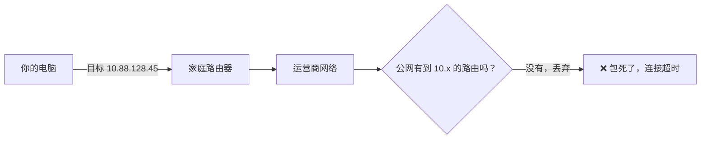
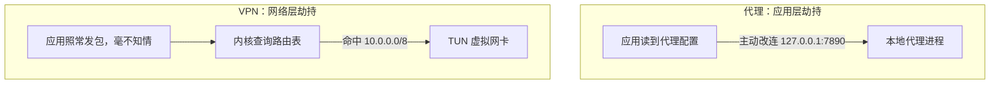
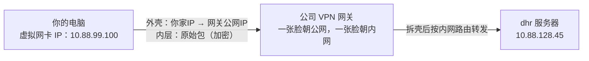
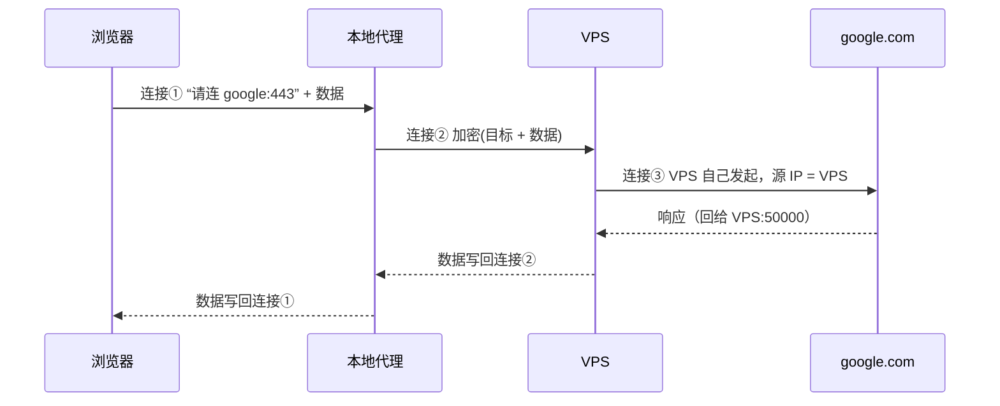
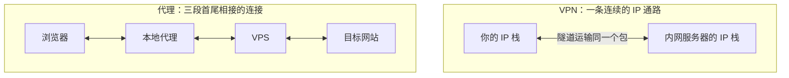
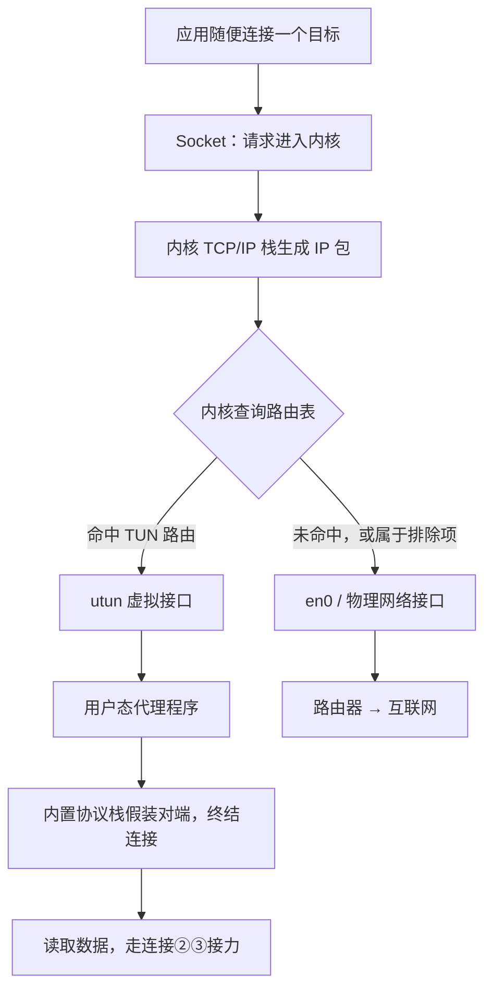
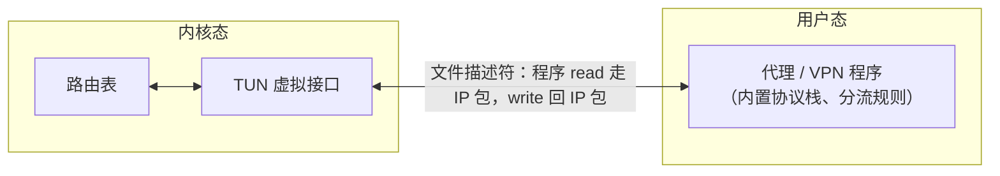
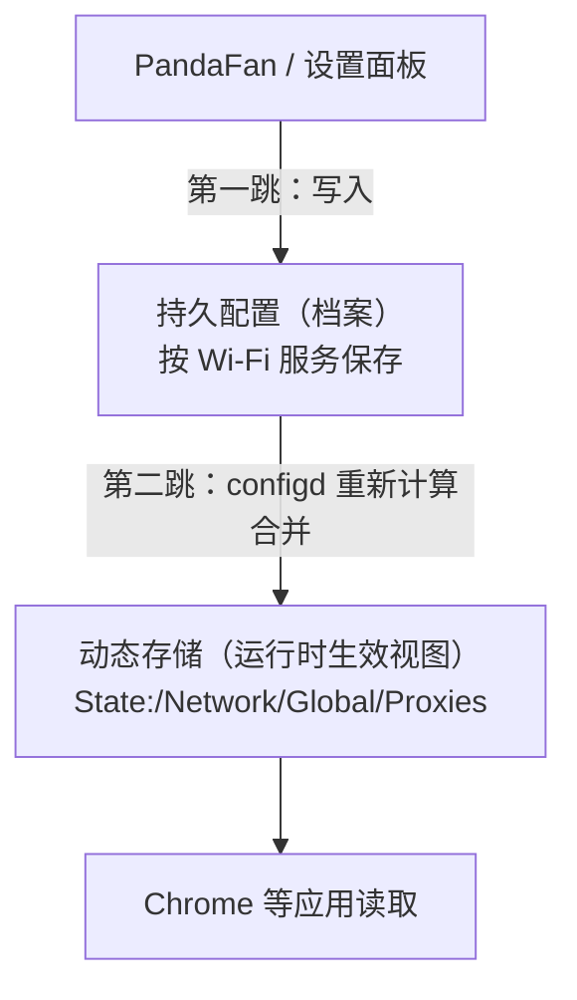
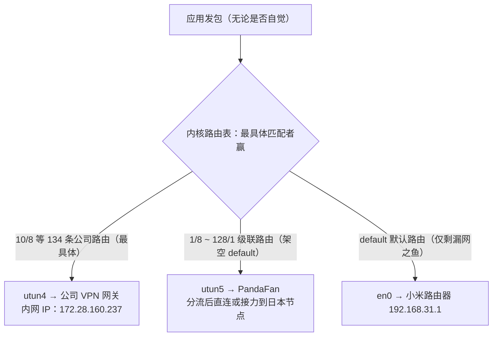

1. Table of Contents, ordered
{:toc}

## 一个打不开的网站

故事从一个具体的现象开始。访问某公司的内部站点 `dhr.didichuxing.com`，浏览器一直转圈，最后超时。用 `dig` 查一下这个域名的解析结果：

```text
dhr.didichuxing.com  →  10.88.128.45
```

`10.88.128.45` 是 RFC 1918 定义的私网地址（`10.0.0.0/8`）。私网地址在公网骨干上没有任何路由，你发出的数据包走到运营商那里就被丢弃了，所以连接只能超时。



这本身不意外：内部站点需要内网或 VPN 才能访问。真正有意思的是接下来的对照实验。

## 内网 IP 为什么会写在公网 DNS 上

分别用 8.8.8.8（Google）、1.1.1.1（Cloudflare）、114.114.114.114（国内公共 DNS）再查几遍，结果完全一样，都返回 `10.88.128.45`。再查权威服务器，`didichuxing.com` 的 NS 是该公司自建的 `ns1~ns8.didiwuxian.com`。

也就是说，**这条内网记录是该公司故意写在公网权威 DNS 上的，全世界都解析得到**。直觉上这很奇怪：内网的东西为什么要公之于众？

关键在于，DNS 和路由是两层互不相干的系统。**DNS 只是一本电话簿**，负责把名字翻译成号码，协议本身不区分公网 IP 和私网 IP——A 记录里填任何 IPv4 地址都合法。而“内网”是**路由层**的属性：私网地址段在公网上不被路由。所以这条记录的效果是“门牌号公开，但楼在园区里”：谁都知道地址，外网的人却走不到。

那为什么要让外网也知道门牌号？为了照顾 **VPN 分离隧道（split tunnel）** 的员工。员工在家连公司 VPN 时，VPN 客户端通常只按 IP 网段劫持流量（比如把 `10.0.0.0/8` 塞进隧道），而 DNS 请求仍然走本机原来的 DNS——家里的路由器。如果内部域名只登记在内网 DNS 上，家里这本“电话簿”就查不到它，隧道明明通着也连不上。把私网 IP 发布到公网 DNS 后，任何电话簿都能给出正确号码，隧道负责把流量送到位，员工的 DNS 配置零改动。

> 这种“公网域名解析出私网 IP”的应答有一个坑：开启了 DNS rebind 防护的路由器（如 OpenWrt 的 dnsmasq 默认开启 `--stop-dns-rebind`）会把这类应答**直接丢弃**，防止恶意网站用 DNS rebinding 攻击内网设备。同样的网络下别人解析得出、只有你解析不出，八成是这个开关在拦截。
{: .prompt-info }

至此现象解释完了：要访问这个站点，得连公司 VPN。而我们平时翻墙用的是代理。两者用起来都是“打开一个开关，流量就被劫走了”——**既然都是劫持流量，VPN 和代理的区别到底在哪？** 这就是本文要拆开的问题。

## 区别从哪开始看：劫持发生在哪一层

先看两者各自是怎么“劫”到流量的。

**VPN 的劫持发生在网络层（内核）。** 它在系统里创建一块**虚拟网卡**（TUN 设备），再往路由表里塞条目：“`10.0.0.0/8` 的流量从这个虚拟网卡走。”之后内核自动把匹配的 IP 包导向隧道，应用程序完全无感知——任何软件、任何协议都被接管，不需要配合。

**代理的劫持发生在应用层（软件自觉）。** 本地代理（Clash、V2Ray 等）在 `127.0.0.1:7890` 开了个端口等着，应用**主动**把连接交给它：浏览器读系统代理设置、命令行读 `http_proxy` 环境变量。操作系统内核对此一无所知。哪个应用走代理由应用自己决定，所以总会遇到“明明开了代理，某个命令行工具就是不生效”的情况——它根本不读代理配置。



层次不同带来一系列直观后果：VPN 全局透明、能覆盖 UDP 和 ICMP、按 IP 网段分流；代理依赖应用配合、覆盖可能漏网、但能按域名精细分流。

不过这个对比有个明显的漏洞。**现在的代理工具也有 TUN 模式**——同样创建虚拟网卡、同样修改路由表。这么一来，代理劫持流量的方式就和 VPN 一模一样了。那两者剩下的区别是什么？

> **代理有两种捕获流量的模式**：普通模式（系统代理，应用层自觉）和 TUN 模式（路由层接管）。但这两种模式都仍然叫“代理”而不叫“VPN”，因为**代理与 VPN 的核心区别不在于怎么捕获流量，而在于捕获之后怎么处理**：
>
> - **VPN**：把原始 IP 包整个封装进去，原样转发；
> - **代理**：终结连接，用多段连接接力处理。
>
> 捕获手法可以互相借鉴，处理方式才是两者的分水岭。
{: .prompt-tip }

## 前半段一样了，区别只能在后半段

前半段（怎么抓到流量）既然可以相同，区别就只可能出在**后半段：流量抓到手之后，怎么处理、发到哪里去**。

先看“发到哪”。两种情况下，本机发往外部的包，目标都是**一个公网 IP**：

- 代理：发向你的 VPS 的公网 IP；
- VPN：发向公司 **VPN 网关**的公网 IP。

VPN 不可能直接往 `10.88.128.45` 发包——前面说过，私网地址在公网上没有路由，直接发等于扔进黑洞。所以无论 VPN 还是代理，公网上跑的外层包都长得差不多：源是你家宽带 IP，目标是一个公网入口。

```text
代理：  [IP头: 你家宽带IP → VPS公网IP]      ……
VPN：   [IP头: 你家宽带IP → VPN网关公网IP]  ……
```

那区别就只能藏在“……”里：**这个外层包里面装的是什么，以及对端收到后怎么处理**。要看清这一点，得先学会拆一个网络包。

## 先拆开一个包：三层和四层

一个网络包是层层套娃的结构：

```text
┌────────── IP 头（三层）──────────┐┌─────────── TCP 头（四层）────────────┐┌────────┐
  源IP   = 你家宽带IP                 源端口   = 54321（你浏览器开的随机端口）   真正要
  目标IP = 网站服务器IP               目标端口 = 443（对方 nginx 监听的端口）    发的数据
  ↳ 管“哪台机器到哪台机器”            ↳ 管“机器上哪个程序到哪个程序”
```

- **三层（IP 层）** 只关心机器到机器：路由器的全部工作就是看 IP 头里的目标地址，把包往那个方向扔。
- **四层（TCP 层）** 关心程序到程序：包到了目标机器后，内核按端口号把数据交给监听对应端口的进程；序列号等机制保证传输可靠，一条条“连接”在这一层建立。

顺便记住一个后面要用的机制：一台机器只有一个 IP，却能同时跑几百个联网程序，靠的是四层的多路复用——每条 TCP 连接由 `(源IP, 源端口, 目标IP, 目标端口)` 这个**四元组**唯一标识，内核维护一张连接表，收到包按四元组找到对应的 socket，把数据交给持有它的进程。

有了这把解剖刀，就可以分别解剖 VPN 和代理的“后半段”了。

## VPN 的后半段：把整个包寄出去

VPN 客户端从虚拟网卡读到你的原始包之后，做法极其“老实”：**原封不动，整个包加密，外面套一层新头，寄给网关**。

```text
第 1 步：你的浏览器发出原始包
┌──────────────────────────────────────────────────────────┐
│ IP头:  src=10.88.99.100   dst=10.88.128.45  ← 内网地址   │
│ TCP头: sport=54321        dport=443                      │
│ 数据:  TLS 加密的 HTTP 请求                               │
└──────────────────────────────────────────────────────────┘
        │  命中路由表，被导向 TUN 虚拟网卡
        ▼
第 2 步：VPN 客户端把整个原始包加密，套一层外壳
┌──────────────────────────────────────────────────────────┐
│ 外层IP头: src=你家宽带IP   dst=VPN网关公网IP  ← 公网可见  │
│ 外层TCP/UDP头                                             │
│ 载荷:  加密( 上面那个完整的原始包，一个字节没改 )          │
└──────────────────────────────────────────────────────────┘
        │  穿过公网，到达公司机房
        ▼
第 3 步：VPN 网关解密、拆壳，原始包重见天日
┌──────────────────────────────────────────────────────────┐
│ IP头:  src=10.88.99.100   dst=10.88.128.45  ← 还是那个包 │
│ TCP头: sport=54321        dport=443                      │
│ 数据:  TLS 加密的 HTTP 请求                               │
└──────────────────────────────────────────────────────────┘
        │  网关按内网路由表转发
        ▼
   dhr 服务器（10.88.128.45）
```



这条链路里有三个值得记住的性质：

**内网地址只存在于壳里。** 公网上的路由器从头到尾只看得见“你家 → VPN 网关”，`10.88.128.45` 藏在加密载荷中。这就是“直接往内网 IP 发包行不通、但包一层就行了”的原因。

**你被分了一个真的内网 IP。** 连上 VPN 时，网关从内网地址池给你分配地址（这里是 `10.88.99.100`），并把这个地址段通告给内网路由系统，相当于给你在内网“落了户口”。所以 dhr 服务器的回包写 `dst=10.88.99.100` 时，内网路由器认识这个段，按正常路由送回网关，网关加密后沿隧道寄回你家——**回程完全靠路由解决，全程不需要 NAT**。

**你是内网的正式成员。** 目标服务器看到的源地址就是你的内网 IP；你能 ping 内网主机、跑 UDP、用任意协议，甚至能被内网其他机器反向连接。VPN 给你的是“网络成员资格”。

## 代理的后半段：三条连接的接力

代理拿到流量之后，做法和“整个包寄出去”截然不同。

先排除一个直觉方案：既然要把流量交给 VPS，把浏览器发出的包的**目标 IP 直接改成 VPS 的 IP** 行不行？不行。包到了 VPS，对方一看“目标是……我自己？”——真正的目标地址在改写时被抹掉了，VPS 根本不知道往哪转发。光改 IP 头会丢失目的地，**真实目标必须通过包头之外的渠道传达**。

代理的实际做法是**终结连接、逐段接力**：你的连接在本机代理这里就被“掐断”了，数据被取出来，交给一条全新的连接；到 VPS 再掐断一次，再换新连接。以访问 `google.com:443` 为例，完整旅程是三条独立的 TCP 连接：

```text
连接①：浏览器 → 本地代理（这个包根本没出你的电脑）
┌──────────────────────────────────────────────────────┐
│ IP头:  src=127.0.0.1    dst=127.0.0.1                │
│ TCP头: sport=54321      dport=7890                   │
│ 数据:  [握手: “请帮我连 google.com:443”]              │
│        [之后: 你的真实数据]                            │
└──────────────────────────────────────────────────────┘
浏览器以为自己在和 google 通信，其实连接的终点是本机代理。

连接②：本地代理 → VPS（一条全新的连接）
┌──────────────────────────────────────────────────────┐
│ IP头:  src=你家宽带IP   dst=VPS公网IP        ← 全新  │
│ TCP头: sport=60001      dport=8388           ← 全新  │
│ 数据:  加密( 协议头: “目标是 google.com:443”          │
│             + 从连接①收来的数据 )                     │
└──────────────────────────────────────────────────────┘
真实目标作为“数据内容”写进代理协议（SOCKS5/VMess/VLESS），
而不是写在任何 IP 头里。

连接③：VPS → google.com（又一条全新连接）
┌──────────────────────────────────────────────────────┐
│ IP头:  src=VPS公网IP    dst=google的IP       ← 全新  │
│ TCP头: sport=50000      dport=443            ← 全新  │
│ 数据:  从连接②收来的数据                              │
└──────────────────────────────────────────────────────┘
```

每一段都是独立的 TCP 连接，IP 头、TCP 头、序列号全部重新生成。**没有任何一个包能走完两跳**——每段连接只负责把“数据”这部分内容从上一段的接收缓冲区取出来、写进下一段。回程完全对称：



google 看到的对端是 `VPS:50000`，它不知道、也无法知道你的存在。这就是代理“换脸”的实现方式：**不是改写包头，而是换一个人替你说话**——连接③是 VPS 自己发起的，源 IP 天然是 VPS 的。

这里自然冒出一个问题：如果 VPS 自己也在用浏览器上 google，回程的包怎么区分“哪些是代理流量、哪些是它自己浏览器的”？答案就是前面埋下的四元组。VPS 上同时存在两条通往 google 的连接：

```text
连接A（替你建的）:     VPS:50000 → google:443
连接B（它自己浏览器的）: VPS:50001 → google:443

google 回包 dst=VPS:50000 ──┐
                            ├─▶ VPS 内核查连接表
google 回包 dst=VPS:50001 ──┘
     ├─ 50000 → 代理进程的 socket → 代理读走 → 写进连接②回传给你
     └─ 50001 → 浏览器进程的 socket → 浏览器读走 → 渲染页面
```

源端口不同，就是两条完全不同的连接，回程各回各家。分拣规则在连接建立那一刻就定好了，不存在事后判断“这包该给谁”——这也正是四层存在的意义：把机器唯一的数据通路复用成成千上万条独立连接。

## 正面对照：包是一条命，还是数据过三手

两种“后半段”并排摆开：

```text
VPN（三层封装）：
  原始包 ──装壳──▶ 公网运输 ──拆壳──▶ 还是原来那个包
  原始 IP 包从生到死是同一个，只是中途被装箱运输。

代理（四层接力）：
  连接① ──取数据──▶ 连接② ──取数据──▶ 连接③
  没有任何包能走完两跳，只有数据被接力棒一样传下去，
  IP 头、TCP 头每跳都重新生成。
```



| | VPN | 代理 |
|---|---|---|
| 工作层次 | 三层（IP 包） | 四层（连接） |
| 传输内容 | 原始 IP 包完整封装 | 只搬运数据，逐段新建连接 |
| 目标看到的源 | 你的内网 IP | 代理服务器的 IP |
| 你的身份 | 内网正式成员 | 公网上的隐身人 |
| 服务端角色 | 路由器：拆壳后按路由表转发 | 接力者：拿到目标后新建连接 |

## 为什么代理不学 VPN，把包整个发出去

既然 TUN 模式的前半段和 VPN 一模一样，后半段为什么不也包一层发出去？其实这条路线是存在的：在 VPS 上搭 WireGuard/OpenVPN，就是“包一层 + 拆包转发”的翻墙方案，商业翻墙 VPN（NordVPN 一类）也是这么做的。主流代理工具没选它，有几个实打实的考量。

**对端不是路由器，整包转发必须额外付出 NAT 的代价。** 企业 VPN 包一层就完事，是因为网关本身就在目标网络里，拆壳后按内网路由一转就到位；你又有真内网 IP，回程也靠内网路由解决，全程没有 NAT。而 VPS 只是公网上一台普通主机：你的原始包写着 `src=你家IP, dst=google`，VPS 若原样转发，google 的回包会直接奔你家去，根本回不到 VPS——路断了。要修就得让 VPS 做 **NAT**：

```text
转发前:  [IP: src=10.0.0.2(隧道虚拟IP)  dst=google][...]
              │  VPS 做 MASQUERADE：源地址改成自己
              │  并在 conntrack 表记一笔：这条连接 ↔ 10.0.0.2
              ▼
转发后:  [IP: src=VPS公网IP  dst=google][...]
回包:    [IP: dst=VPS公网IP] → 查 conntrack → 改回 dst=10.0.0.2 → 塞进隧道
```

对比两种场景能看清 NAT 的本质：

- **企业 VPN**：你被分了真内网 IP，内网路由认识你，**不需要 NAT**；
- **VPS 翻墙 VPN**：公网不可能认识你隧道里的虚拟 IP，VPS 只能一人分饰两角——既是 VPN 网关（拆壳装壳），又是 NAT 路由器（改写地址），把你藏在自己身后。

**NAT 是“对方网络不认识你”时的补救措施。** 能跑，但服务端需要 root 权限、开内核转发、配 iptables——而 VMess/SOCKS 服务端只是个普通用户态程序，双击就能跑，连 root 都不要。部署成本天差地别。

**终结连接才能拿到域名，这是代理的命根子。** 整包转发时看到的都是不透明 IP 包，只有 IP 没有域名；而代理的核心价值是**按域名分流**：`google.com` 走美国节点、`baidu.com` 直连、广告域名丢弃。终结连接后，目标域名是协议握手时告诉它的，或者能从 TLS 握手的 SNI 里嗅探到，规则引擎才有米下锅。Clash 自己就是最好的证据：TUN 模式抓到的原始包里域名信息丢了，它专门发明 **fake-ip** 模式（给域名发假 IP，收到假 IP 的包再反查域名）把这个信息找补回来——如果按域名分流不重要，何苦绕这么大一圈。

**流比包好藏。** 这类工具的主战场是有审查的网络。把流量伪装成一条平平无奇的 TLS 连接（Trojan、VLESS+TLS）容易混进 HTTPS 的海洋；WireGuard 那种“UDP 里裹着 IP 包”的流量指纹特征明显，容易被识别和封锁。接力模式天然以连接为单位，想伪装成什么应用层协议都行。

**复用和性能。** 终结连接后，本机几十条连接可以复用少数几条到服务器的长连接（mux），省掉每条连接的 TCP/TLS 握手开销；整包转发做不到这一点，每个包都得独立封装。

一句话总结：**VPN 的目标是“网络成员资格”，整包转发最自然；代理的目标是“按需、隐蔽、可分流地借道”，终结连接换来域名可见性、伪装能力和零权限部署——这三样比协议无关性值钱得多。**

## 回头看前半段：代理怎么抓到流量

后半段讲透了，再回头看代理的前半段。前面说“应用主动把连接交给本地代理”，这个“主动”有两种实现，也是日常用代理时最常困惑的地方。

**系统代理：一块公告栏。** “系统代理”不是什么特殊机制，只是操作系统提供的一块公告栏：你在系统设置里填上 `127.0.0.1:7890`，这个值存在系统配置里（macOS 的网络偏好设置、Windows 的注册表）。守规矩的应用（Chrome、Safari、大部分 GUI 软件）联网前读一下公告栏：“哦，系统说有代理，那我连代理去。”不守规矩的应用根本不读，照样直连。系统本身**不做任何拦截和强制**，纯粹是“地址贴在这儿，爱用不用”——所以系统代理 = 普通代理 + 注册公告栏，代理软件本身没有任何区别。终端命令不生效的原因也在这里：它不读公告栏，最多认 `HTTP_PROXY`、`HTTPS_PROXY` 这类环境变量，而环境变量同样只对愿意读取它们的程序有效。

**TUN 模式：在路由层骗来全部流量。** TUN 模式不再等待应用自觉，而是使用和 VPN 相同的手法：创建虚拟网卡、修改路由表，让内核把 IP 包送进代理程序。应用照常发包、照常以为自己在直连目标，包在内核查路由时被导向 `utun`。



收到包后，代理程序内置一个**用户态 TCP/IP 协议栈**，假装自己就是目标服务器，跟应用完成 TCP 握手，然后从 IP 头读出真实目标、从 TCP 流读出数据——之后的连接②③接力和应用级代理一模一样。所以 TUN 模式 = 应用级代理 + 一个“自动把所有应用骗过来”的捕鼠夹：**前半段用 VPN 的三层捕获手法，后半段用代理的四层接力手法**。它覆盖更广，不是因为分流规则更高级，而是因为做决定的不是应用，是内核路由。

macOS 上这三条路径涉及三类接口——`lo0`、`utun`、`en0`，它们是什么关系，接下来用三节专门讲。


| 接管方式 | 应用需要做什么 | 覆盖面 |
|---|---|---|
| 手动配置 | 每个应用单独填代理地址 | 配了才走 |
| 系统代理 | 读系统设置（自觉） | 只覆盖守规矩的应用 |
| TUN 模式 | 什么都不用做（无感知） | 几乎全部流量 |

TUN 也不是没有边界的“全流量黑洞”：局域网地址、组播、代理核心自身的出站连接、未被配置覆盖的 IPv6/UDP，都可能被排除或需要单独处理；它还需要更高权限，更容易和公司 VPN、安全软件抢路由。另外代理软件必须把**代理服务器自己的 IP** 排除在 TUN 路由之外，否则发往服务器的包又被自己抓回来，形成死循环。

## TUN 到底是什么：内核和用户态之间的一根管子

前面反复说“创建虚拟网卡、修改路由表”，这根管子具体长什么样，值得拆开看。

TUN 的实现可以理解成内核和用户态程序之间的**一根双向管道**：



- **下行**：应用的包命中路由、被送进 TUN 接口后，内核不把它交给任何硬件，而是交给管道另一头的用户态程序——程序做一次 `read`，拿到的就是**完整的原始 IP 包**。
- **上行**：程序处理完后，可以把构造好的 IP 包 `write` 回管道，内核把它当作“从这个虚拟接口收到的包”走正常协议栈处理。

所以 TUN 程序读写的是裸 IP 包，它必须自己在用户态实现（或借用）一套 TCP/IP 协议栈来终结连接——这就是前面“用户态协议栈假装对端”的底气来源。

**这和应用层代理的本质区别，是插手的位置越过了用户态与内核态的边界。** 应用层代理做的唯一系统调用是“在 `127.0.0.1` 上监听一个端口”，这和起一个普通网站后端没有任何区别，普通用户权限足够。而创建虚拟网卡、修改系统路由表是内核级操作，必须拿到特权：

- Linux 上需要 root 或 `CAP_NET_ADMIN` 能力；
- macOS 上需要通过 Network Extension 框架并经过用户授权；
- 这就是为什么 Clash Verge 开 TUN 模式要安装 root helper（Service 模式）、macOS 上开 VPN/TUN 会弹授权窗——**权限弹窗本身就是“正在跨越内核边界”的信号**。

## 为什么叫 utun：各平台的 TUN 叫什么名字

TUN 是“三层虚拟网络接口”的**通用概念**（搬运的是 IP 包；对应的二层概念叫 TAP，搬运的是以太网帧），但每个操作系统有自己的实现和名字：

| 平台 | 实现 | 接口名字 | 创建方式 |
|---|---|---|---|
| macOS / iOS | `utun`（**user tunnel**，用户态隧道） | `utun0`、`utun1`… | Network Extension / kernel control socket |
| Linux | TUN/TAP 驱动 | `tun0`、`tap0` | 打开 `/dev/net/tun` 设备文件 + `ioctl` |
| Windows | Wintun（WireGuard 团队出品）或 TAP-Windows | 任意命名 | 加载对应驱动 |

macOS 的 `utun` 这个名字有据可查：[Apple XNU 源码](https://github.com/apple-oss-distributions/xnu/blob/main/bsd/net/if_utun.c#L30-L33)里就把它称为 **user tunnel**——它把内核中的网络接口和用户态程序使用的 kernel control socket 连接起来，名字直译了“内核接口交给用户态程序”这件事。VPN、代理的 TUN 模式、iCloud 私有中继等都会创建 `utun` 接口，所以系统里躺着好几个 `utun0`、`utun1` 是常态。

> **只看到 `utun` 接口存在，并不能证明流量正被接管。** 接口只是交接点，流量走不走它，取决于路由表是否指向它、对应的网络扩展是否在运行。
{: .prompt-info }

## lo0、utun、en0：系统眼里它们都是网卡

理解了 TUN 之后，再回头看 macOS（Linux 同理）里那些接口，会发现内核视角下它们的地位完全平等：`ifconfig` 把物理网卡和虚拟接口**并列**列出，对内核来说它们都是“一张网卡”——有名字、有地址、可以配路由。区别只在两件事：**数据被送到哪里去**和**背后有没有真实硬件**。

| 接口 | 它是什么 | 数据被送到哪里 | 是否用物理硬件 | 在代理/VPN 中的角色 |
|---|---|---|---|---|
| `lo0` | 内核回环接口 | 同一台机器上的另一个进程 | 否 | 让应用连接本机代理（`127.0.0.1:7890`） |
| `utunN` | 三层虚拟接口 | 用户态的 VPN/代理程序 | 否 | 在 IP 层把流量交给隧道程序 |
| `en0` | 物理网卡的系统接口 | 路由器、局域网 | 是 | 所有流量最终真正离开机器的出口 |

**`lo0` 是本机内部的网络通道。** 浏览器连 `127.0.0.1:7890` 时，不是直接调用代理程序的函数，而是发起了一次真实的 TCP 通信：数据从浏览器进内核，经 `lo0` 转交给监听 7890 端口的代理进程，完成一次“用户态 → 内核态 → 用户态”的往返。localhost 流量永不出机器、也永不被任何 VPN 路由劫持，原因就在这里。

**`utun` 是内核路由和用户态隧道之间的交接点。** 它的价值不是“把数据发上网”，而是给路由表提供一个虚拟出口，让等在对面的程序能读到包。

**`en0` 是数据真正离开机器的出口。** 无论流量走了系统代理还是 TUN，代理/VPN 程序处理完之后的出站连接，最终还是要经 `en0`（Wi-Fi）和硬件发往路由器——虚拟接口只是中途的交接点，从不替代物理出口。

一句话记忆：**`lo0` 让应用找到本机代理，`utun` 让内核路由找到用户态隧道，`en0` 让数据真正离开机器。**

## 代理和 VPN 同时开，包去哪

理解了各自的前半段和后半段，两者叠加时的行为就能推出来了，结果取决于代理用哪种接管方式。

**普通代理（系统代理）+ VPN：两层接力，互不抢包。** 决策分两层按顺序发生：应用层先决定“要不要用代理”，网络层再决定“最终产生的连接走哪张网卡”。

```text
浏览器访问 google：
  应用层: 读系统代理 → 连 127.0.0.1:7890（localhost 永远不走 VPN）
  网络层: 代理发往 VPS 的连接查路由表 → 公网 IP 不匹配 VPN 路由 → 走物理网卡
  结果: 两者相安无事

浏览器访问 dhr.didichuxing.com：
  应用层: 读系统代理 → 连本地代理，规则判定“直连”
  网络层: 代理发起到 10.88.128.45 的连接 → 命中 VPN 路由 → 进隧道
  结果: 代理的规则引擎 + VPN 的内网通路，各出一半力，能通
```

唯一的坑是全隧道 VPN（默认路由全接管）会把代理发往 VPS 的连接也塞进隧道，变成“代理套 VPN”——VPS 看到的你是公司出口 IP，路径诡异、速度感人。代理软件通常会主动给服务器 IP 加一条路由例外来避免套娃。

**TUN 代理 + VPN：同一层抢包，路由表当裁判。** 两者都在路由层劫持，谁的路由更具体谁赢：

- 分离隧道 VPN（只管 `10.0.0.0/8`）+ TUN 代理（管默认路由）是唯一能和谐共处的组合：内网包进 VPN，其余包进代理分流；
- 两者都抢默认路由时，后启动的往往赢，而赢家自己发出的出向连接会再查一次路由表，可能落进对方隧道，形成“应用 → 代理 → VPN 隧道 → 代理服务器”的诡异串联；
- 为防死循环，双方都会把对方服务器的 IP 加进路由例外，WireGuard 这类 VPN 还会用 fwmark 标记自己的包不再进隧道。

## 怎么选

| 需求 | 更合适的方式 | 原因 |
|---|---|---|
| 访问公司内网、成为网络成员 | VPN | 三层接管，分到内网身份，协议无关 |
| 浏览器和常规桌面应用翻墙 | 系统代理 | 轻量直观，与 VPN、局域网冲突少 |
| 命令行、游戏、不支持代理的软件 | TUN 模式代理 | 接管点在内核路由层，不需要应用配合 |
| 按域名精细分流、多节点切换 | 代理（任意模式） | 终结连接后域名可见，规则引擎生效 |
| 同时使用公司 VPN | 系统代理优先 | 对路由、DNS 的改动最少 |

## 一次真机检查：VPN 与代理共存的完整现场

概念讲完，拿一台真实开着公司 VPN（Cisco Secure Client）和代理软件（PandaFan）的 Mac 完整演一遍：从初始状态，到一次“代理设置了却不生效”的排障，再到 TUN 模式解决后的网络面貌。每一步都对回前文的结论。

### 初始状态：只有 VPN 在工作

**第一眼看接口**（`ifconfig`），关键几块的原始输出：

```text
lo0: flags=8049<UP,LOOPBACK,RUNNING,MULTICAST> mtu 16384
        inet 127.0.0.1 netmask 0xff000000

en0: flags=8863<UP,BROADCAST,RUNNING,SIMPLEX,MULTICAST> mtu 1500
        inet 192.168.31.51 netmask 0xffffff00 broadcast 192.168.31.255

utun0: flags=8051<UP,POINTOPOINT,RUNNING,MULTICAST> mtu 1500
        inet6 fe80::ef51:9004:32c3:31e6%utun0 prefixlen 64
utun1: ...（同样只有 inet6 fe80:: 开头的链路本地地址）
utun2: ...
utun3: ...

utun4: flags=80d1<UP,POINTOPOINT,RUNNING,NOARP,MULTICAST> mtu 1250
        inet 172.28.160.237 --> 172.28.160.237 netmask 0xffffe000
```

`lo0`、`en0`、`utun0` 到 `utun4` 在输出里并列出现——内核眼里它们都是网卡，不管背后有没有硬件。但细看：

- `en0` 是 Wi-Fi，`192.168.31.51` 是小米路由器分的局域网地址——它是唯一连着真实硬件的出口。
- `utun0`~`utun3` 只有链路本地 IPv6（`fe80::` 开头），没有 IPv4 地址，路由表也没有任何条目指向它们——macOS 系统服务（如私有中继）留下的**空闲接口**。对应前文的提醒：**看到 `utun` 存在，不等于流量正被接管**。
- `utun4` 不一样：`inet 172.28.160.237 --> 172.28.160.237`，mtu 1250。这个 `172.28.160.237` 就是 VPN 网关分给我的**内网 IP**——前文说的“落户口”，在这里能亲眼看到。

**第二眼看路由表**（`netstat -nr`）：

```text
default            192.168.31.1        UGScg      en0     ← 默认仍走物理网卡
default            link#22             UCSIg      utun4   ← 带作用域标记的备胎
10                 172.28.160.237      UGSc       utun4   ← 内网网段进隧道
10.78.226.115/32   172.28.160.237      UGSc       utun4
43.227.197.174/32  172.28.160.237      UGSc       utun4   ← 公司用的公网服务
...共 134 条指向 utun4
```

这正是**分离隧道在路由表上的样子**：普通默认路由依然指向小米路由器 `192.168.31.1`（en0）；`10.0.0.0/8` 和一百多条公司相关网段指向 `utun4`。注意那批 `/32` 里有不少公网 IP（腾讯云、阿里云的地址段）——企业 VPN 不只推内网网段，也会把公司部署在云上的服务 IP 推进隧道，让这些流量统一走公司出口。另一条带 `I`（接口作用域）标记的 default 只对已绑定 `utun4` 的流量生效，不参与普通流量的选路，所以不会和 en0 的默认路由打架。

**第三眼做实测**，路由表说的是否算数：

```text
route get 10.88.128.45  →  interface: utun4   gateway: 172.28.160.237
route get google        →  interface: en0     gateway: 192.168.31.1
curl dhr.didichuxing.com → 200 OK（连 VPN 前超时，连上后通）
```

**第四眼查代理**（此时 PandaFan 只开了 App、没连节点）：

```text
scutil --proxy → HTTPEnable: 0  HTTPSEnable: 0  SOCKSEnable: 0   ← 公告栏是空的
本地监听端口    → 没有任何代理端口
TUN 路由       → 没有任何指向代理的路由
curl google    → 直连失败（000），没有代理在替它接力
```

三处该有的痕迹一处都没有，对应“同时开”一节的判断框架：**进程在跑不等于流量被接管**，判断代理是否生效就去查三处——公告栏（`scutil --proxy`）、本地端口、路由表，至少一处要有痕迹。

### 问题定位：系统代理“设置了却不生效”

接下来在 PandaFan 里连上日本节点，界面上行下行却一直是 0 B/s，Chrome 也打不开 YouTube。按上面的框架排查：

```text
本地端口       → clash 核心在听 127.0.0.1:10079/10080/10081    ← 痕迹一：有了
手动走代理     → curl -x http://127.0.0.1:10080 google → 302   ← 代理链路本身是好的
公告栏（档案） → networksetup 查 Wi-Fi：Enabled: Yes，10080/10081 ← 设置面板里也确实“开着的”
公告栏（生效） → scutil --proxy：三个开关全是 0                 ← 但应用读到的全局状态是关的
应用视角       → Python getproxies() 返回空                    ← Chrome 同样读到空，于是直连被墙
```

问题出在 macOS 系统代理的**两份状态**上。系统代理不是“写进去就生效”，而是一条两跳的链路：



设置面板显示“已开启”只代表**第一跳**成功；应用生效依赖**第二跳**——系统把档案里的值合并进运行时全局视图。这台机器上第二跳断了：公司 VPN（Cisco Secure Client）的 Network Extension 连接时参与重建了动态存储，把全局代理视图填成了空；之后无论 PandaFan 写入、还是手动把代理关了再开，都只刷新档案，全局视图始终是那张家 VPN 留下的“空白告示”。用前文的话说：**公告栏的底稿改得再对，贴出去的那张是空白的，而应用只看贴出去的那张。**

这也解释了为什么修 VPN 不现实：它是企业管控软件，行为由公司 IT 下发，本地没有“别动系统代理”的开关。出路是绕开这条被污染的链路——于是打开 TUN 模式。

### TUN 模式：密码弹窗之后，路由表变了

打开 PandaFan 的 TUN 模式时，系统弹窗要求输入 Mac 账号密码。

> **这个密码弹窗是最强烈的信号：软件正在跨越用户态与内核态的边界。** 创建虚拟网卡、修改系统路由表是内核级操作，必须经过授权——对照前面的章节：应用层代理只是在本机监听端口，和起个网站后端一样，从来不会问你要密码。**哪天一个网络软件不问密码就说自己能“全局接管”，反而值得警惕。**
{: .prompt-warning }

授权之后再按同样顺序检查，网络面貌焕然一新。

**接口**：多了一块 `utun5`，这就是 PandaFan 的 TUN 设备：

```text
utun5: flags=8051<UP,POINTOPOINT,RUNNING,MULTICAST> mtu 1500
        inet 198.18.0.1 --> 198.18.0.1 netmask 0xfffffffc
```

`198.18.0.0/15` 是保留给网络设备基准测试的地址段，代理工具喜欢用它做 TUN 接口地址和 fake-ip 池，保证和真实地址不冲突。

**路由表**：多出一组指向 `utun5` 的条目，共 9 条：

```text
1.0.0.0/8     198.18.0.1    UGSc    utun5
2.0.0.0/7     198.18.0.1    UGSc    utun5
4.0.0.0/6     198.18.0.1    UGSc    utun5
8.0.0.0/5     198.18.0.1    UGSc    utun5
16.0.0.0/4    198.18.0.1    UGSc    utun5
32.0.0.0/3    198.18.0.1    UGSc    utun5
64.0.0.0/2    198.18.0.1    UGSc    utun5
128.0.0.0/1   198.18.0.1    UGSc    utun5
```

这 8 条 CIDR 像切西瓜一样把整个 IPv4 空间（除保留的 `0.0.0.0/8`）拼满——这是代理工具接管默认流量的经典手法：**不动原来的 `default` 路由，而是装一批前缀更长（更具体）的路由把它架空**。路由选路永远选最具体的匹配，所以这些 `/1`～`/8` 条目天然压过 `/0` 的 default。而它又没有粗暴到覆盖一切：VPN 的 `10.0.0.0/8`（/8）比 TUN 的 `8.0.0.0/5`（/5）更具体，公司流量依然进 `utun4`——**前文“路由更具体者赢”的共存预言，在这张路由表里精确兑现**。

**实测**：

```text
curl https://www.google.com（不带任何代理参数） → 200
scutil --proxy → 依然全是 0（公告栏还是空的，但已经无所谓了）
```

注意第一行：`curl` 是那种从不读系统代理的“不守规矩”应用，之前直连 Google 必然超时，现在直接通了——**TUN 在路由层接管，应用自不自觉都一样**。而公告栏依然是空白的，只是这条链路已经被整体绕开：VPN 压在系统代理上的那只手，够不着路由层。

最终的三出口并存格局：



## FAQ：一路上问过的问题

本文的推理链来自一次真实的追问过程，以下是其中每个问题的精简版。详细推导见对应章节。

**Q：域名能正常解析，但网站打不开，怎么判断是不是内网站点？**
看解析出的 IP：如果落在 `10.0.0.0/8` 这类私网段，就是内网站点。门牌号公开，但楼在园区里——公网没有通往私网的路由，只能连 VPN 或进内网访问。

**Q：这个解析结果是哪儿给的？会不会是本机 DNS 被改过了？**
用 8.8.8.8、1.1.1.1、114.114.114.114 交叉查询，结果一致就说明记录写在公网权威 DNS 上，本机 DNS 只是个转发器。

**Q：内网 IP 为什么会被写到公网 DNS 上？**
DNS 是电话簿，协议不区分公网私网。公司故意公开发布，是为了让分离隧道下的员工用任何 DNS 都能解析出内网地址，隧道负责送流量，DNS 配置零改动。

**Q：VPN 和代理都在劫持流量，区别是什么？**
劫持的层次不同：VPN 在三层用虚拟网卡加路由表让内核接管，应用无感知；代理在四层等应用自觉把连接交过来。

**Q：代理的 TUN 模式也建虚拟网卡、改路由表，那和 VPN 还有什么区别？**
前半段（抓流量）一样了，区别在后半段：VPN 把原始 IP 包整个封装寄给网关，代理终结连接、逐段接力。

**Q：VPN 劫持到流量后往哪发？内网 IP 不是没有路由吗？**
外层包发往 VPN 网关的公网 IP，内网地址从头到尾只藏在加密的内层包里，公网路由器根本看不见。

**Q：代理为什么不也包一层，或者直接把目标 IP 改成代理服务器的？**
直接改目标 IP 会丢掉真实目的地，包到了 VPS 就不知道该往哪转。代理的做法是终结连接、用协议头口头转告目标、再新建连接——目标网站看到的源 IP 天然就是 VPS 的，这是“换一个人替你说话”，不是改头。

**Q：VPN 里是谁做的 NAT？**
企业 VPN 不需要 NAT：你分到真内网 IP，回程靠内网路由解决。只有 VPS 翻墙这类“对方网络不认识你”的场景，才由 VPS 兼任 NAT 路由器改写地址。

**Q：VPS 自己也在上网，怎么区分哪些流量是代理的？**
靠四元组。每条连接的源端口不同就是不同的连接，内核按连接表把回包分给对应的 socket，代理进程和浏览器各收各的。

**Q：“系统代理”到底是什么？**
只是操作系统的一块公告栏：代理地址贴在系统设置里，守规矩的应用自己读了再用，系统不做任何拦截和强制。

**Q：为什么开 TUN 模式要输密码、装 helper，普通代理就不用？**
创建虚拟网卡、改路由表是内核级操作，需要特权（Linux 的 root/`CAP_NET_ADMIN`，macOS 的 Network Extension 授权）；普通代理只是在本机监听一个端口，和起个网站后端没区别。权限弹窗本身就是“正在跨越内核边界”的信号。

**Q：TUN 和 utun 是什么关系？Linux、Windows 上叫什么？**
TUN 是三层虚拟接口的通用概念；`utun` 是 Apple 的实现，意为 user tunnel；Linux 上是通过 `/dev/net/tun` 创建的 `tun0`；Windows 上常用 Wintun。系统里存在 `utun` 接口不代表流量正被接管，还得看路由表。

**Q：为什么代理工具不采用 VPN 式整包转发？**
四个考量：VPS 不是路由器，整包转发要付 NAT 的代价；终结连接才能拿到域名做分流；TLS 流比裹着 IP 包的流量好伪装；连接可复用且服务端零权限部署。

**Q：代理和 VPN 同时开，包去哪？**
系统代理 + VPN：应用层先决定用不用代理，网络层再决定走哪张网卡，两层接力。TUN + VPN：同一层抢包，路由更具体者赢，双方靠路由例外防死循环。

**Q：代理软件在运行，就代表流量被接管了吗？**
不一定。进程在跑只是软件开着，判断流量是否真被接管要查三处痕迹：系统代理公告栏（`scutil --proxy`）、本地监听端口、路由表——至少一处有痕迹才算数。

**Q：开了 TUN 模式的代理，是不是就变成 VPN 了？**
不是。TUN 只改变了前半段的抓流量手法（虚拟网卡加路由表），后半段依然是终结连接、接力转发——目标网站看到的是节点服务器的 IP，你没有分到任何内网地址，也没有加入任何网络。判断代理还是 VPN，看后半段：整包转发、给你网络成员资格的是 VPN；逐段接力、替你说话的是代理。

**Q：为什么开 TUN 模式要输入系统密码？**
创建虚拟网卡、修改路由表是内核级操作，必须授权。这个密码弹窗是“软件正在跨越用户态与内核态边界”的最强信号——应用层代理只监听本机端口，永远不会问你要密码。

最后用三句话收束全文：**VPN 在三层把原始 IP 包整个寄给网关，让你成为内网的一员；代理在四层终结连接、逐段接力，让代理服务器替你说话；而系统代理、TUN、NAT、四元组，分别是“怎么找到代理”“怎么强制抓到流量”“对方不认识你时怎么补救”“一台机器怎么区分几千条连接”的答案。**
