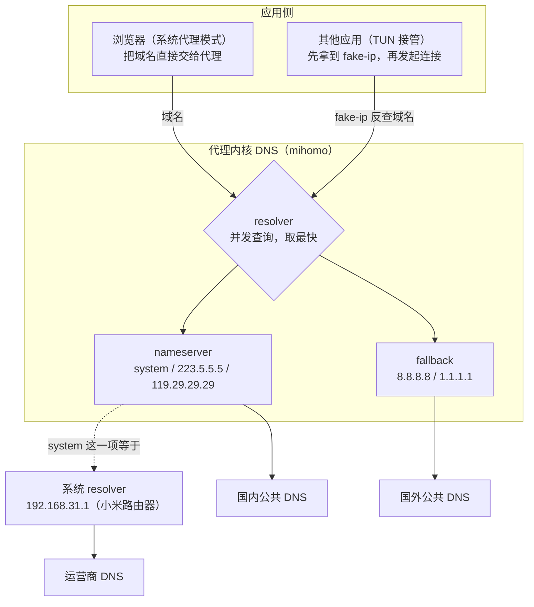
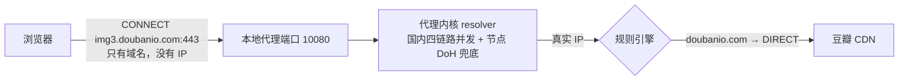
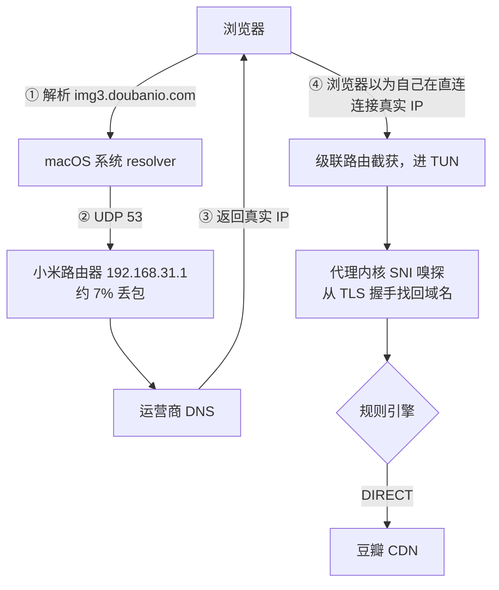
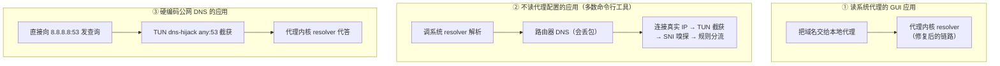

1. Table of Contents, ordered
{:toc}

## 现象：开着代理，豆瓣却卡得像断了网

一个反直觉的现象：代理开着（TUN 模式），刷 Google 很快，反倒是国内网站豆瓣卡得离谱——首页 HTML 能回来，页面却一直转圈，图片加载半天，偶尔能开、偶尔彻底打不开。

直觉上代理只该影响国外站点：规则里国内域名都是 DIRECT，豆瓣的服务器在国内，怎么会慢？怀疑对象自然先落在路径上——是不是流量被绕去国外转了一圈？

## 排查：路由表确实“抽象”，但不是凶手

### 数据路径一切正常

先看路由表。TUN 模式的代理（本机是 PandaFan，内核 mihomo）用一组**级联路由**接管了几乎全部 IPv4 流量：

```bash
$ netstat -nr -f inet | grep utun
1.0.0.0/8     198.18.0.1    UGSc    utun5
2.0.0.0/7     198.18.0.1    UGSc    utun5
4.0.0.0/6     198.18.0.1    UGSc    utun5
8.0.0.0/5     198.18.0.1    UGSc    utun5
...共 8 条，把除 0/8 外的 IPv4 空间拼满
```

豆瓣的 IP 确实全被导进了 TUN 虚拟网卡——看起来很可疑。但进 TUN 只是进代理内核过一遍规则，不等于出国。继续验证三个关键点：

- **规则**：配置里明确写着 `DOMAIN-SUFFIX,douban.com,DIRECT` 和 `DOMAIN-SUFFIX,doubanio.com,DIRECT`，豆瓣流量判定直连；
- **节点**：当前选中节点延迟 273ms，是活的；
- **实测**：走代理端口访问 `www.douban.com`，200 返回、全程 0.24 秒——比浏览器快得多。

数据路径没有问题。但同一时刻，走代理端口访问 `img3.doubanio.com`（豆瓣图片 CDN）和 `m.douban.com` 却挂起 10~20 秒直至超时。这些挂起的请求有一个共同点：**都是“新域名的第一次连接”**。这把嫌疑指向了 DNS。

### 真凶：DNS 间歇性全灭

直接对系统 DNS 复现：

```bash
$ dig +short img3.doubanio.com
;; connection timed out; no servers could be reached

$ dig +short m.douban.com
;; connection timed out; no servers could be reached
```

再看代理内核自己的解析（通过它的控制 API）：

```bash
$ curl "http://127.0.0.1:10079/dns/query?name=img3.doubanio.com"
{"message":"all DNS requests failed, first error: dial udp 1.1.1.1:53: i/o timeout"}
```

**所有上游 DNS 同时失败**。而豆瓣恰恰是这种故障的放大器：一个页面要拉 `img1`~`img9.doubanio.com`、`m.douban.com`、各种 API 子域，TUN 模式下每个新域名的第一次连接都要触发一次真实解析，赶上失败窗口，每个域名卡 5~20 秒——整体感受就是“豆瓣完全没法用”。

## 代理环境下的 DNS：三层链路，每条都可能是短板

为什么 DNS 会整个挂掉？要回答这个问题，得先看清代理环境下一次域名解析到底经过哪些地方。

### 先理解 fake-ip：为什么 TUN 模式离不开 DNS

TUN 在网络层抓包，抓到的是不透明 IP 包——只有 IP，没有域名。但代理分流要靠域名（`douban.com` 直连、`google.com` 走节点），于是有了 **fake-ip** 机制：应用解析域名时，代理的 DNS 直接回一个假 IP（`198.18.x.x` 段）；应用拿着假 IP 来连接时，代理反查出域名、走规则引擎，**判定 DIRECT 时才去做真实解析**，拿到真 IP 再拨号。

所以 TUN 模式下，每个 DIRECT 域名的第一次连接，都压着一次代理内核的真实 DNS 解析。这条解析链路一断，连接就只能干等。

### 三层链路逐条体检

完整的一次解析，最多涉及三层：



- **系统 resolver**：没人手动设过。连上 Wi-Fi 时路由器通过 DHCP 把自己（`192.168.31.1`）下发为 DNS，它再转发给运营商 DNS。实测连查 15 次超时 1 次（约 7% 丢包），故障窗口里还会连续超时——家用路由器的 DNS 转发，本来就没人保证质量。
- **nameserver**：`system`（等于上面那台路由器）加 `223.5.5.5`、`119.29.29.29`，全是裸 UDP。正常情况下靠两个公共 DNS 撑着没事，但运营商对 UDP 53 做 QoS 时照样抖。
- **fallback**：设计意图是“国内结果被污染时回退到国外 DNS”，但 `8.8.8.8` / `1.1.1.1` 的裸 UDP 从国内家宽出去长期被干扰——**这条兜底链路先天就是断的**。

三条腿各有各的瘸法，平时靠公共 DNS 硬撑；一旦国内链路抖动的窗口和 fallback 的常态失效叠加，就是日志里那句 `all DNS requests failed`。

### 旁证：为什么一开公司 VPN 就自愈

排查过程中还有一个关键观察：同样的代理配置，**把公司 VPN（Cisco Secure Client）开起来，豆瓣立刻变快**。

这不是 VPN 给豆瓣加了速。对照两个状态，唯一的变化是：VPN 连接后把系统主 DNS 换成了企业 DNS（`10.78.226.115`，走 VPN 隧道，稳定不丢包），而代理配置里 `nameserver` 的第一项恰好是 `system`——**系统 DNS 一换，代理的上游跟着换成了企业 DNS**，整条链最弱的一环被替掉了。数据路径完全没变：豆瓣流量照样进代理 TUN、照样判定 DIRECT、照样从家宽出去。

顺带排除一个常见猜想：“是不是 VPN 关了但路由没清掉？”不是——关 VPN 时路由表是干净的；而且从原理上说，残留路由指向已销毁的接口，症状是彻底不通，而不是“慢但能开”。

## 修复：把每条瘸腿都换掉

病因清楚了，修复就是给解析链路换上可靠的腿。改动都在代理的 `config.yaml` 的 `dns` 段：

```yaml
dns:
  # 新增：DNS 查询遵循路由规则 + 节点域名用国内 DoH 引导解析
  respect-rules: true
  proxy-server-nameserver:
    - https://223.5.5.5/dns-query
    - https://doh.pub/dns-query
  # nameserver：保留原有 UDP，新增国内 DoH——并发竞速，UDP 丢包有 TCP 兜底
  nameserver:
    - system
    - 119.29.29.29
    - 223.5.5.5
    - https://doh.pub/dns-query
    - https://dns.alidns.com/dns-query
  # fallback：裸 UDP 改成 DoH，并用 #Proxy 强制走代理节点
  fallback:
    - https://1.1.1.1/dns-query#Proxy
    - https://8.8.8.8/dns-query#Proxy
```

三处改动各有针对性：

- **nameserver 加国内 DoH**：`doh.pub` 和 `dns.alidns.com` 走 TCP/443，天然免疫 UDP 丢包；多条链路并发查询取最快应答，单点抖动不再致命。
- **fallback 改 DoH 并强制走节点**：这一步是被日志逼出来的。改成 DoH 后第一次测试依然超时，日志显示 `dial DIRECT (match Match/) mihomo --> 1.1.1.1:443`——**内核自己的 DNS 查询默认直连**，而 `1.1.1.1` 的 443 端口从家宽直连同样不通。讽刺的是，本机其他应用访问 `1.1.1.1:443` 反而能通：它们被 TUN 抓进内核、按规则走了节点，只有内核自己的查询“享受”不到代理。`#Proxy` 后缀就是告诉内核：这条 DNS 查询也要走名为 Proxy 的策略组出去。
- **`respect-rules` + `proxy-server-nameserver`**：前者让 DNS 查询遵循路由规则分流，后者指定节点域名的引导解析器，避免“要连节点先得解析节点域名、解析节点域名又得连节点”的鸡生蛋问题。

修复后验证（VPN 关闭状态）：

- 国内链路：连查豆瓣 CDN 10 次全部成功；
- fallback 链路：连查 `www.google.com` 6 次全部成功，且拿到的是干净的真实 IP（`142.251.x.x`），不再是之前的污染应答；
- 浏览器路径实测：`www.douban.com` 200 / 0.21 秒，`m.douban.com` 200 / 0.08 秒，Google 302 / 0.46 秒。

一个遗留提醒：这类 GUI 客户端（PandaFan、Clash Verge 等）的配置是托管的，**订阅更新或重启 App 可能把手改的 `config.yaml` 冲掉**。改动前留好备份；如果故障复发，先检查 DNS 段落还在不在，更彻底的做法是找客户端设置里的“自定义 DNS / 配置覆写”入口写进去。

## 修好之后：我的 DNS 现在到底是谁

链路修好了，回头回答那个最朴素的问题：现在上网，域名到底是谁在解析？答案是——**取决于应用走哪条路径**，逐种情况画出来。

先澄清一个容易混淆的前提：**TUN 模式和系统代理是两个互相独立的开关**。TUN 在路由层接管流量，系统代理只是往系统设置里写一个代理地址；客户端可以只开 TUN，也可以两个都开。本机的 PandaFan 就是两个都开——`scutil --proxy` 能看到系统代理指向 `127.0.0.1:10080`，同时路由表里躺着 TUN 的级联路由。所以下面两种浏览器路径在本机都真实存在，落入哪一种，取决于浏览器读不读系统代理这份“公告栏”。

### 情况一：浏览器 + 系统代理（含 SwitchyOmega 选“系统代理”）

Chrome、Safari 默认读系统代理；SwitchyOmega 选“系统代理”时也走这条路。浏览器不解析域名，直接把域名交给代理：



DNS 全程由修复后的代理内核链路完成，**不经过系统 resolver，也不碰路由器 DNS**。

### 情况二：浏览器绕开系统代理（SwitchyOmega 选“直连”等）

这条路径在三种场景下发生：SwitchyOmega 显式选“直连”；Firefox 把网络设置手动改成“不使用代理”；或者客户端只开 TUN、压根没设置系统代理（`scutil --proxy` 全为 0）。此时浏览器自己调系统 resolver 解析，DNS 走的是那条没修的路：



注意第 ④ 步：浏览器选了“直连”，数据包照样被 TUN 接管——**TUN 时代没有真正的直连**，区别只是 DNS 谁解析、分流判断在哪做。直连模式下 DNS 走系统 resolver → 路由器，域名信息还要靠 SNI 嗅探事后找补。

### 情况三：浏览器之外的流量

按应用“自觉程度”分三类：



第 ② 类是唯一还会踩路由器 DNS 坑的路径。想修也简单：把系统 DNS 从“自动”改成手动 `223.5.5.5`（系统设置 → Wi-Fi → 详细信息 → DNS），绕过路由器那一跳。这个改动与代理无关、随时可回退，也不影响公司 VPN——VPN 连接后公司域名的解析由它自己下发的 scoped DNS 负责，不看 Wi-Fi 的 DNS 配置。

### 所以，浏览器该选系统代理还是直连

两种模式数据路径几乎相同，差别集中在 DNS 一环：

| | DNS 谁解析 | 可靠性 | 分流判断依据 |
|---|---|---|---|
| 系统代理 | 代理内核（修复后的链路） | 实测 10/10 | 直接拿到域名 |
| 直连 | 系统 resolver → 路由器 | 约 7% 丢包 | SNI 嗅探事后找补 |

DNS 正常时两者速度几乎没有差别；但直连模式下每次 DNS 丢包就是两秒起步的重试等待，赶上连续丢包就是“整个站像挂了”。**系统代理模式的优势不是带宽，是消除了随机卡顿**。

这也顺带回答了 SwitchyOmega 这类插件在今天的意义：它的价值诞生于“手动切换走不走代理”的年代，而 TUN 模式把所有流量都接管、按规则自动分流之后，浏览器选什么模式都翻得出去——**插件剩下的唯一实际影响，就是 DNS 走哪条路**。固定选系统代理即可。

回头收束整条链路：豆瓣变卡的凶手不是路由、不是节点，而是 DNS；TUN 代理环境下的 DNS 是一张三层网，系统 resolver、nameserver、fallback 每条都可能是短板；修复的思路不是找一条“最好的 DNS”，而是**给每条链路都加上不丢包的 DoH 兜底，并确保兜底链路本身真的走得通**。
