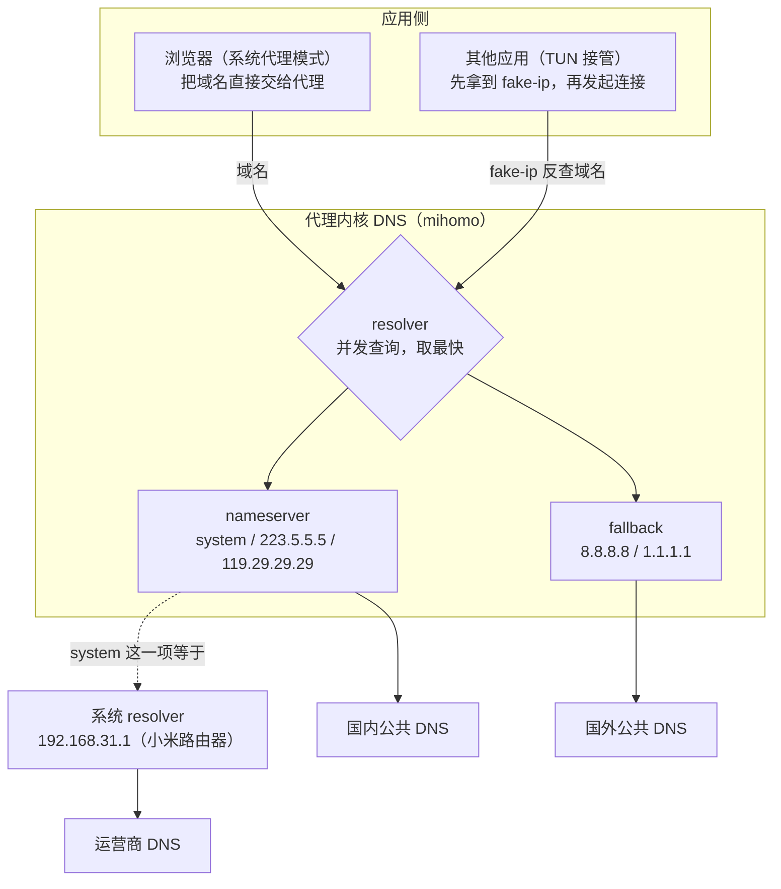
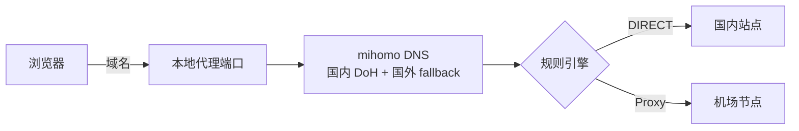
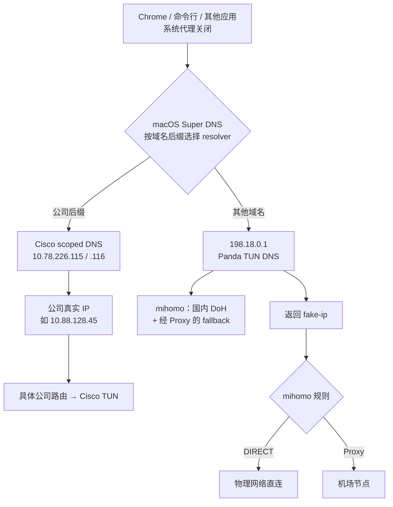

1. Table of Contents, ordered
{:toc}

## 现象：开着代理，豆瓣却卡得像断了网

一个反直觉的现象：代理开着（TUN 模式），刷 Google 很快，反倒是国内网站豆瓣卡得离谱——首页 HTML 能回来，页面却一直转圈，图片加载半天，偶尔能开、偶尔彻底打不开。

直觉上代理只该影响国外站点：规则里国内域名都是 DIRECT，豆瓣的服务器在国内，怎么会慢？怀疑对象自然先落在路径上——是不是流量被绕去国外转了一圈？

## 排查：路由表确实“抽象”，但不是凶手

先把“走错路”和“出发前查不到地址”拆成两个阶段验证，避免因为 TUN 路由看起来复杂就过早归因。

### 数据路径一切正常

先看路由表。TUN 模式的代理（本机是 PandaFan，内核 mihomo）用一组**级联路由**接管了几乎全部 IPv4 流量：

```bash
$ netstat -nr -f inet | grep utun
1.0.0.0/8     198.18.0.1    UGSc    utun5
2.0.0.0/7     198.18.0.1    UGSc    utun5
4.0.0.0/6     198.18.0.1    UGSc    utun5
8.0.0.0/5     198.18.0.1    UGSc    utun5
...共 8 条，把除 0/8 外的 IPv4 空间拼满
```

豆瓣的 IP 确实全被导进了 TUN 虚拟网卡——看起来很可疑。但进 TUN 只是进代理内核过一遍规则，不等于出国。继续验证三个关键点：

- **规则**：配置里明确写着 `DOMAIN-SUFFIX,douban.com,DIRECT` 和 `DOMAIN-SUFFIX,doubanio.com,DIRECT`，豆瓣流量判定直连；
- **节点**：当前选中节点延迟 273ms，是活的；
- **实测**：走代理端口访问 `www.douban.com`，200 返回、全程 0.24 秒——比浏览器快得多。

数据路径没有问题。但同一时刻，走代理端口访问 `img3.doubanio.com`（豆瓣图片 CDN）和 `m.douban.com` 却挂起 10~20 秒直至超时。这些挂起的请求有一个共同点：**都是“新域名的第一次连接”**。这把嫌疑指向了 DNS。

### 真凶：DNS 间歇性全灭

先对 `/etc/resolv.conf` 里列出的默认 DNS 做直接查询：

```bash
$ dig +short img3.doubanio.com
;; connection timed out; no servers could be reached

$ dig +short m.douban.com
;; connection timed out; no servers could be reached
```

这里要补一条 macOS 特有的诊断边界：`dig` 是独立的 DNS 测试工具，未指定 `@server` 时按 `/etc/resolv.conf` 逐个查询；它**不会完整复刻** macOS “Super DNS” 对 scoped / supplemental resolver 的选路。所以上面的结果能证明默认上游正在超时，却不能单凭它断言“所有应用、所有域名都使用了同一台 DNS”。要看系统真实维护的多 resolver 结构，应使用 `scutil --dns`；要沿系统 API 验证某个域名，则用 `dscacheutil -q host -a name <域名>`。

再看代理内核自己的解析（通过它的控制 API）：

```bash
$ curl "http://127.0.0.1:10079/dns/query?name=img3.doubanio.com"
{"message":"all DNS requests failed, first error: dial udp 1.1.1.1:53: i/o timeout"}
```

**所有上游 DNS 同时失败**。而豆瓣恰恰是这种故障的放大器：一个页面要拉 `img1`~`img9.doubanio.com`、`m.douban.com`、各种 API 子域，TUN 模式下每个新域名的第一次连接都要触发一次真实解析，赶上失败窗口，每个域名卡 5~20 秒——整体感受就是“豆瓣完全没法用”。

## 代理环境下的 DNS：三层链路，每条都可能是短板

为什么 DNS 会整个挂掉？要回答这个问题，得先看清代理环境下一次域名解析到底经过哪些地方。

### 先理解 fake-ip：为什么 TUN 模式离不开 DNS

TUN 在网络层抓包，抓到的是不透明 IP 包——只有 IP，没有域名。但代理分流要靠域名（`douban.com` 直连、`google.com` 走节点），于是有了 **fake-ip** 机制：应用解析域名时，代理的 DNS 直接回一个假 IP（`198.18.x.x` 段）；应用拿着假 IP 来连接时，代理反查出域名、走规则引擎，**判定 DIRECT 时才去做真实解析**，拿到真 IP 再拨号。

所以 TUN 模式下，每个 DIRECT 域名的第一次连接，都压着一次代理内核的真实 DNS 解析。这条解析链路一断，连接就只能干等。

### 三层链路逐条体检

完整的一次解析，最多涉及三层：



- **系统 resolver**：没人手动设过。连上 Wi-Fi 时路由器通过 DHCP 把自己（`192.168.31.1`）下发为 DNS，它再转发给运营商 DNS。实测连查 15 次超时 1 次（约 7% 丢包），故障窗口里还会连续超时——家用路由器的 DNS 转发，本来就没人保证质量。
- **nameserver**：`system`（等于上面那台路由器）加 `223.5.5.5`、`119.29.29.29`，全是裸 UDP。正常情况下靠两个公共 DNS 撑着没事，但运营商对 UDP 53 做 QoS 时照样抖。
- **fallback**：设计意图是“国内结果被污染时回退到国外 DNS”，但 `8.8.8.8` / `1.1.1.1` 的裸 UDP 从国内家宽出去长期被干扰——**这条兜底链路先天就是断的**。

三条腿各有各的瘸法，平时靠公共 DNS 硬撑；一旦国内链路抖动的窗口和 fallback 的常态失效叠加，就是日志里那句 `all DNS requests failed`。

### 旁证的边界：一开公司 VPN 就自愈，不等于 VPN 替换了主 DNS

排查过程中还有一个关键观察：同样的代理配置，**把公司 VPN（Cisco Secure Client）开起来，豆瓣立刻变快**。这个时间相关性把注意力引向 DNS，但后来复查也说明，不能把它直接写成因果关系。

Cisco 可以下发全局 DNS，也可以只为公司后缀安装 **supplemental resolver**。这台 Mac 后来的现场属于后一种：默认 resolver 仍是 Wi-Fi DNS，`didichuxing.com`、`didi.cn` 等公司后缀才使用 `10.78.226.115` 和 `10.78.226.116`。macOS 会为查询名选择后缀匹配最具体的 resolver，因此企业 DNS 能解析公司域名，却不会自然接管 `douban.com`。

所以“开 VPN 后豆瓣变快”更可能是 DNS 缓存、故障窗口结束，或网络扩展重建网络状态带来的暂时恢复。它可以作为排查线索，不能作为“企业 DNS 给普通网站加速”的证据。真正能锁定 DNS 根因的是前面的两条独立证据：默认上游直接查询超时，以及 mihomo 明确返回 `all DNS requests failed`。

顺带排除一个常见猜想：“是不是 VPN 关了但路由没清掉？”不是——关 VPN 时路由表是干净的；而且从原理上说，残留路由指向已销毁的接口，症状是彻底不通，而不是“慢但能开”。

## 第一层修复：先把 mihomo 自己的 DNS 换稳

病因清楚后，第一层修复是让**已经进入 mihomo DNS 模块**的查询不再依赖路由器和裸 UDP。下面是一份更确定的配置：主解析只用国内 DoH，国外 fallback 经代理，bootstrap 则只用 IP 形式的国内 DNS。

```yaml
dns:
  # DoH 域名的引导解析：必须能在 DoH 建立前工作，因此只写 IP
  default-nameserver:
    - 223.5.5.5
    - 119.29.29.29

  # DNS 查询遵循路由规则；节点域名用独立上游解析
  respect-rules: true
  proxy-server-nameserver:
    - https://223.5.5.5/dns-query
    - https://doh.pub/dns-query

  # 主解析不再混入 system 和裸 UDP，避免污染、抖动与自指循环
  nameserver:
    - https://doh.pub/dns-query
    - https://dns.alidns.com/dns-query

  # 国外备用解析经 Proxy 策略组发出
  fallback:
    - https://1.1.1.1/dns-query#Proxy
    - https://8.8.8.8/dns-query#Proxy
```

四处改动各有针对性，字段语义可与 [mihomo 官方 DNS 配置说明](https://wiki.metacubex.one/config/dns/)交叉核对：

- **`default-nameserver` 只放 IP**：它负责解析 DoH 服务器和其他 DNS 上游的域名，是建立加密 DNS 之前的 bootstrap。这里若再写一个需要 DNS 才能找到的域名，才会形成真正的循环依赖。
- **`nameserver` 只保留国内 DoH**：`doh.pub` 和 `dns.alidns.com` 走 HTTPS，不再把日常查询交给抖动的路由器转发和裸 UDP。尤其当 macOS 的系统 DNS 最终指回 Panda TUN 时，mihomo 的 `nameserver` 不能再包含 `system`，否则会形成“mihomo → 系统 DNS → mihomo”的自指分支。
- **fallback 改 DoH 并强制走节点**：这一步是被日志逼出来的。改成 DoH 后第一次测试依然超时，日志显示 `dial DIRECT (match Match/) mihomo --> 1.1.1.1:443`——**内核自己的 DNS 查询默认直连**，而 `1.1.1.1` 的 443 端口从家宽直连同样不通。讽刺的是，本机其他应用访问 `1.1.1.1:443` 反而能通：它们被 TUN 抓进内核、按规则走了节点，只有内核自己的查询“享受”不到代理。`#Proxy` 后缀就是告诉内核：这条 DNS 查询也要走名为 Proxy 的策略组出去。
- **`respect-rules` + `proxy-server-nameserver`**：前者让 DNS 查询遵循路由规则分流，后者指定节点域名的引导解析器，避免“要连节点先得解析节点域名、解析节点域名又得连节点”的鸡生蛋问题。

### DoH 为什么不会陷入循环依赖

访问 `https://doh.pub/dns-query` 确实要先知道 `doh.pub` 的 IP，但这不意味着 DoH 必然循环。一次建立过程分成两步：

1. mihomo 先用 `default-nameserver` 中的 `223.5.5.5` 或 `119.29.29.29`，解析 `doh.pub` 的地址；
2. 拿到地址后再建立 HTTPS 连接，TLS 的 SNI 和 HTTP 的 Host 仍然使用 `doh.pub`，因此证书校验和虚拟主机选择都不丢。

`https://223.5.5.5/dns-query` 则连第一步都不需要：URL 已经给出 IP，只要服务端证书支持这种访问方式即可。**bootstrap DNS 不是日常查询的另一套竞争上游，它只负责帮加密 DNS 找到门牌号。**

修复后验证（VPN 关闭状态）：

- 国内链路：连查豆瓣 CDN 10 次全部成功；
- fallback 链路：连查 `www.google.com` 6 次全部成功，且拿到的是干净的真实 IP（`142.251.x.x`），不再是之前的污染应答；
- 浏览器路径实测：`www.douban.com` 200 / 0.21 秒，`m.douban.com` 200 / 0.08 秒，Google 302 / 0.46 秒。

一个遗留提醒：这类 GUI 客户端（PandaFan、Clash Verge 等）的配置是托管的，**订阅更新或重启 App 可能把手改的 `config.yaml` 冲掉**。手改适合快速验证，长期配置应写进客户端提供的持久化覆写入口；PandaFan 对应的是“偏好设置 → 更多设置 → PandaCore 默认配置 → 编辑默认值”。保存后仍要重启核心，并以生成后的 `config.yaml`、端口监听和实际请求为准，不能只相信界面提示。

## 第二层问题：mihomo 修好了，系统 DNS 仍可能绕过去

修好 mihomo 的上游，只能保证**已经进入 mihomo DNS 模块**的查询可靠。TUN 模式和系统代理是两个独立入口，应用选择不同入口时，DNS 发生的位置也不同。

### 系统代理入口：域名直接交给代理

Chrome、Safari 等应用读取系统代理后，会把 `CONNECT img3.doubanio.com:443` 直接交给本地代理。代理从一开始就拿到域名，DNS 全程由 mihomo 完成，不经过 macOS 默认 resolver：



这条链能避开系统 DNS，却引入了另一个先后关系：浏览器先把公司域名交给代理，代理规则先于 macOS 路由表做决定。公司域名一旦被误判为 `Proxy`，后续只会产生“代理核心 → 机场节点”的连接，Cisco 的公司路由再具体也看不到原始内网目标。

### TUN 单入口：应用先解析，系统 resolver 可能绑定物理网卡

关闭系统代理后，Chrome 和命令行都像直连一样先调用 macOS resolver，再连接得到的 IP。直觉上，TUN 已配置 `dns-hijack: any:53`，所有 UDP/TCP 53 查询都应该被 mihomo 抢走；实测却暴露了一个 macOS 边界：DHCP 下发的 DNS resolver 可以带 `if_index: en0`，查询被绑定到 Wi-Fi 接口后，可能不按普通的 TUN 级联路由走。

这就是为什么“把小米 DHCP DNS 改成 `223.5.5.5`、`119.29.29.29`”仍不够：系统查询确实绕过了小米的转发器，却也可能绕过 Panda 的 `dns-hijack`。直接查询国内公共 DNS 时，`www.google.com` 和 `www.youtube.com` 仍出现了明显不属于目标站点的污染地址。

后续 TLS 连接有时会被 mihomo 的 SNI 嗅探救回来：Google 即使先拿到污染 IP，代理仍可能从 ClientHello 找回域名并改走节点。但这只是补救，不是可靠的 DNS 设计；YouTube 在同一轮测试中仍然连接超时，QUIC、ECH 和非 TLS 协议也不能假设永远有可见 SNI。

### 硬编码 DNS 也不一定都能劫持

应用直接向 `8.8.8.8:53` 发普通 DNS 时，通常会被 `dns-hijack: any:53` 截获；但如果应用把 socket 绑定到某个接口，边界与系统 scoped resolver 类似。应用自带的 DoH 则表现为普通 HTTPS 流量，端口不再是 53，TUN 只能按一般连接处理，不能靠 `dns-hijack` 识别并改写其中的 DNS 消息。

所以最终问题已经不是“选哪台公共 DNS”，而是：**如何让 macOS 默认查询明确进入 Panda TUN，同时又保留 Cisco 对公司域名的专用解析。**

## macOS 不是一张 DNS 列表，而是一套路由表

macOS 可以同时维护多组 resolver。`scutil --dns` 列出的第一组通常是默认 resolver，VPN 还可以为特定域名安装 supplemental resolver。系统的 Super DNS client 会按查询名选择后缀匹配最具体的一组，这与 IP 路由的“最长前缀匹配”很像，只是匹配对象从 IP 前缀换成了域名后缀。

在本次现场中：

- 普通域名使用默认 resolver；
- `didichuxing.com`、`didi.cn` 等公司后缀使用 Cisco 下发的 `10.78.226.115`、`10.78.226.116`；
- `dhr.didichuxing.com` 因此先得到 `10.88.128.45`，连接阶段再由更具体的 `10.0.0.0/8` 路由交给 Cisco TUN。

几条命令各自回答不同问题，不能互相替代：

| 命令 | 它回答什么 |
|---|---|
| `scutil --dns` | 系统当前有哪些默认和 supplemental resolver |
| `dscacheutil -q host -a name <域名>` | 应用走 macOS 系统解析 API 时得到什么 |
| `dig @<DNS-IP> <域名>` | 指定 DNS 服务器本身返回什么，不经过 Super DNS 选路 |
| `route -n get <目标IP>` | 已经拿到 IP 后，连接会进入哪张接口 |

DNS 选路和 IP 选路是两次独立裁决：前者决定“号码从哪本电话簿查”，后者决定“拿到号码后从哪条路走”。

## 最终落地：只保留 TUN 入口，让默认 DNS 也进入 TUN

最终方案遵循一个原则：**代理侧只保留一个捕获入口，DNS 侧把普通域名和公司域名分别交给各自最可靠的 resolver。**

### 两种使用场景不再手动切配置

| 场景 | PandaFan | Cisco Secure Client | macOS 系统代理 |
|---|---|---|---|
| 公司网络 | 增强/TUN 开启 | 关闭 | 关闭 |
| 家庭网络 | 增强/TUN 开启 | 开启 | 关闭 |

这里的“TUN 模式”指 PandaFan 代理的增强模式；Cisco 本身就是企业 VPN。PandaFan 选择“手动设置系统代理”，同时用 `scutil --proxy` 确认 `HTTPEnable`、`HTTPSEnable`、`SOCKSEnable`、`ProxyAutoConfigEnable` 全为 `0`。于是 Chrome、命令行和其他应用都先按直连方式产生请求，不会在应用层提前把域名交给 Panda。

### 把 Wi-Fi 默认 DNS 指向 Panda TUN

Panda TUN 使用 `198.18.0.1` 作为本地虚拟接口地址，并配置了 `dns-hijack: any:53`。把 macOS Wi-Fi 的默认 DNS 指向这个地址，系统普通查询就不再受 DHCP 的 `en0` 作用域约束，而是明确进入 Panda：

```bash
networksetup -setdnsservers Wi-Fi 198.18.0.1
dscacheutil -flushcache
```

`198.18.0.1` 不是外部公共 DNS，也不会被发到互联网。查询进入 TUN 后由 mihomo 返回 `198.18.x.x` fake-ip，连接这个 fake-ip 时再反查域名、执行 `DIRECT` 或 `Proxy` 规则。Panda 内部的真实解析使用上一节配置的 DoH，`nameserver` 不再包含 `system`，因此不会形成自指循环。

Cisco 开启时，公司后缀的 supplemental resolver 比默认 resolver 匹配得更具体，仍然优先使用企业 DNS；这就是为什么把默认 DNS 指向 Panda 后，`dhr.didichuxing.com` 依然解析为 `10.88.128.45` 并走公司 TUN。

这项设置按 macOS 的 Wi-Fi 网络服务保存，换家庭或公司 Wi-Fi 不需要重复修改。代价也必须明确：**PandaFan 必须保持连接**；如果主动关闭或核心崩溃，`198.18.0.1` 就没有 DNS 服务，表现会是所有新域名都打不开。需要临时不用 Panda 时，可恢复 DHCP DNS：

```bash
networksetup -setdnsservers Wi-Fi Empty
```

如果公司网络存在只由 DHCP DNS 才能解析、又没有被 Cisco supplemental resolver 覆盖的私有域名，这种服务级固定 DNS 会绕过它们；当前方案之所以适用，是因为常用公司域名由 Cisco scoped DNS 覆盖，`dhr.didichuxing.com` 本身也有公开可见的私网 A 记录。

### 小米路由器 DNS 仍然要改，但它只是底座

小米界面里的两类 DNS 不是一回事：

- **WAN DNS** 决定路由器自己向谁转发查询。设为 `223.5.5.5`、`119.29.29.29`，可以绕开光猫和运营商自动下发的上游；
- **LAN DHCP DNS** 决定路由器把哪些 DNS 地址发给客户端。把同一组公共 DNS 直接下发，可以让其他家庭设备少经过一层路由器转发。

这两项修复了原来“小米路由器 → 光猫 → 运营商 DNS”的脆弱链路，也给 Panda 的 bootstrap 和其他家庭设备提供可用底座；但裸公共 DNS 仍可能受 UDP 丢包或污染影响，所以**它不是这台 Mac 的最终解析入口**。Mac 的普通域名最终交给 Panda DoH，公司域名交给 Cisco scoped DNS。



### 最终验证

配置完成后，同一轮测试覆盖了三类目标：

| 目标 | 结果 | 用时 | 关键路径 |
|---|---:|---:|---|
| DHR 公司内网 | HTTP 200 | 约 0.58 秒 | 企业 DNS → `10.88.128.45` → Cisco TUN |
| Google | HTTP 204 | 约 1.06 秒 | Panda fake-ip → 代理节点 |
| YouTube | HTTP 200 | 约 1.98 秒 | Panda fake-ip → 代理节点 |
| 豆瓣 | HTTP 200 | 约 0.23 秒 | Panda fake-ip → `DIRECT` |

测试进程看到的远端地址是 `198.18.0.x` 属于正常现象：这是本机与 Panda 用户态协议栈之间的 fake-ip，不是网站真实地址。与此同时，`route -n get 10.88.128.45` 指向 Cisco TUN，普通公网目标指向 Panda TUN，系统代理四个开关全部为 `0`。

至此，最初的“国内网站随机卡顿”不再靠系统代理绕开症状，而是从两层收口：mihomo 上游使用可达的 DoH，macOS 默认 DNS 明确进入 Panda TUN；Cisco 则只接管自己更具体的公司域名和公司路由。**小米公共 DNS 是底座，Panda DoH 是普通域名的解析入口，Cisco scoped DNS 是公司命名空间的专用入口。**
