1. Table of Contents, ordered
{:toc}

> 说明：本文涉及的公司域名（包括内网域名）均已脱敏，统一以 `corp.example.com`、`internal.intra.example.com` 等示例名代替；IP 地址保留原值。
{: .prompt-info }

> 本文是下篇，讲“号怎么查”（代理环境下的 DNS 链路）。上篇[《代理与 VPN 的区别：从三层封装到四层接力》](/posts/2026/08/08/proxy-vs-vpn-principles/)讲“包怎么走”——捕获入口、TUN、路由裁决这些概念如果在阅读中遇到障碍，可以先读上篇。
{: .prompt-tip }

## 两个故障，一张地图

这篇文章源于两个真实故障：

- **在家里**：代理（TUN 模式）开着，刷 Google 很快，国内的豆瓣却卡得像断了网；
- **在公司**：只开代理、不开公司 VPN，公网一切正常，内网系统却转圈直到超时。

两个故障看似无关，根子却是同一条链路：**代理环境下的 DNS**。但直接扎进排查细节很容易被绕晕——TUN、fake-ip、fallback-filter、macOS 的 DNS 分流，缺了哪块拼图都看不懂现场。所以本文反过来组织：**先用四节把基础知识拉齐，再按“家里”“公司”两个场景复盘故障**。

两个场景的最终落地形态（排查也就发生在这套环境里）：

| 场景 | PandaFan 代理 | Cisco Secure Client（公司 VPN） | macOS 系统代理 |
|---|---|---|---|
| 家庭网络 | 增强/TUN 开启 | 开启 | 关闭 |
| 公司网络 | 增强/TUN 开启 | 关闭 | 关闭 |

每种场景下，应用进代理的入口又分两种：**TUN 模式**（全系统接管）和**端口模式**（应用读代理配置、主动连代理端口）。两个场景 × 两种入口，一共四种组合。正文以 TUN 为主线——故障都发生在它身上——每个场景再补一段端口模式的对照，结尾给出四种组合的速查表。

表里的“系统代理关闭”是刻意为之：PandaFan 选择“手动设置系统代理”，并用 `scutil --proxy` 确认 `HTTPEnable`、`HTTPSEnable`、`SOCKSEnable`、`ProxyAutoConfigEnable` 全为 `0`。于是 Chrome、命令行和其他应用都先按直连方式产生请求，不会在应用层提前把域名交给代理——所有流量统一走 TUN 这一个入口。

## 基础一：两种代理模式，应用发出的包从一开始就不一样

要理解后面所有故障，得先看清一个最底层的事实：**显式代理（端口模式）和 TUN 模式下，应用发出来的包，结构从一开始就不一样**——因为应用对代理的“知情程度”不同。

**显式代理模式：应用知道代理的存在，会说“代理协议”。** 既然知道自己在用代理，应用就按约定好的格式跟代理对话。以 HTTP 代理为例，它连上代理端口后的第一句话是明文：

```text
CONNECT douban.com:443 HTTP/1.1
```

这就像一封按格式写好的委托书：“请帮我连 `douban.com` 的 443 端口”。目标域名白纸黑字写在协议里，代理拆开就能读。SOCKS5 同理，握手报文里有专门的字段填域名。

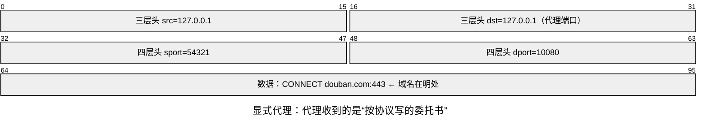

**TUN 模式：应用根本不知道代理的存在，发的是普通上网包。** 它以为自己在直连，照旧先查 DNS、再向目标 IP 发包。这个包从三层头、四层头到数据，通篇没有一个字段写域名：

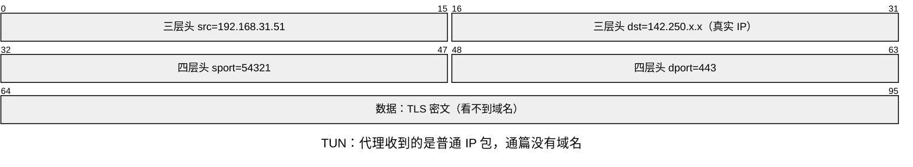

**这就是两者的本质区别：代理收到的“货”不同。** 显式代理收到的是委托书，目标是谁一目了然；TUN 收到的是普通包裹，面单上只有 IP。而代理的分流规则偏偏是按域名写的——所以 TUN 模式必须额外解决一个问题：怎么把域名找回来。

把代理从“收到包”到“发出包”的动作拆成几个阶段，就能看清 DNS 在这条流水线里的确切位置：

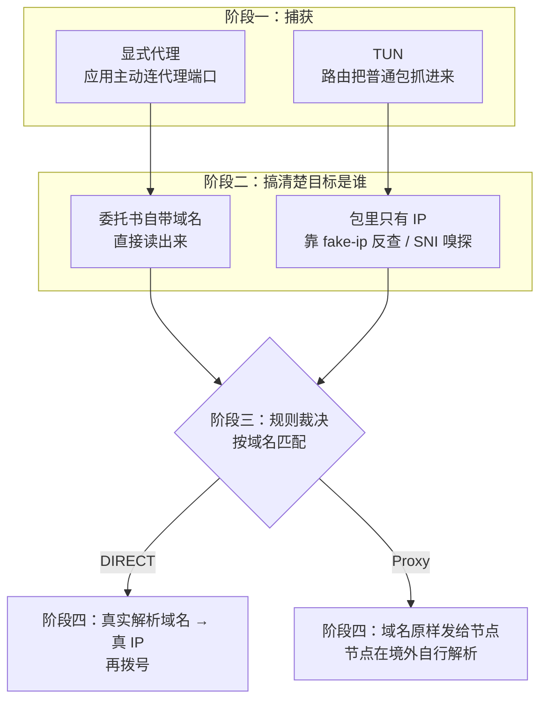

可以看到 **DNS 在这条流水线里登场两次，角色完全不同**：

- **阶段二之前（仅 TUN 模式）**：应用自己查 DNS 时，代理故意回答假 IP——DNS 应答被当成“捎带域名”的通道，这就是下一节要讲的 fake-ip；
- **阶段四的 DIRECT 分支（两种模式都有）**：要直连了，必须真的查出 IP——这时 DNS 干的是本职工作。

而 Proxy 分支全程不需要本地 DNS。这张阶段图就是后面所有故事的地图：TUN 为什么离不开 DNS（阶段二）、豆瓣为什么卡（阶段四的真实解析挂了）、公司内网为什么被误杀（阶段四的解析被 fallback-filter 裁决掉）。

## 基础二：fake-ip——为什么 TUN 模式离不开 DNS

前面已经看清：TUN 抓到的普通 IP 包里没有域名，而分流规则偏偏按域名写。那这个域名怎么找回来？

先排除一个直觉方案：让 DNS 正常返回真实 IP，代理拿到包之后再“反查”域名。这不可行——一个 CDN IP 上可能挂着几百个域名，从 IP 反推不出应用本来想访问谁。**只要 DNS 给出真答案，域名信息就永久丢失了。**

fake-ip 的思路是反过来的：**趁 DNS 应答还在代理手里，不给真答案，发一张“牌”**。代理本来就通过 `dns-hijack` 接管着 DNS 查询，于是它回一个 `198.18.x.x` 段的假 IP，同时在小本本上记下“假 IP ↔ 域名”的映射。应用拿着假 IP 来连接时（这个地址段会被路由进 TUN），代理一查小本本，域名就找回来了。整个过程像存包：柜员不告诉你货架位置，只给你一张 5 号牌；你拿着牌回来，他一查本子就知道你存的是什么。

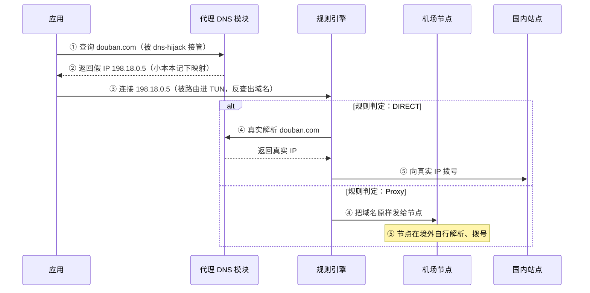

注意第 ② 步：代理应答时**自己也不需要知道真 IP**，所以 fake-ip 应答飞快。真实解析被推迟到必须它的时刻——两种去向对 DNS 的依赖完全不同：

- **Proxy**：域名原样发给节点，由节点在境外解析，本地从头到尾不需要真实 IP，**本地 DNS 挂不挂无所谓**；
- **DIRECT**：代理必须自己做一次真实解析（走 nameserver/fallback 那套链路，见基础三），拿到真 IP 再拨号。

所以“TUN 离不开 DNS”的准确含义是：**每个 DIRECT 域名的第一次连接，都压着一次代理内核的真实解析**。解析链路一断，连接不是报错，而是干等——记住这句话，场景一的豆瓣故障就是它的放大版。

### 端口模式为什么不需要 fake-ip

从阶段图能看清：fake-ip 只是 TUN 在阶段二补齐域名信息的装置；端口模式的委托书自带域名，阶段二零成本。代理协议之所以设计成“说域名”而不是“说 IP”，是因为拨号的是代理，解析也该由代理（或远端节点）在它合适的网络位置做——应用先解析反而会带上本地污染。

过了阶段二，两种模式走的是同一条流水线。逐项对比：

| | 端口模式 | TUN 模式 |
|---|---|---|
| 域名从哪来 | CONNECT/SOCKS 握手自带 | fake-ip 反查 / SNI 嗅探 |
| 应用自己查 DNS 吗 | 不查，只连 `127.0.0.1` | 查，但拿到假 IP |
| 判 DIRECT 后 | 代理解析真 IP 再拨号 | 代理解析真 IP 再拨号 |
| 判 Proxy 后 | 域名交节点远端解析 | 域名交节点远端解析 |
| 内核 DNS 挂了 | DIRECT 连接干等 | DIRECT 连接干等 |

所以“DIRECT 集体卡死”这类故障，走端口模式一样会发生，只是波及面不同：端口模式只影响读了代理配置的应用，TUN 影响所有应用。fake-ip 只是 TUN 入口为了补齐域名信息而装的装置，不是代理的通用机制。

### 追问：为什么不直接拆 IP 包找域名？

既然包里“有时候”也能看到域名（TLS 的 SNI、HTTP 的 Host 头），代理拆开看不就行了？确实能拆——mihomo 的 SNI 嗅探干的就是这个——但它只能当补救，当不了主力。

回看前面那张“TUN 普通包”：头部全是地址和端口，没有域名这个字段；域名只可能藏在“数据”里，而且只在特定协议的特定时刻出现——TLS 握手的 ClientHello 带 SNI，明文 HTTP 带 Host 头，其他协议（SSH、各种私有协议）根本没有。更要命的是时机：一条 TCP 连接的头三个包是握手，不含任何数据，而代理必须在连接到达的第一时间就决定走 DIRECT 还是节点。要等 SNI 出现再做决定，就得先假装服务器陪应用把握手做完——这已经是“事后偷看”的极限，而且 ECH、QUIC 正在把 SNI 也加密，偷看眼看要失效：

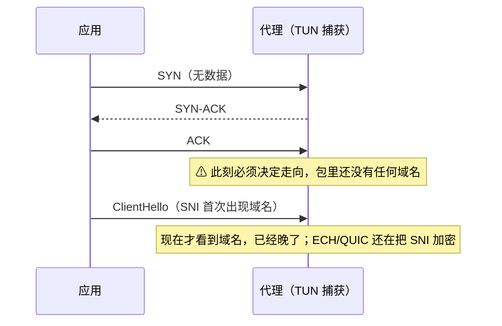

而 DNS 是域名唯一**必然以明文、必然在连接之前**出现的时刻。fake-ip 守住这个确定性时刻，SNI 嗅探则是在包里碰运气——主力和补救的分工就是这么定的。场景二还会看到嗅探的另一面：它把裸 IP 连接“升级”成域名连接，反而把故障放大了。

### 追问：TUN 模式是不是必然接管全系统 DNS？

fake-ip 模式下，**对**——发牌的前提是所有 DNS 查询都进代理的 DNS 模块，否则小本本上没有记录。做法就是配置里的 `dns-hijack: any:53`：凡是进 TUN 的 53 端口查询，无论你本来想问谁（路由器、公共 DNS、公司 DNS），一律改道到 mihomo 回答。这种接管只在包级拦截，不动系统设置本身，TUN 一关一切恢复原样。

但有两类查询它抓不到，场景一的故障二会跟它们挨个照面：一类是应用自己用 443 端口发的加密 DNS（DoH），在 TUN 眼里就是普通 HTTPS 流量；另一类是被“绑定物理网卡”的查询，会绕过 TUN 直接出门。

## 基础三：代理内核查 DNS 的家底：两组上游，一个裁判

基础一说过，无论哪种模式，只要规则判了 DIRECT，代理内核就得**自己**把域名查成真 IP 再拨号。那内核自己查 DNS 时问的是谁？这一节把它的家底翻出来。

**内核手头有两组上游，不是一组。** 配置里一组叫 `nameserver`（主组），放的是国内 DNS：阿里 `223.5.5.5`、腾讯 `119.29.29.29`，外加一个 `system`（意思是“去问系统”，它通向哪马上讲）。另一组叫 `fallback`（备组），放的是国外 DNS：`8.8.8.8`、`1.1.1.1`。

为什么要两组？因为只放哪一组都不放心：国内组快，但查国外域名时可能收到被人为塞进来的假答案；国外组干净，但从国内家宽直接问它，路上长期被干扰。所以内核的策略**不是**“主组挂了才用备组”，而是**两组同时问，再让一个裁判决定信谁**——这个裁判叫 `fallback-filter`，它的裁决规则是下一个话题，也是公司内网故障的伏笔。

先把这些上游各自的真实状况摸一遍。连上 `system` 牵出来的那条，一共三条链路：

- **主组 nameserver：靠两台国内公共 DNS 硬撑。** 这组用的都是“裸 UDP”查询——可以理解成寄明信片：不封口、不加密，路上谁都能看一眼、改两笔，忙的时候还可能被运营商故意压优先级、直接丢掉（行话叫 QoS 限速）。平时靠阿里、腾讯这两台公共 DNS 撑着没事，但明信片这种寄法，天生就不稳。
- **备组 fallback：先天就是断的。** `8.8.8.8`、`1.1.1.1` 的明信片从国内家宽寄出去，长期被干扰，大多数时候根本寄不到。所以“裁判倒向备组”基本等于“这次解析拿不到好结果”。
- **`system` 牵出的系统 DNS：最长、最脆的一条链。** 主组里的 `system` 指“用 macOS 系统里配置的那台 DNS”。这个配置没人手动设过，是连 Wi-Fi 时路由器自动塞给电脑的（路由器会给电脑发一份上网配置：IP、网关、DNS，这个过程叫 DHCP），里面写着“DNS 就用我 `192.168.31.1`”——小米路由器。于是查询先问路由器，路由器再转手问运营商的 DNS。实测连查 15 次超时 1 次（约 7% 丢包），故障窗口里还会连续超时——家用路由器顺手兼职的 DNS 转发，本来就没人保证质量。

三条链路画在一起，就是内核一次真实解析的全貌：

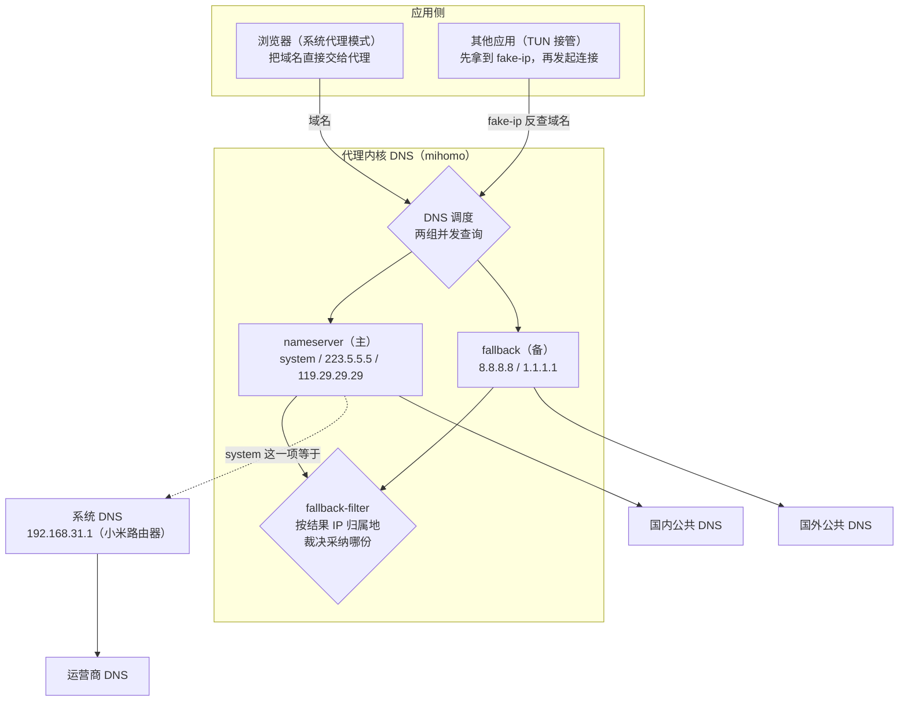

**三条腿各有各的瘸法**：主组靠公共 DNS 硬撑，`system` 这条链最脆，备组常年不通。平时还能凑合；一旦国内链路抖动的窗口叠上来，三组同时拿不到好结果，就是日志里那句 `all DNS requests failed`——场景一的豆瓣故障就是这么来的。

### fallback-filter：裁判的裁决规则，以及它的天生盲区

两组同时问，拿回两份答案，裁判 `fallback-filter` 凭什么决定信谁？这份配置里，裁判的规则写成配置只有三行：

```yaml
fallback-filter:
  geoip: true
  geoip-code: CN
```

翻译成人话：**主组给的 IP 如果在“中国名册”上，就信主组；不在，就把主组当骗子，改用备组的答案。** 这本“中国名册”就是 GeoIP CN 库——一个 IP 归属地数据库，登记着哪些 IP 号段分配给了中国大陆（代理分流规则里的 `GEOIP,CN,DIRECT` 查的也是这同一本名册）。

这个判断方法在家里上网时大体靠谱：被污染的假答案通常是境外 IP，“名册上没有”约等于“可疑”；国内网站的真答案都在名册上，顺利放行。但它有一个天生盲区：**名册只登记了公开发出去的号段，而公司内网偏偏爱用“内部编号”**——`10.0.0.0/8`、`100.64.0.0/10`（RFC 6598 保留的 CGNAT 段）这类保留地址段，任何国家的名册上都没有它们。于是内网域名的真实答案也会被裁判当成“骗子”丢掉；备组的国外公共 DNS 更不可能知道公司内网域名，只能答空。真答案被扔、空答案被采纳，解析就此失败。

在家里刷公网网站，这个盲区永远碰不到——所有答案都是公网 IP。可一旦把这套配置带进公司网络，盲区就会准时引爆。**先记住它，场景二见。**

## 基础四：macOS 有好几本 DNS 电话簿，按域名后缀分工

前面一直说“系统 DNS”，好像 macOS 只有一本电话簿。其实不是——**macOS 可以同时维护好几本，每本写清楚两件事：归我管哪些域名、查这些域名去问哪台服务器**。连 Wi-Fi 时路由器发下来的那本是“默认电话簿”，管所有没被点名的域名；VPN 这类软件还可以再装一本“专用电话簿”，只管自己圈定的域名——比如 Cisco 就给公司后缀单独安排了一本，指向两台公司 DNS（`10.78.226.115`、`10.78.226.116`）。

查域名时听哪本的？规则只有一条：**谁管的范围更具体，就听谁的**。“`corp.example.com` 这些公司后缀归企业 DNS 管”显然比“所有域名都归默认电话簿管”更具体，所以公司域名去问企业 DNS，剩下的才去翻默认电话簿。这跟 IP 路由“掩码越长越优先”是同一个思路，只不过这里比的不是 IP 前缀，而是域名后缀：

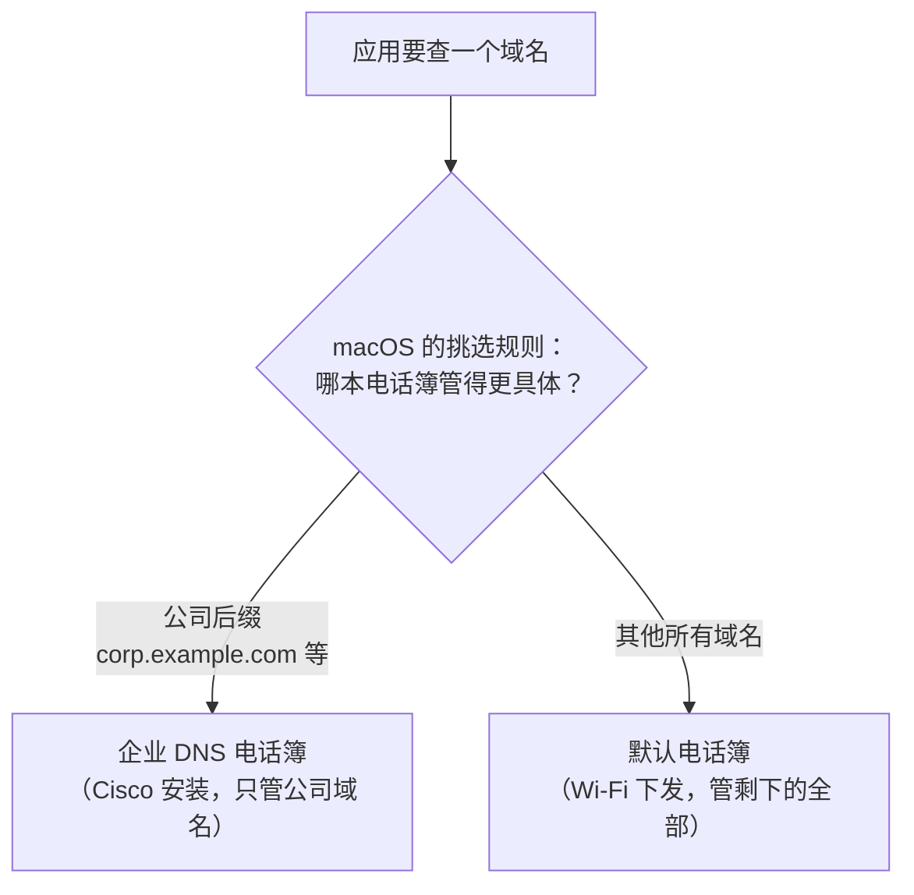

以本文的环境为例，`hr.corp.example.com` 的完整旅程是：先被分到企业 DNS 那本电话簿，查出 `10.88.128.45`；拿到 IP 后要连接了，再按 IP 路由表选路——`10.0.0.0/8` 这条更具体的公司路由把它交给 Cisco TUN。注意这里发生了**两次互不相干的裁决**：查号时按“域名后缀”挑电话簿，走路时按“IP 前缀”挑网卡。前者决定“号码从哪本电话簿查”，后者决定“拿到号码后从哪条路走”。

排查时用到的几条命令，各自只回答一个问题，不能互相替代：

| 命令 | 它回答什么 |
|---|---|
| `scutil --dns` | 系统当前有几本电话簿（默认的、只管特定后缀的） |
| `dscacheutil -q host -a name <域名>` | 应用走 macOS 系统解析时实际得到什么 |
| `dig @<DNS-IP> <域名>` | 指定 DNS 服务器本身返回什么，不经过系统的挑选 |
| `route -n get <目标IP>` | 已经拿到 IP 后，连接会进入哪张接口 |

## 场景一（家里）：代理和公司 VPN 同开

基础知识齐了，进第一个实战场景。家里的形态：PandaFan 代理常年开着（增强/TUN 模式），在家要访问公司资源，Cisco VPN 也常开，系统代理关闭——所有流量统一走 TUN 入口。

### 故障一：开着代理，豆瓣卡得像断了网

一个反直觉的现象：代理开着，刷 Google 很快，反倒是国内网站豆瓣卡得离谱——首页 HTML 能回来，页面却一直转圈，图片加载半天，偶尔能开、偶尔彻底打不开。

直觉上代理只该影响国外站点：规则里国内域名都是 DIRECT，豆瓣的服务器在国内，怎么会慢？怀疑对象自然先落在路径上——是不是流量被绕去国外转了一圈？

### 排查：先查“号”，再查“路”

网站打不开，无外乎两类原因：**出发前没查到地址**（DNS 出问题），或者**地址有了但路不对**（流量走错了方向）。一次连接本来就是先查号、再走路，排查也按这个顺序来。

**第一步：号有没有查到？** 直接问默认 DNS：

```bash
$ dig +short img3.doubanio.com
;; connection timed out; no servers could be reached

$ dig +short m.douban.com
;; connection timed out; no servers could be reached
```

全超时。注意 `dig` 只按默认 DNS 挨个问，它只能证明**默认 DNS 在抖**，说明不了全局；更硬的证据得看内核自己——通过它的控制 API 问一次：

```bash
$ curl "http://127.0.0.1:10079/dns/query?name=img3.doubanio.com"
{"message":"all DNS requests failed, first error: dial udp 1.1.1.1:53: i/o timeout"}
```

**所有上游 DNS 同时失败**——正是基础三说的“三条腿一起瘸”的叠加窗口。根因坐实：DNS 间歇性全灭。

这正好解释了实测里最扎眼的细节：走代理端口逐个访问豆瓣的子域，`www.douban.com` 0.24 秒秒开，`img3.doubanio.com`（图片 CDN）、`m.douban.com` 却挂起 10~20 秒直至超时——挂起的全是**“新域名的第一次连接”**。对照基础二的结论：每个 DIRECT 域名的第一次连接都压着一次内核真实解析，DNS 全灭时，它们自然集体卡死。

豆瓣之所以卡得最惨，因为它是这种故障的放大器：一个页面要拉 `img1`~`img9.doubanio.com`、`m.douban.com` 等十几个新子域，每个都是 DIRECT、每个的第一次连接都压着一次真实解析，赶上失败窗口各卡 5~20 秒，叠加起来就是“首页能开、图片全转圈”。而走节点的 Google 反而快——它根本不依赖本地解析。

**第二步：路有没有走错？** 根因已经坐实，再把“路”排除一遍，顺便见识下 TUN 的路由表。TUN 模式的代理（本机是 PandaFan，内核 mihomo）用了一组“级联路由”来接管流量——听着玄乎，做法其实很粗暴：**把整个 IP 地址空间像切西瓜一样切成 8 块，每块写一条路由，全部指向代理的虚拟网卡**。合起来的效果就是“几乎所有流量都先进代理过一遍”，但又没有直接动系统的默认路由：

```bash
$ netstat -nr -f inet | grep utun
1.0.0.0/8     198.18.0.1    UGSc    utun5
2.0.0.0/7     198.18.0.1    UGSc    utun5
4.0.0.0/6     198.18.0.1    UGSc    utun5
8.0.0.0/5     198.18.0.1    UGSc    utun5
...共 8 条，把除 0/8 外的 IPv4 空间拼满
```

豆瓣的 IP 确实全被导进了 TUN 虚拟网卡——看起来很可疑。但按基础一的流水线，进 TUN 只是进代理内核过一遍规则，不等于出国。再确认两件事：规则里豆瓣明明白白是 `DIRECT`；当前节点延迟 273ms，是活的。**路也没有问题**——症状全部由第一步的 DNS 全灭解释。

排查中还有个小插曲，值得提一句防踩坑：同样的代理配置，**把公司 VPN 开起来，豆瓣立刻变快**。但按基础四的机制，Cisco 只给公司后缀装了专用电话簿，管不着 `douban.com`——变快更可能是 DNS 缓存被刷新了，或者故障窗口恰好过去了。**时间相关不等于因果**：真正锁定根因的是第一步的两条硬证据（默认上游超时、内核报 `all DNS requests failed`），不是这个插曲。

### 修复一：把 mihomo 自己的 DNS 换成 DoH

病因清楚后，修复一是让**已经进入 mihomo DNS 模块**的查询不再依赖路由器和裸 UDP。方案核心是把普通 DNS 查询换成 **DoH**（DNS over HTTPS）：把 DNS 查询装进加密的 HTTPS 请求里，从外面看就是一次普通网页访问，路由器和运营商看不见内容、也没法篡改。整体安排是：日常查询只用国内 DoH，国外备用查询经代理节点出去，另留一组只写 IP 的普通 DNS 当“引导员”（作用马上讲）。

```yaml
dns:
  # DoH 域名的引导解析：必须能在 DoH 建立前工作，因此只写 IP
  default-nameserver:
    - 223.5.5.5
    - 119.29.29.29

  # DNS 查询遵循路由规则；节点域名用独立上游解析
  respect-rules: true
  proxy-server-nameserver:
    - https://223.5.5.5/dns-query
    - https://doh.pub/dns-query

  # 主解析不再混入 system 和裸 UDP，避免污染、抖动与自指循环
  nameserver:
    - https://doh.pub/dns-query
    - https://dns.alidns.com/dns-query

  # 国外备用解析经 Proxy 策略组发出
  fallback:
    - https://1.1.1.1/dns-query#Proxy
    - https://8.8.8.8/dns-query#Proxy
```

四处改动各有针对性，字段语义可与 [mihomo 官方 DNS 配置说明](https://wiki.metacubex.one/config/dns/)交叉核对：

- **`default-nameserver` 只放 IP**：它的角色是“引导员”——要用 DoH，得先连上 `doh.pub` 这台服务器；要连它，又得先知道它的 IP；查这个 IP 用的就是 default-nameserver。所以它必须只写 IP 这种直接能用的地址；这里要是也写一个域名，就变成“查地址之前得先会查地址”的鸡生蛋了。
- **`nameserver` 只保留国内 DoH**：`doh.pub` 和 `dns.alidns.com` 走加密的 HTTPS，不再把日常查询交给抖动的路由器和裸 UDP。另一个坑：`nameserver` 里不能再留 `system`（系统 DNS）——修复二会把系统 DNS 指向 Panda TUN，如果 mihomo 又去问系统 DNS，就变成“mihomo 问系统、系统问回 mihomo”的无限转圈。
- **fallback 改 DoH 并强制走节点**：这一步是被日志逼出来的。改成 DoH 后第一次测试依然超时，日志显示 `dial DIRECT (match Match/) mihomo --> 1.1.1.1:443`——**内核自己的 DNS 查询默认直连**，而 `1.1.1.1` 的 443 端口从家宽直连同样不通。讽刺的是，本机其他应用访问 `1.1.1.1:443` 反而能通：它们被 TUN 抓进内核、按规则走了节点，只有内核自己的查询“享受”不到代理。`#Proxy` 后缀就是告诉内核：这条 DNS 查询也要走名为 Proxy 的策略组出去。
- **`respect-rules` + `proxy-server-nameserver`**：前者让 DNS 查询遵循路由规则分流，后者指定节点域名的引导解析器，避免“要连节点先得解析节点域名、解析节点域名又得连节点”的鸡生蛋问题。

fallback 那个坑里还藏着一个值得细看的反差：同一个 `1.1.1.1:443`，普通应用访问能通，内核自己访问反而不通——

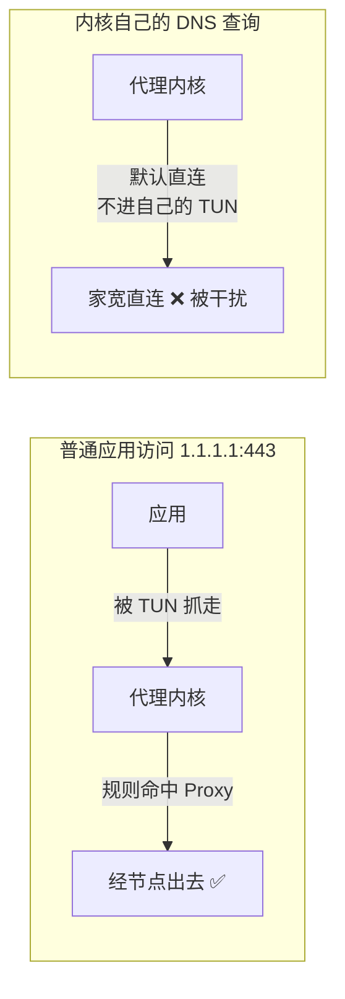

修复后验证（VPN 关闭状态）：

- 国内链路：连查豆瓣 CDN 10 次全部成功；
- fallback 链路：连查 `www.google.com` 6 次全部成功，且拿到的是干净的真实 IP（`142.251.x.x`），不再是之前的污染应答；
- 浏览器路径实测：`www.douban.com` 200 / 0.21 秒，`m.douban.com` 200 / 0.08 秒，Google 302 / 0.46 秒。

一个遗留提醒：这类 GUI 客户端（PandaFan、Clash Verge 等）的配置是托管的，**订阅更新或重启 App 可能把手改的 `config.yaml` 冲掉**。手改适合快速验证，长期配置应写进客户端提供的持久化覆写入口；PandaFan 对应的是“偏好设置 → 更多设置 → PandaCore 默认配置 → 编辑默认值”。保存后仍要重启核心，并以生成后的 `config.yaml`、端口监听和实际请求为准，不能只相信界面提示。这个提醒第二天就应验了：运行时配置被悄无声息地重写，上面这套 DoH 修复直接消失——兜底方案见场景二的“持久化”一节。

### 故障二：mihomo 修好了，系统 DNS 仍可能绕过 TUN

修复一只能保证**已经进入 mihomo DNS 模块**的查询可靠。但按基础二的结论，TUN 模式下应用是“先自己查 DNS、再连接”的——这些系统侧发出的查询，真的都进了 mihomo 吗？理论上，TUN 配了 `dns-hijack: any:53`，所有 53 端口的查询都该被抢走。但实测暴露了 macOS 的一个怪癖：**路由器自动下发的 DNS 配置，可能带着“必须从 Wi-Fi 网卡（`en0`）出去”的标记**（配置里写作 `if_index: en0`）。被这样绑死网卡的查询会绕过 TUN 的拦截直接出门——相当于包裹上贴了“仅限陆运”，TUN 这条空中走廊它根本不进。

这就是为什么“把小米路由器下发的 DNS 改成 `223.5.5.5`、`119.29.29.29`”还不够：查询确实绕过了小米的转发器，却也可能连 Panda 的 `dns-hijack` 一起绕过。实测向国内公共 DNS 直接查询时，`www.google.com` 和 `www.youtube.com` 依然拿到了明显张冠李戴的污染地址。

后续的 TLS 连接有时会被 mihomo 的 SNI 嗅探救回来（就是基础二里“拆包找域名”那个补救）：Google 即使先拿到污染 IP，代理仍可能从 ClientHello 里抠出域名、改走节点。但补救终究不可靠——YouTube 在同一轮测试里照样超时；QUIC、ECH 和非 TLS 协议，更不能假设永远有明文域名可看。

这条“先被坑、再被救”的完整时序是这样的：

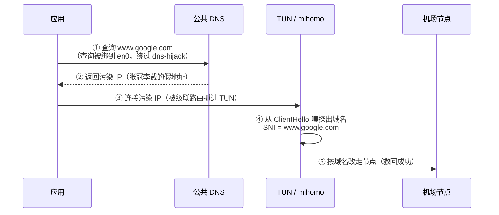

能不能被救，全看第 ④ 步有没有明文域名可抠——这就是它只能当补救的原因。

至于应用自己硬编码的 DNS：直接向 `8.8.8.8:53` 发的普通查询通常会被 `dns-hijack` 截获，但绑死网卡的查询和走 443 端口的 DoH 都抓不到——靠“劫持”兜底终归有漏。

所以最终问题已经不是“选哪台公共 DNS”，而是：**如何让 macOS 默认查询明确进入 Panda TUN，同时又保留 Cisco 对公司域名的专用解析。**

### 端口模式对照：域名直接交给代理

如果不用 TUN，改用系统代理（端口模式），DNS 发生的位置完全不同。Chrome、Safari 等应用读取系统代理后，会把 `CONNECT img3.doubanio.com:443` 直接交给本地代理。代理从一开始就拿到域名，DNS 全程由 mihomo 完成，不经过 macOS 的系统 DNS——故障二的“绕过 TUN”问题根本不存在：

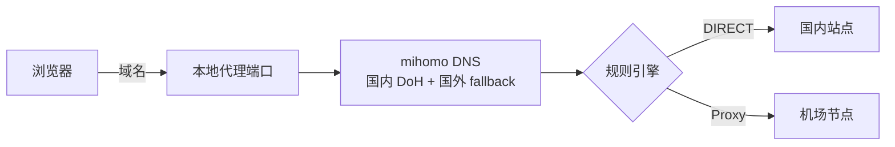

但这条链引入了另一个先后关系：浏览器先把公司域名交给代理，**代理规则先于 macOS 的电话簿分工做决定**。公司域名一旦被误判为 `Proxy`，后续只会产生“代理核心 → 机场节点”的连接，Cisco 的公司路由再具体也看不到原始内网目标。在家里“代理 + VPN 同开”的场景下，这是个实打实的风险——这正是最终方案选择 TUN 单入口、而不是系统代理的原因。

### 修复二：只保留 TUN 入口，让默认 DNS 也进入 TUN

修复二遵循一个原则：**代理侧只保留一个捕获入口，DNS 侧把普通域名和公司域名分别交给各自最可靠的 DNS。**

Panda TUN 使用 `198.18.0.1` 作为本地虚拟接口地址，并配置了 `dns-hijack: any:53`。把 macOS Wi-Fi 的默认 DNS 指向这个地址，系统查询就不再带“必须走 Wi-Fi 网卡”的标记，而是明确进入 Panda：

```bash
networksetup -setdnsservers Wi-Fi 198.18.0.1
dscacheutil -flushcache
```

`198.18.0.1` 不是外部公共 DNS，也不会被发到互联网。查询进入 TUN 后由 mihomo 返回 `198.18.x.x` fake-ip，连接这个 fake-ip 时再反查域名、执行 `DIRECT` 或 `Proxy` 规则。Panda 内部的真实解析使用修复一配置的 DoH，`nameserver` 不再包含 `system`，因此不会形成自指循环。

Cisco 开启时，公司后缀有它专门指定的 DNS——按基础四“后缀匹配更具体者优先”，公司域名仍然用企业 DNS 解析。这就是为什么把默认 DNS 指向 Panda 后，`hr.corp.example.com` 依然解析为 `10.88.128.45` 并走公司 TUN：**两套机制各管各的后缀，互不干扰**。

这项设置按 macOS 的 Wi-Fi 网络服务保存，换家庭或公司 Wi-Fi 不需要重复修改。代价也必须明确：**PandaFan 必须保持连接**；如果主动关闭或核心崩溃，`198.18.0.1` 就没有 DNS 服务，表现会是所有新域名都打不开。需要临时不用 Panda 时，可恢复 DHCP DNS：

```bash
networksetup -setdnsservers Wi-Fi Empty
```

如果公司网络里存在“只有默认 DNS 解析得了、Cisco 又没单独安排”的私有域名，把默认 DNS 固定指向 Panda 就会绕过它们。当前方案之所以没这个问题，是因为常用公司域名都有 Cisco 指定的专用 DNS 覆盖，`hr.corp.example.com` 本身也有公开可见的私网 A 记录。

#### 小米路由器 DNS 仍然要改，但它只是底座

小米界面里的两类 DNS 不是一回事：

- **WAN DNS** 决定路由器自己向谁转发查询。设为 `223.5.5.5`、`119.29.29.29`，可以绕开光猫和运营商自动下发的上游；
- **LAN DHCP DNS** 决定路由器把哪些 DNS 地址发给客户端。把同一组公共 DNS 直接下发，可以让其他家庭设备少经过一层路由器转发。

这两项修复了原来“小米路由器 → 光猫 → 运营商 DNS”的脆弱链路，也给 Panda 的引导 DNS 和其他家庭设备提供可用底座；但裸公共 DNS 仍可能受 UDP 丢包或污染影响，所以**它不是这台 Mac 的最终解析入口**。Mac 的普通域名最终交给 Panda DoH，公司域名交给 Cisco 指定的公司 DNS。

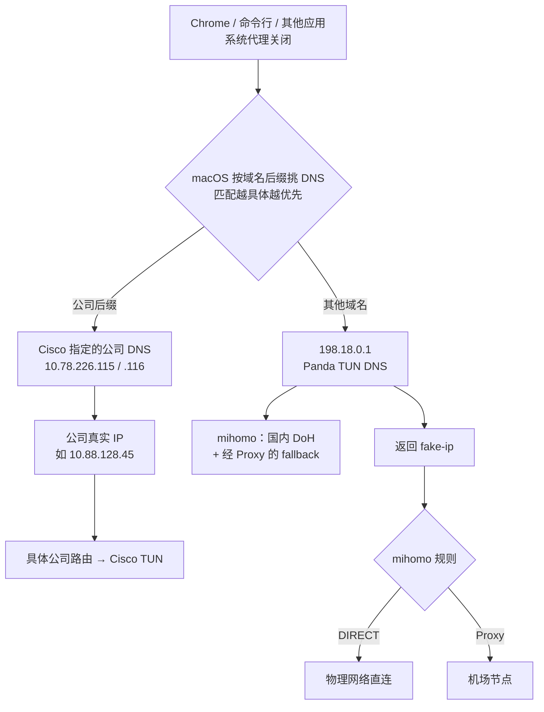

#### 最终验证

配置完成后，同一轮测试覆盖了三类目标：

| 目标 | 结果 | 用时 | 关键路径 |
|---|---|---:|---|
| DHR 公司内网 | HTTP 200 | 约 0.58 秒 | 企业 DNS → `10.88.128.45` → Cisco TUN |
| Google | HTTP 204 | 约 1.06 秒 | Panda fake-ip → 代理节点 |
| YouTube | HTTP 200 | 约 1.98 秒 | Panda fake-ip → 代理节点 |
| 豆瓣 | HTTP 200 | 约 0.23 秒 | Panda fake-ip → `DIRECT` |

测试进程看到的远端地址是 `198.18.0.x` 属于正常现象：这是本机与 Panda 用户态协议栈之间的 fake-ip，不是网站真实地址。与此同时，`route -n get 10.88.128.45` 指向 Cisco TUN，普通公网目标指向 Panda TUN，系统代理四个开关全部为 `0`。

至此，场景一的“国内网站随机卡顿”不再靠系统代理绕开症状，而是从两层收口：mihomo 上游使用可达的 DoH，macOS 默认 DNS 明确进入 Panda TUN；Cisco 则只接管自己更具体的公司域名和公司路由。**小米公共 DNS 是底座，Panda DoH 是普通域名的解析入口，Cisco 指定的公司 DNS 是公司域名的专用入口。**

## 场景二（公司）：只开代理，不开 VPN

家里的方案落地后，第二天把电脑带进公司——正好是场景定义里的形态：“PandaFan TUN 开启、Cisco 关闭”。结果第一次实战就撞上新故障：内网系统（形如 `internal.intra.example.com`）一直转圈直到超时，而公网代理、国内直连全部正常。

### 排查：从“路不通”查到“查不到号”

代理环境下内网打不开，第一反应总是怀疑链路：路由被代理抢了？和企业 VPN 冲突？那就先量链路。让代理照常工作、用裸 IP 直连这台内网系统：`100.69.238.148:443` 的 TCP 能建立，但 TLS 握手死在 ClientHello 之后（`SSL_ERROR_SYSCALL`）。

“TCP 通、TLS 卡死”很容易把人引向 MTU 或中间设备；嫌疑一度也落到了 Cisco 头上——虽然 VPN 会话没开，但它装了一个常驻的系统插件（socket filter，作用是按进程接管网络连接），理论上确实可能和“代理内核代发连接”产生冲突。不过两个对照实验排除了这些方向：

- **同一内核转发公网 HTTPS 完全正常**：`baidu.com` 经 DIRECT 规则返回 200，说明代理内核的转发能力没有问题。故障和“这个目的地”相关，而不是和“转发”这个动作相关；
- **绑定物理网卡、彻底绕开代理内核**直连同一目标，TLS 握手一路走完 Certificate 交换——VPN 残留扩展并不拦路，“路”本身是通的。

路通而页面打不开，剩下的怀疑对象就是“查号”。先看 DNS 的表面：`dig` 这个内网域名，拿到的是 `198.18.x.x` 的 fake-ip——这是 TUN 的正常机制，不是故障。真正的矛盾藏在内核日志里（`external-controller` 的 `/logs` 接口）：

```text
[DNS] internal.intra.example.com --> [100.69.238.148] A from udp://172.25.218.221:53
[DNS] internal.intra.example.com --> [] A from udp://1.1.1.1:53
[TCP] dial DIRECT (match Match/) ... --> internal.intra.example.com:443 error: dns resolve failed: couldn't find ip
```

公司 DNS **成功返回了** `100.69.238.148`，fallback 的公共 DNS 返回空（它当然不可能知道内网域名），内核最终却报 `couldn't find ip`——一份真结果、一份空结果，内核为什么采纳了空的？

### 印证：正是 fallback-filter 的保留段盲区

“真结果被丢、空结果被采纳”这个矛盾，答案正是基础三预告的盲区。这台内网系统的地址 `100.69.238.148` 落在 `100.64.0.0/10`——RFC 6598 保留的 CGNAT 段，不在任何国家的 GeoIP 记录里。于是主 DNS 的真实答案被 fallback-filter 误判为污染、丢弃，fallback 又答空，`couldn't find ip` 就是这么来的：

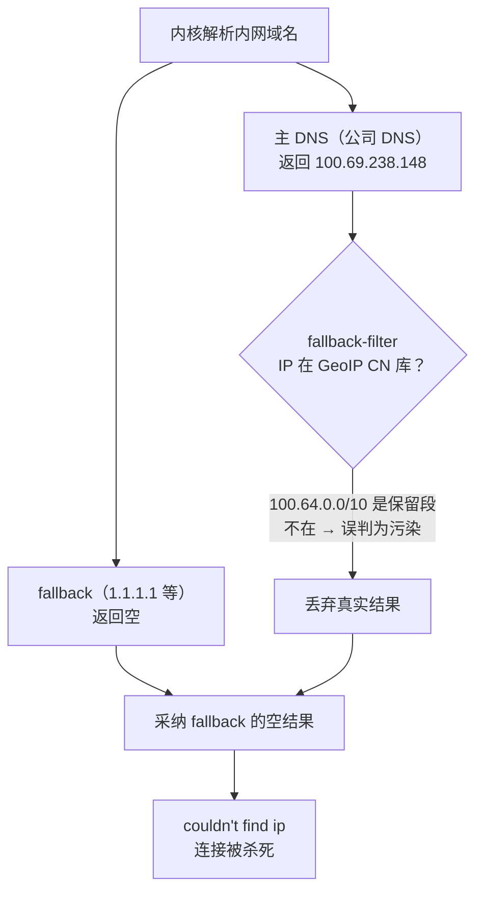

机制对上了，回看前面的每个现象也都严丝合缝：

- **“TCP 通、TLS 卡死”**：裸 IP 连接不需要解析，TCP 自然能建立；但 SNI 嗅探从 ClientHello 取出域名后重新走规则，DIRECT 拨号需要真实 IP，撞上同一个解析失败，连接在 TLS 阶段被杀；
- **公网国内域名不受影响**：它们的结果在 CN 库里，filter 直接采纳；
- **`10.x` 网段的内网应用不受影响**：它们直接以 IP 连接，命中 `IP-CIDR,10.0.0.0/8,DIRECT`，不触发内核解析。

只有“需要内核解析、且答案落在保留段”的内网域名，被这个机制精确误杀——基础三里那个理论盲区，在这里变成了现实故障。

其中“TCP 通、TLS 卡死”这条最值得画成时间线——能看清 SNI 嗅探是怎么把一手好事办砸的：

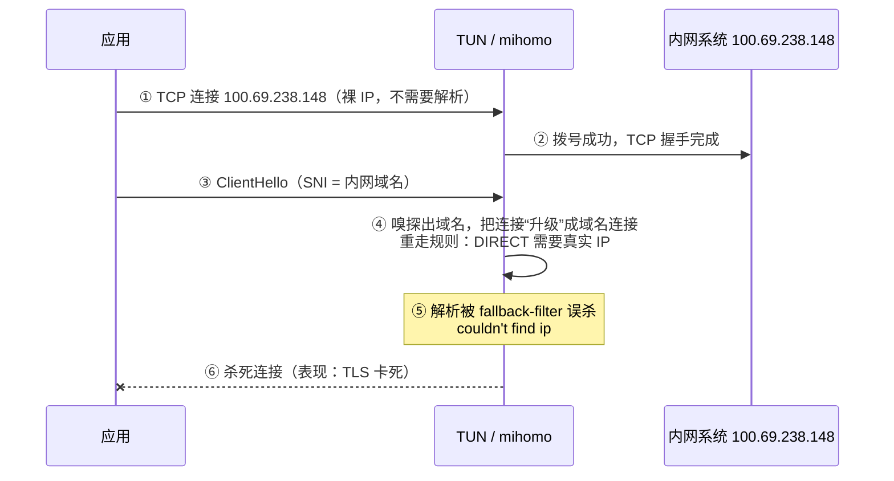

如果第 ③ 步没有明文 SNI 可抠，连接反而会以裸 IP 的身份顺利走完——补救机制在这里起了反作用。

### 端口模式对照：这个坑一样躲不开

这次故障发生在 TUN 模式，但换端口模式并不能躲开。端口模式下，应用把内网域名写进 `CONNECT` 交给代理，代理判 DIRECT 后同样要做阶段四的真实解析——**同样撞上 fallback-filter 的误杀**。区别只在两点：

- **波及面**：端口模式只影响读了代理配置的应用，TUN 影响所有应用；
- **TUN 独有的放大器**：SNI 嗅探把本来能走通的裸 IP 连接也“升级”拖下了水（上面那条时间线），端口模式没有这一步。

也就是说，只要内网域名进入 nameserver/fallback 的“二选一”，两种模式都会被误杀。真正的出路只有一个：让内网域名**根本不参加这个二选一**。

### 修复：nameserver-policy 把公司域名摘出“二选一”

mihomo 的 `nameserver-policy` 优先级高于 `nameserver`/`fallback`：命中的域名直接由指定上游解析，不参与 fallback-filter 的 GeoIP 裁决。把公司各个域名后缀指向公司 DNS（域名已脱敏）：

```yaml
dns:
  nameserver-policy:
    "+.corp.example.com": [172.25.218.221, 172.25.218.248]
    # 其余公司后缀照此添加
```

改完通过控制 API 热重载（`PUT /configs?force=true`），内网系统立即恢复，公网代理和国内直连的回归测试也都正常。

### 持久化：修复本身也可能被重写

修复只有几行 yaml，但紧接着的另一个发现让问题多了一层：前一天写入的内核 DoH 配置（见场景一的修复一），这天已经不在运行时的 `config.yaml` 里了——GUI 客户端在某个时刻重新生成了配置。前文“以生成后的 `config.yaml` 为准，不能只相信界面提示”的提醒，第二天就应验了。

手改文件只适合快速验证，长期生效需要兜底。本次落地的是一个看门狗：launchd 的 `WatchPaths` 监听 `config.yaml`，脚本发现 `nameserver-policy` 被刷掉就自动插回 `dns` 段，再走控制 API 热重载；并通过“手动删掉 policy、观察它自动恢复”做了一次实战演练。核心逻辑不过几行：

```bash
CONFIG=".../config.yaml"
# 修复还在就退出；否则把 nameserver-policy 块插回 dns 段
grep -q "nameserver-policy" "$CONFIG" && exit 0
# ...（插入配置）... 然后热重载内核
curl -X PUT "http://127.0.0.1:10079/configs?force=true" \
  -H "Content-Type: application/json" -d "{\"path\": \"$CONFIG\"}"
```

## 收尾：四种组合一页速查

两个场景 × 两种入口，各自的要害汇总如下：

| | 家里（代理 + 公司 VPN 同开） | 公司（只开代理，不开 VPN） |
|---|---|---|
| **TUN 模式** | 全系统应用都进 TUN；系统 DNS 可能被 `if_index` 绑卡绕过 `dns-hijack`，需把默认 DNS 显式指向 `198.18.0.1`；公司后缀由 Cisco 的专用电话簿分流，与 Panda 互不干扰 | 内网保留段域名会被 fallback-filter 误杀，必须配 `nameserver-policy` 把公司后缀摘出去；SNI 嗅探会把裸 IP 内网连接拖下水 |
| **端口模式** | DNS 全程在代理内核，家里那套 DoH 修复天然生效、不怕系统 DNS 绕路；但公司域名先过代理规则，一旦被误判 Proxy 就直接发往境外节点，Cisco 路由救不回来 | 内网域名 CONNECT 进代理后走 DIRECT 真实解析，同样被 fallback-filter 误杀——`nameserver-policy` 同样是必需品 |

两个场景的共同结论也就一句话：**代理环境下，DNS 不再只是“查号码”，而是流水线的一部分**——TUN 靠它捎带域名（fake-ip），DIRECT 靠它拿真 IP（nameserver/fallback）。家里的故障出在“真 IP 查不出来”，公司的故障出在“真 IP 被查出来又被扔掉”；把这两条链路看清楚，四种组合里无论踩到哪个坑，都能很快定位到是哪一段。
