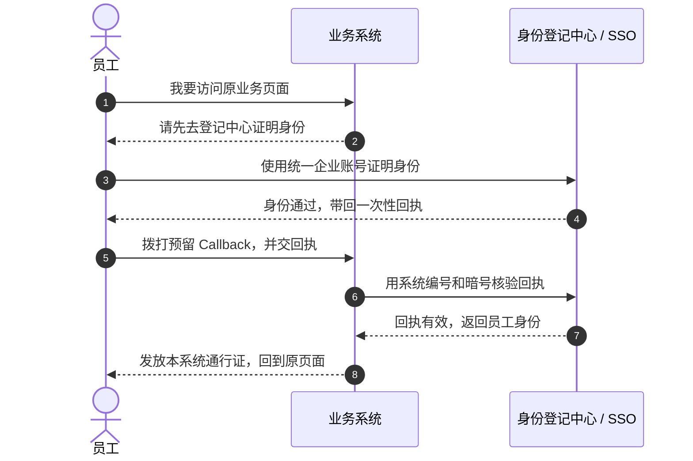
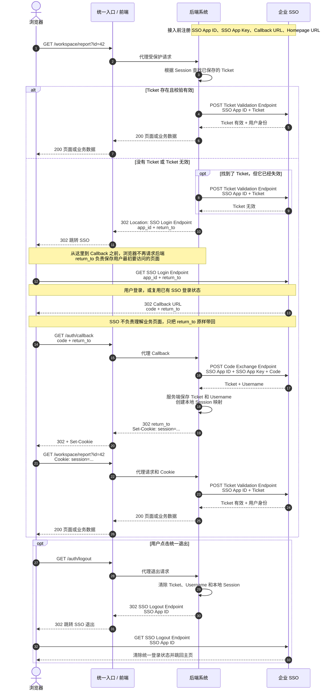
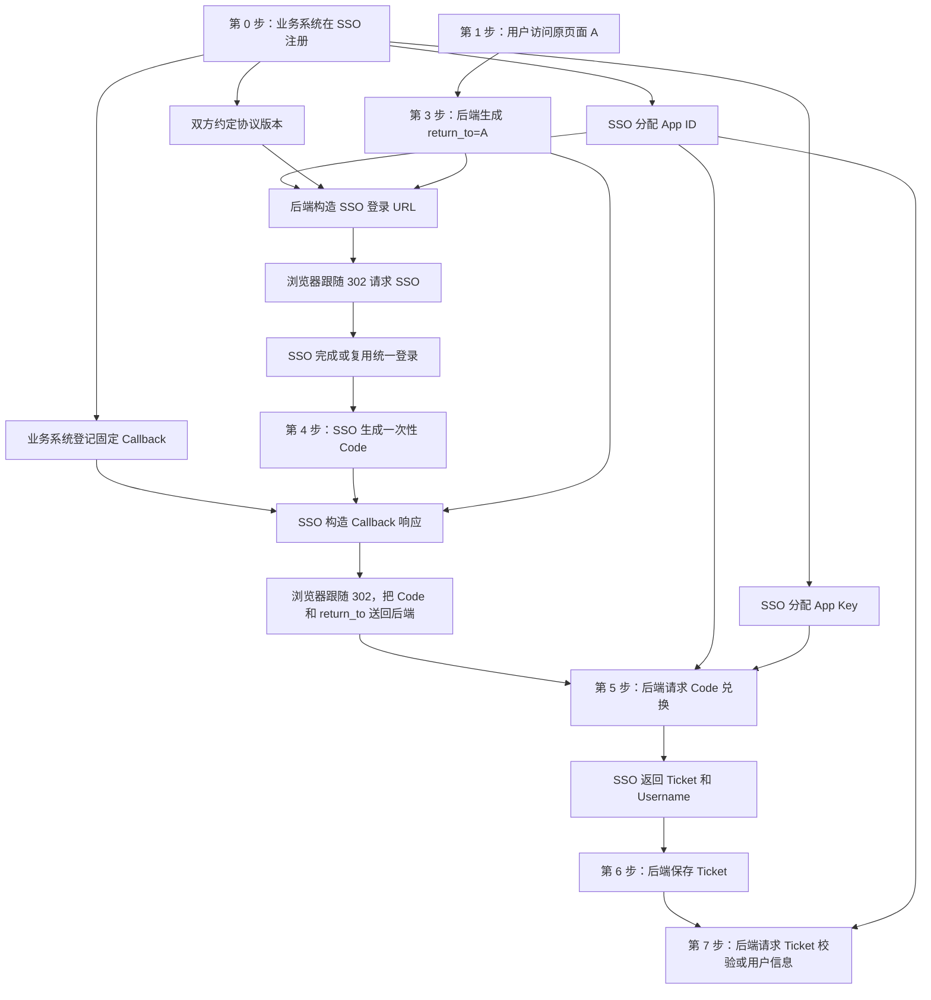
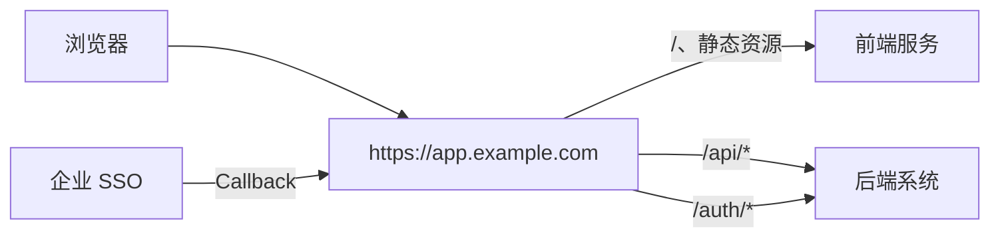

1. Table of Contents, ordered
{:toc}

**SSO（Single Sign-On，单点登录）的目的，是让用户用一套企业账号访问所有已经接入的业务系统。**用户在统一身份平台完成一次认证后，只要统一登录状态仍然有效，再进入其他接入系统时通常不必重复注册、记忆另一套密码或重新登录。

企业因此可以集中处理账号开通与回收、密码策略、多因素认证和审计；业务系统也不必保存用户密码。不过这些都是建立在用户“一套账号通行多个系统”之上的管理和技术收益。

本文使用完全脱敏的名称和地址。SSO 域名、业务路径、配置变量和接口路径都是通用占位符，不对应任何具体系统。

## 先看类比时序：身份登记中心如何通知业务系统

把 SSO 想成公司的**身份登记中心**，把一个业务系统想成只对员工开放的业务单位。业务单位不亲自检查密码，而是接受登记中心出具的身份结论。



这张图已经包含完整骨架：用户先找业务系统，业务系统把认证交给 SSO；SSO 验明身份后发出一次性回执；业务系统再次向 SSO 核实，最后才建立自己的登录状态。

其中，**Callback 就是后端系统预先留在 SSO 注册中心的电话号码**。用户证明完身份后，SSO 按照这个号码把登录结果送回后端系统，从而触发后端的校验流程。

真实 HTTP 流程并不是 SSO 服务器直接拨打一通后台请求。SSO 返回 `302 Location`，把 Callback URL 和一次性 Code 交给浏览器，再由浏览器访问 Callback。**概念上是身份登记中心“回拨”，网络上则是浏览器替它把回执送到后端。**

类比建立后，下面直接进入正式流程。后文把“登录后要回到的原页面”统一称为 `return_to`；某些专有协议可能使用其他参数名，但作用相同。

## 正式流程：从访问页面到获得 Ticket

下面的时序展示一种企业自研的 **Code + Ticket** SSO。它不是标准 OIDC：浏览器不会收到 `id_token`，后端也不是拿 IdP 公钥离线验 JWT，而是通过 SSO 的 Code 和 Ticket 接口完成服务器间校验。

为了避免 Ticket 明文暴露给前端，图中采用推荐做法：后端保存 Ticket，浏览器只持有一个业务系统自己的 Session Cookie，后端再用这个 Session 找到对应 Ticket。



先看完整图，再沿着它逐步引入每一项配置。这样每个变量都能落到一个明确的请求或响应上。

### 第 0 步：接入注册——先留下系统身份和电话号码

正式登录发生前，业务系统要先在 SSO 注册中心登记。这里第一次出现四项固定配置：

| 注册配置 | 类比 | 谁保管 | 后面在哪里使用 |
|---|---|---|---|
| SSO App ID | 业务单位编号 | SSO、后端系统；可以出现在浏览器 URL | 发起登录、校验 Ticket、兑换 Code、统一退出 |
| SSO App Key | 双方约定的暗号 | 仅 SSO 和后端系统 | 后端用 Code 兑换 Ticket 时证明自身身份 |
| Callback URL | 预留电话号码 | SSO 注册中心、后端和统一入口 | SSO 登录成功后把 Code 送回哪个固定入口 |
| Homepage URL | 业务单位门牌地址 | SSO 注册中心 | 缺少具体 Return URL 时的默认落点 |

还要为后端配置 **SSO Base URL**，让它知道登录、Ticket 校验、Code 兑换和退出接口属于哪个 SSO 环境。测试环境和正式环境的 App ID、App Key、Callback 与 Base URL 必须成套匹配。

SSO App Key 是后端 Secret，不能进入前端代码、浏览器 URL 或公开日志。Callback URL 不是 Secret，但必须登记为受控固定地址；在本文对应的专有协议中，注册 Callback 时应使用干净路径，不在后面预置 `?query`。

### 第 1 步：访问受保护页面——后端先找本地 Ticket

用户访问：

```text
GET https://<public-entry>/workspace/report?id=42
```

统一入口把受保护请求转发给后端。**真正的登录校验必须发生在后端**，前端可以负责页面跳转和展示，但不能成为唯一鉴权点，否则调用者可以绕开前端直接访问 API。

后端先根据浏览器的 Session Cookie 查找服务端保存的 Ticket：

- 找到 Ticket，进入第 2 步验证有效性；
- 没找到 Ticket，直接进入第 3 步跳转 SSO；
- Ticket 不应跨业务系统复用，也不应把明文 Ticket 交给前端长期保存。

一种安全做法是让浏览器只保存随机 Session ID，后端维护下面的映射：

```text
Session ID → Ticket + Username + 本地用户信息
```

这样 Ticket 始终停留在服务器侧。若必须经过前端传递，也至少需要加密、限制有效期并评估泄露面。

### 第 2 步：已有 Ticket——向 SSO 校验是否仍然有效

找到 Ticket 不等于它仍然有效。后端请求 Ticket 校验接口：

```text
POST https://<sso-host>/<ticket-validation-endpoint>

app_id=<SSO_APP_ID>
ticket=<TICKET>
```

SSO 响应 Ticket 是否有效，并返回协议允许的用户身份。校验成功才能继续访问；校验失败则转入 SSO 登录。

这一步使用：

- **SSO App ID**：限定 Ticket 属于哪个接入系统，防止跨系统使用；
- **Ticket**：证明这名用户此前已经通过 SSO；
- **Ticket Validation Endpoint**：由 SSO 提供，后端服务器调用。

在本文对应的协议要求中，每个涉及身份验证的动作都要确认 Ticket 可用，例如页面刷新或访问受保护 API。即使工程上增加短时缓存，也必须先确认协议和安全策略允许，不能仅凭本地 Cookie 永久跳过 SSO Ticket 校验。

### 第 3 步：没有有效 Ticket——302 跳转到 SSO 登录入口

后端返回：

```http
HTTP/1.1 302 Found
Location: https://<sso-host>/<login-endpoint>
  ?app_id=<SSO_APP_ID>
  &return_to=<encoded-original-url>
```

这里第一次使用两个浏览器可见参数：

- `app_id` 来自 **SSO App ID**，告诉 SSO 是哪个业务系统发起登录；
- `return_to` 保存用户原本想访问的完整地址，登录结束后由业务系统恢复现场。

`return_to` 必须一路透传，是因为后端返回这个 302 以后，浏览器接下来直接与 SSO 交互，暂时不再访问业务后端。SSO 只知道如何验证用户身份，并不知道用户最初想打开业务系统的哪个页面。如果这条地址在跳转中丢失，登录依然可以成功，但用户只能被送到统一首页，而不能回到刚才的报表、搜索结果或编辑页面。

它的完整接力过程是：

```text
用户原页面 A
  → 后端 302：SSO Login Endpoint?return_to=A
  → SSO 302：Callback URL?code=C&return_to=A
  → 浏览器请求 Callback，并把 C 和 A 交回后端
  → 后端完成校验后 302：Location=A
  → 用户回到最初想访问的页面 A
```

因此，`return_to` 主要解决的是用户体验和业务上下文连续性。它不是身份凭据，也不能替代固定注册的 Callback。

Return URL 应先进行 URL Encode。不要把未编码的 `#fragment` 直接拼入参数，因为 `#` 后面的部分通常只留在浏览器，不会随 HTTP 请求发送到服务器。

SSO App Key 绝不能出现在这个 URL 中。它只在后端兑换 Code 时使用。

### 第 4 步：SSO 登录成功——回到固定 Callback

用户完成登录后，SSO 返回：

```http
HTTP/1.1 302 Found
Location: https://<public-entry>/auth/callback
  ?code=<ONE_TIME_CODE>
  &return_to=<encoded-original-url>
```

这个响应同时带回两样东西：

- `code` 由 SSO 生成，是短时、一次性的 Ticket 兑换凭证；
- `return_to` 是业务系统发起登录时传入的原地址，SSO 只负责透传。

这里的“透传”很关键：SSO 不解析业务页面，也不决定用户最终去哪；它只是把业务系统在登录开始时交来的 `return_to`，连同新生成的 Code 一起放回 Callback URL。浏览器随后访问 Callback，后端才重新回到流程中。

必须区分两个地址：

- **Callback URL** 是接入时固定注册的电话号码，决定“登录结果交给哪个后端入口”；
- **Return URL** 是每次登录动态携带的页面地址，决定“后端处理完成后把用户送回哪里”。

Callback 不是 Return URL。它通常只填写一个固定路径；动态页面和查询参数应放进 Return URL，而不是提前拼在 Callback 后面。

后端最终使用 Return URL 前必须校验其 Origin 和路径，只允许跳回本业务系统认可的地址，避免攻击者把它替换成外部网站形成开放重定向。另一种实现是只在浏览器链路中传递随机状态 ID，把真正的原页面保存在服务端，再在 Callback 中根据状态 ID 取回。

### 第 5 步：Callback 收到 Code——后端兑换 Ticket

浏览器访问 Callback 后，后端读取 Code，并从服务器侧请求 Code 兑换接口：

```text
POST https://<sso-host>/<code-exchange-endpoint>

app_id=<SSO_APP_ID>
app_key=<SSO_APP_KEY>
code=<ONE_TIME_CODE>
```

SSO 校验成功后返回：

```json
{
  "ticket": "<TICKET>",
  "username": "<USERNAME>"
}
```

这一步同时证明两件事：

- Code 证明浏览器刚刚完成过一次 SSO 登录；
- SSO App Key 证明兑换者确实是注册过的后端系统。

因此，浏览器只拿到 Code，而不是直接拿到最终 Ticket。Code 可以短时经过浏览器；SSO App Key 和 Ticket 则尽量只在服务器之间流转。POST 的意义也不只是“参数不出现在 URL”，更重要的是兑换请求发生在受信任后端，并同时携带后端 Secret。

#### 为什么不能直接把 Code 当成 Ticket

> 如果 Code 仍然保持短时、一次性，它就无法承担持续登录；如果让它变成长时、可重复使用，它实际上就变成了一张曾经暴露在浏览器 URL 里的 Ticket。

### 第 6 步：保存 Ticket——建立业务系统自己的 Session

后端取得 Ticket 和 Username 后，在服务器侧保存它们，并创建本地 Session 映射。Callback 最终响应：

```http
HTTP/1.1 302 Found
Location: https://<public-entry>/workspace/report?id=42
Set-Cookie: session=...; Path=/; HttpOnly; SameSite=Lax; Secure
```

`Set-Cookie` 让浏览器后续自动携带本系统登录态；`HttpOnly` 防止前端 JavaScript 读取；`Location` 则使用 Return URL 把用户送回原页面。

如果发起登录时没有提供 Return URL，某些专有 SSO 会透传一个类似 `index` 的默认标记。业务系统应把这个标记映射到自己的 Homepage URL，而不是把 `index` 当成外部网址直接跳转。

### 第 7 步：回到原页面——再次验证 Ticket

浏览器回到原页面后会携带本地 Session Cookie。后端用 Session 找到 Ticket，再调用 Ticket 校验接口。成功后返回页面或业务数据；失败则清除本地映射并重新进入登录流程。

这一轮看似重复，实际完成了信任闭环：

```text
浏览器 Session
  → 后端找到服务端 Ticket
  → SSO 确认 Ticket 仍然有效
  → 后端执行本系统权限检查
  → 返回业务数据
```

SSO 只确认“这个人是谁”，后端系统仍要确认“这个人能访问什么”。所以即使 Ticket 有效，也不能省略本系统的角色、菜单和数据权限校验。

### 第 8 步：统一退出——同时清除两层登录状态

退出时，后端先删除服务端保存的 Ticket、Username 和本地 Session，再让浏览器跳转到 SSO 统一退出地址：

```http
HTTP/1.1 302 Found
Location: https://<sso-host>/<logout-endpoint>?app_id=<SSO_APP_ID>
```

这里再次使用 SSO App ID，让 SSO 知道由哪个接入系统发起退出。只删除业务系统 Cookie 会留下 SSO 登录状态；只退出 SSO 而不清理本地 Ticket，也可能留下错误的本地会话。完整退出需要同时处理两层状态。

## 换成各方视角：每个参与者在各阶段做了什么

前面的时序图沿着一次登录从上往下展开，适合观察请求和响应。把同一条时间线按参与者重新整理，才能看清每一方从接入到退出分别承担什么职责。

### 浏览器：在几个地址之间搬运请求和响应

- **首次访问**：请求用户真正想打开的页面，并自动携带本系统的 Session Cookie。
- **跳转登录**：收到后端的 `302` 后访问 SSO 登录入口，同时把 SSO App ID 和 Return URL 带给 SSO。
- **SSO 登录**：展示登录页面、提交用户凭据，或者直接复用浏览器中已有的 SSO 登录状态。
- **回调接力**：收到 SSO 的 `302` 后访问固定 Callback，把 Code 和一路透传的 Return URL 交回后端。
- **恢复现场**：保存后端通过 `Set-Cookie` 建立的本地 Session，再按最后一个 `302` 回到最初的业务页面。
- **统一退出**：先请求后端退出入口，再继续跟随跳转访问 SSO 退出入口。

浏览器在这个过程中更像一名“信使”：它负责跟随 `302` 把消息送到下一站，但不负责判断 Ticket 是否有效，也不应该持有 SSO App Key。Code 和 Return URL 可以短暂经过浏览器，最终 Ticket 则应尽量留在服务器侧。

### 统一入口：把同一个公开地址分发给正确服务

- **普通页面和静态资源**：转发给前端服务。
- **业务 API**：转发给后端服务，并保留 Cookie、查询参数和必要请求头。
- **登录与退出入口**：把浏览器请求转发给后端的 SSO 组件。
- **Callback**：把 SSO 回跳到公开域名的请求准确转发给后端 Callback 处理器。
- **后端响应**：把 `302`、`Location` 和 `Set-Cookie` 原样交还浏览器。

统一入口解决的是“请求应该送到哪里”，而不是“用户身份是否可信”。它可以承担 TLS、域名和路由，但不能用一条前端路由规则代替后端鉴权。

### 后端系统：完成协议闭环并建立本地登录态

- **接入阶段**：申请 SSO App ID 和 SSO App Key，登记 Callback URL 与 Homepage URL，并配置对应环境的 SSO 接口地址。
- **首次访问**：读取本地 Session，判断能否找到服务端 Ticket；没有有效 Ticket 时生成带 Return URL 的 SSO 登录地址。
- **已有登录态**：拿 Ticket 请求 SSO 校验；身份有效后，再执行本系统自己的角色、菜单和数据权限检查。
- **处理 Callback**：读取 Code 与 Return URL，先校验 Return URL，再携带 SSO App ID、SSO App Key 和 Code 从服务器侧兑换 Ticket。
- **建立会话**：保存 Ticket、Username 与本地用户信息，生成只对本系统有效的 Session，并把用户送回原页面。
- **退出阶段**：清除本地 Session、Ticket 和 Username，再让浏览器进入 SSO 统一退出流程。

后端是这套流程的真正控制者。它既是 SSO 协议中的接入客户端，也是本地会话的管理者，还是业务权限的最终执行者；浏览器跳转只是帮助它把登录流程串起来。

### SSO：作为统一身份的权威来源

- **接入阶段**：登记业务系统身份、后端密钥、固定 Callback 和默认主页，并约束允许的回调目标。
- **登录阶段**：根据 SSO App ID 识别接入系统，认证用户，或者复用已经存在的统一登录状态。
- **生成回调**：创建短时一次性 Code，选择已注册的 Callback URL，并把原有 Return URL 原样透传回去。
- **兑换阶段**：校验 Code、SSO App ID 和 SSO App Key，确认请求来自合法后端后签发 Ticket 与用户标识。
- **业务访问阶段**：响应后端的 Ticket 校验请求，说明统一身份是否仍然有效。
- **退出阶段**：清除统一登录状态，使其他接入系统不能继续无感复用这次 SSO 登录。

SSO 负责回答“这个人是谁、统一登录是否仍然有效”，但通常不负责解释业务页面、不决定最终 Return URL，也不替后端判断“这个人能看哪些菜单和数据”。

把四方的边界压缩成一张表，就是：

| 参与者 | 主要持有或处理 | 不应承担的职责 |
|---|---|---|
| 浏览器 | Session Cookie、短暂经过的 Code 与 Return URL、`302` 跳转 | 保存 SSO App Key、独立校验 Ticket |
| 统一入口 | 公共域名、TLS、路径转发、响应透传 | 充当唯一身份鉴权点 |
| 后端系统 | SSO 配置、Ticket、本地 Session、Return URL 白名单、业务权限 | 代替 SSO 校验公司统一身份 |
| SSO | 应用注册信息、统一登录状态、Code、Ticket、用户身份 | 理解业务页面、决定业务权限 |

## 站在 SSO 服务端：能力最终体现为哪些接口

正式时序说明了一次登录怎样发生，各方视角说明了职责怎样分配。再把观察点固定在 SSO 服务端，会发现它的核心工作可以归纳为三类：**管理接入系统、维护统一身份状态、对外提供浏览器跳转和服务器 API。**

下面继续使用脱敏的语义化路径和参数名。它们表达接口契约，不对应任何真实系统；实际产品可以采用不同命名，但需要提供等价能力。

### 接口全景：两类前台跳转、三类后台 API

| 能力 | 通用接口或响应契约 | 调用方 | 交互方式 | 主要结果 |
|---|---|---|---|---|
| 统一登录 | `GET /login` | 浏览器，URL 由后端构造 | 页面或 `302` | 认证用户，并把一次性 Code 送到已注册 Callback |
| Code 兑换 | `POST /api/code/exchange` | 后端系统 | 表单请求、JSON 响应 | 校验 Code 和接入系统身份，签发 Ticket |
| Ticket 校验 | `POST /api/ticket/validate` | 后端系统 | 表单请求、JSON 响应 | 判断 Ticket 是否属于该系统且仍然有效 |
| Ticket 用户信息 | `POST /api/ticket/user` | 后端系统 | 表单请求、JSON 响应 | 返回 Ticket 对应的稳定用户身份和必要资料 |
| 统一退出 | `GET /logout` | 浏览器，URL 由后端构造 | `302` | 清除统一登录状态，并跳回允许的业务地址 |

Callback 不属于“SSO 提供给后端调用的 API”。它是业务系统提前注册的固定地址，SSO 在登录成功后通过 `302 Location` 主动把浏览器送到那里。因此，Callback 应被视为**统一登录接口的响应契约**。

这些运行时接口还有一个共同前提：SSO 必须先提供接入注册能力。管理员为每个业务系统登记 SSO App ID、SSO App Key、Callback URL、Homepage URL、允许的协议版本和所属环境。没有这份注册信息，SSO 就无法识别调用方、验证后端，也无法安全决定登录完成后回调哪里。

### 先串起来：接口参数不是凭空出现的

理解参数来源时，需要分开三个角色：**谁生成参数、谁负责携带、谁最终消费。**请求的发送者经常只是一名“快递员”，并不是参数的生产者。

- 统一登录的 GET 请求由浏览器发给 SSO，但其中的 App ID、Return URL 和版本通常是后端提前写进 `302 Location` 的；
- Code 兑换请求由后端发给 SSO，但 Code 是 SSO 登录成功后生成的，中间由浏览器经 Callback 送回后端；
- Ticket 校验请求也由后端发起，但 Ticket 来自更早一次 Code 兑换的 SSO 响应，并由后端持续保存。

某些协议文档把 Return URL 命名为 `jumpTo`。本文统一使用 `return_to`，两者在流程中承担同一个任务：保存用户最初想访问的页面，并在 SSO 不再与后端直接交互的那段浏览器跳转中一路透传。



从这张图可以看到，参数形成了一条连续的因果链：接入注册产生应用配置，用户原请求产生 Return URL，统一登录产生 Code，Code 兑换产生 Ticket。后一个接口的输入，往往正是前一个步骤的输出。

### 接口一：统一登录

统一登录是浏览器访问的入口：

```http
GET https://sso.example.com/login
  ?app_id=<APP_ID>
  &return_to=<URL_ENCODED_ORIGINAL_URL>
  &version=1.0
```

- **`app_id`（必需）**：**来源**是第 0 步由 SSO 分配并保存在后端配置中，第 3 步由后端写入登录 URL，浏览器只负责携带；**用途**是查找接入系统、Callback 和允许的协议配置；**原因**是 SSO 必须知道“谁发起了登录”，不能接受调用方临时指定任意 Callback。
- **`return_to`（可选）**：**来源**是第 1 步用户正在访问的原页面，第 3 步由后端读取、校验并编码；**用途**是登录后原样放回 Callback 响应；**原因**是业务系统需要恢复用户原页面，而 SSO 不理解具体业务页面。
- **`version`（是否必需取决于协议）**：**来源**是第 0 步接入时双方约定的协议配置；**用途**是选择参数和响应规则；**原因**是 SSO 需要在演进协议时继续兼容旧系统。

`return_to` 进入查询参数前必须 URL Encode。若没有提供，SSO 可以返回一个约定的默认标记，或者让业务系统最终回到注册的 Homepage URL；具体规则必须写入协议。

SSO 处理这个请求时有两条分支：

- 浏览器没有统一登录状态：展示登录页面，验证密码、多因素认证或其他凭据；
- 浏览器已经有有效的 SSO Session：复用该身份，不再要求用户重复登录。

成功后，SSO 不直接把 Ticket 暴露给浏览器，而是生成短时一次性 Code，并返回：

```http
HTTP/1.1 302 Found
Location: https://app.example.com/auth/callback
  ?code=<ONE_TIME_CODE>
  &return_to=<URL_ENCODED_ORIGINAL_URL>
```

这里的 Callback 必须来自注册信息，而不能来自本次请求。`return_to` 则是本次登录的动态上下文，只负责一路透传。固定 Callback 决定“把登录结果交给哪个后端”，动态 Return URL 决定“后端处理完以后让用户回到哪个页面”。

因此，这个响应里的两个查询参数来源不同：Code 是 SSO 在第 4 步新生成的；`return_to` 是后端在第 3 步传入、由 SSO 原样带回的。浏览器不生成它们，只是读取 `Location` 并请求该地址。

Callback 后端收到二者后会分开处理：Code 被放进第 5 步的兑换请求；`return_to` 不需要参与身份兑换，而是由后端暂时保留，等 Ticket 和本地 Session 建立成功后再用作最终的 `302 Location`。

### 接口二：用 Code 兑换 Ticket

浏览器把 Code 送到 Callback 后，业务后端从服务器侧调用兑换接口：

```http
POST https://sso.example.com/api/code/exchange
Content-Type: application/x-www-form-urlencoded

code=<ONE_TIME_CODE>&app_id=<APP_ID>&app_key=<APP_KEY>
```

- **`code`（必需）**：**来源**是第 4 步由 SSO 生成并放入 Callback URL，浏览器访问 Callback 后，第 5 步后端从查询参数中取得；**用途**是让 SSO 检查其是否存在、未过期、未使用；**原因**是它能证明浏览器刚刚完成了一次 SSO 登录。
- **`app_id`（必需）**：**来源**是第 0 步由 SSO 分配并保存在后端配置中，第 5 步由后端主动加入兑换请求；**用途**是检查 Code 是否签发给这个系统；**原因**是防止一个系统拿另一个系统的 Code 兑换 Ticket。
- **`app_key`（必需）**：**来源**是第 0 步由 SSO 分配，只保存在业务后端的安全配置中，第 5 步由后端读取；**用途**是校验兑换者的后端身份；**原因**是只有合法后端才能把 Code 兑换成 Ticket。

成功响应至少需要返回 Ticket 和稳定用户标识：

```json
{
  "success": true,
  "data": {
    "ticket": "<TICKET>",
    "username": "<STABLE_USERNAME>"
  }
}
```

这两个响应字段也有清晰来源：Ticket 是 SSO 此时新生成、并与 App ID 和用户绑定的会话凭证；Username 来自第 4 步已经完成认证的统一账号。它们都不是浏览器提交给兑换接口的参数。

失败响应应提供机器可判断的错误类型，例如 Code 已过期、已经使用、属于其他应用或后端身份无效，但不应泄露 App Key 等敏感信息：

```json
{
  "success": false,
  "error": "invalid_or_expired_code"
}
```

Code 的有效期应很短，通常只有几十秒，而且必须一次性使用。SSO 需要以原子方式把成功兑换的 Code 标为已使用，避免两个并发请求同时兑换成功。无论接口是否返回有效期字段，协议都必须明确 Code 和 Ticket 的过期策略。

这个接口必须由后端调用。使用 POST 和表单编码可以避免把 App Key 放进 URL，但真正的安全边界来自 HTTPS、服务器侧调用、App Key 校验、Code 一次性使用和应用绑定，而不只是请求方法本身。

### 接口三：校验 Ticket

业务系统拿到本地 Session 后，可以找到服务端保存的 Ticket。每次需要确认统一身份时，由后端请求：

```http
POST https://sso.example.com/api/ticket/validate
Content-Type: application/x-www-form-urlencoded

ticket=<TICKET>&app_id=<APP_ID>
```

- **`ticket`（必需）**：**来源**是第 5 步由 SSO 在 Code 兑换响应中签发，第 6 步由后端保存，第 2 步或第 7 步再从本地 Session 映射中取出；**用途**是让 SSO 检查它是否存在、未过期、未撤销；**原因**是业务系统需要确认此前签发的统一身份状态仍然有效。
- **`app_id`（必需）**：**来源**是第 0 步由 SSO 分配并保存在后端配置中，校验时由后端主动加入请求；**用途**是检查 Ticket 是否属于当前系统；**原因**是 Ticket 不应跨业务系统传输或复用。

一个通用响应可以是：

```json
{
  "success": true,
  "valid": true
}
```

SSO 必须明确 Ticket 的固定有效期、空闲超时、绝对超时和续期规则。如果采用“每次成功校验都延长有效期”的滑动续期，接口文档应明确这次调用是否续期、最长能续到什么时候；否则不同业务系统会对同一张 Ticket 的寿命产生不同理解。

Ticket 校验接口之所以不能被“后端验一次后永久相信本地 Cookie”替代，是因为 Ticket 可能在 SSO 侧过期、被撤销，或者随着统一退出而失效。集中校验让 SSO 保持对统一身份状态的最终控制权。

### 接口四：查询 Ticket 对应的用户

有些系统只需要知道 Ticket 是否有效，另一些系统还需要用户名、展示名称或邮箱。SSO 可以把用户信息拆成单独接口：

```http
POST https://sso.example.com/api/ticket/user
Content-Type: application/x-www-form-urlencoded

ticket=<TICKET>&app_id=<APP_ID>
```

请求仍然需要 Ticket 和 SSO App ID：前者定位身份，后者验证这张 Ticket 是否属于调用系统。参数来源如下：

- **`ticket`（必需）**：**来源**是第 5 步由 SSO 返回并在第 6 步由后端保存，需要用户资料时从本地 Session 映射中取出；**用途**是找到对应的统一身份，并确认它仍然有效。
- **`app_id`（必需）**：**来源**是第 0 步由 SSO 分配并保存在后端配置中；**用途**是确认 Ticket 属于当前接入系统，避免跨系统查询用户。

成功响应可以是：

```json
{
  "success": true,
  "data": {
    "subject": "<STABLE_USER_ID>",
    "username": "<STABLE_USERNAME>",
    "display_name": "<DISPLAY_NAME>",
    "email": "<EMAIL>"
  }
}
```

Subject、Username、Display Name 和 Email 都来自 SSO 维护或连接的统一用户目录；Ticket 只负责把本次查询定位到第 4 步认证成功的那名用户。

SSO 必须在协议中明确哪个字段是长期稳定的账号主键，哪些只是可能变化的展示属性。业务系统应使用明确承诺稳定的标识关联本地账号，而不是根据字段名称自行猜测。

把“Ticket 是否有效”和“这个用户的资料是什么”拆成两个接口有两个好处：高频鉴权只返回最小结果，减少数据暴露和传输；只有首次建档或资料刷新时才请求用户信息。若产品选择合并两个接口，也应允许业务系统只获得完成鉴权所需的最小字段。

### 接口五：统一退出

业务系统先清除自己的 Session 和 Ticket 映射，再让浏览器访问 SSO 退出入口：

```http
GET https://sso.example.com/logout
  ?app_id=<APP_ID>
  &return_to=<URL_ENCODED_RETURN_URL>
```

- **`app_id`（必需）**：**来源**是第 0 步由 SSO 分配并保存在后端配置中，第 8 步由后端写入退出 URL，浏览器负责携带；**用途**是识别退出场景并查找默认返回地址；**原因**是 SSO 需要按照注册信息约束回跳范围并执行对应退出策略。
- **`return_to`（可选）**：**来源**是第 8 步由后端根据退出后的目标页面生成，没有明确目标时使用已注册 Homepage；**用途**是退出后通过 `302` 把浏览器送回允许的页面；**原因**是用户退出后仍然需要一个明确落点。

SSO 清除浏览器的统一登录 Session 后，返回一个 `302 Location`。它还必须明确统一退出对已签发 Ticket 的影响：是立即全部撤销、只撤销当前应用 Ticket，还是让 Ticket 自然过期。业务系统只有知道这个契约，才能正确判断退出后是否还需要额外撤销动作。

Return URL 仍需 URL Encode，并受到允许范围约束。SSO 可以只允许注册域名内的地址，业务系统也应在最终跳转前再次校验，避免退出接口成为开放重定向入口。

### 这些接口背后，SSO 必须维护四类状态

接口只是表面。要让它们形成闭环，SSO 至少需要维护下面四类服务端状态：

| 状态 | 典型内容 | 被哪些接口使用 |
|---|---|---|
| 应用注册信息 | App ID、App Key 的安全表示、Callback、Homepage、版本、环境、启停状态 | 登录、Code 兑换、Ticket 校验、用户查询、退出 |
| SSO 浏览器 Session | 当前用户、认证时间、认证强度、过期时间 | 登录、退出 |
| 一次性 Code | Code、用户、App ID、签发时间、过期时间、是否已使用 | 登录响应、Code 兑换 |
| Ticket | Ticket、用户、App ID、签发时间、过期时间、撤销状态 | Code 兑换、Ticket 校验、用户查询、退出策略 |

这四类状态揭示了单点登录真正“单点”的位置：**不同业务系统不会共享同一张 Ticket；共享的是浏览器在 SSO 域名下的统一登录 Session。**用户访问第二个系统时，SSO 复用已有身份，为第二个系统重新签发专属 Code 和 Ticket，因此用户不用再次输入密码，同时又能保持系统之间的凭据隔离。

一个可用的 SSO 还必须围绕这些状态落实安全约束：Callback 精确匹配注册值；App Key 支持安全存储和轮换；Code 短时且只能消费一次；Ticket 与 App ID 绑定并可撤销；生产和测试环境完全隔离；关键登录、兑换、校验和退出动作都留下审计记录。

把 SSO 的职责压缩成一句话：**它登记接入系统，通过统一登录建立用户身份，用一次性 Code 安全地把登录结果交给合法后端，再用 Ticket 校验和用户信息接口持续对外证明身份，最后通过统一退出收回这份信任。**

## 前后端分离时，Callback 应该填在哪里

前端和后端部署在不同 IP，并不意味着浏览器必须感知两个 Origin。最稳定的结构是给用户暴露一个统一 HTTPS 域名，由网关或前端服务按路径转发：



SSO 注册信息填写：

```text
Homepage URL：https://app.example.com
Callback URL：https://app.example.com/auth/callback
```

虽然 `/auth/callback` 最终由后端代码处理，但浏览器看到的仍是统一公开 Origin。统一入口把 `/auth/*` 代理到后端，并透传 Cookie 与 `Set-Cookie`。

如果 Callback 指向后端 IP，而 Homepage 指向前端 IP，Callback 响应设置的 Host-only Cookie 默认只属于后端 IP：

```text
Callback 主机 B 设置 Cookie → Cookie 属于主机 B
302 跳到主页主机 A       → 浏览器不会向主机 A 发送该 Cookie
主页再次访问受保护接口   → 后端看到的仍是未登录
```

正确方向是让 Callback 和业务页面使用同一个稳定 HTTPS 域名，再通过反向代理把路径送到各自服务。不同 IP 之间不存在可共享的父域，单纯扩大 Cookie `Domain` 通常无法解决问题。
