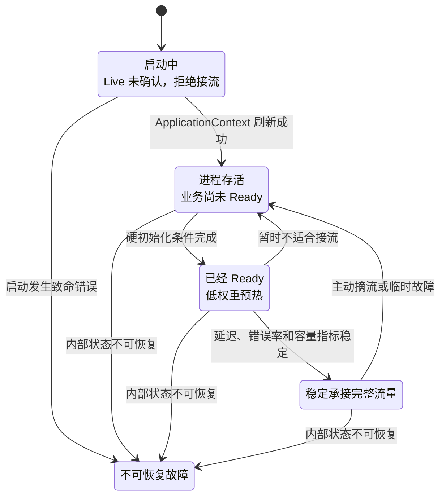
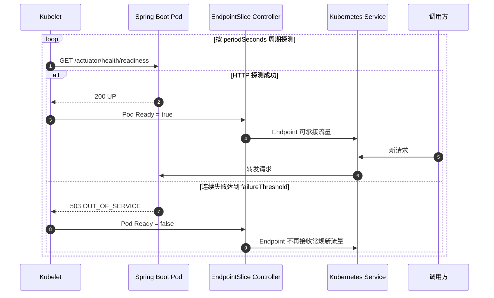

1. Table of Contents, ordered
{:toc}

某类宿主型服务会在启动时动态装载业务扩展模块、解析执行关系并完成必要预热。初始化过程可能短时占用大量 CPU；如果端口一开放，流量平台就立即把请求切给新实例，启动期抖动便会直接变成超时和长尾延迟。

一种直观的解决办法是：**在应用内部持续采样 CPU，等 CPU 连续多次低于阈值后才启动 Web Server；等待超时则记录告警并继续启动。**这个方案确实可能减少实例在资源高峰时接流，但它也把“进程启动”“业务就绪”和“容量预热”揉成了同一个判断。

本文对场景做了完全脱敏：服务名称、内部平台、业务模型、具体阈值和观测数据均被移除或泛化。讨论只保留可复用的工程问题：Spring Boot 什么时候认为实例 Ready 或 Live，Kubernetes 如何消费这些状态，以及 CPU 应该处于哪一层。

## 端口打开，只能证明进程能够建立连接

服务刚开放端口时，调用方最关心的并不是 TCP 是否能连接，而是这次请求能否被正确、稳定地处理。两者之间至少隔着四种不同语义。

| 状态 | 回答的问题 | 失败后平台应该做什么 |
|---|---|---|
| Startup | 应用是否已经完成基本启动？ | 继续等待；超过上限后才考虑重启 |
| Readiness | 这个实例现在能否正确处理请求？ | 暂时从服务后端摘除，不发送新流量 |
| Warm-up / Capacity | 实例能否立即承接完整份额的流量？ | 逐步增加权重，而不是一步接满 |
| Liveness | 实例是否已经无法自行恢复？ | 重启容器或进程 |

### Readiness 和容量预热不是一回事

假设一个实例已经完成模块装载、配置校验和必要连接初始化，它通常已经具备**正确处理请求**的能力，因此可以被判定为 Ready。但 JIT 编译、缓存命中率、连接池和线程池仍可能处于爬升阶段，此时它未必适合立刻承担与老实例相同的流量份额。

这就形成了两个连续但不同的门槛：

1. **硬门槛由 readiness 表达**：越过之前不接业务流量。
2. **软门槛由 slow start 表达**：越过之后从低权重逐步增加到完整流量。



区分这四种状态后，才能准确理解 Spring Boot 提供了什么，以及 Kubernetes 会怎样响应。

## Spring Boot 默认什么时候 Ready，什么时候 Live

Spring Boot 通过 `ApplicationAvailability` 表达应用的 liveness 和 readiness；引入 Actuator 后，这两个状态可以分别暴露为：

```text
/actuator/health/liveness
/actuator/health/readiness
```

它们属于 **health endpoint**，不是 `/actuator/metrics`。Metrics 用于观测数值，Kubernetes 原生 readiness probe 不会读取一组指标后替应用计算阈值，而是根据探测端点的成功或失败决定 Pod 是否 Ready。

### 默认 readiness 要等所有 Runner 执行结束

Spring Boot 启动时，readiness 初始为 `ReadinessState.REFUSING_TRAFFIC`。随后大致经历下面的顺序：

```text
ApplicationContext 刷新完成
→ Web Server 初始化
→ 发布 ApplicationStartedEvent
→ 执行 ApplicationRunner / CommandLineRunner
→ 发布 ApplicationReadyEvent
→ 发布 ReadinessState.ACCEPTING_TRAFFIC
```

因此，**默认 readiness 会在所有 `ApplicationRunner` 和 `CommandLineRunner` 执行结束后变成 Ready**。此时 `/actuator/health/readiness` 返回 `UP`；启动任务尚未完成时则表现为拒绝流量。完整事件顺序可参考 [Spring Boot Application Availability](https://docs.spring.io/spring-boot/reference/features/spring-application.html#features.spring-application.application-availability)。

这个默认状态只代表 Spring Boot 自己的生命周期已经完成，并不会自动理解某个动态模块、业务规则或共享依赖是否满足接流条件。额外的业务就绪条件必须由应用显式接入。

### 默认 liveness 更早变成正常

当 `ApplicationContext` 成功刷新、`ApplicationStartedEvent` 发出后，Spring Boot 会把 liveness 切换为 `LivenessState.CORRECT`。此时 Runner 可能还在执行，所以应用可以同时处于：

```text
liveness = CORRECT
readiness = REFUSING_TRAFFIC
```

这正是合理状态：进程本身没有坏，不需要重启，只是业务初始化尚未结束，不应该接流。

Spring Boot 默认不会因为 CPU 高、数据库不可用或某次请求超时而自动把 liveness 改成 `BROKEN`。Liveness 只适合“重启实例很可能解决”的内部不可恢复故障，例如核心事件循环永久停止、关键本地状态损坏或明确检测到无法自愈的死锁。把共享数据库、缓存等外部依赖放进 liveness，可能导致所有副本在同一依赖故障时一起重启，放大为级联故障。

到这里，liveness 和 readiness 仍只是应用暴露的状态。要把它们变成“切流”与“重启”动作，还需要 Kubernetes 的探针和服务端点机制消费这些状态。

## Kubernetes 如何把 readiness 变成真实的切流动作

Spring Boot 只负责提供状态，真正决定 Pod 是否进入 Service 后端的是 Kubernetes。



按照 [Kubernetes Probes](https://kubernetes.io/docs/concepts/workloads/pods/probes/) 的定义，readiness probe 失败会让 Pod 从匹配 Service 的可用 EndpointSlice 中移除；它不会重启容器。Liveness probe 连续失败才会触发重启。状态传播需要时间，已经建立的长连接也不会因为一次 readiness 失败就自动、立即断开。

一个基础配置如下：

```yaml
readinessProbe:
  httpGet:
    path: /actuator/health/readiness
    port: 8080
  periodSeconds: 5
  failureThreshold: 3

livenessProbe:
  httpGet:
    path: /actuator/health/liveness
    port: 8080
  periodSeconds: 10
  failureThreshold: 3
```

如果应用启动时间很长，可以增加 `startupProbe`，在它成功之前暂缓执行 liveness 和 readiness，避免“仍在正常启动”被误判为“已经坏死”。具体参数语义见 [Kubernetes 探针配置文档](https://kubernetes.io/docs/tasks/configure-pod-container/configure-liveness-readiness-startup-probes/)。

健康探针最好经过主业务端口。如果 Actuator 单独运行在管理端口，即使主端口的线程池或连接能力已经失效，管理端口仍可能返回健康。Spring Boot 可以通过下面的配置，把探针额外暴露到主端口的 `/livez` 和 `/readyz`：

```yaml
management:
  endpoint:
    health:
      probes:
        enabled: true
        add-additional-paths: true
```

这个细节说明了一件事：探针的价值不在于“有一个总能返回 200 的旁路端口”，而在于尽量真实地代表业务实例能否承接请求。

Kubernetes 只能消费应用给出的结果，并不知道动态模块是否真的准备完成。要让 readiness 代表业务语义，应用还需要把自己的初始化状态接入健康端点。

## 应用如何干预 readiness

Spring Boot 的默认生命周期适合大多数同步初始化，但动态模块加载和热更新常常还需要应用主动表达状态。选择哪种方式，取决于初始化任务是否属于启动主流程。

### 同步硬初始化放进 ApplicationRunner

如果扩展模块、执行关系和必要配置必须全部准备完成才能接流，可以把初始化放进 `ApplicationRunner`：

```java
@Component
final class ExtensionRuntimeInitializer implements ApplicationRunner {

    @Override
    public void run(ApplicationArguments args) {
        loadExtensionModules();
        validateExecutionGraph();
        registerOperators();
        warmUpRequiredResources();
    }
}
```

Runner 返回之前，Spring Boot 默认不会发布 `ACCEPTING_TRAFFIC`；Runner 返回之后，框架自动完成状态切换。这样可以让 Web Server 和健康检查端点先启动，同时依靠 Kubernetes readiness 阻止 Service 业务流量，不再需要通过“不开放端口”间接表达未就绪。

### 异步状态使用自定义 HealthIndicator

如果模块加载耗时很长、需要异步执行，或者运行期还会重新加载，单纯依赖启动事件不够稳定。可以把业务状态实现成独立的 `HealthIndicator`：

```java
@Component("extensionRuntime")
final class ExtensionRuntimeReadiness implements HealthIndicator {

    private final AtomicBoolean ready = new AtomicBoolean(false);

    @Override
    public Health health() {
        return ready.get()
            ? Health.up().build()
            : Health.outOfService().build();
    }

    void markReady() {
        ready.set(true);
    }

    void markNotReady() {
        ready.set(false);
    }
}
```

再把它加入 readiness group：

```yaml
management:
  endpoint:
    health:
      group:
        readiness:
          include: readinessState,extensionRuntime
```

Spring Boot 默认不会把所有健康检查都加入 readiness，因为外部依赖是否应该影响接流需要应用自己判断。Health group 的组合方式可参考 [Spring Boot Kubernetes Probes](https://docs.spring.io/spring-boot/reference/actuator/endpoints.html#actuator.endpoints.kubernetes-probes)。

### 运行期主动摘流可以发布 AvailabilityChangeEvent

运行中的实例需要临时摘流时，可以发布状态事件：

```java
AvailabilityChangeEvent.publish(
    applicationContext,
    this,
    ReadinessState.REFUSING_TRAFFIC
);
```

恢复后再发布：

```java
AvailabilityChangeEvent.publish(
    applicationContext,
    this,
    ReadinessState.ACCEPTING_TRAFFIC
);
```

启动早期发布的 `REFUSING_TRAFFIC` 可能被 Spring Boot 在启动完成时自动发布的 `ACCEPTING_TRAFFIC` 覆盖。因此，同步启动任务优先使用 Runner，长期异步状态优先使用自定义 HealthIndicator，事件更适合启动完成后的主动摘流和恢复。

无论选择哪种方式，事件和 HealthIndicator 都只会改变应用暴露的状态。只有 Kubernetes、服务发现或负载均衡器真正消费这个状态，切流才会发生。

一旦业务状态可以被直接表达，就不再需要通过“CPU 降下来以后才开放端口”间接暗示实例已经就绪。CPU 仍然有价值，但它应该回答另一个问题。

## CPU 探测为什么不适合直接充当 readiness

回到开头的实现：动态初始化结束后，应用继续轮询 CPU；连续多次低于阈值才开放端口，等待超时则继续启动。这个方案的问题并不在于“等待资源恢复”本身，而在于它用一个资源指标代替了业务状态。

### CPU 是症状，不是就绪语义

CPU 较低时，模块、缓存或关键连接仍可能没有准备完成；CPU 较高时，实例也可能完全能够正确处理请求。阈值、采样间隔和连续通过次数还会受到容器配额、JDK 指标口径、节点负载和业务模型影响，很难成为跨服务稳定复用的判断。

如果超时后无论 CPU 多高都继续启动，则进一步说明它不是必须满足的就绪约束，而是一个**有时间上限的风险延迟策略**。这类启发式策略可以有价值，但不应该被命名或理解成完整的 readiness。

### 阻塞 Web Server 会隐藏状态，而不是表达状态

Web Server 不启动时，HTTP readiness endpoint 同样不可访问。平台只能从“端口没开”猜测实例还在初始化，无法区分下面几种情况：

- 应用仍在正常加载；
- CPU 尚未回落；
- 初始化已经失败；
- 进程发生死锁；
- 健康检查端口配置错误。

阻塞时间还会与部署平台的启动超时、liveness 和滚动发布策略耦合。相比之下，先启动健康端点并明确返回 NotReady，平台能够看到实例活着、但暂时拒绝接流。

### 等待结束后仍缺少流量爬坡

即使 CPU 在某个采样窗口回落，端口开放后实例仍可能瞬间获得与老实例相同的流量，CPU 和尾延迟随即再次冲高。单纯“晚一点开闸”没有控制开闸后的流速。

Envoy 的 [slow start](https://www.envoyproxy.io/docs/envoy/latest/intro/arch_overview/upstream/load_balancing/slow_start) 和 AWS ALB 的 [slow start mode](https://docs.aws.amazon.com/elasticloadbalancing/latest/application/edit-target-group-attributes.html) 都采用相似思路：端点健康以后，不立即给予完整权重，而是在一个窗口内逐步增加流量。具体平台可以使用服务发现权重、网格能力、负载均衡器或发布系统实现同样的控制。

### 多实例发布会把局部等待变成集群容量问题

滚动发布时，如果一批新实例都因 CPU 阈值而等待，旧实例就要更久地承担现有流量。旧实例负载升高又可能影响发布节奏，最终形成“新容量迟迟不能上线、旧容量越来越忙”的反馈环。

因此，CPU 探测不能只评估单实例启动曲线，还必须评估整个发布批次的最小可用容量、最大不可用实例数和流量迁移速度。

### 什么时候这种方案仍然可以接受

如果旧平台只支持 TCP 探活，并且语义固定为“端口开放即注册、注册后立即接流”，应用无法表达 HTTP readiness、注册禁用状态或实例权重，那么延迟开放端口可以作为低成本兼容方案。

但它应该被明确定位为过渡措施，并满足几个条件：

- 等待必须有上限，避免无限阻塞发布；
- 阈值和超时可配置，并有失败、超时和放行原因监控；
- 评估整批发布的容量影响，而不只看单实例；
- 明确超时后的降级策略和风险；
- 保留迁移到应用级 readiness 与流量慢启动的路径。

这个边界能同时解释它为什么在特定约束下合理，也能解释为什么它不应成为长期的通用架构。

## 更清晰的落地方案：硬状态控制接流，软指标控制流量

经过前面的拆分，一个动态加载型服务可以按下面的顺序改造：

1. Web Server 和健康端点正常启动，readiness 保持 `REFUSING_TRAFFIC`。
2. 应用完成扩展模块加载、执行关系校验、关键配置和必要资源初始化。
3. 所有硬条件通过后，readiness 变为 `ACCEPTING_TRAFFIC`，Pod 进入 Service 后端。
4. 新实例先获得较低权重，再根据错误率、P99 延迟、CPU 和队列长度逐步爬升。
5. 运行期暂时无法正确服务时切换为 NotReady；可恢复的高负载优先限流、负载丢弃、扩容或熔断。
6. 只有确认实例内部已不可恢复、重启很可能解决时，才把 liveness 标记为 `BROKEN`。

其中，业务扩展是否装载完成属于**硬状态**；CPU、延迟和错误率属于**软信号**。硬状态适合决定“能不能接流”，软信号适合决定“接多少流量”。

最终可以用三句话检查设计有没有混层：

> **端口能连接，不等于业务已经 Ready。**
>
> **业务已经 Ready，不等于适合立刻承接完整流量。**
>
> **实例暂时不适合接流，不等于进程已经坏到必须重启。**

Readiness、slow start 和 liveness 分别承接这三层语义后，CPU 才能回到合适的位置：它是容量治理的重要观测信号，但不需要再冒充服务就绪状态。
