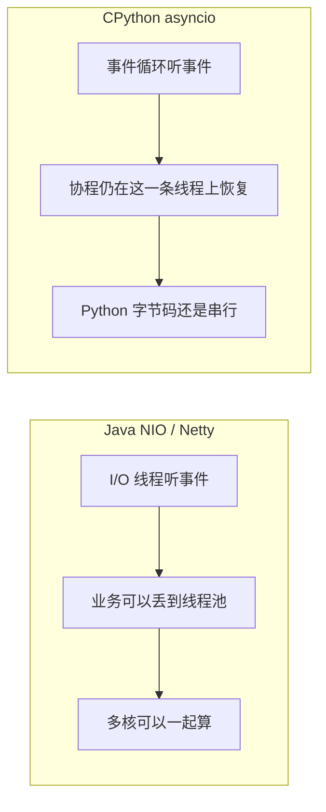
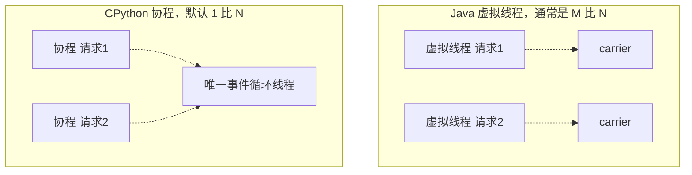
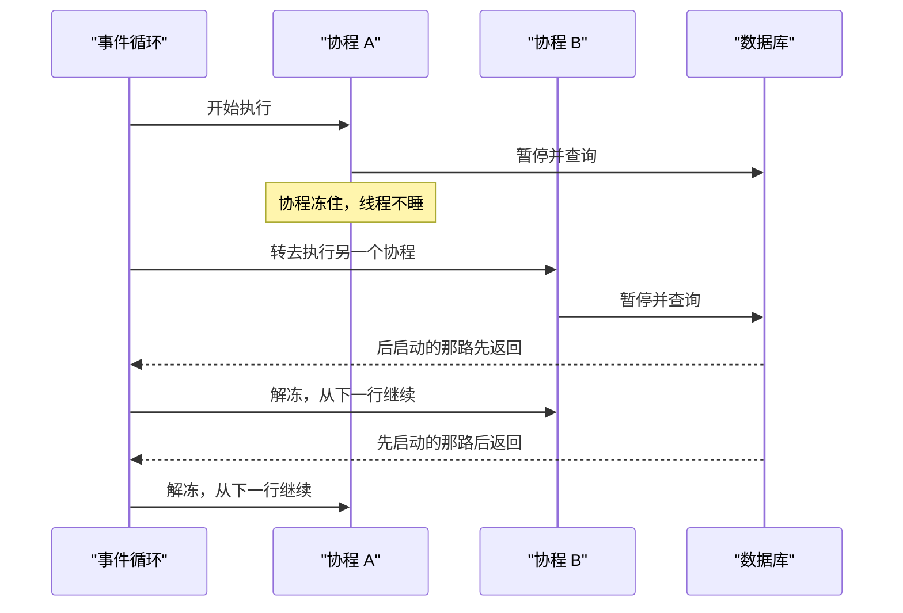
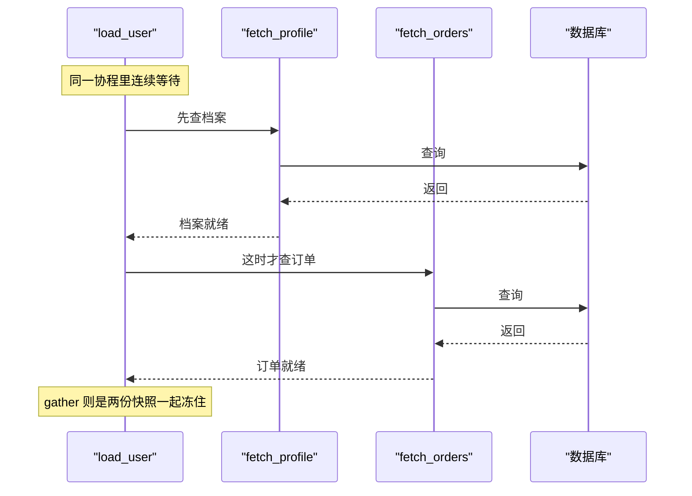
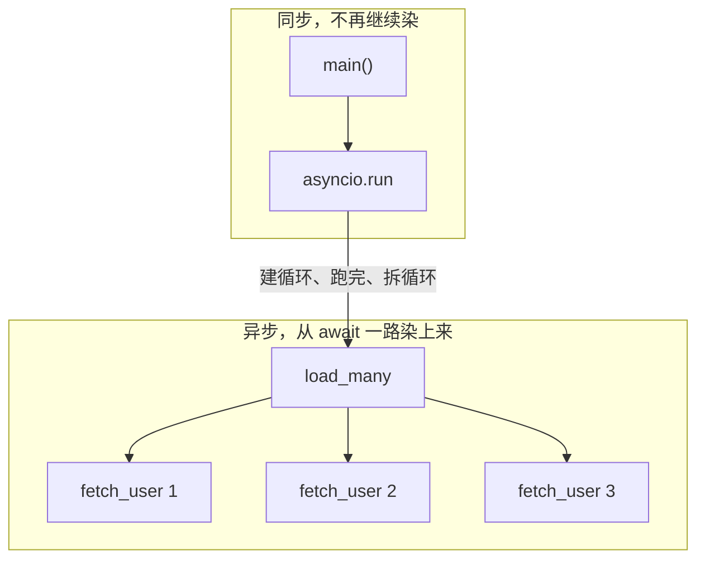

1. Table of Contents, ordered
{:toc}

从 Java 转到 Python，开线程时脑子里通常有一幅现成的图：机器有 8 个核，我就开 8 条线程，它们应当一起算。这幅图在 Java 里大体成立。在 Python 里，CPU 几乎涨不上去，8 条线程像在排队。

接着读业务代码，又会碰到另一套不像线程的东西：`async def`、`await`、有时还有 `yield`。它们也在“同时做很多事”，却对不上 `Thread`、线程池或 `CompletableFuture`。

不是语法突然变难了。是“开了线程就能并行”这个前提，在你正在用的那个解释器里不成立。把这个缺口补上，后面的 `await` 才有来历。

## 你跑的通常不是“Python”，是 CPython

日常说的 Python，其实叠了两层。一层是语言：语法、标准库、`async def` 是什么意思。一层是实现：真正去读源码、执行指令、管理内存的那个程序。

用 C 写的官方实现叫 CPython。[python.org](https://www.python.org/) 的安装包、系统里的 `python3`，通常就是它。这和 Java 语言不等于 HotSpot 是同一层区别——还可以有 OpenJ9、GraalVM；Python 也有 PyPy、Jython、GraalPy。它们都能跑 Python 语法，线程策略不必相同。

工作里碰到的几乎总是 CPython。所以后文说“不能并行”，主语是这个解释器，不是这门语言的全部实现。`async def fetch()` 写的是语言；跑起来会不会被一把全局锁卡住，是 CPython 说了算。

## GIL 拿走了并行，留下了并发

CPython 里有一把 [全局解释器锁](https://docs.python.org/3/c-api/init.html#thread-state-and-the-global-interpreter-lock)（GIL）。规则很简单：**同一时刻，只允许一个线程执行 Python 字节码。**

字节码可以先按 Java 的 class 文件来想。`.py` 先被编译成解释器认识的中间指令，再由 CPython 一条条执行。GIL 锁住的，就是“解释器正在执行这些指令”。两个线程可以同时存在，通行证同一瞬间只发给一个。

于是两条线程跑纯 Python 计算时，并不是两个核各算各的：

```text
时间 →
线程 A: [跑 Python] [等 GIL] [跑 Python] [等 GIL]
线程 B: [等 GIL] [跑 Python] [等 GIL] [跑 Python]
CPU:    同一时刻只有一份字节码在执行
```

A 在跑，B 必须等；B 抢到锁，A 又必须等。墙钟在走，两条线程都“活着”，真正执行 Python 的始终只有一份。Java 里同样两段计算可以占两个核。CPython 做不到。语言提供了线程，实现却不让它们并行执行 Python 代码。就“能不能把 8 个核用满”而言，这是缺陷。

它来自实现选择，不是语法规定。CPython 用引用计数管内存，对象进出都要改计数器。没有这把大锁，计数器、对象头和大量当初按单线程写的 C 扩展，都得改成细粒度线程安全。早期用 GIL 换来了实现简单、扩展好写，这把锁就留到了今天。有来由，仍然是缺陷：今天它照样让你无法用多线程吃满多核。

锁的范围也要放到它真正覆盖的那一层。它锁的是 Python 字节码，不是整个进程。线程去等网络、等磁盘、`sleep`，或进入会释放 GIL 的 C 代码时，锁会放开，别的线程就能继续执行 Python。NumPy 这类把重活放在 C 里做完再回来的库，以及 Python 3.13 起实验性的 [无 GIL 构建](https://peps.python.org/pep-0703/)，也可以绕开它。后者还不是现在的默认形态。

这里有两个常被混在一起的词，后面整篇文章都靠它们。

**并行**是同一时刻真有多段代码在不同核上执行。要把 8 个核拉满，靠的是并行。  
**并发**是一段时间里有很多任务同时在推进：你在等的时候，我可以去干别的。它不要求两个核一起算，只要求等待能够重叠。

GIL 拿走的是并行。并发还在，因为等 I/O 时锁会放开。CPython 能开多线程，写法和 Java 一样；它是弱的那一版——等 I/O 时可以像 Java 一样并发，但不能像 Java 一样大家一起干活、把核拉满。只有别人正在等、并不占用解释器的时候，你才能插进去。那是并发，不是并行。

若要并行，就不能再指望一个进程里的多条线程，得开多个进程。[`multiprocessing`](https://docs.python.org/3/library/multiprocessing.html) 为每个进程拉起完整的 CPython，各自一把 GIL，相当于一台机器上跑多个 JVM。计算可以铺到多核，堆不再共享，对象引用也就不能直接递过去。常见做法是用管道、队列或 Socket 当通道，把对象变成字节送过去。Python 里这一步通常由 pickle 完成：通道负责运送，pickle 负责把对象编码成可运送的字节。序列化不是和管道并列的第三种 IPC。数组也可以放进共享内存，两边直接看同一块数据。

并行的出口就是这一条。下面要问的是另一件事：并发怎么做？

## 两条路都只做并发

结论先说清楚：`threading` 和 `asyncio` 都没有突破 GIL。它们做的是同一件事——并发，不是并行。差别只是重叠等待的方式。

### threading：写法和 Java 一样，能力只有并发

[`threading`](https://docs.python.org/3/library/threading.html) 怎么写都眼熟：创建线程、加锁、`join`。Java 的线程既能并发也能并行：等 I/O 时别人可以继续；几段纯计算也可以同时铺到多个核上。

CPython 的线程只留下前一半。等 HTTP、等数据库、`sleep` 时，当前线程把 GIL 交出去，别的线程就能跑。你等着的时候我干活，这和 Java 一样。做不到的是并行。工作若变成纯 Python 的 CPU 计算，空档消失，谁都在抢同一把锁，多线程没有意义，有时比单线程更慢。

```text
线程 A: [发请求]========等响应========[处理 JSON]
线程 B: [发请求]========等响应========[处理 JSON]
                 ↑ 等待不占 GIL，两路在内核里同时进行
                   这是并发
```

### asyncio：既然只能并发，就不必一请求一线程

线程已经能把等待叠起来，却仍要为每个请求占一条 OS 线程。栈、切换、锁都贵。I/O 密集时大部分时间并没有人在算，只是在等内核和网卡。既然 CPython 反正不能靠多线程并行，为每个等待再雇一条线程就更不划算。

Java 后来用 NIO 和 Netty 回答这件事：很少的 I/O 线程去听事件，内核说“这条连接可读了”，再处理。[`asyncio`](https://docs.python.org/3/library/asyncio.html) 走同一条路。默认一条线程、一个事件循环，用 epoll 或 kqueue 问哪些描述符就绪，再把对应的 Python 代码从上次停下的地方叫醒。请求在等的时候，只是循环里一份“以后再叫醒我”的记录。

和 Netty 相同的是前半段：听事件可以是单线程的。  
和 Netty 不同的是后半段。Netty 拿到“可读了”之后，可以把业务丢进 worker 线程池，后面真能并行。CPython 默认不这么切。协程从 `await` 里恢复以后，还在这一条事件循环上执行 Python。表面上可以有一千个请求在飞，解释器里同一时刻仍然只有一份字节码。Java 的事件循环之后还能并行；Python 里仍然只能并发。



因此在 `async def` 里调用同步的 `time.sleep` 或同步 HTTP，会卡住整条循环，所有请求一起停。Java 线程池里一条线程阻塞只影响该任务；这里阻塞的是唯一负责叫醒所有人的那条线程。

说来说去，CPython 限制了它只能并发、不能并行。线程和事件循环都是在做并发。

## 虚拟线程像协程的调度，不像它的写法

Java 从平台线程走到 NIO，再走到虚拟线程；CPython 从 `threading` 走到 `asyncio`，再把可暂停的函数当任务来调度。三层都能对上。每一层 CPython 都少掉并行。

| Java | CPython | 像在哪 | 不像在哪 |
|---|---|---|---|
| 平台线程 / 线程池 | `threading` | 等 I/O 时都能重叠等待 | Java 既能并发也能并行，CPython 只有并发 |
| NIO / Netty | `asyncio` | 一条循环听事件 | Java 之后可以把活分到 worker，CPython 恢复后还在同一条循环上 |
| 虚拟线程 | 协程 | 很多逻辑任务复用很少的真线程 | Java 可以写同步阻塞，Python 必须 `await` |

[虚拟线程](https://openjdk.org/jeps/444) 让你继续按线程来写，却不必为每个请求准备一条昂贵的 OS 线程。运行时准备少量平台线程，叫 carrier。代码看起来仍在一条线程里往下跑；碰到会阻塞的 I/O，虚拟线程从 carrier 上卸下来，carrier 去跑别人；I/O 完成后再挂回去。

`asyncio` 调度协程时做同一类事：任务要等了，就把现场收起来，把那条线程借给别人。假设这台机器只有 1 个核，因而 Java 也只剩 1 条 carrier，两边几乎同构：一条真线程，上面挂着许多个进行中的任务。一个虚拟线程，对应一个协程。



写法不一样。虚拟线程里可以继续写同步调用，运行时在 I/O 处自动卸下：

```java
User user = repo.findById(id);
return user.getName();
```

Python 必须调用会让出线程的异步 API，并在调用处写 `await`。漏写，或调用了同步库，运行时不会帮你卸，循环就会停住。虚拟线程把多路复用包装成线程；协程要求你在暂停点把等待写进语法。

可是“协程”这个词，并不是从假线程开始的。它先是一种函数怎么暂停、怎么恢复的控制流。要把 `await` 看懂，需要先回到这个更小的概念上。

## 协程是能暂停的函数，await 是一次交给事件循环的暂停

Java 很少这样看待一个函数：它跑到一半可以停住，局部变量都还在，过一会儿从下一行接着跑，而不是从头再调用一次。这就是协程。它首先是控制流，不是调度器变出来的一条 OS 线程。

普通函数进入一次、返回一次，`return` 之后栈帧就没了。协程进入一次，可以暂停许多次，也可以恢复许多次：

```text
调用 → 跑一段 → 暂停（记住执行到哪、局部变量是什么）
     → 别人跑
     → 再进来 → 从刚才那一行继续
```

留下来的是一份快照。asyncio 把许多份快照当任务来切，所以外面看起来像一条线程上的很多虚拟线程；里面并没有多出来的 OS 线程。虚构的是“每个请求都有一个执行者”；真实存在的是这些快照，以及 I/O 完成时把某一份解冻的事件循环。

### yield 不是 Thread.yield()

更早的暂停写成 `yield`。Java 里的 `Thread.yield()` 只是向调度器说可以让出 CPU，不会把函数冻在某一行，也不会向外交出一个值。Python 这个字和它只是碰巧同名。

`yield` 让函数交出一个值并且自己还活着。下次再要，从下一行继续，局部变量还在：

```python
def countdown(n):
    while n > 0:
        yield n
        n -= 1

g = countdown(3)   # 还没开始循环，只拿到生成器
next(g)            # 得到 3，停在 yield 处
next(g)            # 从下一行继续，交出 2
```

`countdown(3)` 并不开始倒数，它只造出一份还没启动的快照。Java 没有对等关键字，最接近的是手写 Iterator，把进度存在字段里。Kotlin 的 `sequence { yield(x) }` 才是同类。`for x in countdown(3)` 就是反复向这份快照要下一个值。

`yield` 把暂停交给调用方，交出去的是元素；`await` 把同一种暂停交给事件循环，交出去的是一次还没完成的 I/O。下面把这套语法摊开：先是 `async def` 造出什么，再是 `await` 如何兑现，然后是同一协程里连续等待为什么仍是串行，最后是异步会沿着调用链向上染到哪里、在哪里停住。

### async def：调用它，拿到的还不是结果

普通函数一调用就开始跑，返回值就是结果：

```python
user = fetch_user_sync("42")
print(user["name"])
```

把同样的事写成协程，函数前面要加 `async`：

```python
async def fetch_user(user_id: str) -> dict:
    row = await db.fetch_one(user_id)
    return row
```

`async def` 声明的是：这是一个可以暂停的函数。调用它时，函数体并不会马上执行到 `return`。你拿到的也不是 `dict`，而是一个**协程对象**——一份还没往前走的快照，一张欠条：

```python
task = fetch_user("42")   # 还不是用户信息
```

Java 里最接近的是：

```java
CompletableFuture<User> future = fetchUser("42");
```

此时查询可能还没开始。手里拿着的是“以后会给你结果”的凭证。要把凭证兑现成真正的 `User`，Java 写 `future.get()`；Python 写 `await`。

### await：函数停住，线程去干别的，结果回来再从下一行继续

```python
user = await fetch_user("42")
print(user["name"])
```

执行到 `await fetch_user("42")` 时，发生的事情可以按四步看：

1. 当前这段函数把自己冻住：局部变量还在，下一行是 `print`。
2. 事件循环去真正驱动 `fetch_user`，直到它碰到数据库 I/O。
3. 数据库还没回来，这条 OS 线程并不陪着睡。循环去跑别的已经就绪的协程。
4. 结果到达后，冻住的函数被解冻，`user` 已经是 `dict`，`print` 像普通代码一样执行。

`await` 之后，左边拿到的就是普通返回值，后面不必再当 Future 使。异常也不会包一层 `ExecutionException`，用普通 `try / except` 即可。

和 `Future.get()` 像的是姿势：都是把欠条兑现。不像的是卡住的对象。`get()` 把当前 OS 线程卡住，这条线程在回来之前什么也干不了。`await` 卡住的是**当前这段协程**，线程可以立刻去跑**别的**协程。这正是前面说的并发：你等着的时候，别人干活。

这里有一个很容易拧反的地方。让出线程，并不等于当前函数的下一行提前执行。冻住的是这一份快照；这份快照的下一行，必须等这次等待兑现之后才轮到。别的协程可以插进来跑，**同一段函数里写在这个等待后面的代码不行。**

没有 `await`，没有人去驱动那份快照，结果也就一直不会出现。所以 `async def` 本身不产生并发，真正让出线程的是后面那一次 `await`。



### 只能 await 会让出线程的那个 API

一个常见的口诀是“看见会花时间的地方就写 await”。这句会把人带偏。

`await` 不是魔法前缀，它只能接在**会把控制权交还事件循环的对象**后面。异步数据库驱动、`asyncio.sleep`、异步 HTTP 客户端，这些在等待时会让出线程。同步的 `time.sleep`、同步的 `requests.get()`，不会。你即使把外层函数写成 `async def`，里面调用同步阻塞，事件循环那条线程照样被占住，所有别的协程一起停。

```python
async def bad() -> None:
    time.sleep(3)          # 整条循环睡 3 秒
    requests.get(url)      # 同步 HTTP，同样堵住循环

async def good() -> None:
    await asyncio.sleep(3)           # 让出线程
    await http_client.get(url)       # 让出线程
```

可以记成：不是“阻塞了就写 await”，而是“用会让出的那个 API，并在调用处 await”。虚拟线程里你可以放心调同步 JDBC，运行时帮你卸下 carrier；协程没有这一层，写错 API 就是把全站那条循环卡死。

### 同一个协程里连续 await，两路查询仍然是串行的

正因为冻住的是**当前这一份**快照，下面这种写法不会让两路 I/O 重叠：

```python
async def load_user(user_id: str) -> tuple[dict, list]:
    profile = await fetch_profile(user_id)
    orders = await fetch_orders(user_id)
    return profile, orders
```

`load_user` 是一个协程。它执行到第一行 `await`，自己停住，线程可以去跑**别的**请求、别的协程。但 `load_user` 自己的下一行——`fetch_orders`——还没有开始。档案没回来之前，订单查询根本不会发出去。两边都在等网络，墙钟时间却是相加。

可以想成：让出线程，让出的是“这条 OS 线程现在可以伺候别人”；不是“我自己的下一行也可以先跑”。同一条函数体里，`await` 仍然是顺序点，和普通代码一样，上一行没结束，下一行不执行。

要把两路等待叠起来，它们必须成为**两份可以同时冻住的快照**，也就是两个协程，而不是同一个协程里前后两行。这正是 [`asyncio.gather`](https://docs.python.org/3/library/asyncio.html#asyncio.gather) 做的事：父协程一下子交出两个子协程，自己再 `await` 这一整批。两个子协程各自去 `await` 自己的 I/O，于是两路查询可以同时在飞。

```python
async def load_user(user_id: str) -> tuple[dict, list]:
    profile, orders = await asyncio.gather(
        fetch_profile(user_id),
        fetch_orders(user_id),
    )
    return profile, orders
```

`gather` 把这几张欠条同时丢进事件循环，都结束之后按传入顺序把结果拆回来。总时间接近较慢的那一路。某一路正常返回空列表，只是一个普通结果；有一路抛出没被自己接住的异常，整个 `gather` 默认会失败。

它看起来很像往线程池里丢两个任务再 `invokeAll`，或像 `CompletableFuture.allOf(f1, f2).join()`。像的是**“一批活，一起等齐”**这个意图。不像的是执行器。

线程池会真的拿出多条 OS 线程，Java 里那两段任务甚至可能并行跑在两个核上。`gather` 仍然在**同一条事件循环**上推进多个协程：谁碰到 `await` 谁让出，线程在几份快照之间切换。这是并发，不是把线程池搬进了 asyncio。CPython 还是只能并发，`gather` 不会把它变成并行。

另一条等价的路是 `asyncio.create_task(...)`：先把两个协程变成已经调度的任务，再分别 `await`。意思同样是“先让两份快照都开始跑，再等它们”。只写两个连续 `await`、中间没有把第二份快照先挂上去，第二路就不会提前出发。



### 异步函数的染色机制

`await` 只能写在 `async def` 里。于是只要你调用了一个异步函数，自己往往也得变成异步函数，才能把 `await` 写出来：

```python
async def fetch_user(user_id: str) -> dict:
    return await db.fetch_one(user_id)

async def handle_request(user_id: str) -> str:
    user = await fetch_user(user_id)
    return user["name"]
```

`handle_request` 如果写成普通 `def`，里面就不能 `await fetch_user(...)`。再往上的调用方，只要还想直接 `await handle_request`，就还得是 `async def`。异步会沿着这条调用链向上走。Bob Nystrom 把这种现象叫做 [函数染色](https://journal.stuffwithstuff.com/2015/02/01/what-color-is-your-function/)：语言把函数分成两种颜色，一种能等待，一种不能，彼此不能无痛混用。Java 普通方法里随时可以 `.get()`；Python 的普通 `def` 里写不了 `await`。

它不会无限染下去。需要 `async` 的，只是那些自己要写 `await` 的函数。真正的进程入口仍然可以是同步的 `main`：它不 `await`，它调用 [`asyncio.run()`](https://docs.python.org/3/library/asyncio-runner.html#asyncio.run)，让事件循环去跑那个已经染成异步的入口。传染在这一层停住。

入口协程里通常不会只跑一条等待。三个彼此独立的查询，应当是三份同时冻住的快照，墙钟时间接近最慢的那一路，而不是三段相加：

```python
import asyncio

async def fetch_user(user_id: str) -> dict:
    await asyncio.sleep(0.2)  # 假装一次网络往返
    return {"id": user_id, "name": f"user-{user_id}"}

async def load_many() -> list[dict]:
    return await asyncio.gather(
        fetch_user("1"),
        fetch_user("2"),
        fetch_user("3"),
    )

def main() -> None:
    users = asyncio.run(load_many())
    for user in users:
        print(user["name"])

if __name__ == "__main__":
    main()
```

`gather` 一下子挂上三个 `fetch_user` 协程。每个都在 `asyncio.sleep` 处让出线程，事件循环在三份快照之间切换，三次等待叠在一起。`load_many` 必须是 `async def`，因为它要 `await gather`；三个 `fetch_user` 也是异步的。`main` 里不能写 `await`，也不必写成 `async def`。`asyncio.run(...)` 进去之前没有事件循环，出来之后循环已经拆掉，`users` 已经是普通列表。染色的边界就是这里：从最底层那些 `await` 往上，一直到被 `run()` 接住的 `load_many`；`run()` 本身和它外面的 `main`，还是同步代码。



HTTP 服务通常连 `asyncio.run()` 都不用自己写。先看异步路由。

### 框架如何调用：异步路由

以 FastAPI 为例，路由就是那个被染成异步的入口；底下的三个 `fetch_user` 仍然可以 `gather` 在一起：

```python
import asyncio

from fastapi import FastAPI
import uvicorn

app = FastAPI()

@app.get("/users")
async def list_users():
    return await asyncio.gather(
        fetch_user("1"),
        fetch_user("2"),
        fetch_user("3"),
    )

if __name__ == "__main__":
    uvicorn.run(app, host="0.0.0.0", port=8000)
```

`list_users` 里有 `await`，必须是 `async def`。`uvicorn.run(...)` 和前面的 `main` 一样是同步的。框架接管，不是把你的函数改成同步，而是**它自己先把事件循环跑起来，再按路径找到你写的函数并调用它**。压成几行伪代码，大致是：

```python
routes: list[tuple[str, str, object]] = []  # (method, path, handler)

def get(path: str):
    def decorator(fn):
        routes.append(("GET", path, fn))  # @app.get("/users") 把函数登记进来
        return fn
    return decorator

def lookup(request):
    for method, path, handler in routes:
        if request.method == method and path_matches(path, request.path):
            return handler
    raise NotFound()  # 没有匹配的路由，404

def run(app) -> None:
    loop = asyncio.new_event_loop()
    sock = listen(host, port)
    loop.run_until_complete(serve(app, sock))  # 循环一直活着，不像 asyncio.run 用完就拆

async def serve(app, sock) -> None:
    while True:
        request = await sock.accept()
        asyncio.create_task(handle(app, request))  # 每个请求一份协程

async def handle(app, request) -> None:
    handler = lookup(request)          # GET /users → list_users
    response = await handler()         # 调到你写的异步路由
    await request.send(response)
```

`@app.get("/users")` 发生在启动时：装饰器把 `list_users` 放进路由表。请求来了之后，`lookup` 按方法和路径从表里找出那个函数，再 `await` 它。真正的 FastAPI 还会在这一步做依赖注入和参数校验，这里只留下“找到函数、调用函数”。

Python 的 HTTP 服务一样要承接成百上千个用户。打 `/users` 时，每个请求一份 `handle` 协程。查询在等网络，协程冻住，那一条线程去伺候别人。等待可以重叠，墙钟时间不会按用户数线性相加。染色停在路由：`list_users` 是异步的，`run` 是同步的。循环已经在转，不要在路由里再套 `asyncio.run()`。

### 框架如何调用：同步路由

FastAPI 并不要求每个路由都是 `async def`。没有 `await` 的，写成普通 `def` 即可，比如手头只有同步 SDK、或者就是一段同步计算：

```python
@app.get("/report")
def build_report():
    return render_report()
```

框架**不会**把这个函数改造成协程。`lookup` 仍然只是从表里找出函数；认出这是普通 `def` 之后，把它丢进线程池，用另外几条 OS 线程去跑。伪代码里对应的是 `handle` 的分叉：异步路由继续 `await`，同步路由走 [`asyncio.to_thread`](https://docs.python.org/3/library/asyncio-task.html#asyncio.to_thread)。

```python
async def handle(app, request) -> None:
    handler = lookup(request)
    if iscoroutinefunction(handler):
        response = await handler()
    else:
        response = await asyncio.to_thread(handler)
    await request.send(response)
```

`to_thread` 保护的是事件循环。`build_report` 在池里跑的时候，循环那条线程还能去接连接、去 `await` `/users`。不要把同步阻塞写进 `async def`：那样占住的是唯一负责叫醒所有人的那条线程，整站一起停。写成普通 `def`，阻塞发生在池里，循环还活着。

若这几秒是等数据库、等磁盘，锁会放开，线程池里可以重叠等待，和 Java 线程池叠 I/O 更像。框架多出来的那几条线程，干的就是这件事：让同步代码别堵事件循环。

### 重计算仍然没法真并行

线程池解决了“别堵循环”，没有解决并行。CPython 做 Web 服务器时，这个缺口会再冒出来。

进程里其实不是只有一条 OS 线程：事件循环一条，池里还有几条。常说的“Python 是单线程的”，说的不是操作系统只给了你一条线程，而是 [GIL](https://docs.python.org/3/c-api/init.html#thread-state-and-the-global-interpreter-lock) 还在——同一时刻仍然只允许一个线程执行 Python 字节码。池里那几条线程看起来像 Java 的 worker，抢的却是同一把锁。

于是 `build_report` 若是一段纯 Python 的重计算，比如每次要 1 秒：用户 A 先占着解释器，用户 B 基本在排队。A 做完，B 再花自己的 1 秒，B 一侧的体感就会接近等了 2 秒。1000 个这样的请求排成队，后面的人按秒累加。它不像 Java 那样，可以拉起 1000 条 worker 线程，一人一份请求，在多个核上一起算。协程也帮不上忙：协程重叠的是等待，不是干活；把这 1 秒写进 `async def`，连事件循环那条线程也被占满，`/users` 一起冻。

1 秒若是在等 I/O，锁会放开，线程池有用。1 秒若是在算，GIL 不放，线程池改变不了“只能并发、不能并行”。真要把计算铺到多核，还是得开多个进程：多个解释器，多把 GIL。

### Python 作为 Web 服务器

这个缺口不等于 Python 不能做线上 Web。缺的是一个进程里靠多线程把计算铺到多核，不是接不住请求。

线上 HTTP 多半不是在算，是在等：数据库、缓存、下游服务、磁盘。等的时候 GIL 会放开。一条事件循环就能把成千上万个等待叠起来，这和 Netty、Node 是同一类活。Python 一直有人拿来扛线上流量。就算是 Java，1000 条 worker 也不是 1000 路并行计算——核就那么几个，纯计算同一时刻也就按核数在跑。Java 便宜的地方是：**同一个进程里**，线程就能把这些核用上。CPython 做不到。要用满 4 个核，得开 4 个进程。

### 框架如何调用：多 worker

线上常见的补法，就是给 Uvicorn 开多个 [worker](https://www.uvicorn.org/deployment/)。每个 worker 是独立进程，各自一把 GIL、一个事件循环。前面单进程可以写成 `uvicorn.run(app, ...)`；一开多进程，就必须改成导入字符串，子进程才能各自再 import 一份应用：

```python
if __name__ == "__main__":
    uvicorn.run("main:app", host="0.0.0.0", port=8000, workers=4)
```

它做的事情很短：主进程绑好端口，再拉起 4 个子进程，让它们去跑同一份应用。压成几行，大致是：

```python
def run(app: str, workers: int) -> None:
    sock = bind("0.0.0.0", 8000)
    for _ in range(workers):
        if os.fork() == 0:
            serve_forever(app, sock)  # 子进程：自己的循环，自己的 GIL
            os._exit(0)
    wait_all_children()
```

四个 `build_report` 这时可以一起算。代价是内存和连接池按进程翻倍，不如 Java 在一个堆里开线程轻。再重的活，常见做法是移出 Web 进程：丢进队列，或者交给专门的计算服务。

所以更准确的说法是：I/O 密集的线上服务，Python 能做。请求路径上的纯 Python 重计算，才是缺陷。不是不能当线上服务，是并行计算更贵。

## 总结

CPython 的 GIL 让它只能并发、不能并行，所以线程和 asyncio 买到的都是等待的重叠。Java 线程两样都有；CPython 的线程是弱的那一版。asyncio 仍然只做并发，只是改成一条线程听事件，调度上像只留下一条 carrier 的虚拟线程。协程本身比假线程更小：它是能在中途冻住的函数。`yield` 把冻结交给调用方，`await` 把冻结交给事件循环。

拿它做 Web，接 I/O 密集的请求没有问题；请求里若是纯 Python 重计算，一个进程吃不满多核。线程池救的是事件循环，多 worker 救的是核。缺的是 Java 那种便宜的进程内并行，不是做线上服务的资格。
