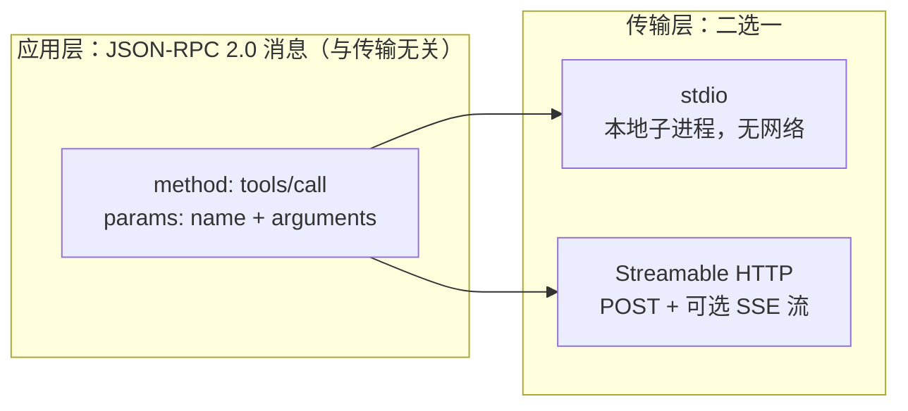
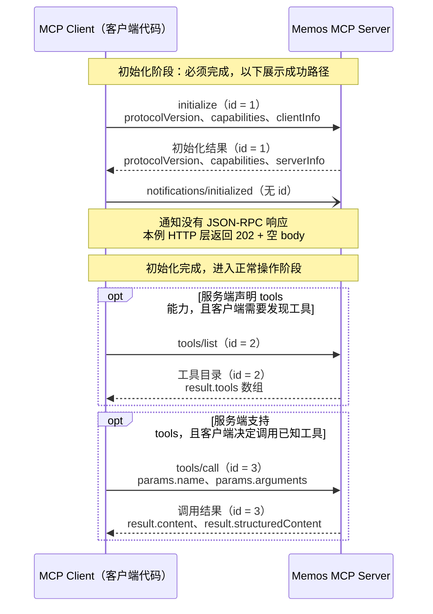
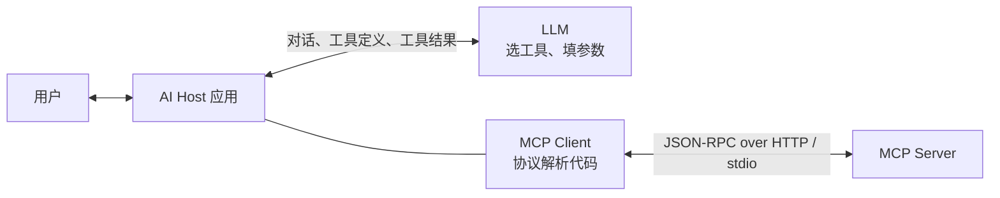

同一个 Memos 服务同时暴露两个入口：`/api/v1` 下的 REST API 和单一的 `/mcp`。两者都能“列出最近的 memo”，鉴权用的还是同一枚 token。那么 MCP 和 REST 的区别到底在哪？经常听到的“MCP 也是基于 HTTP 的”，这话对不对？

上一篇 [Memos 0.30 自托管实录](/life/2026/09/01/memos-docker-upgrade-api-mcp/)梳理过这两个入口在服务端的实现关系（MCP 由 OpenAPI 转换而来、进程内复用 REST 路由）；这篇换一个视角，不看服务端代码，直接从网络抓包看协议本身长什么样。

与其看规范文档，不如直接抓包。下面的报文以用 `curl` 对真实 Memos 实例（`0.30.0`）发起请求得到的抓包为基础，token 已脱敏；较长的业务数据和工具目录做了节选。`tools/list` 中展示的 description 按同版本源码核对并完整保留，省略范围会在示例前说明。后文补充的 `tools/call` 教学示例使用虚构数据，并单独标注。

1. Table of Contents, ordered
{:toc}

## 同一个动作，两种完全不同的报文

先用两种方式做同一件事：列出最近一条公开 memo。

REST 版本的请求，语义全部写在 HTTP 层：

```http
GET /api/v1/memos?pageSize=1&filter=visibility+%21%3D+%22PRIVATE%22 HTTP/2
Host: memos.puppylpg.top
Authorization: Bearer memos_pat_***
```

响应也是典型的 REST 风格：状态码表意，body 就是数据本身。

```http
HTTP/2 200
content-type: application/json

{"memos":[{"name":"memos/M7DBxb4xuUSyRPrTJftLsx","state":"NORMAL",
"creator":"users/puppylpg","createTime":"2026-09-08T16:22:18Z",
"content":"spec kit，sdd 范式就是我想要的那个 loop 啊……","visibility":"PUBLIC",
"tags":["life"], ...}], "nextPageToken":"CAEQAQ=="}
```

MCP 版本做的事情一样，但 HTTP 层变得“面无表情”——固定 `POST`，固定路径 `/mcp`，查询条件、动作类型全部挪进了 body：

```http
POST /mcp HTTP/2
Host: memos.puppylpg.top
Content-Type: application/json
Accept: application/json, text/event-stream
Authorization: Bearer memos_pat_***
Mcp-Session-Id: 4HRLQYAJNSKJRQBCTLLBG4MKAH

{"jsonrpc":"2.0","id":3,"method":"tools/call",
 "params":{"name":"memo_list_memos",
           "arguments":{"pageSize":2,"filter":"visibility != \"PRIVATE\""}}}
```

```http
HTTP/2 200
content-type: application/json

{"jsonrpc":"2.0","id":3,"result":{"content":[{"type":"text",
 "text":"{\"memos\":[{\"content\":\"spec kit……\" ...}]}"}],
 "structuredContent":{"memos":[ ... ],"nextPageToken":"CAIQAg=="}}}
```

对比这两组报文，第一个结论就出来了：**REST 把语义寄生在 HTTP 自己身上**——method 表示动作类型、path 定位资源、query 表达过滤、状态码表示结果；**MCP 只把 HTTP 当运输队**，`POST /mcp` 这行几乎不含任何业务信息，真正的“做什么”写在 body 的 `"method": "tools/call"` 里。

那个 body 就是 JSON-RPC 2.0 信封：`jsonrpc` 固定版本号，`id` 用来配对请求和响应，`method` 是协议方法名，`params` 是参数。接下来自然会问：既然语义都在 body 里，那 MCP 和 HTTP 到底还有没有必然关系？

## MCP 不是 HTTP 协议，HTTP 只是它的一种载体

答案分两层。**在远程部署形态下，MCP 确实跑在 HTTP 上**，抓包就是证据；但 **MCP 本身是一个基于 JSON-RPC 2.0 的应用层协议，HTTP 只是规范定义的两种传输方式之一**：

- **stdio**：本地场景。AI Host 把 MCP server 当子进程拉起，双方通过标准输入输出交换 JSON-RPC 消息，一个字节的 HTTP 都没有。
- **Streamable HTTP**：远程场景，也就是上面抓到的这种。客户端用 POST 发送 JSON-RPC，服务端可以直接返回 JSON，也可以把响应升级成 SSE 流持续推送。

关键点是：**换传输方式时，body 里的 JSON-RPC 消息一个字都不用改**。同一个 `tools/call` 请求，走 stdio 就是一行 JSON，走 HTTP 就套一层 POST 信封。这和 REST 有本质区别——REST 的语义（`GET` 的幂等读取、`DELETE` 的删除、`404` 的未找到）离开 HTTP 就没有意义了。



即便是走 HTTP，抓包里也能看到它不是普通 REST 的用法，有几个专属于 MCP 的痕迹：

- `Accept: application/json, text/event-stream` 必须**同时**带上两种类型——客户端在声明“普通 JSON 和 SSE 流我都能收”，这是 Streamable HTTP 传输的硬性要求；
- `initialize` 响应里服务端回了 `mcp-session-id: 4HRLQYAJNSKJRQBCTLLBG4MKAH`，后续请求要原样带回——这个头名字像传统 Web 的 session，实际不是一回事，下面单独展开；
- 响应头里没有 REST 世界常见的资源定位信息，所有结果都在 body 里。

所以“MCP 也是 HTTP”这个说法，只对了一半：它描述的是远程部署时的传输选择，不是协议本质。

### `Mcp-Session-Id` 是协议状态句柄，不是身份凭证

传统前后端的 cookie session id 通常是**登录态本身**：服务端拿它去 session store 查出“这是哪个用户”，它事实上承担了认证凭证的角色，泄露 cookie 约等于泄露身份。管理上它也是全自动的——服务端 `Set-Cookie` 一次，浏览器就按域和路径在之后每个请求自动带上，前端代码可以毫无感知，这也是它需要 SameSite、HttpOnly 一堆补丁防 CSRF 的原因。

`Mcp-Session-Id` 在这两点上都不同：

- **它不是凭证**。认证由 `Authorization: Bearer` 独立完成（抓包里那枚 PAT），session id 绑定的是 `initialize` 协商出来的协议上下文——谈好的协议版本、capabilities、订阅关系。MCP 规范明确要求服务端不得拿 session id 鉴权，生成时也要求全局唯一、加密随机，并与用户身份绑定，一个用户的 session id 不能看到别人的数据。
- **它没有自动管理机制**。它只是一个自定义 header，浏览器和通用 HTTP 客户端对它一无所知；要不要带、带在哪个请求上，全由 MCP 客户端库自己记住、自己塞——上面的抓包就是手动回带的。
- **失效语义指向协议而非登录**。带着失效 session id 的请求会收到 `404`，客户端要重新走一遍 `initialize` 开新会话，因为旧会话绑定的协商结果已经没了——不是“重新登录”，而是“重新握手”。

类比来说：cookie session id 像酒店房卡，证明你是住客；`Mcp-Session-Id` 像餐厅取餐号，只关联“这一单”的上下文，验资另有其物。

### 维护 session 是 server 的可选题

既然有 session id，server 是不是就要像传统后端一样维护一套 session 管理？不一定。规范里这个头是 server **可以**在 `initialize` 时返回的，不是必须。不返回的话，每个请求自包含：认证靠每次都带的 token，协商结果客户端自己记着，服务端打完就忘——和传统 REST 服务一样无状态，横向扩容任意一台实例都能处理任何请求。Memos 就是这种 stateless 配置：抓包里它仍按 SDK 默认行为发了一个 session id，但服务端并不真的拿它去查跨请求状态，更像一张握手回执。

只有需要跨请求状态的 server——记住协商结果、维护资源订阅、支持 SSE 断线后按 event id 重放——才要承担和传统 Web session 管理几乎相同的义务：唯一且不可猜测的 id、与用户的绑定、多实例下的 sticky session 或共享存储、过期清理与 `404` 语义。MCP 把“要不要做 session 管理”留成了 server 的架构选择题，而不是协议的强制要求；工具调用大多是“给参数、拿结果”的无状态操作，所以轻量实现（比如 Memos 这种 OpenAPI 转 MCP）天然倾向 stateless。

## 握手、工具发现与调用：一条完整链路

REST 客户端怎么知道有哪些接口？读 API 文档，或者读 OpenAPI 给代码生成器用——发现发生在**人和工具链那一侧**，协议本身不管。MCP 把能力发现纳入了协议：客户端先完成初始化，确认 server 支持哪些能力，再按需获取工具等具体目录。初始化与工具发现是两个阶段。

先把成功路径放在一张时序图里。左侧是 Host 内负责收发协议消息的 MCP Client，右侧是 Memos MCP Server；图中的两个可选区段分别表示工具发现和工具调用；客户端也可以直接调用已经知道名称和参数的工具。



这是抓到的真实握手请求：

```http
POST /mcp HTTP/2
Content-Type: application/json
Accept: application/json, text/event-stream
Authorization: Bearer memos_pat_***

{"jsonrpc":"2.0","id":1,"method":"initialize",
 "params":{"protocolVersion":"2025-06-18",
           "capabilities":{},
           "clientInfo":{"name":"curl-wire-demo","version":"0.1.0"}}}
```

客户端自报家门：我会说哪个版本的协议（`protocolVersion`）、我是谁（`clientInfo`）、我支持哪些能力（`capabilities`）。服务端的真实响应：

```json
{
  "jsonrpc": "2.0",
  "id": 1,
  "result": {
    "capabilities": { "logging": {}, "tools": { "listChanged": true } },
    "protocolVersion": "2025-06-18",
    "serverInfo": { "name": "memos", "version": "0.30.0" }
  }
}
```

这是一次双向协商：服务端确认协议版本，声明自己的能力——这里 Memos 声明了 `logging` 和 `tools`，没有声明 prompts 和 resources；`listChanged: true` 表示工具列表变化时支持主动通知。注意响应里的 `"id": 1` 和请求配对，这是 JSON-RPC 的规矩。

握手之后还有一个容易漏掉的步骤：客户端要回一条 `notifications/initialized` 通知，告诉服务端“我准备好了”。

```json
{"jsonrpc":"2.0","method":"notifications/initialized"}
```

注意这条消息**没有 `id`**——JSON-RPC 里没有 id 的消息是通知（notification），不需要响应体。服务端对此的真实回应是 `HTTP 202` 加空 body：收到了，没话要说。

### 标准方法、可选能力与调用时机

**`tools/list` 是 MCP 规范约定的方法名，但 `tools` 能力本身是可选的。** 服务端可以只提供 resources 或 prompts；支持工具的服务端则必须在 `initialize` 响应中声明 `capabilities.tools`，并按标准提供 `tools/list` 和 `tools/call`。`"tools": {}` 就能声明工具能力，其中的 `listChanged` 只表示是否支持工具目录变化通知，不决定能不能列出工具。具体约定见 [MCP 2025-06-18 Tools 规范](https://modelcontextprotocol.io/specification/2025-06-18/server/tools#capabilities)。

**初始化成功后，客户端必须发送的是 `notifications/initialized`，并不必须立即调用 `tools/list`。** 按 [Lifecycle 规范](https://modelcontextprotocol.io/specification/2025-06-18/basic/lifecycle)，初始化完成后进入正常操作阶段。客户端需要发现工具目录时才发送 `tools/list`；常见客户端会紧接着执行这一步，为模型准备工具定义，但这是客户端的工作流程，不是初始化必须附带的第四步。即使准备调用工具，协议也没有把“先执行一次 `tools/list`”规定为 `tools/call` 的额外前置条件。

在本文的 Memos 示例中，客户端已经看到 `capabilities.tools`，于是继续获取工具目录：

```json
{"jsonrpc":"2.0","id":2,"method":"tools/list"}
```

### 返回结构：JSON-RPC 对象中的 tools 数组

**整个响应是对象，工具数组在 `result.tools`。** 数组的每个元素是一份工具定义，描述工具叫什么、做什么、接收什么参数。这里返回的是工具目录，还没有执行 `memo_list_memos`，因此不会返回 memo 数据。

原抓包的目录里有 20 个工具。下面保留 `memo_list_memos` 和 `auth_get_current_user` 两项，其余 18 项以及两项的 `outputSchema` 省略；展示的工具级 description、全部输入参数及其 description 均按 [Memos v0.30.0 的 OpenAPI 定义](https://github.com/usememos/memos/blob/v0.30.0/proto/gen/openapi.yaml)和 [MCP 转换代码](https://github.com/usememos/memos/blob/v0.30.0/server/router/mcp/catalog.go)核对补全。省略说明放在正文中，因此代码仍然是可解析的 JSON：

```json
{
  "jsonrpc": "2.0",
  "id": 2,
  "result": {
    "tools": [
      {
        "name": "memo_list_memos",
        "title": "Memo List Memos",
        "description": "ListMemos lists memos with pagination and filter.",
        "inputSchema": {
          "type": "object",
          "properties": {
            "pageSize": {
              "type": "integer",
              "format": "int32",
              "description": "Optional. The maximum number of memos to return.\n The service may return fewer than this value.\n If unspecified, at most 50 memos will be returned.\n The maximum value is 1000; values above 1000 will be coerced to 1000."
            },
            "pageToken": {
              "type": "string",
              "description": "Optional. A page token, received from a previous `ListMemos` call.\n Provide this to retrieve the subsequent page."
            },
            "state": {
              "enum": [
                "STATE_UNSPECIFIED",
                "NORMAL",
                "ARCHIVED"
              ],
              "type": "string",
              "format": "enum",
              "description": "Optional. The state of the memos to list.\n Default to `NORMAL`. Set to `ARCHIVED` to list archived memos."
            },
            "orderBy": {
              "type": "string",
              "description": "Optional. The order to sort results by.\n Default to \"create_time desc\".\n Supports comma-separated list of fields following AIP-132.\n Example: \"pinned desc, create_time desc\" or \"update_time asc\"\n Supported fields: pinned, create_time, update_time, name.\n Note: order_by uses create_time / update_time, while the filter\n expression uses created_ts / updated_ts for the same timestamps."
            },
            "filter": {
              "type": "string",
              "description": "Optional. A CEL expression to filter memos. Combine terms with && and ||.\n Available fields:\n   content (string), creator (string, e.g. \"users/1\"),\n   created_ts / updated_ts (timestamp), pinned (bool),\n   visibility (string: PRIVATE | PROTECTED | PUBLIC),\n   tags (list<string>; match with `\"work\" in tags`, not `tag == \"work\"`),\n   has_task_list / has_link / has_code / has_incomplete_tasks (bool).\n Note: the time fields here are created_ts / updated_ts, which differ from\n the create_time / update_time names used by order_by.\n Examples:\n   pinned == true && visibility == \"PUBLIC\"\n   tags.exists(t, t == \"urgent\")\n   content.contains(\"roadmap\") && created_ts > now - duration(\"168h\")"
            },
            "showDeleted": {
              "type": "boolean",
              "description": "Optional. If true, show deleted memos in the response."
            }
          },
          "additionalProperties": false
        },
        "annotations": {
          "title": "Memo List Memos",
          "readOnlyHint": true,
          "idempotentHint": true,
          "destructiveHint": false,
          "openWorldHint": false
        },
        "_meta": {
          "method": "GET",
          "operationId": "MemoService_ListMemos",
          "path": "/api/v1/memos"
        }
      },
      {
        "name": "auth_get_current_user",
        "title": "Auth Get Current User",
        "description": "GetCurrentUser returns the authenticated user's information.\n Validates the access token and returns user details.\n Similar to OIDC's /userinfo endpoint.",
        "inputSchema": {
          "type": "object",
          "properties": {},
          "additionalProperties": false
        },
        "annotations": {
          "title": "Auth Get Current User",
          "readOnlyHint": true,
          "idempotentHint": true,
          "destructiveHint": false,
          "openWorldHint": false
        },
        "_meta": {
          "method": "GET",
          "operationId": "AuthService_GetCurrentUser",
          "path": "/api/v1/auth/me"
        }
      }
    ]
  }
}
```

这里的 `id: 2` 对应上面的 `tools/list` 请求。`result.tools[0].name` 是服务端定义的工具名 `memo_list_memos`，与协议方法名 `tools/list` 属于不同层次；执行它时，要把这个名字放进 `tools/call` 的 `params.name`。

工具目录还支持[分页](https://modelcontextprotocol.io/specification/2025-06-18/server/utilities/pagination)：如果服务端返回 `result.nextCursor`，客户端可以在下一次 `tools/list` 请求的 `params.cursor` 中原样带回；没有 `nextCursor` 就表示目录已到末尾。这里人为省略 18 个工具只是文章节选，不代表服务端把它们放到了下一页。工具目录分页使用的 `nextCursor` / `cursor`，也与查询 memo 数据时的 `nextPageToken` / `pageToken` 无关。

### description 分为工具说明和参数说明

`memo_list_memos` 顶层的 `description` 完整内容就是一句 `ListMemos lists memos with pagination and filter.`。支持哪些筛选字段、CEL 表达式怎样写，放在 **`inputSchema.properties.filter.description`** 中；分页上限、排序规则等则分别放在对应参数的 description 中。

为了直接读清这段最长的说明，下面把上面 JSON 中 `filter.description` 的 `\n` 展开为换行、`\"` 还原成双引号，内容没有删减：

```text
Optional. A CEL expression to filter memos. Combine terms with && and ||.
 Available fields:
   content (string), creator (string, e.g. "users/1"),
   created_ts / updated_ts (timestamp), pinned (bool),
   visibility (string: PRIVATE | PROTECTED | PUBLIC),
   tags (list<string>; match with `"work" in tags`, not `tag == "work"`),
   has_task_list / has_link / has_code / has_incomplete_tasks (bool).
 Note: the time fields here are created_ts / updated_ts, which differ from
 the create_time / update_time names used by order_by.
 Examples:
   pinned == true && visibility == "PUBLIC"
   tags.exists(t, t == "urgent")
   content.contains("roadmap") && created_ts > now - duration("168h")
```

这段说明列出了字段、类型和三个完整表达式示例，还特意区分了同一时间戳的两套命名：**`filter` 使用 `created_ts` / `updated_ts`，`orderBy` 使用 `create_time` / `update_time`**。因此模型拿到的不只是“这是个查询工具”，还有怎样构造有效参数的自然语言说明书。

`annotations` 则声明这个工具只读、幂等、不具有破坏性，Host 可以把这些提示作为执行策略的参考。MCP 将工具发现标准化后，Host 可以通过协议取得这些定义，再交给模型选择工具、填写参数；Memos 里的说明文字本身仍来自同一份 OpenAPI，这也说明面向人阅读的 API 文档和面向模型的工具目录可以共享描述来源。

### 从工具定义到 tools/call：一次完整调用

拿到 `memo_list_memos` 的定义后，客户端已经知道工具名称、可用参数及其含义。现在把“按创建时间倒序，最多取一条非私有 memo”写成实际的 [tools/call 请求](https://modelcontextprotocol.io/specification/2025-06-18/server/tools#calling-tools)。下面是完整的 JSON-RPC 请求体；在本文的 HTTP 传输中，它仍然发往 `POST /mcp`：

```json
{
  "jsonrpc": "2.0",
  "id": 3,
  "method": "tools/call",
  "params": {
    "name": "memo_list_memos",
    "arguments": {
      "pageSize": 1,
      "filter": "visibility != \"PRIVATE\"",
      "orderBy": "create_time desc"
    }
  }
}
```

定义和调用在这里一一对应：

- **`method` 固定为 `tools/call`**：告诉 MCP Server 本次要执行工具调用。
- **`params.name` 来自工具定义的 `name`**：选择 `memo_list_memos`，而不是把业务工具名写进 `method`。
- **`params.arguments` 按 `inputSchema` 填写**：`pageSize` 是整数，`filter` 和 `orderBy` 是字符串；字段名沿用 Memos 的定义。`visibility != "PRIVATE"` 排除私有 memo，`create_time desc` 使用排序参数规定的时间字段名。
- **`id: 3` 标识本次请求**：与前面的 `tools/list` 请求区分，服务端回同一个 id；它不是工具编号，也不是 memo 的 id。

执行成功后，Memos 把查询结果包装进 MCP 响应。**下面是结构完整的教学示例，memo 的名称和内容均为虚构，业务对象只保留便于说明的字段，不是新的抓包记录：**

```json
{
  "jsonrpc": "2.0",
  "id": 3,
  "result": {
    "content": [
      {
        "type": "text",
        "text": "{\"memos\":[{\"name\":\"memos/example-public-memo\",\"state\":\"NORMAL\",\"content\":\"这是一条公开的示例 memo。\",\"visibility\":\"PUBLIC\"}]}"
      }
    ],
    "structuredContent": {
      "memos": [
        {
          "name": "memos/example-public-memo",
          "state": "NORMAL",
          "content": "这是一条公开的示例 memo。",
          "visibility": "PUBLIC"
        }
      ]
    }
  }
}
```

外层 `id: 3` 将响应对应到这次调用。`result.content` 是 MCP 的内容块数组，这里只有一个 `type: "text"` 块，其 `text` 是经过转义的业务 JSON 字符串；`result.structuredContent` 则直接放同一份业务对象。**`result.tools` 是工具目录，`result.structuredContent.memos` 才是这次查询得到的 memo 列表**：前者来自 `tools/list`，后者来自 `tools/call`。本例没有后续数据页，所以业务对象里没有 `nextPageToken`；如果返回了它，应在下一次调用的 `params.arguments.pageToken` 中原样带回。

这就把一次使用过程接完整了：`tools/list` 让客户端知道“有哪些工具、参数怎样填”，`tools/call` 才真正执行查询并返回业务数据。初始化完成后可以继续调用多个工具，无需为每次调用重新握手或重新列目录。

## 从 Memos 看 MCP 协议的基本约定

MCP（Model Context Protocol）统一的是 **AI 应用与外部服务之间的通信约定**。Memos 提供“列出 memo”等具体能力，MCP 规定客户端怎样协商能力、发现工具、发起调用和接收结果。沿着上面的例子，可以把本文使用的 [MCP 2025-06-18 规范](https://modelcontextprotocol.io/specification/2025-06-18/basic)概括为三组约定。

**第一组是消息格式。** 双方交换 JSON-RPC 2.0 消息，基本类型只有三种：

| 消息类型与 Memos 例子 | 协议约定 |
|---|---|
| 请求（request）<br>`id: 2` 的 `tools/list` | 有 `id`、`method`，按需带 `params`<br>发出后等待对应响应 |
| 响应（response）<br>`result.tools` 返回工具数组 | 回带请求的 `id: 2`<br>`result` 与 `error` 二选一 |
| 通知（notification）<br>`notifications/initialized` | 有 `method`，可带 `params`，没有 `id`<br>接收方不返回 JSON-RPC 响应 |

这里有两个独立的版本号：每条消息里的 **`jsonrpc: "2.0"` 是信封格式版本**，初始化时的 **`protocolVersion: "2025-06-18"` 是 MCP 协议版本**。HTTP 或 stdio 负责传送这些消息；换传输方式不会把 `tools/list` 变成另一套协议方法。

**第二组是方法的输入输出契约。** 以 [Tools 规范](https://modelcontextprotocol.io/specification/2025-06-18/server/tools)为例，MCP 不只约定方法叫什么，也约定它接收和返回哪些字段：`tools/list` 返回 `result.tools`；`tools/call` 接收 `params.name` 和 `params.arguments`，结果放在 `result.content` 中，也可以带 `result.structuredContent`。Memos 的 `memo_list_memos` 是 `params.name` 的一个值，`pageSize`、`filter` 是这个工具自己声明的 arguments。**标准协议方法承载服务端自定义的业务工具**，因此换成另一个服务端，客户端仍然可以沿用相同的发现和调用代码。调用失败时怎样区分 JSON-RPC `error` 与工具结果里的 `isError`，后文再展开。

**第三组是生命周期与可选能力。** 基础消息和[初始化流程](https://modelcontextprotocol.io/specification/2025-06-18/basic/lifecycle)是共同底座，业务能力按需实现，并在 `initialize` 时声明。服务端的三类主要能力是：`tools` 提供可调用的操作，[resources](https://modelcontextprotocol.io/specification/2025-06-18/server/resources) 提供可按 URI 读取的内容，[prompts](https://modelcontextprotocol.io/specification/2025-06-18/server/prompts) 提供可获取的提示词模板。本例 Memos 声明了 `tools`，所以客户端通过工具查询 memo；“读取数据”同样可以是一项工具操作，并不意味着服务端一定实现了 `resources`。客户端只使用已协商的能力，何时拉取目录、把哪些工具交给模型，则由 Host 决定。

## 协议的每一层字段，分别由谁定义

这些约定同时包含固定字段和服务端自定义内容。要区分哪些必须严格匹配协议、哪些可以由 Memos 自己设计，需要先明确**谁在读协议**。

一个常见的错位是把 MCP Client 当成大模型本身。实际上 Client 是 Host（Codex、Claude Desktop 等）内部的一段**确定性代码**，和模型是两个组件：



模型在这条链里只接触两样东西：`tools/list` 结果里的工具名、description 和 JSON Schema（Host 转发给它当说明书），以及 `tools/call` 的结果文本。除此之外的所有消息——`initialize` 握手、capabilities 协商、session id 的回带——都是 Client 代码在收发和解析，模型全程不可见。代码没有“猜”的能力，所以信封层的字段一个都不能随便写。

把报文从外到内拆开，每一层的“制定者”不同，自由度也完全不同：

1. **JSON-RPC 2.0 信封：最严，独立通用规范**。[JSON-RPC 2.0](https://www.jsonrpc.org/specification) 早在 2010 年前后就定稿了，不是为 AI 发明的。它锁死 `jsonrpc`/`id`/`method`/`params` 的形态，规定没有 `id` 就是 notification、服务端禁止返回响应体（上文 `notifications/initialized` 只回 `202` 空 body 的原因），规定响应里 `result` 和 `error` 必须二选一，还保留了 `-32768` 到 `-32000` 的错误码区间——下文抓到的 `-32602` 就来自这张保留码表。
2. **MCP 协议方法：由 MCP 规范定义**。[MCP 规范](https://modelcontextprotocol.io/specification/2025-06-18)（Anthropic 2024 年底发起开源）在信封之上锁死了方法词汇表和生命周期：方法就叫 `initialize`、`tools/list`、`tools/call`，Server 不能发明一个叫 `listTools` 的变体——Client 代码里硬编码了要调什么；每个方法的 params 和 result 结构也是固定的，比如 Client 要程序化地读 `capabilities.tools` 来判断服务端有没有工具能力，再决定下一步行为。
3. **工具参数：唯一自由的一层**。`tools/call` 里 `arguments` 的字段（`pageSize` 还是 `limit`）、工具叫什么、description 怎么写，由**每个 server 自己**用 JSON Schema 声明并通过 `tools/list` 下发。这是协议里唯一“随便写”的部分，也恰恰是模型唯一能读到的那层——说它自由，是因为它的消费者是模型；说它仍受约束，是因为 Client 会拿声明的 schema 做确定性校验，填错类型照样被拒。

MCP 规范存在的意义也就在第二层：没有它，每个 AI 应用接每个外部服务都要写一套定制对接代码，N 个 Host 乘 M 个服务就是 N×M 份胶水；中间层统一之后，Client 库只需实现一次，任何合规 Server 即插即用。用邮政打个比方：JSON-RPC 规定信封格式，MCP 规范规定有哪几种公文、每种公文有哪些固定栏目，Server 自定义的只是某张表格上的填空题——而模型只负责答填空题，既不拆信封，也不印表格。

## tools/call 的结果，和它的两种错误

前面的完整 `tools/call` 示例中，同一份业务数据出现了**两次**：一次位于文本块，一次位于结构化结果。把相关字段单独摘出来：

```json
"result": {
  "content": [{ "type": "text", "text": "{\"memos\":[...]}" }],
  "structuredContent": { "memos": [...] }
}
```

`content` 是给模型读的文本形态（这里是 JSON 字符串），`structuredContent` 是按 `outputSchema` 组织的结构化数据，给 Host 程序用。MCP 服务端选择两者都返回，各取所需。

更有教学价值的是错误。故意造了两种错误，抓到的响应形态完全不同：

**协议层错误**——调用一个不存在的工具：

```json
{"jsonrpc":"2.0","id":4,
 "error":{"code":-32602,"message":"unknown tool \"memo_delete_everything\""}}
```

这是标准的 JSON-RPC error：没有 `result`，换成 `error`，`-32602` 是规范里的 “Invalid params”。说明请求根本没进入工具执行阶段，在协议路由层就被拒了。

**工具层错误**——工具存在，但参数类型填错（`pageSize` 传了字符串）：

```json
{"jsonrpc":"2.0","id":5,
 "result":{"content":[{"type":"text","text":"argument \"pageSize\" must be integer"}],
           "isError":true}}
```

注意这次 HTTP 依然是 `200`，JSON-RPC 信封里是 `result` 而不是 `error`，失败标记藏在结果的 `isError: true` 里。为什么要设计成这样？因为这个错误的读者是**模型**：模型拿到 `isError: true` 和一句人话错误描述后，会自己改正参数重试。对 LLM 来说，“工具执行失败但错误可读”和“协议本身出错”是两件事，前者是正常推理过程的一部分，后者才是异常。对比 REST 就明白了：REST 用 `400`/`404` 状态码把错误类型压进 HTTP 层，是给调用方程序的 `if` 判断用的；MCP 把业务错误压成自然语言文本，是给模型“读”的。

## 收束：两种协议，两种读者

把抓包看到的事实归拢成一张表：

| 维度 | REST | MCP |
|---|---|---|
| 业务语义位置 | HTTP method + path + query + 状态码 | body 里 JSON-RPC 的 method + params |
| 与 HTTP 的关系 | 语义寄生在 HTTP 上，离开 HTTP 不成立 | HTTP 只是两种传输之一（另一种是 stdio），换传输不改消息 |
| 能力发现 | 协议不管，靠文档 / OpenAPI | 协议内建：`initialize` 协商能力，`tools/list` 动态下发 |
| 接口描述受众 | 程序员、代码生成器 | 模型：自然语言 description + JSON Schema + 行为注解 |
| 请求形态 | 多个资源路径、多个 method | 单一端点、固定 POST |
| 会话状态 | cookie session 常兼任身份凭证，浏览器自动管理 | `Mcp-Session-Id` 只是协议状态句柄，客户端显式回带；server 可选择完全 stateless |
| 字段定义方 | method/path 语义来自 HTTP，资源结构由各 API 自定义 | 信封由 JSON-RPC 2.0 锁死，方法由 MCP 规范锁死，仅工具参数由 server 自定义 |
| 错误表达 | HTTP 状态码 + 错误 body | 协议层用 JSON-RPC error；业务层用 `isError: true` + 可读本 |

最后还有一个抓包附赠的证据，回答“MCP 和 REST 是不是两套平行实现”。回看上面工具定义里的 `_meta` 字段——`"method": "GET", "path": "/api/v1/memos"` 明明白白写着这个 MCP 工具背后的 REST 映射。Memos 的 MCP server 接到 `tools/call` 后，就是在进程内按这个映射构造一个 `GET /api/v1/memos` 请求，复用同一套路由、鉴权和业务代码（服务端实现细节见[上一篇 Memos 升级实录](/life/2026/09/01/memos-docker-upgrade-api-mcp/)）。所以两者的关系不是并列，而是分层：**REST API 是能力底座，MCP 是架在其上、面向模型的适配层**。

日常选择也由此而来：脚本要精确控制、批量处理、调用管理类接口，直接打 `/api/v1`；要让模型根据自然语言自己挑工具、读结果、继续推理，走 `/mcp`。两条路最终汇入同一个 SQLite，数据始终只有一套。
