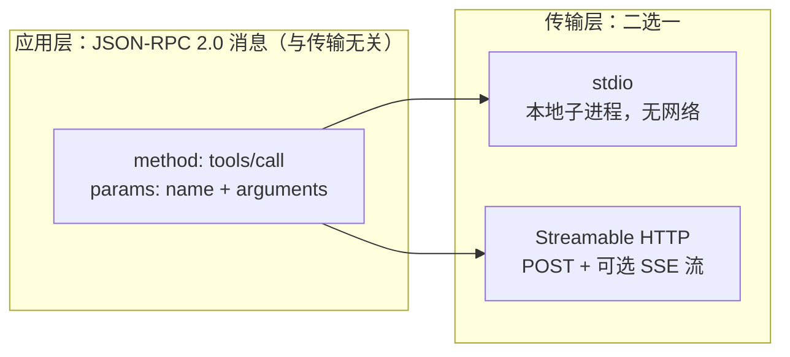
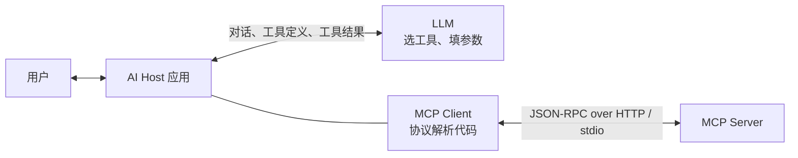

同一个 Memos 服务同时暴露两个入口：`/api/v1` 下的 REST API 和单一的 `/mcp`。两者都能“列出最近的 memo”，鉴权用的还是同一枚 token。那么 MCP 和 REST 的区别到底在哪？经常听到的“MCP 也是基于 HTTP 的”，这话对不对？

上一篇 [Memos 0.30 自托管实录](/life/2026/09/01/memos-docker-upgrade-api-mcp/)梳理过这两个入口在服务端的实现关系（MCP 由 OpenAPI 转换而来、进程内复用 REST 路由）；这篇换一个视角，不看服务端代码，直接从网络抓包看协议本身长什么样。

与其看规范文档，不如直接抓包。下面所有报文都是用 `curl` 对真实 Memos 实例（`0.30.0`）发起请求得到的原始响应，只有 token 做了脱敏。

1. Table of Contents, ordered
{:toc}

## 同一个动作，两种完全不同的报文

先用两种方式做同一件事：列出最近一条公开 memo。

REST 版本的请求，语义全部写在 HTTP 层：

```http
GET /api/v1/memos?pageSize=1&filter=visibility+%21%3D+%22PRIVATE%22 HTTP/2
Host: memos.puppylpg.top
Authorization: Bearer memos_pat_***
```

响应也是典型的 REST 风格：状态码表意，body 就是数据本身。

```http
HTTP/2 200
content-type: application/json

{"memos":[{"name":"memos/M7DBxb4xuUSyRPrTJftLsx","state":"NORMAL",
"creator":"users/puppylpg","createTime":"2026-09-08T16:22:18Z",
"content":"spec kit，sdd 范式就是我想要的那个 loop 啊……","visibility":"PUBLIC",
"tags":["life"], ...}], "nextPageToken":"CAEQAQ=="}
```

MCP 版本做的事情一样，但 HTTP 层变得“面无表情”——固定 `POST`，固定路径 `/mcp`，查询条件、动作类型全部挪进了 body：

```http
POST /mcp HTTP/2
Host: memos.puppylpg.top
Content-Type: application/json
Accept: application/json, text/event-stream
Authorization: Bearer memos_pat_***
Mcp-Session-Id: 4HRLQYAJNSKJRQBCTLLBG4MKAH

{"jsonrpc":"2.0","id":3,"method":"tools/call",
 "params":{"name":"memo_list_memos",
           "arguments":{"pageSize":2,"filter":"visibility != \"PRIVATE\""}}}
```

```http
HTTP/2 200
content-type: application/json

{"jsonrpc":"2.0","id":3,"result":{"content":[{"type":"text",
 "text":"{\"memos\":[{\"content\":\"spec kit……\" ...}]}"}],
 "structuredContent":{"memos":[ ... ],"nextPageToken":"CAIQAg=="}}}
```

对比这两组报文，第一个结论就出来了：**REST 把语义寄生在 HTTP 自己身上**——method 表示动作类型、path 定位资源、query 表达过滤、状态码表示结果；**MCP 只把 HTTP 当运输队**，`POST /mcp` 这行几乎不含任何业务信息，真正的“做什么”写在 body 的 `"method": "tools/call"` 里。

那个 body 就是 JSON-RPC 2.0 信封：`jsonrpc` 固定版本号，`id` 用来配对请求和响应，`method` 是协议方法名，`params` 是参数。接下来自然会问：既然语义都在 body 里，那 MCP 和 HTTP 到底还有没有必然关系？

## MCP 不是 HTTP 协议，HTTP 只是它的一种载体

答案分两层。**在远程部署形态下，MCP 确实跑在 HTTP 上**，抓包就是证据；但 **MCP 本身是一个基于 JSON-RPC 2.0 的应用层协议，HTTP 只是规范定义的两种传输方式之一**：

- **stdio**：本地场景。AI Host 把 MCP server 当子进程拉起，双方通过标准输入输出交换 JSON-RPC 消息，一个字节的 HTTP 都没有。
- **Streamable HTTP**：远程场景，也就是上面抓到的这种。客户端用 POST 发送 JSON-RPC，服务端可以直接返回 JSON，也可以把响应升级成 SSE 流持续推送。

关键点是：**换传输方式时，body 里的 JSON-RPC 消息一个字都不用改**。同一个 `tools/call` 请求，走 stdio 就是一行 JSON，走 HTTP 就套一层 POST 信封。这和 REST 有本质区别——REST 的语义（`GET` 的幂等读取、`DELETE` 的删除、`404` 的未找到）离开 HTTP 就没有意义了。



即便是走 HTTP，抓包里也能看到它不是普通 REST 的用法，有几个专属于 MCP 的痕迹：

- `Accept: application/json, text/event-stream` 必须**同时**带上两种类型——客户端在声明“普通 JSON 和 SSE 流我都能收”，这是 Streamable HTTP 传输的硬性要求；
- `initialize` 响应里服务端回了 `mcp-session-id: 4HRLQYAJNSKJRQBCTLLBG4MKAH`，后续请求要原样带回——这个头名字像传统 Web 的 session，实际不是一回事，下面单独展开；
- 响应头里没有 REST 世界常见的资源定位信息，所有结果都在 body 里。

所以“MCP 也是 HTTP”这个说法，只对了一半：它描述的是远程部署时的传输选择，不是协议本质。

### `Mcp-Session-Id` 是协议状态句柄，不是身份凭证

传统前后端的 cookie session id 通常是**登录态本身**：服务端拿它去 session store 查出“这是哪个用户”，它事实上承担了认证凭证的角色，泄露 cookie 约等于泄露身份。管理上它也是全自动的——服务端 `Set-Cookie` 一次，浏览器就按域和路径在之后每个请求自动带上，前端代码可以毫无感知，这也是它需要 SameSite、HttpOnly 一堆补丁防 CSRF 的原因。

`Mcp-Session-Id` 在这两点上都不同：

- **它不是凭证**。认证由 `Authorization: Bearer` 独立完成（抓包里那枚 PAT），session id 绑定的是 `initialize` 协商出来的协议上下文——谈好的协议版本、capabilities、订阅关系。MCP 规范明确要求服务端不得拿 session id 鉴权，生成时也要求全局唯一、加密随机，并与用户身份绑定，一个用户的 session id 不能看到别人的数据。
- **它没有自动管理机制**。它只是一个自定义 header，浏览器和通用 HTTP 客户端对它一无所知；要不要带、带在哪个请求上，全由 MCP 客户端库自己记住、自己塞——上面的抓包就是手动回带的。
- **失效语义指向协议而非登录**。带着失效 session id 的请求会收到 `404`，客户端要重新走一遍 `initialize` 开新会话，因为旧会话绑定的协商结果已经没了——不是“重新登录”，而是“重新握手”。

类比来说：cookie session id 像酒店房卡，证明你是住客；`Mcp-Session-Id` 像餐厅取餐号，只关联“这一单”的上下文，验资另有其物。

### 维护 session 是 server 的可选题

既然有 session id，server 是不是就要像传统后端一样维护一套 session 管理？不一定。规范里这个头是 server **可以**在 `initialize` 时返回的，不是必须。不返回的话，每个请求自包含：认证靠每次都带的 token，协商结果客户端自己记着，服务端打完就忘——和传统 REST 服务一样无状态，横向扩容任意一台实例都能处理任何请求。Memos 就是这种 stateless 配置：抓包里它仍按 SDK 默认行为发了一个 session id，但服务端并不真的拿它去查跨请求状态，更像一张握手回执。

只有需要跨请求状态的 server——记住协商结果、维护资源订阅、支持 SSE 断线后按 event id 重放——才要承担和传统 Web session 管理几乎相同的义务：唯一且不可猜测的 id、与用户的绑定、多实例下的 sticky session 或共享存储、过期清理与 `404` 语义。MCP 把“要不要做 session 管理”留成了 server 的架构选择题，而不是协议的强制要求；工具调用大多是“给参数、拿结果”的无状态操作，所以轻量实现（比如 Memos 这种 OpenAPI 转 MCP）天然倾向 stateless。

## 握手与能力发现：initialize 的真实样子

REST 客户端怎么知道有哪些接口？读 API 文档，或者读 OpenAPI 给代码生成器用——发现发生在**人和工具链那一侧**，协议本身不管。MCP 把这件事搬到了协议里：客户端连上 server 后，第一件事就是握手和问“你有什么工具”。

这是抓到的真实握手请求：

```http
POST /mcp HTTP/2
Content-Type: application/json
Accept: application/json, text/event-stream
Authorization: Bearer memos_pat_***

{"jsonrpc":"2.0","id":1,"method":"initialize",
 "params":{"protocolVersion":"2025-06-18",
           "capabilities":{},
           "clientInfo":{"name":"curl-wire-demo","version":"0.1.0"}}}
```

客户端自报家门：我会说哪个版本的协议（`protocolVersion`）、我是谁（`clientInfo`）、我支持哪些能力（`capabilities`）。服务端的真实响应：

```json
{
  "jsonrpc": "2.0",
  "id": 1,
  "result": {
    "capabilities": { "logging": {}, "tools": { "listChanged": true } },
    "protocolVersion": "2025-06-18",
    "serverInfo": { "name": "memos", "version": "0.30.0" }
  }
}
```

这是一次双向协商：服务端确认协议版本，声明自己的能力——Memos 只提供 `tools`，不提供 prompts 和 resources；`listChanged: true` 表示工具列表变化时支持主动通知。注意响应里的 `"id": 1` 和请求配对，这是 JSON-RPC 的规矩。

握手之后还有一个容易漏掉的步骤：客户端要回一条 `notifications/initialized` 通知，告诉服务端“我准备好了”。

```json
{"jsonrpc":"2.0","method":"notifications/initialized"}
```

注意这条消息**没有 `id`**——JSON-RPC 里没有 id 的消息是通知（notification），不需要响应体。服务端对此的真实回应是 `HTTP 202` 加空 body：收到了，没话要说。

然后客户端问出关键问题——`tools/list`：

```json
{"jsonrpc":"2.0","id":2,"method":"tools/list"}
```

真实响应里有 20 个工具。挑出 `memo_list_memos` 的定义看看，它和 REST 的“文档”气质完全不同：

```json
{
  "name": "memo_list_memos",
  "title": "Memo List Memos",
  "description": "ListMemos lists memos with pagination and filter.",
  "inputSchema": {
    "type": "object",
    "properties": {
      "filter": {
        "type": "string",
        "description": "Optional. A CEL expression to filter memos. Combine terms with && and ||.\n Available fields: content, creator, created_ts / updated_ts, pinned, visibility (PRIVATE | PROTECTED | PUBLIC), tags ...\n Examples:\n   pinned == true && visibility == \"PUBLIC\"\n   content.contains(\"roadmap\") && created_ts > now - duration(\"168h\")"
      },
      "pageSize": { "type": "integer", "format": "int32", "description": "Optional. The maximum number of memos to return..." },
      "state": { "type": "string", "enum": ["STATE_UNSPECIFIED", "NORMAL", "ARCHIVED"], "..." : "..." }
    }
  },
  "annotations": {
    "readOnlyHint": true,
    "idempotentHint": true,
    "destructiveHint": false,
    "openWorldHint": false
  },
  "_meta": {
    "method": "GET",
    "operationId": "MemoService_ListMemos",
    "path": "/api/v1/memos"
  }
}
```

（真实定义还包含完整的 `outputSchema`，太长这里省略；`_meta` 一节稍后会再提到。）

这份定义处处是“写给模型看”的设计：`description` 不是给人扫一眼的摘要，而是手把手教模型怎么填参数的自然语言说明书——支持哪些字段、CEL 表达式怎么写、给了三个完整示例，甚至特意提醒“filter 里的时间字段叫 `created_ts`，和 `orderBy` 里的 `create_time` 不一样”。`annotations` 则告诉 Host 这个工具是只读的、幂等的、不具有破坏性，Host 可以据此决定要不要弹审批。这就是 MCP 和 REST 在“发现”上的根本差异：**REST 的接口目录写进文档给人读，MCP 的工具目录通过协议实时下发给模型读**，模型在对话中自己决定调哪个、参数怎么填。

## 协议的每一层字段，分别由谁定义

看到 `description` 是手把手教模型的自然语言，容易推出一个误解：既然有模型的理解力兜底，是不是整个报文的字段都可以随便写？回答这个问题，要先弄清楚**谁在读协议**。

一个常见的错位是把 MCP Client 当成大模型本身。实际上 Client 是 Host（Codex、Claude Desktop 等）内部的一段**确定性代码**，和模型是两个组件：



模型在这条链里只接触两样东西：`tools/list` 结果里的工具名、description 和 JSON Schema（Host 转发给它当说明书），以及 `tools/call` 的结果文本。除此之外的所有消息——`initialize` 握手、capabilities 协商、session id 的回带——都是 Client 代码在收发和解析，模型全程不可见。代码没有“猜”的能力，所以信封层的字段一个都不能随便写。

把报文从外到内拆开，每一层的“制定者”不同，自由度也完全不同：

1. **JSON-RPC 2.0 信封：最严，独立通用规范**。[JSON-RPC 2.0](https://www.jsonrpc.org/specification) 早在 2010 年前后就定稿了，不是为 AI 发明的。它锁死 `jsonrpc`/`id`/`method`/`params` 的形态，规定没有 `id` 就是 notification、服务端禁止返回响应体（上文 `notifications/initialized` 只回 `202` 空 body 的原因），规定响应里 `result` 和 `error` 必须二选一，还保留了 `-32768` 到 `-32000` 的错误码区间——下文抓到的 `-32602` 就来自这张保留码表。
2. **MCP 协议方法：由 MCP 规范定义**。[MCP 规范](https://modelcontextprotocol.io/specification/2025-06-18)（Anthropic 2024 年底发起开源）在信封之上锁死了方法词汇表和生命周期：方法就叫 `initialize`、`tools/list`、`tools/call`，Server 不能发明一个叫 `listTools` 的变体——Client 代码里硬编码了要调什么；每个方法的 params 和 result 结构也是固定的，比如 Client 要程序化地读 `capabilities.tools` 来判断服务端有没有工具能力，再决定下一步行为。
3. **工具参数：唯一自由的一层**。`tools/call` 里 `arguments` 的字段（`pageSize` 还是 `limit`）、工具叫什么、description 怎么写，由**每个 server 自己**用 JSON Schema 声明并通过 `tools/list` 下发。这是协议里唯一“随便写”的部分，也恰恰是模型唯一能读到的那层——说它自由，是因为它的消费者是模型；说它仍受约束，是因为 Client 会拿声明的 schema 做确定性校验，填错类型照样被拒。

MCP 规范存在的意义也就在第二层：没有它，每个 AI 应用接每个外部服务都要写一套定制对接代码，N 个 Host 乘 M 个服务就是 N×M 份胶水；中间层统一之后，Client 库只需实现一次，任何合规 Server 即插即用。用邮政打个比方：JSON-RPC 规定信封格式，MCP 规范规定有哪几种公文、每种公文有哪些固定栏目，Server 自定义的只是某张表格上的填空题——而模型只负责答填空题，既不拆信封，也不印表格。

## tools/call 的结果，和它的两种错误

工具真正执行时，回到开头的 `tools/call` 响应，有一个细节值得放大——同一份数据出现了**两次**：

```json
"result": {
  "content": [{ "type": "text", "text": "{\"memos\":[...]}" }],
  "structuredContent": { "memos": [...], "nextPageToken": "CAIQAg==" }
}
```

`content` 是给模型读的文本形态（这里是 JSON 字符串），`structuredContent` 是按 `outputSchema` 组织的结构化数据，给 Host 程序用。MCP 服务端选择两者都返回，各取所需。

更有教学价值的是错误。故意造了两种错误，抓到的响应形态完全不同：

**协议层错误**——调用一个不存在的工具：

```json
{"jsonrpc":"2.0","id":4,
 "error":{"code":-32602,"message":"unknown tool \"memo_delete_everything\""}}
```

这是标准的 JSON-RPC error：没有 `result`，换成 `error`，`-32602` 是规范里的 “Invalid params”。说明请求根本没进入工具执行阶段，在协议路由层就被拒了。

**工具层错误**——工具存在，但参数类型填错（`pageSize` 传了字符串）：

```json
{"jsonrpc":"2.0","id":5,
 "result":{"content":[{"type":"text","text":"argument \"pageSize\" must be integer"}],
           "isError":true}}
```

注意这次 HTTP 依然是 `200`，JSON-RPC 信封里是 `result` 而不是 `error`，失败标记藏在结果的 `isError: true` 里。为什么要设计成这样？因为这个错误的读者是**模型**：模型拿到 `isError: true` 和一句人话错误描述后，会自己改正参数重试。对 LLM 来说，“工具执行失败但错误可读”和“协议本身出错”是两件事，前者是正常推理过程的一部分，后者才是异常。对比 REST 就明白了：REST 用 `400`/`404` 状态码把错误类型压进 HTTP 层，是给调用方程序的 `if` 判断用的；MCP 把业务错误压成自然语言文本，是给模型“读”的。

## 收束：两种协议，两种读者

把抓包看到的事实归拢成一张表：

| 维度 | REST | MCP |
|---|---|---|
| 业务语义位置 | HTTP method + path + query + 状态码 | body 里 JSON-RPC 的 method + params |
| 与 HTTP 的关系 | 语义寄生在 HTTP 上，离开 HTTP 不成立 | HTTP 只是两种传输之一（另一种是 stdio），换传输不改消息 |
| 能力发现 | 协议不管，靠文档 / OpenAPI | 协议内建：`initialize` 协商能力，`tools/list` 动态下发 |
| 接口描述受众 | 程序员、代码生成器 | 模型：自然语言 description + JSON Schema + 行为注解 |
| 请求形态 | 多个资源路径、多个 method | 单一端点、固定 POST |
| 会话状态 | cookie session 常兼任身份凭证，浏览器自动管理 | `Mcp-Session-Id` 只是协议状态句柄，客户端显式回带；server 可选择完全 stateless |
| 字段定义方 | method/path 语义来自 HTTP，资源结构由各 API 自定义 | 信封由 JSON-RPC 2.0 锁死，方法由 MCP 规范锁死，仅工具参数由 server 自定义 |
| 错误表达 | HTTP 状态码 + 错误 body | 协议层用 JSON-RPC error；业务层用 `isError: true` + 可读本 |

最后还有一个抓包附赠的证据，回答“MCP 和 REST 是不是两套平行实现”。回看上面工具定义里的 `_meta` 字段——`"method": "GET", "path": "/api/v1/memos"` 明明白白写着这个 MCP 工具背后的 REST 映射。Memos 的 MCP server 接到 `tools/call` 后，就是在进程内按这个映射构造一个 `GET /api/v1/memos` 请求，复用同一套路由、鉴权和业务代码（服务端实现细节见[上一篇 Memos 升级实录](/life/2026/09/01/memos-docker-upgrade-api-mcp/)）。所以两者的关系不是并列，而是分层：**REST API 是能力底座，MCP 是架在其上、面向模型的适配层**。

日常选择也由此而来：脚本要精确控制、批量处理、调用管理类接口，直接打 `/api/v1`；要让模型根据自然语言自己挑工具、读结果、继续推理，走 `/mcp`。两条路最终汇入同一个 SQLite，数据始终只有一套。
