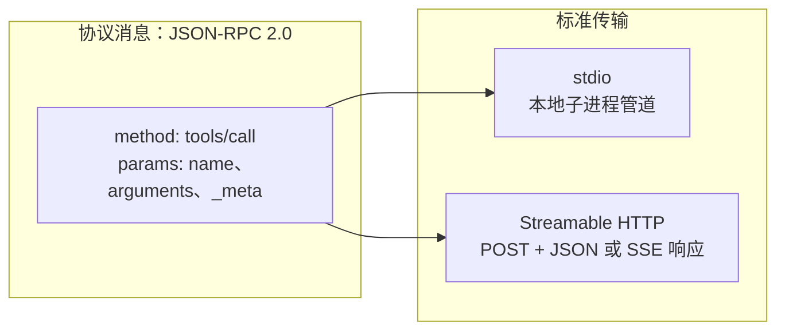
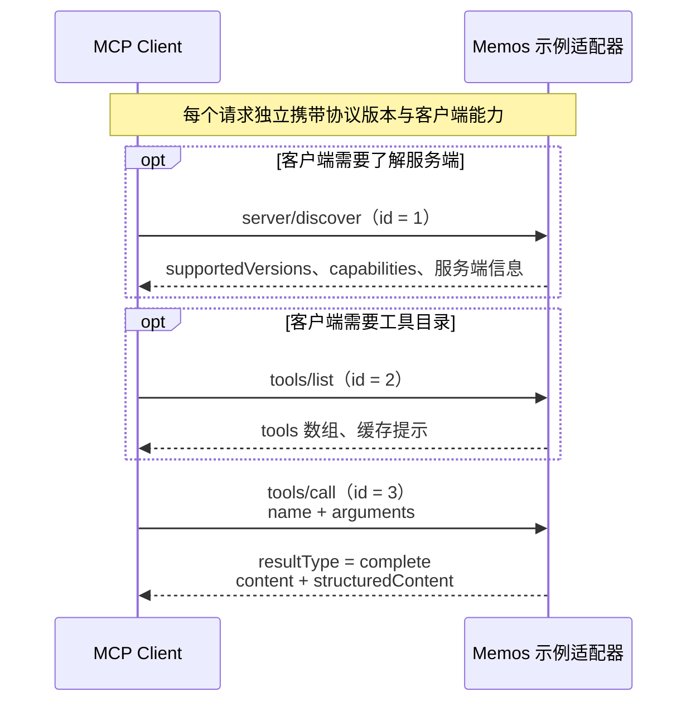
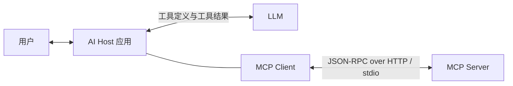
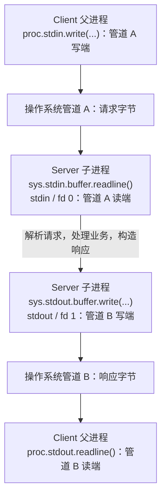
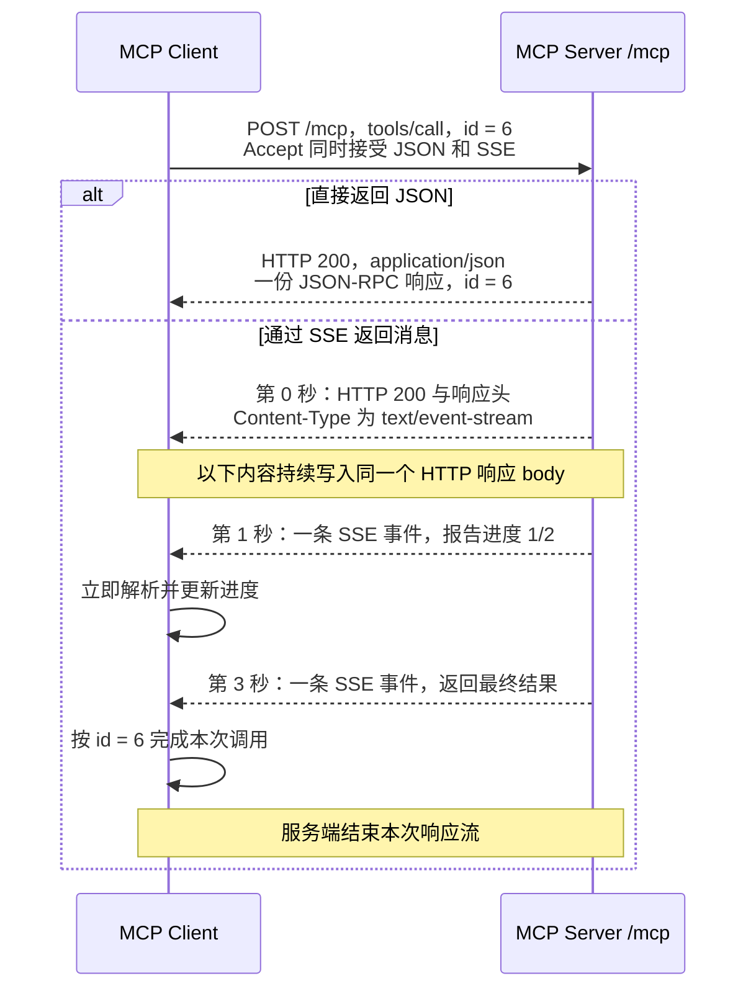

同一个业务能力可以有两个入口：面向程序的 REST API，以及供 AI 应用发现和调用工具的 MCP 接口。以 Memos 的“列出 memo”为例，两条路都能读取数据，但它们怎样描述操作、暴露参数和返回结果，存在明显差别。

本文采用官方[当前 MCP 规范 `2026-07-28`](https://modelcontextprotocol.io/specification/2026-07-28)，用 Memos 的 API 和工具定义作为业务素材，假设一个符合该规范的示例适配器暴露这些工具。**下文请求和响应均为教学示例**，服务端名为 `memos-example-adapter`，memo 数据与 token 均为虚构；工具名、description 和 schema 来自 [Memos v0.30.0 的 OpenAPI](https://github.com/usememos/memos/blob/v0.30.0/proto/gen/openapi.yaml)，节选范围会单独说明。

服务端怎样复用业务 API，可结合[上一篇 Memos 自托管实录](/life/2026/09/01/memos-docker-upgrade-api-mcp/)阅读；这里重点看当前协议的报文与交互方式，HTTP 示例省略由 HTTP 库处理的 `Content-Length` 等传输字段，以及分块长度等底层编码。

1. Table of Contents, ordered
{:toc}

## 同一个动作，两种不同的报文

先用两种方式查询最多一条非私有 memo。这里比较的是 **HTTP REST API 与 MCP**；REST 是架构风格，MCP 则规定了一套具体消息格式和交互方法。

REST 请求用 HTTP method 和资源路径表达操作，参数放在 query 中：

```http
GET /api/v1/memos?pageSize=1&filter=visibility+%21%3D+%22PRIVATE%22 HTTP/1.1
Host: memos.example.com
Authorization: Bearer example-token
```

假设没有匹配数据，响应 body 直接是业务对象：

```http
HTTP/1.1 200 OK
Content-Type: application/json

{"memos":[]}
```

MCP 使用同一端点 `/mcp`，通过 JSON-RPC 的 `method` 选择协议方法，再用 `params.name` 指定业务工具：

```http
POST /mcp HTTP/1.1
Host: memos.example.com
Content-Type: application/json
Accept: application/json, text/event-stream
Authorization: Bearer example-token
MCP-Protocol-Version: 2026-07-28
Mcp-Method: tools/call
Mcp-Name: memo_list_memos

{
  "jsonrpc": "2.0",
  "id": 0,
  "method": "tools/call",
  "params": {
    "name": "memo_list_memos",
    "arguments": {
      "pageSize": 1,
      "filter": "visibility != \"PRIVATE\""
    },
    "_meta": {
      "io.modelcontextprotocol/protocolVersion": "2026-07-28",
      "io.modelcontextprotocol/clientInfo": {
        "name": "memos-demo-client",
        "version": "1.0.0"
      },
      "io.modelcontextprotocol/clientCapabilities": {}
    }
  }
}
```

对应响应把业务对象放进 MCP 的结果结构：

```http
HTTP/1.1 200 OK
Content-Type: application/json

{
  "jsonrpc": "2.0",
  "id": 0,
  "result": {
    "resultType": "complete",
    "content": [
      {
        "type": "text",
        "text": "{\"memos\":[]}"
      }
    ],
    "structuredContent": {
      "memos": []
    },
    "_meta": {
      "io.modelcontextprotocol/serverInfo": {
        "name": "memos-example-adapter",
        "version": "1.0.0"
      }
    }
  }
}
```

两种请求的业务目标相同，表达位置不同：REST 使用 `GET /api/v1/memos`；MCP 使用 `tools/call` 加 `memo_list_memos`。响应也多了一层：`jsonrpc` 和 `id` 属于 JSON-RPC，`resultType`、`content`、`structuredContent` 属于 MCP，最里面的 `memos` 才是业务数据。

**HTTP 头也能看到 MCP 方法与工具名。** 当前规范要求 `Mcp-Method` 镜像 body 的 `method`，`tools/call` 还要求 `Mcp-Name` 镜像 `params.name`；它们帮助网关路由和观测，服务端必须检查头与 body 一致。完整参数及其结构仍以 JSON-RPC 消息为准，具体要求见[标准请求头](https://modelcontextprotocol.io/specification/2026-07-28/basic/transports/streamable-http#standard-request-headers)。

## HTTP 是 MCP 的一种传输方式

MCP 消息采用 JSON-RPC 2.0 格式，规范定义了两种标准传输：

- **stdio**：Host 启动本地 MCP Server 子进程，通过标准输入输出交换消息。
- **Streamable HTTP**：客户端向 MCP 端点发送 POST，服务端返回 JSON 或 SSE 响应流。

两种传输使用相同的协议方法和业务结构。stdio 直接写入一行 JSON；HTTP 把同一条 JSON 消息装进请求体，并添加版本、方法等传输头。



上面请求的 `params._meta` 携带了本次操作所需的协议上下文：[每请求元数据](https://modelcontextprotocol.io/specification/2026-07-28/basic#_meta)中，协议版本 `io.modelcontextprotocol/protocolVersion` 和客户端能力 `io.modelcontextprotocol/clientCapabilities` 必填；`clientInfo` 推荐携带，用于标识客户端软件。这里的 `{}` 表示客户端没有声明额外能力，不影响它调用服务端工具。

**每个请求都自包含，服务端不能依赖前一次请求来获知版本或客户端能力。** `clientInfo` 只是软件身份说明，认证仍由本例的 Bearer token 完成。两个版本号也要分开：`jsonrpc: "2.0"` 是消息格式版本，`2026-07-28` 是 MCP 协议版本；HTTP 的 `MCP-Protocol-Version` 必须与 body 中的值一致。

## 能力发现、工具目录与调用：一条完整链路

客户端可以先了解服务端，再获取工具定义，最后执行工具。下面按这个顺序展开；**两个发现步骤都按需调用，调用工具本身不依赖此前建立协议会话**。



### server/discover：查询版本与能力

[`server/discover`](https://modelcontextprotocol.io/specification/2026-07-28/server/discover) 是服务端必须实现的方法，客户端可以选择是否调用。它不创建会话，而是返回服务端支持的协议版本、能力和软件信息：

```http
POST /mcp HTTP/1.1
Host: memos.example.com
Content-Type: application/json
Accept: application/json, text/event-stream
Authorization: Bearer example-token
MCP-Protocol-Version: 2026-07-28
Mcp-Method: server/discover

{
  "jsonrpc": "2.0",
  "id": 1,
  "method": "server/discover",
  "params": {
    "_meta": {
      "io.modelcontextprotocol/protocolVersion": "2026-07-28",
      "io.modelcontextprotocol/clientInfo": {
        "name": "memos-demo-client",
        "version": "1.0.0"
      },
      "io.modelcontextprotocol/clientCapabilities": {}
    }
  }
}
```

示例适配器只声明工具能力，响应如下：

```json
{
  "jsonrpc": "2.0",
  "id": 1,
  "result": {
    "resultType": "complete",
    "supportedVersions": [
      "2026-07-28"
    ],
    "capabilities": {
      "tools": {}
    },
    "instructions": "Provides tools for querying Memos.",
    "ttlMs": 300000,
    "cacheScope": "private",
    "_meta": {
      "io.modelcontextprotocol/serverInfo": {
        "name": "memos-example-adapter",
        "version": "1.0.0"
      }
    }
  }
}
```

`capabilities.tools: {}` 已足以表示支持工具，`tools.listChanged` 只在支持工具目录变化通知时声明。客户端根据 `supportedVersions` 和能力列表选择后续操作；`result._meta` 中的软件信息用于展示、日志和调试。每个后续请求仍需携带自己的 `_meta`。

**“服务端必须实现”不等于“客户端启动后必须调用”。** 已知版本和工具定义的客户端可以直接发起操作；版本不兼容时，按协议错误处理，再选择双方支持的版本。

### tools/list：获取工具的输入输出契约

[`tools/list`](https://modelcontextprotocol.io/specification/2026-07-28/server/tools#listing-tools) 是标准方法，但工具能力本身可选。服务端也可以只提供 resources 或 prompts；声明工具能力后，必须响应工具目录请求，目录可以为空。客户端何时列目录、是否复用缓存，由实际需求决定；协议并不要求每次 `tools/call` 前都先列一次工具。

下面发起一次工具目录请求：

```http
POST /mcp HTTP/1.1
Host: memos.example.com
Content-Type: application/json
Accept: application/json, text/event-stream
Authorization: Bearer example-token
MCP-Protocol-Version: 2026-07-28
Mcp-Method: tools/list

{
  "jsonrpc": "2.0",
  "id": 2,
  "method": "tools/list",
  "params": {
    "_meta": {
      "io.modelcontextprotocol/protocolVersion": "2026-07-28",
      "io.modelcontextprotocol/clientInfo": {
        "name": "memos-demo-client",
        "version": "1.0.0"
      },
      "io.modelcontextprotocol/clientCapabilities": {}
    }
  }
}
```

### 返回结构：JSON-RPC 对象中的 tools 数组

**整个响应是对象，工具数组在 `result.tools`。** 数组每个元素描述工具叫什么、做什么、接收什么参数，还可以声明结构化输出。此时尚未执行 `memo_list_memos`，所以返回的是定义，不是 memo 数据。

Memos 原有目录包含 20 个工具。这里用两项定义构造新版目录响应：保留 `memo_list_memos` 和 `auth_get_current_user`，省略其余 18 项和后者的 `outputSchema`。前者的输出 schema 保留顶层字段及 `$defs.Memo` 中的 `name`、`state`、`content`、`visibility`，其余 memo 属性和嵌套定义省略。**工具级 description、全部输入参数及其 description 均完整保留**，来源为 [OpenAPI 定义](https://github.com/usememos/memos/blob/v0.30.0/proto/gen/openapi.yaml)和 [MCP 转换代码](https://github.com/usememos/memos/blob/v0.30.0/server/router/mcp/catalog.go)。响应中的版本相关字段与缓存值为教学示例。

```json
{
  "jsonrpc": "2.0",
  "id": 2,
  "result": {
    "resultType": "complete",
    "tools": [
      {
        "name": "memo_list_memos",
        "title": "Memo List Memos",
        "description": "ListMemos lists memos with pagination and filter.",
        "inputSchema": {
          "type": "object",
          "properties": {
            "pageSize": {
              "type": "integer",
              "format": "int32",
              "description": "Optional. The maximum number of memos to return.\n The service may return fewer than this value.\n If unspecified, at most 50 memos will be returned.\n The maximum value is 1000; values above 1000 will be coerced to 1000."
            },
            "pageToken": {
              "type": "string",
              "description": "Optional. A page token, received from a previous `ListMemos` call.\n Provide this to retrieve the subsequent page."
            },
            "state": {
              "enum": [
                "STATE_UNSPECIFIED",
                "NORMAL",
                "ARCHIVED"
              ],
              "type": "string",
              "format": "enum",
              "description": "Optional. The state of the memos to list.\n Default to `NORMAL`. Set to `ARCHIVED` to list archived memos."
            },
            "orderBy": {
              "type": "string",
              "description": "Optional. The order to sort results by.\n Default to \"create_time desc\".\n Supports comma-separated list of fields following AIP-132.\n Example: \"pinned desc, create_time desc\" or \"update_time asc\"\n Supported fields: pinned, create_time, update_time, name.\n Note: order_by uses create_time / update_time, while the filter\n expression uses created_ts / updated_ts for the same timestamps."
            },
            "filter": {
              "type": "string",
              "description": "Optional. A CEL expression to filter memos. Combine terms with && and ||.\n Available fields:\n   content (string), creator (string, e.g. \"users/1\"),\n   created_ts / updated_ts (timestamp), pinned (bool),\n   visibility (string: PRIVATE | PROTECTED | PUBLIC),\n   tags (list<string>; match with `\"work\" in tags`, not `tag == \"work\"`),\n   has_task_list / has_link / has_code / has_incomplete_tasks (bool).\n Note: the time fields here are created_ts / updated_ts, which differ from\n the create_time / update_time names used by order_by.\n Examples:\n   pinned == true && visibility == \"PUBLIC\"\n   tags.exists(t, t == \"urgent\")\n   content.contains(\"roadmap\") && created_ts > now - duration(\"168h\")"
            },
            "showDeleted": {
              "type": "boolean",
              "description": "Optional. If true, show deleted memos in the response."
            }
          },
          "additionalProperties": false
        },
        "outputSchema": {
          "type": "object",
          "properties": {
            "memos": {
              "type": "array",
              "items": {
                "$ref": "#/$defs/Memo"
              },
              "description": "The list of memos."
            },
            "nextPageToken": {
              "type": "string",
              "description": "A token that can be sent as `page_token` to retrieve the next page.\n If this field is omitted, there are no subsequent pages."
            }
          },
          "$defs": {
            "Memo": {
              "required": [
                "state",
                "content",
                "visibility"
              ],
              "type": "object",
              "properties": {
                "name": {
                  "type": "string",
                  "description": "The resource name of the memo.\n Format: memos/{memo}, where memo is the user-defined UID."
                },
                "state": {
                  "enum": [
                    "STATE_UNSPECIFIED",
                    "NORMAL",
                    "ARCHIVED"
                  ],
                  "type": "string",
                  "description": "The state of the memo.",
                  "format": "enum"
                },
                "content": {
                  "type": "string",
                  "description": "Required. The content of the memo in Markdown format."
                },
                "visibility": {
                  "enum": [
                    "VISIBILITY_UNSPECIFIED",
                    "PRIVATE",
                    "PROTECTED",
                    "PUBLIC"
                  ],
                  "type": "string",
                  "format": "enum",
                  "description": "The visibility of the memo.\n One of PRIVATE (creator only), PROTECTED (signed-in users), or\n PUBLIC (anyone). Defaults to PRIVATE on creation when unspecified."
                }
              }
            }
          }
        },
        "annotations": {
          "title": "Memo List Memos",
          "readOnlyHint": true,
          "idempotentHint": true,
          "destructiveHint": false,
          "openWorldHint": false
        },
        "_meta": {
          "method": "GET",
          "operationId": "MemoService_ListMemos",
          "path": "/api/v1/memos"
        }
      },
      {
        "name": "auth_get_current_user",
        "title": "Auth Get Current User",
        "description": "GetCurrentUser returns the authenticated user's information.\n Validates the access token and returns user details.\n Similar to OIDC's /userinfo endpoint.",
        "inputSchema": {
          "type": "object",
          "properties": {},
          "additionalProperties": false
        },
        "annotations": {
          "title": "Auth Get Current User",
          "readOnlyHint": true,
          "idempotentHint": true,
          "destructiveHint": false,
          "openWorldHint": false
        },
        "_meta": {
          "method": "GET",
          "operationId": "AuthService_GetCurrentUser",
          "path": "/api/v1/auth/me"
        }
      }
    ],
    "ttlMs": 300000,
    "cacheScope": "private",
    "_meta": {
      "io.modelcontextprotocol/serverInfo": {
        "name": "memos-example-adapter",
        "version": "1.0.0"
      }
    }
  }
}
```

`id: 2` 对应上面的请求；`resultType: "complete"` 表示已经得到完整结果。`result.tools[0].name` 是业务工具名，与协议方法 `tools/list` 属于不同层次，执行时要放进 `tools/call` 的 `params.name`。

`server/discover` 和 `tools/list` 的完整结果必须带[缓存提示](https://modelcontextprotocol.io/specification/2026-07-28/server/utilities/caching)。这里 `ttlMs: 300000` 表示建议的五分钟新鲜期，`cacheScope: "private"` 表示缓存只在同一鉴权上下文内复用；这个“private”描述缓存范围，与 memo 的可见性字段无关。

工具目录支持[分页](https://modelcontextprotocol.io/specification/2026-07-28/server/utilities/pagination)：出现 `result.nextCursor` 时，下一次 `tools/list` 可把它放入 `params.cursor`；没有该字段表示目录结束。文章省略 18 项不代表目录实际分页。目录的 `nextCursor` / `cursor` 与 memo 数据的 `nextPageToken` / `pageToken` 也是两套参数。

### description 分为工具说明和参数说明

`memo_list_memos` 顶层的 `description` 完整内容就是一句 `ListMemos lists memos with pagination and filter.`。支持哪些筛选字段、CEL 表达式怎样写，放在 **`inputSchema.properties.filter.description`** 中；分页上限、排序规则等则分别放在对应参数的 description 中。

为了直接读清这段最长的说明，下面把上面 JSON 中 `filter.description` 的 `\n` 展开为换行、`\"` 还原成双引号，内容没有删减：

```text
Optional. A CEL expression to filter memos. Combine terms with && and ||.
 Available fields:
   content (string), creator (string, e.g. "users/1"),
   created_ts / updated_ts (timestamp), pinned (bool),
   visibility (string: PRIVATE | PROTECTED | PUBLIC),
   tags (list<string>; match with `"work" in tags`, not `tag == "work"`),
   has_task_list / has_link / has_code / has_incomplete_tasks (bool).
 Note: the time fields here are created_ts / updated_ts, which differ from
 the create_time / update_time names used by order_by.
 Examples:
   pinned == true && visibility == "PUBLIC"
   tags.exists(t, t == "urgent")
   content.contains("roadmap") && created_ts > now - duration("168h")
```

这段说明列出了字段、类型和三个完整表达式示例，还特意区分了同一时间戳的两套命名：**`filter` 使用 `created_ts` / `updated_ts`，`orderBy` 使用 `create_time` / `update_time`**。因此模型拿到的不只是“这是个查询工具”，还有怎样构造有效参数的自然语言说明书。

`annotations` 则声明这个工具只读、幂等、不具有破坏性，Host 可以把这些提示作为执行策略的参考。MCP 将工具发现标准化后，Host 可以通过协议取得这些定义，再交给模型选择工具、填写参数；Memos 里的说明文字本身仍来自同一份 OpenAPI，这也说明面向人阅读的 API 文档和面向模型的工具目录可以共享描述来源。

### 返回值也有定义：outputSchema

工具定义中的 `inputSchema` 和 `outputSchema` 分别描述业务输入与结构化输出。返回值字段同样可以带 `description`，说明字段的含义；`type`、`enum`、`required` 等 JSON Schema 关键字则表达可由程序检查的约束。**字段出现在 `properties` 中，不等于它一定会返回，是否必填要看 `required`。**

响应中不同层次的结构，来自不同的约定：

| 层次 | 结构从哪里得知 |
|---|---|
| JSON-RPC 信封<br>`jsonrpc`、`id`、`result` / `error` | JSON-RPC 与 MCP 规范 |
| 协议方法的结果<br>如 `tools/list` 的 `result.tools` | MCP 为该方法定义的结果类型<br>客户端通常由 SDK 解析 |
| 具体工具的业务数据<br>如 `structuredContent.memos` | 工具定义里的 `outputSchema`<br>由服务端通过 `tools/list` 下发 |

因此，客户端不是看到一份 response 后才猜它属于哪个方法：它先用 `id` 找到对应请求，再按该方法的结果类型解析。对于 `tools/call`，还知道请求选择了哪个工具，因而可以使用这个工具的输出 schema。

上面输出 schema 中的 `$ref: "#/$defs/Memo"` 表示数组元素使用 `$defs.Memo` 的定义，其中 `required` 列出了 `state`、`content`、`visibility`；顶层没有 `required`，不能仅凭 schema 就假定 `memos` 和 `nextPageToken` 每次都存在。分页 token 的 description 还明确说明：字段省略时表示没有后续页。

以 `memo_list_memos` 为例，`outputSchema` 描述的是 `result.structuredContent` 内的业务对象：`memos` 是数组、元素有哪些字段、`nextPageToken` 是什么类型。**它不描述整个 JSON-RPC 响应，也不直接约束 `content[].text` 里的字符串。** 按 [Output Schema 规范](https://modelcontextprotocol.io/specification/2026-07-28/server/tools#output-schema)，声明输出 schema 后，服务端必须返回符合它的结构化结果，客户端应校验。

**`outputSchema` 是可选的。** 没有它时，协议外层和内容块的类型仍然明确，工具可以只返回一段供人或模型阅读的文本，也可以返回未声明 schema 的结构化数据。此时若要让程序稳定地读取业务字段，应依赖工具文档或另行约定的契约；一次响应样本不能证明所有字段永远存在，模型对内容的理解也不能代替结构校验。

### 从工具定义到 tools/call：一次完整调用

现在按定义执行“按创建时间倒序，最多取一条非私有 memo”。HTTP 请求仍使用前文的 `/mcp` 端点，`Mcp-Method: tools/call` 和 `Mcp-Name: memo_list_memos` 与正文一致，完整 JSON-RPC 请求体如下：

```json
{
  "jsonrpc": "2.0",
  "id": 3,
  "method": "tools/call",
  "params": {
    "name": "memo_list_memos",
    "arguments": {
      "pageSize": 1,
      "filter": "visibility != \"PRIVATE\"",
      "orderBy": "create_time desc"
    },
    "_meta": {
      "io.modelcontextprotocol/protocolVersion": "2026-07-28",
      "io.modelcontextprotocol/clientInfo": {
        "name": "memos-demo-client",
        "version": "1.0.0"
      },
      "io.modelcontextprotocol/clientCapabilities": {}
    }
  }
}
```

定义与调用的对应关系是：`method` 选择标准协议方法，`name` 选择具体工具，`arguments` 按 `inputSchema` 填写，`_meta` 携带协议上下文，`id` 将本次请求与响应关联起来。`visibility != "PRIVATE"` 排除私有 memo，`create_time desc` 使用排序参数规定的时间字段名。

适配器执行查询后，返回以下虚构业务结果：

```json
{
  "jsonrpc": "2.0",
  "id": 3,
  "result": {
    "resultType": "complete",
    "content": [
      {
        "type": "text",
        "text": "{\"memos\":[{\"name\":\"memos/example-public-memo\",\"state\":\"NORMAL\",\"content\":\"这是一条公开的示例 memo。\",\"visibility\":\"PUBLIC\"}]}"
      }
    ],
    "structuredContent": {
      "memos": [
        {
          "name": "memos/example-public-memo",
          "state": "NORMAL",
          "content": "这是一条公开的示例 memo。",
          "visibility": "PUBLIC"
        }
      ]
    },
    "_meta": {
      "io.modelcontextprotocol/serverInfo": {
        "name": "memos-example-adapter",
        "version": "1.0.0"
      }
    }
  }
}
```

外层 `id: 3` 对应本次调用。`result.content` 是内容块数组，这里只有一个文本块，`text` 是序列化后的业务 JSON；`result.structuredContent` 则直接放同一份业务对象，按工具声明的 `outputSchema` 校验。

**`result.tools` 是目录，`result.structuredContent.memos` 才是查询数据。** 本例没有后续数据页，所以业务对象没有 `nextPageToken`；如果返回了它，下一次调用应把它放进 `params.arguments.pageToken`。

完整链路由此连起来：`server/discover` 说明服务端能力，`tools/list` 下发工具契约，`tools/call` 执行业务。已知目录时，可以直接继续调用；每个请求都独立携带必要元数据。

## 从 Memos 看 MCP 协议的基本约定

MCP 统一的是 **AI 应用与外部服务之间的通信约定**。沿着上面的例子，可以把[基础协议](https://modelcontextprotocol.io/specification/2026-07-28/basic)概括为消息、契约和能力三层。

**第一层是消息格式。** 请求、响应与通知的区别如下：

| 消息类型 | 协议约定 |
|---|---|
| 请求，如 `tools/list` | 有 `id`、`method`<br>`params._meta` 带必需的协议字段 |
| 响应，如工具目录 | 回带请求的 `id`<br>`result` 与 `error` 二选一 |
| 通知，如进度更新 | 有 `method`，没有 `id`<br>接收方不返回 JSON-RPC 响应 |

当前规范的 `result` 还有 `resultType`：`complete` 表示请求已完成；需要客户端补充信息时，可以返回 `input_required`。本文展示的是完成型结果；后者的继续交互遵循[多轮请求约定](https://modelcontextprotocol.io/specification/2026-07-28/basic/patterns#multi-round-trip-requests)，不能把任意 `result` 都当成最终业务数据。

**第二层是输入输出契约。** MCP 定义 `tools/list` 的目录结构和 `tools/call` 的调用、结果结构；服务端再通过工具自己的 `inputSchema` / `outputSchema` 定义业务数据。因此通用客户端可以解析不同服务的目录，而不必为每个服务重新设计调用协议。

**第三层是可选能力与独立请求。** 服务端可以提供可调用操作 [tools](https://modelcontextprotocol.io/specification/2026-07-28/server/tools)、可按 URI 读取的内容 [resources](https://modelcontextprotocol.io/specification/2026-07-28/server/resources)，或提示词模板 [prompts](https://modelcontextprotocol.io/specification/2026-07-28/server/prompts)。本例把读取 memo 表达为工具，并不因此必须实现 resources。需要跨请求的业务状态时，应通过明确的业务标识传递，服务端不能把某条连接当成隐含的对话上下文。

## 协议字段和业务字段，分别由谁定义

AI Host、模型和 MCP Client 各自承担不同职责。模型可以选择工具并填写参数，Client 则负责组织与解析协议消息：



Host 决定把哪些工具说明和结果交给模型。版本字段、HTTP 头与 body 的一致性、`id` 配对、schema 校验等由客户端或服务端代码处理，不依赖模型猜测。

1. **JSON-RPC 定义消息信封**：`jsonrpc`、`id`、`method`、`params` 以及响应的 `result` / `error` 有固定含义。
2. **MCP 定义标准方法和结果类型**：例如 `tools/list` 必须返回工具目录，`tools/call` 用 `name` 和 `arguments` 表达调用，结果还要说明 `resultType`。
3. **服务端定义工具业务契约**：工具名、description、`pageSize` 等输入字段，以及 `memos` 等输出字段，来自具体业务。自定义结构一旦通过 schema 声明，就成为调用和校验的依据。

这也解释了 `method: "tools/call"` 和 `name: "memo_list_memos"` 为什么分开：前者让通用客户端知道怎样处理消息，后者让服务端知道具体执行哪项业务。

## tools/call 的结果与两种错误

`content` 是带类型的内容块，可承载文本、图像等；`structuredContent` 保留业务数据的结构，便于按 `outputSchema` 校验和读取。本例同时提供业务对象及其 JSON 文本，Host 可以分别处理，也可以将结果提供给模型。

工具调用失败时，[Tools 规范](https://modelcontextprotocol.io/specification/2026-07-28/server/tools#error-handling)区分协议错误与工具执行错误。下面只展示两种错误响应，假定请求已按前文携带所需元数据。

**协议错误**：例如指定了不存在的工具。响应使用 JSON-RPC 的 `error`：

```json
{
  "jsonrpc": "2.0",
  "id": 4,
  "error": {
    "code": -32602,
    "message": "Unknown tool: memo_unknown_tool"
  }
}
```

此时没有 `result`，也就没有 `resultType`。客户端按错误码和消息处理失败。

**工具执行错误**：工具已被识别，但业务参数校验失败，例如筛选表达式无法解析。错误作为工具结果返回：

```json
{
  "jsonrpc": "2.0",
  "id": 5,
  "result": {
    "resultType": "complete",
    "content": [
      {
        "type": "text",
        "text": "Invalid filter expression: expected a comparison after visibility."
      }
    ],
    "isError": true,
    "_meta": {
      "io.modelcontextprotocol/serverInfo": {
        "name": "memos-example-adapter",
        "version": "1.0.0"
      }
    }
  }
}
```

这里的 `resultType: "complete"` 表示这次请求已结束，**不等于业务执行成功**；`isError: true` 才是工具失败标记。错误内容可以帮助模型修正参数，但并不保证一定能够自动恢复。

HTTP 层仍有自己的错误语义，例如认证失败、请求头与 body 不一致。不能仅凭 HTTP `200` 判断工具成功，也不能把所有 MCP 错误都概括成 HTTP 状态码。

## 两种接口如何配合

将本例的差别放在一起：

| 维度 | HTTP REST API | MCP |
|---|---|---|
| 操作表达 | method + 资源路径 | JSON-RPC method + 工具名 |
| 输入输出描述 | API 文档、OpenAPI 等 | 协议结果类型 + 工具 schema |
| 能力发现 | 由 API 自行设计 | `server/discover`、`tools/list` |
| 传输方式 | 本例使用 HTTP | stdio 或 Streamable HTTP |
| 请求上下文 | 按 API 契约携带 | 每请求携带版本与客户端能力 |
| 结果处理 | 业务响应体与状态码 | 内容块、结构化结果及错误标记 |

MCP 与 REST 可以共用一套业务实现。工具定义中的 `_meta.method` 和 `_meta.path` 来自 Memos 转换器，用来记录其背后的 `GET /api/v1/memos` 映射；这是工具的实现元数据，与请求 `params._meta` 里的 MCP 版本字段不同。适配器可以把工具调用交给同一套路由、鉴权和业务代码，协议包装无需复制业务数据。

因此，脚本已明确知道 API 契约时可以直接访问 REST；需要 AI 应用动态发现工具、依据说明构造参数并处理结果时，可以接入 MCP。两种入口的选择取决于调用方需要的接口形式。

## 拓展：stdio 怎样通信，HTTP 怎样支持流式消息

同一份 MCP 消息可以通过不同的传输方式送达：本地使用进程管道，远程使用 HTTP。下面继续用示例适配器的 `memo_list_memos` 演示。

### stdio：通过子进程的标准输入输出通信

**stdio 使用操作系统的进程管道。** Host 内的 MCP Client 启动本地 Server 子进程，并在启动时接好两条管道：一条把请求送进 Server，另一条把响应送回 Client。这里的 `stdin`、`stdout` 都是 **Server 子进程的标准流**，两端由程序读写，不需要用户在终端输入。

#### 启动时，怎样把两个进程接起来

以 Linux/macOS 为例，每个进程都有自己的文件描述符表。[标准输入、标准输出、标准错误](https://man7.org/linux/man-pages/man3/stdin.3.html)分别使用约定的描述符 `0`、`1`、`2`。在终端里直接运行程序时，它们通常连接到终端；启动子进程时也可以将它们重定向到管道。**标准输入输出只是约定的读写入口，实际连接到哪里，由启动方式决定。**

Python 的 [`subprocess.Popen`](https://docs.python.org/3/library/subprocess.html#subprocess.Popen) 可以完成启动和重定向。指定 `stdin=PIPE, stdout=PIPE` 后，会得到以下连接：



`proc` 是父进程中代表这个子进程的 Python 对象。它的属性按所连接的**子进程标准流**命名，所以 `proc.stdin` 在父进程这一侧是可写的，`proc.stdout` 是可读的：

| 代码所在进程 | 操作 | 字节去向 |
|---|---|---|
| Client 父进程 | `proc.stdin.write(...)` | 写入管道 A，供 Server 从自己的 `stdin` 读取 |
| Server 子进程 | `sys.stdin.buffer.readline()` | 从管道 A 读取一行请求 |
| Server 子进程 | `sys.stdout.buffer.write(...)` | 写入管道 B，供 Client 读取 |
| Client 父进程 | `proc.stdout.readline()` | 从管道 B 读取一行响应 |

因此，Client 写 `proc.stdin` 不会修改它自己的 `sys.stdin`；Server 写 `sys.stdout` 时，内容也会进入已接好的管道，而不是直接显示在屏幕上。两边无需监听端口或通过文件路径找到对方，启动时建立的管道已经把它们连接起来。

#### 管道传的是字节，MCP 用换行划分消息

[操作系统管道](https://man7.org/linux/man-pages/man7/pipe.7.html)提供的是**字节流，没有 JSON 消息边界**。一次写入的字节可能分几次读到，连续写入的几条消息也可能一起到达；不能把底层的一次 `read` 当成一条完整请求。

[MCP stdio 规范](https://modelcontextprotocol.io/specification/2026-07-28/basic/transports/stdio)在这条字节流上约定：**UTF-8 编码，一行一条完整 JSON-RPC 消息，末尾追加换行符。** 发送方先把对象序列化为单行 JSON，再编码、追加真实的 LF 字节 `0x0A`；接收方累积到换行符后，才解码并解析 JSON。

JSON 字符串内的换行会由序列化器转义为 `\n`，它是反斜杠和字母 `n`，不会提前结束这条消息。协议报文不能用 `indent=2` 美化成多行；排版用的真实换行会被接收端当成消息分隔符。

#### 两个 Python 文件，跑通一次请求和响应

下面只演示一次 `tools/call` 的管道往返：Server 固定返回示例数据 `{"memos":[]}`，不连接 Memos。这是传输机制的最小演示，尚未实现完整 MCP Server 所需的发现、参数校验等逻辑。

先保存子进程程序为 `memo_stdio_demo.py`：

```python
import json
import sys

# 逐行读取自己的标准输入；本例中，它已经连接到父进程的管道。
# 暂时没有完整一行时会等待，读到 EOF 后循环结束。
for line in sys.stdin.buffer:
    request = json.loads(line.decode("utf-8"))

    # 演示程序只处理约定的这一个工具，不访问真实 Memos。
    if (request["method"] != "tools/call"
            or request["params"]["name"] != "memo_list_memos"):
        raise ValueError("This demo only handles memo_list_memos")

    # 日志写入 stderr，不能污染 stdout 中的协议消息。
    print("server: received tools/call", file=sys.stderr, flush=True)
    data = {"memos": []}
    response = {
        "jsonrpc": "2.0",
        "id": request["id"],
        "result": {
            "resultType": "complete",
            "content": [{"type": "text", "text": json.dumps(data)}],
            "structuredContent": data,
            "_meta": {
                "io.modelcontextprotocol/serverInfo": {
                    "name": "memos-example-adapter",
                    "version": "1.0.0",
                },
            },
        },
    }

    # 先得到一整行 UTF-8 字节；末尾 b"\n" 才是真实的消息分隔符。
    payload = json.dumps(response, ensure_ascii=False, separators=(",", ":"))
    sys.stdout.buffer.write(payload.encode("utf-8") + b"\n")
    # 把 Python 缓冲区里的数据提交给底层管道，让父进程及时读到。
    sys.stdout.buffer.flush()
```

再在同一目录保存父进程程序为 `client.py`：

```python
import json
from pathlib import Path
import subprocess
import sys

request = {
    "jsonrpc": "2.0",
    "id": 6,
    "method": "tools/call",
    "params": {
        "name": "memo_list_memos",
        "arguments": {"pageSize": 1, "filter": 'visibility != "PRIVATE"'},
        "_meta": {
            "io.modelcontextprotocol/protocolVersion": "2026-07-28",
            "io.modelcontextprotocol/clientCapabilities": {},
            "io.modelcontextprotocol/clientInfo": {
                "name": "memos-demo-client",
                "version": "1.0.0",
            },
        },
    },
}

# 以当前 Python 解释器启动子进程，两个 PIPE 建立双向通信所需的两条管道。
# 默认使用二进制模式，由代码明确处理 UTF-8 和 LF。
server = Path(__file__).with_name("memo_stdio_demo.py")
proc = subprocess.Popen(
    [sys.executable, str(server)],
    stdin=subprocess.PIPE,
    stdout=subprocess.PIPE,
    # 继承父进程的 stderr；在终端运行本例时，Server 日志直接显示在终端。
    stderr=None,
)

try:
    payload = json.dumps(request, ensure_ascii=False, separators=(",", ":"))
    proc.stdin.write(payload.encode("utf-8") + b"\n")
    proc.stdin.flush()

    # 从子进程 stdout 所连接的管道读一行，而不是读取终端输入。
    line = proc.stdout.readline()
    if not line:
        raise RuntimeError("Server closed stdout before sending a response")
    if not line.endswith(b"\n"):
        raise RuntimeError("Server closed stdout with an incomplete message")
    response = json.loads(line.decode("utf-8"))
    if response.get("id") != request["id"]:
        raise RuntimeError("Unexpected response id")

    # Client 自己的 stdout 没有重定向到 Server，可以用来展示结果。
    print(json.dumps(response["result"]["structuredContent"]))
finally:
    # 本例不再发请求，关闭写端，让子进程读到 EOF 并结束循环。
    proc.stdin.close()
    try:
        proc.wait(timeout=5)
    except subprocess.TimeoutExpired:
        proc.kill()
        proc.wait()
    proc.stdout.close()
```

只需要启动 Client；Server 会由它自动启动：

```bash
python3 client.py
```

终端可看到两行内容。第一行来自 Server 的 `stderr`；第二行是 Client 解析协议响应后，写到自己 `stdout` 的业务结果：

```text
server: received tools/call
{"memos": []}
```

这里没有 HTTP 请求头；协议版本和客户端能力仍在请求的 `params._meta` 中。代码虽然把 Python 字典排成多行，实际通过管道发送的 `payload` 始终是一行 JSON。

这次往返还包含几个需要区分的动作：

- **`write` 写入，`flush` 刷新缓冲，`readline` 等待一行。** `flush()` 把语言运行时缓冲区里的字节提交给底层管道，不代表 Server 已经处理完成。忘记换行或刷新，双方就可能一直等待。
- **[`readline()`](https://docs.python.org/3/library/io.html#io.IOBase.readline) 等换行或 EOF，`read()` 不带长度会一直等到 EOF。** 常驻 Server 通常不会在一条响应后关闭输出，所以这里不能用 `read()` 读取单条响应。返回 `b""` 表示输出流已结束，不是工具返回了空结果。
- **结束通信时才关闭 `stdin`。** 本例只有一个管道写端，关闭后，子进程读完剩余数据就会读到 EOF 并退出。实际 Client 可以保持同一子进程运行，多次执行发送和接收。
- **协议输出与日志分别消费。** 本例让 `stderr` 继承终端；如果 Host 改用 `stderr=PIPE` 收集日志，也要持续读取，避免日志填满管道后阻塞 Server。不能用 `stderr=STDOUT` 把日志合并进协议流。

示例串行发送一条请求，且 Server 不发送通知，所以读一行就能拿到这次响应。实际 MCP Client 需要持续读取 `stdout`，按 `id` 分发响应，另外处理进度和订阅通知；“下一行”未必对应刚发出的请求。示例中的 `readline()` 是阻塞读取，末尾的 `wait(timeout=5)` 只限制等待子进程退出的时间；请求超时、并发读写和异常清理由实际客户端或 SDK 负责。

### Streamable HTTP：由 HTTP 响应选择 JSON 或 SSE

Streamable HTTP 通过 HTTP 传输 MCP 消息：Client 向同一个 `/mcp` 端点发送 POST，Server 为这次请求选择返回一份 JSON，或者在响应体里陆续发送 SSE 事件。**流式发送的是同一个 HTTP 响应的 body：响应头先发出，body 随业务处理逐步写入，最后结束本次响应。** 两种响应方式都属于 [Streamable HTTP](https://modelcontextprotocol.io/specification/2026-07-28/basic/transports/streamable-http)，无需 `Upgrade` 请求头或 `101 Switching Protocols`。

#### SSE 与 text/event-stream：事件机制和媒体类型

**SSE 全称是 Server-Sent Events，通常译为“服务器发送事件”。** 它让服务器通过 HTTP 响应持续向客户端发送事件；`text/event-stream` 是这类事件流使用的媒体类型（MIME type）。响应头中的 `Content-Type: text/event-stream` 告诉客户端，接下来的 body 要按 SSE 格式解析。

一条 SSE 事件可以写成下面这样，末尾有一个空行：

```text
event: message
data: 第一条消息

```

按 [SSE 格式](https://html.spec.whatwg.org/multipage/server-sent-events.html#parsing-an-event-stream)，`event:` 指定事件类型，`data:` 提供事件数据，空行结束一条事件。SSE 的数据是 UTF-8 文本，可以承载普通字符串；MCP 使用它时，把完整的 JSON-RPC 消息放进事件数据中。**SSE 负责划分和传送事件，MCP 负责定义事件数据里的方法、参数和结果。**



#### 请求：声明接受 JSON 或 SSE

下面让示例适配器先报告一次进度，再返回空列表。时间仅用于说明发送顺序，不代表实际查询耗时。Client 发送一次普通 POST，请求 body 是一条完整的 `tools/call` 消息：

```http
POST /mcp HTTP/1.1
Host: memos.example.com
Authorization: Bearer example-token
Content-Type: application/json
Accept: application/json, text/event-stream
MCP-Protocol-Version: 2026-07-28
Mcp-Method: tools/call
Mcp-Name: memo_list_memos

{
  "jsonrpc": "2.0",
  "id": 6,
  "method": "tools/call",
  "params": {
    "name": "memo_list_memos",
    "arguments": {
      "pageSize": 1,
      "filter": "visibility != \"PRIVATE\""
    },
    "_meta": {
      "io.modelcontextprotocol/protocolVersion": "2026-07-28",
      "io.modelcontextprotocol/clientCapabilities": {},
      "io.modelcontextprotocol/clientInfo": {
        "name": "memos-demo-client",
        "version": "1.0.0"
      },
      "progressToken": "list-demo-6"
    }
  }
}
```

`Accept` 同时声明接受 JSON 和 SSE，客户端需要支持两种响应；本例中 Server 选择 SSE。[HTTP 请求头](https://modelcontextprotocol.io/specification/2026-07-28/basic/transports/streamable-http#request-metadata)中的版本、方法和工具名必须与 body 对应字段一致。

`params._meta.progressToken` 表示客户端愿意接收这次调用的进度，并给出关联标识。它由 Client 选择，在进行中的请求之间保持唯一；服务端可以报告进度，也可以直接给出最终结果。这些规则由 [MCP 进度协议](https://modelcontextprotocol.io/specification/2026-07-28/basic/patterns/progress)定义。

#### 响应：先看每次分别写出什么

服务端可以在完成业务之前发送响应头，再在不同时间写入事件。下面逐次展示应用层写出的内容；HTTP/1.1 的 chunk 长度等底层分帧编码仍然省略。

**第 0 秒，发送响应状态行和响应头。** 头部末尾的空行表示后面开始响应 body，此时整个响应还没有结束：

```http
HTTP/1.1 200 OK
Content-Type: text/event-stream
Cache-Control: no-cache
X-Accel-Buffering: no

```

**第 1 秒，向这个 body 写入第一条 SSE 事件，并刷新输出缓冲。** 事件报告当前进度为 `1/2`：

```text
event: message
data: {"jsonrpc":"2.0","method":"notifications/progress","params":{"progressToken":"list-demo-6","progress":1,"total":2}}

```

`data:` 行后面的空行也属于发送内容，它标记这条 SSE 事件结束。客户端此时就能解析并处理这条进度通知；服务端继续执行剩余业务。

**第 3 秒，继续向同一个 body 写入第二条 SSE 事件。** 这次是 `id: 6` 对应的最终调用结果，同样以空行结束：

```text
event: message
data: {"jsonrpc":"2.0","id":6,"result":{"resultType":"complete","content":[{"type":"text","text":"{\"memos\":[]}"}],"structuredContent":{"memos":[]},"_meta":{"io.modelcontextprotocol/serverInfo":{"name":"memos-example-adapter","version":"1.0.0"}}}}

```

发送完最终结果后，服务端结束本次响应流。这里的“结束”针对这次 HTTP 响应；底层连接仍可能供后续请求复用。

#### 完整响应：一个 body 中的两条事件

将上面各次写出的内容按发送顺序连起来，完整响应如下。这个视图用于展示报文结构，实际发送仍发生在不同时间：

```http
HTTP/1.1 200 OK
Content-Type: text/event-stream
Cache-Control: no-cache
X-Accel-Buffering: no

event: message
data: {"jsonrpc":"2.0","method":"notifications/progress","params":{"progressToken":"list-demo-6","progress":1,"total":2}}

event: message
data: {"jsonrpc":"2.0","id":6,"result":{"resultType":"complete","content":[{"type":"text","text":"{\"memos\":[]}"}],"structuredContent":{"memos":[]},"_meta":{"io.modelcontextprotocol/serverInfo":{"name":"memos-example-adapter","version":"1.0.0"}}}}

```

**整段只有一个 HTTP 响应：状态行和响应头出现一次，body 中包含两条 SSE 事件。** “连起来”指的是同一响应的各段字节按顺序组成完整内容。客户端可以在响应尚未结束时处理已经完整到达的事件。

#### 客户端：逐条还原 JSON-RPC 消息

客户端根据响应的 `Content-Type` 选择解析方式。对于 `text/event-stream`，它持续读取 body，先按 SSE 规则识别完整事件，再对每条事件的 `data` 字符串做 JSON 解析。

**第 1 秒收到完整事件后，可以得到下面这个进度通知对象：**

```json
{
  "jsonrpc": "2.0",
  "method": "notifications/progress",
  "params": {
    "progressToken": "list-demo-6",
    "progress": 1,
    "total": 2
  }
}
```

这条消息没有 JSON-RPC `id`，客户端通过 `params.progressToken` 找到对应操作，立即更新进度。

**第 3 秒收到第二条完整事件后，得到最终响应对象：**

```json
{
  "jsonrpc": "2.0",
  "id": 6,
  "result": {
    "resultType": "complete",
    "content": [
      {
        "type": "text",
        "text": "{\"memos\":[]}"
      }
    ],
    "structuredContent": {
      "memos": []
    },
    "_meta": {
      "io.modelcontextprotocol/serverInfo": {
        "name": "memos-example-adapter",
        "version": "1.0.0"
      }
    }
  }
}
```

客户端用 `id: 6` 匹配原请求，取出 `structuredContent` 中的业务结果 `{"memos":[]}`。本例流式送达的是一次进度通知和一次最终结果，memo 列表在最终结果里完整返回。

这些字段分属两个层次：

| 所属层次 | 字段或格式 | 含义 |
|---|---|---|
| SSE | `event: message` | 事件类型，本例两条事件都使用 `message` |
| SSE | `data:` 与末尾空行 | 承载事件数据，并划分事件边界 |
| MCP | `method: notifications/progress` | 表示这条 JSON-RPC 消息是一条进度通知 |
| MCP | `progressToken` | 请求中位于 `params._meta`，通知中位于 `params`，用相同标识关联两者 |
| MCP | `progress`、`total` | 当前进度和可选的总量 |
| MCP / JSON-RPC | `id: 6` | 把最终响应关联到原请求 |

**`progressToken` 是 MCP 的协议字段，SSE 不解释它的业务含义。** SSE 解析器把 `data` 作为文本交给 MCP 层，后者才识别进度或调用结果。相同的 MCP 进度通知也能通过 stdio 传输，SSE 不是它成立的前提。

#### 读取到的一块字节，不一定是一条事件

服务端的一次 `write`、HTTP 的传输分块、客户端的一次读取，以及 SSE 的事件边界，不保证一一对应。一次读取可能只拿到半条事件，也可能拿到两条完整事件和第三条的开头；客户端需要保留尚未解析完的字节或文本，等事件完整后再处理。

HTTP/1.1 可以用 [chunked 编码](https://www.rfc-editor.org/rfc/rfc9112.html#section-7.1)分批传输 body；[HTTP/2](https://www.rfc-editor.org/rfc/rfc9113.html#section-8.1)则通过 DATA 帧逐步传输，并使用 `END_STREAM` 标记流方向的结束，不使用 `Transfer-Encoding: chunked`。这些分帧由 HTTP 层处理，SSE 解析仍以事件格式和空行为依据。

例如使用 JavaScript 时，可以从 `response.body` 增量读取，再交给 SSE 解析器；`response.json()` 会完整消费 body 后尝试解析成一个 JSON 值，不适合这里的 SSE 正文。实际实现还要处理跨读取的 UTF-8 字符、不同换行形式和多行 `data:`，适合交给现成的 SSE 解析器或 MCP SDK。[Fetch 的 body API](https://fetch.spec.whatwg.org/#body-mixin)与 SSE 的事件解析各自承担一层职责。

服务端逐事件写入并及时刷新，客户端逐事件消费，中间代理也需要及时转发。示例中的 `X-Accel-Buffering: no` 用于提示支持该头部的反向代理关闭响应缓冲；代理实际配置仍需配合。只有这些环节都及时传递，客户端才能在最终结果之前看到进度。

本次操作的进度走本次 POST 的响应流；持续接收工具目录变化等消息，则使用 [`subscriptions/listen`](https://modelcontextprotocol.io/specification/2026-07-28/basic/patterns/subscriptions) 打开另一条 POST 响应流。关闭 SSE 响应流就是取消对应请求；连接意外断开时不支持从事件 ID 恢复，重试需要新的请求 ID，并自行考虑业务操作能否安全重试。

如果从普通 REST API 接入 MCP，需要增加处理 `server/discover`、`tools/list`、`tools/call` 等协议方法的适配层，再复用原有业务代码。SSE 解决的是响应如何分批送达，MCP 解决的是双方按什么方法、元数据和输入输出契约交互。

## 番外：HATEOAS 与 MCP，发现操作之后由谁决定下一步

REST 早已有一种类似 MCP 动态发现的思路：**HATEOAS（Hypermedia as the Engine of Application State，超媒体作为应用状态的引擎）**。服务端返回资源时，同时给出后续操作的链接或表单，客户端沿着这些入口继续交互。这也是 [REST 原本的超媒体约束](https://roy.gbiv.com/untangled/2008/rest-apis-must-be-hypertext-driven)，只是很多常见的 HTTP JSON API 没有实现这一部分。

它与大模型使用 MCP 的主要区别，在于**调用方怎样理解动作、选择下一步**：

| 对比点 | 传统 HATEOAS 客户端 | 大模型应用使用 MCP |
|---|---|---|
| 发现什么 | 当前资源提供的操作入口 | 工具目录、描述和参数契约 |
| 怎样理解动作 | 客户端预先理解动作语义 | 模型结合描述和 schema<br>解释工具用途 |
| 谁选择下一步 | 用户或预先编写的策略 | 模型结合用户目标提出调用，<br>Host 按策略组织执行 |

**HATEOAS 让服务端多承担可用条件的判断；大模型则能进一步借助描述来理解、选择工具，减少逐个编写业务分支。** 这里比较的是两种典型用法：MCP Client 本身负责协议通信，理解和决策来自模型或应用代码；[MCP 协议](https://modelcontextprotocol.io/specification/2026-07-28/server/tools#user-interaction-model)并不强制使用大模型。

以订单为例，查询结果可以这样提供操作入口（简化示意）：

```json
{
  "id": 123,
  "status": "pending",
  "_links": {
    "pay": { "href": "/orders/123/payment" },
    "cancel": { "href": "/orders/123/cancellation" }
  }
}
```

客户端预先知道 `pay` 表示支付、`cancel` 表示取消，也知道相应的调用方法和参数约定。收到这两个入口，就展示两个按钮；服务端认为订单不能取消时，不再返回 `cancel`，客户端就隐藏取消按钮。用户点击后，客户端按约定向返回的地址发起请求。[Spring HATEOAS 教程](https://spring.io/guides/tutorials/rest/)使用了类似的订单例子。

相当于服务端执行“当前允许哪些动作”的 `if-else`，客户端根据结果展示，减少重复判断和 URL 拼接。**实际是否执行、何时执行，仍由用户或客户端策略决定。** 客户端依然需要理解动作的含义；一个只认识支付和取消的自动程序，不会因为响应新增 `refund` 就自动学会退款。
