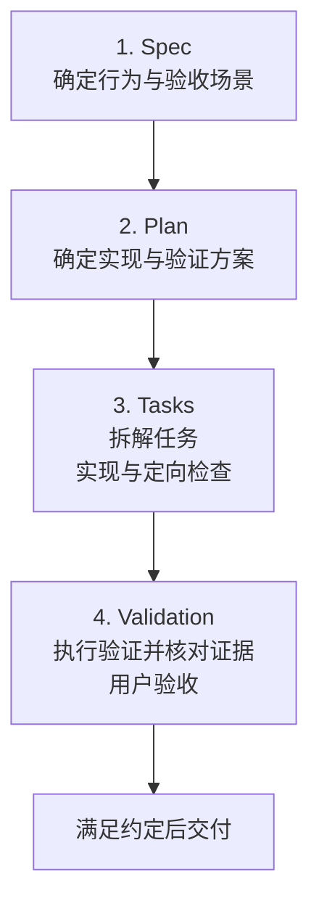
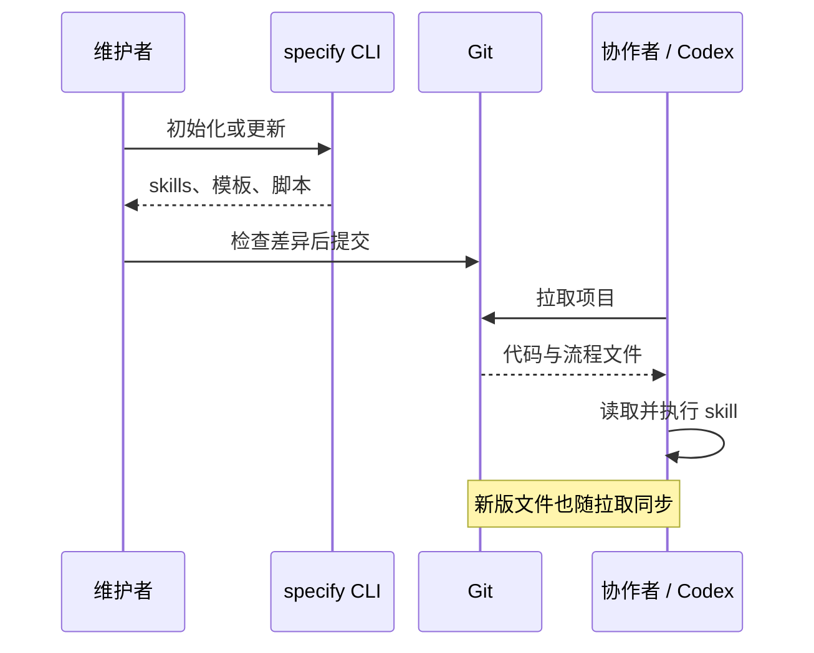
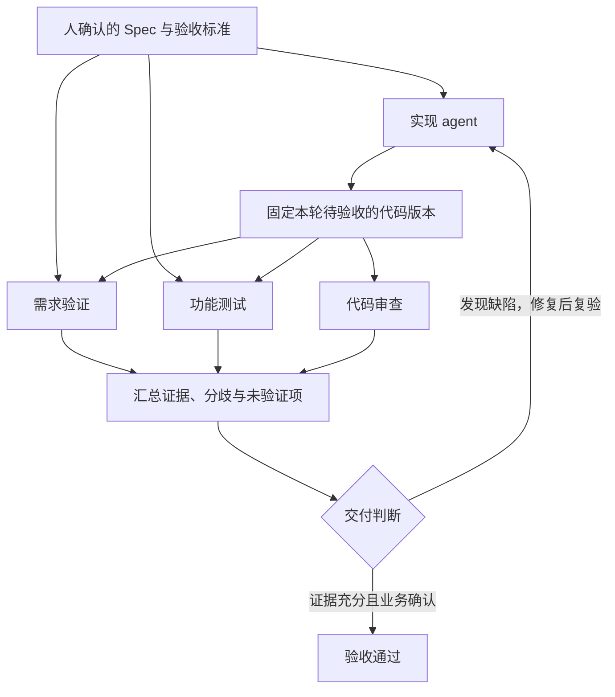

1. Table of Contents, ordered
{:toc}

把一个功能交给 coding agent，完成代码只是其中一部分工作。需求要先说清楚，实现要有依据，测试要证明用户关心的行为，验收中出现的新决定也要回到同一套记录里。

**Spec 驱动开发，就是用明确的规格连接这些工作。** Spec 是 specification 的简称，描述系统应该表现出什么行为；Spec Kit 提供相应的指令、模板和脚本，帮助 agent 从规格继续推进到方案、任务和实现。

本文先介绍 **Spec → Plan → Tasks → Validation** 的完整主线，再用一个共享相册功能从头走到验收，接着演示需求改变后怎样修订和复验。安装、团队共享与独立 reviewer 放在后面，作为执行这条主线的配套方法。

流程经验来自一次完整的 Spec Kit 与 Codex 协作实践，业务统一改写为虚构的“共享相册访问申请”。名称、接口、数据和文档片段均为教学材料，不对应实际系统；示例中的验证步骤与记录也不代表这套虚构应用已经运行。工具机制依据 **2026 年 9 月 9 日查阅的官方文档及源码**；多人协作的编号与时间戳配置于 **2026 年 9 月 21 日按官方 v1.0.8 源码**补充核对。

## 先看完整流程：四个阶段分别交付什么

四个阶段依次回答四个问题：**要做成什么、准备怎么做、具体怎样推进、怎样证明做对了。** 每一步都消费上一步的产物，并给下一步留下可继续工作的依据。

| 阶段 | 这一阶段做什么 | 交给下一步的产物 |
|---|---|---|
| **Spec：功能规格** | 明确目标、角色、范围，<br>写出可观察的验收场景 | `spec.md`：<br>确认后的产品行为 |
| **Plan：技术方案** | 对照现有代码决定接口、<br>数据、权限和验证方案 | `plan.md`：<br>设计与技术约束 |
| **Tasks：拆解并推进实现** | 按依赖拆成任务，<br>执行任务并做定向检查 | `tasks.md`、代码、<br>测试与任务状态 |
| **Validation：验证与验收** | 按 Spec 检查运行结果，<br>记录证据并确认是否接受 | 验证记录、未完成项、<br>最终验收结论 |



这里把任务拆解与按任务实现放在第三步一起讲。**`tasks.md` 是工作清单，真正写代码还需要执行实现阶段。** Validation 则是本文对测试、证据核对和用户验收的统称，不是一个名叫 `$speckit-validation` 的官方 skill，也不意味着 Spec Kit 会自动生成一套完整的端到端测试。[Spec Kit 阶段说明](https://github.github.com/spec-kit/reference/agentic-sdd.html)

验证方法也不是到第四步才开始考虑：Spec 写预期，Plan 设计验证方法，Tasks 安排检查任务，Validation 实际执行并给出结论。这样就能避免代码写完之后，才发现没人确定“通过”究竟是什么意思。

## 用共享相册完整走一遍

假设一个已有的相册应用需要增加访问申请：没有权限的用户可以提交理由，相册管理员可以同意或拒绝。下面先完成这个功能的初始版本，整个过程中沿用同一组验收编号。

### 第一步 Spec：先确认用户应该看到什么

**输入是一句需求，输出是双方确认的行为约定。** 这一阶段要解决影响产品结果的歧义，例如重复申请怎么处理、被拒绝后能否再次申请、哪些管理员有权操作。

在本例中，业务方确认了四个决定：重复提交返回已有申请；拒绝后可以立即重新申请；只有对应相册的管理员可以处理；本期不做通知和批量处理。它们随后写入 `spec.md`，而不是只保留在聊天里：

```markdown
### User Story 1：提交访问申请

作为没有相册访问权限的用户，我希望提交申请并看到处理状态。

- AC-001：无权限且没有待处理申请时，提交理由后创建一条待处理申请。
- AC-002：已有待处理申请时再次提交，返回同一申请，不新增记录。
- AC-003：已有访问权限时，页面可以直接访问；申请接口不创建新记录。

### User Story 2：处理访问申请

作为相册管理员，我希望决定是否授予申请人访问权限。

- AC-004：对应管理员同意申请后，申请人可以访问相册。
- AC-005：无关用户调用处理接口被拒绝，申请状态和访问权限不变。
- AC-006：申请被拒绝后允许重新提交；旧记录保留，新记录处于待处理状态。

### 本期范围之外

- 消息通知、批量处理、跨组织审批。
```

`AC` 是 acceptance criteria，即验收标准。本文用 AC-001～006 标识场景，后面的任务和测试继续引用它们。Spec 还可以包含背景、用户故事和范围说明，但关键规则不能埋在大段描述里。

这一阶段可以这样交代给 Codex：

> 使用 `$speckit-specify` 整理共享相册的访问申请需求，把上述规则写成可观察的验收场景。本期不做通知和批量处理。先完成规格供我检查；已有明确决定直接沿用，有影响结果的歧义再澄清。

**检查 Spec 时，主要验收产品语义。** 例如 AC-002 是否应该返回原记录，而不是报错；AC-006 是否确实允许立即重试。确认之后，Plan 才有稳定的设计依据。

### 第二步 Plan：把已确认的行为变成实现方案

**输入是 Spec 与现有系统，输出是能够指导实施的技术设计。** 这一阶段开始读相关代码，确定复用哪些能力、修改哪些地方，以及如何验证。

例如，AC-002 只说“重复提交不新增记录”。Plan 必须继续回答：两次请求同时到达时，数据库怎样保证这个约定。只在页面上禁用按钮，并不能覆盖网络重试或直接调用接口。

| 设计点 | 示例中的实现决定 | 对应验收 |
|---|---|---|
| 请求入口 | 提交接口见下方；<br>用户身份从登录态读取 | AC-001～003 |
| 并发处理 | 数据库约束保证同一用户与相册<br>只有一条待处理记录；<br>并发冲突时查询并返回已有记录 | AC-002 |
| 管理员处理 | 复用现有相册权限校验；<br>同意申请与授予权限<br>在同一事务完成 | AC-004～005 |
| 重新申请 | 唯一约束只覆盖待处理状态，<br>拒绝记录不阻止新申请 | AC-006 |
| 数据库变更 | 新 SQL 放入现有版本化迁移目录，<br>由项目已有迁移执行器应用 | AC-001～006<br>的运行前提 |

提交接口可以约定为 `POST /albums/{album_id}/access-requests`。接口契约还应给出前端真正需要的字段，例如重复提交的响应：

```json
{
  "request_id": "request-demo-01",
  "status": "pending",
  "reused": true
}
```

`request_id` 是已有申请的标识，`reused` 表示本次没有创建新申请。这是示例选择的一种契约；采用其他字段也可以，关键是前后端对重复提交的语义一致。

数据模型也需要交代清楚：申请记录保存相册、申请人、理由、状态、创建时间和处理时间；同意申请还会修改访问权限。字段的含义、状态变化和事务边界应在设计中说明，不能只列出表名。

验证方案此时也应确定：状态判断用定向测试覆盖；并发重复提交检查实际数据库记录；申请到权限生效用本地浏览器贯通前后端验证。

这一阶段可以这样交代给 Codex：

> Spec 已确认。请使用 `$speckit-plan`，先检查现有权限、数据库迁移和本地启动方式，再设计接口、数据模型和验证方案。复用项目现有机制，说明需要修改的范围，先把技术方案交给我检查。

**检查 Plan 时，主要验收方案能否兑现 Spec，以及是否符合项目约束。** 例如，拒绝后允许重新申请，那么唯一约束只能限制待处理记录，不能限制同一用户与相册永远只能有一条记录。

### 第三步 Tasks：拆成可以完成的小任务，再执行

**输入是已确认的 Spec 和 Plan，输出是有依赖关系的任务，以及执行这些任务得到的代码。** 任务应当能指出修改位置、对应场景和完成条件，不能只写“完成前端”“完成后端”。

先用 `$speckit-tasks` 生成工作清单。下面是省略具体文件路径后的片段：

```markdown
- [ ] T001 新增申请表迁移及待处理申请唯一约束。
- [ ] T002 实现提交与重复返回；验证 AC-001、AC-002、AC-003。
- [ ] T003 实现管理员处理与重新申请；验证 AC-004、AC-005、AC-006。
- [ ] T004 接入申请表单、待处理状态和管理员操作页面。
- [ ] T005 运行浏览器与数据库联合验收，逐项记录 AC-001～006 的证据。
```

T002、T003 依赖迁移与接口约定，T005 依赖前后端可以运行。实施前，再用 `$speckit-analyze` 核对规格、方案和任务是否一致。例如，若任务只安排了首次申请，却没有实现拒绝后重新申请，就应在这里补齐 AC-006 的工作。

任务确认后，才由 `$speckit-implement` 按清单修改代码：先实现一个局部功能，运行与风险匹配的定向检查，确认通过后再继续依赖它的工作。复杂链路接通后，再进入整体的端到端验证。

这一阶段可以这样交代给 Codex：

> 根据已确认的 Plan 生成 Tasks，并检查与 Spec 的一致性。解决遗漏后按任务实施。每个局部功能完成后先执行定向检查；前后端接通后执行约定的端到端验收。同步任务状态，检查失败时先定位修复，不把“代码已写”标成“已验收”。

**完成任务拆解不等于完成开发，任务打勾也不能替代运行证据。** 在这套约定下，涉及验证的任务只有实际执行通过后才能勾选；缺少环境或尚未执行时，应保留未完成状态并说明原因。

### 第四步 Validation：拿运行结果逐条核对 Spec

**输入是当前实现和最初确认的验收场景，输出是通过、失败或未验证的证据与结论。** 简单逻辑可以通过模块测试验证；申请、管理员处理、权限生效这样的链路，需要在已授权的本地环境实际跑通。

共享相册示例可以准备一个空测试相册，以及普通申请人、对应管理员、无关用户三个测试账号。这些都是合成数据。使用项目已有启动入口运行前后端和数据库迁移，再执行以下场景：

| 验收项与操作 | 页面或接口证据 | 数据库证据 |
|---|---|---|
| AC-001<br>普通用户提交申请 | 展示待处理状态<br>及申请理由 | 新增一条待处理申请 |
| AC-002<br>对同一用户与相册<br>发起重复、并发请求 | 返回同一个申请 ID | 待处理记录仍只有一条 |
| AC-003<br>已有权限时访问相册，<br>再调用申请接口 | 可以访问；<br>接口告知已有权限 | 不新增申请 |
| AC-004<br>管理员同意，<br>申请人重新访问 | 申请人能够打开相册 | 申请为已同意，<br>访问权限已授予 |
| AC-005<br>无关用户调用处理接口 | 返回无权限错误 | 申请与权限均未改变 |
| AC-006<br>另一组测试数据上<br>拒绝后重新申请 | 展示新申请的<br>待处理状态 | 一条拒绝记录与<br>一条新申请并存 |

AC-002 的并发保证需要直接构造并发请求，不能用两次普通点击替代。数据库也要观察实际结果，例如在隔离的测试数据库里检查：

```sql
-- 示例标识只属于本地合成数据。
-- 完成重复请求后，这个查询应返回 1。
SELECT COUNT(*) AS pending_count
FROM access_requests
WHERE album_id = 'album-demo'
  AND applicant_id = 'user-demo'
  AND status = 'pending';
```

每项场景使用明确的初始状态，避免前一个测试已经授予权限，后一个测试还误以为用户没有权限。迁移本身也要检查首次应用、重复启动不重复应用，以及执行失败时不留下成功记录。

团队可以增加 `validation.md` 保存验证证据；这个文件名是团队选择，不是 Spec Kit 自动提供的测试结果。以下仅为记录格式示例：

```markdown
### AC-002：重复提交不产生新申请

- 版本：填写本轮前后端提交，或明确说明尚未提交的工作区差异。
- 环境：填写本地服务、数据库及测试身份。
- 前置数据：指定用户对测试相册没有权限，也没有待处理申请。
- 操作：顺序重复请求，再在重置数据后发送两个并发请求。
- 预期：响应返回同一申请 ID；数据库只有一条待处理申请。
- 实际：运行后填写响应摘要、数据库查询结果及证据位置。
- 结论：未验证；执行后按证据改为通过或失败。
```

**“代码已写”“自动验证通过”“用户验收通过”是三个不同状态。** 验收记录可以先标记自动验证通过、等待用户体验页面；用户随后提出的新要求或交互问题，按下一节的方法补回这条流程，修复复验后再确认最终接受。

回头看 AC-002，这条约定经过了四次具体化：

| 阶段 | AC-002 在这一阶段的形态 |
|---|---|
| Spec | 重复提交返回原申请，不新增记录 |
| Plan | 数据库约束保护并发，冲突后返回已有申请 |
| Tasks | 实现提交逻辑，并安排重复与并发请求检查 |
| Validation | 检查响应 ID 一致，数据库待处理记录数为 1 |

这就是一轮完整的闭环：先确定预期，再设计和实现，最后用运行事实证明同一条约定。初始版本验收通过之后，需求仍然可以继续变化。

## 需求变了，就从受影响的位置再走一遍

需求变化时，四个阶段仍然沿着同一条主线工作。先定位改变的是产品规则、技术方案还是实现缺陷，再同步受影响的下游内容。

### 规则变更：拒绝后改为等待七天

假设初始版本已经验收，随后业务决定：“被拒绝后，必须等待七天才能再次申请。”这一轮明确替换原来的立即重试规则。

先确认七天的口径：本例约定从管理员拒绝的时刻起计算 **7 × 24 小时**，恰好到达边界就允许重试。然后依次修订：

| 阶段 | 这一轮需要做的具体工作 |
|---|---|
| **Spec** | 修订 AC-006：七天内不创建新申请；<br>达到七天后允许重新申请，旧记录保留 |
| **Plan** | 复用处理时间，按服务端时钟判断；<br>接口返回下次可申请时间，页面展示等待状态 |
| **Tasks** | 追加后端时间判断、响应字段、<br>页面提示及边界验证任务，再实施 |
| **Validation** | 检查边界前、恰好到达边界、边界后；<br>复验权限与待处理申请去重仍然成立 |

具体到 AC-006 的新验证场景，可以使用可控制的测试时钟：

- 拒绝后 6 天 23 小时 59 分 59 秒：不创建新申请。
- 拒绝后恰好 7 天：允许创建一条新申请。
- 超过 7 天：仍允许申请；重复提交继续满足 AC-002。

**保留编号不代表保留原来的通过结论。** AC-006 的旧记录只能证明初始版本满足立即重试规则；规则修订后，该项应标记待复验。新证据关联新的规则与代码版本，旧证据作为历史保留。

可以直接把这轮工作交给 Codex：

> 将 AC-006 改为拒绝后等待 7 × 24 小时，恰好达到边界允许重试。先同步 Spec 和 Plan，检查 Tasks、接口与页面的影响。确认后实施，执行时间边界验证及相关回归，将新证据写入验收记录，保留旧版本结论的适用范围。

如果这是同一轮需求中的反馈，可以继续维护当前需求目录；如果团队按每次独立变更建目录，就建立关联的新目录，注明替代的规则。目录策略可以不同，当前有效规则与历史记录的区别必须明确。[文档演化指南](https://github.github.com/spec-kit/guides/evolving-specs.html)、[规格保存策略](https://github.github.com/spec-kit/concepts/spec-persistence.html)

### 交互补充：请求期间显示正在提交

假设用户还提出：“提交时按钮应显示正在提交，成功后显示待处理，失败后允许重试。”如果原 Spec 没有约定这些页面状态，就新增 **AC-007**，补充前端方案与任务，再实现并通过浏览器验证三种状态。接口和数据模型不变时，无须重写它们。

如果原 Spec 已经写清楚这些状态，而页面只是没有实现，则直接修复代码并复验。两者的区别在于：前者补充产品约定，后者兑现已有约定。

因此，处理反馈并不意味着每次都从空白重新生成全部文档。**改变哪一层，就修正那一层，并检查它影响的下游。** 已确认且不受影响的内容继续沿用。

### 验收通过后，再记录交付状态

修订完成后，逐条检查当前有效的 AC：任务有对应实现，证据适用于本轮代码，未验证项没有被写成通过，用户反馈已经完成复验。用户确认功能后，再记录最终接受状态。

功能接受、Git 提交和生产部署是不同动作。得到相应授权后，将代码、迁移、规格与验证记录一起提交，核对前后端远端版本，再按项目流程合并或发布。下一轮工作继承的是明确的规则、版本与证据。

## 这四个阶段在 Codex 中怎样调用

理解了主线，再看工具入口就容易对应了。Codex 当前集成使用 `$speckit-*` 形式调用 skill；文档中的 `/speckit.*` 是其他 agent 的调用表示法，不是应当原样输入终端的命令。[Agent 集成说明](https://github.github.com/spec-kit/reference/integrations.html)

| 本文阶段 | 常用入口 | 作用 |
|---|---|---|
| Spec | `$speckit-specify`<br>`$speckit-clarify` | 生成规格，按需澄清歧义 |
| Plan | `$speckit-plan` | 形成技术设计与验证方案 |
| Tasks | `$speckit-tasks`<br>`$speckit-analyze`<br>`$speckit-implement` | 拆解任务、检查一致性、<br>按任务实现 |
| Validation | 项目测试与验收操作；<br>需要时 `$speckit-converge` | 收集运行证据；<br>核对并追加实现缺口 |

`$speckit-constitution` 用于维护项目级原则，通常在接入时建立，再按需更新。`$speckit-checklist` 检查需求是否清晰完整；`analyze` 检查文档是否一致；`converge` 对照产物查找未实现的工作。它们都不能替代实际运行测试。收敛检查发现缺口后，追加任务、继续实现，再验证。[阶段与检查入口](https://github.github.com/spec-kit/reference/agentic-sdd.html)

这套流程称为 SDD，即 Spec-Driven Development。它也可以与 TDD 配合：SDD 确定行为约定，TDD 通过先写失败测试来推进实现。使用 Spec Kit 本身不等于强制执行严格 TDD；测试任务和完成条件仍需在项目中明确。[任务生成说明](https://github.github.com/spec-kit/reference/agentic-sdd.html#speckittasks)

## 配套：把工作流接入 Codex 项目

主线确定后，安装的作用是让 Codex 能读取并执行对应指令。CLI、skills、模板和脚本各自承担一部分工作。

阶段入口之所以能重复工作，是因为 Spec Kit 把指令、模板和辅助脚本安装到了项目里。理解这层机制，就能区分工具安装、项目接入和日常开发。

### 电脑上安装 CLI，项目里生成工作流文件

Spec Kit 对应的 Python 包叫 `specify-cli`，安装后提供终端命令 `specify`。以官方支持的 PyPI 安装方式为例：

```bash
# 用 uv 安装工具；需要 Python 3.11 或更高版本
uv tool install specify-cli

# 检查当前 CLI 版本
specify version

# 切换到需要接入的项目目录
cd /path/to/project

# 为该项目生成 Codex 集成文件
specify init --here --integration codex
```

`uv` 是工具安装器，`pipx`、`pip` 是其他安装选择，不需要全部使用。`uv tool install` 会管理独立的工具环境，业务项目不需要把 `specify-cli` 加进自己的依赖清单。[安装指南](https://github.github.com/spec-kit/installation.html)、[uv 工具环境说明](https://docs.astral.sh/uv/concepts/tools/)

初始化后的关键位置如下。这里是路径示意，具体技能数量和辅助文件会随版本、集成及扩展变化。

| 路径 | 用途 |
|---|---|
| `.agents/skills/speckit-*/SKILL.md` | Codex 各阶段的操作指令 |
| `.specify/templates/` | 文档骨架 |
| `.specify/scripts/` | 文件准备、路径定位、前置检查等脚本 |
| `.specify/memory/constitution.md` | 项目原则，<br>首次接入时从模板建立 |
| `specs/<需求目录>/` | 后续处理具体需求时产生的<br>spec、plan、tasks 等材料 |

核心初始化资源随 CLI 打包提供。初始化负责放置这些资源，**不会自动逆向整个旧项目，也不会凭空补齐历史需求**。接入已有系统时，仍需让 agent 理解相关代码与现有行为。[初始化源码](https://github.com/github/spec-kit/blob/main/src/specify_cli/commands/init.py)、[已有项目接入指南](https://github.github.com/spec-kit/guides/existing-projects.html)

### 指令、脚本和测试承担不同的约束

日常调用 `$speckit-plan` 时，Codex 读取对应 skill，再读取当前 spec、项目原则和模板，按照指令产出方案。它可能运行仓库内的脚本准备文件；真正分析需求和写代码的仍然是 coding agent。

这套机制的约束分布在不同层次：

| 载体 | 能约束什么 | 不能单独保证什么 |
|---|---|---|
| `AGENTS.md` | 项目入口规则、调用时机、<br>文档维护约定 | 所有规则都被模型<br>毫无遗漏地遵守 |
| Skill 与模板 | 阶段步骤、必须考虑的内容、<br>产物结构 | 填入内容一定正确 |
| 辅助脚本 | 文件存在、路径有效、<br>前置材料可用等机械条件 | 需求理解和业务语义正确 |
| 可执行测试与 CI | 对具体场景运行检查，<br>按结果阻止合并或交付 | 没有被覆盖的业务行为<br>也正确 |

例如，实现阶段的前置脚本可以检查 `plan.md`、`tasks.md` 是否存在，但无法只凭文件存在就判断“重复申请”的语义已经被正确实现。[前置检查脚本](https://github.com/github/spec-kit/blob/main/scripts/bash/check-prerequisites.sh)

`AGENTS.md` 可以作为团队约定的主入口，但 Spec Kit 的核心运行指令主要来自生成的 skills、模板和脚本。把一句“必须验收通过”写进任意 Markdown 文件，都不会自动变成能阻止错误代码的测试。规则需要进一步对应到检查方法和证据。

## 配套：让前后端和协作者沿用同一条主线

团队协作时，需要同时共享产品依据和工具文件，同时区分当前规则、历史证据和机器本地状态。

### 前后端分仓，保留一份业务规格

共享相册的后端和前端如果分别位于 `album-api`、`album-web` 两个仓库，可以在两边准备 Codex 的工作流入口，同时明确只有一份业务规格负责定义产品行为。下面是一种团队约定，Spec Kit 不会自动替两个仓库做同步：

| 产物 | 后端仓库 | 前端仓库 |
|---|---|---|
| Spec | 维护完整行为、边界、AC 编号 | 保留指向主规格的协作入口 |
| 接口契约 | 维护请求、响应、错误语义 | 根据同一契约接入页面 |
| Plan、Tasks | 维护迁移、接口及权限实现 | 维护页面、状态及交互实现 |
| 验证记录 | 记录服务与数据库证据 | 记录浏览器证据，沿用同一 AC 编号 |

例如，两边都使用 `specs/014-album-access/`，前端入口注明主规格位于后端的同名目录。修改 AC-007 时，不另写一份含义相近但措辞不同的业务规则；只同步受影响的前端计划、任务和证据。

开始实施前，还应先处理两个仓库的工作区状态、同步各自远端，再切出开发分支。交付时同时记录前后端提交版本，确保复验对应的是同一轮实现。需求目录负责保存讨论依据，Git 分支和提交负责标识代码版本，两者各自承担清楚的职责。

### 多人并行，用时间戳减少编号碰撞

多人从同一个基线开始新需求时，默认递增编号可能重复。例如，仓库当前只有 `001`，两个人分别开始登录和导出功能，都可能选到 `002`，合并后出现以下两个目录：

```text
specs/002-user-login/spec.md
specs/002-export-report/spec.md
```

**编号重复不等于 Git 合并冲突。** Git 按完整路径区分文件，这两个目录可以并存；对应的完整分支名也不同。如果两个人新增的是同一个完整路径，且内容不同，才可能产生文件冲突。业务代码修改重叠则是另一类冲突，换编号无法解决。

在 v1.0.8 中，Spec 目录名与 Git 分支名已经独立管理：后续步骤通过 `SPECIFY_FEATURE_DIRECTORY` 或本地 `.specify/feature.json` 中记录的完整路径定位当前需求，不要求二者同名。因此，递增前缀可以帮助排序和沟通，但不应被当作全项目唯一任务 ID，也不代表合并顺序。[官方 Spec 创建流程](https://github.com/github/spec-kit/blob/v1.0.8/templates/commands/specify.md)

默认的避让方式是检查已知编号，再取下一个值：核心流程扫描本地 `specs/` 下的目录；可选 Git 扩展创建分支时，还会尝试获取远端分支信息，结合已有分支和本地 Spec 目录计算编号。**从实现看，这种检查没有跨电脑的编号锁。** 两个人同时检查，或者对方的新工作尚未共享时，仍然可能拿到相同编号。[Git 扩展的编号实现](https://github.com/github/spec-kit/blob/v1.0.8/extensions/git/scripts/bash/create-new-feature-branch.sh)

对于经常并行开发的团队，可以采用官方支持的**时间戳加功能描述**。在 `.specify/init-options.json` 中新增或修改下面这个字段，保留其他已有字段：

```json
{
  "feature_numbering": "timestamp"
}
```

随后新建的 Spec 目录会使用 `YYYYMMDD-HHMMSS` 前缀，例如：

```text
specs/20260921-103015-user-login/
specs/20260921-103042-export-report/
```

如果项目还安装了官方 Git 扩展，希望分支也使用时间戳，则在 `.specify/extensions/git/git-config.yml` 中设置：

```yaml
branch_numbering: timestamp
```

Git 扩展有独立的分支编号配置，不能假设只改 Spec 目录配置就会一起生效。[Git 扩展配置](https://github.com/github/spec-kit/blob/v1.0.8/extensions/git/git-config.yml)

时间戳精确到秒，同一秒仍可能产生相同前缀；完整名称还包含功能描述，因此它能减少碰撞，但不提供绝对唯一性保证。团队引用需求时应使用完整目录名或关联的 Issue 链接，而不是只说“002”。这项配置影响后续创建的名称，不需要为了编号连续而重命名已有目录。

以上配置以 v1.0.8 为依据。早期初始化的项目应先检查仓库内的模板和脚本是否支持它，必要时按后文的升级流程更新集成。将命名策略写入团队接入说明，才能让其他协作者按相同约定继续工作。

### 协作者继承仓库里的基础 skills

如果维护者已经把 skills、模板、脚本、项目原则和需求文档提交到远端，其他人拉取后，使用能够识别这些文件的 agent，并具备脚本需要的运行环境，通常就能继续使用基础流程。



因此，没有安装 `specify` 的协作者，也能通过 `git pull` 获得维护者升级并提交的新版 skills。普通使用不需要每次重新初始化。[日常使用说明](https://github.github.com/spec-kit/upgrade.html#do-i-need-to-run-specify-every-time-i-open-my-project)

提交时应遵循生成的忽略规则：`.specify/` 中的共享材料可以版本化，而当前需求指针、机器本地扩展配置等状态不必共享。若协作者使用另一种 agent，还需要相应的集成入口；若项目启用 CLI 驱动的 workflow 或依赖 CLI 的扩展，则使用这些功能的人仍需要相应工具。[共享文件与本地状态](https://github.github.com/spec-kit/reference/core.html#environment-variables)

### 更新 CLI 后，再显式更新项目文件

假设一台电脑安装了 CLI 1.0.0，用它初始化项目 A，A 得到的是随该版本提供的核心文件。之后将 CLI 升到 1.1.0，新建项目 B 会使用新版资源，而 A 中已有文件仍保留原样，直到显式更新。这里的版本号只是举例；扩展和预设还可以拥有独立版本。

当前官方推荐分别更新工具和项目：

```bash
# 更新电脑上的 CLI；适用于受支持的 uv tool / pipx 安装
specify self upgrade

# 进入需要更新的项目后，检查已安装集成及文件状态
specify integration status

# 刷新该项目的 Codex 集成
specify integration upgrade codex

# 如果项目安装了扩展，再更新扩展
specify extension update
```

常规更新会识别受管理文件的本地修改：修改过的集成文件会阻止直接覆盖，未修改的共享模板和脚本可以刷新；需求目录和现有项目宪法不属于这条更新路径的替换目标。重新执行 `init --force` 是恢复或迁移时的备用方式，不应当成日常升级的首选。[升级指南](https://github.github.com/spec-kit/upgrade.html)

为了便于团队复现，可以在项目接入说明中记录 CLI 版本、集成方式和扩展清单。升级之后检查差异，也能看出新增的指令是否改变了团队原先的工作方式。

## 进阶：为 Validation 增加独立 reviewer

当功能复杂到容易出现自测盲点时，可以让独立 reviewer 按同一份 Spec 查证。它增强的是第四步的验证力度，四阶段主线不因此改变。

对于复杂功能，可以让一个 agent 实现，再由不同的验证 agent 独立检查。Spec Kit 提供共同的文档依据；多个 reviewer 的角色和通过条件，则需要团队配置。

一种可采用的分工如下。这是建议的验收设计，不是 Spec Kit 默认创建的固定团队。

| 角色 | 检查重点 | 输出证据 |
|---|---|---|
| 需求验证 agent | 对照确认后的 spec，<br>检查遗漏与偏差 | 需求编号、对应行为、<br>满足或不满足的依据 |
| 功能测试 agent | 执行正常、异常<br>和边界场景 | 环境、步骤、<br>预期结果、实际结果 |
| 代码审查 agent | 检查代码缺陷、权限问题<br>和回归风险 | 文件位置、触发条件、<br>影响范围 |



执行时，先给 reviewer 确认后的需求、代码版本和测试环境，让它独立形成判断；实现 agent 的总结可以作为线索，但不能代替验证证据。测试环境不足时，结论应是“未验证”，而不是依据阅读代码推断“通过”。验证期间也不应由多个 agent 同时修改同一份业务代码，以免检查对象不断变化。

以 AC-002 为例，只能看到“已有申请时返回旧记录”的代码分支，说明静态检查找到对应实现；实际模拟两次并发提交并检查数据库记录，才提供了并发场景的执行证据。两者应该分别报告。

多个 reviewer 之间的分歧要按证据复核。投票数量不应覆盖一个能够稳定复现的缺陷；同时，换成不同角色甚至不同模型，也不能保证消除共同盲点。

### 先在 Codex 中固定分工，再考虑工作流编排

Codex 支持启动子 agent，并等待它们返回结果。可以在需求实现后显式要求委派，也可以通过项目 `AGENTS.md` 或自定义 skill 固定调用时机。[OpenAI 官方子 agent 文档](https://learn.chatgpt.com/docs/agent-configuration/subagents)

一段可用于试行的指令是：

> 请启动独立的验证子 agent，分别负责需求符合性、功能测试和代码审查。以已确认的 spec 和当前待验收代码版本为依据，各自形成结论。验证期间不要修改业务代码；每项结论给出证据，区分通过、失败和未验证。等待所有 agent 完成后汇总问题、分歧与验证缺口，修复后安排复验，再交给我确认业务结果。

如果项目已有“默认不启用多 agent”的约定，应当把适用范围统一清楚，例如仅在明确要求的复杂需求验收中开启。初次接入可以先用一个实现 agent 加两个 reviewer，观察它们是否发现了不同类型的问题，以及验证成本是否值得。

需要进一步自动化时，可以用 Spec Kit 的自定义 workflow：用 `prompt` 调用 reviewer，`fan-out` 分发检查，`fan-in` 汇总，`shell` 执行测试，最后通过 `gate` 等待人工决定。其当前实现可以用 `max_concurrency` 控制分发并发度；默认值为 1，需要显式提高才会并发执行。这种方式会在运行时使用 `specify` CLI。[Workflow 定义](https://github.github.com/spec-kit/reference/workflows.html)、[Fan-out 实现](https://github.com/github/spec-kit/blob/main/src/specify_cli/workflows/steps/fan_out/__init__.py)

工作流能够串起检查步骤，但还需要明确怎样识别失败、哪些问题阻止交付、修复后重跑哪些检查。本站的 [Multica 多 agent 流水线实践](/ai/2026/08/20/multica-multi-agent-pipeline/)记录过独立上下文复查的实际效果；这里提出的 Spec Kit 验收分工尚需在具体项目中试行，不能把其他流程的成果当成它的实测结果。

## 补充：Spec Kit 与其他工具的关系

Spec 是一种产物，SDD 是一种方法。**Spec Kit、OpenSpec 和 Superpowers 是不同项目，并不存在“其中一个是标准，另一个是它的实现”这样的从属关系。** 它们的区别主要在于怎样组织开发过程和文档生命周期。

| 工具 | 主要定位 | 理解它的切入点 |
|---|---|---|
| [GitHub Spec Kit](https://github.github.com/spec-kit/) | 提供规格、规划、拆解、实现<br>等阶段，支持扩展与流程编排 | 用结构化产物连接各个阶段 |
| [OpenSpec](https://github.com/Fission-AI/OpenSpec/blob/main/docs/concepts.md) | 围绕现有系统规格<br>与本次变更组织工作 | `openspec/specs/` 保存当前规格；<br>`openspec/changes/` 保存变更<br>及规格差量，归档时合并 |
| [Superpowers](https://github.com/obra/superpowers) | 覆盖需求探索、规划、测试、<br>实现和审查的开发 skills 体系 | Spec 是其工程工作流中<br>的一类产物 |

因此，看到 `docs/superpowers/specs/` 只能说明存在对应工作流的设计材料，不能据此判断项目已经接入 Spec Kit。选择工具时，应当先确定团队需要怎样的开发与维护约定，再比较工具是否贴合；GitHub Star 数也不能直接当作团队采用率。

选择 Spec Kit，是选择用结构化产物组织这条开发主线；团队仍需要约定每个阶段的完成条件。
