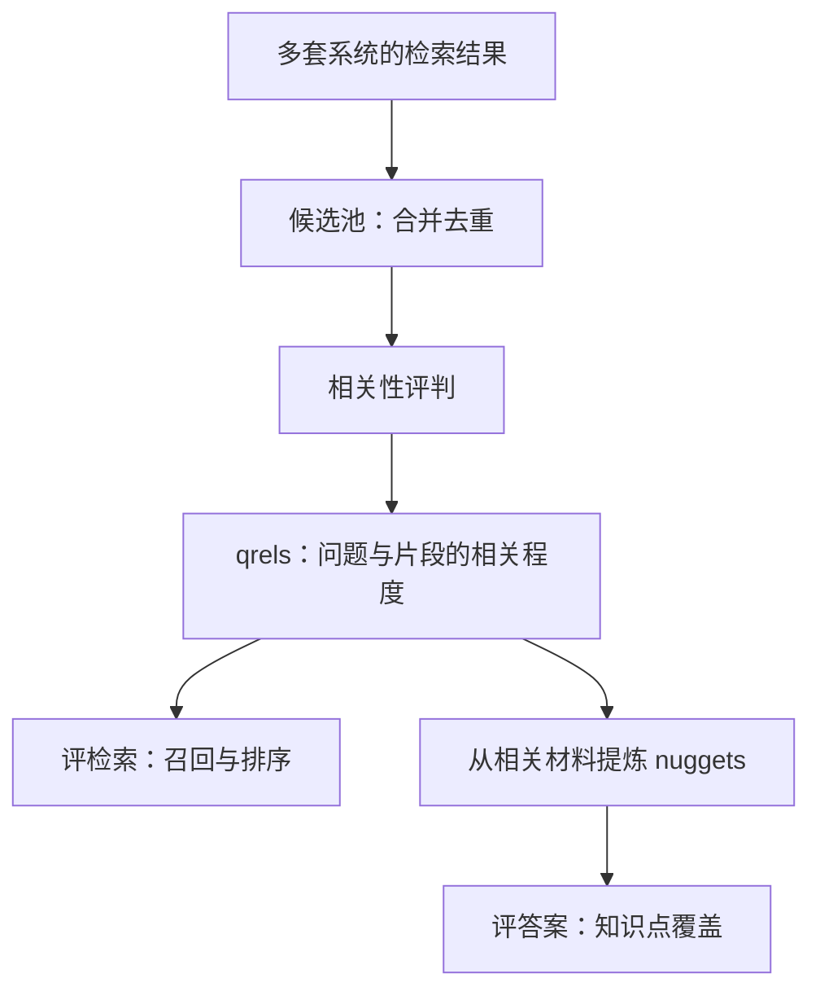

1. Table of Contents, ordered
{:toc}

假设我们正在改进一套供 AI Agent 使用的项目文档搜索。用户问：“软件项目发布前需要满足哪些条件？”在这个虚构案例中，项目约定了三项要求：代码审查通过、自动化测试通过、回滚方案就绪。

新版本返回了十个文本片段。九个讨论代码审查，一个讨论自动化测试，内容都与问题相关。Agent 据此写出了一份看似合理的回答，却遗漏了回滚方案。

这样的改动很难靠“结果看起来相关”来验收。我们需要知道，那条缺失的规则有没有进入搜索结果；如果已经进入，又有没有被写进答案。评测必须能把这两个位置区分开，才能指导下一次修改。

研究这类问题时，经常会遇到 Ragas 和 TREC。它们都涉及 RAG 评测，但服务于不同的工作：一边帮助开发者持续测量自己的应用，一边组织大家在共同条件下比较系统。理解这两个背景，才能判断各自的方法应该用到哪里。

## 同一次漏答，对应两类评测需求

RAG 通常先检索材料，再让模型根据材料生成答案。一次漏答既可能来自检索，也可能来自生成。应用开发者需要沿着这条链路定位变化；公共评测还要让不同团队对“什么算好”达成共同约定。

### 应用迭代需要分清问题发生在哪一环

在前面的例子中，可以先检查检索结果是否覆盖三个条件，再检查答案是否把它们表达完整。即使最后都得到“覆盖了两个条件”的结论，修改位置也可能完全不同。

**Ragas 提供的是执行这类评测的软件框架。** 开发者准备样本和系统输出，选择指标，反复比较检索策略、提示词或模型的效果。它也提供测试数据生成等能力，但使用它做回归，不要求额外搭建一批搜索系统。[Ragas 官方文档](https://docs.ragas.io/en/stable/)

其中，Context Recall 关注必要信息是否得到了检索上下文的支持；Faithfulness 则检查生成答案中的陈述能否由上下文支持。仍以前面的案例为例：答案只写了审查与测试两个条件，而且都有依据，Faithfulness 可以很高，但回滚要求依然缺失。**说出的内容有依据，与应该说的内容都说全，是两件需要分别测量的事。**[Context Recall](https://docs.ragas.io/en/stable/concepts/metrics/available_metrics/context_recall/)、[Faithfulness](https://docs.ragas.io/en/stable/concepts/metrics/available_metrics/faithfulness/)

这也说明，安装一个评测框架只完成了执行层面的准备。要识别漏掉的第三个条件，我们仍然需要一份标准，告诉评测程序这个条件本来就应该出现。

### 公开比较需要共同的任务与标准

当参与者变成许多研究团队，标准还必须在团队之间保持一致。各自使用不同语料、不同问题、不同标注，即使指标同名，分数也很难比较。

**TREC，即 Text REtrieval Conference，是 NIST 组织的信息检索评测活动。** RAG Track 是其中一个方向：组织方提供共同任务与语料，组织评判，参评团队按规则提交系统结果，最终形成可以比较和复用的基准。[NIST 对 TREC 的介绍](https://trec.nist.gov/about.html)

这里已经可以看出两者的适用背景。维护一套应用时，可以用 Ragas 执行日常实验；组织公共基准时，还需要解决 TREC 所面对的共同标准、标注预算与可比性问题。对私有知识库而言，后者有不少值得借鉴的设计，但整个组织流程未必需要搬过来。

要理解这些设计，先看最费力的部分：面对海量文档，标准究竟从哪里来。

## TREC：从有限标注建立可复用的基准

如果一个语料库包含一百万个 chunk，为每个问题检查所有片段，代价很快就会超过评测预算。TREC 常用的方法，是先决定哪些材料值得交给评判者阅读，再在其中建立标准。

### 用检索结果缩小待标注范围

不同参评系统通常会找到一部分相同、也有一部分不同的结果。组织方从若干提交中选取排名靠前的文档，合并去重形成候选池，再判断候选与问题的相关程度。这个过程叫 **pooling**；留下的 query—文档相关性标注叫 **qrels**。[TREC 的 pooling 与 qrels 定义](https://trec.nist.gov/howto.html)

候选池的作用是减少阅读量。它提供的是待检查的材料，相关性仍然需要人工或自动评判方法确认。

用一个成本示例就能看出差别：一百万个片段、100 个问题，逐一判断已有一亿个组合；如果每个问题再拆成三个子问题并分别调用模型，就会达到三亿次调用。若每题只评判 300 个候选，并把全部子问题放在一次判断中，这个阶段约需三万次调用。子问题增加仍会带来输入和判断成本，但调用次数不必机械地再乘一个子问题数量。

这只是说明数量级的假设，并非 TREC 的实际运行统计。它也暴露了方法的边界：**如果所有参与系统都漏掉了准备回滚方案的要求，那条要求就可能根本没有进入候选池。** 多套系统取并集可以减少共同遗漏，却无法保证穷尽。候选池偏差与新系统的评测公平性，也是 pooling 的长期研究问题。[NIST 关于 pooling 局限的研究](https://www.nist.gov/publications/bias-and-limits-pooling-large-collections)

因此，基于 qrels 的 Recall，其分母来自已建立的相关性标注。它衡量的是对这份标准的召回，不能被直接解释为对库中所有相关材料的穷尽召回。[trec_eval 的 Recall 实现](https://github.com/usnistgov/trec_eval/blob/main/m_recall.c)

### 相关文档还需要提炼成答案应包含的知识

有了相关文档，就可以评检索结果。但要评生成答案，还需要知道材料中的哪些内容应该被回答。

继续看软件发布的例子。即使找到十篇讨论代码审查的材料，也不能据此判断三个发布条件都已找全。于是，评测单位需要从文档进一步细化到有意义的信息单元。TREC 相关工作把这些单元称为 **nuggets**，可以理解为标准知识点。

这里要区分两种拆解。“发布失败时需要哪些准备”描述的是一个需要回答的方面；“发布前必须准备好回滚方案”才是一条答案应包含的知识。TREC 2025 RAG 将复杂问题拆成 sub-narratives，也就是需求方面，过程中有模型起草、整理和人工审阅；再根据材料对这些方面的回答情况评判相关性，并从相关材料提炼知识点。[TREC 2025 RAG Track 报告](https://trec.nist.gov/pubs/trec34/papers/Overview_rag.pdf)

**Nugget 不要求先有一篇完整的标准答案，再从答案里拆出来。** 相关研究以问题和相关材料为依据，比较了完全人工提炼、模型起草后人工编辑、全自动提炼等方式。人工可以增删、合并知识点，并确认哪些更重要。标准建立之后，再由人工或模型判断每份系统答案覆盖了哪些知识点。[The Great Nugget Recall](https://arxiv.org/html/2504.15068v1)

所以，人工标证据本来就可以是这类评测的一部分。寻找候选、确认标准、判断覆盖，是三个可以分别决定由谁完成的环节。

### 固定材料后，分别评检索和答案

同一批相关材料，由此支撑了两类评测：

TREC 2025 在检索侧报告 nDCG、Recall@100 等指标；答案侧使用的 Strict Vital Recall，则统计标准中重要知识点被答案完整覆盖的比例。Vital 指重要知识点，strict 表示部分覆盖不算命中。[TREC 2025 RAG Track 报告](https://trec.nist.gov/pubs/trec34/papers/Overview_rag.pdf)

假设三个条件都被标为重要知识点，答案只完整表达两个，那么 Strict Vital Recall 就是 2/3。这个分数描述**答案写全了多少**，并不能单独说明搜索找全了多少：第三个条件可能没有被召回，也可能已经召回但被生成模型忽略。答案的引用是否充分支持其陈述，还需要另外评判。

对私有知识库，最有价值的启发是把标准固定下来，分开检查检索和生成。至于标准的来源，可以根据条件选择：公共基准通过多团队提交组织候选；业务专家熟悉规则和来源时，也可以直接标注必要知识及证据。

这样，标准构建的问题就与日常计分分开了。接下来需要解决的是：给定一份标准，程序如何判断这次搜索有没有命中它？

## Ragas Context Recall：三种匹配方式

标准可以是一段参考答案、一组参考原文，也可以是一组已经确认的来源 ID。Ragas 的三种 Context Recall，正好对应这些不同的准备条件。它们的区别既包括匹配算法，也包括拿什么作为分母。

选择时需要同时看三个方面：**能否正确判断覆盖、重复运行是否稳定、漏召回之后能否定位原因。** 一个结果可以很稳定，却一直判错；也可以大体判断对了，却无法说明究竟是哪一个片段提供了支持。

### 方式一：LLM 语义判断

业务专家比较容易写出一份完整答案，却未必已经把每条规则关联到所有来源片段。这时，可以使用 LLM 版 Context Recall。

它接收问题 `user_input`、参考答案 `reference` 和本次召回的文本列表 `retrieved_contexts`。当前实现把召回文本拼接后交给评判模型，让模型识别参考答案中的陈述，并判断每条陈述是否得到这些文本支持。模型输出陈述、理由和二元标签，框架再计算命中比例。识别陈述与判断支持可以在同一次调用中完成，并不是必须先单独调用模型拆 claim。[ContextRecall 实现](https://github.com/vibrantlabsai/ragas/blob/main/src/ragas/metrics/collections/context_recall/metric.py)、[提示词与输出结构](https://github.com/vibrantlabsai/ragas/blob/main/src/ragas/metrics/collections/context_recall/util.py)

在我们的例子中，假设模型按三个条件进行判断，结果应该是：

| 参考答案中的陈述 | 本次检索内容 | 判定 |
| --- | --- | --- |
| 代码审查必须通过 | 有审查要求 | 支持 |
| 自动化测试必须通过 | 有测试要求 | 支持 |
| 回滚方案必须就绪 | 没有回滚准备要求 | 不支持 |

得分为 2/3。这里不需要读取系统生成的 `response`：即使 Agent 恰好凭模型记忆答对了第三条，也不能因此给本次检索补上一分。

**优点：能够理解改写，也有机会识别未预先标注的新来源。**

例如，原文写“发布之前应备妥可执行的回退步骤”，标准写“回滚方案必须就绪”，两者措辞不同，但可以由模型判断支持关系。判断目标是证据能否支持陈述，而非一般的语义相似度。

这也允许评判模型结合多段材料理解一条要求。若一段说明“生产发布必须遵循发布检查表”，另一段列出检查表中的回滚要求，两段之间的关系可以交给模型判断，当然仍需验证它是否理解正确。

因为不要求每个有效来源都事先列入 ID 清单，新召回的等价材料也可能被直接识别。对于来源多、表述变化大、难以穷举支持片段的知识库，这能减少建立完整来源映射的前期工作。

**缺点一：陈述拆解和支持判断都可能引入误差。**

先看拆解。“代码审查通过且回滚方案就绪”如果被视为一条陈述，和拆成两条后分别计分，部分命中时的结果可能不同。因此，人工写好 `reference`，还不等于锁定了一组每次都完全相同的 claim。默认接口没有独立的“已拆好 claim 列表”输入；如果要固定评测单位，需要另行维护清单并定制评测逻辑。

再看支持判断，典型错误包括：

- **把部分支持判为完整支持。** 标准要求“回滚方案已编写并完成演练”，材料只说“方案已编写”，仍被判命中。
- **忽略适用范围或否定条件。** 材料允许测试环境跳过某项检查，模型却把它当成生产发布的规则。
- **用常识补足材料中不存在的依据。** 模型知道软件发布通常应准备回滚，就把本次没有召回的要求也判为有支持。
- **漏掉实际存在的支持。** 证据采用不同说法、埋在较长上下文中，或需要关联多段内容，评判模型可能没有正确识别。

前面三类会造成误报，最后一类会造成漏报。这里讨论的是**评判器的错误**：搜索可能已经找对，但裁判说没找到；搜索也可能缺少关键证据，裁判却给了分。

**缺点二：参考答案可以复用，新的检索结果通常仍要重新评判。**

假设有 1,000 条问题，比较五组不同的检索结果，每条样本做一次模型判断，在没有缓存命中的情况下就有约 5,000 次基础评判，还不包括重试。每次调用要处理召回的上下文，运行成本和耗时会随输入规模变化。这是成本示意，不是某个模型的性能实测。

Ragas 支持精确匹配缓存，可以复用相同调用的结果。但调整检索策略后，上下文内容或拼接顺序变化，通常就不能复用原来的调用结果。**反复使用同一份标准答案，并不等于反复使用同一次模型判断。**[Ragas 缓存机制](https://docs.ragas.io/en/stable/howtos/customizations/_caching/)

要比较细微改进，还应固定评判模型、提示词和参数，保存原始输入，并检查重复运行的波动。缓存可以让同一份已判结果被稳定复用，却不能证明这次判断本身正确。

**缺点三：语义命中不会自动变成可追踪的来源关系。**

“回滚要求得到支持”只说明整体上下文被判为足够，尚未回答：是哪个 chunk 提供了支持，是否需要两个 chunk 联合支持，它们经过了哪些检索阶段。

默认实现拼接上下文后做判断，最终分数不会自动给出稳定的 `claim → 支持片段 ID` 映射。若要据此建设 trace，需要保留片段边界，给 claim 固定标识，要求评判输出来源 ID 和原句，再记录各阶段的支持情况。这是需要额外实现的能力。

LLM 方案因此也能做漏斗追踪，但成本不止是计算一次最终得分：如果对初召回、过滤后、重排后分别进行语义评判，就需要更多判断，并保证各阶段比较的是同一组 claim。

**如何验证正确性：先检验裁判，再用它评价系统。**

可以准备一批人工确认的“陈述—上下文”样本，明确完整支持、部分支持、无支持各自如何计分。样本应包含改写、否定、范围限制和跨段支持，分别统计误报与漏报，并保留未用于调整提示词的验证样本。Ragas 也提供了将评判模型与人工标准对齐、分析分歧、改进提示词的工作方法。[评判模型对齐指南](https://docs.ragas.io/en/stable/howtos/applications/align-llm-as-judge/)

如果要求模型返回支持原句，还要检查原句是否确实来自输入、是否保留了必要条件。引用确实存在，也可能只支持陈述的一部分；理由写得流畅，同样不能当作判断正确的证明。

这种方法适合检查开放表述、发现新的等价证据，以及补充人工难以穷举的语义判断。把它用于日常回归时，需要一起考虑裁判校准、调用预算和诊断信息，而不是只接入一个分数。

### 方式二：非 LLM 字符串相似度匹配

如果已经找到标准对应的原文，就可以直接提供 `reference_contexts`，与本次的 `retrieved_contexts` 比较。非 LLM 版省去了模型评判，但它默认采用的是字符串相似度。

具体做法是：对每条参考文本，与各条召回文本分别比较，取最高相似度；最高分**严格大于 0.5** 才算这条参考文本命中，再汇总命中比例。它不会自动拆 claim，也不会自动从长 chunk 中找到最合适的一小句，或拼接多个 chunk 判断联合支持。[NonLLMContextRecall 实现](https://github.com/vibrantlabsai/ragas/blob/main/src/ragas/metrics/_context_recall.py)

默认比较器采用 Levenshtein 编辑距离。直观地说，就是把一段文本改成另一段，需要多少次插入、删除和替换；默认情况下，每次操作成本都是 1。然后将距离转换成相似度：[Ragas 字符串比较实现](https://github.com/vibrantlabsai/ragas/blob/main/src/ragas/metrics/_string.py)、[RapidFuzz 的距离定义](https://rapidfuzz.github.io/RapidFuzz/Usage/distance/Levenshtein.html)

$$
\mathrm{Similarity}(a,b)=1-\frac{d_{\mathrm{Lev}}(a,b)}{\max(\lvert a\rvert,\lvert b\rvert)}
$$

其中，$a$、$b$ 是非空文本，$\lvert a\rvert$、$\lvert b\rvert$ 是字符数，$d_{\mathrm{Lev}}$ 是编辑距离。

**优点：不用调用模型，分数可以精确复算。**

文本、比较算法和阈值固定后，判定就是确定的。可以在日志中保存每条参考文本的最佳匹配对象、相似度和阈值，直接解释为什么这一对文本被判为命中或未命中；相比严格的文本完全相等，它也能容忍部分文字改动。

其运行成本主要来自本地字符串计算。参考文本与召回文本越多、越长，计算量也会增加，但不需要为每个文本对调用大模型。这对原文对齐、近似重复文本核对很实用。

**缺点：它衡量字符串接近程度，未必对应证据覆盖。**

假设一条标准证据长 20 个字符，原封不动地包含在 200 个字符的召回片段里。两段文本长度相差 180，需要补入这些字符，得到的相似度只有 0.1。**证据已经找到，整段文本比较却把它判成了未命中。**

相反，“未通过自动化测试的版本不允许发布。”与“未通过自动化测试的版本允许发布。”只差一个“不”。按同一公式，相似度约为 0.9412，能通过默认阈值，规则含义却完全相反。

这两个方向分别是漏报和误报。还存在两类限制：同义改写会改变字符串分数；一条参考要求如果需要多个 chunk 联合支持，默认算法只取某一个 chunk 的最高分，没有进行联合支持判断。

因此，这种方法的可复现性很强，却可能**稳定地把有证据判成没证据，或把相反的规则判成匹配**。能解释编辑距离为什么高或低，不代表已经解释了业务知识为什么被覆盖。

**如何验证正确性：在真实文本粒度上检验规则与阈值。**

可以用人工标好的文本对检查漏报和误报，并特意加入“短句包含在长段中”“措辞改写但含义相同”“只改否定词或版本号”这些样本。阈值应按实际数据校准，调低阈值以减少漏报，也可能放过更多语义错误的匹配。

把召回内容按句切分、使用局部窗口或子串匹配，可以缓解短证据被长上下文稀释的问题，但这些都是对默认匹配流程的改造。窗口如果切掉“仅限测试环境”之类的限定条件，还会制造新的误报；它们并不能自动解决语义判断。

如果目的是确认某段原文是否被检索出来，而且文本粒度接近、内容变化有限，这种方法比较合适。如果要把分数解释成“Agent 获得的知识足以完成任务”，则需要证明字符串匹配与人工覆盖判断足够一致，不能只凭算法确定就认定结论可靠。

### 方式三：ID 精确匹配

文本比较之所以还会误判，是因为它仍在每轮运行时猜测“这段内容是不是我要的证据”。如果这层关系已经人工确认，就可以直接用来源 ID 检查是否召回。

Ragas 的 IDBasedContextRecall 接收 `reference_context_ids` 与 `retrieved_context_ids`，对 ID 去重后，计算交集占标准集合的比例。[IDBasedContextRecall 实现](https://github.com/vibrantlabsai/ragas/blob/main/src/ragas/metrics/_context_recall.py)

比如标准要求 A、C、D 三个片段，搜索返回 A、C，结果就是 2/3。它不读取文本内容，也不重新判断这些片段是否足以支持标准答案。

**优点：一次确认来源，后续回归复用同一份判断。**

这正适合长期维护的一套搜索系统。专家先确认必要证据，平台清洗并关联来源；后续比较新的召回、过滤或重排策略时，只需检查对应 ID 是否出现，不必每次再请模型理解一遍规则。

它带来的收益不只有调用成本：

- **计分稳定。** 固定标准、映射和返回 ID 后，集合运算的结果确定，不会混入评判模型的波动。
- **失败可定位。** 预期命中 D，就可以在索引、初召回、过滤和重排记录中查找 D，确定它在哪一步消失。
- **变更可审计。** 分数下降，可以检查是实际结果少了某个 ID，还是标准与映射版本发生了变化。

这里稳定的是计分过程。搜索本身如果存在随机性、索引变化或并发更新，返回结果仍可能不同，需要把这些因素与评判误差分开看。

**缺点：标准或映射出错，集合运算不会发现。**

如果标注时把只谈“代码审查”的片段错关联到“回滚方案”，之后每次命中它都会得到错误的加分。如果库中还有另一份同样有效的回滚说明，却没有被纳入映射，系统找到那份材料时又会被误报为漏召回。

ID 的粒度也很关键。召回某份文档中的一个片段，不等于召回了这份文档里的所有证据；即使 chunk ID 没变，正文更新或实际传给 Agent 的文本被截断，也可能让原来成立的支持关系失效。

所以，ID 方案的优点是**把已经确认的对应关系稳定复用**。这项关系是否正确、完整、仍然有效，必须由标准构建和维护来保障。

**如何验证正确性：核对证据、来源版本与实际返回内容。**

初次标注时，应确认来源确实充分支持该条证据，记录适用范围和原文位置，并区分替代来源与必须联合使用的来源。后续保存语料与映射版本，对内容变化、重新切片和截断结果做检查，让计分依据与 Agent 实际收到的内容一致。

这不意味着每次运行都要重新人工标注。标准和来源稳定时，同一套数据可以反复回归；发生变化时，再针对受影响的证据维护映射。在同一内容版本和适用范围内，已验证的支持关系可以持续复用，把确认工作与高频计分分开。

对于来源明确、专家能确认关键证据、需要频繁回归和定位问题的私有知识库，这种投入往往比每轮重新做语义评判更符合工程目标。模型仍可以辅助发现漏标的等价来源，复核后再进入固定标准。

### 三种方式的优缺点对比

| 比较维度 | LLM 语义判断 | 非 LLM 字符串匹配 | ID 精确匹配 |
| --- | --- | --- | --- |
| 前期准备 | 参考答案；校准评判标准 | 参考原文；校准粒度和阈值 | 确认支持关系，建立来源映射 |
| 改写与新来源 | 可以语义判断，仍有误判风险 | 取决于文字相似度 | 需要纳入有效映射 |
| 重复运行成本 | 新输入通常要重新调用模型 | 计算文本对相似度 | 集合运算 |
| 计分可复现性 | 需检查波动，相同调用可缓存 | 固定输入和规则后确定 | 固定 ID 与标准后确定 |
| 漏斗定位 | 需补 claim 与来源 ID 的对应关系 | 可记录匹配对，但语义正确性仍需验证 | 保留阶段 ID 后容易追踪 |
| 主要误差来源 | 陈述粒度、支持判断、条件遗漏 | 长度差异、改写、否定与联合支持 | 错标、漏标、粒度或版本失配 |
| 本场景中的主要用途 | 语义评估与疑难样本辅助复核 | 原文对齐与近似文本核对 | 稳定回归与漏召回定位 |

对本场景，比较应从总成本出发：LLM 版减少了穷举来源的前期工作，但运行时要持续评判；ID 版前期需要确认映射，之后可以把这项成果用于大量回归。非 LLM 版的运行结果确定，但只有在字符串规则确实符合任务要求时，这种确定性才有评测价值。

因此，可以用 ID 支撑主回归，用人工与模型处理来源发现和争议判断。但在把来源 ID Recall 直接命名为 Evidence Recall 之前，还需要解决一个问题：一条知识，可能有不止一个有效来源。

## 从片段 ID 走到必要证据

用户关心的是三个条件有没有找全。知识库里恰好有几篇文档重复说明这些条件，通常不应该决定完整性得分。因此，评测需要把知识要求与承载它的片段区分开。

### 同一证据的多个来源，只应贡献一次覆盖

取例子中的前两个条件。把代码审查要求记为 E1，自动化测试要求记为 E2：E1 可以由 A 或 B 任意一个片段完整支持，E2 由 C 支持。

如果把所有来源直接平铺为标准 ID 集合 `{A, B, C}`，就会出现下面的结果：

| 搜索结果 | 按三个来源 ID 计算 | 按两条必要 Evidence 计算 |
| --- | --- | --- |
| A、C | 2/3 | 2/2，两条证据都齐全 |
| A、B | 2/3 | 1/2，只找到 E1 |

相同的 ID Recall，对应了不同的知识完整性。原因在于 A 与 B 是替代来源，而非两个都必须找到的要求。

因此，可以为每条必要证据建立稳定的 **Evidence ID**，另外维护支持它的 chunk。计分时，先把召回的 chunk 转成已覆盖的 Evidence，再计算比例。同一证据的完整替代来源取“或”；如果必须联合两个片段才能支持一条证据，就应记录“且”。一个 chunk 可以贡献多条证据，同一条证据则只计一次。

此时，Ragas 的 ID 集合计分方式仍然可以使用，只是参与计分的单位变成了 Evidence ID，而 chunk 到 Evidence 的映射由业务侧负责。

### 专家标注能减少猜测，也需要持续维护

在封闭的业务知识库里，规则作者或领域专家往往知道关键内容在哪里。可以让他们针对真实问题确认必要 Evidence，并标出来源段落，由平台关联 chunk。这样就不必为了建立第一版标准，额外实现一批搜索系统来汇集结果。

公网搜索引擎无法替未公开的私有文档提供这层发现能力。如果以后需要借鉴 pooling，候选系统必须能访问同一份授权语料；它可以是已有的关键词、向量等检索通道，并不必然要求引入新的开源系统。

专家标注同样有边界。漏标一个必要条件，会让完整性分数虚高；遗漏一份等价来源，会把有效召回误报为失败。模型或现有多路检索可以辅助发现候选证据，争议材料复核后再补入标准。

“标注一次、反复使用”也应建立在版本明确的前提下。文档修改、权限变化、chunk 重切后，原来的对应关系可能失效。保留 Evidence ID、来源文档、原文位置与内容版本，就能把业务标准与具体切片方式分开维护。有原文位置时可以自动关联片段，但仍要检查条件或例外有没有恰好被切到另一块里。

这份维护工作换来的收益，会在持续回归时体现出来：我们不只知道少召回了多少，还能指出少的是哪条证据，并沿着来源 ID 查找它消失的位置。

## 让覆盖分数真正指导检索迭代

固定 Evidence 标准之后，可以同时建立两种观察：横向比较不同版本的最终效果，纵向追踪同一条证据经过了哪些检索阶段。

### 用同一组 ID 找到丢失环节

假设索引里 A、B、C、D 都存在：A 或 B 支持代码审查要求，C 支持自动化测试要求，D 支持回滚准备要求。记录各阶段的候选 ID 后，一次失败就可以拆开看：

| 必要证据 | 可接受来源 | 初召回中出现的来源 | 最终 Top-10 中出现的来源 |
| --- | --- | --- | --- |
| E1：代码审查 | A 或 B | A | A |
| E2：自动化测试 | C | C | 无 |
| E3：回滚准备 | D | 无 | 无 |

E2 已进入初召回，需要继续查看过滤、重排与截断记录；E3 从初召回就没有出现，则应检查查询、召回通道或候选规模。阶段 ID 用于确定丢失位置，排名、得分和过滤原因再帮助解释原因。标准证据还必须符合该次查询的权限，才能避免把正确的权限过滤当作缺陷。

LLM 评判也能做类似追踪，但要补上来源 ID、支持原句和阶段记录；一个最终覆盖分数不会自动产生这条链路。对新的上下文通常还要重新判断，输入与配置完全相同时可以缓存。固定映射省下的，主要是每轮重新确认语义对应关系的工作。

### 按 Agent 实际获得的材料定义覆盖

回到开头的十条搜索结果。Agent 要综合这些材料回答问题，因此可以先把最终 Top-10 视为一个无序集合，判断必要证据是否齐全。

在这个层面，一条有效证据从第三位移到第五位，通常不会改变知识完整性；九条结果反复说明代码审查，也无法替代尚未找到的回滚准备要求。可以据此定义两个项目指标：

| 指标 | 计算口径 | 示例 |
| --- | --- | --- |
| Evidence Recall@10 | 每题被 Top-10 覆盖的必要证据数，占该题必要证据总数的比例；再按题平均 | 三条中覆盖两条，该题得分 2/3 |
| Complete Evidence Rate@10 | 所有必要证据都被覆盖的问题，占有效评测问题的比例 | 100 题中 68 题证据齐全，得分 68% |

前者反映总体还缺多少知识，后者观察多少问题已经具备完整作答的材料。这里的名称与口径是面向该场景的设计，并非 Ragas 或 TREC 统一规定的接口。

排序仍会影响哪些材料进入 Top-10，以及 Agent 在有限时间和上下文预算里优先使用哪些内容。因此，无序覆盖可以作为主指标，排序与成本作为辅助观察，再用答案侧指标检查收益有没有传递到下游。“10”应取自实际消费预算；片段长度差异很大时，还应一起观察 token 成本。

对于这类系统，Ragas 提供了把不同标准转成评测结果的工具思路；TREC 展示了如何组织标准，并把检索相关性与答案知识覆盖分开。落到自己的知识库，可以由专家确认必要 Evidence，平台维护来源映射，程序执行回归，模型辅助发现和复核。选择的依据，是现有标准、维护成本，以及每轮评测之后究竟需要解释到哪一步。

下一次修改检索策略时，就可以沿着同一个案例核验：回滚准备要求是否补回来了，原有两个条件是否仍然存在，Agent 是否据此给出了完整答案。评测到这里，才和一次具体的改进连在一起。

*资料范围：TREC 部分依据 2024、2025 年 RAG Track 及相关研究；Ragas 默认行为依据 2026 年 9 月 20 日核对的官方文档与实现。文中的发布条件与调用数量均为解释方法的假设示例。*
