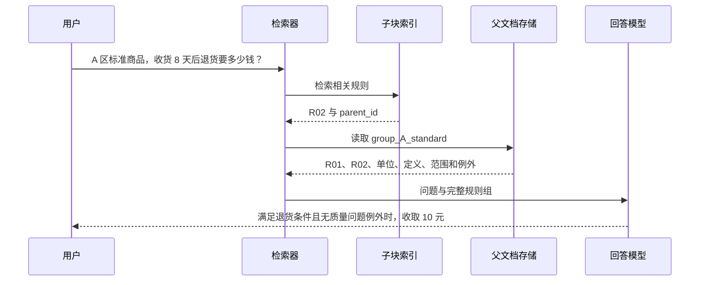

1. Table of Contents, ordered
{:toc}

RAG 产品的“支持 Excel”可能对应几种很不一样的实现：把工作表转成一段文本，保留带行列结构的 HTML，把每一行变成独立文档，或者生成表格摘要，命中摘要后再取回原表。这些路径都能完成文件接入，最终能回答的问题却不同。

本文从官方文档和公开源码出发，比较 Unstructured、Docling、RAGFlow、LangChain、LlamaIndex，以及 Azure Document Intelligence / AI Search 的处理方式。它们分别覆盖解析、切块、索引和检索等环节，因此比较重点是**各自提供什么机制，这些机制如何组合，哪些事情仍需要应用实现**。

调研核查日期为 **2026-09-22**。涉及源码行为的结论链接到固定提交；默认分支与实际安装版本可能不同，文末列出了源码快照。本文没有做产品市场份额调查或检索效果排名，下文的“代表方案”用于说明常见技术路线。所有表格和查询均为虚构的电商案例；预处理结果是按机制简化的示意，未运行真实 embedding 或检索服务，SQL 示例单独执行验证过。

## 用同一张表，确定调研要比较的内容

### 原表中，一条规则依赖哪些信息

假设 `return-policy.xlsx` 的“退货规则”Sheet 包含以下内容。把它写进 Markdown 文档，也可以得到相同的规则表。

> **表名**：退货服务费规则。
>
> **适用范围**：商品满足退货条件，且收货后不超过 30 天。t 表示从收货到申请退货经过的天数。
>
> **通用例外**：经确认属于商品质量问题时，免收退货服务费。

| 规则 ID | 区域 | 商品类型 | 申请退货时间 | 服务费（元） | 结果码 |
|---|---|---|---|---:|---|
| R01 | A 区 | 标准商品 | t ≤ 7 | 0 | FREE_RETURN |
| R02 | A 区 | 标准商品 | t > 7 | 10 | RETURN_SERVICE_FEE |
| R03 | A 区 | 大件商品 | t ≤ 15 | 0 | FREE_RETURN |
| R04 | A 区 | 大件商品 | t > 15 | 30 | RETURN_SERVICE_FEE |
| R05 | B 区 | 标准商品 | t ≤ 5 | 0 | FREE_RETURN |
| R06 | B 区 | 标准商品 | t > 5 | 12 | RETURN_SERVICE_FEE |

围绕这张表，可以提出不同类型的问题：

| 问题 | 回答需要的证据 | 对系统的要求 |
|---|---|---|
| A 区标准商品，收货 8 天后退货，服务费是多少？ | R02、金额单位、t 的定义、适用范围和例外 | 找到一行并带齐上下文 |
| A 区标准商品，7 天以内和超过 7 天有什么区别？ | R01 与 R02，以及共同说明 | 一次取齐可比较的行 |
| `RETURN_SERVICE_FEE` 在哪些规则中出现？ | 结果码精确匹配的全部行 | 精确匹配并覆盖完整结果集 |
| 哪张表介绍退货时间与服务费的关系？ | 表名、字段含义和主题 | 找表，未必需要立即读取全部行 |
| A 区某天的退货服务费净收入是多少？ | 该日完整订单集合及退款数据 | 查明细并计算，规则表本身不够 |

一条 `A 区 / 标准商品 / > 7 / 10` 的裸文本并不完整：7 的单位是天，10 的单位是元，质量问题还有免收例外。后面的实现对照，都以能否保留、找到并交付这些证据为标准。

### 先区分各工具负责的环节

这些工具可以出现在同一条链路中，不能把它们当作六种完全互斥的产品方案。

| 工具或组件 | 本文核查的主要职责 | 典型产物或机制 |
|---|---|---|
| Unstructured | 文件解析、元素化和切块 | `Table`、`text_as_html`、`TableChunk` |
| Docling | 文档结构表示、表格序列化和切块 | `DoclingDocument`、triplet / Markdown 表示、带元数据的 chunk |
| RAGFlow 的 Table 路径 | 将结构化表格行转成知识库文档 | 每行一个 chunk，列名与值组成文本，列角色控制索引与存储 |
| LangChain 的相关 retriever | 组织检索表示与原文的关联 | 摘要或子块进向量库，通过 `doc_id` 取回父文档 |
| LlamaIndex 的表格元素解析器 | 将表格转成摘要索引节点与内容节点 | `IndexNode` 指向包含表格的 `TextNode` |
| Azure Document Intelligence / AI Search | 前者负责版面分析，后者负责搜索 | 结构化表格输出、关键词与向量混合检索 |

## 解析与切块：表结构可以保留到什么程度

### Unstructured：表格是独立元素，大表有专门的切分路径

Unstructured 先把文件解析成元素，再对元素切块。Excel 入口 `partition_xlsx` 有几个直接影响结果的参数。以下默认值来自本文固定的 [`partition_xlsx` 源码](https://github.com/Unstructured-IO/unstructured/blob/0ca5563220683953afdd47619b72a5d55ea4ddde/unstructured/partition/xlsx.py)。

| 参数 | 本文核查版本的默认值 | 实际影响 |
|---|---|---|
| `find_subtable` | `True` | 在 Sheet 中寻找多个子表区域；关闭时按整个工作表生成 Table |
| `infer_table_structure` | `True` | 为表格提供 `metadata.text_as_html`，保留行列结构 |
| `include_header` | `False` | 影响首行是否按 DataFrame 表头读取及输出；关闭不等于删除第一行，也不等于自动识别业务表头 |

对于本例，解析后的一个表格元素可以理解为以下两种表示共存。为了便于阅读，只展示 R02 和部分列：

```json
{
  "type": "Table",
  "text": "规则 ID 区域 服务费（元） R02 A 区 10",
  "metadata": {
    "page_name": "退货规则",
    "text_as_html": "<table><tr><th>规则 ID</th><th>区域</th><th>服务费（元）</th></tr><tr><td>R02</td><td>A 区</td><td>10</td></tr></table>"
  }
}
```

这里的 HTML 示例假设表头已经正确识别。`text` 是平铺文本，`text_as_html` 才显式保存单元格关系。如果应用只把 `text` 写入向量库，随后丢弃 HTML，那么解析器保留了结构，回答阶段仍然可能拿不到结构。

[官方切块文档](https://docs.unstructured.io/open-source/core-functionality/chunking)将表格与普通文本元素分开处理；进一步查看本文核查版本的 [`_TableChunker` 和 `_HtmlTableSplitter`](https://github.com/Unstructured-IO/unstructured/blob/0ca5563220683953afdd47619b72a5d55ea4ddde/unstructured/chunking/base.py)，可以看到更具体的分支：

1. 表格文本和 HTML 都没有超过硬预算时，保留为一个 `Table`。
2. 有可解析的 HTML 时，优先沿行边界切分，并同步产生文本与 HTML 片段。
3. `rowspan` 关联的行在预算允许时一起保留；一行仍然过大时，会继续沿单元格、单元格内文本拆分。
4. `repeat_table_headers` 默认开启，但重复的是被识别为表头的前导行；普通第一行不会凭空变成表头。
5. 没有可用 HTML，或预算小到不足以容纳 HTML 开销时，退回纯文本切分。该版本的极小预算阈值是 50 个字符，或 token 模式下的 15 个 token。

拆分后的 `TableChunk` 还带有表格关联及分片信息，例如 `table_id`、`chunk_index`、`is_continuation`。这些信息可以用于应用侧回取相邻片段，但切分器本身不执行检索。

对“A 区标准商品，收货 8 天后退货”的查询，应用可以检索包含 R02 的片段，再读取其 HTML 和关联说明。关键限制在于：Excel 子表前后的单行说明可能被解析为独立文本元素。**识别出 Table，并不代表“质量问题免收”已经自动附着到每个 TableChunk 上。**

### Docling：文档结构、表格序列化和 token 预算一起参与切块

Docling 的路线是先建立文档结构，再序列化、切块。[`HybridChunker` 的文档](https://docling-project.github.io/docling/concepts/chunking/)所说的 Hybrid，指结构切块与 token 约束结合：先利用文档层级形成块，再拆大块、按条件合并小块。这里的 Hybrid 与关键词加向量的混合检索是不同环节。

一个容易忽略的细节是：**表格的默认检索表示未必是 Markdown。** 本文核查版本的 [`ChunkingDocSerializer`](https://github.com/docling-project/docling-core/blob/f17ef63cc673d9a979bc49f66fe9763fc8e2c993/docling_core/transforms/chunker/hierarchical_chunker.py)默认使用 `TripletTableSerializer`。对多列表格，它以首列作为行标识，组合行标识、列名和值。R02 可以序列化成类似下面的文本，实际结果用分隔符连接：

```text
R02, 区域 = A 区.
R02, 商品类型 = 标准商品.
R02, 申请退货时间 = t > 7.
R02, 服务费（元） = 10.
R02, 结果码 = RETURN_SERVICE_FEE
```

这种表示把列名反复写到值旁边，让局部文本不完全依赖远处的表头。但它不会自动把 `t > 7` 解释为“收货超过 7 天”，定义仍需来自文档上下文。

如果配置为 `MarkdownTableSerializer`，可以使用 Markdown 表示。[官方序列化示例](https://docling-project.github.io/docling/_generated/examples/advanced_chunking_and_serialization/)展示了这种可定制方式。假设预算使每块只能放两行数据，重复表头的结果可以示意为：

```text
块 1：
| 规则 ID | 区域 | 商品类型 | 申请退货时间 | 服务费（元） |
|---|---|---|---|---|
| R01 | A 区 | 标准商品 | t ≤ 7 | 0 |
| R02 | A 区 | 标准商品 | t > 7 | 10 |

块 2：
| 规则 ID | 区域 | 商品类型 | 申请退货时间 | 服务费（元） |
|---|---|---|---|---|
| R03 | A 区 | 大件商品 | t ≤ 15 | 0 |
| R04 | A 区 | 大件商品 | t > 15 | 30 |
```

“两行一块”是演示设定，实际分界取决于 tokenizer、序列化形式和预算。本文核查的 [`HybridChunker` 源码](https://github.com/docling-project/docling-core/blob/f17ef63cc673d9a979bc49f66fe9763fc8e2c993/docling_core/transforms/chunker/hybrid_chunker.py)还暴露了以下控制点：

| 控制点 | 默认值或行为 | 对本例的含义 |
|---|---|---|
| `repeat_table_header` | `True` | 在适用的表格切分路径中重复表头 |
| `omit_header_on_overflow` | `False` | 不默认通过丢弃表头来让数据行适配预算 |
| `merge_peers` | `True` | 尝试合并符合标题、caption 等条件且预算允许的小块 |
| `contextualize(chunk)` | 返回加入上下文的序列化文本 | embedding 时可以使用带标题等信息的文本，而不只使用裸 `chunk.text` |

重复表头的专门路径有前提：块内恰好有一个 `TableItem`，并使用相应的 `ChunkingDocSerializer`。该路径使用按行、按 token 预算的切块器；如果某一行自身就过大，不能据此推断“任何情况下都绝不切断数据行”。

对“7 天以内和超过 7 天有什么区别”，上述块 1 恰好包含 R01 与 R02，可以一起交给回答模型。不过，这只是切块边界合适时的结果。token 切块器并不知道这两行构成一组业务规则，不能保证它们在任何预算下都被分在一起。

### RAGFlow：Table 路径直接把每一行做成检索文档

RAGFlow 的 [`rag/app/table.py`](https://github.com/infiniflow/ragflow/blob/5e0bcd50c406cbadf2e7343be5f6d8633a1fcbdc/rag/app/table.py)采用更直接的行级处理。在本文核查版本中，它遍历 DataFrame 的每行，将参与索引的列格式化为“列名: 值”。R02 的主要文本类似：

```text
- 规则 ID: R02
- 区域: A 区
- 商品类型: 标准商品
- 申请退货时间: t > 7
- 服务费（元）: 10
- 结果码: RETURN_SERVICE_FEE
```

这条路径的优势很直观：查询“R02 是什么规则”时，命中的文档已经带有列名，不必再从同一 Sheet 的第一行找表头。代价也很明确：六条规则形成六个独立检索单元；查询“比较 R01 和 R02”时，需要召回两行，或者通过应用层的分组关系补取。

该版本还支持手动列角色配置。`table_column_mode` 为 `manual` 时，`table_column_roles` 可以区分：

| 列角色 | 进入主要索引文本 | 保留为结构化字段 | 本例用途 |
|---|---|---|---|
| `indexing` | 是 | 不走该角色的结构化存储路径 | 只用于语义匹配的说明 |
| `metadata` | 否 | 是 | 希望用于过滤、展示或后续结构化处理的字段 |
| `both` | 是 | 是 | 规则 ID、区域、金额等需要两种用途的字段 |

未单独配置的列默认按 `both` 处理。源码还进行字段类型推断，不同后端的存储方式有所区别，例如 `chunk_data` 或带类型的字段。**这说明它保留了结构化查询的基础，不等于只启用 Table 解析就自动获得可靠的任意 SQL 问答。**

这条路线适合“一行就是一个相对独立记录”的表，例如商品、设备、规则清单。对于标题散落、多张子表并列、说明行夹在数据中的 Excel，需要先核对表头和记录范围。即使表头正确，表外的“质量问题免收”也不会因为逐行格式化而自然变成每行的一部分。

## 索引与召回：用什么找到表，命中后返回什么

### LangChain：摘要或子块负责匹配，父文档负责提供原始证据

LangChain 在 2023 年发布的[半结构化与多模态 RAG 文章](https://www.langchain.com/blog/semi-structured-multi-modal-rag)展示了一条有代表性的路线：为表格生成便于语义检索的摘要，把摘要向量化；检索命中后，将关联的原始表格交给回答模型。

这里存在两份不同用途的内容：

```text
向量库中的检索文档：
  text: 退货服务费规则，按区域、商品类型和申请时间确定费用，
        涵盖免费退货与收费退货两类结果。
  metadata.doc_id: return_rules

文档存储中的原文：
  key: return_rules
  value: 表名 + 适用范围 + t 的定义 + 质量问题例外 + 完整六行表格
```

查询“哪张表介绍退货时间与服务费的关系”时，摘要是合适的匹配入口；查询“收货 8 天具体收多少”时，最终仍应读取表中条件与金额。摘要里没有列出的数值，不能靠模型补齐。

本文核查版本的 [`MultiVectorRetriever`](https://github.com/langchain-ai/langchain/blob/7e89d6c79c4919acf4643e56494ea02a11c68bd4/libs/langchain/langchain_classic/retrievers/multi_vector.py)位于 `langchain_classic`，核心行为很明确：

1. 在 `vectorstore` 检索摘要或子块；默认使用相似度检索，也支持 MMR、相似度阈值路径。
2. 从命中项的 metadata 中读取父文档标识，默认字段是 `doc_id`。
3. 对父 ID 去重，通过 `docstore.mget` 取回原始文档。

**该 retriever 不负责生成摘要。** 摘要生成、父文档组织、关联 ID 写入，都需要上游流程完成。一个父文档可以对应摘要、局部行组、补充描述等多个检索表示，查询最终映射回同一份证据。

[`ParentDocumentRetriever`](https://github.com/langchain-ai/langchain/blob/7e89d6c79c4919acf4643e56494ea02a11c68bd4/libs/langchain/langchain_classic/retrievers/parent_document_retriever.py)进一步封装了父子切块与存储，但父、子边界仍由传入的 splitter 决定。要把“A 区标准商品的 R01、R02 和共同说明”视为父文档，应用必须先表达这种分组。把几万行的整个 Sheet 当成父文档，命中一次就全部回取，也可能超出回答预算。

### LlamaIndex：表格摘要是索引节点，表格正文是被引用的内容节点

LlamaIndex 的 `MarkdownElementNodeParser` 与普通按标题切 Markdown 的解析器用途不同。本文核查的 [Markdown 元素解析源码](https://github.com/run-llama/llama_index/blob/f12d46acab73f5b2243ef49c2f00101617b38ce4/llama-index-core/llama_index/core/node_parser/relational/markdown_element.py)先区分文本和表格元素；规则的表格可转为 DataFrame，不规则表格则有保留原始表格文本的路径。

随后，[基类实现](https://github.com/run-llama/llama_index/blob/f12d46acab73f5b2243ef49c2f00101617b38ce4/llama-index-core/llama_index/core/node_parser/relational/base_element.py)调用 LLM 生成表格摘要及列描述，并构造一对互相关联的节点。简化后类似：

```text
IndexNode：
  text: 退货服务费规则的摘要、表名和列描述
  index_id: return_rules_table

TextNode：
  id_: return_rules_table
  text: 表格摘要 + 表格的 Markdown 正文
  metadata:
    table_df: DataFrame 转换的字典表示
    table_summary: 表格摘要
```

查询“不同商品类型的免费退货期限”时，可以先命中摘要节点，再沿 `index_id` 取得表格内容。解析器提供节点和映射，应用还需要把映射接入相应的检索流程；单独调用解析器并不会完成一次问答。

这条路径有三个容易影响工程预期的细节：

- **解析阶段包含模型调用。** 表格摘要由配置的 LLM 生成，会带来成本、耗时和摘要遗漏的可能，并非单纯的 Markdown 字符串切分。
- **相邻说明的收集有具体启发式。** 本文核查版本只检查相邻文本的有限行，并以行首是否为英文 `table` 作为收集线索。不能假设中文的“适用范围”“通用例外”一定自动进入摘要上下文。
- **metadata 不等于 embedding 输入。** `table_df`、`table_summary` 等字段被配置为不直接作为 embedding / LLM metadata 展开；表格内容节点的正文另行包含摘要与表格。检查召回效果时，要看实际被索引和返回的文本。

它与 LangChain 的摘要索引思路相近，但封装层不同：这里的表格元素解析器直接参与摘要生成、节点配对；LangChain 的 `MultiVectorRetriever` 更侧重根据关联 ID 回取文档。

### Azure：版面分析与混合搜索是两个独立能力

Azure 的名称容易让人把文件支持、表格解析与检索能力混为一谈，需要分别核对。

[Document Intelligence Layout 文档](https://learn.microsoft.com/en-us/azure/ai-services/document-intelligence/prebuilt/layout?view=doc-intel-4.0.0)说明，在 v4.0 的 `2024-11-30` GA 版本中，Markdown 输出里的表格改用 HTML 表示，以表达合并单元格和多行表头。但同一文档也明确列出：**XLSX 输入不支持表格分析**。因此，“接受 XLSX 文件”不能直接推导成“能够把 XLSX 表格按这套版面表格结构解析出来”。

该服务适合的 PDF、图像等输入，可以使用其表格分析能力；Excel 则需要另选合适的解析入口。其表格 bounding region 也不包含 caption 和脚注，应用要另外建立关联。前面几种解析器提到的上下文问题，在版面分析路线中同样存在。

表格被解析和切块以后，可以交给 Azure AI Search。[官方混合搜索文档](https://learn.microsoft.com/en-us/azure/search/hybrid-search-overview)描述的机制是：全文检索与向量检索并行执行，再用 RRF 融合排名；还可以叠加语义排序。

对于本例，应用可以自行设计如下索引文档。下面是应用 schema 示意，并非服务自动生成的固定结构：

```json
{
  "id": "return_rules_R02",
  "table_id": "return_rules",
  "rule_id": "R02",
  "region": "A 区",
  "result_code": "RETURN_SERVICE_FEE",
  "content": "A 区标准商品，t > 7 时退货服务费为 10 元。",
  "context_id": "return_rules_context"
}
```

`content` 可以生成向量，`rule_id`、`region`、`result_code` 则按查询需要配置可过滤或可搜索字段。`context_id` 的说明回取也由应用实现。

| 查询 | 更直接的检索信号 | 需要补上的处理 |
|---|---|---|
| 收货超过一周，退货要付钱吗？ | 向量匹配自然语言表达，配合关键词检索 | 从证据中核对区域、类型、时间定义及例外 |
| 解释 `RETURN_SERVICE_FEE` | 关键词或专门的精确字段 | 补取各条命中规则对应的原文 |
| 列出 A 区全部收费规则 | 对区域及费用条件执行完整筛选 | 处理分页，确保取全；不能把 top-k 当作全部结果 |

精确标识符是否被分词、字段是否可过滤，都取决于索引配置。混合检索改善的是候选发现，无法修复上游已经丢掉的表头、单位或脚注。

## 框架保留结构之后，业务关系仍需要显式补齐

### 按标题切 Markdown，与理解表格边界是两件事

LangChain 的 [`MarkdownHeaderTextSplitter`](https://github.com/langchain-ai/langchain/blob/7e89d6c79c4919acf4643e56494ea02a11c68bd4/libs/text-splitters/langchain_text_splitters/markdown.py)主要按标题维护章节上下文。它没有专门识别数据行、重复表头或绑定表外例外的切块逻辑。如果一个章节太长，后面再接普通长度切分器，表格仍可能被切成：

```text
块 1：表名、适用范围、表头、R01
块 2：R02、R03、R04
块 3：R05、R06、质量问题免收说明
```

块 2 与问题很相关，却不足以独立解释金额和例外。这也是“Markdown 解析成功”和“表格证据可用”之间的差距。

对本例，应用可以先按区域与商品类型构造父文档，再产生较小的检索块：

```text
父文档 group_A_standard：
  表名、单位、t 的定义、30 天适用范围、质量问题例外
  R01：A 区标准商品，t ≤ 7，服务费 0 元
  R02：A 区标准商品，t > 7，服务费 10 元

子块 R01：R01 的列名和值；parent_id = group_A_standard
子块 R02：R02 的列名和值；parent_id = group_A_standard
```

这种业务分组可以与前面的父子文档检索机制组合，但分组规则属于应用设计。查询“收货 8 天后多少钱”的一次检索可以这样进行：



这里的向量检索负责发现候选规则。`8 > 7` 是否成立、商品是否处于 30 天范围、是否触发例外，都需要在后续读取与判断中处理，不能把向量相似度当成规则求值器。

### 宽表和长单元格：结构边界之外，还要选择业务边界

继续给 R02 增加“页面提示”“审核时限”“申请材料”“退款方式”等列。表很宽时，单行格式化仍可能生成很长的 chunk；某个“审核说明”单元格本身也可能占几千字。

Unstructured 的行→单元格→文本降级、Docling 的 token 约束，解决了“超预算怎么办”。如果希望检索单元与业务问题更贴合，还可以在应用层构造以下表示：

| 应用构造的 chunk | 内容示例 | 适配查询 |
|---|---|---|
| `R02_fee` | 规则 ID、区域、商品类型、时间条件、10 元及单位 | 超过 7 天收多少？ |
| `R02_display` | 相同规则标识 + 页面提示“本次退货将收取 10 元服务费” | 用户会看到什么提示？ |
| `R02_review` | 相同规则标识 + 72 小时内审核、需照片及订单凭证 | 申请复核需要什么材料？ |
| `R02_refund_1` | 相同规则标识 + 长说明中的“确认误收后原路退回”段落 | 误收后怎样退款？ |

这些扩展字段同样是虚构数据。所有块保留同一 `rule_id` 和原表关联，按问题需要回取范围、例外和同规则的其他字段。长单元格按段落拆分时，也要带上字段名，例如“审核说明”，防止它脱离所在列以后变成一段无法定位的文本。

这是可以建立在上述工具之上的工程方案，不能宣称每个工具都会自动识别“费用”“展示”“审核”三类业务列组。小表则没必要为了统一形式强行拆开：只要表格与说明合起来满足预算，整表索引或摘要命中后返回整表就很直接。

Excel 还应保留源文件、Sheet、逻辑表位置、行标识和版本。合并单元格可以根据实际合并范围展开；普通空白不能一律向下填充。公式值也要核查：[openpyxl 的 `data_only` 选项](https://openpyxl.readthedocs.io/en/stable/tutorial.html)读取的是工作簿上次保存的公式缓存结果，并不会重新执行公式计算。检索链路再完整，也不能把陈旧缓存变成当前事实。

## 面向统计问题，结构化查询承担完整集合的计算

### 同一领域的问题，可能需要换一份数据和一种执行方式

“服务费规则是什么”和“A 区今天净收了多少钱”使用相同词汇，证据需求却不同。后者需要订单明细。假设 `orders` 表中有以下五条记录，金额单位为元：

| order_id | date | region | product_type | rule_id | charged | refunded |
|---|---|---|---|---|---:|---:|
| O01 | 2026-09-01 | A 区 | 标准商品 | R02 | 10 | 0 |
| O02 | 2026-09-01 | A 区 | 大件商品 | R04 | 30 | 0 |
| O03 | 2026-09-01 | B 区 | 标准商品 | R06 | 12 | 0 |
| O04 | 2026-09-01 | A 区 | 标准商品 | R01 | 0 | 0 |
| O05 | 2026-09-01 | A 区 | 标准商品 | R02 | 10 | 10 |

即使每行都有 embedding，召回“最相关的三条订单”也无法证明总额正确。这个问题应执行覆盖全部符合条件记录的查询：

```sql
SELECT SUM(charged - refunded) AS net_fee
FROM orders
WHERE region = 'A 区'
  AND date = '2026-09-01';
```

结果为 **40 元**。实际入库时应明确日期、金额、空值和退款口径；金额使用合适的定点数或最小货币单位，避免把展示字符串当作可计算字段。

[LangChain 的 SQL agent 文档](https://docs.langchain.com/oss/python/langchain/sql-agent)展示了这类处理链路：发现数据库表、读取 schema、生成与检查 SQL、执行并根据错误修正，再用查询结果回答。它需要接入数据库和工具，不是 Excel 解析器自带的一项隐含功能。生成 SQL 仍需验证业务口径，工具调用成功也不自动意味着问题理解正确。

这也适用于“列出所有收费规则”：如果要求完整列表，就要对完整表执行筛选并取全结果。关键词与向量检索可以帮助找表、找字段解释，但固定 top-k 的相关性排序不能承诺集合完整。

### 计算与规则解释可以组合，但要保留连接键

如果用户继续问“这 40 元主要来自哪些规则”，先进行分组计算：

```sql
SELECT rule_id, SUM(charged - refunded) AS net_fee
FROM orders
WHERE region = 'A 区'
  AND date = '2026-09-01'
GROUP BY rule_id
ORDER BY rule_id;
```

得到 R01 为 0 元、R02 为 10 元、R04 为 30 元。随后按 `rule_id` 精确读取规则表，说明 R02 与 R04 的适用条件；需要解释退款影响时，再读取相关订单明细。

这条组合链路中的职责清楚：结构化查询负责完整集合和计算，规则检索负责解释原文。实际系统还应关联订单生效时的规则版本，仅凭当前规则和聚合结果不能判定历史收费是否正确。

## 调研对照：选择路线时应核查哪些能力

### 先比较中间产物，再比较最终交付的证据

下面把同一张表在各条路线中的表示、检索过程和应用责任放在一起：

| 代表路线 | 预处理后的主要表示 | 查询时怎样取得证据 | 适配问题 | 应用仍需处理 |
|---|---|---|---|---|
| Unstructured | `Table.text` + HTML；超大表生成 `TableChunk` | 下游检索片段，读取结构化内容及关联片段 | 找到某条或某段规则 | 检索索引、表外说明关联、版本与位置 |
| Docling | triplet 或配置的 Markdown；带标题等上下文的 chunk | 检索序列化文本，返回相应结构与上下文 | 文档中定位表格及相关行 | serializer / tokenizer 选择、业务分组、检索器 |
| RAGFlow Table | 一行一个“列名: 值”文档，并保存配置的结构化字段 | 检索独立记录，按配置过滤或继续处理字段 | 查询某条商品、设备或规则记录 | 跨行比较、表外说明、复杂 Sheet 清洗 |
| LangChain 多表示 / 父子文档 | 摘要或子块向量 + `doc_id` + 父文档 | 先检索小表示，再回取父文档 | 找表、局部命中后读取完整规则组 | 摘要生成、父子边界、父文档大小 |
| LlamaIndex 表格元素节点 | 摘要 `IndexNode` + 关联表格 `TextNode` | 命中摘要，通过节点引用取表格 | 文本与表格混排文档中的找表和问答 | 模型调用配置、引用检索接线、中文说明关联 |
| Azure AI Search 混合检索 | 应用定义的文本、向量和结构化字段 | 全文与向量并行，RRF 融合后取回证据 | 自然语言与规则码共同参与查询 | 上游解析器、字段 schema、精确过滤、上下文回取 |
| SQL / DataFrame 查询 | 有字段类型、主键和完整行集的数据表 | 执行筛选、分组和聚合，再关联说明 | 总额、排名、完整列表、跨表统计 | 数据清洗、查询口径、版本连接与结果核验 |

从这些实现可以归纳出选型方向：文档型表格优先关注表结构与章节上下文，记录型表格关注行级表示和字段过滤，找表问题可以使用摘要索引，统计问题需要完整数据上的查询执行。这是基于机制的工程判断，不能替代同一数据集上的效果测试。

另外，**“生成摘要”在不同产品中可能意味着不同的数据流**。Unstructured 的可选 [Table Description enrichment](https://docs.unstructured.io/concepts/enriching/table-descriptions)会用生成的描述替换先前的 `text`，后续 embedding 因而使用新文本；这与 LangChain 中单独保存摘要文档和原表的双存储示例并不相同。该功能属于额外启用的 enrichment，不能当作开源 `partition_xlsx` 的默认行为。官方文档还说明：分块后描述针对当前 TableChunk；表格图像的保留取决于解析路径，TableChunk 也不会携带 `image_base64`。启用摘要前，应确认原始表格通过什么路径留存和回取。

### 组合方案时，验收完整的证据交付链路

这些能力可以组合成下面的流程。图中的上下文绑定、路由和关联存储属于应用工作，各组件只承担其中一部分：

```mermaid
flowchart TD
    A[Excel 或 Markdown] --> B[解析逻辑表、表头、单元格与文档说明]
    B --> C[绑定单位、范围、例外、来源和版本]
    C --> D[整表、行块或业务行组]
    D --> E[原文与关联信息存储]
    D --> F[摘要或子块的检索索引]
    C --> G[具有类型和完整行集的数据表]
    Q[用户问题] --> R{判断证据需求}
    R -->|找表或规则解释| F
    F --> H[混合召回与筛选]
    H --> E
    R -->|全量筛选或统计| G
    G --> I[执行结构化查询]
    E --> J[组装可核对的证据]
    I --> J
    J --> K[回答并标注来源]
```



验收时可以直接使用本文的五类问题：能否定位 R02 并带齐例外；能否取齐 R01、R02 完成比较；能否精确并完整列出结果码对应规则；能否通过主题找到正确表格；能否从完整订单集合算出 40 元。分别检查解析结果、检索表示、返回原文和计算结果，才能定位失败发生在哪一层。

这与 [Ragas 与 TREC 的证据覆盖评测](/posts/2026/09/20/ragas-trec-evidence-recall/)的思路相通：评测对象应是最终交给回答模型的必要证据，而不只是某个相关 chunk 是否进入 top-k。更多关联讨论见 [AI、LLM 与 Agent 知识索引](/wiki/ai-llm-agent/)。

本文使用的开源源码快照如下。固定提交用于复核具体行为，不表示这些能力都已包含在某个已发布版本中。

| 项目 | 提交 | 本文核查的实现 |
|---|---|---|
| Unstructured | `0ca5563` | [XLSX 解析](https://github.com/Unstructured-IO/unstructured/blob/0ca5563220683953afdd47619b72a5d55ea4ddde/unstructured/partition/xlsx.py)、[表格切块](https://github.com/Unstructured-IO/unstructured/blob/0ca5563220683953afdd47619b72a5d55ea4ddde/unstructured/chunking/base.py) |
| Docling Core | `f17ef63` | [层级切块与 triplet](https://github.com/docling-project/docling-core/blob/f17ef63cc673d9a979bc49f66fe9763fc8e2c993/docling_core/transforms/chunker/hierarchical_chunker.py)、[HybridChunker](https://github.com/docling-project/docling-core/blob/f17ef63cc673d9a979bc49f66fe9763fc8e2c993/docling_core/transforms/chunker/hybrid_chunker.py) |
| RAGFlow | `5e0bcd5` | [Table 解析和列角色处理](https://github.com/infiniflow/ragflow/blob/5e0bcd50c406cbadf2e7343be5f6d8633a1fcbdc/rag/app/table.py) |
| LangChain | `7e89d6c` | [MultiVectorRetriever](https://github.com/langchain-ai/langchain/blob/7e89d6c79c4919acf4643e56494ea02a11c68bd4/libs/langchain/langchain_classic/retrievers/multi_vector.py)、[ParentDocumentRetriever](https://github.com/langchain-ai/langchain/blob/7e89d6c79c4919acf4643e56494ea02a11c68bd4/libs/langchain/langchain_classic/retrievers/parent_document_retriever.py)、[Markdown splitter](https://github.com/langchain-ai/langchain/blob/7e89d6c79c4919acf4643e56494ea02a11c68bd4/libs/text-splitters/langchain_text_splitters/markdown.py) |
| LlamaIndex | `f12d46a` | [Markdown 表格元素解析](https://github.com/run-llama/llama_index/blob/f12d46acab73f5b2243ef49c2f00101617b38ce4/llama-index-core/llama_index/core/node_parser/relational/markdown_element.py)、[摘要与节点映射](https://github.com/run-llama/llama_index/blob/f12d46acab73f5b2243ef49c2f00101617b38ce4/llama-index-core/llama_index/core/node_parser/relational/base_element.py) |
