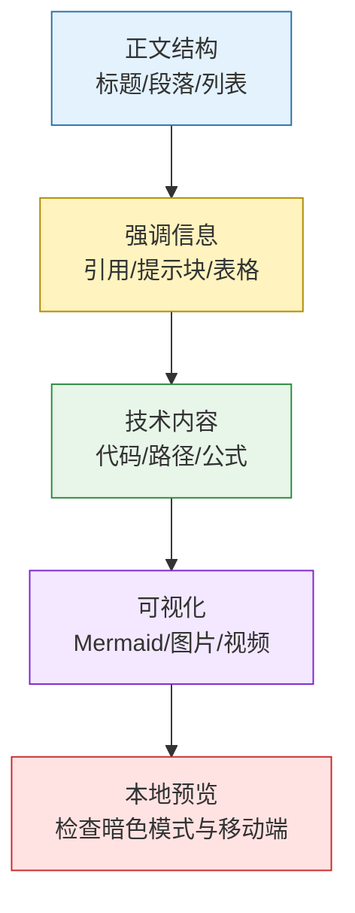
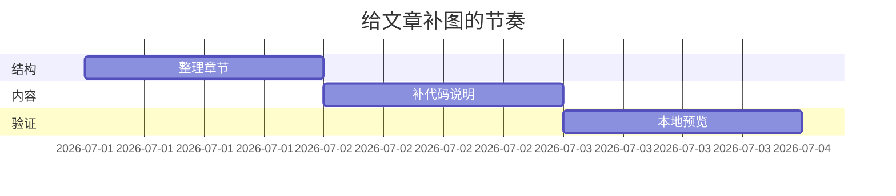

这篇文章原本是 Chirpy 官方的排版展示页。与其只把所有语法摊开，不如把它当成一份**写文章时的样式速查表**：需要标题、提示块、代码块、公式、图、图片、视频时，直接来这里抄一段，改成自己的内容，再本地预览验证。

1. Table of Contents, ordered
{:toc}

# 使用顺序

写一篇教程时，通常按这个顺序检查排版能力：



> 这篇文章不是要求每篇文章都用全这些样式。恰恰相反：先写清楚，再用样式降低阅读成本。样式是调味料，不是往火锅里倒一整瓶老干妈。
{: .prompt-tip }

# 标题

页面的主标题来自 front matter 的 `title`。正文从 `#` 开始即可：

# H1 - heading
{: .mt-4 .mb-0 }

## H2 - heading
{: data-toc-skip='' .mt-4 .mb-0 }

### H3 - heading
{: data-toc-skip='' .mt-4 .mb-0 }

#### H4 - heading
{: data-toc-skip='' .mt-4 }

> 文章目录一般只需要进入到有意义的小节。展示性标题可以加 `data-toc-skip=''`，避免目录膨胀。
{: .prompt-info }

# 段落与列表

段落之间空一行，别把所有解释挤在一起。教程里尤其建议把“要做什么”和“为什么这么做”拆开写。

有序列表适合步骤：

1. 先准备素材。
2. 再写 front matter。
3. 最后本地预览。

无序列表适合并列概念：

- Markdown 负责内容结构。
- Chirpy 负责主题样式。
- Jekyll 负责把它们编译成 HTML。

任务列表适合自查：

- [x] front matter 完整
- [x] 代码块语言正确
- [ ] 图片路径存在

描述列表适合术语解释：

Front Matter
: Markdown 文件顶部的 YAML 元数据。

Liquid
: Jekyll 使用的模板语言。

# 引用与提示块

普通引用：

> This line shows the _block quote_.

Chirpy 还支持四种 prompt。写教程时建议少而准：

> 用于提醒读者“推荐这么做”。
{: .prompt-tip }

> 用于补充背景，不影响主流程。
{: .prompt-info }

> 用于说明容易踩坑的地方。
{: .prompt-warning }

> 用于说明会导致构建失败、数据丢失或明显错误的操作。
{: .prompt-danger }

# 表格

表格适合表达对比：

| 写法 | 适合场景 | 验证方式 |
|------|----------|----------|
| 列表 | 步骤、并列项 | 看缩进是否清晰 |
| 表格 | 对比、参数、状态 | 看列宽是否过长 |
| Mermaid | 流程、状态、结构 | 看暗色模式是否可读 |

# 链接与脚注

裸 URL 尽量改成有语义的链接，例如：[本地预览地址](http://127.0.0.1:4000)。

脚注适合放不打断正文的小补充。点击脚注锚点会定位到脚注内容[^footnote]，也可以继续增加第二个脚注[^fn-nth-2]。

# 行内代码与文件路径

行内代码用反引号，例如 `bundle exec jekyll serve`。

文件路径可以加 Chirpy 的路径样式：`/path/to/the/file.extend`{: .filepath}。

# 代码块

普通代码块：

```
This is a common code snippet, without syntax highlight and line number.
```

指定语言后会高亮：

```bash
if [ $? -ne 0 ]; then
  echo "The command was not successful."
  exit 1
fi
```

也可以给代码块标文件名：

```sass
@import
  "colors/light-typography",
  "colors/dark-typography";
```
{: file='_sass/jekyll-theme-chirpy.scss'}

# 数学公式

数学公式由 [MathJax](https://www.mathjax.org/) 渲染。需要在 front matter 中开启 `math: true`。

块级公式前后留空行：

$$
\sum_{n=1}^\infty \frac{1}{n^2} = \frac{\pi^2}{6}
$$

行内公式也能正常使用：当 $a \ne 0$ 时，二次方程 $ax^2 + bx + c = 0$ 的两个解为：

$$
x = {-b \pm \sqrt{b^2-4ac} \over 2a}
$$

# Mermaid 图

Mermaid 适合表达流程、状态、时序和结构。需要在 front matter 中开启 `mermaid: true`。



# 图片

默认图片会居中显示。这里直接拿练摩托车的图当样例，比小小的 favicon 更能看出宽度、对齐和浮动效果。给图片写 `width` 和 `height` 可以减少页面加载时的布局跳动。

{: width="2560" height="1440" }
_居中显示，适合做普通图片示例_

左对齐：

{: width="2560" height="1440" .w-75 .normal}

浮动到左侧：

{: width="4032" height="3024" .w-50 .left}
浮动图后面的文字会环绕图片。正文较长时可以使用这种方式，但教程文章里别滥用，否则读者在手机上看会有点儿挤。

浮动到右侧：

{: width="4032" height="3024" .w-50 .right}
如果图片本身只是辅助说明，右浮动能让正文继续保持连续阅读。

Chirpy 支持根据暗色/亮色模式展示不同图片：

{: .light .w-75 .shadow .rounded-10 w='2560' h='1440' }
{: .dark .w-75 .shadow .rounded-10 w='4032' h='3024' }

# 视频

可以通过 include 嵌入视频：



# 验证清单

本地预览后重点看这些地方：

| 检查项 | 正常表现 |
|--------|----------|
| 目录 | 只出现真正需要导航的标题 |
| 代码块 | 语言高亮正确，长行不撑破页面 |
| 数学公式 | 块级公式上下留白正常 |
| Mermaid | 暗色模式下节点文字可读 |
| 图片 | 路径正确，宽高设置后页面不明显跳动 |

[^footnote]: The footnote source.
[^fn-nth-2]: The 2nd footnote source.
