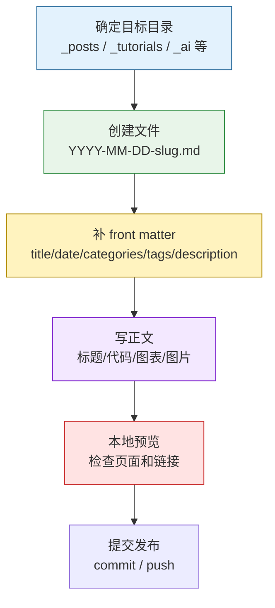

这篇文章整理的是在 Chirpy 里写一篇新文章时最常用的动作：放到哪里、文件怎么命名、front matter 怎么写、图片怎么引用、哪些功能要手动打开，以及写完之后怎么验证。

1. Table of Contents, ordered
{:toc}

# 整体流程

写文章不是“新建一个 Markdown 然后开写”这么简单。稳定一点的流程是：



> Chirpy 已经通过 defaults 给 post 设置了默认 layout，所以一般不用在每篇文章里写 `layout: post`。
{: .prompt-tip }

# 文件名与目录

普通博客文章放到 `_posts`{: .filepath}，文件名必须符合：

```text
YYYY-MM-DD-title.md
YYYY-MM-DD-title.markdown
```

例如：

```text
_posts/2026-07-08-how-to-write-a-post.md
```

在这个博客里还有多个 collection，例如 `_tutorials`、`_ai`、`_life`。集合文章也建议沿用日期前缀和英文 slug，后续归档、搜索和 URL 都更稳定。

如果想用命令快速生成文章，可以参考 [`jekyll-compose`](https://github.com/jekyll/jekyll-compose)。不过本仓库更看重 front matter 的一致性，手动创建也没什么问题。

# Front Matter

Front matter 是 Markdown 文件顶部的 YAML 块，最小结构如下：

```yaml
---
title: TITLE
date: YYYY-MM-DD HH:MM:SS +/-TTTT
categories: [top_category, sub_category]
tags: [tag]
description: "一句话摘要，用于 SEO、feed 和列表页"
---
```

字段建议：

| 字段 | 是否建议 | 说明 |
|------|----------|------|
| `title` | 必填 | 页面标题 |
| `date` | 必填 | 发布时间，带时区最稳 |
| `categories` | 建议 | 作为文章归类树 |
| `tags` | 建议 | 作为检索标签，保持小写 |
| `description` | 建议 | 列表、SEO、分享摘要会用到 |

## Date 与时区

日期建议写完整：

```yaml
date: 2026-07-08 21:30:00 +0800
```

其中 `+0800` 表示东八区。只写本地时间而不写时区，会让“这个时间点到底是哪一刻”变得含糊，后续在 CI 或 GitHub Pages 上构建时就容易出现日期偏移。

## Categories 与 Tags

Chirpy 官方示例里 categories 最多两级：

```yaml
---
categories: [animal, insect]
tags: [bee]
---
```

本仓库会根据集合使用更具体的约定，但原则相同：**categories 是目录感，tags 是关键词感**。两者都保持小写。

## Author

默认情况下，作者信息会从 `_config.yml` 中的 `social.name` 和 `social.links` 获取。多作者文章可以在 `_data/authors.yml` 中定义：

```yaml
<author_id>:
  name: <full name>
  twitter: <twitter_of_author>
  url: <homepage_of_author>
```
{: file="_data/authors.yml" }

然后在文章里指定：

```yaml
---
author: <author_id>
authors: [<author1_id>, <author2_id>]
---
```

> 把作者信息放在 `_data/authors.yml` 的好处是可以生成更完整的元数据，比如 Twitter Cards 里的 creator 信息，对分享和 SEO 都更友好。
{: .prompt-info }

# 目录、评论、数学与图表

这些能力不是每篇文章都必须显式写。优先看 `_config.yml` 的 defaults；只有要覆盖默认行为时才在单篇文章里声明。

## Table of Contents

Chirpy 默认会在右侧面板展示目录。单篇关闭：

```yaml
---
toc: false
---
```

如果正文里需要一个内嵌目录，Kramdown 写法是：

```markdown
1. Table of Contents, ordered
{:toc}
```

## Comments

全站评论系统在 `_config.yml` 中配置。单篇关闭：

```yaml
---
comments: false
---
```

## Mathematics

如果默认没有开启数学公式，单篇开启：

```yaml
---
math: true
---
```

块级公式前后要留空行：

```markdown
$$
LaTeX_math_expression
$$
```

行内公式：

```markdown
这里有一个行内公式 $$ a^2 + b^2 = c^2 $$。
```

## Mermaid

如果默认没有开启 Mermaid，单篇开启：

```yaml
---
mermaid: true
---
```

然后用普通 fenced code block：

````markdown

````

图形选择建议：

| 内容 | 推荐图 |
|------|--------|
| 流程 / 决策 | `flowchart` |
| 调用时序 | `sequenceDiagram` |
| 状态切换 | `stateDiagram-v2` |
| 结构分层 | `block-beta` 或 `flowchart` + `subgraph` |

# 图片

## 图片标题

图片下一行写斜体文本，会显示成 caption：

```markdown

_Image Caption_
```
{: .nolineno}

## 图片尺寸

建议写宽高，避免图片加载后页面抖动：

```markdown
{: width="700" height="400" }
```
{: .nolineno}

Chirpy v5.0.0 之后也支持缩写：

```markdown
{: w="700" h="400" }
```
{: .nolineno}

> SVG 至少要指定宽度，否则可能渲染异常。
{: .prompt-info }

## 图片位置

默认居中。也可以指定位置：

```markdown
{: .normal }
{: .left }
{: .right }
```
{: .nolineno}

> 设置浮动位置后不建议再加 caption，移动端阅读容易挤。
{: .prompt-warning }

## 暗色/亮色模式

准备两张图，再用 `dark` / `light` 类切换：

```markdown
{: .light }
{: .dark }
```

## CDN 前缀

如果图片统一托管在 CDN，可以在 `_config.yml` 里设置：

```yaml
img_cdn: https://cdn.com
```
{: file='_config.yml' .nolineno}

这样正文里的：

```markdown

```
{: .nolineno}

会渲染为：

```html

```
{: .nolineno }

## 文章级图片目录

同一篇文章图片很多时，可以在 front matter 里声明 `img_path`：

```yaml
---
img_path: /img/path/
---
```

正文里就能只写文件名：

```markdown

```
{: .nolineno }

输出会自动补齐路径：

```html

```
{: .nolineno }

## Preview Image 与 LQIP

文章顶部预览图建议使用 `1200 x 630`，比例接近 `1.91 : 1`，否则会被裁剪：

```yaml
---
image:
  path: /path/to/image
  alt: image alternative text
---
```

简单写法：

```yaml
---
image: /path/to/image
---
```

低质量占位图：

```yaml
---
image:
  lqip: /path/to/lqip-file
---
```

普通图片也可以加：

```markdown
{: lqip="/path/to/lqip-file" }
```
{: .nolineno }

# 置顶文章与提示块

置顶：

```yaml
---
pin: true
---
```

提示块写法：

```markdown
> Example line for prompt.
{: .prompt-info }
```
{: .nolineno }

类型包括 `tip`、`info`、`warning`、`danger`。

# 代码语法

行内代码：

```markdown
`inline code part`
```
{: .nolineno }

文件路径：

```markdown
`/path/to/a/file.extend`{: .filepath}
```
{: .nolineno }

普通代码块：

````markdown
```
This is a plaintext code snippet.
```
````

指定语言：

````markdown
```yaml
key: value
```
````

隐藏行号：

````markdown
```shell
echo 'No more line numbers!'
```
{: .nolineno }
````

指定文件名：

````markdown
```shell
# content
```
{: file="path/to/file" }
````

> Chirpy 里不建议再用 Jekyll 的 ``。Markdown fenced code block 更直观。
{: .prompt-danger }

# Liquid 代码

如果文章里要展示 Liquid 片段，可以二选一：

1. 在文章 front matter 里加 `render_with_liquid: false`。
2. 只把代码片段包在 `` 和 `` 中。

示例：

````markdown

```liquid

  This product's title contains the word Pack.

```

````

粗暴禁用全文 Liquid 渲染很省事，但如果文章里还要用 ``、``，就会把自己坑了。别问怎么知道的。

# 视频

视频通过 include 嵌入：

```liquid

```

| Video URL | Platform | ID |
|-----------|----------|----|
| [YouTube 示例](https://www.youtube.com/watch?v=H-B46URT4mg) | `youtube` | `H-B46URT4mg` |
| [Twitch 示例](https://www.twitch.tv/videos/1634779211) | `twitch` | `1634779211` |

# 本地验证

写完后至少做三件事：

```bash
bundle exec jekyll serve
```

1. 打开目标文章页面，看 front matter 是否生效。
2. 检查代码块、公式、Mermaid、图片是否正常渲染。
3. 检查站内链接是否可点击，外链是否不是裸 URL。

更多内容可以看 [Jekyll Docs: Posts](https://jekyllrb.com/docs/posts/)。
