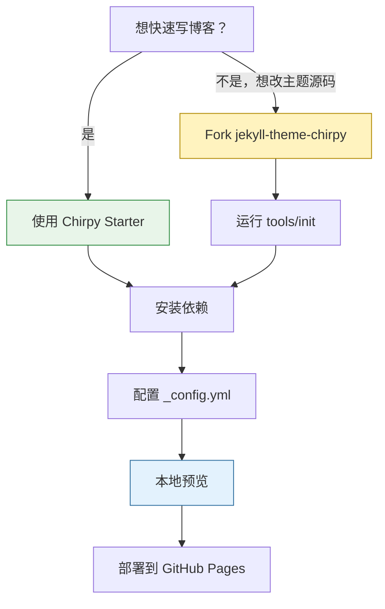
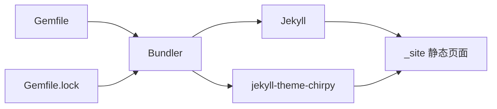

这篇是 Chirpy 博客的启动流程。目标不是把所有配置一次讲完，而是先把站点跑起来：能本地预览，能推到 GitHub Pages，后面再慢慢折腾主题细节。

1. Table of Contents, ordered
{:toc}

# 前置环境

先按 [Jekyll 安装文档](https://jekyllrb.com/docs/installation/) 配好 Ruby、RubyGems 和 Bundler。还需要安装 [Git](https://git-scm.com/)。

推荐确认一下版本：

```console
$ ruby -v
$ bundle -v
$ git --version
```

> 如果 `bundle` 不存在，通常是当前 Ruby 环境里还没装 Bundler，先执行 `gem install bundler`。
{: .prompt-warning }

# 选择创建方式

Chirpy 有两条路：

| 方式 | 适合谁 | 优点 | 代价 |
|------|--------|------|------|
| Chirpy Starter | 大多数博客作者 | 干净、易升级、少维护主题源码 | 深度改主题时要理解 gem 覆盖机制 |
| Fork Chirpy | 想改主题源码的人 | 主题文件都在仓库里，方便魔改 | 后续升级更麻烦 |



# 创建站点

## 方式一：Chirpy Starter

登录 GitHub，打开 [Chirpy Starter][starter]，点击 <kbd>Use this template</kbd> → <kbd>Create a new repository</kbd>。

如果要部署为个人主页，仓库名使用：

```text
USERNAME.github.io
```

其中 `USERNAME` 是 GitHub 用户名。

## 方式二：Fork Chirpy

如果确实想维护主题源码，可以 [fork Chirpy](https://github.com/cotes2020/jekyll-theme-chirpy/fork)，然后把仓库重命名为 `USERNAME.github.io`。

接着 clone 到本地。Fork 模式还需要安装 [Node.js][nodejs]，再执行初始化：

```console
$ bash tools/init
```

如果不打算部署到 GitHub Pages，可以加：

```console
$ bash tools/init --no-gh
```

这个脚本会做几件事：

1. 切到最新 tag，避免默认分支的开发中代码影响站点稳定性。
2. 删除非必要样例文件。
3. 构建 JavaScript 文件到 `assets/js/dist/`{: .filepath} 并纳入 Git。
4. 自动提交一次初始化结果。

# 安装依赖

进入站点根目录：

```console
$ bundle
```

这一步会根据 `Gemfile` / `Gemfile.lock` 安装 Jekyll、Chirpy 和相关 gem。

依赖关系可以理解成这样：



# 基础配置

主要改 `_config.yml`{: .filepath}。先关注这几个变量：

| 变量 | 作用 |
|------|------|
| `url` | 站点根域名，部署前必须正确 |
| `baseurl` | 项目站点子路径，用户站点通常为空 |
| `avatar` | 侧边栏头像 |
| `timezone` | 日期显示时区 |
| `lang` | 界面语言 |

社交联系方式显示在侧边栏底部，配置文件是 `_data/contact.yml`{: .filepath }。

> 修改 `_config.yml` 后通常需要重启本地 Jekyll server。别盯着浏览器刷新半天，最后才发现服务根本没读到新配置。
{: .prompt-warning }

# 自定义样式与静态资源

如果要改样式，可以把主题里的 `assets/css/jekyll-theme-chirpy.scss`{: .filepath} 复制到站点同路径，然后在末尾追加自定义样式。

Chirpy `6.2.0` 之后，如果想覆盖 `_sass/addon/variables.scss`{: .filepath} 里的 Sass 变量，可以：

1. 把 `_sass/main.scss`{: .filepath} 复制到站点的 `_sass`{: .filepath} 目录。
2. 创建 `_sass/variables-hook.scss`{: .filepath}。
3. 在 hook 文件里覆盖变量。

静态资源 CDN 配置在 `_data/origin/cors.yml`{: .filepath}。如果所在地区访问默认 CDN 慢，可以替换其中部分资源；也可以参考 [_chirpy-static-assets_](https://github.com/cotes2020/chirpy-static-assets#readme) 自托管静态资源。

# 本地预览

启动：

```console
$ bundle exec jekyll s
```

几秒后打开 [本地预览地址](http://127.0.0.1:4000)。

验收时看四件事：

| 检查项 | 预期 |
|--------|------|
| 首页 | 能打开，侧边栏正常 |
| 文章页 | 标题、目录、代码块正常 |
| 搜索 | 输入关键词有响应 |
| 控制台 | 没有明显资源加载失败 |

# 部署

部署前检查 `_config.yml`{: .filepath}：

- 个人站点 `USERNAME.github.io`：通常 `baseurl` 为空。
- 项目站点：`baseurl` 要写成 `/project-name`。
- 自定义域名：`url` 要写正式域名。

## GitHub Actions

推荐使用 GitHub Actions。

1. 打开仓库的 _Settings_ → _Pages_。
2. 在 _Build and deployment_ 的 _Source_ 中选择 [GitHub Actions][pages-workflow-src]。

推送代码后，在仓库的 _Actions_ 页面可以看到构建流程。成功后 GitHub Pages 会自动发布。

如果你提交了 `Gemfile.lock`{: .filepath}，且本机不是 Linux，建议补 Linux 平台：

```console
$ bundle lock --add-platform x86_64-linux
```

## 手动构建

如果部署到自己的服务器，可以本地构建后上传 `_site`{: .filepath}：

```console
$ JEKYLL_ENV=production bundle exec jekyll b
```

默认输出目录是项目根目录下的 `_site`{: .filepath}。

# 常见坑

| 现象 | 可能原因 | 处理 |
|------|----------|------|
| 本地能跑，GitHub Actions 失败 | Linux 平台没写入 lock | `bundle lock --add-platform x86_64-linux` |
| 页面路径不对 | `url` / `baseurl` 配错 | 按站点类型重新配置 |
| 修改配置没生效 | server 没重启 | 停掉再启动 |
| 搜索或样式异常 | 静态资源没加载 | 看浏览器 Network 面板 |

[nodejs]: https://nodejs.org/
[starter]: https://github.com/cotes2020/chirpy-starter
[pages-workflow-src]: https://docs.github.com/en/pages/getting-started-with-github-pages/configuring-a-publishing-source-for-your-github-pages-site#publishing-with-a-custom-github-actions-workflow
[latest-tag]: https://github.com/cotes2020/jekyll-theme-chirpy/tags
