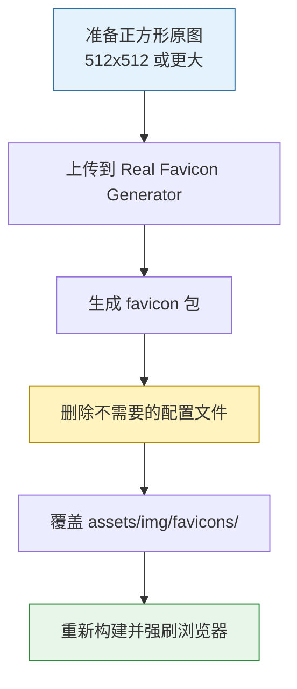

Chirpy 的 favicon 放在 `assets/img/favicons/`{: .filepath}。如果想把默认图标换成自己的图标，流程很短，但有两个细节容易漏：**不要把生成器给的配置文件全盘照搬**，以及**浏览器会强缓存 favicon**。

1. Table of Contents, ordered
{:toc}

# 替换流程



# 准备原图

准备一张正方形图片，格式可以是 PNG、JPG 或 SVG，尺寸建议不小于 `512x512`。

然后打开 [Real Favicon Generator](https://realfavicongenerator.net/)，点击 <kbd>Select your Favicon image</kbd> 上传图片。

在后续页面里可以先保留默认选项，滚动到底部，点击 <kbd>Generate your Favicons and HTML code</kbd>。

# 下载并替换

下载生成的压缩包后，解压并删除这两个文件：

- `browserconfig.xml`{: .filepath}
- `site.webmanifest`{: .filepath}

然后把剩余图片文件复制到站点的 `assets/img/favicons/`{: .filepath}，覆盖原来的图标文件。如果站点还没有这个目录，就创建它。

| 文件 | 从生成器保留 | 说明 |
|------|--------------|------|
| `*.png` | 是 | 各尺寸 favicon |
| `*.ico` | 是 | 传统浏览器兼容 |
| `browserconfig.xml` | 否 | Chirpy 已有自己的处理方式 |
| `site.webmanifest` | 否 | 避免和主题配置冲突 |

> favicon 文件名最好沿用主题已有命名。这样不用再改模板引用路径，少一类“图标生成了但页面没引用”的问题。
{: .prompt-tip }

# 本地验证

重新启动或构建站点：

```bash
bundle exec jekyll serve
```

然后检查：

1. 打开首页，看浏览器标签页图标是否变化。
2. 打开开发者工具的 Network 面板，过滤 `favicon`，确认请求返回 `200`。
3. 如果图标没变，使用强制刷新，或者开无痕窗口验证。

> favicon 被缓存得很积极。你改了文件但浏览器还显示旧图标，不一定是你又搞砸了，有可能只是缓存还没放过你。
{: .prompt-warning }
