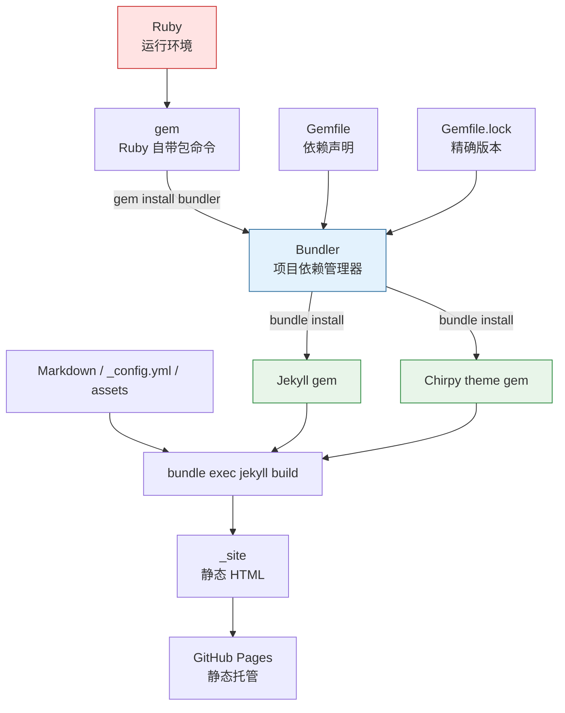
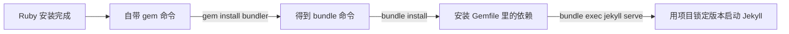
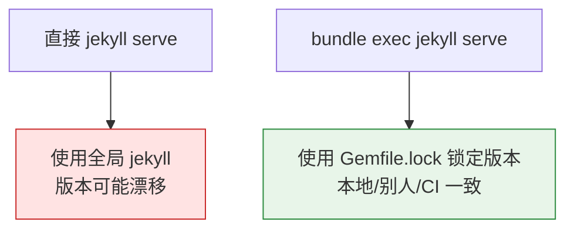
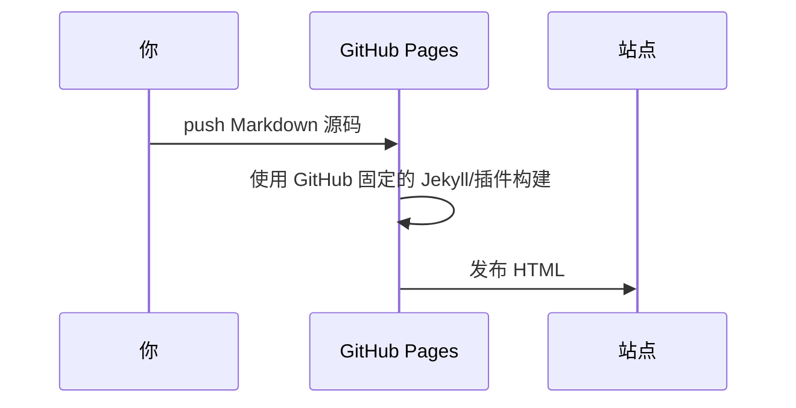
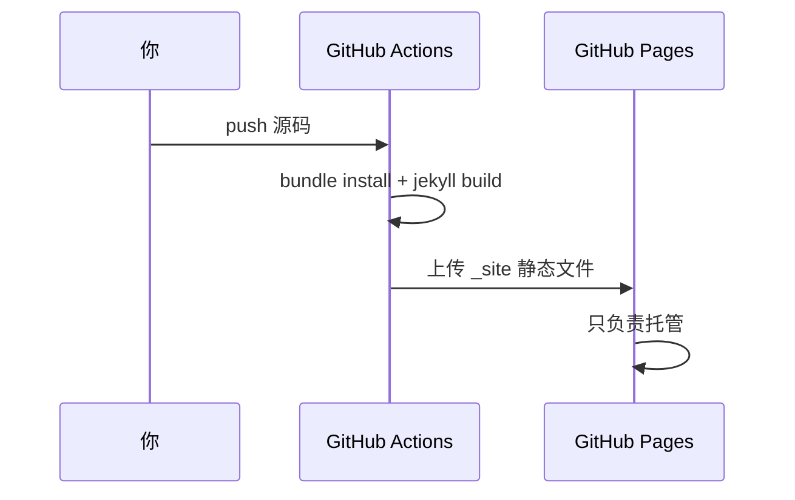
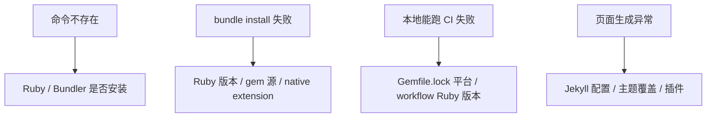

使用 GitHub 搭建[个人网站](https://puppylpg.github.io)，是一件很炫酷的事情。以后有什么所思所学都可以发布在自己的网站上，很方便。（同时为了丰富网站内容，还会经常不自觉地开始学习 :D，简直是进步神器~）

> 最重要的是，这一切还不用自己花钱买服务器 :D

1. Table of Contents, ordered
{:toc}

# 从这个项目开始

这个博客基于 [Jekyll](https://jekyllrb.com/) + [Chirpy](https://github.com/cotes2020/jekyll-theme-chirpy) 主题，源码放在 [puppylpg.github.io](https://github.com/puppylpg/puppylpg.github.io) 仓库。先把角色分清楚：

| 组件 | 作用 | 类比 |
|------|------|------|
| Ruby | Jekyll 的运行环境 | Python / JVM |
| RubyGems `gem` | Ruby 自带的包安装命令 | `pip` 的底层角色 |
| Bundler | 项目级依赖管理器 | Poetry / Pipenv / Maven 的依赖管理部分 |
| Gemfile | 声明项目依赖 | `pyproject.toml` / `pom.xml` |
| Gemfile.lock | 锁定精确依赖版本 | `poetry.lock` |
| Jekyll | 静态站点生成器 | 把 Markdown 编译成 HTML |
| Chirpy | Jekyll 主题 gem | 提供布局、样式、JS |

整体关系如下：



本地启动通常只需要：

```bash
bundle install
bundle exec jekyll serve
```

或者使用本仓库脚本：

```bash
bin/jekyll-dev.sh start
bin/jekyll-dev.sh stop
```

看起来很简单，但第一次从 Python 或 Java 过来，常见疑问是：**为什么是 `bundle exec`，不能直接 `jekyll serve` 吗？`gem` 和 `bundle` 又是什么套娃？**

# Ruby 包管理：两层套娃

## 与 Python、Java 对比

| 维度 | Python | Ruby | Java/Maven |
|------|--------|------|------------|
| 包 | package / distribution | gem | artifact / jar |
| 中央仓库 | PyPI | RubyGems | Maven Central |
| 依赖声明 | `requirements.txt` / `pyproject.toml` | `Gemfile` | `pom.xml` |
| 锁文件 | `Pipfile.lock` / `poetry.lock` | `Gemfile.lock` | Maven 无标准锁文件 |
| 安装依赖 | `pip install` / `poetry install` | `bundle install` | `mvn install` |
| 项目上下文运行 | `poetry run` / `pipenv run` | `bundle exec` | Maven 命令天然带项目上下文 |

Maven 的职责更广，不只管理依赖，还管 compile、test、package、deploy。Bundler 更像只负责“按这个项目的依赖版本运行 Ruby 程序”。

## 包管理器从哪来

最容易绕晕的是：包管理器本身也要安装。



- **Python**：多数情况下 pip 随 Python 可用，一层结构。
- **Ruby**：Ruby 自带 `gem`，先用 `gem` 装 Bundler，再由 Bundler 管项目依赖，两层套娃。
- **Java/Maven**：Maven 独立安装，Maven 自己不是被项目依赖管理的 jar。

> `bundle install` 报 `cannot load such file -- bundler`，通常是切换 Ruby 版本后，新 Ruby 环境里还没有 Bundler。重新 `gem install bundler` 即可。
{: .prompt-warning }

# 为什么要 `bundle exec`

可以直接运行 `jekyll serve`，但不推荐。直接运行会使用全局环境里优先找到的 Jekyll，版本可能和项目 `Gemfile.lock` 不一致。

`bundle exec` 的意思是：**在当前项目的 Gemfile/Gemfile.lock 约束下运行命令**。



这和 Python 里的 `poetry run`、`pipenv run` 很像。少打几个字可能没事，但踩到版本不一致时会很烦。

# 这个项目的依赖结构

核心依赖通常写在 `Gemfile`：

```ruby
gem "jekyll-theme-chirpy", "~> 6.2.3", "< 6.3"
```

`bundle install` 会解析 Chirpy 的传递依赖，把 Jekyll、插件、构建工具都写入 `Gemfile.lock`。

常用命令：

```bash
bundle install          # 按锁文件安装
bundle update <gem>     # 更新某个 gem
bundle exec jekyll s    # 在项目依赖上下文中启动
```

验收方式：

```bash
bundle exec jekyll -v
bundle exec ruby -v
```

如果 CI 和本地版本不一致，先看 `Gemfile.lock`，再看 workflow 指定的 Ruby 版本。

# GitHub Pages 的两种模式

GitHub Pages 看起来都是“push 后发布”，但背后有两种完全不同的模式。

## 默认 Pages 构建



这种模式下，Jekyll 版本和插件受 GitHub Pages 限制，具体白名单看 [GitHub Pages dependency versions](https://pages.github.com/versions/)。你的 `Gemfile` 约束不一定按你想的方式生效。

## GitHub Actions 自定义构建



本博客使用这种模式。此时 GitHub Pages 不再参与 Jekyll 构建，只负责托管 Actions 生成的 `_site`。

区别总结：

| 模式 | 谁构建 | Jekyll 版本 | 插件限制 |
|------|--------|-------------|----------|
| Pages 默认构建 | GitHub Pages | GitHub 固定 | 白名单限制 |
| Actions 自定义构建 | 你的 workflow | `Gemfile.lock` 控制 | 基本由项目控制 |

# 本地与 CI 对齐

## gem 版本

本地执行：

```bash
bundle install
```

这会按 `Gemfile.lock` 安装依赖。依赖出问题时，先不要盲目 `bundle update`，因为它会改变锁定版本。先确认报错是不是本地 Ruby、平台或 native extension 的问题。

## Ruby 版本

本地 Ruby 不一定要和 CI 完全一致，但必须满足所有 gem 的版本约束。用 rbenv 管理会省心一些：

```bash
brew install rbenv ruby-build

echo 'export PATH="$HOME/.rbenv/bin:$PATH"' >> ~/.zshrc
echo 'eval "$(rbenv init - zsh)"' >> ~/.zshrc
source ~/.zshrc

export RUBY_BUILD_MIRROR_URL=https://cache.ruby-china.com/
rbenv install 3.3.5
rbenv local 3.3.5
```

> 具体版本以项目 CI 和 `Gemfile.lock` 为准。不要把“我电脑上能跑”当成版本策略，CI 才是最终验收环境。
{: .prompt-info }

## gem 源

如果网络慢，可以切换 RubyGems 源：

```bash
gem sources --add https://gems.ruby-china.com/ --remove https://rubygems.org/
```

Gemfile 也可以配置镜像源。切源后重新 `bundle install` 即可。

# 兼容性坑点

升级 Ruby 大版本时尤其要看两类 gem：

| 类型 | 风险 | 例子 |
|------|------|------|
| native extension | 需要针对 Ruby 重新编译 | `nokogiri`、`ffi`、`sass-embedded` |
| 限制 Ruby 版本 | 直接不兼容 | 某些旧版 `html-proofer` |

查看远端 gem 的 Ruby 版本要求：

```bash
gem specification --remote <gem名> -v <版本> | grep -A8 required_ruby_version
```

# 排查顺序

遇到 Jekyll 环境问题时，我一般按这个顺序排：



最小验收命令：

```bash
bundle install
bundle exec jekyll build
bundle exec jekyll serve
```

如果这三步都能过，Ruby 环境基本就稳了。剩下就是文章内容和主题配置的问题了。
