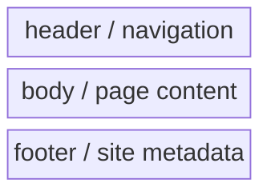
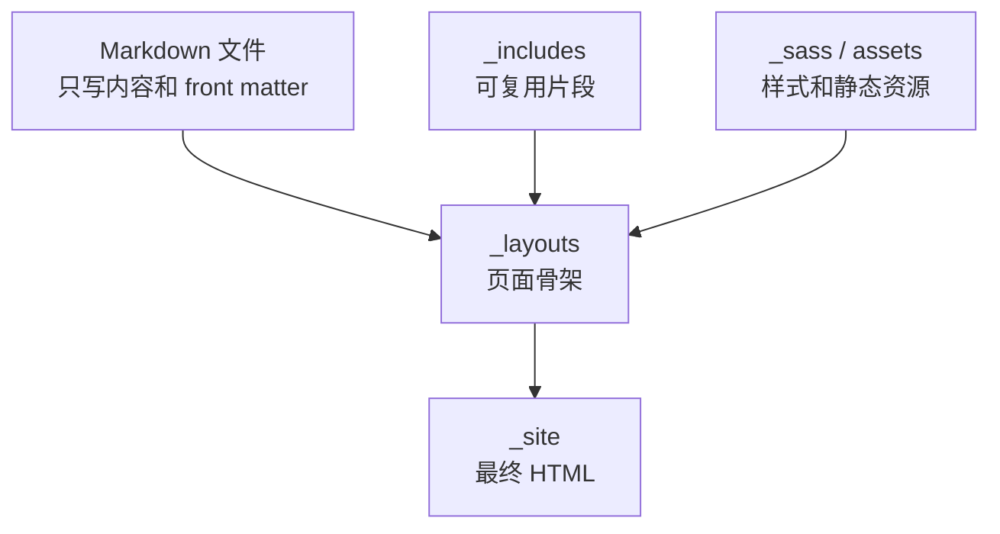
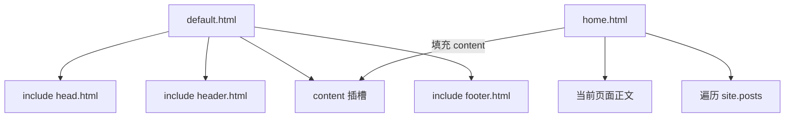
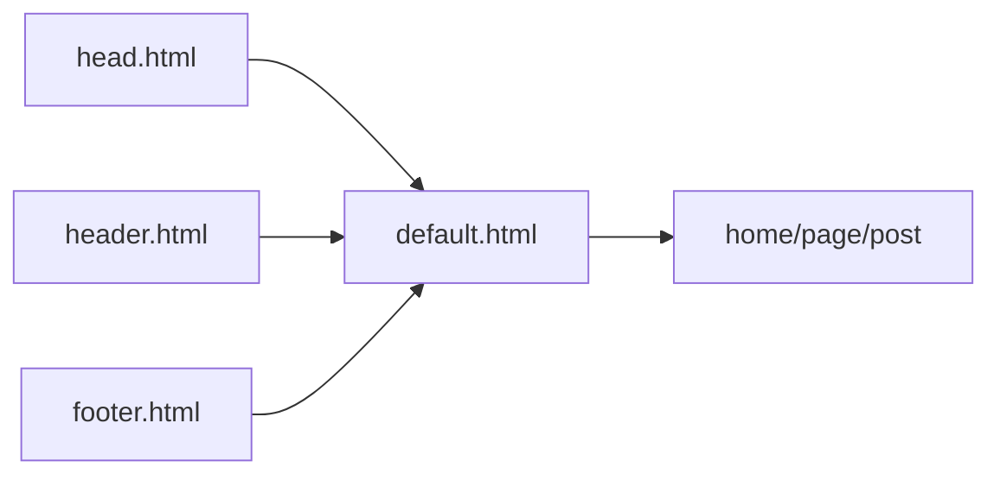
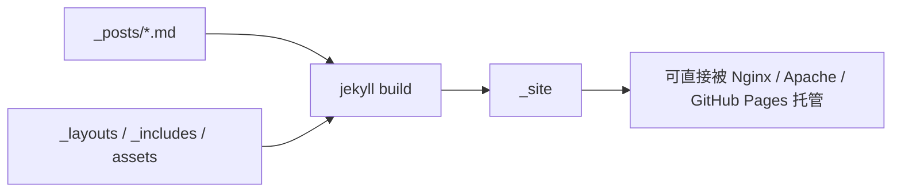

使用 Jekyll 搭建静态网站是一件容易上手、非常优雅且令人愉悦的事情，甚至让我这个服务端程序猿产生了能搞一搞前端的错觉 :D

Jekyll 的好处是：写博客时主要关心内容，主题负责网页框架。这里以 Jekyll 默认主题 minima 为例，看清楚一个 Jekyll 主题到底怎么把 Markdown 变成页面。

1. Table of Contents, ordered
{:toc}

# 先建立页面模型

一个普通网页大致有三块：



真正写文章时，通常只有中间的 `body` 会变。导航栏、页脚、head 标签、脚本、样式都应该复用。Jekyll 的 `_layouts` 和 `_includes` 就是在解决这个问题。



# 找到 minima 的安装目录

如果 minima 作为 gem 安装，可以用 Bundler 找位置：

```bash
bundle show minima
```

示例输出：

```text
/home/win-pichu/Codes/Java/puppylpg.github.io/vendor/bundle/ruby/2.6.0/gems/minima-2.5.0
```

目录大致如下：

```text
.
├── assets
│   ├── main.scss
│   └── minima-social-icons.svg
├── _includes
│   ├── footer.html
│   ├── header.html
│   ├── head.html
│   └── social.html
├── _layouts
│   ├── default.html
│   ├── home.html
│   ├── page.html
│   └── post.html
└── _sass
    ├── minima
    │   ├── _base.scss
    │   ├── _layout.scss
    │   └── _syntax-highlighting.scss
    └── minima.scss
```

可以对照 [Jekyll 目录结构文档](https://jekyllrb.com/docs/structure/) 看每个目录的职责。

# Layout：页面模板

## `default.html`：一级模板

minima 的根模板大致是：

```html
<!DOCTYPE html>
<html lang="{{ page.lang | default: site.lang | default: "en" }}">
  

  <body>
    

    <main class="page-content" aria-label="Content">
      <div class="wrapper">
        {{ content }}
      </div>
    </main>

    
  </body>
</html>
```

它做了三件事：

| 位置 | 来源 | 作用 |
|------|------|------|
| `<head>` | `head.html` | meta、CSS、RSS、SEO 等 |
| `<header>` | `header.html` | 站点标题和导航栏 |
| `{{ content }}` | 子模板或文章正文 | 当前页面真正的内容 |
| `<footer>` | `footer.html` | 站点页脚 |

## `home.html`：二级模板

`home.html` 自己又声明了父模板：

```html
---
layout: default
---

<div class="home">
  {{ content }}

  
    <ul class="post-list">
      
        <li>
          <a class="post-link" href="{{ post.url | relative_url }}">
            {{ post.title | escape }}
          </a>
        </li>
      
    </ul>
  
</div>
```

也就是说，`home.html` 的内容会替换 `default.html` 里的 `{{ content }}`。最终页面结构是：



这就是 layout 叠加的核心：**父模板负责通用页面骨架，子模板负责当前页面类型的内容组织**。

## `page.html` 与 `post.html`

`page.html` 用于普通页面：

```html
---
layout: default
---
<article class="post">
  <header class="post-header">
    <h1 class="post-title">{{ page.title | escape }}</h1>
  </header>

  <div class="post-content">
    {{ content }}
  </div>
</article>
```

`post.html` 则多了文章日期、作者、评论、结构化数据等博客文章特有内容。

写文章时只要在 front matter 里指定：

```yaml
---
title: "Welcome to Jekyll!"
date: 2019-11-16 02:08:37 +0800
categories: jekyll update
---
```

Jekyll 就会把正文塞进 `post.html` 的 `{{ content }}` 里。

更多 layout 规则可以看 [Jekyll layouts 文档](https://jekyllrb.com/docs/step-by-step/04-layouts/)。

# Include：页面组件

`default.html` 里出现的：

```liquid


```

就是 include。它的作用类似函数：把可复用片段抽出来，多个 layout 里都能引用。



导航栏、页脚、评论区、SEO 标签都适合用 include。更多用法看 [Jekyll includes 文档](https://jekyllrb.com/docs/step-by-step/05-includes/)。

# 站点目录结构

使用 Jekyll 初始化后，一个项目大致像这样：

```text
.
├── 404.html
├── about.markdown
├── _config.yml
├── Gemfile
├── Gemfile.lock
├── index.markdown
├── _posts
│   └── 2019-11-16-welcome-to-jekyll.markdown
└── _site
```

关键目录：

| 路径 | 作用 |
|------|------|
| `_posts` | 博客文章，文件名带日期 |
| `_site` | 构建后的静态网站 |
| `_layouts` | 页面模板 |
| `_includes` | 可复用组件 |
| `_sass` / `assets` | 样式和静态资源 |
| `_config.yml` | 全站配置 |
| `Gemfile` / `Gemfile.lock` | Ruby 依赖声明与锁定 |

# `_posts`：文章集合

文章放在 `_posts`，文件名必须类似：

```text
_posts/2018-08-20-bananas.md
```

文章的 front matter 提供模板需要的信息，例如标题、日期、分类。正文在构建时进入 `{{ content }}`。

Jekyll 的示例文章会告诉你：

- 文件在 `_posts`。
- 文件名必须包含 `YEAR-MONTH-DAY-title`。
- 文章要有 front matter。
- 代码可以用 fenced code block 或 Jekyll highlight。

现在建议优先用 Markdown fenced code block，简单、直观、主题兼容也更好。

# 访问所有文章：`site.posts`

`site.posts` 表示 `_posts` 下所有已发布文章。目录页可以这样写：

```html
<ul>
  
    <li>
      <span>{{ post.date | date: "%Y-%m-%d" }}</span>
      <a href="{{ post.url | relative_url }}">{{ post.title }}</a>
    </li>
  
</ul>
```

这也是 `home.html` 能列出文章的原因。更多内容看 [Jekyll blogging 文档](https://jekyllrb.com/docs/step-by-step/08-blogging/)。

# `_site`：最终静态网站

`_site` 是构建结果。模板、Markdown、Liquid、Sass 最终都在这里被组装成 HTML、CSS、JS。



把 `_site` 拷到 Apache 或 Nginx 的静态目录里，一个静态网站就可以访问了。

# `index.md` 与 `about.md`

首页通常使用 `home` layout：

```yaml
---
layout: home
title: Home
list_title: puppylpg wanna say -
---
Welcome to puppylpg's home website, pika~
```

`about.md` 通常使用 `page` layout，并通过 `permalink` 指定路径：

```yaml
---
layout: page
title: About
permalink: /about/
---
```

如果不指定 `permalink`，页面路径通常跟文件路径相关。

# `_config.yml`

`_config.yml` 可以配置：

- 全站变量，例如 `title`、`description`、`timezone`。
- 主题，例如 `theme: minima`。
- 插件。
- permalink。
- defaults。

> 修改 `_config.yml` 后需要重启 Jekyll server。别问，盯着浏览器刷新十分钟这种事真的会发生。
{: .prompt-warning }

配置文档可以看 [Jekyll configuration](https://jekyllrb.com/docs/configuration/)。

# `Gemfile` 与 `Gemfile.lock`

`Gemfile` 声明依赖范围，`Gemfile.lock` 锁定最后解析出的精确版本。

常见命令：

```bash
bundle install
bundle update <gem>
```

`Gemfile.lock` 相当于“这套依赖曾经成功构建过”的快照。团队协作和 CI 都依赖它保证一致性。Bundler 的设计理念可以看 [Bundler rationale](https://bundler.io/v1.7/rationale.html#checking-your-code-into-version-control)。

# 本地覆盖主题文件

gem 主题有一个重要机制：**站点本地同路径文件优先于主题 gem 内文件**。

比如你在项目里创建：

```text
_layouts/post.html
```

Jekyll 会优先使用你本地的 `post.html`，而不是 minima gem 里的那个。这是自定义主题最常用的方式，也是未来升级主题时最容易产生“手动合并债务”的地方。

# 验证方式

改完结构或模板后，按这个顺序验证：

```bash
bundle exec jekyll build
bundle exec jekyll serve
```

然后检查：

| 检查项 | 预期 |
|--------|------|
| 首页 | 能列出文章 |
| 文章页 | 标题、日期、正文结构正确 |
| about 页 | `/about/` 可访问 |
| `_site` | 能看到生成后的 HTML |

# 小结

minima 虽然简单，但它把 Jekyll 的核心结构展示得很清楚：

- `_layouts` 管页面骨架。
- `_includes` 管可复用组件。
- `_posts` 管博客文章。
- `_site` 是最终静态网站。
- 本地同路径文件可以覆盖 gem 主题文件。

折腾两天之后，不得不感叹前端的东西果然丰富多彩。比如想给网站添加 sidebar，里面放文章目录内容，虽然勉强能搞定，但细节要处理一堆。前端折腾确实耗时间，而我要学的东西还很多，所以先这样吧：网站看起来凑合能用了，字体、sidebar、图片之类的东西，用着用着慢慢改，挺好的。

参考：

- [minima 官方仓库](https://github.com/jekyll/minima/blob/master/README.md)
- [Jekyll 官网](https://jekyllrb.com/)
- [github-pages gem](https://github.com/github/pages-gem)
