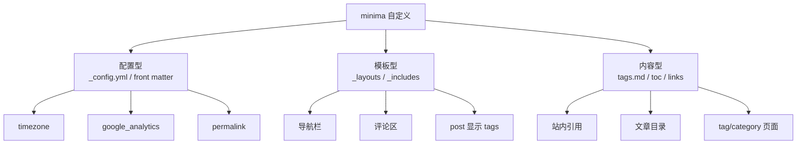
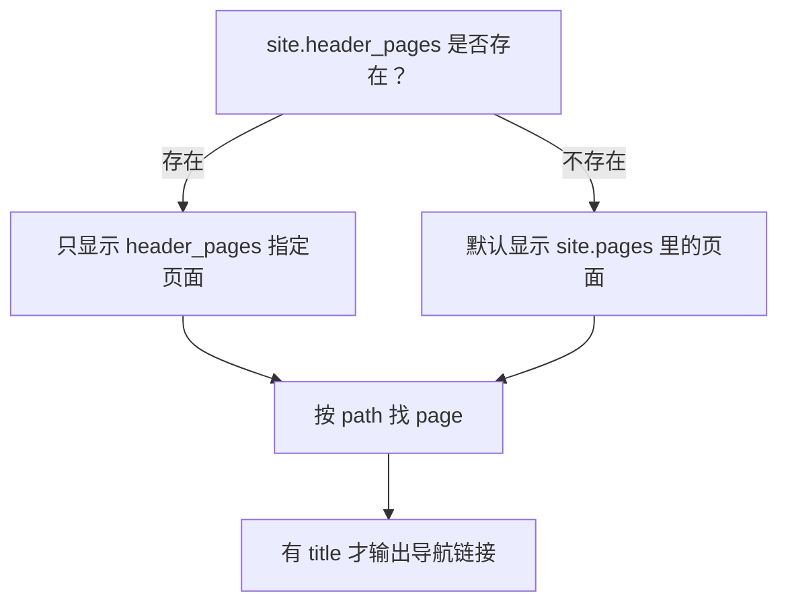
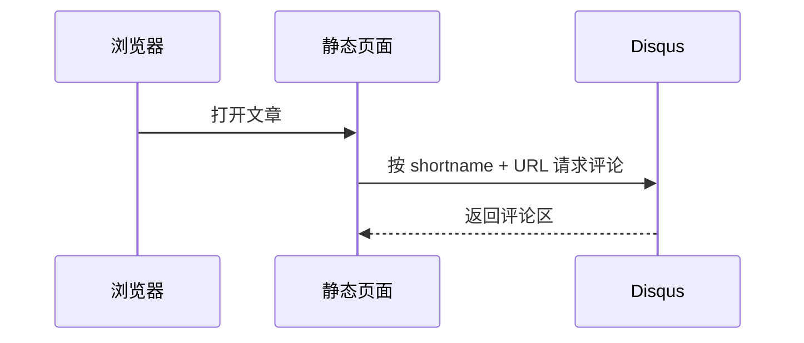

minima 是 Jekyll 默认主题，也是最简单的主题，很符合 Keep It Stupid and Simple 的原则。默认主题适合大众，但不一定完全适合自己的口味，所以理解一些原理，再增加自己想要的东西，很有必要。

1. Table of Contents, ordered
{:toc}

# 自定义地图

minima 的自定义大致分三类：



教程化一点的顺序是：先改配置，再看模板，最后补内容页。

# 环境变量

Jekyll 支持环境变量，最常用的是 `JEKYLL_ENV`。默认是 `development`，生产环境通常设为 `production`。

在 Liquid 中可以用 `jekyll.environment` 访问：

```ruby

  <script src="my-analytics-script.js"></script>

```

本地模拟生产环境：

```bash
JEKYLL_ENV=production bundle exec jekyll serve
```

验证方式：打开页面源代码，确认只应该在线上出现的脚本是否被注入。

参考：

- [Jekyll environments](https://jekyllrb.com/docs/configuration/environments/)
- [Jekyll command usage](https://jekyllrb.com/docs/usage/)
- [Liquid 文档](https://shopify.github.io/liquid/)

# 页面路径

页面路径有两种控制方式：

| 方式 | 位置 | 适合场景 |
|------|------|----------|
| `permalink` | 单篇 front matter | 单独指定某个页面路径 |
| 全局 `permalink` | `_config.yml` | 统一配置 posts 路径规则 |

示例：

```yaml
permalink: /:categories/:year/:month/:day/:title:output_ext
```

这意味着 `categories`、`date`、`title` 都会影响最终 URL。路径设计尽量一开始想清楚，后面改 URL 会影响评论、搜索索引和外链。

更多规则看 [Jekyll permalinks](https://jekyllrb.com/docs/permalinks/)。

# 自定义导航栏

minima 的导航栏逻辑在 `header.html`。核心逻辑是：

```html




  
  
    <a class="page-link" href="{{ my_page.url | relative_url }}">
      {{ my_page.title | escape }}
    </a>
  

```

翻译一下：



如果不配置 `site.header_pages`，根目录里的页面可能都会出现在导航栏里，连 `CHANGELOG.md` 都可能混进来。要显式控制导航栏，在 `_config.yml` 中写：

```yaml
header_pages:
  - about.md
  - index.md
```

验证方式：重启本地服务，看导航栏是否只剩指定页面。

参考：

- [Liquid map filter](https://shopify.github.io/liquid/filters/map/)
- [Liquid where filter](https://shopify.github.io/liquid/filters/where/)
- [Jekyll site variables](https://jekyllrb.com/docs/variables/#site-variables)

# 评论系统

minima 默认支持 Disqus。思路是：静态页面本身不存评论，页面加载时根据 URL 去 Disqus 拉取对应评论。



配置 `_config.yml`：

```yaml
disqus:
  shortname: <your-shortname>
```

模板里 include 评论区即可。可以参考 [Disqus comments for Jekyll](https://desiredpersona.com/disqus-comments-jekyll/)。

> 在一个中文网站里接入了国外评论系统，应该注定我的网站是不会有人评论的吧……
{: .prompt-info }

踩坑点：

- Disqus 按 URL 分组，改 URL 可能导致老评论对不上。
- 测试域名不在可信列表时可能不显示，报错可参考 [Disqus load failure 文档](https://help.disqus.com/en/articles/1717301-i-m-receiving-the-message-we-were-unable-to-load-disqus)。

# 禁用 Liquid 模板渲染

写 Jekyll 教程时经常要展示 Liquid 代码。问题是：代码块里的 Liquid tag 也可能被 Jekyll 先渲染掉。

Jekyll 4.0+ 可以在 front matter 中使用：

```yaml
render_with_liquid: false
```

但这个粒度很粗。整篇文章都不渲染 Liquid 后，``、`` 这类站内引用也会失效。

更稳的做法是只包住代码片段：

```liquid

{{ page.title }}

```

> 但是如果这一篇文章本身就是介绍 Liquid 的 filter 和 tag，一个个加 `raw...endraw`，我快疯了……
{: .prompt-warning }

参考 [Liquid raw tag](https://shopify.github.io/liquid/tags/raw/) 和 [Jekyll Liquid tags](https://jekyllrb.com/docs/liquid/tags/)。

# 站内引用

引用 posts 时可以用 `post_url`：

```markdown
[文章标题]()
```

普通页面或 collection 文件可以用 `link`：

```markdown
[minima 结构]()
```

这样即使 permalink 改了，Jekyll 也能在构建时生成正确链接。更多看 [Jekyll linking to posts](https://jekyllrb.com/docs/liquid/tags/#linking-to-posts)。

# 文章目录

Jekyll 默认使用 [Kramdown](https://kramdown.gettalong.org/) 解析 Markdown。Kramdown 的 TOC 写法是：

```markdown
1. Table of Contents, ordered
{:toc}
```

无序目录也可以：

```markdown
* Table of Contents
{:toc}
```

如果某个标题不想进入目录：

```markdown
# Header
{:.no_toc}
```

> `Table of Contents` 这行文字会被目录替换，所以它写什么不重要。写 `blabla` 也行，只是以后看到会怀疑自己当时在干什么。
{: .prompt-info }

参考 [Kramdown TOC](https://kramdown.gettalong.org/converter/html.html#toc)。

# post 页面显示 tags

minima 的 post 模板默认主要显示 title、date、content。如果想在文章页展示 tags，可以覆盖主题模板。

新增或复制主题中的 `_layouts/post.html`，在日期附近加：

```html
<div>
  {{ page.tags | join: ' | ' }}
</div>
```

这里用到了 Liquid 的 [join filter](https://shopify.github.io/liquid/filters/join/)。

Jekyll 会优先使用项目本地的 `_layouts/post.html`，从而覆盖 gem 主题里的同路径文件。

# 增加 tag/category 页面

Jekyll 可以通过 `site.tags` 获取所有 tag。其结构可以理解为：

```text
[
  [tagA, [postA1, postA2]],
  [tagB, [postB1, postB2]]
]
```

新增 `tags.md`：

```html
---
layout: page
title: Tag
permalink: /tag/
---



  <h3>{{ tag[0] }}</h3>
  <ul>
    
      <li><a href="{{ post.url }}">{{ post.title }}</a></li>
    
  </ul>

```

关键点：

1. `site.tags | sort` 先排序。
2. `tag[0]` 是 tag 名。
3. `tag[1]` 是该 tag 下的文章数组。

参考 [Jekyll categories and tags](https://jekyllrb.com/docs/posts/#categories-and-tags)。

# 自定义时区

文章 front matter 中可以写：

```yaml
date: 2019-12-10 02:11:29 +0800
```

这表示一个明确的时间点：东八区 2019-12-10 02:11:29。问题在于，显示时区还取决于构建机器或 `_config.yml`。

如果 GitHub Pages 按 UTC 构建，可能显示成：

```html
<time datetime="2019-12-09T18:11:29+00:00">Dec 9, 2019</time>
```

解决办法是在 `_config.yml` 中写：

```yaml
timezone: Asia/Shanghai
```

> 带时区的 `date` 只是准确描述“同一刻”。最终按哪个时区展示，还要看 Jekyll 的 `timezone` 设置。
{: .prompt-tip }

# Google Analytics

Google Analytics 的本质是往页面里注入一段统计脚本。minima 已经准备了模板，只要配置 id：

```yaml
google_analytics: <your-user-id>
```

通常 analytics 代码只在 `JEKYLL_ENV=production` 时注入，这样本地测试不会污染统计数据。

验证方式：

```bash
JEKYLL_ENV=production bundle exec jekyll serve
```

然后查看页面源代码，确认 analytics 脚本是否出现。

# SEO

SEO（Search Engine Optimization）不是“给网页起个好标题”这么简单，但 meta 标签确实是基础。

网页的 `<head>` 中可以放大量 `<meta>` 标签，用来告诉搜索引擎：

- 文章标题是什么。
- 摘要是什么。
- 作者是谁。
- canonical URL 是什么。
- Open Graph / Twitter Card 分享信息是什么。
- 结构化数据是什么。

Jekyll 可以用 [`jekyll-seo-tag`](https://github.com/jekyll/jekyll-seo-tag) 自动生成这些标签。安装方式看 [jekyll-seo-tag installation](https://github.com/jekyll/jekyll-seo-tag/blob/master/docs/installation.md)，生成内容看 [jekyll-seo-tag usage](https://github.com/jekyll/jekyll-seo-tag/blob/master/docs/usage.md)。

装完后查看页面源代码，应该能看到类似：

```html
<!-- Begin Jekyll SEO tag -->
<title>文章标题 | 站点名</title>
<meta name="description" content="文章摘要" />
<meta property="og:title" content="文章标题" />
<meta property="og:url" content="http://localhost:4444/example/" />
<script type="application/ld+json">
{"@type":"BlogPosting","headline":"文章标题"}
</script>
<!-- End Jekyll SEO tag -->
```

更完整的 SEO 指南可以看 [Google SEO Starter Guide](https://developers.google.com/search/docs/beginner/seo-starter-guide?hl=zh-cn) 和 [Google structured data introduction](https://developers.google.com/search/docs/advanced/structured-data/intro-structured-data?hl=zh-cn)。

> SEO 绝非加几个 meta 标签就结束，还包括网站结构、标题层级、图片 alt、页面速度、外链质量等等。真想推广网站，可以系统读一下 Google 的指南。

# 验收清单

| 改动 | 怎么验证 |
|------|----------|
| 导航栏 | 重启 server，看页面顶部链接 |
| 评论 | 生产环境构建，看评论区是否加载 |
| Liquid 示例 | 构建后代码块仍显示原始 Liquid |
| TOC | 页面内目录正常生成 |
| tags 页面 | `/tag/` 可访问并列出文章 |
| 时区 | 文章日期和预期时区一致 |
| SEO | 页面源代码中有 SEO meta |

minima 虽然朴素，但拿它练习 Jekyll 自定义很合适。等这些概念都顺了，再换复杂主题时就不至于一上来就被模板、数据、路径、缓存混合暴打。
