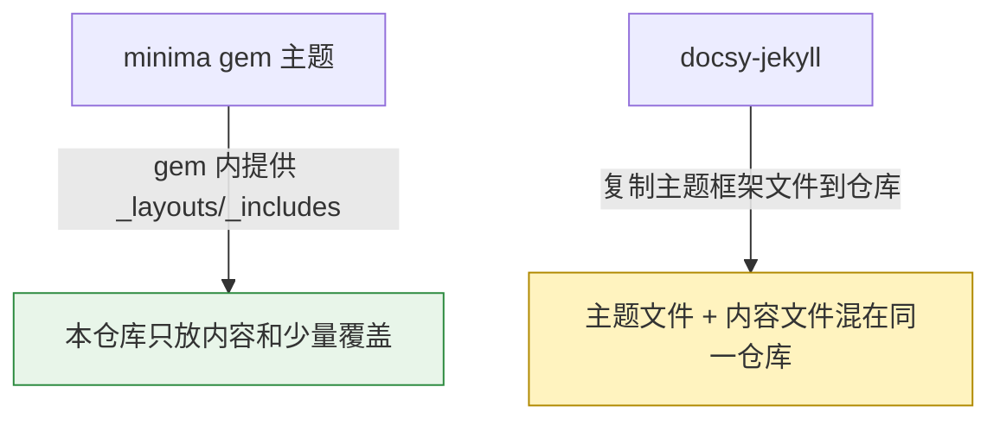
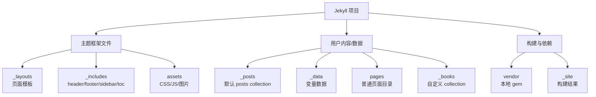
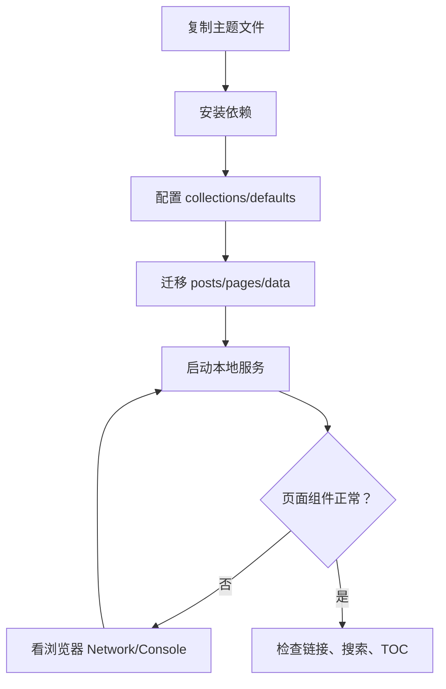

之前利用 GitHub Pages 的便利，用 Jekyll 创建了个人静态网站：

- [Jekyll 博客的 Ruby 环境]()：Bundler 套娃、gem 管理与 GitHub Pages 部署；
- [Jekyll：minima 结构]()：minima 网站架构；
- [Jekyll：minima 自定义]()：以 minima 为例做自定义。

那时用的是 Jekyll 默认主题 minima。

1. Table of Contents, ordered
{:toc}

# 为什么从 minima 换到 docsy-jekyll

minima 很干净，适合学习 Jekyll，但作为长期博客有些不够用：

| 需求 | minima 体验 | docsy-jekyll 体验 |
|------|-------------|-------------------|
| sidebar | 默认没有 | 支持左侧导航 |
| TOC | 需要自己折腾 | 右侧目录更完整 |
| 搜索 | 默认没有 | 支持站内检索 |
| 中文排版 | 标题、引用不太舒服 | 展示更像成熟文档站 |
| tag 页 | 需要自建 | 更容易组织 |

minima 的页面示例：


[docsy-jekyll](https://github.com/vsoch/docsy-jekyll) 更像成熟文档站：


页面渲染更好看，sidebar 能看目录，搜索也好用，这些优势很难拒绝。

# 迁移思路

docsy-jekyll 不是 gem 主题，所以不能像 minima 那样只写：

```yaml
theme: minima
```

它更像是把主题框架文件复制到自己的仓库里。



> 因为 docsy-jekyll 不是 Ruby gem，所以无法“安装主题然后少量覆盖”。主题框架文件和自己的数据放在一起后，目录会显得更乱。
{: .prompt-warning }

我的迁移方式是：不重新 clone 一个全新仓库，而是把 docsy-jekyll 需要的文件拷到原仓库里，这样能保留之前的 Git 提交记录。

# 目录结构

Jekyll 项目的结构可以参考 [Jekyll structure](https://jekyllrb.com/docs/structure/)。

迁移后可以按“框架文件”和“用户数据”区分：



关键点：

- `_layouts` 和 `_includes` 是主题骨架。
- `_data` 用来放变量，不要把所有配置都塞进 `_config.yml`。
- `pages` 只是普通目录，里面的 Markdown/HTML 会被当成 page。
- `_books` 是自定义 collection。

# `_data`：变量文件

`_data` 里的 YAML/JSON/CSV/TSV 会变成 `site.data` 下的变量。参考 [Jekyll data files](https://jekyllrb.com/docs/datafiles/)。

适合放：

- 导航栏配置。
- sidebar 配置。
- 多语言文案。
- 作者、成员、项目列表。

这样模板只负责渲染，数据可以单独维护。

# Collection

Jekyll 默认有 `pages`、`posts`、`drafts`。也可以自己创建 collection。参考 [Jekyll collections](https://jekyllrb.com/docs/collections/)。

## `_books`

在 `_config.yml` 里定义：

```yaml
collections:
  books:
    output: true
    permalink: /:collection/:path
```

对应目录是 `_books`。注意：

- `output: true` 表示这个 collection 的文档会生成页面。
- 自定义 collection 里的文件如果没有 front matter，可能被当成 static file，不会按文档处理。
- `_posts` 是硬编码 collection，不完全受这些规则限制。

## pages、posts、drafts

`pages` 是最基础的页面类型。项目里任何带 front matter 的 Markdown/HTML 都可以成为页面。

docsy-jekyll 使用 `pages/about.md`：

```markdown
---
title: About
permalink: /about/
---

# About
```

这里用 `permalink` 指定 URL 为 `/about/`，否则路径可能是 `/pages/about/`。

# Defaults

可以给 collection 设置默认 front matter：

```yaml
defaults:
  - scope:
      path: "_books"
      type: books
    values:
      layout: page
  - scope:
      path: "_life"
      type: life
    values:
      layout: page
```

字段含义：

| 字段 | 作用 |
|------|------|
| `scope.path` | 限定目录 |
| `scope.type` | 限定 collection 类型 |
| `values` | 给匹配文件补默认 front matter |

默认值非常适合统一设置 layout、comments、toc 等。参考 [Front matter defaults](https://jekyllrb.com/docs/configuration/front-matter-defaults/)。

# 部署与本地启动

## 获取 docsy-jekyll

两种做法：

| 做法 | 优点 | 缺点 |
|------|------|------|
| clone 新仓库再搬文章 | 干净 | 丢原仓库历史或迁移麻烦 |
| 把主题文件拷到原仓库 | 保留历史 | 主题文件和内容混在一起 |

我选择第二种。

## 安装 gem

当时倾向把 gem 安装在本项目下：

```bash
bundle install --path vendor/bundle
```

然后记得把 `vendor` 加到 `.gitignore`。

## 启动

```bash
bundle exec jekyll serve --port 4444
```

打开本地页面后检查：

| 检查项 | 预期 |
|--------|------|
| 首页 | 使用 docsy 布局 |
| sidebar | 左侧导航正常 |
| TOC | 右侧目录正常 |
| 搜索 | 输入关键词有响应 |
| 文章 | 原 `_posts` 能访问 |

# jQuery 加载问题

现象：页面加载很慢，搜索和 TOC 组件都不存在。

排查方式：打开浏览器开发者工具，看 Network 面板，发现 JS 没加载成功。前端问题多用开发者工具 debug，别上来就怀疑人生。

原因：页面引用了：

```text
https://code.jquery.com/jquery-3.3.1.min.js
```

在当时环境里直连不稳定。

解决：

1. 下载 jQuery 到 `assets/js/jquery-3.3.1/`。
2. 搜索引用位置：

   ```bash
   grep -r "https://code.jquery.com/jquery-3.3.1.min.js" . --exclude-dir=_site
   ```

3. 把远程引用替换为本地引用：

   ```html
   
   <script src="{{ site.baseurl }}/assets/js/jquery-3.3.1/jquery-3.3.1.min.js"></script>
   
   ```

这个问题对应的上游讨论见 [docsy-jekyll issue 25](https://github.com/vsoch/docsy-jekyll/issues/25)。

# 导航与页面定制

docsy-jekyll 的几个关键 include：

| 文件 | 作用 | 常见数据来源 |
|------|------|--------------|
| `_includes/header.html` | 顶部导航 | `_data/navigation.yml` |
| `_includes/sidebar.html` | 左边栏 | `_data/toc.yml` |
| `_includes/editable.html` | GitHub 编辑入口 | 页面路径/仓库配置 |
| `_includes/toc.html` | 右侧目录 | 当前页面标题结构 |

定制时优先看 include 的实现，再看它引用了哪些 `_data` 变量。很多时候改数据文件就够了，不必改模板。

单独页面（比如 about、tag）可以放在 `pages` 目录下，通过 front matter 控制 layout、title、permalink。

# 迁移检查清单



最终体验上，docsy-jekyll 比 minima 更像一个完整文档站。不过代价也很明确：主题文件进入仓库后，升级和维护成本更高。换主题这种事，爽是真的爽，后续债也是真的债。
