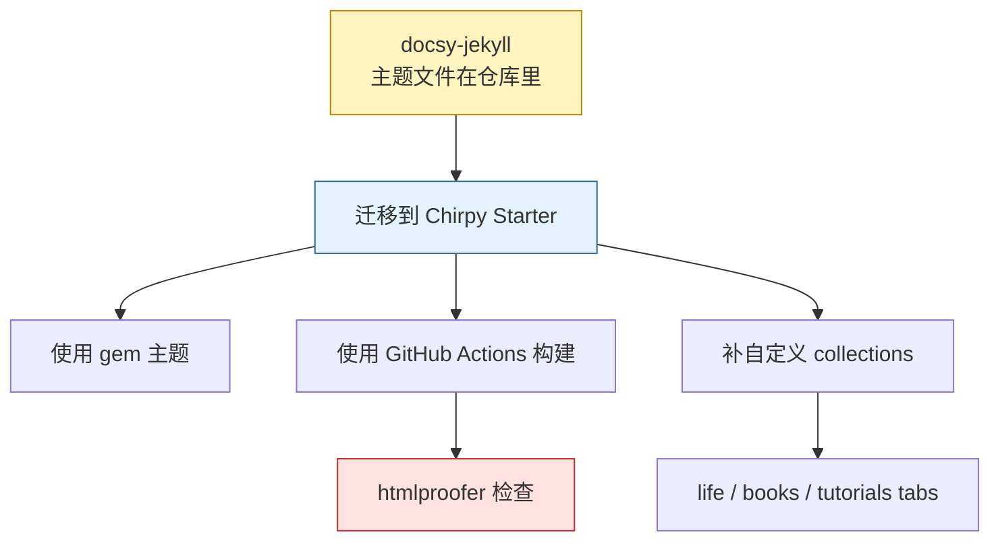
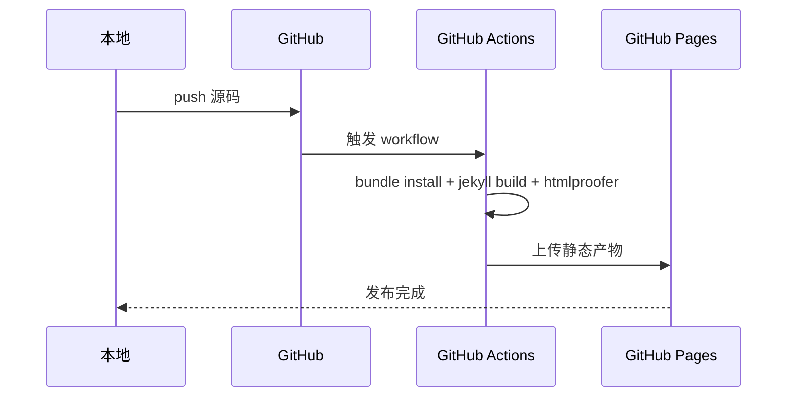
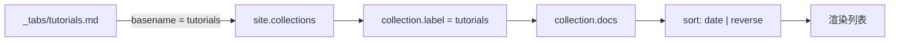
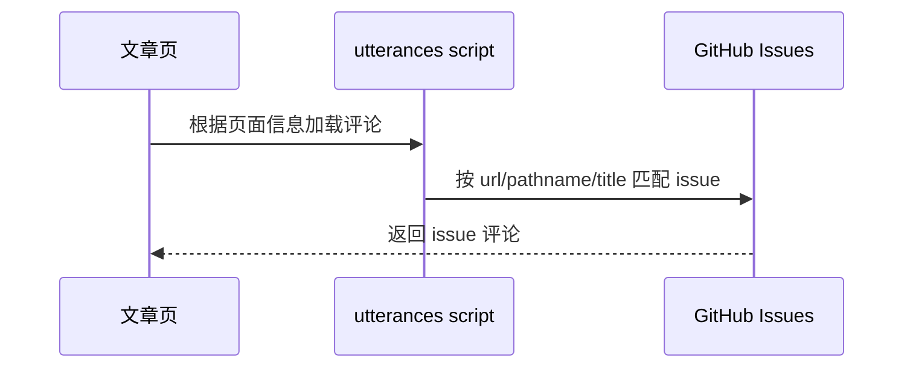

[docsy-jekyll]() 用了三年有余，又厌倦了 :D

> 始乱终弃 +1。也不完全算始乱终弃吧，毕竟中间也帮忙修过 bug。

之前的 Jekyll 折腾记录：

- [Jekyll 博客的 Ruby 环境]()：Bundler 套娃、gem 管理与 GitHub Pages 部署；
- [Jekyll：minima 结构]()：minima 网站架构；
- [Jekyll：minima 自定义]()：以 minima 为例做自定义；
- [docsy-jekyll]()：collection、default layout 与 docsy 迁移。

1. Table of Contents, ordered
{:toc}

# 为什么换 Chirpy

Chirpy 很多功能正好符合我的需求：

- 右侧跟随目录。
- 底部可选 Disqus 或 GitHub 评论。
- 非常迅速的 search as you type，以后想看啥直接搜。
- 代码块支持复制、行号、语法高亮。
- UI 越看越顺眼。

按照 [Chirpy 官方 getting started](https://chirpy.cotes.page/posts/getting-started/)，采用 Chirpy Starter 构建网站。



# 重装与工作流变化

早期想法是：安装 `jekyll-theme-chirpy` gem 后直接启用。但 Chirpy Starter 提供了更多可自定义文件，并带了一套 GitHub Actions workflow。

关键变化是：**它不再走 GitHub Pages 默认构建，而是由 Actions 构建 `_site` 后交给 Pages 托管**。



这意味着 Jekyll 版本、插件版本由 `Gemfile.lock` 和 workflow 控制，而不是 GitHub Pages 的默认白名单。

# Collection 与 tabs

Chirpy 自定义了一个 `tabs` collection，用于侧边栏的 tags/categories/archives/about 等入口：

```yaml
collections:
  tabs:
    output: true
    sort_by: order
```

默认配置里，tabs 使用 page layout：

```yaml
defaults:
  - scope:
      path: ""
      type: tabs
    values:
      layout: page
      permalink: /:title/
```

但每个 tab 仍然可以自己指定 layout。比如 archives：

```yaml
---
layout: archives
icon: fas fa-archive
order: 3
---
```

这说明 defaults 只是默认值，单篇 front matter 可以覆盖它。

# 自定义 collection

我照葫芦画瓢定义了 `life`、`books`、`tutorials` 三种 collection，并在 `_tabs` 下创建同名入口。

难点是：tab 页面怎么展示对应 collection 的文章？

Chirpy 的 `archives` layout 遍历的是 `site.posts`。如果要展示 `_books`，可以复制一份 layout，然后把 `site.posts` 改成 `site.books`。但为了避免每个 collection 都复制一个 layout，更通用的做法是：让 tab 文件名和 collection label 对上。

```liquid



  
    
    
      ...
    
  


```

关系图：



注意：`site.posts` 默认按日期倒序，而其他 collection 默认不是倒序，所以要手动 `sort: 'date' | reverse`。

> 重新构建后网页依旧不变，后来发现是 [Chirpy FAQ 里提到的缓存](https://github.com/cotes2020/jekyll-theme-chirpy/wiki/FAQ)。`Ctrl + F5` 强刷，或者用无痕模式验证。
{: .prompt-warning }

# icon

Chirpy 侧边栏 icon 使用 Font Awesome 类名。`archives` 用的是：

```text
fas fa-archive
```

可以在 [Font Awesome icon reference](https://www.w3schools.com/icons/icons_reference.asp) 找适合 `life`、`books`、`tutorials` 的图标。

# 评论：utterances

之前用的是 Disqus。技术博客更适合用 GitHub 生态，所以换成 [utterances](https://utteranc.es/)。

utterances 的工作方式：



如果用 URL 作为匹配规则，文章 URL 改了，原来的 issue 就匹配不上，再有评论时会创建新 issue。

## collection 也要评论

一开始 `books` 没有 TOC 和 comments。原因是 posts 用 `post` layout，而 books 用的是 `page` layout。Chirpy 的 `post` layout 里配置了：

```yaml
---
layout: default
refactor: true
panel_includes:
  - toc
tail_includes:
  - related-posts
  - post-nav
  - comments
---
```

所以如果某个 collection 也想拥有评论和 TOC，要么使用 `post` layout，要么给它定制等价 layout。

# `lang`

`_config.yml` 可以设置：

```yaml
lang: zh-CN
```

Chirpy 的模板会通过 `site.data.locales[site.lang]` 找语言包。设成 `zh-CN` 后，主页的 tags、categories 都变成中文了。看来多语言支持不是摆设。

日期格式等 Liquid date filter 也会受语言配置影响。

# 站内引用失效

迁移后发现有些站内引用渲染成 404，但写法看着没错。

正常渲染应该类似：

```html
<a href="/posts/springboot-run/">SpringBoot - run</a>
```

异常页面里却出现原始 Liquid：

```html

<a href="">docsy-jekyll</a>

```

搜索 `_site` 后发现没渲染成功的都是 Jekyll 相关文章。原因很尴尬：

```yaml
render_with_liquid: false
```

我在这些文章里禁用了 Liquid 渲染……

结论：不要为了展示 Liquid 代码就禁用全文渲染。应该只对代码片段用 `raw...endraw`，否则 `link`、`post_url` 这类站内引用会一起失效。

# workflow 与 htmlproofer

Chirpy Starter 默认 workflow 里有检查步骤：

```bash
bundle exec htmlproofer _site \
  --disable-external=true \
  --ignore-urls "/^http:\/\/127.0.0.1/,/^http:\/\/0.0.0.0/,/^http:\/\/localhost/"
```

一开始没通过，报错类似：

```text
htmlproofer | Error: Invalid scheme format: 'node：https'
```

排查方式：在生成后的 `_site` 里搜报错内容：

```bash
find _site -type f -exec grep "node：https" {} +
```

果然找到一个复制错的链接：

```markdown
## [节点](node：https://www.elastic.co/guide/en/elasticsearch/reference/current/modules-node.html)
```

还有其他类型：

| 问题 | 例子 | 结果 |
|------|------|------|
| URL scheme 写错 | `node：https://...` | 无效链接 |
| Markdown 误识别 | Scala API 中 `as[U](...)` | 被渲染成坏链接 |
| 空链接 | `[container_evolution]()` | `a` 标签缺少 reference |
| 内部归档不存在 | tag/category 大小写或 collection 不被收集 | 内链 404 |
| tutorial 老图缺失 | 摘录教程但图片未迁移 | 图片 404 |

当时曾经临时跳过 `_tutorials/`。后来把缺失的老截图引用清理掉，最终检查命令可以保持全站覆盖：

```bash
bundle exec htmlproofer _site \
  --disable-external=true \
  --enforce_https=false \
  --ignore-urls "/^http:\/\/127.0.0.1/,/^http:\/\/0.0.0.0/,/^http:\/\/localhost/"
```

> 挺好的，纠了不少错。

这一步的真正价值是：**把“页面看起来能打开”升级为“链接和资源也尽量正确”**。

# categories 与 tags

之前 categories 做得不太好，设置得跟 tags 一样，导致用处不大。更合理的方式是：

- categories：树状目录，少而稳定。
- tags：关键词，细而可检索。

## 大小写坑

`jekyll-archives` 渲染时会 slugify，大小写混用容易生成同一个路径。

例如 `Http` 和 `http` 都可能指向：

```text
/tags/http/
```

构建时会报冲突：

```text
Conflict: The following destination is shared by multiple files.
  /_site/tags/http/index.html
```

Chirpy 的 tags/categories 页面也会使用 `slugify`：

```liquid

{{ t | slugify | url_encode | prepend: '/tags/' | append: '/' | relative_url }}

```

所以 categories/tags 统一小写是必要规范，不只是审美。

# TOC 与 collection

Chirpy 的目录默认从二级标题开始显示，相关讨论见 [Chirpy issue 761](https://github.com/cotes2020/jekyll-theme-chirpy/issues/761#issuecomment-1324501647)。

另一个问题是：post 以外的 collection 如果使用 page layout，可能没有 TOC。解决思路还是回到 layout：要么改用 `post`，要么给 collection 设计一个带 TOC 的 layout。

# 验收清单

| 改动 | 验收方式 |
|------|----------|
| Starter 工作流 | Actions 能构建并部署 |
| collection tabs | `_tabs/<name>.md` 和 collection label 一致 |
| collection 列表 | 日期倒序正常 |
| utterances | 文章底部出现评论区 |
| Liquid 代码 | 代码块显示原始 Liquid，站内链接正常渲染 |
| htmlproofer | 能定位坏链接，而不是只盯着报错发呆 |
| tags/categories | 全部小写，无归档冲突 |

# 感想

终于又了了一件长久以来想做的事情，也终于找到了更理想的模板。

> 还是新的爽 :D
