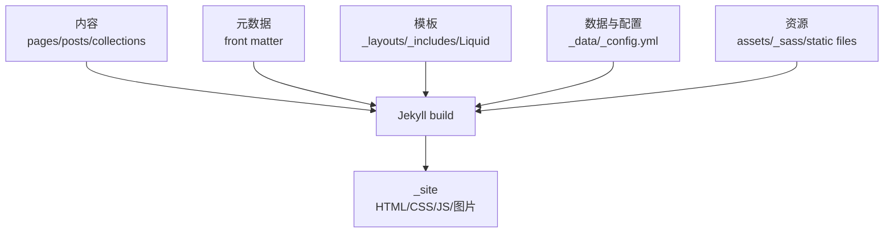
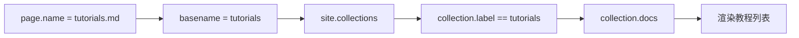
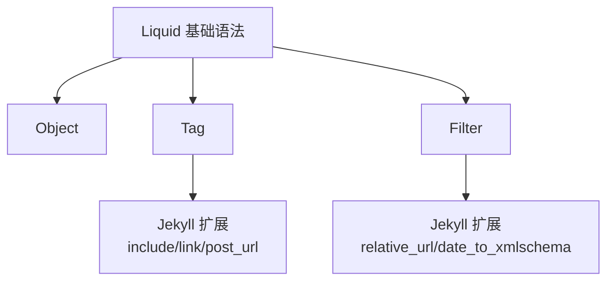
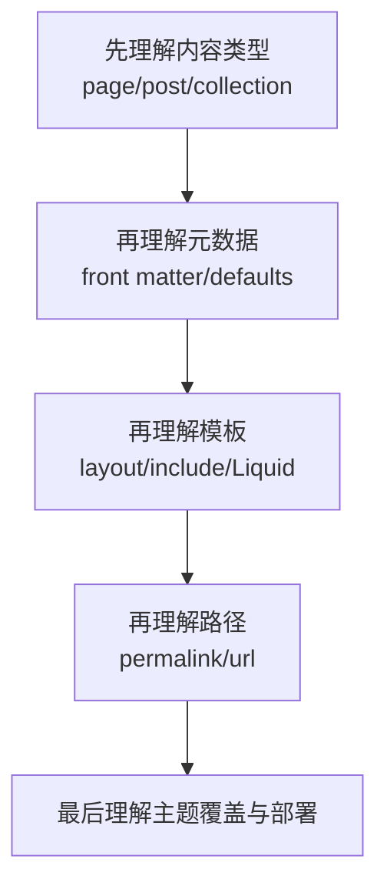

Jekyll 用了这么久，皮肤都换了三套，是时候系统看一下 Jekyll 的架构了。

相关记录：

- [Jekyll 博客的 Ruby 环境]()：Bundler 套娃、gem 管理与 GitHub Pages 部署；
- [Jekyll：minima 结构]()：minima 网站架构；
- [Jekyll：minima 自定义]()：以 minima 为例做自定义；
- [docsy-jekyll]()：collection 和 default layout；
- [jekyll-theme-chirpy]()：collection、utterances、workflow。

1. Table of Contents, ordered
{:toc}

# 总体架构

Jekyll 的核心任务是：把源文件、模板、数据和配置合成一个静态网站。



学习 Jekyll 时，最重要的是把这些概念分层：

| 层 | 概念 | 回答的问题 |
|----|------|------------|
| 内容层 | page / post / collection / draft | 哪些文件会生成页面 |
| 元数据层 | front matter / defaults | 页面有哪些变量 |
| 模板层 | layout / include / Liquid | 页面怎么渲染 |
| 路径层 | permalink / url | 页面生成到哪里 |
| 数据层 | `_data` / `site.data` | 全站结构化数据从哪来 |
| 主题层 | theme / override | 默认文件从哪来，怎么覆盖 |

# Page

page 是 Jekyll 最基础的内容。它和普通静态网站类似：Markdown 或 HTML 文件会生成页面。

```text
.
├── about.md      # => /about.html
├── index.html    # => /
└── contact.html  # => /contact.html
```

有目录时，路径也跟目录相关：

```text
.
├── documentation
│   └── doc1.md   # => /documentation/doc1.html
└── design
    └── draft.md  # => /design/draft.html
```

如果想改变路径，用 `permalink`。

# Post

Jekyll 天然支持博客，文章放在 `_posts`。文件名必须符合：

```text
YEAR-MONTH-DAY-title.MARKUP
```

例如：

```text
2011-12-31-new-years-eve-is-awesome.md
2012-09-12-how-to-write-a-blog.md
```

post 必须有 front matter：

```markdown
---
title: "Welcome to Jekyll!"
---

# Welcome

Hello world.
```

如果 `_config.yml` 里给 posts 设置了默认 layout，单篇就不用重复写。

## 站内链接与资源

引用文章可以用 [Jekyll linking tags](https://jekyllrb.com/docs/liquid/tags/#linking-to-posts)，避免 permalink 改了以后链接失效。

图片、PDF 等静态资源可以直接用 Markdown：

```markdown

[get the PDF](/assets/mydoc.pdf)
```

绝对路径的 `/` 指的是站点根路径，不是 Linux 文件系统根目录。

## `site.posts`

`site.posts` 是所有文章的集合。目录页可以这样写：

```html

<ul>
  
    <li>
      <a href="{{ post.url }}">{{ post.title }}</a>
    </li>
  
</ul>

```

## Tags 与 Categories

tags/categories 定义在 front matter 中，也能从路径推断。

例如：

```text
movies/horror/_posts/2019-05-21-bride-of-chucky.markdown
```

这篇文章会拥有 `movies` 和 `horror` 两个 category。

category 会影响默认 permalink：

```yaml
permalink: /:categories/:year/:month/:day/:title:output_ext
```

如果 front matter 又写了：

```yaml
categories: classic hollywood
```

最终路径可能变成：

```text
movies/horror/classic/hollywood/2019/05/21/bride-of-chucky.html
```

所以 categories 别乱写，它不仅是标签，还会影响路径。

## Excerpt

post 支持摘要，默认取第一段。也可以定义 `excerpt_separator`：

```markdown
---
excerpt_separator: <!--more-->
---

Excerpt with multiple paragraphs.

<!--more-->

Out-of-excerpt.
```

目录页可以输出：

```html

{{ post.excerpt }}

```

## Draft

草稿放在 `_drafts`，文件名不需要日期：

```text
_drafts/a-draft-post.md
```

默认不会发布。预览草稿：

```bash
bundle exec jekyll serve --drafts
```

# Front Matter

所有带 YAML front matter 的文件都会被 Jekyll 处理。

```markdown

---
title: Blogging Like a Hacker
name: puppylpg
---

<h1>{{ page.name | downcase }}</h1>

```

front matter 变量可以通过 `page` 访问。常见预定义变量：

| 变量 | 作用 |
|------|------|
| `layout` | 使用哪个 layout |
| `permalink` | 自定义 URL |
| `published` | 是否发布 |
| `date` | post 发布时间 |
| `categories` | post 分类 |
| `tags` | post 标签 |

## Defaults

经常重复的 front matter 可以放在 `_config.yml` 的 defaults：

```yaml
defaults:
  - scope:
      path: ""
      type: posts
    values:
      layout: post
      author: puppylpg
```

参考 [Front matter defaults](https://jekyllrb.com/docs/configuration/front-matter-defaults/)。

# Collection

除了默认的 `pages`、`posts`、`drafts`，也可以自定义 collection。

```yaml
collections:
  books:
    output: true
    permalink: /:collection/:path

defaults:
  - scope:
      path: _books
      type: books
    values:
      layout: page
      comments: true
```

关键点：

- `output: true` 才会生成页面。
- 对应目录是 `_books`。
- `site.books` 可以遍历文档。
- `site.collections` 会包含所有 collection，posts 是硬编码的一种。

Chirpy 的 `tabs` 就是 collection：

```yaml
collections:
  tabs:
    output: true
    sort_by: order
```

`sort_by` 可以按 front matter 字段排序。

## 做 collection 目录页

如果 `_tabs/tutorials.md` 的文件名和 collection label 一致，就可以动态找到对应 collection：

```liquid



  
    
    
      <a href="{{ collect_doc.url | relative_url }}">{{ collect_doc.title }}</a>
    
  


```



# `_data`

`_data` 用来放结构化变量。所有 YAML/JSON/CSV/TSV 文件都能通过 `site.data` 访问。

例如 `_data/members.yml`：

```yaml
- name: Eric Mill
  github: konklone
- name: Parker Moore
  github: parkr
```

模板里：

```html

<ul>

  <li>
    <a href="https://github.com/{{ member.github }}">
      {{ member.name }}
    </a>
  </li>

</ul>

```

Chirpy 的多语言 tabs 就是 `_data/locales/zh-CN.yml` 这种结构：

```yaml
tabs:
  home: 首页
  categories: 分类
  tags: 标签
  archives: 归档
  about: 关于
```

# 静态文件与 Sass

没有 front matter 的文件属于 static files，可以通过 `site.static_files` 获取。参考 [Jekyll static files](https://jekyllrb.com/docs/static-files/)。

还可以在 defaults 中给静态文件补变量：

```yaml
defaults:
  - scope:
      path: "assets/img"
    values:
      image: true
```

模板中筛选：

```html



  {{ myimage.path }}


```

Sass 资源见 [Jekyll assets](https://jekyllrb.com/docs/assets/)。当时只想写一句：不懂。但现在至少知道它属于资源构建层。

# 目录结构总览

典型结构：

```text
.
├── _config.yml
├── _data
│   └── members.yml
├── _drafts
├── _includes
│   ├── footer.html
│   └── header.html
├── _layouts
│   ├── default.html
│   └── post.html
├── _posts
│   └── 2009-04-26-barcamp-boston-4-roundup.md
├── _sass
├── _site
├── .jekyll-cache
├── .jekyll-metadata
└── index.md
```

以 `.` 开头的文件默认会被忽略。想加入构建结果，要在 `_config.yml` 中显式配置 `include`；想排除文件，用 `exclude`。

# Liquid

Jekyll 使用 [Liquid](https://shopify.github.io/liquid/) 模板语言。

Liquid 有三类核心语法：

| 类型 | 语法 | 作用 |
|------|------|------|
| Object | `&#123;&#123; page.title &#125;&#125;` | 输出变量 |
| Tag | `&#123;% if page.show_sidebar %&#125;` | 控制逻辑 |
| Filter | `&#123;&#123; "hi" \| capitalize &#125;&#125;` | 转换数据 |

Jekyll 在 Liquid 之上扩展了一些 tag/filter，例如 `include`、`link`、`post_url`、`relative_url`、日期格式化等。



代码高亮可以用 Jekyll 的 `highlight` tag：

```liquid


def foo
  puts 'foo'
end


```

不过实际写文章时，用 Markdown fenced code block 更简单。

# Variables

Jekyll 的变量分好几类，参考 [Jekyll variables](https://jekyllrb.com/docs/variables/)：

- `site`
- `page`
- `layout`
- `theme`
- `content`
- `paginator`
- collection 和 document 对象

判断变量属于哪一类，基本就知道模板里应该从哪里取值。

# Layout

layout 文件放在 `_layouts`。可以继承：

```yaml
---
layout: default
---
```

子 layout 的内容会填入父 layout 的 `content` 插槽。这就是 minima 和 Chirpy 都大量使用的模板分层。

# Permalink

permalink 决定最终页面路径。post 默认类似：

```yaml
permalink: /:categories/:year/:month/:day/:title:output_ext
```

对 page 和普通 collection 来说，没有 post 那套日期和 category 语义，可用 placeholder 不同。参考 [Jekyll permalinks](https://jekyllrb.com/docs/permalinks/)。

实践上只要记住两步：

1. 页面根据 permalink 生成 URL。
2. 模板用 `page.url`、`post.url` 或 `relative_url` 渲染链接。

# Theme

Jekyll 主题如果以 gem 安装，可以被本地同路径文件覆盖。参考 [Jekyll themes](https://jekyllrb.com/docs/themes/)。

> Jekyll 会先找站点本地文件，再找主题默认文件。

可覆盖目录包括：

- `/assets`
- `/_data`
- `/_layouts`
- `/_includes`
- `/_sass`

这非常强大，也意味着每一个本地覆盖文件都是升级主题时的手动合并债务。

# 学习路径



Jekyll 不难，但概念多。把这些概念分层之后，遇到问题就能定位到是哪一层：内容没被识别、变量没传进去、模板没渲染、路径不对、还是主题覆盖没生效。

# 感想

后面可以考虑搞个 CI，[自动部署](https://jekyllrb.com/docs/deployment/)到自己的小服务器上。
